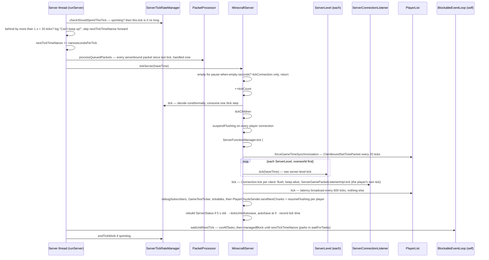

# The server tick

> Verified against **Minecraft 26.2** · Part III · One 50 ms tick on the Server thread: from the moment the clock says "now" to the moment the thread parks again.

## Responsibility

The server tick is the heartbeat every other server-side page lives inside.
Twenty times a second `MinecraftServer` drains the packets that arrived since
last time, advances every `ServerLevel` by one step, flushes what each player
needs to be told, and then spends whatever is left of the 50 ms running
deferred work before parking until the next beat. Everything the server owns —
chunks, entities, block ticks, player sessions — is touched only from inside
this loop, on this thread.

The one sentence a player recognises: *TPS is how many of these the server
finishes per second, and "Can't keep up!" is the server giving up on the
ones it missed.*

## The data it owns

- `MinecraftServer` is the loop, the thread and the event loop in one object:
  it extends `ReentrantBlockableEventLoop` (of `TickTask`), and
  `MinecraftServer.spin` creates the *Server thread* whose body is
  `MinecraftServer.runServer`. Its scheduling state is a handful of fields:
  `MinecraftServer.tickCount` (the tick number, stamped onto every queued
  task), `MinecraftServer.nextTickTimeNanos` (the deadline the loop is
  chasing), `MinecraftServer.delayedTasksMaxNextTickTimeNanos` and
  `MinecraftServer.mayHaveDelayedTasks` (how late deferrable work may run),
  `MinecraftServer.ticksUntilAutosave`, and the tick-time ledger:
  `MinecraftServer.tickTimesNanos` (a 100-slot ring),
  `MinecraftServer.aggregatedTickTimesNanos` (their sum) and
  `MinecraftServer.smoothedTickTimeMillis` (an exponential average,
  `MinecraftServer.AVERAGE_TICK_TIME_SMOOTHING` = 0.8). `/tick query` and the
  F3 charts read these; nothing else writes them.
- `TickTask` — a `Runnable` plus the `MinecraftServer.tickCount` it was submitted on. Every
  task handed to the server from another thread becomes one through
  `MinecraftServer.wrapRunnable`; `MinecraftServer.shouldRun` lets a task
  run when there is spare time *or* when it is more than
  `MinecraftServer.MAX_TICK_LATENCY` (3) ticks old — so a saturated server
  still drains its queue, just late.
- `ServerTickRateManager` (extends the shared `TickRateManager`, which the
  client also has inside `ClientLevel`) owns the tick *rate*:
  `TickRateManager.nanosecondsPerTick`, `TickRateManager.isFrozen`,
  `TickRateManager.frozenTicksToRun` (for `/tick step`) and the sprint
  bookkeeping (`ServerTickRateManager.remainingSprintTicks`,
  `ServerTickRateManager.sprintTickStartTime`). The one bit the rest of the
  server reads is `TickRateManager.runsNormally`: "should game elements
  advance this tick".
- `PacketProcessor` — a `ConcurrentLinkedQueue` of listener/packet pairs
  (`PacketProcessor.ListenerAndPacket`) that Netty threads fill and the
  Server thread empties. There is one per server
  (`MinecraftServer.packetProcessor`) and one per client
  (`Minecraft.packetProcessor`).
- `ServerClockManager` — new in this generation: world time is a set of
  clocks stored as saved data, ticked from the server, not from the level,
  and gated on the `GameRules.ADVANCE_TIME` rule.

## When it runs

On the *Server thread*, always. The loop is `MinecraftServer.runServer`; a
single iteration is one tick plus the wait for the next. The subtlety is
that the thread never idles: the "wait" is `MinecraftServer.waitUntilNextTick`,
which runs `BlockableEventLoop.runAllTasks` and then
`BlockableEventLoop.managedBlock` on the condition "no time left", and
`BlockableEventLoop.managedBlock` keeps polling the task queue while it waits. The chunk
system's main-thread queue (`ServerChunkCache.MainThreadExecutor`, one per
level) is drained from the same place: `MinecraftServer.pollTaskInternal`
polls the server's own queue first and then every level's chunk source when
there is time, is sprinting, or is blocked. So chunk-load results, lighting
results and anything a worker thread posted back land on the Server thread
either during the tick (when a level blocks on a chunk) or in the slack
after it.

The budget is a `BooleanSupplier`, `MinecraftServer.haveTime`, passed down to
`MinecraftServer.tickServer` and from there into every `ServerLevel.tick`:
"is now still before the deadline". While sprinting the supplier is the
constant false, so deferrable work is skipped and ticks run back to back.

## The trace: one 50 ms tick

Narrated:

1. **The deadline moves first, then the work starts.** `MinecraftServer.runServer` computes
   this tick's length from `ServerTickRateManager` — 50 ms at the default
   rate, zero while sprinting — and adds it to `MinecraftServer.nextTickTimeNanos` *before*
   ticking. Being "behind" means the wall clock has passed that deadline. If
   it has passed by more than one second plus twenty ticks' worth
   (`MinecraftServer.OVERLOADED_THRESHOLD_NANOS` and
   `MinecraftServer.OVERLOADED_TICKS_THRESHOLD`), the loop logs the overload
   warning — at most once every ten seconds plus a hundred ticks — and
   **advances the deadline past the backlog**. The missed ticks are gone.
2. **Packets, all of them, before anything else.** `MinecraftServer.processPacketsAndTick`
   calls `PacketProcessor.processQueuedPackets`. A serverbound packet was
   decoded on a Netty thread and its handler called
   `PacketUtils.ensureRunningOnSameThread`, which queued it here and aborted
   the Netty-side handler by throwing `RunningOnDifferentThreadException`
   ([Anatomy](../anatomy/anatomy.md) has the crossing). Each queued pair is
   re-checked with `PacketListener.shouldHandleMessage` — a player who
   disconnected between arrival and handling is dropped here — and then
   handled. This is the only point in the tick where player input enters.
3. **An empty dedicated server does not tick.** `MinecraftServer.tickServer`
   first asks `MinecraftServer.pauseWhenEmptySeconds` (the
   `DedicatedServerProperties` value, default 60; zero on the base class):
   once `MinecraftServer.emptyTicks` reaches it the server autosaves once,
   then runs only `MinecraftServer.tickConnection` and returns without
   incrementing `MinecraftServer.tickCount`. The integrated server has its own version:
   `IntegratedServer.tickServer` sets `IntegratedServer.paused` from
   `Minecraft.isPaused` and the player count, saves on the transition, and
   runs `IntegratedServer.tickPaused` instead.
4. **The rate manager decides what "runs" this tick.** `TickRateManager.tick`
   computes `TickRateManager.runGameElements` — true unless frozen, or frozen with steps left
   from `/tick step` — and decrements the step counter. `MinecraftServer.tickCount` still
   increments while frozen; freezing gates content, not the loop.
5. **`MinecraftServer.tickChildren` is the tick.** In order, each under its own profiler
   section: every player's connection has flushing suspended
   (`ServerCommonPacketListenerImpl.suspendFlushing`); data-pack functions
   (`ServerFunctionManager.tick` runs `#minecraft:load` once after a reload,
   then `#minecraft:tick` every tick — only if `TickRateManager.runsNormally`); the clocks
   (`ServerClockManager.tick`, same gate); a `ClientboundSetTimePacket` to
   everyone every 20 ticks (`MinecraftServer.forceGameTimeSynchronization`);
   then `MinecraftServer.updateEffectiveRespawnData` and **each
   `ServerLevel.tick`** in `MinecraftServer.getAllLevels` order, overworld
   first — the subject of [the level tick](server-level-tick.md). A throwable
   from a level becomes a `ReportedException` ("Exception ticking world") and
   ends the server.
6. **Connections tick after levels — and that is where players tick.**
   `MinecraftServer.tickConnection` → `ServerConnectionListener.tick` walks
   every `Connection` under a lock: `Connection.tick` flushes the outbound
   queue, ticks its `TickablePacketListener` — for a playing client that is
   `ServerGamePacketListenerImpl.tick`, which runs the `ServerPlayer`'s own
   per-tick logic, the spam throttles and the 15-second keep-alive
   (`ServerCommonPacketListenerImpl.LATENCY_CHECK_INTERVAL`) — and drops dead
   connections with `Connection.handleDisconnection`. `DedicatedServer.tickConnection`
   adds `DedicatedServer.handleConsoleInputs`, which is how console and RCON
   commands reach the Server thread. `PlayerList.tick` itself only broadcasts
   a `ClientboundPlayerInfoUpdatePacket` of latencies every
   `PlayerList.SEND_PLAYER_INFO_INTERVAL` (600) ticks.
7. **Chunks go out last, in one flush.** After `ServerDebugSubscribers.tick`,
   `GameTestTicker.tick` and the `MinecraftServer.tickables` (the dedicated
   server GUI's refresh), every player's `PlayerChunkSender.sendNextChunks`
   runs and `ServerCommonPacketListenerImpl.resumeFlushing` releases the
   connection. Everything the tick decided to tell a client — entity
   movement, block changes, chunks — leaves the JVM as one write per client
   per tick.
8. **Bookkeeping.** `MinecraftServer.buildServerStatus` is rebuilt if the
   cached one is over `MinecraftServer.STATUS_EXPIRE_TIME_NANOS` (5 s) old;
   `MinecraftServer.ticksUntilAutosave` counts down to `MinecraftServer.autoSave`; the
   tick's duration replaces its slot in `MinecraftServer.tickTimesNanos`, updates the
   aggregate and the smoothed millis, and — when tick-time logging is on —
   goes to the `SampleLogger` in the `TpsDebugDimensions` layout
   (`TpsDebugDimensions.FULL_TICK`, `TpsDebugDimensions.TICK_SERVER_METHOD`, `TpsDebugDimensions.SCHEDULED_TASKS`, `TpsDebugDimensions.IDLE`).
9. **The slack is spent, not slept.** `MinecraftServer.waitUntilNextTick`
   marks `MinecraftServer.mayHaveDelayedTasks` and runs tasks until `MinecraftServer.haveTime` is false,
   then `MinecraftServer.waitForTasks` parks the thread with
   `LockSupport` until `MinecraftServer.nextTickTimeNanos` (or 100 µs at a time,
   `BlockableEventLoop.BLOCK_TIME_NANOS`, when not waiting on a tick). When
   sprinting, `ServerTickRateManager.endTickWork` counts the tick down and
   `ServerTickRateManager.finishTickSprint` prints the measured rate when the
   sprint ends.

## Interfaces

- **Called by:** `MinecraftServer.runServer` only. `DedicatedServer` and
  `IntegratedServer` override pieces — `DedicatedServer.tickServer` adds the
  JSON-RPC `ManagementServer.tick`, `DedicatedServer.tickConnection` the
  console, `IntegratedServer.tickServer` the pause — never the loop.
- **Calls into:** `ServerLevel.tick` (Part III), `ServerConnectionListener.tick`
  (Part IX), `ServerFunctionManager.tick` (Part XII), `PlayerList`,
  `ServerClockManager`, `GameTestTicker`.
- **Crosses the network as:** `ClientboundSetTimePacket` (every 20 ticks);
  `ClientboundTickingStatePacket` (rate and frozen flag, sent by
  `ServerTickRateManager.setTickRate` / `ServerTickRateManager.setFrozen`
  and to each joining player by `ServerTickRateManager.updateJoiningPlayer`)
  and `ClientboundTickingStepPacket` (from `ServerTickRateManager.stepGameIfPaused`);
  `ClientboundPlayerInfoUpdatePacket` with latencies every 600 ticks;
  `ClientboundDisconnectPacket` when a handler throws. Sprinting is not
  signalled as such — the client only sees the unfreeze before and the
  refreeze after.
- **Data-driven by:** `server.properties` through `DedicatedServerProperties`
  (`pause-when-empty-seconds`, `max-tick-time`); the `GameRules.ADVANCE_TIME`
  rule; the `#minecraft:tick` and `#minecraft:load` function tags.

## Invariants and surprises

- **"Can't keep up!" is the server *skipping* ticks, not catching up.**
  `MinecraftServer.runServer` moves `MinecraftServer.nextTickTimeNanos` forward over the backlog; there is no
  burst of extra ticks afterwards. And it only logs when more than two
  seconds behind, so a server that is consistently 40 % late never says so.
- **Packets are handled at the top of the tick, in one batch, and player
  ticks happen *after* the levels.** So a player's movement packet is
  applied before the world ticks, but the player entity's own
  `ServerGamePacketListenerImpl.tick` runs under the *connection* section,
  after every `ServerLevel.tick` has already run. Entities in the level
  see the player where the packets put them; the player ticks against the
  world's new state.
- **Outbound packets leave once per tick per client.** `ServerCommonPacketListenerImpl.suspendFlushing` at
  the top of `MinecraftServer.tickChildren`, `ServerCommonPacketListenerImpl.resumeFlushing` after chunk sending; between
  them `Connection.send` only queues. The exception is a send from a thread
  that is not the Server thread, which flushes immediately.
- **Sprint is a zero-length tick.** Not a shorter one: `TickRateManager.nanosecondsPerTick`
  is unchanged, `MinecraftServer.runServer` just declares this tick 0 ns long, `MinecraftServer.haveTime`
  becomes a constant false, and the overload check is skipped. Sprinting
  also temporarily unfreezes (`ServerTickRateManager.requestGameToSprint`)
  and restores the previous frozen state at the end.
- **Freeze keeps the loop, the connections and the players running.**
  `TickRateManager.isEntityFrozen` exempts players and anything carrying a
  player; everything else that checks `TickRateManager.runsNormally` — functions, clocks,
  weather, block and fluid ticks, other entities, game tests — stops.
- **Autosave is five wall-clock minutes, not 6000 ticks.** The first
  interval is `MinecraftServer.AUTOSAVE_INTERVAL` (6000); every one after is
  `MinecraftServer.computeNextAutosaveInterval` = tick rate × 300, floored
  at `MinecraftServer.MIMINUM_AUTOSAVE_TICKS` (100 — the typo is Mojang's),
  and `MinecraftServer.onTickRateChanged` re-derives it when `/tick rate`
  changes.
- **`ServerLevel.emptyTime` is a per-dimension sleep.** A level with no
  active tickets (`ServerChunkCache.hasActiveTickets`) counts up; after 300
  such ticks it stops ticking entities and block entities entirely, while
  still running chunk-source and block-event work. An empty Nether costs
  almost nothing.
- **The watchdog reads the deadline, not the tick.** `ServerWatchdog`
  compares the wall clock to `MinecraftServer.getNextTickTime`; a single
  tick longer than `DedicatedServerProperties.maxTickTime` (default 60 s)
  halts the JVM. See [Server lifecycle](server-lifecycle.md).
- **The tick loop is instrumented in Tracy.** `MinecraftServer.tickFrame` is a
  `DiscontinuousFrame` from `TracyClient`, opened and closed around
  `MinecraftServer.tickServer`; the JFR path is `JvmProfiler.onServerTick`.

## Where to look

`MinecraftServer.runServer` · `MinecraftServer.tickServer` ·
`MinecraftServer.tickChildren` · `MinecraftServer.waitUntilNextTick` ·
`MinecraftServer.haveTime` · `TickTask` · `ReentrantBlockableEventLoop`
· `BlockableEventLoop` · `PacketProcessor` · `PacketUtils` ·
`TickRateManager` · `ServerTickRateManager` · `TickCommand` ·
`ServerConnectionListener` · `ServerCommonPacketListenerImpl` ·
`IntegratedServer` · `DedicatedServer` · `ServerClockManager`

---

*Rules: names, never code · how the system works, not how the code reads ·
newest version only · every backticked name passes `tools/verify_names.py`.*
