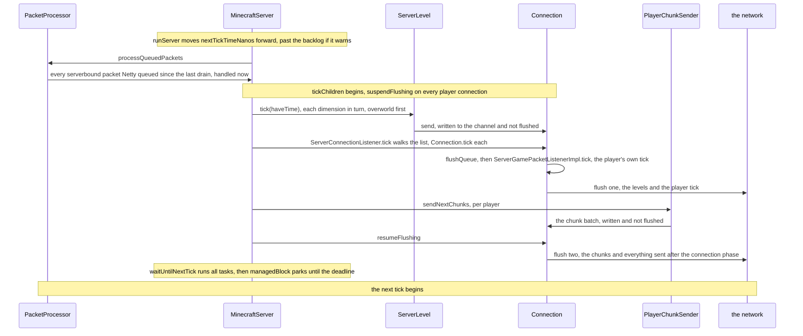
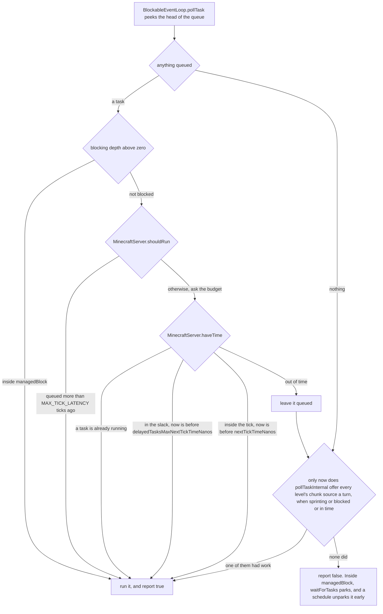

# The server tick

> Verified against **Minecraft 26.2** · Part III · One 50 ms tick on the Server thread, from the moment the clock says *now* to the moment the thread parks again.

Twenty times a second the Server thread wakes, hands every packet that
arrived since it last looked to the code that answers it, advances every
dimension by one step, pushes what each player needs to know onto the wire,
and then spends whatever is left of its 50 ms on work other threads posted
back before parking until the next beat. Everything a player calls *the
world* — blocks, mobs, weather, the contents of a chest — is computed in
plenty of places and **committed** in this one, on this one thread. When a
lap runs long the console eventually prints *Can't keep up! Is the server
overloaded?*, and that line is not a warning that the server is about to
start missing ticks. `MinecraftServer.runServer` logs it and advances the
deadline past the whole backlog inside the same *if*, so the message **is**
the skip; because the log and the skip share one condition, a server that
complained recently keeps running behind rather than skipping at all. And the
ticks it does skip are simply gone — nothing runs them later, so game time
ends up that many ticks younger than the wall clock and stays there.

## The cast

| class | what it decides | thread |
|---|---|---|
| `MinecraftServer` | the loop, the thread and the event loop in one object: the deadline, the budget, and the order everything happens in | Server |
| `ServerTickRateManager` | how long this tick is, whether game elements advance at all, and whether the loop is sprinting | Server |
| `TickTask` | one queued runnable plus the `MinecraftServer.tickCount` it was submitted on — the age the budget reads | any thread submits, Server runs |
| `PacketProcessor` | which serverbound packets are waiting, and that all of them are handled at the top of a tick | Netty fills it, Server empties it |
| `ServerLevel` | one dimension's step — [a lecture of its own](server-level-tick.md) | Server |
| `ServerConnectionListener` | which connections are still alive, and when each one's player takes its own tick | Server |
| `ServerCommonPacketListenerImpl` | whether a packet handed to a player is written, or written *and* flushed | Server, mostly |
| `ServerChunkCache.MainThreadExecutor` | what the leftover milliseconds buy, one queue per level | Server |

## One lap, ending on the wire

### The deadline moves before the work starts

`MinecraftServer.runServer` re-reads this tick's length every iteration from
`TickRateManager.nanosecondsPerTick` and adds it to
`MinecraftServer.nextTickTimeNanos` *before* calling anything. Being behind
means the wall clock has already passed that field. The overload branch fires
when it has passed by more than `MinecraftServer.OVERLOADED_THRESHOLD_NANOS`
(one second) plus `MinecraftServer.OVERLOADED_TICKS_THRESHOLD` ticks' worth —
two seconds at the default rate — **and** the last warning is at least
`MinecraftServer.OVERLOADED_WARNING_INTERVAL_NANOS` (ten seconds) plus
`MinecraftServer.OVERLOADED_TICKS_WARNING_INTERVAL` ticks' worth behind it,
fifteen seconds at the default rate. Both effects — the log line, and
`MinecraftServer.nextTickTimeNanos` jumping over the missed ticks — are
statements of that one branch. Lateness therefore has to *accumulate* before
either happens: a server running every lap ten percent long says nothing while
the shortfall piles up, then warns and drops the pile in one step. And because
`MinecraftServer.lastOverloadWarningNanos` is set to the new deadline, the
second gate is fifteen seconds of the server's *own* scheduled time — which on
an overloaded server is rather more than fifteen seconds of yours. In between,
the backlog is real and every tick of it is run.

Sprinting takes the other arm of the same *if*: when the server is not paused,
`ServerTickRateManager.isSprinting` is true and
`ServerTickRateManager.checkShouldSprintThisTick` consents, this tick is
declared **zero nanoseconds long** and `MinecraftServer.nextTickTimeNanos` is
set to *now*. `TickRateManager.nanosecondsPerTick` still reads 50 ms
throughout — a sprint changes the length of *this tick*, gives the overload
check nothing to measure, and sends the loop straight back for another. Sprinting also unfreezes the game —
`ServerTickRateManager.requestGameToSprint` remembers the old state in
`ServerTickRateManager.previousIsFrozen` — and restores it when
`ServerTickRateManager.finishTickSprint` reports the measured rate.

### Every packet since last time, in one drain

`MinecraftServer.processPacketsAndTick` opens the Tracy frame, then calls
`PacketProcessor.processQueuedPackets` — before `MinecraftServer.tickServer`,
so the frame a profiler shows includes the packets. Each entry in that
`ConcurrentLinkedQueue` is a `PacketProcessor.ListenerAndPacket`: a Netty
thread decoded the packet, the handler called
`PacketUtils.ensureRunningOnSameThread`, and that queued the pair here and
aborted the Netty-side call by throwing `RunningOnDifferentThreadException`
([the connection](../networking/the-connection.md#the-threads-underneath-it)
has the crossing, in both directions). This is where most
player input enters the world, but not all of it: the handlers that never
call `PacketUtils.ensureRunningOnSameThread` hop by the other door instead.
`ServerGamePacketListenerImpl.handleChat` and both command packets run their
work through `MinecraftServer.execute`, and filtered sign and book text comes
back on a `CompletableFuture` completed against the server — so chat and
commands arrive as *tasks*, drained by the event loop below, and not with the
packets.

Two gates sit on each queued pair. `PacketListener.shouldHandleMessage` is
asked again at handling time, so a player who disconnected between arrival and
now is dropped with a debug line rather than handled into a dead session. And
a handler that throws does not end the tick: `ServerPacketListener` overrides
`PacketListener.onPacketError` to log *"suppressing error"* and return, and
`ServerCommonPacketListenerImpl.onPacketError` additionally files the
throwable through `MinecraftServer.reportPacketHandlingException` into the
`SuppressedExceptionCollector` that the next crash report dumps. The one
escape is a `ReportedException` wrapping an *OutOfMemoryError*, which
`PacketUtils.makeReportedException` rethrows.

### An empty server stops ticking

Before anything else `MinecraftServer.tickServer` compares
`MinecraftServer.emptyTicks` against `MinecraftServer.pauseWhenEmptySeconds`
times twenty — the *pause-when-empty-seconds* property, default 60 in
`DedicatedServerProperties`, and zero on the base class, which disables the
feature. The counter advances only while nobody is online *and* the loop is
not sprinting; on the tick it first reaches the threshold the server logs,
autosaves once, and from then on runs `MinecraftServer.tickConnection` alone
and returns. `MinecraftServer.tickCount` does not advance, so a paused server
is stopped in every sense that matters and still answers pings.

The integrated server pauses on a different signal.
`IntegratedServer.tickServer` sets `IntegratedServer.paused` from
`Minecraft.isPaused` or an empty player list, saves once on the way in, runs
`IntegratedServer.tickPaused` — connections plus one statistic — instead of
the real tick, and re-syncs the world time on the way out. It also copies the
client's render and simulation distance into the `PlayerList` on every
unpaused tick, which is why singleplayer has no separate view-distance
setting.

### What `MinecraftServer.tickChildren` runs, and in what order

`MinecraftServer.tickChildren` is the tick, and the rows below are its
order. All but the first are a profiler section of their own; suspending the
flush has none, and the debug row is three:

| in order | what it does | skipped when |
|---|---|---|
| suspend flushing | `ServerCommonPacketListenerImpl.suspendFlushing` on every player's connection | never |
| command functions | `ServerFunctionManager.tick` runs `ServerFunctionManager.LOAD_FUNCTION_TAG` once after a reload, then `ServerFunctionManager.TICK_FUNCTION_TAG` | frozen |
| clocks | `ServerClockManager.tick` advances the world clocks, a `SavedData` kept in the *world_clocks* file | frozen, or `GameRules.ADVANCE_TIME` is off |
| time sync | `MinecraftServer.forceGameTimeSynchronization` broadcasts a `ClientboundSetTimePacket` | not a multiple of 20 ticks |
| levels | `MinecraftServer.updateEffectiveRespawnData`, then `ServerLevel.tick` for each dimension in `MinecraftServer.getAllLevels` order, overworld first | never |
| connection | `MinecraftServer.tickConnection` — every `Connection`, and each playing client's own tick | never |
| players | `PlayerList.tick` broadcasts a latency-only `ClientboundPlayerInfoUpdatePacket` | its own counter has not passed 600 — so every 601st call, not every 600th tick |
| debug, game tests, tickables | `ServerDebugSubscribers.tick`, `GameTestTicker.tick`, the dedicated server GUI's refresh through `MinecraftServer.addTickable` | game tests alone, when frozen |
| send chunks | `PlayerChunkSender.sendNextChunks`, then `ServerCommonPacketListenerImpl.resumeFlushing`, per player | never |

A throwable out of `ServerLevel.tick` is caught, filled with the level's
details as *"Exception ticking world"* and rethrown as a `ReportedException`
— which is how one bad dimension ends the whole server. Nothing else in the
list is wrapped. Two things a reader looks for here are elsewhere: the
`/schedule` queue is a `TimerQueue` the server owns and persists
(`MinecraftServer.getScheduledEvents`) but ticks from inside
`ServerLevel.tickTime`, which runs in the overworld alone and off the
overworld's *gameTime* ([the level
tick](server-level-tick.md#sleeping-is-the-one-thing-a-freeze-cannot-stop)), and the last
statement of `MinecraftServer.tickChildren` is `ServerActivityMonitor.tick`,
a rate-limited nudge to the `NotificationManager` rather than anything the
world can see.

### Where a player's own tick actually happens

The connection phase runs *after* every level.
`ServerConnectionListener.tick` walks its synchronized list and, for each live
`Connection`, calls `Connection.tick`: flush the deferred send queue, tick the
`TickablePacketListener`, drop the connection if it has died, flush the
channel, and every twentieth tick recompute the packet-rate averages. For a
playing client that listener is `ServerGamePacketListenerImpl`, whose
`ServerGamePacketListenerImpl.tick` acknowledges pending block changes, runs
`ServerPlayer.doTick` through `ServerGamePacketListenerImpl.tickPlayer`, and
then, only if that returns without having kicked anyone, three more things
in this order: the fifteen-second keep-alive
(`ServerCommonPacketListenerImpl.LATENCY_CHECK_INTERVAL`), the three spam
throttles, and the idle-timeout check.

So a movement packet is applied to the player before any level ticks, and the
player *entity* takes its step after all of them. Entities see the player
where the packets put her; the player then ticks against a world that has
already moved. A throw out of `Connection.tick` disconnects that client with
*"Internal server error"* — except on an in-memory connection, where it is
rethrown as *"Ticking memory connection"* and takes the integrated server down
with it. On a dedicated server `DedicatedServer.tickConnection` adds
`DedicatedServer.handleConsoleInputs`, which is how a command typed at the
console reaches the Server thread. RCON does not come this way:
`DedicatedServer.runCommand` puts the command on the task queue with
`BlockableEventLoop.executeBlocking` and waits for the answer, so it runs
wherever the queue next drains. [Players and sessions](players-and-sessions.md#the-three-kicks-that-come-from-the-tick) is
what happens inside that phase; [the
connection](../networking/the-connection.md#connectiontick-the-one-call-from-a-game-thread)
is the channel underneath it.

### The two writes each client gets

`ServerCommonPacketListenerImpl.suspendFlushing` at the top of
`MinecraftServer.tickChildren` sets a flag that turns
`ServerCommonPacketListenerImpl.send` into a channel *write* with no flush —
but only for sends made on the Server thread, because the flag is tested
together with `BlockableEventLoop.isSameThread`, so anything sent from another
thread flushes on its own as before. Two things then empty the buffer.
`Connection.tick` flushes the channel unconditionally at the end of the
connection phase, carrying everything the levels and the player's own tick
produced. `ServerCommonPacketListenerImpl.resumeFlushing`, after the chunk
batch, both clears the flag and calls `Connection.flushChannel` itself,
carrying the player-list update, the debug subscribers, the game-test ticker,
the server's own tickables and last the chunks.

**Two** — writes to the socket per client per tick: one after the levels, one
after the chunks.

The pacing of that second write is [tickets and
loading](../world/tickets-and-loading.md#which-chunks-a-player-is-owed-and-what-makes-one-eligible)'s
subject. `PlayerChunkSender`
answers to the client's own acknowledgements, so a slow client throttles its
own chunks without slowing the tick.

### The bookkeeping at the bottom

`MinecraftServer.tickServer` closes with three ledgers. The cached
`ServerStatus` is rebuilt when the old one is more than
`MinecraftServer.STATUS_EXPIRE_TIME_NANOS` (five seconds) old, so a ping never
costs a walk of the player list. `MinecraftServer.ticksUntilAutosave` counts
down to `MinecraftServer.autoSave`. And the tick's own duration replaces its
slot in the hundred-entry `MinecraftServer.tickTimesNanos` ring, updates
`MinecraftServer.aggregatedTickTimesNanos`, and folds into
`MinecraftServer.smoothedTickTimeMillis` at
`MinecraftServer.AVERAGE_TICK_TIME_SMOOTHING`. That ring is what `/tick query`
reads, through `MinecraftServer.getAverageTickTimeNanos` and
`MinecraftServer.getTickTimesNanos`.

The debug screen's TPS chart is a different pipe: a `SampleLogger` with one
slot per `TpsDebugDimensions` value, written from three points of the loop.
`MinecraftServer.logTickMethodTime` records the tick method,
`MinecraftServer.finishMeasuringTaskExecutionTime` the scheduled-task and idle
slots after the wait, and `MinecraftServer.logFullTickTime` at the very bottom
both flushes the four-slot sample and measures the **whole iteration**, tick
plus wait. `IntegratedServer` logs it always; a dedicated server only while a
client is subscribed to `DebugSubscriptions.DEDICATED_SERVER_TICK_TIME`.

The loop is instrumented in three more places, none of them that ring.
Every iteration gets a fresh `ProfilerFiller` from
`MinecraftServer.createProfiler`, composing the `MetricsRecorder`'s profiler
with a `SingleTickProfiler`, and `/debug start` arms
`MinecraftServer.TimeProfiler` at the *top* of an iteration through
`MinecraftServer.debugCommandProfilerDelayStart`. `MinecraftServer.tickFrame`
is a `DiscontinuousFrame` from `TracyClient`, opened before the packet drain
and closed after the tick. `JvmProfiler` is fed
`MinecraftServer.smoothedTickTimeMillis` after the wait, on the last line of
the iteration — where `MinecraftServer.isReady` is also set, every lap rather
than once.

## The event loop, and what a tick's spare time buys

`MinecraftServer` extends `ReentrantBlockableEventLoop` of `TickTask`: it is
an `Executor` whose queue drains on the Server thread, and every other thread
that needs to touch server state submits to it and waits. This section is
where the rest of the book sends you for that machinery.

### Every runnable becomes a `TickTask`

`MinecraftServer.wrapRunnable` stamps the current `MinecraftServer.tickCount`
onto whatever is handed to the server, from whichever thread. That stamp is
the whole of a task's identity to the scheduler: `MinecraftServer.shouldRun`
lets a task run when there is time left, *or* when it is older than
`MinecraftServer.MAX_TICK_LATENCY` (three) ticks — so a saturated server still
drains its queue, late but in order and without unbounded growth. Submitting
from the Server thread does not mean running inline:
`ReentrantBlockableEventLoop.scheduleExecutables` reports true while another
task is running, so re-entrant work queues instead of nesting. Both of those
doors answer differently once the server has stopped, which is [how a server
dies](how-a-server-dies.md#the-front-door-closes-the-guests-do-not-leave)'s
first move.

A task that throws is not the loop's problem either.
`BlockableEventLoop.doRunTask` logs the failure under the fatal marker and
returns, rethrowing only what `BlockableEventLoop.isNonRecoverable` calls
unrecoverable — an *OutOfMemoryError* or a `StackOverflowError`, unwrapped
through any `ReportedException` around it.

A worker thread that dies surfaces here too, as a throw out of
`BlockableEventLoop.pollTask` rather than out of anything the tick called:
that is [how a server dies](how-a-server-dies.md#the-crash-that-saves)'s
relay, and what it becomes — the crash report, the shutdown the loop's
*finally* performs, and the watchdog that reads
`MinecraftServer.getNextTickTime` from outside the loop and halts the JVM
without saving — is that page's whole subject.

### The budget, and where it stops applying

`MinecraftServer.haveTime` is the `BooleanSupplier` the whole tick is handed.
It is true unconditionally while a task is running
(`ReentrantBlockableEventLoop.runningTask`), and otherwise compares the clock
against `MinecraftServer.delayedTasksMaxNextTickTimeNanos` or
`MinecraftServer.nextTickTimeNanos` depending on
`MinecraftServer.mayHaveDelayedTasks` — which `MinecraftServer.runServer` sets
true, together with the slack deadline, immediately after the tick, and which
every subsequent `MinecraftServer.pollTask` overwrites with *was there more*.

It stops applying the moment the thread blocks. Inside
`BlockableEventLoop.managedBlock` the blocking depth is non-zero, so
`BlockableEventLoop.shouldRunAllTasks` is true and
`BlockableEventLoop.pollTask` never consults `MinecraftServer.shouldRun`:
every queued task runs, budget and age irrelevant. That is what lets a level
block on a chunk mid-tick without deadlocking — the wait *is* the drain, and
the thread doing the waiting is the thread that completes the thing it waits
for. `MinecraftServer.waitUntilNextTick` is the same mechanism used
deliberately: `BlockableEventLoop.runAllTasks`, then
`BlockableEventLoop.managedBlock` on *no time left*.
`MinecraftServer.waitForTasks` parks with `LockSupport` until
`MinecraftServer.nextTickTimeNanos` — or 100 µs at a time when the loop is not
waiting on a tick — and `BlockableEventLoop.schedule` unparks it, so a
submitted task cuts the park short. `PacketProcessor.scheduleIfPossible`
pointedly does not: a packet landing in the slack waits for the next drain.

### What the budget actually gates

**Three** — the things `MinecraftServer.haveTime` decides, once it has
travelled from `MinecraftServer.tickServer` through
`MinecraftServer.tickChildren`, `ServerLevel.tick`, `ServerChunkCache.tick`
and `ChunkMap.tick`.

They are `ChunkMap.processUnloads` (the unload queue, which drains anyway
while it holds more than two thousand entries), `ChunkMap.saveChunksEagerly`
(at most twenty chunks a tick, and only under 128 outstanding writes) and
`SectionStorage.tick` by way of `PoiManager.tick` (the dirty village-point
sections being written out). Loading a chunk, generating one, propagating
tickets and ticking chunks take no supplier and are not gated at all. A late
server does not load fewer chunks, then; it postpones unloading and saving
them, and its memory grows while it is behind.

### The slack, and the sprint that inverts it

After the tick, `MinecraftServer.waitUntilNextTick` spends the remaining
milliseconds. `MinecraftServer.pollTaskInternal` polls the server's own queue
first and, only if that queue had nothing to run, offers every level's
`ServerChunkCache.MainThreadExecutor.pollTask` a turn — when the loop is
sprinting, or blocked, or still in time. The levels get the leftovers of the
leftovers.
That executor keeps a policy of its own: its `ServerChunkCache.MainThreadExecutor.shouldRun` is unconditionally
true, with no age rule, and its poll runs
`ServerChunkCache.runDistanceManagerUpdates` first and returns at once if that
did any work. The first thing leftover milliseconds buy is chunks changing
status; the light schedule and the one queued chunk task only happen on a poll
where the graphs were already quiet.

Sprinting inverts the arithmetic. `MinecraftServer.processPacketsAndTick`
hands `MinecraftServer.tickServer` a constant *false* instead of
`MinecraftServer.haveTime`, so unloading, eager saving and section flushing
stop for the length of the sprint — and yet `ServerTickRateManager.isSprinting`
is the *first* term of the condition guarding the chunk-source poll, so every
level's queue is drained on every poll regardless. A sprint therefore does
more chunk work per wall-clock second than an ordinary server, not less,
while doing almost none of the housekeeping that would let the results reach
the disk — the exception being the unload queue, which the two-thousand rider
drains whether there is time or not.

## Questions players ask

**Does freezing stop the server?** It stops the *world*. `/tick freeze` sets
`TickRateManager.isFrozen`, and `TickRateManager.tick` turns that into this
tick's `TickRateManager.runGameElements` — unless `/tick step` left
`TickRateManager.frozenTicksToRun` above zero, which it also decrements. The
loop still runs, `MinecraftServer.tickCount` still increments, connections
still tick, and `TickRateManager.isEntityFrozen` exempts players and anything
carrying one. Everything that consults `TickRateManager.runsNormally` —
functions, clocks, weather, block and fluid ticks, other entities, game
tests — stops.

**Why does lowering the tick rate not delay my autosave?**
`MinecraftServer.ticksUntilAutosave` starts at
`MinecraftServer.AUTOSAVE_INTERVAL` (6000) and is thereafter
`MinecraftServer.computeNextAutosaveInterval`: the tick rate times 300,
floored at `MinecraftServer.MIMINUM_AUTOSAVE_TICKS` (100 — the typo is
Mojang's). An autosave is five wall-clock minutes.
`MinecraftServer.onTickRateChanged` re-derives it whenever `/tick rate`
changes, but only ever *shortens* the pending countdown. While sprinting it
uses the measured rate from `MinecraftServer.getAverageTickTimeNanos`, so a
sprint saves at the speed it is really running.

**Is the tick rate settable to anything?** Between
`TickRateManager.MIN_TICKRATE` (1.0) and `TickCommand.MAX_TICKRATE` (10000).
Clients are told: `ServerTickRateManager.setTickRate` and
`ServerTickRateManager.setFrozen` broadcast a `ClientboundTickingStatePacket`,
`ServerTickRateManager.stepGameIfPaused` a `ClientboundTickingStepPacket`, and
`ServerTickRateManager.updateJoiningPlayer` sends both to anyone arriving. A
sprint is not announced as such — a client sees the unfreeze before it and the
refreeze after.

**Why is an empty Nether nearly free?** Because a dimension that nothing holds
a simulation ticket in stops ticking entities and block entities after 300
ticks of `ServerLevel.emptyTime`, while still running its chunk-source work.
That is [the level
tick](server-level-tick.md#an-empty-dimension-skips-exactly-three-things)'s
rule, and [tickets and
loading](../world/tickets-and-loading.md#when-a-ticket-dies) owns which ticket
resets it.

The loop itself is written once. `IntegratedServer` and
`DedicatedServer` override pieces of the tick, never the loop:
`DedicatedServer.tickServer` adds the JSON-RPC `ManagementServer.tick`,
`DedicatedServer.tickConnection` the console, `IntegratedServer.tickServer`
the pause. [Starting a
server](starting-a-server.md#minecraftserverspin-and-the-last-thing-main-does)
is how the thread that runs `MinecraftServer.runServer` comes to exist.

## Where to look

`MinecraftServer.runServer` · `MinecraftServer.processPacketsAndTick` ·
`MinecraftServer.tickServer` · `MinecraftServer.tickChildren` ·
`MinecraftServer.waitUntilNextTick` · `MinecraftServer.haveTime` ·
`MinecraftServer.shouldRun` · `MinecraftServer.pollTask` · `TickTask` ·
`ReentrantBlockableEventLoop` · `BlockableEventLoop` · `PacketProcessor` ·
`PacketUtils` · `TickRateManager` · `ServerTickRateManager` · `TickCommand` ·
`ServerConnectionListener.tick` · `Connection.tick` ·
`ServerCommonPacketListenerImpl.send` · `ServerChunkCache.MainThreadExecutor` ·
`ChunkMap.processUnloads` · `IntegratedServer` · `DedicatedServer` ·
`ServerClockManager` · `SampleLogger` · `TpsDebugDimensions`

---

*Rules: names, never code · how the system works, not how the code reads ·
newest version only · every backticked name passes `tools/verify_names.py`.*
