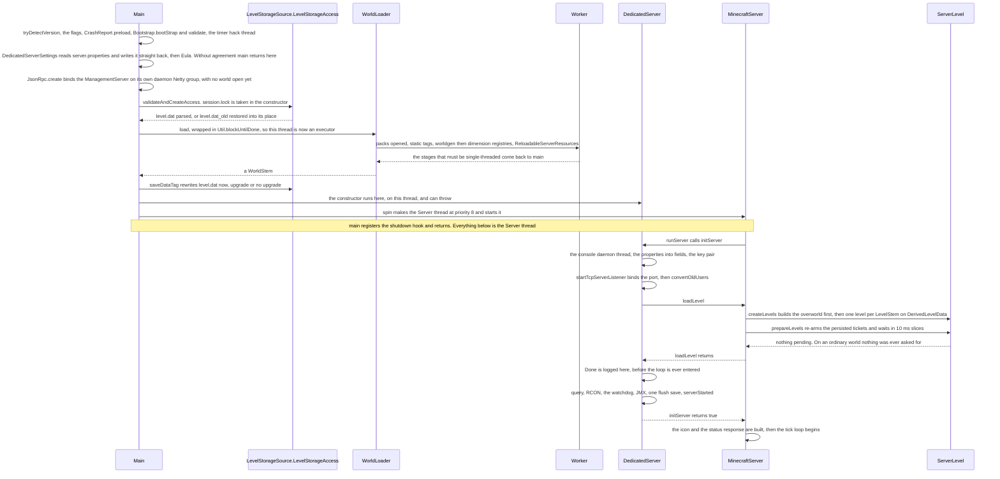

# Starting a server

> Verified against **Minecraft 26.2** · Part III · Dropping the jar in an empty folder, typing *java -jar server.jar*, and waiting for the line that says *Done*.

The first run writes two files and exits: you have not agreed to the EULA.
The second gets as far as *Preparing level "world"* and, a second or two
later, *Done (1.284s)! For help, type "help"*. Between those two lines the
server opened a data pack stack, built every registry the world is made of,
took an operating-system lock on the save directory, rewrote `level.dat`,
constructed a `ServerLevel` for every dimension the packs declare and started
listening on 25565. And the step in the middle whose name promises the most —
`MinecraftServer.prepareLevels`, the one whose progress line still reads
*Preparing spawn area* — does the least: **on an ordinary world it loads no
chunks at all.** All it does is re-arm the tickets the last shutdown wrote
down, and exactly two of the nine ticket types are ever written down.

## The cast

| class | what it decides | thread |
|---|---|---|
| `server/Main` | everything decided before a second thread exists: the flags, the properties, the EULA, which directory is the world, and when to hand off | JVM main |
| `DedicatedServerSettings` | the live copy of `server.properties` — and the rewrite that happens every time a setting changes | main, then Server |
| `LevelStorageSource.LevelStorageAccess` | one open world: its directory layout, its `session.lock`, and every read and write of `level.dat` | whoever holds it |
| `WorldLoader` | the packs, the registries and the datapack-driven resources, assembled into a `WorldStem` | main and `Util.backgroundExecutor` |
| `DedicatedServer` | what a dedicated server has and singleplayer does not: the console, the port, the legacy conversions, RCON, query, the watchdog | Server, but constructed on main |
| `MinecraftServer` | the levels, the saves and the loop — and `MinecraftServer.spin`, the line where the second thread begins | Server |
| `ServerLevel` | one dimension: its chunk source, its saved data, its ticket store | Server |
| `LevelLoadListener` | what boot progress looks like: log lines on a dedicated server, a progress bar on a client | the caller's |

## From the command line to the Server thread

Only one diagram in this book has the JVM main thread as a lane, and this is
it. Read the note bar as a wall: above it, one thread does all the work and
the server object does not exist for most of it; below it, *main* has
returned and everything that remains is the Server thread and the daemons
arranged around it. [Anatomy](../anatomy/anatomy.md) draws the same hand-off
from the client's side, where the thread that spins the server is the one
drawing frames.

## Everything *main* does before there is a second thread

`Main.main` runs on the thread the JVM handed it and stays there for all of
what follows. `SharedConstants.tryDetectVersion` reads *version.json* out of
the jar first, so everything downstream knows what version it is. Then the
flags are parsed — *--nogui*, *--port*, *--universe*, *--world*,
*--forceUpgrade*, *--recreateRegionFiles*, *--safeMode*, *--initSettings*,
*--pidFile* and the rest — and `CrashReport.preload` runs: `MemoryReserve`
sets a block of heap aside and one throwaway report is formatted and
discarded, so that the crash-report path is warm and has memory of its own
even when the reason for the crash is that there is none left.
`Bootstrap.bootStrap` and `Bootstrap.validate` build and freeze the static
registries ([identifiers and registries](../foundations/identifiers-and-registries.md)),
and `Util.startTimerHackThread` starts a daemon that sleeps forever and
touches nothing.

Only then does the server read its own configuration. `DedicatedServerSettings`
parses `server.properties`, and `DedicatedServerSettings.forceSave` writes it
straight back — which is why a properties file carried over from an older jar
comes back with the new keys filled in. `RegionFileVersion.configure` takes
the region compression out of it before any chunk file is ever opened
([chunk storage](../world/chunk-storage.md)). And
`Eula` reads `eula.txt`, or writes the default and reports it missing. That is
the gate: `Eula.hasAgreedToEULA` false means one log line and *main* returns.
No world has been opened, no server exists, and everything *main* has started
so far is a daemon — which does not hold the JVM open, so the process ends
with the return. *--initSettings* returns one step earlier still, having
written both files on purpose.

### The management port opens before the world does

With the EULA agreed, `Services.create` builds the authentication services and
the name cache in the universe directory, and `JsonRpc.create` starts a
`ManagementServer` if *management-server-enabled* is set and the secret is
forty alphanumeric characters: a Netty WebSocket listener with its own
event-loop group named *Management server IO*, TLS on by default, and a
`JsonRpcNotificationService` registered on the `NotificationManager` that
everything later in the boot reports through. It binds before `session.lock`
is taken, and `DedicatedServer.onServerExit` stops it last, so the management
protocol is reachable at both ends of the server's life — including while
there is no world to ask it about ([how a server dies](how-a-server-dies.md)).

### Taking the lock, and fixing `level.dat` twice

`LevelStorageSource.createDefault` points at the universe directory — the
working directory unless *--universe* says otherwise — and
`LevelStorageSource.validateAndCreateAccess` opens the world named by
*--world* or by *level-name*. The validation is a symlink check; the lock is
neither optional nor deferred. `DirectoryLock.create`, called from the
`LevelStorageSource.LevelStorageAccess` constructor, opens
`DirectoryLock.LOCK_FILE`, writes a snowman into it and takes a
`FileChannel.tryLock` on it. That is an operating-system advisory lock, not a
value in the file: a second server on the same directory fails at once with
`DirectoryLock.LockException`, a crashed JVM releases it with nothing to clean
up, and a world folder copied out from under a running server carries a
`session.lock` that means nothing. The client's world list greys out a world
that `DirectoryLock.isLocked` reports held.

If the directory already holds world data, *main* parses `level.dat` once and
runs the result through the datafixers twice.
`LevelStorageSource.LevelStorageAccess.getUnfixedDataTagWithFallback` reads
the file and, on a parse failure, falls back to `level.dat_old` and restores
it over the original. That raw tag goes through
`LevelStorageSource.LevelStorageAccess.fixAndGetSummaryFromTag` for a
`LevelSummary`, which is enough to answer
`LevelSummary.requiresManualConversion` and `LevelSummary.isCompatible` — two
gates that each end the boot with one explanatory line — and separately
through `DataFixers.getFileFixer` for the fully upgraded tag the world is
actually built from.

### The world load turns the main thread into an executor

`ServerPacksSource.createPackRepository` builds the repository over the
world's *datapacks/* folder and `WorldLoader.load` does the rest: the staged
load that [the resource system](../foundations/resource-system.md) describes,
run here for server data. `WorldLoader.PackConfig.createResourceManager`
selects and opens the packs, `TagLoader.loadTagsForExistingRegistries`
collects tags for the static registries, `RegistryDataLoader` loads
`RegistryDataLoader.WORLDGEN_REGISTRIES` and then
`RegistryDataLoader.DIMENSION_REGISTRIES`, the `WorldLoader.WorldDataSupplier`
turns the fixed `level.dat` into a `PrimaryLevelData` through
`LevelStorageSource.getLevelDataAndDimensions` — or, with no world data at
all, `Main.createNewWorldData` builds one out of `server.properties` — and
`ReloadableServerResources.loadResources` compiles the recipes, loot tables,
functions and advancements. What comes back is a `WorldStem`.

The threading is the part worth noticing. `WorldLoader.load` takes two
executors: `Util.backgroundExecutor` for the work, and a main-thread executor
for the stages that must be single-threaded. `Util.blockUntilDone` supplies
the second by handing the loader a queue's *add* method and then draining that
queue until the future completes. For the length of the world load the JVM
main thread is an event loop, running the pack-opening stage and the final
assembly itself between bouts of waiting on the workers.

Two things then happen before the server object exists. With *--forceUpgrade*
or *--recreateRegionFiles*, a `WorldUpgrader` rewrites every region file while
*main* polls it once a second and logs a percentage. And either way
`LevelStorageSource.LevelStorageAccess.saveDataTag` writes `level.dat` back
out through a temp file, rotating the previous copy into `level.dat_old`. That
is unconditional: a server started and killed one second later has already
rewritten its world data.

## `MinecraftServer.spin`, and the last thing *main* does

`MinecraftServer.spin` takes a factory rather than a server, and its order is
the point. It builds the `Thread` object first, sets priority 8 on a machine
with more than four processors, calls the factory *on the calling thread*, and
only then starts the thread — so the whole of the `DedicatedServer`
constructor runs on the JVM main thread, and the new thread cannot begin
before there is a server for it to run.

That constructor is real work. `MinecraftServer`'s own opens the server-wide
`SavedDataStorage`, takes the `WorldData` and `WorldGenSettings` out of the
stem, builds the `ServerConnectionListener`, the `PlayerDataStorage`, the
`GameRules`, the `StructureTemplateManager` and the `PacketProcessor`,
finalises recipe loading, and refuses outright a stem whose `LevelStem`
registry has no overworld. `DedicatedServer`'s adds the `ServerTextFilter`,
the `ServerLinks` built from the bug-report property, and — when
*enable-code-of-conduct* is set — every *.txt* file under the *codeofconduct*
folder, which throws if that folder is missing. A misconfigured code of
conduct kills the server on the main thread, before a Server thread exists to
be killed.

Back in *main*, the factory has already applied *--port*, *--demo* and
*--serverId* and, unless *--nogui* or a headless JVM says otherwise, opened
the Swing window through `DedicatedServer.showGui`. A *Server Shutdown Thread*
hook goes on the runtime — its whole body is
[one `MinecraftServer.halt` call](how-a-server-dies.md) — and *main* returns.

## The Server thread wakes up, and can still fail twice

`MinecraftServer.runServer` is the Server thread's body and its first act is
`DedicatedServer.initServer`, which begins with the console: a daemon thread
named *Server console handler* reading `System.in` line by line. It runs
nothing itself. Each line becomes a `ConsoleInput` — the text plus a
`CommandSourceStack` built there on the console thread — appended to a
synchronized list that `DedicatedServer.handleConsoleInputs` drains from
`DedicatedServer.tickConnection`, so a typed command executes inside a tick
like every other command.

Then the properties become fields: online mode, the local IP, the default game
type, the port. `MinecraftServer.initializeKeyPair` generates the RSA pair that
login encryption uses ([players and sessions](players-and-sessions.md)), and
`ServerConnectionListener.startTcpServerListener` binds the port with a Netty
server bootstrap. Two things can end the boot at this point, and they end it
identically.

| the failure | what the console says | the check |
|---|---|---|
| the port is already taken | *FAILED TO BIND TO PORT!* and the exception | `ServerConnectionListener.startTcpServerListener` throws, and `DedicatedServer.initServer` returns false |
| a legacy user list survived conversion | *FAILED TO START THE SERVER AFTER ACCOUNT CONVERSION!* and the files to delete by hand | `OldUsersConverter.areOldUserlistsRemoved` looks for *banned-players.txt*, *banned-ips.txt*, *ops.txt* and *white-list.txt*, and is false if any of the four is still there |

The conversion itself is `DedicatedServer.convertOldUsers`, which attempts
five migrations — the two ban lists, the op list, the whitelist and the player
save files — retrying each up to twice more, five seconds apart, and reporting
whether *any* of them did something. The gate is the separate check above, so
what stops the boot is the file nobody could convert. Either failure makes
`MinecraftServer.runServer` throw, which lands in `MinecraftServer.runServer`'s own catch,
writes a crash report and falls into the same *finally* that `/stop` reaches —
a server that failed to bind still walks the whole shutdown path and releases
`session.lock` on the way out ([how a server dies](how-a-server-dies.md)).

Past them, a `DedicatedPlayerList` is built, offline names are resolved in the
cache, and the log says *Preparing level "world"*.

## Building the levels

`MinecraftServer.loadLevel` is three calls: `MinecraftServer.createLevels`,
`MinecraftServer.forceDifficulty` (empty here, overridden by the integrated
server) and `MinecraftServer.prepareLevels`.

`MinecraftServer.createLevels` builds the overworld first and by name, and it
is the only level that is special. It gets the custom spawners — the
`PhantomSpawner`, the `PatrolSpawner`, the `CatSpawner`, the `VillageSiege`
and the `WanderingTraderSpawner` — and its `ServerLevelData` is the real
`PrimaryLevelData` out of `level.dat`. With it in `MinecraftServer.levels` (a
`LinkedHashMap`, so it stays first for every later walk over the levels), the
scoreboard, the `CommandStorage` and the `Stopwatches` come out of the
server-wide saved data. Every other `LevelStem` in the registry then gets a
`ServerLevel` over a `DerivedLevelData`, a view of the overworld's data —
which is why the time of day, the weather, the difficulty and the world spawn
are one set of numbers every dimension shares
([level data and rules](../../reference/level-data-and-rules.md)).

A brand-new world takes one detour, and it is the detour that actually
generates terrain at boot. When `ServerLevelData.isInitialized` is false,
`MinecraftServer.setInitialSpawn` asks the biome sampler for a spawn chunk,
reads the generator's spawn height, and walks a spiral over the chunks within
`MinecraftServer.SPAWN_POSITION_SEARCH_RADIUS` — five in each direction —
calling `PlayerSpawnFinder.getSpawnPosInChunk` until one of them offers a
standable block. The bonus chest is placed here if *--bonusChest* asked for
one. Then the flag is set, and no later boot of that world repeats any of it.

## Preparing the levels, which prepares nothing

`MinecraftServer.prepareLevels` replays a list. For each level a
`ChunkLoadCounter` records which chunks are already `ChunkStatus.FULL`, calls
`TicketStorage.activateAllDeactivatedTickets`, runs the distance manager again
and counts what is new. The tickets it replays are the ones the last shutdown
parked rather than dropped, and of the nine `TicketType`s exactly two carry
`TicketType.FLAG_PERSIST` — `TicketType.FORCED`, from */forceload*, and
`TicketType.PORTAL` — so those two are the only entries a *chunk_tickets* file
contains ([tickets and loading](../world/tickets-and-loading.md)). The world
spawn is kept by nothing.

**Zero** — chunks `MinecraftServer.prepareLevels` loads on a world with no
forceloads and no live portal ticket.

What follows is `MinecraftServer.waitUntilNextTick` with the deadline set
`MinecraftServer.PREPARE_LEVELS_DEFAULT_DELAY_NANOS` — 10 ms — out, repeated
while `ChunkLoadCounter.pendingChunks` is above zero: the Server thread
pumping its own queue in slices, the same way a tick waits for a chunk
([the server tick](server-tick.md)). With a total of zero it runs once and
leaves. `MinecraftServer.updateMobSpawningFlags` and the effective respawn
data are recomputed, and the step is over.

### What the console prints while nothing is prepared

The output is worth reading literally. `LoggingLevelLoadListener` logs
*Loading N persistent chunks...* when
`LevelLoadListener.Stage.LOAD_INITIAL_CHUNKS` starts and *Time elapsed: N ms*
when it finishes, with *Preparing spawn area: N%* — still the
*menu.preparingSpawn* string, its percentage computed by
`LevelLoadProgressTracker` — printed at most twice a second in between. On an
ordinary world there is no in between: N is zero and the percentage line never
gets a chance to run. Of the four values `LevelLoadListener.Stage` declares,
`LevelLoadListener.Stage.PREPARE_GLOBAL_SPAWN` fires only on a world's first
boot, `LevelLoadListener.Stage.LOAD_PLAYER_CHUNKS` belongs to a player joining
rather than to boot — `PrepareSpawnTask`, in the configuration phase
([players and sessions](players-and-sessions.md)) — and
`LevelLoadListener.Stage.START_SERVER` is declared and fired by nothing.

> **For a 1.21-era reader.** There is no *spawnChunkRadius* game rule:
> `GameRuleRegistryFix` deletes it out of any save that still carries one, and
> the chunks around the world spawn are kept alive by whoever stands in them
> and by nothing else. *spawn-protection* in `server.properties` survives and
> is unrelated — it is a permission check in
> `DedicatedServer.isUnderSpawnProtection`, not a loader.

## *Done* comes before the loop

`DedicatedServer.initServer` logs *Done (1.284s)! For help, type "help"* the
moment `MinecraftServer.loadLevel` returns — and only then starts the optional
listeners. `QueryThreadGs4.create` runs if *enable-query*, `RconThread.create`
if *enable-rcon*, a *Server Watchdog* thread if
`DedicatedServer.getMaxTickLength` is above zero, JMX if
*enable-jmx-monitoring*. After those come one `MinecraftServer.saveEverything`
with flush and force and `NotificationManager.serverStarted` on the JSON-RPC
feed. `DedicatedServer.initServer` returns true, `MinecraftServer.runServer`
loads `server-icon.png` — the server directory's, or failing that the world's,
and it must be 64 by 64 — builds the first `ServerStatus`, and enters the tick
loop.

So *Done* is a claim about the world being ready rather than about the server
being reachable in every sense. The play port has been open since before the
level loaded, and RCON is still not listening when the line prints.
`MinecraftServer.isReady` — read by the singleplayer client's loading screen
and by the JSON-RPC status method — is set at the bottom of the loop's first
iteration, one tick later still.

## The threads startup leaves behind

Boot creates every thread on this list and then hands the process to one of
them. [Threads](../../reference/threads.md) has the complete set, including
the pools and the situational ones.

| thread | made by | daemon | what it may touch |
|---|---|---|---|
| **Server thread** | `MinecraftServer.spin`, from *main* | no | everything — it is the only thread allowed to change the world |
| *Server console handler* | `DedicatedServer.initServer`, first statement | yes | `System.in` and the `ConsoleInput` list. The command itself runs on the Server thread |
| *Server Watchdog* | `DedicatedServer.initServer`, only if `DedicatedServer.getMaxTickLength` is above zero | yes | reads `MinecraftServer.getNextTickTime`, the game rules and `ServerLevel.getWatchdogStats` off-thread, mid-tick |
| *RCON Listener*, plus one *RCON Client* per connection | `RconThread.create`, after *Done* | no | TCP accept. `DedicatedServer.runCommand` hops the command onto the Server thread with `BlockableEventLoop.executeBlocking` |
| *Query Listener* | `QueryThreadGs4.create`, after *Done* | no | a UDP status protocol, read-only |
| *Management server IO* | `JsonRpc.create`, back in *main* | yes | the JSON-RPC socket. `ManagementServer.tick` runs from `DedicatedServer.tickServer` |
| *Timer hack thread* | `Util.startTimerHackThread`, in *main* | yes | nothing. It sleeps and is never woken |

Two rows carry a consequence for the other end of the story. `RconThread` and
`QueryThreadGs4` are both `GenericThread`s, created from the Server thread and
never marked daemon, so they are the only non-daemon threads besides the
Server thread itself, and each polls its socket with a half-second timeout so
that it notices `GenericThread.running` going false. And `RconThread.create`
returns nothing — logging that RCON is disabled — when *rcon.password* is
empty or *rcon.port* is out of range, so setting *enable-rcon* on its own
starts no thread at all.

One more thing outlives boot without being a thread: `server.properties` stays
live. Nineteen `DedicatedServerProperties` fields are `Settings.MutableValue`s,
and `Settings.MutableValue.update` rebuilds the whole properties object and
`DedicatedServerSettings.update` writes the file back, so */difficulty*,
*/whitelist*, the spawn-protection setter and the JSON-RPC settings calls all
edit `server.properties` on disk while the server runs.

## Singleplayer boots the same server with a shorter list

`IntegratedServer` uses the same `MinecraftServer.spin`,
`MinecraftServer.runServer` and `MinecraftServer.loadLevel`, and almost
nothing else on this page. `IntegratedServer.initServer` turns authentication
on, generates the key pair, calls `MinecraftServer.loadLevel`, sets the MOTD
from the host's name and the level name, saves once and returns true: no
console thread, no TCP bind, no legacy conversion, no RCON, no query, no
watchdog and no *Done* line. Its player list is built in the constructor
rather than in `DedicatedServer.initServer`, and its `LevelLoadListener` is a
`LevelLoadTracker` composed with the logging one, so the client's progress bar
and a dedicated server's log lines are two readings of the same callbacks. The
whole of it is constructed from `Minecraft.doWorldLoad` on the Render thread,
by a caller that goes back to drawing frames rather than returning from
*main* — [anatomy](../anatomy/anatomy.md) is that hand-off, and its diagram is
the one to read for how the two loops meet.

## Where to look

`server/Main` · `CrashReport.preload` · `Bootstrap.bootStrap` · `Eula` ·
`DedicatedServerSettings` · `DedicatedServerProperties` · `JsonRpc.create` ·
`LevelStorageSource.createDefault` · `LevelStorageSource.validateAndCreateAccess` ·
`LevelStorageSource.LevelStorageAccess` · `DirectoryLock.create` ·
`WorldLoader.load` · `WorldStem` · `Util.blockUntilDone` · `WorldUpgrader` ·
`LevelStorageSource.LevelStorageAccess.saveDataTag` · `MinecraftServer.spin` ·
`MinecraftServer.runServer` · `DedicatedServer.initServer` ·
`OldUsersConverter.areOldUserlistsRemoved` · `MinecraftServer.loadLevel` ·
`MinecraftServer.createLevels` · `MinecraftServer.setInitialSpawn` ·
`MinecraftServer.prepareLevels` · `ChunkLoadCounter` ·
`TicketStorage.activateAllDeactivatedTickets` · `LevelLoadListener` ·
`LoggingLevelLoadListener` · `RconThread.create` · `QueryThreadGs4.create` ·
`ServerWatchdog` · `IntegratedServer.initServer`

---

*Rules: names, never code · how the system works, not how the code reads ·
newest version only · every backticked name passes `tools/verify_names.py`.*
