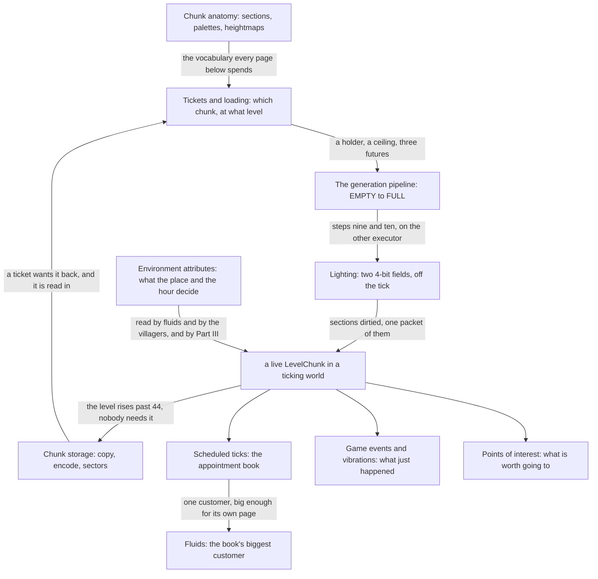

# IV · The world

> Verified against **Minecraft 26.2** · Part IV · The machinery that turns a place you have walked to into a place that exists: chunks made, lit, sent, saved and forgotten, and the five pages off that line — what the place and the hour decide, and the four systems that make the world the line delivers feel alive.

Part III was one thread going round. This part is what it goes round *on*.
A world is too big to hold, so the server holds a moving window of it, and
almost everything in this part exists to decide the window's edge: which
chunks are worth building, how far past the edge to build them, which of
them tick, which of them are sent to you, and when one is finally written
down and let go. A player recognises the part by its edge — the ring of
half-made terrain past render distance, the mobs that stop moving when you
fly away from them, the *Saving world* bar. Almost none of that edge is one
number: **render distance, simulation distance and the mob-spawning radius
are three different radii, answered by three different mechanisms, and only
two of them are settings** ([two graphs, one
store](tickets-and-loading.md#two-graphs-one-store)).

## The shape of the part

Part IV is a conveyor with a vocabulary page in front of it. Four pages are
the conveyor and they hand a chunk to each other in order; the fifth page
defines the thing being handed. The other five are not on the line at all —
one is what the place and the hour decide, and four are about the world the
conveyor delivers.

What the part hands forward, and what it does not: [blocks and
states](../blocks/blocks-and-states.md) in Part V assumes the section and
palette model [chunk anatomy](chunk-anatomy.md) defines, and Part XII's
terrain generation is the cargo on the conveyor [the generation
pipeline](chunk-generation-pipeline.md) describes. Neither is a dependency
of this part; both are parts that depend on it.

## Before you start

[The server tick](../server/server-tick.md#what-minecraftservertickchildren-runs-and-in-what-order) and [the level
tick](../server/server-level-tick.md#the-chunk-source-does-five-things-in-one-call). Almost everything here happens on the Server
thread inside that loop, or on a worker the loop is waiting for — the IO lane
below is the exception the storage page is about — and the level tick is where
the chunk source is asked to do its five things.
Part II's [codecs](../foundations/codecs-nbt-json.md#disk-a-chest-writes-a-list-of-slots) and
[registries](../foundations/identifiers-and-registries.md#the-table) are assumed
wherever a chunk is written to disk or a type is looked up by name, and
[tags](../foundations/tags.md#a-tag-is-a-key-and-a-file) wherever a behaviour is defined by a set the
data pack owns — which is most of what the last two pages do.

Nothing in this part needs Part V or beyond.

## Watch in this order

Lectures two to six are the chain — nothing later in it can be watched
first. The first is off the chain on purpose, and the last four can be
watched in any order once you have the vocabulary page.

1. [Environment attributes and timelines](environment-attributes-and-timelines.md)
   — off the conveyor, ahead of it, and the page [the level
   tick](../server/server-level-tick.md#the-cache-that-is-dropped-before-the-border)
   already asked you to watch. Whether lava flows fast, what colour the sky is
   and when a villager goes to work are one mechanism. The night does not
   *set* the sky's colour — it multiplies whatever the biome produced.
2. [Chunk anatomy](chunk-anatomy.md) — what a chunk is made of, down to
   the bit storage. The vocabulary the rest of the part spends. A section
   holding two *distinct* block states costs exactly what one holding sixteen
   costs.
3. [Tickets and loading](tickets-and-loading.md) — a player takes one step
   east and a column twenty-one chunks wide is asked for. Nothing asks for a
   chunk *because* it is loaded: it asks for a *level*, and two graphs reading
   one ticket store answer different questions about it.
4. [The chunk generation pipeline](chunk-generation-pipeline.md) — one
   chunk from *EMPTY* to *FULL* through twelve statuses and a pyramid of
   neighbour requirements. Asking for one chunk asks for 529.
5. [Lighting](lighting.md) — a torch is placed. Two 4-bit fields flooded on
   a worker and published as a copy. There is no light thread, and no light
   phase of the tick.
6. [Chunk storage](chunk-storage.md) — a chunk nobody needs is copied,
   encoded and written, on three different threads, and the save path waits
   for none of it. Almost every write of your world is one nobody asked for.
7. [Scheduled ticks](scheduled-ticks.md) — how anything happens *later*: an
   appointment book of two queues per chunk, and a dedup rule that quietly
   drops the second appointment even when it is sooner.
8. [Fluids](fluids.md) — a bucket of water on flat stone. Water turns
   toward a hole four steps past the block it is about to fill, because every
   side runs its own search — and a side the water is not allowed to replace
   still votes on where the rest of it goes.
9. [Game events and vibrations](game-events-and-vibrations.md) — a footstep
   reaches a sculk sensor, through a cascade of tests that is most of the
   lecture. The sensor always hears you at least one tick late by design.
10. [Points of interest](points-of-interest.md) — a villager claims a bed
    from 48 blocks away, the moment a path to it exists. Going to sleep in it
    tells the index nothing, and the one behaviour that acts on the flag can
    only take a claim away.

## Reference this part uses

[Level data and rules](../../reference/level-data-and-rules.md) — who owns
the seed, the spawn, the rules, the border and the dimensions, and which
file remembers each; it is also where the border itself is explained, for
the reason above. [Game rules](../../reference/gamerules.md) — five of
which this part reads. [Math and
primitives](../../reference/math-and-primitives.md#three-long-keys) —
`ChunkPos` and `SectionPos`, and the packings the conveyor pages assume.
[Block update flags](../../reference/block-update-flags.md) — the flag word
three pages here spend. [Registries](../../reference/registries.md) — three
of this part's mechanisms are registry-backed: environment attributes,
timelines and points of interest.
[Threads](../../reference/threads.md#the-threads-a-lecture-leans-on) — the
worker pool and the IO lane. [Diagram lanes](../../reference/lanes.md).

---

*Rules: names, never code · how the system works, not how the code reads ·
newest version only · every backticked name passes `tools/verify_names.py`.*
