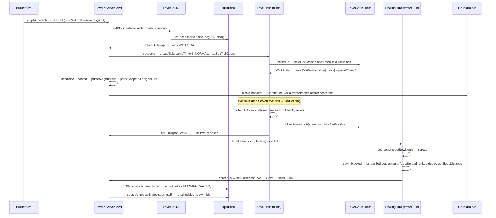

# Block ticks and fluids

> Verified against **Minecraft 26.2** · Part IV · A bucket of water is emptied on flat stone and spreads one step: the scheduled-tick queue that carries it and the fluid model that decides where it goes.

## Responsibility

Most of the world changes because something *asked to be revisited later*:
a fluid that must flow, a sapling waiting on a bonemeal, a repeater whose
signal is due, a pressure plate releasing. The scheduled-tick system is the
appointment book — one queue per chunk, indexed by the level, drained in a
fixed order with a budget — and the fluid model is its biggest customer.
Random ticks are the other, appointment-free way a block gets a turn.

The one sentence a player recognises: *water takes five ticks per block,
lava thirty, and a redstone repeater's delay is a scheduled tick.*

## The data it owns

- `ScheduledTick` is a record: `ScheduledTick.type` (a `Block` or a `Fluid`),
  `ScheduledTick.pos`, `ScheduledTick.triggerTick` (an absolute game time),
  `ScheduledTick.priority` and `ScheduledTick.subTickOrder`. Three
  orderings hang off it: `ScheduledTick.DRAIN_ORDER` (time, priority,
  sub-order), `ScheduledTick.INTRA_TICK_DRAIN_ORDER` (priority, sub-order —
  time ignored, for ranking containers against each other), and
  `ScheduledTick.UNIQUE_TICK_HASH`, the identity used for deduplication:
  **type and position only**.
- `TickPriority`: `TickPriority.EXTREMELY_HIGH` (−3) through
  `TickPriority.NORMAL` (0) to `TickPriority.EXTREMELY_LOW` (3).
- `LevelChunkTicks` is the per-chunk queue, two per `LevelChunk`
  (`LevelChunk.blockTicks`, `LevelChunk.fluidTicks`): a
  `LevelChunkTicks.tickQueue` in drain order and
  `LevelChunkTicks.ticksPerPosition`, the dedup set. `LevelChunkTicks.schedule`
  adds to the queue only if the set did not already hold that (type, pos);
  `LevelChunkTicks.poll` releases it. `LevelChunkTicks.pendingTicks` holds
  ticks loaded from disk as `SavedTick`s until `LevelChunkTicks.unpack`
  turns them into real ticks (the constructor pre-seeds the dedup set from
  them so a fresh schedule cannot double up a saved one).
- `LevelTicks` is the per-level scheduler, two per `ServerLevel`
  (`ServerLevel.blockTicks`, `ServerLevel.fluidTicks`):
  `LevelTicks.allContainers` (chunk → its `LevelChunkTicks`),
  `LevelTicks.nextTickForContainer` (chunk → its earliest trigger time — the
  index that lets idle chunks cost nothing), `LevelTicks.containersToTick`
  (this tick's due containers, best head first), `LevelTicks.toRunThisTick`,
  `LevelTicks.toRunThisTickSet` (lazily built; backs
  `LevelTicks.willTickThisTick`) and `LevelTicks.tickCheck`, the predicate
  the level supplies — `ServerLevel.isPositionTickingWithEntitiesLoaded`.
  `LevelTicks.chunkScheduleUpdater` is the callback every container gets
  (`LevelChunkTicks.setOnTickAdded`) so a new earliest tick updates the index.
- `SavedTick` is the disk form: `SavedTick.type`, `SavedTick.pos`,
  *delay* — **relative** to game time at save — and
  *priority*; `SerializableChunkData.BLOCK_TICKS_CODEC` /
  `SerializableChunkData.FLUID_TICKS_CODEC` under *block_ticks* / *fluid_ticks*.
- During generation a `ProtoChunk` has `ProtoChunkTicks`, which records
  every tick with delay 0 and dedups under `SavedTick.UNIQUE_TICK_HASH`;
  `WorldGenRegion` exposes them as a `WorldGenTickAccess`. The client has
  `BlackholeTickAccess`: `ClientLevel.getBlockTicks` and
  `ClientLevel.getFluidTicks` accept everything and run nothing.
- Every scheduled tick gets a fresh `Level.nextSubTickCount` from the
  level's single `Level.subTickCount` counter (an `AtomicLong` on
  `WorldGenRegion`), which is what makes same-time, same-priority ticks
  FIFO.
- The fluid model: `Fluid` is to `FluidState` what `Block` is to
  `BlockState` — the same `StateHolder` machinery, with `Fluid.stateDefinition`
  and a global `Fluid.FLUID_STATE_REGISTRY`. `FlowingFluid` is the base of
  `WaterFluid` and `LavaFluid`; each is a *pair* of registry objects,
  `FlowingFluid.getSource` and `FlowingFluid.getFlowing` (`Fluids.WATER` /
  `Fluids.FLOWING_WATER`, `Fluids.LAVA` / `Fluids.FLOWING_LAVA`; `Fluids.EMPTY`
  is the `EmptyFluid`). Properties: `FlowingFluid.FALLING` on every state,
  `FlowingFluid.LEVEL` (`BlockStateProperties.LEVEL_FLOWING`, 1–8) on
  flowing states only; a source has `FluidState.AMOUNT_FULL`, 8, and
  `FluidState.getOwnHeight` is amount ÷ `FluidState.AMOUNT_MAX` (9).
- The block that carries a fluid is `LiquidBlock`, whose
  `BlockStateProperties.LEVEL` (0–15) indexes `LiquidBlock.stateCache`: 0 is
  the source, 1–7 are flowing amounts 8 − level, 8 and above are "falling,
  full". `BlockBehaviour.BlockStateBase.getFluidState` is cached per state
  (`BlockBehaviour.BlockStateBase.fluidState`, filled by
  `BlockBehaviour.BlockStateBase.initCache`), and waterlogging is a block
  that implements `SimpleWaterloggedBlock` reporting water from
  `BlockStateProperties.WATERLOGGED`.

## When it runs

**Server thread only.** `ServerLevel.tick` runs `LevelTicks.tick` twice under
the *tickPending* section — `ServerLevel.blockTicks` then
`ServerLevel.fluidTicks` — each with game time and a budget of
`ServerLevel.MAX_SCHEDULED_TICKS_PER_TICK` (65536), skipped while the
`TickRateManager` is frozen. The three phases: `LevelTicks.collectTicks`
(`LevelTicks.sortContainersToTick` walks the index for due, tickable
chunks; `LevelTicks.drainContainers` pops the best container and keeps
pulling from it while its head still beats the next container's under the
intra-tick order; `LevelTicks.rescheduleLeftoverContainers` restores the
index for anything the budget cut off), `LevelTicks.runCollectedTicks`
(hands each (pos, type) to `ServerLevel.tickBlock` / `ServerLevel.tickFluid`)
and `LevelTicks.cleanupAfterTick`. A tick scheduled *during* the run phase
goes into its container and waits for a later level tick.

Random ticks are the level tick's own loop ([the level tick](../server/server-level-tick.md)):
`ServerLevel.tickChunk` rolls `GameRules.RANDOM_TICK_SPEED` positions per
section that `LevelChunkSection.isRandomlyTicking`, calling
`BlockBehaviour.BlockStateBase.randomTick` where
`BlockBehaviour.BlockStateBase.isRandomlyTicking` and then
`FluidState.randomTick` where `FluidState.isRandomlyTicking` — which only
lava is, and its random tick is fire, not flow.

Registration follows the chunk's life: `ChunkStatusTasks.full` calls
`LevelChunk.registerTickContainerInLevel` (the containers join
`LevelTicks.allContainers`); `ChunkMap.prepareTickingChunk` →
`ServerLevel.startTickingChunk` → `LevelChunk.unpackTicks` makes the saved
ticks real, with `LevelChunkTicks.unpack` assigning *negative* sub-orders so
loaded ticks run before anything scheduled this session at the same time;
`ServerLevel.unload` → `LevelChunk.unregisterTickContainerFromLevel`. A
tick scheduled into a chunk with no registered container is **logged and
dropped** by `LevelTicks.schedule` (`Util.logAndPauseIfInIde`), never
deferred.

## The trace: water spreads

1. **Placement.** `BucketItem.use` → `BucketItem.emptyContents` →
   `Level.setBlock` with flags 11 (`Block.UPDATE_NEIGHBORS`,
   `Block.UPDATE_CLIENTS`, `Block.UPDATE_IMMEDIATE`) of the source's
   `FluidState.createLegacyBlock`. Into a `LiquidBlockContainer` it is
   `LiquidBlockContainer.placeLiquid` instead, and
   `SimpleWaterloggedBlock.placeLiquid` schedules the same tick itself.
2. **The block schedules its own future.** `LevelChunk.setBlockState`
   ([chunk anatomy](chunk-anatomy.md)) writes the section and, server-side
   and without `Block.UPDATE_SKIP_ON_PLACE`, calls
   `BlockBehaviour.BlockStateBase.onPlace` → `LiquidBlock.onPlace` →
   `LiquidBlock.shouldSpreadLiquid` (always true for water; for lava this is
   where obsidian, cobblestone and basalt happen and `LiquidBlock.fizz`
   plays) → `ScheduledTickAccess.scheduleTick` with `WaterFluid.getTickDelay`, 5.
3. **Into the queue.** `ScheduledTickAccess.scheduleTick` →
   `LevelAccessor.createTick` (trigger = game time + 5,
   `TickPriority.NORMAL`, a fresh sub-order) → `LevelTicks.schedule` → the
   chunk's `LevelChunkTicks.schedule`. The dedup set accepts (water source,
   pos); the queue takes it; the container's callback updates
   `LevelTicks.nextTickForContainer`.
4. **Neighbours hear about it.** Back in `Level.setBlock`: flag 2 →
   `ServerLevel.sendBlockUpdated` → `ServerChunkCache.blockChanged` (one
   `ClientboundBlockUpdatePacket` at broadcast time); flag 1 →
   `Level.updateNeighborsAt`; and the shape-update pass — a neighbouring
   `LiquidBlock.updateShape` schedules a fluid tick when either side is a
   source. The **client** applies the packet through
   `ClientPacketListener.handleBlockUpdate` →
   `ClientLevel.setServerVerifiedBlockState`; `ClientLevel` never runs
   `LiquidBlock.onPlace` and its tick lists are black holes. Everything it
   shows of flowing water is a stream of block updates.
5. **Five ticks later.** `LevelTicks.tick` finds the container due and
   `ServerLevel.isPositionTickingWithEntitiesLoaded` true. `LevelChunkTicks.poll`
   removes the tick from both the queue and the dedup set — from now a new
   tick at this position can be scheduled, including by this tick's own
   run. `ServerLevel.tickFluid` re-reads the block and fires
   `FluidState.tick` only if the fluid there is still the scheduled one; a stale
   tick on a changed block is a no-op.
6. **The fluid tick.** `FlowingFluid.tick`: for a *flowing* state it first
   computes `FlowingFluid.getNewLiquid` — the amount this position *should*
   hold, from the highest same-fluid horizontal neighbour reachable through
   `FlowingFluid.canPassThroughWall`, minus `FlowingFluid.getDropOff`, or a
   falling full state if the same fluid is above, or a new *source* if two
   or more source neighbours sit on solid ground and
   `FlowingFluid.canConvertToSource` — and if the answer differs, sets it
   and reschedules with `FlowingFluid.getSpreadDelay`. A source skips that
   and goes straight to `FlowingFluid.spread`.
7. **Down first.** `FlowingFluid.spread` tries below: if
   `FlowingFluid.canMaybePassThrough`, the fluid there
   `FluidState.canBeReplacedWith` and the block
   `FlowingFluid.canHoldSpecificFluid`, it `FlowingFluid.spreadTo` a falling
   state and — only if `FlowingFluid.sourceNeighborCount` is at least three
   — also goes sideways. Stone below, so no.
8. **Then sideways.** Because this is a source (or because below is not a
   `FlowingFluid.isWaterHole`), `FlowingFluid.spreadToSides` with amount
   8 − 1 = 7. `FlowingFluid.getSpread` builds a `FlowingFluid.SpreadContext`
   (a per-call cache of block states and hole answers keyed by packed xz
   offset) and, for each side that can hold the state
   `FlowingFluid.getNewLiquid` would give it, runs
   `FlowingFluid.getSlopeDistance` — a depth-first search up to
   `WaterFluid.getSlopeFindDistance`, 4, returning the pass at which a hole
   is found, else 1000. Only the minimum-distance sides survive, ties all
   kept: on flat stone all four.
9. **Placing the neighbours.** `FlowingFluid.spreadTo` on each: a
   `LiquidBlockContainer` gets `LiquidBlockContainer.placeLiquid`
   (waterlogging); air gets `Level.setBlock` of `FlowingFluid.createLegacyBlock`
   with flags 3 — `WaterFluid.beforeDestroyingBlock` drops whatever was
   there first. `FlowingFluid.spreadTo` never schedules anything: each new
   flowing block's own `LiquidBlock.onPlace` books its tick, and the
   source's `LiquidBlock.updateShape` re-books the source's.
10. **The front advances and stops.** Each flowing block's tick computes
    `FlowingFluid.getNewLiquid` (unchanged, no reschedule) and spreads at
    one less; the source's tick finds its neighbours already at 7 and
    `WaterFluid.canBeReplacedWith` (only from above, only by non-water)
    refuses to overwrite them. Seven blocks out `FlowingFluid.getNewLiquid`
    reaches zero, nothing is rescheduled, and the water goes quiet until a
    `LiquidBlock.neighborChanged` or `LiquidBlock.updateShape` wakes it.

## Interfaces

- **Called by:** `ServerLevel.tick` (`LevelTicks.tick`), `ServerLevel.tickChunk`
  (random ticks), any block through `ScheduledTickAccess.scheduleTick` —
  `LiquidBlock`, `RepeaterBlock`, saplings, `Level.setBlock`'s shape-update
  pass; `LevelTicks.clearArea` / `LevelTicks.copyAreaFrom` from structure
  placement and `/clone`.
- **Calls into:** `BlockBehaviour.BlockStateBase.tick` /
  `BlockBehaviour.BlockStateBase.randomTick` (Part V), `FluidState.tick`,
  `Level.setBlock`; the wall-occlusion test `Shapes.mergedFaceOccludes`,
  memoised per thread in `FlowingFluid.OCCLUSION_CACHE` (200 entries keyed
  by `FlowingFluid.BlockStatePairKey`, identity on both interned states).
- **Crosses the network as:** nothing of its own. The client sees the
  results as `ClientboundBlockUpdatePacket` /
  `ClientboundSectionBlocksUpdatePacket`; `FluidState.animateTick` from
  `ClientLevel.doAnimateTick` is particles and sound only.
- **Data-driven by:** `GameRules.WATER_SOURCE_CONVERSION` (true) and
  `GameRules.LAVA_SOURCE_CONVERSION` (false) — infinite water is a rule;
  `GameRules.RANDOM_TICK_SPEED`; the dimension attribute
  `EnvironmentAttributes.FAST_LAVA` (`LavaFluid.isFastLava`: delay 10,
  drop-off 1, slope search 4 — the Nether's lava behaves like water with a
  10-tick delay), read from the `DimensionType`, not from *ultrawarm*;
  `FluidTags.WATER` / `FluidTags.LAVA`.

## Invariants and surprises

- **`LiquidBlock.tick` does not spread fluid.** The block tick on a water
  block only maintains bubble columns (`LiquidBlock.tryScheduleBubbleBlockColumn`);
  flow is entirely a *fluid* tick. Two schedulers, two budgets, run
  back-to-back.
- **Dedup ignores time, and the first schedule wins.** A second tick for
  the same (type, pos) — even a sooner one — is dropped by
  `LevelChunkTicks.schedule`. "Rescheduling moves the tick" is folklore.
  `Fluids.WATER` and `Fluids.FLOWING_WATER` are *different* keys, so one of
  each can be pending at one position.
- **The dedup entry is released at poll, not at run.** A tick can reschedule
  itself from inside its own run, which is how a fluid keeps flowing.
- **A tick is a promise to a type.** `ServerLevel.tickBlock` and
  `ServerLevel.tickFluid` re-check the type at the position; replacing a
  block cancels its ticks without any cancellation code.
- **Saved ticks are relative and loaded ticks go first.** *delay*
  is remaining time; `LevelChunkTicks.unpack` gives them negative sub-orders.
  Worldgen ticks (`ProtoChunkTicks`) carry delay 0 and only become real when
  the chunk reaches block-ticking, in `ServerLevel.startTickingChunk`.
- **A tick into an unloaded chunk is lost**, with a log line, not deferred.
- **Infinite water is a game rule, lava speed is a dimension attribute.**
  Neither is hard-coded to the fluid or to *ultrawarm*.
- **A falling flow beside three sources also spreads sideways** — the
  edge of a 2×2 pool floods outward while it drains down.
- **`ContainerSingleItem` lives in `world/ticks`** and is a one-slot
  inventory interface; a packaging accident, not a tick.

## Where to look

`LevelTicks.tick` · `LevelTicks.collectTicks` · `LevelTicks.schedule` ·
`LevelChunkTicks.schedule` · `LevelChunkTicks.unpack` · `ScheduledTick.UNIQUE_TICK_HASH` ·
`SavedTick` · `ServerLevel.tickFluid` · `ServerLevel.tickChunk` ·
`LevelChunk.registerTickContainerInLevel` · `FlowingFluid.tick` ·
`FlowingFluid.getNewLiquid` · `FlowingFluid.spread` · `FlowingFluid.getSpread` ·
`FlowingFluid.getSlopeDistance` · `FlowingFluid.canPassThroughWall` ·
`WaterFluid` · `LavaFluid.isFastLava` · `LiquidBlock.onPlace` ·
`LiquidBlock.shouldSpreadLiquid` · `SimpleWaterloggedBlock.placeLiquid` ·
`BucketItem.emptyContents` · `ClientLevel.getFluidTicks`

---

*Rules: names, never code · how the system works, not how the code reads ·
newest version only · every backticked name passes `tools/verify_names.py`.*
