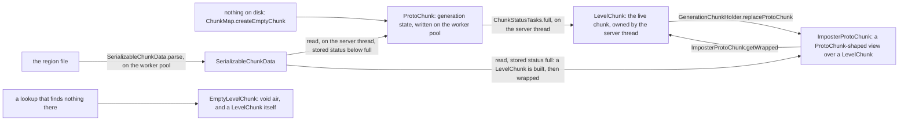
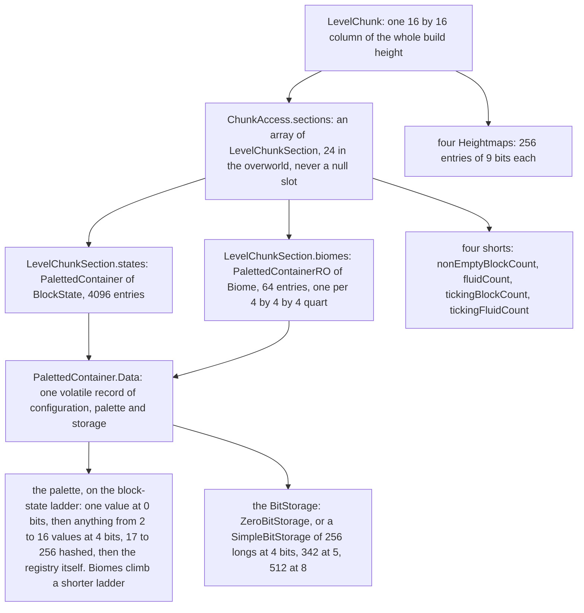

# Chunk anatomy

> Verified against **Minecraft 26.2** · Part IV · One block is placed, and the write travels down through the chunk until it lands in four bits of one long.

You place a single block of deepslate at y −40, in a section that until now
held nothing but stone and air. The click ends in `LevelChunk.setBlockState`,
and the write goes down four objects: a `LevelChunkSection` sixteen blocks
tall, a `PalettedContainer` of 4,096 block states, a palette that turns the
state into a small integer, and a `SimpleBitStorage` that puts that integer
into some fixed number of bits of one long. Everything else in this part
*moves* chunks — tickets load them, the pyramid generates them, the light
engine walks them, the region file stores them. This is the page that looks
inside, and it is the vocabulary the rest of the part spends. Begin with the
part that surprises people: **a section holding two distinct block states
costs exactly what one holding sixteen costs — four bits an entry, 256
longs, on disk as well as in memory — and the block that makes it seventeen
re-encodes all 4,096 entries into a wider storage before it can be written.**

## The cast

| class | what it decides | thread |
|---|---|---|
| `ChunkAccess` | everything a chunk has whatever its shape: position, height, sections, heightmaps, block entities, structures, the two volatile flags | abstract — whichever thread owns the shape below |
| `ProtoChunk` | a chunk under construction: status, carving mask, entities as NBT, the light engine it reports to | written on the worker pool, one writer at a time |
| `LevelChunk` | a chunk that is part of a `Level`: block entities, tickers, tick containers, the full-status supplier | the server thread — on the client, the client's main thread |
| `ImposterProtoChunk` | what a still-generating neighbour sees when the chunk it asked for is already live | the server thread |
| `LevelChunkSection` | 16×16×16: two palette containers and four counters that let a whole section be skipped | whichever thread holds its permit |
| `PalettedContainer` | the mapping from 4,096 (or 64) entries to values, and when to widen it | one writer at a time, enforced by `ThreadingDetector`; reads are lock-free |
| `Strategy` | which palette and which bit width each entry count deserves, for block states and for biomes | immutable, shared by every container in the level |
| `Heightmap` | the top of each of 256 columns, for one definition of *top* | with the chunk that owns it |

## The four shapes a chunk takes

`ChunkAccess` is the abstract chunk and has exactly two direct concrete
lines — `ProtoChunk` (`ChunkType.PROTOCHUNK`) and `LevelChunk`
(`ChunkType.LEVELCHUNK`) — with `ImposterProtoChunk` a subclass of the first
and `EmptyLevelChunk` of the second. Nothing else extends it.

Every one of them carries the same core. `ChunkAccess.chunkPos` says where
it is, and a `LevelHeightAccessor` says how tall: `LevelHeightAccessor.getMinY`
and `LevelHeightAccessor.getHeight` are the only two facts about height there
are, and the overworld's −64 and 384 give `LevelHeightAccessor.getSectionsCount`
of **24**, section Y −4 through 19. Beside them sit the heightmaps, the block
entities in two maps (`ChunkAccess.blockEntities` live, `ChunkAccess.pendingBlockEntities`
still NBT, `ChunkAccess.getBlockEntitiesPos` the union),
`ChunkAccess.structureStarts` and `ChunkAccess.structuresRefences` (Mojang's
spelling), the per-section `ChunkAccess.postProcessing` offsets to revisit
after load (`ProtoChunk.packOffsetCoordinates` packs four bits each of x, y
and z into a short), `ChunkAccess.inhabitedTime` behind local difficulty
([the level tick](../server/server-level-tick.md)), `ChunkAccess.upgradeData`
and the nullable `ChunkAccess.blendingData` whose presence *is*
`ChunkAccess.isOldNoiseGeneration` ([blending](../worldgen/blending.md)),
and two *volatile* flags —
`ChunkAccess.unsaved`, whose test-and-clear `ChunkAccess.tryMarkSaved` the
saver uses, and `ChunkAccess.isLightCorrect`, saved as *isLightOn*. It is
also three interfaces at once — `LightChunk`, which is what the light engine
reads through `LightChunk.findBlockLightSources` and
`LightChunk.getSkyLightSources`, plus `StructureAccess` and
`BiomeManager.NoiseBiomeSource` — and `ChunkAccess.getPersistedStatus` is
the `ChunkStatus` that goes to disk, with `ChunkAccess.getHighestGeneratedStatus`
folding in `BelowZeroRetrogen.targetStatus` for a chunk still being deepened.

A `ProtoChunk` adds what only generation needs: a volatile
`ProtoChunk.status` (`ProtoChunk.setPersistedStatus` also retires a finished
`BelowZeroRetrogen`), a `ProtoChunk.lightEngine` from
`ProtoChunk.setLightEngine` that it reports to only once the status
`ChunkStatus.isOrAfter` `ChunkStatus.INITIALIZE_LIGHT`, its entities as a
list of `CompoundTag` (`ProtoChunk.addEntity` serialises on the spot), a
`ProtoChunk.carvingMask`, and `ProtoChunkTicks` that
`ProtoChunk.unpackBlockTicks` turns into `LevelChunkTicks` on promotion
([scheduled ticks](scheduled-ticks.md)). The pool that fills all of that in
is [the generation pipeline](chunk-generation-pipeline.md). Ask it for a
biome before `ChunkStatus.BIOMES` and `ProtoChunk.getNoiseBiome` throws
*Asking for biomes before we have biomes*.

A `LevelChunk` adds what only a live chunk needs: `LevelChunk.level`,
`LevelChunk.setLoaded`, a supplier of `FullChunkStatus` the holder owns
([tickets](tickets-and-loading.md)), two `LevelChunkTicks` that
`LevelChunk.registerTickContainerInLevel` attaches to the level's queues and
`LevelChunk.unregisterTickContainerFromLevel` detaches, the ticker map, a
one-shot `LevelChunk.postLoad` processor that `LevelChunk.runPostLoad`
fires, the per-section `LevelChunk.gameEventListenerRegistrySections` — an
`EuclideanGameEventListenerRegistry` each, built on demand and only on a
server ([game events](game-events-and-vibrations.md)) — and a
`LevelChunk.unsavedListener` that `LevelChunk.markUnsaved` fires **only on
the false-to-true edge**, which is how the server's dirty set learns of a
change without scanning. Its `LevelChunk.getPersistedStatus` is always
`ChunkStatus.FULL`.

`ImposterProtoChunk` exists because a neighbour still generating asks the
holder for "the chunk at status X" and must be handed something
`ProtoChunk`-typed even when that chunk is already live. Reads delegate to
`ImposterProtoChunk.getWrapped`; writes are dropped unless *allowWrites*,
and heightmaps, structure starts and references and block-entity NBT are
dropped even then. `ImposterProtoChunk.getSections` hands back the wrapped
chunk's array unconditionally — only the single-section
`ImposterProtoChunk.getSection` is gated — while
`ImposterProtoChunk.markUnsaved` and `ImposterProtoChunk.setLightCorrect`
always pass through and `ImposterProtoChunk.canBeSerialized` is false,
because the `LevelChunk` under it is what gets saved. Its
`ImposterProtoChunk.fixType` maps a request for a *_WG* heightmap onto the
live one, but only inside `ImposterProtoChunk.getHeight`: asking it to
*create* a *_WG* heightmap creates a real one on the live chunk.

`EmptyLevelChunk` is the other direction: `Blocks.VOID_AIR` everywhere,
`EmptyLevelChunk.isEmpty` true where `LevelChunk.isEmpty` is false, one
fixed biome, and `EmptyLevelChunk.getFullStatus` a flat
`FullChunkStatus.FULL`. `ClientChunkCache.emptyChunk` is one shared instance
handed out for *any* client miss, and only when the caller asked to load or
generate — otherwise the miss returns null; `PathNavigationRegion` builds
its own for whatever a mob's pathfinder cannot see. The real client chunks
live in `ClientChunkCache.Storage`, an `AtomicReferenceArray` ring whose
`ClientChunkCache.Storage.onSectionEmptinessChanged` and its double-buffered
added and removed sets are the renderer's feed of which sections exist.

## Sections and their four counters

The array never has a hole: `ChunkAccess.replaceMissingSections` runs in the
constructor and fills every empty slot with a fresh all-air section from the
level's `PalettedContainerFactory`, so nothing that walks sections checks
for null.

The four counters are what make a section cheap to skip.
`LevelChunkSection.setBlockState` adjusts all four from the outgoing and
incoming state on every single write — `LevelChunkSection.nonEmptyBlockCount`
(zero is `LevelChunkSection.hasOnlyAir`, which is also how
`LevelChunk.getBlockState` answers air without touching a palette),
`LevelChunkSection.fluidCount`, `LevelChunkSection.tickingBlockCount` and
`LevelChunkSection.tickingFluidCount` — and `LevelChunkSection.isRandomlyTicking`
is the *or* of the last two. That one boolean lets `ServerLevel` skip a
section of solid stone without looking at any of its 4,096 blocks. Only a
load from disk recounts: `LevelChunkSection.recalcBlockCounts` runs from the
two-container constructor, whose only caller is `SerializableChunkData`.

Biomes share the section but are coarse and read-only.
`LevelChunkSection.BIOME_CONTAINER_BITS` is 2 — two bits per axis, 64
entries of 4×4×4 blocks each — and the field is a `PalettedContainerRO` that
is never mutated: `LevelChunkSection.fillBiomesFromNoise`,
`LevelChunkSection.read` and `LevelChunkSection.readBiomes` each build a
replacement through `PalettedContainerRO.recreate` and swap the reference.
Only block states resize in place.

Two different copies leave a section. The saver takes
`LevelChunkSection.copy`, a deep copy of both containers and all four
counters, on the server thread inside `SerializableChunkData.copyOf` — the
IO lane never sees a live section, and even the NBT encoding of the copy
runs on the background pool ([chunk storage](chunk-storage.md)). The client
mesher takes something cheaper: a `SectionCopy` takes `PalettedContainer.copy`
of the block-state container alone (nothing at all when the section is air)
plus an immutable snapshot of the chunk's block-entity map. A worker that
means to write instead brackets its work with `LevelChunkSection.acquire`
and `LevelChunkSection.release`.

## The palette and the ladder it climbs

A `PalettedContainer`'s whole state is one *volatile* record,
`PalettedContainer.Data`, holding a `Configuration`, a `Palette` and a
`BitStorage`. `PalettedContainer.get` reads the record once into a local and
takes no lock; a resize and a `PalettedContainer.read` from the wire each
swap in a whole new record. Which record a given entry count deserves is
decided by a top-level `Strategy` — no longer nested inside the container —
whose `Strategy.createForBlockStates` and `Strategy.createForBiomes` are
called once per level by `PalettedContainerFactory.create` over
`Block.BLOCK_STATE_REGISTRY` and the biome registry, which is why the global
palette's width is a runtime number and not a constant.

`Strategy.getConfigurationForBitCount` is the ladder, and block states and
biomes climb different ones:

| distinct values (bits needed) | block states | biomes |
|---|---|---|
| 1 (0 bits) | `Strategy.ZERO_BITS` → `SingleValuePalette` + `ZeroBitStorage` | the same |
| 2 … 8 (1–3 bits) | `Strategy.FOUR_BITS_LINEAR` → `LinearPalette`, **already 4 bits** | `Strategy.ONE_BIT_LINEAR` / `Strategy.TWO_BITS_LINEAR` / `Strategy.THREE_BITS_LINEAR` → `LinearPalette` at its own width |
| 9 … 16 (4 bits) | `Strategy.FOUR_BITS_LINEAR`, **still 4 bits** | `Configuration.Global` already |
| 17 … 256 (5–8 bits) | `Strategy.FIVE_BITS_HASHMAP` … `Strategy.EIGHT_BITS_HASHMAP` → `HashMapPalette` | `Configuration.Global` — there is no hashed tier for biomes |
| more | `Configuration.Global` → `GlobalPalette`, the registry's own `IdMap` | `Configuration.Global` |

`SingleValuePalette` holds one value and asks for width 1 the moment a
second arrives — which for block states means jumping straight to the 4-bit
rung. `LinearPalette` is a flat array of *2^bits* slots scanned by identity,
`HashMapPalette` a `CrudeIncrementalIntIdentityHashBiMap`, and
`GlobalPalette` writes nothing on the wire, maps an unknown value to id 0
and answers `Palette.maybeHas` with an unconditional yes. Each of them calls
`PaletteResize.onResize` when it fills, and the container *is* its own
`PaletteResize`: `PalettedContainer.onResize` builds the next record,
`PalettedContainer.Data.copyFrom` walks every entry of the old storage
through the old palette into the new one, the record is published, and only
then is the value that triggered the growth added — under
`PaletteResize.noResizeExpected`, which throws if a second growth were
somehow needed.

`SimpleBitStorage` never lets an entry straddle a long: its
`SimpleBitStorage.valuesPerLong` is 64 divided by the width, so 4,096
entries are 256 longs at four bits, 342 at five and 512 at eight, and the
cell index comes from a multiply-shift table (`SimpleBitStorage.MAGIC`)
rather than a division. `ZeroBitStorage` answers 0 for everything and shares
one empty `ZeroBitStorage.RAW` array. An array of the wrong length raises
`SimpleBitStorage.InitializationException`, which `PalettedContainer.unpack`
turns into a `DataResult` error instead of a crash.

### What packing actually buys

The two serialised forms differ. `PalettedContainer.write` is the wire: a
bits byte, the palette, a fixed-size long array at exactly the in-memory
width. `PalettedContainer.pack` is the disk (the *palette* and optional
*data* fields of a `PalettedContainerRO.PackedData`, behind
`PalettedContainer.codecRW` and
`PalettedContainer.codecRO` — [codecs](../foundations/codecs-nbt-json.md)),
and it re-encodes into a fresh `HashMapPalette` before asking
`Strategy.getConfigurationForPaletteSize` for the width — **the same ladder
memory climbs**. Packing therefore buys a smaller palette, not narrower
entries: unreferenced entries are dropped, which can demote a container a
whole rung, and a `Configuration.Global` container shrinks from
`Configuration.bitsInMemory` to `Configuration.bitsInStorage`.
`PalettedContainer.unpack` re-encodes on the way back only for
`Configuration.Global`, whose `Configuration.alwaysRepack` is true — every
`Configuration.Simple` rung reports one width for both, so its long array is
adopted exactly as it lies on disk.

## The six heightmaps

A `Heightmap` is 256 entries — one per column, indexed *x + z·16* — in a
`SimpleBitStorage` whose width is `Mth.ceillog2` of height + 1, so **9 bits**
for a 384-tall world, stored relative to the minimum Y.
`Heightmap.getFirstAvailable` is the first free Y and `Heightmap.getHighestTaken`
the one below it. `Heightmap.primeHeightmaps` fills several types in a
single top-down column scan (starting from the deprecated-for-removal
`ChunkAccess.getHighestSectionPosition`) into maps that
`ChunkAccess.getOrCreateHeightmapUnprimed` makes on demand. `Heightmap.update`
is the incremental path, raising the height when an opaque block is placed
at or above it and rescanning downward only when the block that turned
transparent was the top one.

| type | *opaque* means | usage | saved | sent |
|---|---|---|---|---|
| `Heightmap.Types.WORLD_SURFACE_WG` | not air | `Heightmap.Usage.WORLDGEN` | proto only | no |
| `Heightmap.Types.WORLD_SURFACE` | not air | `Heightmap.Usage.CLIENT` | yes | yes |
| `Heightmap.Types.OCEAN_FLOOR_WG` | blocks motion | `Heightmap.Usage.WORLDGEN` | proto only | no |
| `Heightmap.Types.OCEAN_FLOOR` | blocks motion | `Heightmap.Usage.LIVE_WORLD` | yes | **no** |
| `Heightmap.Types.MOTION_BLOCKING` | blocks motion or holds fluid | `Heightmap.Usage.CLIENT` | yes | yes |
| `Heightmap.Types.MOTION_BLOCKING_NO_LEAVES` | the same, but not a `LeavesBlock` | `Heightmap.Usage.CLIENT` | yes | yes |

Which of the six a chunk carries follows its status:
`ChunkStatus.heightmapsAfter` is the two *_WG* maps through
`ChunkStatus.SURFACE` and `ChunkStatus.FINAL_HEIGHTMAPS` — the other four —
from `ChunkStatus.CARVERS` on, and a `LevelChunk` is constructed with
exactly those four. A `ProtoChunk` primes any of its status's maps that are
missing the first time a block is written. What is *saved*, though, is not
`Heightmap.Types.keepAfterWorldgen`: the saver writes whatever the chunk's
**persisted** status names, so a proto chunk stored below
`ChunkStatus.CARVERS` does save its two *_WG* maps. Separately and privately,
`ChunkAccess.skyLightSources` is a *second* 256-entry bit storage — a
`ChunkSkyLightSources` — that only the sky-light engine reads
([lighting](lighting.md)).

## What placing a block actually does

`LevelChunk.setBlockState` is the one write path into a live chunk, and its
order matters more than any single step in it:

| in order | what happens | when it is skipped |
|---|---|---|
| 1 | the section is fetched and its emptiness remembered | air into an all-air section returns null immediately |
| 2 | `LevelChunkSection.setBlockState` writes the palette entry and moves all four counters | — |
| 3 | the old state is compared to the new | identical state returns null, and nothing below runs |
| 4 | all four heightmaps take `Heightmap.update` | — |
| 5 | if the section's emptiness flipped: `LevelLightEngine.updateSectionStatus` and `ChunkSource.onSectionEmptinessChanged` | when it did not flip |
| 6 | if `LightEngine.hasDifferentLightProperties`: `ChunkSkyLightSources.update`, then `LevelLightEngine.checkBlock` | when opacity and emission are unchanged |
| 7 | the old block entity is dropped, preceded on the server by `BlockEntity.preRemoveSideEffects` | when the block did not change, had no block entity, or `BlockBehaviour.BlockStateBase.shouldChangedStateKeepBlockEntity` — the side effects alone are skipped on the client and under `Block.UPDATE_SKIP_BLOCK_ENTITY_SIDEEFFECTS` |
| 8 | `BlockBehaviour.BlockStateBase.affectNeighborsAfterRemoval` | when the block did not change and the new one is no `BaseRailBlock`, off the server, or without `Block.UPDATE_NEIGHBORS` and not moved by a piston |
| 9 | the section is re-read — if step 8 changed the block again, the call returns null | — |
| 10 | `BlockBehaviour.BlockStateBase.onPlace` | on the client, or under `Block.UPDATE_SKIP_ON_PLACE` |
| 11 | the new block entity is created or re-validated, and its ticker rebound | when the new state has no block entity |
| 12 | `LevelChunk.markUnsaved` | — |

Two steps there are easy to misread. Step 8 is a genuine neighbour side
effect *inside* the chunk write, but it is the removed block's own
clean-up — shape updates and redstone notifications belong to
`Level.setBlock`, after the chunk returns
([blocks and states](../blocks/blocks-and-states.md)). Step 9 exists because
step 8 runs arbitrary block code that may write the same position again, and
`LevelChunk.setBlockState` will not claim a placement it no longer owns.

`ProtoChunk.setBlockState` is the same idea with everything live stripped
out: section write, light only past `ChunkStatus.INITIALIZE_LIGHT`, the
status's heightmaps updated (primed first if absent), and no block entity,
no `BlockBehaviour.BlockStateBase.onPlace`, no neighbours at all.

### The double indirection behind step 11

`LevelChunk` holds every block-entity ticker in the world's hot loop, and it
does so at one remove.
`LevelChunk.addAndRegisterBlockEntity` sets the entity, registers its
game-event listener and asks for its ticker; a
`LevelChunk.BoundTickingBlockEntity` binds the entity to its
`BlockEntityTicker` and gates every tick on `LevelChunk.isTicking` (inside
the world border, at `FullChunkStatus.BLOCK_TICKING` or beyond, entities
loaded). That sits inside a `LevelChunk.RebindableTickingBlockEntityWrapper`
held in `LevelChunk.tickersInLevel`, so `Level.blockEntityTickers` keeps one
stable handle per position for the life of the chunk and removal is only a
`LevelChunk.RebindableTickingBlockEntityWrapper.rebind` to
`LevelChunk.NULL_TICKER`, whose `TickingBlockEntity.isRemoved` is true and
lets the level's list prune itself. When the chunk first goes live,
`LevelChunk.postProcessGeneration` replays the post-processing offsets,
promotes every pending block entity and applies `UpgradeData.upgrade`.

## Questions players ask

**Why do two threads writing one section crash the game rather than block?**
Because `PalettedContainer.threadingDetector` is a detector, not a mutex.
`ThreadingDetector.checkAndLock` tries a one-permit semaphore and, on
failure, records itself as the loser and then blocks. It is the **winner**
that notices, in `ThreadingDetector.checkAndUnlock`: it builds
`ThreadingDetector.makeThreadingException` — *Accessing PalettedContainer
from multiple threads*, with both stack traces — and throws it, and the
loser re-throws the same report the instant it acquires the permit. Both
threads die, deliberately: an interleaved section write would be a corrupt
world rather than a crash. Exactly one thread writes a section at a time —
the server thread for a live chunk, and on the worker pool whoever holds
`LevelChunkSection.acquire`, either `NoiseBasedChunkGenerator` for its own
section or a `BulkSectionAccess` holding every section a feature such as
`OreFeature` touches until it closes. Those hold the permit already, so they
write through the unchecked five-argument `LevelChunkSection.setBlockState`
and `PalettedContainer.getAndSetUnchecked`.

**Why are a client chunk's ticking counters zero?** Because
`LevelChunkSection.write` carries only two of the four shorts, the
non-empty-block and fluid counts, and `LevelChunkSection.read` takes exactly
those two and never recounts. A client section therefore starts with
`LevelChunkSection.tickingBlockCount` and
`LevelChunkSection.tickingFluidCount` at zero and only ever counts what has
changed since the chunk arrived. Nothing notices: the only reader of
`LevelChunkSection.isRandomlyTicking` is `ServerLevel`, and the client runs
no random ticks.

**Why does the proto chunk keep working after the level chunk exists?**
Because the two share the sections but not the array. `ChunkAccess` always
allocates its own array and copies the references in, so promotion leaves
two chunks holding two arrays over one set of `LevelChunkSection` objects —
writing through either is writing the same blocks. That is also what makes
the `ImposterProtoChunk` honest: it is a third handle on the same sections.

**Why does a chest in a freshly loaded chunk not exist yet?** Because it is
still a `CompoundTag` in `ChunkAccess.pendingBlockEntities`
([block entities](../blocks/block-entities.md)). Any call to
`LevelChunk.getBlockEntity` promotes it through
`LevelChunk.promotePendingBlockEntity` on the first touch, whatever the
`LevelChunk.EntityCreationType` asked for; `LevelChunk.postProcessGeneration`
and `LevelChunk.registerAllBlockEntitiesAfterLevelLoad` promote the rest in
bulk when the chunk goes live. Of the three creation types only
`LevelChunk.EntityCreationType.IMMEDIATE` and
`LevelChunk.EntityCreationType.CHECK` have callers left in the game —
`LevelChunk.EntityCreationType.QUEUED` has none.

**Why can a search skip a whole section without reading it?** Because
`LevelChunkSection.maybeHas` puts the predicate to the palette alone, so
`ChunkAccess.findBlocks` can rule out 4,096 blocks with a handful of
comparisons — unless the section is on the global palette, whose answer is
always *maybe*.

**What does the client actually receive?** `ClientboundLevelChunkWithLightPacket`,
whose `ClientboundLevelChunkPacketData` carries the heightmaps for which
`Heightmap.Types.sendToClient` is true (three of the six), one buffer
holding *every* section's `LevelChunkSection.write` — empty ones included —
and the block-entity update tags. The writer pre-sizes that buffer from the
sum of `LevelChunkSection.getSerializedSize` and throws if
`ClientboundLevelChunkPacketData.extractChunkData` does not fill it to the
byte, and the reader refuses anything over two megabytes. Light rides beside
it in `ClientboundLightUpdatePacketData`. The client applies the lot through
`ClientPacketListener.updateLevelChunk` → `ClientChunkCache.replaceWithPacketData`
→ `LevelChunk.replaceWithPacketData`, which clears the block entities, gives
each section `LevelChunkSection.read`, installs the raw heightmaps with
`ChunkAccess.setHeightmap` and rebuilds the sky-light sources. Biome-only
refreshes come later as `ClientboundChunksBiomesPacket` →
`LevelChunk.replaceBiomes`, and the block-entity tags travel as
`ClientboundLevelChunkPacketData.BlockEntityInfo`.

## Where to look

`ChunkAccess` · `LevelChunk.setBlockState` · `LevelChunk.getBlockEntity` ·
`ProtoChunk.setBlockState` · `ImposterProtoChunk` · `ChunkStatusTasks.full` ·
`LevelChunkSection.setBlockState` · `LevelChunkSection.write` ·
`PalettedContainer.onResize` · `PalettedContainer.pack` ·
`PalettedContainer.unpack` · `Strategy.createForBlockStates` ·
`Configuration.Global` · `SimpleBitStorage` · `ThreadingDetector.checkAndLock` ·
`BulkSectionAccess` · `Heightmap.Types` · `ChunkStatus.heightmapsAfter` ·
`ClientChunkCache.Storage` · `ClientboundLevelChunkPacketData.extractChunkData` ·
the [class index](../../reference/class-index.md) for every field no page names

---

*Rules: names, never code · how the system works, not how the code reads ·
newest version only · every backticked name passes `tools/verify_names.py`.*
