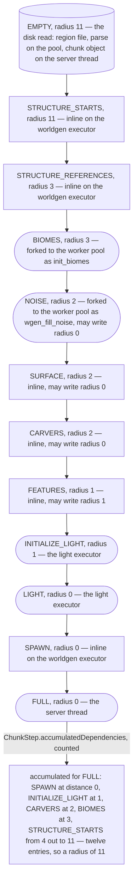
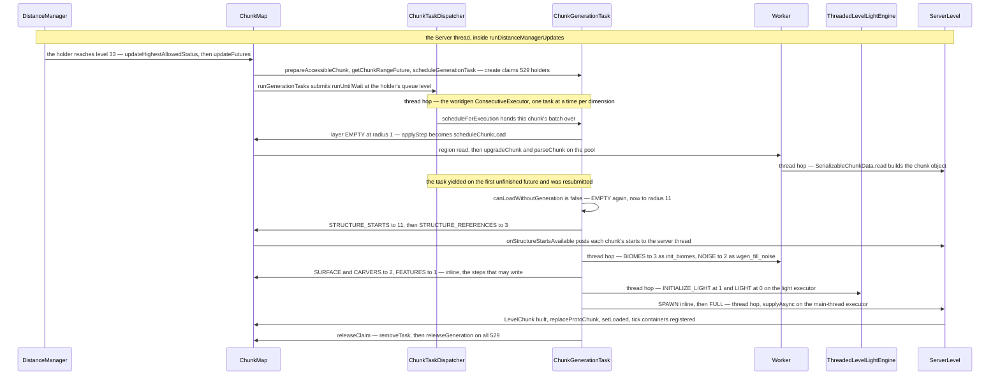

# The chunk generation pipeline

> Verified against **Minecraft 26.2** · Part IV · A ticket asks for one chunk at *FULL*, and the server claims five hundred and twenty-nine of them before it runs a single step.

A player walks east, a loading ticket lands on the chunk that just entered
view, and `ChunkHolder.updateFutures` asks that chunk for `ChunkStatus.FULL`.
Nothing in the request mentions neighbours. But *FULL* is the last of twelve
steps, and the steps below it read — and four of them write — the chunks
around the one being built, so the first thing `ChunkGenerationTask.create`
does is walk out to Chebyshev distance 11 and take a claim on every holder in
that square: **asking for one chunk asks for 529 of them, and the eleven
rings it claims will never, on this task's account, become chunks you could
stand on.** Eleven is not a tuning constant. It is the index of the last entry of
`ChunkStep.accumulatedDependencies` for the FULL step — a twelve-entry list,
one per ring from the centre out: `ChunkLevel.RADIUS_AROUND_FULL_CHUNK` reads
that radius off the pyramid, and `ChunkLevel.MAX_LEVEL`, 44, is 33 plus it.
Change the pyramid and the world's loading radius changes with it.

## The cast

| class | what it decides | thread |
|---|---|---|
| `ChunkStatus` | the twelve names and their order, and nothing else — no task, no radius, no work | static, a `BuiltInRegistries.CHUNK_STATUS` entry |
| `ChunkPyramid` | the two step lists — one for generating, one for loading — that say what each status needs and what runs it | static |
| `ChunkStep` | one status's direct and accumulated dependencies, its block-state write radius, and its body | static |
| `ChunkGenerationTask` | one (chunk, target) walk: which layer is in flight, which pyramid it is using, and when to yield | the *worldgen* executor |
| `GenerationChunkHolder` | one chunk's twelve futures, its ticket-derived ceiling, and the compare-and-set that runs each step exactly once | any — every field of it is atomic |
| `ChunkMap` | makes the tasks, owns both executors, and turns the *EMPTY* step into a disk read | Server, but `ChunkMap.applyStep` runs on whatever thread reached it |
| `ChunkTaskDispatcher` | which chunk's batch of work the executor gets next, and re-sorts the queue when tickets move | its own single-file queue on the worker pool |
| `WorldGenRegion` | what a running step may read and what it may write, checked per call | the thread running the step |

## The pyramid, drawn

Read it downward: that is the whole pipeline. The rounded steps are the five
that leave the *worldgen* executor, the cylinder is the one step that is not
worldgen at all, and the six plain boxes run inline. The radius on each node
is how wide that layer is swept **when the target is FULL and the task has
decided it must generate** — `ChunkGenerationTask.getRadiusForLayer` asks the
FULL step of whichever pyramid is in play for
`ChunkStep.getAccumulatedRadiusOf` that status. A task aiming lower sweeps
narrower rings, and a chunk that only ever reaches *STRUCTURE_STARTS* is
swept at radius 0 by its own task. *EMPTY* is the node to read twice: the
first sweep is the loading pyramid's radius 1, and only a chunk that turns
out to need generating is swept at 11, as the load-or-generate section below
explains.

A `ChunkStatus` carries no work. It is a registry entry with an index, a
parent, a `ChunkType` (`ChunkType.PROTOCHUNK` for the first eleven,
`ChunkType.LEVELCHUNK` for `ChunkStatus.FULL`) and the heightmaps that become
valid after it, `ChunkStatus.heightmapsAfter`. Everything else — the
dependencies, the write radius, the body — lives in the `ChunkStep` that
`ChunkPyramid` holds for that status. Each step is built from its
predecessor, so every step silently requires its own parent status at
distance 0 before it declares anything; `ChunkStep.Builder.addRequirement`
then widens the array outward, taking the later of the two statuses at every
distance already covered.

The generation pyramid's declared requirements, with the parent requirement
resolved in:

| step | needs | may write |
|---|---|---|
| *STRUCTURE_STARTS* | *EMPTY* at 0 | — |
| *STRUCTURE_REFERENCES* | *STRUCTURE_STARTS* from 0 out to 8 | — |
| *BIOMES* | *STRUCTURE_REFERENCES* at 0, *STRUCTURE_STARTS* out to 8 | — |
| *NOISE* | *BIOMES* within 1, *STRUCTURE_STARTS* out to 8 | radius 0 |
| *SURFACE* | *NOISE* at 0, *BIOMES* at 1, *STRUCTURE_STARTS* out to 8 | radius 0 |
| *CARVERS* | *SURFACE* at 0, *STRUCTURE_STARTS* out to 8 | radius 0 |
| *FEATURES* | *CARVERS* within 1, *STRUCTURE_STARTS* out to 8 | radius 1 |
| *LIGHT* | *INITIALIZE_LIGHT* within 1 | — |
| *SPAWN* | *LIGHT* at 0, *BIOMES* at 1 | — |

The rows that do the work are the radius-1 ones: they force a neighbour to
run one step ahead of the chunk being built. Five requirements in the pyramid
have radius 1, but only three of them widen the accumulated list, because
`ChunkStep.Builder.getRadiusOfParent` counts a debt only when the step's own
parent already sits a ring out. *NOISE* wanting *BIOMES*, *FEATURES* wanting
*CARVERS* and *LIGHT* wanting *INITIALIZE_LIGHT* each add one; *SURFACE* and
*SPAWN*, which also ask for *BIOMES* within 1, add nothing. Three ones on top
of *STRUCTURE_STARTS* out to 8 is where the 11 comes from. `ChunkStatus.MAX_STRUCTURE_DISTANCE` is declared as 8 and never read —
the pyramid writes the literal each time.

The same arithmetic sets the edge of the world. `ChunkPyramid.SAFETY_MARGIN_CHUNKS`
is 32 plus the twelve accumulated entries plus one, doubled — 90 chunks —
subtracted from the coordinate maximum to give
`ChunkPyramid.MAX_CHUNK_COORDINATE_VALUE`, which `ChunkPos.isValid` enforces
and the `GenerationChunkHolder` constructor throws on. It is a guard against
arithmetic, not against players: at about 33.5 million blocks it sits three
and a half million blocks *outside* `Level.MAX_LEVEL_SIZE`, the ±30 000 000
nobody can build past anyway.

## A ticket sets a ceiling, and a separate call names the target

Two different numbers reach a holder from the ticket system
([tickets and loading](tickets-and-loading.md)). `DistanceManager.runAllUpdates`
first gives every touched holder `GenerationChunkHolder.updateHighestAllowedStatus`,
which is `ChunkLevel.generationStatus` of the new ticket level — 33 is *FULL*,
34 is *INITIALIZE_LIGHT*, 35 *CARVERS*, 36 *BIOMES*, 37 through 44
*STRUCTURE_STARTS*, and 45 is no status at all. That is a ceiling, not a
goal: `GenerationChunkHolder.isStatusDisallowed` gates every request against
it and hands back `GenerationChunkHolder.UNLOADED_CHUNK_FUTURE` for anything
above. Then `ChunkHolder.updateFutures` crosses `FullChunkStatus.FULL`,
calls `ChunkMap.prepareAccessibleChunk`, and *that* names the target:
`ChunkMap.getChunkRangeFuture` over the 3×3, `ChunkStatus.FULL` on the
centre and `ChunkLevel.getStatusAroundFullChunk` — *INITIALIZE_LIGHT* — on
the eight around it, each through `GenerationChunkHolder.scheduleChunkGenerationTask`.

If the ceiling later drops, `GenerationChunkHolder.updateHighestAllowedStatus`
fails every pending future between the new ceiling and the old with
`GenerationChunkHolder.UNLOADED_CHUNK` and reschedules the task at the
highest status anyone is still waiting for. Nothing is interrupted; a worker
mid-step finishes it and finds nobody listening.

The other way in is synchronous. `ServerChunkCache.getChunk` from the server
thread adds a `TicketType.UNKNOWN` ticket, runs the distance updates inline
so the holder exists, and then `BlockableEventLoop.managedBlock`s on the
future — with `ServerChunkCache.MainThreadExecutor.pollTask` overridden to
drain chunk work while it waits, so the thread that is blocked on generation
is also the thread finishing it.

## The task claims its 529 before it runs anything

`GenerationChunkHolder.scheduleChunkGenerationTask` finds no task in flight,
so `GenerationChunkHolder.rescheduleChunkTask` calls
`ChunkMap.scheduleGenerationTask` and `ChunkGenerationTask.create` builds the
holder set: a `StaticCache2D` whose radius is the *generation* pyramid's
accumulated radius of `ChunkStatus.EMPTY` for the target — 11 for *FULL* —
filled by `GeneratingChunkMap.acquireGeneration`, the five-method interface
`ChunkMap` implements and the pipeline actually holds. That radius is taken
from the generation pyramid unconditionally, before anything has looked at
the disk, so even a chunk that turns out to be sitting complete in a region
file claims all 529 holders first.

The claim is a reference count. `GenerationChunkHolder.increaseGenerationRefCount`
on the first claim arms `GenerationChunkHolder.generationSaveSyncFuture` and
hangs it off the holder's save dependency, so nothing in the square can be
saved or unloaded while the task lives ([chunk storage](chunk-storage.md)).
The task itself waits in `ChunkMap.pendingGenerationTasks` until
`ChunkMap.runGenerationTasks`, at the end of the same
`ServerChunkCache.runDistanceManagerUpdates` that created it.

## Dispatch, and why the parallelism is smaller than the thread names

`ChunkMap` builds two `ConsecutiveExecutor`s over the shared worker pool,
named *worldgen* and *light*, each wrapped in a `ChunkTaskDispatcher`. A
`ConsecutiveExecutor` runs **one task at a time**: `AbstractConsecutiveExecutor.run`
pops a single item, runs it under the executor's name, and re-registers
itself on the pool. The dispatcher in front of it is a
`ChunkTaskPriorityQueue` of `ChunkTaskPriorityQueue.PRIORITY_LEVEL_COUNT`
buckets — 46, `ChunkLevel.MAX_LEVEL` plus two — keyed by the holder's queue
level, and `ChunkTaskDispatcher.scheduleForExecution` hands over one chunk's
runnables at a time, polling again only when they have all completed. So all
worldgen for a dimension is a single file, however many `Worker-Main-n`
threads the pool has (`Util.maxAllowedExecutorThreads`: cores minus one,
capped by the *max.bg.threads* property; there is no generation thread
setting).

**One** — worldgen runnables executing at a time per dimension
(`ChunkMap.worldgenTaskDispatcher`, over a single `ConsecutiveExecutor`).

Overlap comes from yielding, not from threads.
`ChunkGenerationTask.runUntilWait` returns the moment a layer holds a future
that is not yet done; `ChunkMap.runGenerationTask` chains a resubmit onto
that future and the executor moves to another chunk's task at once. No worldgen thread
ever blocks waiting for a neighbour, and a task parked on a biome fork costs
nothing.

Priority is live, not fixed at submission. `ChunkHolder.updateFutures` ends
by telling both dispatchers through `ChunkTaskDispatcher.onLevelChange`, and
`ChunkTaskPriorityQueue.resortChunkTasks` moves work already queued into its
new bucket — at a higher priority inside the dispatcher's own four-slot queue
than new submissions get, so "closer to a player runs first" stays true while
the player is moving. `ThrottlingChunkTaskDispatcher` is a subclass of the
same thing but is *not* worldgen: it caps how many player-view chunks the
ticket tracker may have in flight, on the main thread.

## The EMPTY step asks the only question that changes the walk

`ChunkGenerationTask.scheduleNextLayer` always begins with `ChunkStatus.EMPTY`
at the *loading* pyramid's radius, which for a *FULL* target is 1.
`ChunkMap.applyStep` special-cases that status: instead of a step body it
runs `ChunkMap.scheduleChunkLoad` — the region read, `ChunkMap.upgradeChunkTag`
on the pool under *upgradeChunk*, `SerializableChunkData.parse` on the pool
under *parseChunk*, the POI file prefetched alongside through
`SectionStorage.prefetch`, then `SerializableChunkData.read` **on the server
thread**. What comes out is a `ProtoChunk` at whatever status the file
recorded, an `ImposterProtoChunk` wrapping a real `LevelChunk` if the file
was already at *FULL*, or `ChunkMap.createEmptyChunk` when there was no file.
The futures are not done, so the task yields and is re-entered when they land
([chunk storage](chunk-storage.md)).

Now `ChunkGenerationTask.canLoadWithoutGeneration` decides. It wants the
centre persisted at or past the target, and every chunk in the loading
pyramid's accumulated square — for *FULL*, the 3×3 — at or past what its
distance requires there: *SPAWN* at the centre, *INITIALIZE_LIGHT* on the
ring. If that holds, the walk stays narrow. `ChunkPyramid.LOADING_PYRAMID`
passes seven of the twelve steps straight through and only four do anything —
`ChunkStatusTasks.loadStructureStarts`, which just posts the saved starts to
`StructureCheck`, the two light steps, and `ChunkStatusTasks.full`. **A
loaded chunk still walks all twelve steps**, and it still needs its 3×3
neighbours at *INITIALIZE_LIGHT* before its own *LIGHT* step will run.

If it does not hold, `ChunkGenerationTask.needsGeneration` goes true and
*EMPTY* is scheduled a second time, now at radius 11 — reading only the
chunks the first sweep did not touch.
`GenerationChunkHolder.applyStep` runs `GenerationChunkHolder.acquireStatusBump`,
a compare-and-set on `GenerationChunkHolder.startedWork` from a status's
parent to the status itself, so exactly one caller ever runs a step for a
holder and every other caller is handed the existing future.

And the choice of pyramid is made again for **every chunk in every layer**,
not once for the task. `ChunkGenerationTask.scheduleChunkInLayer` compares
that chunk's persisted status with the layer being applied and takes the
generation pyramid only if the chunk is genuinely behind, so a generating
task's 23×23 square routinely mixes both — which is exactly what stops
already-finished neighbours being generated a second time.

## Four steps may write, and only four

`ChunkStep`'s default block-state write radius is **−1**, not 0 — so for
eight of the twelve steps `WorldGenRegion.ensureCanWrite` fails even for the
chunk's own column, and `WorldGenRegion.setBlock` logs and returns false
rather than doing anything. Only *NOISE*, *SURFACE* and *CARVERS* (radius 0)
and *FEATURES* (radius 1) can change a block at all. What rides on those
steps — the density functions, the surface rules, the carvers, the features
and the structures they place — is Part XII's subject
([terrain](../worldgen/terrain.md),
[density functions](../worldgen/density-functions.md),
[structure placement](../worldgen/structure-placement.md)). This page is the conveyor.

*STRUCTURE_STARTS* runs `ChunkGenerator.createStructures` for every chunk in
the radius-11 square that is not already past it — seed and placement state
only, no terrain — and is skipped entirely when `WorldOptions.generateStructures`
is off. Either way `ServerLevel.onStructureStartsAvailable` posts the chunk's
starts to the server thread. *STRUCTURE_REFERENCES* then records, per chunk,
which starts within eight chunks reach into it: the reason starts needed a
radius of 8 around *it*. *BIOMES* forks — both `ChunkGenerator.createBiomes`
and `NoiseBasedChunkGenerator`'s override put the work on the pool under
*init_biomes* — so biomes always leave the worldgen executor. *NOISE* forks
only for `NoiseBasedChunkGenerator`, under *wgen_fill_noise*, and applies the
`BelowZeroRetrogen` bedrock fix-ups afterwards if the chunk is being deepened;
`FlatLevelSource` and `DebugLevelSource` return a completed future and stay
inline. *SURFACE* and *CARVERS* run inline at write radius 0. *FEATURES*
primes the four final heightmaps with `Heightmap.primeHeightmaps`, decorates,
and calls `Blender.generateBorderTicks`
([blending](../worldgen/blending.md)).

*FEATURES* is the interesting one, because a tree at a chunk edge writes into
a neighbour and nothing about that neighbour's status says it is safe. What
makes it safe is the executor: the layer steps its chunks one at a time, and
every worldgen task in the dimension is serialised behind the one
`ConsecutiveExecutor`, so no two feature steps in a dimension are ever
running at once. The ordinary cross-chunk write is the plain
`ChunkAccess.setBlockState`, which takes and releases the section per write;
only `OreFeature` holds a section open across many writes, through
`BulkSectionAccess` ([chunk anatomy](chunk-anatomy.md)).

### A read too far crashes, a read too wide only warns

Both bad accesses are caught, and they are caught differently. A read outside
the step's `ChunkStep.directDependencies` — too far away, or at a status that
distance does not guarantee — throws out of `WorldGenRegion.getChunk` as a
crash report naming the step, the requested and actual statuses, the distance
and the whole dependency list. A read that is merely outside the *write* zone
is a log warning from `WorldGenRegion.warnIfReadOutsideWriteZone`, naming the
feature through `WorldGenRegion.currentlyGenerating`. The first is a bug in
the pyramid; the second is a bug in a feature, and the game keeps going.

## Light runs on a second executor, and the task waits for it

`ChunkStatusTasks.initializeLight` calls `ChunkAccess.initializeLightSources`
and `ProtoChunk.setLightEngine` — from that moment the proto chunk forwards
block changes to the engine — and then hands the chunk to
`ThreadedLevelLightEngine.initializeLight`. `ChunkStatusTasks.light` follows
with `ThreadedLevelLightEngine.lightChunk`. Both queue through the *light*
`ChunkTaskDispatcher` onto the *light* `ConsecutiveExecutor`, and the future
each returns is completed by a later task on that same executor, so the
generation task genuinely parks here ([lighting](lighting.md)).

Both are passed a *lighted* flag from `ChunkStatusTasks.isLighted`: persisted
status at or past *LIGHT* **and** `ChunkAccess.isLightCorrect`. When it is
true, `ThreadedLevelLightEngine.lightChunk` skips propagation entirely and
only marks the chunk correct again. Light saved on disk is re-enabled, never
recomputed.

## FULL is assembled on the server thread

`ChunkStatusTasks.full` is scheduled exactly like the other eleven steps, but
its body is a *supplyAsync* on `WorldGenContext.mainThreadExecutor` — the
`ServerChunkCache.MainThreadExecutor`, a `BlockableEventLoop` pinned to the
server thread. There are two shapes it can take. If the chunk is already an
`ImposterProtoChunk`, because the file held a finished chunk, it unwraps the
`LevelChunk` inside and replaces nothing. Otherwise a `LevelChunk` is built
from the `ProtoChunk`, sharing its sections, and
`GenerationChunkHolder.replaceProtoChunk` rewrites slots 0 through 10 of the
holder's future array to an `ImposterProtoChunk` over it with writes
disallowed — every slot checked, and the whole step thrown out if any of them
is not a `ProtoChunk` or was changed by another thread in the meantime.

Then the chunk becomes part of the world, in order: `LevelChunk.setFullStatus`
wired to the holder, `LevelChunk.runPostLoad` turning `ProtoChunk.getEntities`
into real entities through `ServerLevel.addWorldGenChunkEntities`,
`LevelChunk.setLoaded`, `LevelChunk.registerAllBlockEntitiesAfterLevelLoad`,
`LevelChunk.registerTickContainerInLevel` and `LevelChunk.setUnsavedListener`.
`GenerationChunkHolder.completeFuture` publishes it at *FULL*.

Nothing here crosses the network. A chunk reaches a client only after the
separate promotion to `FullChunkStatus.BLOCK_TICKING`
([tickets and loading](tickets-and-loading.md)).

## Release, and what the ring is left as

`ChunkGenerationTask.runUntilWait` comes round, finds the scheduled status
equal to the target, and calls `ChunkGenerationTask.releaseClaim`:
`GenerationChunkHolder.removeTask` on the centre, then
`ChunkMap.releaseGeneration` on all 529. Every holder whose count reaches zero
completes its save-sync future, and the square is free to be saved or dropped
as its own tickets dictate — which the outer rings, only ever raised to the
status their distance demanded, mostly are.
`ChunkHolder.scheduleFullChunkPromotion` was called back in
`ChunkHolder.updateFutures`, long before any of this; what happens now is its
confirmation landing on the server thread and `ChunkMap.onFullChunkStatusChange` tells
the entity manager. `ChunkLoadCounter` watches this from outside — it counts
holders that reach *FULL* for the spawn progress bar, and that count is what
`MinecraftServer.prepareLevels` loops on until it is zero.

## The whole walk, once

## Questions players ask

**Why does adding cores not speed up world generation?** Because a dimension's
worldgen is one `ConsecutiveExecutor` running one task at a time, and the
dispatcher in front of it releases one chunk's work at a time. The pool is busy in parallel with plenty else — the *light*
executor beside it, the disk read and its datafix, the POI prefetch, the biome
and noise forks, the second dimension — but none of that is a second worldgen
lane. There is no thread-count setting for generation.

**Why does a chunk I have visited before still take work to load?** It walks
all twelve steps. Seven of them pass through and cost nothing, but the disk
read, the structure-start replay, both light steps and the *FULL* assembly are
real work, and the light steps need the 3×3 neighbours read first.

**Why does a chunk sometimes hang on the edge of the view forever?** Its
ticket level puts the ceiling below *FULL*.
`GenerationChunkHolder.isStatusDisallowed` refuses anything higher, so the
chunk sits at *STRUCTURE_STARTS* or *BIOMES*, correct and unfinished, for as
long as the level says so.

**Why is there a limit on how far out I can build?** Not because of the
pyramid. `ChunkPyramid.SAFETY_MARGIN_CHUNKS` does reserve 90 chunks at the
coordinate maximum so that a chunk at the edge still has its radius-11 square
to generate in, and `ChunkPos.isValid` refuses a holder outside it — but that
edge is three and a half million blocks further out than
`Level.MAX_LEVEL_SIZE`, which is the ±30 000 000 a player actually meets.

## Where to look

`ChunkPyramid.GENERATION_PYRAMID` · `ChunkPyramid.LOADING_PYRAMID` ·
`ChunkStep.getAccumulatedRadiusOf` · `ChunkDependencies.getRadiusOf` ·
`ChunkLevel.RADIUS_AROUND_FULL_CHUNK` · `ChunkGenerationTask.create` ·
`ChunkGenerationTask.runUntilWait` · `ChunkGenerationTask.scheduleNextLayer` ·
`ChunkGenerationTask.canLoadWithoutGeneration` ·
`ChunkGenerationTask.scheduleChunkInLayer` ·
`GenerationChunkHolder.scheduleChunkGenerationTask` ·
`GenerationChunkHolder.applyStep` · `GenerationChunkHolder.acquireStatusBump` ·
`ChunkMap.applyStep` · `ChunkMap.scheduleChunkLoad` ·
`ChunkMap.runGenerationTask` · `ChunkTaskDispatcher.scheduleForExecution` ·
`ChunkTaskPriorityQueue.resortChunkTasks` · `AbstractConsecutiveExecutor.run` ·
`ChunkStatusTasks.full` · `WorldGenRegion.getChunk` ·
`WorldGenRegion.ensureCanWrite` · `StaticCache2D`

---

*Rules: names, never code · how the system works, not how the code reads ·
newest version only · every backticked name passes `tools/verify_names.py`.*
