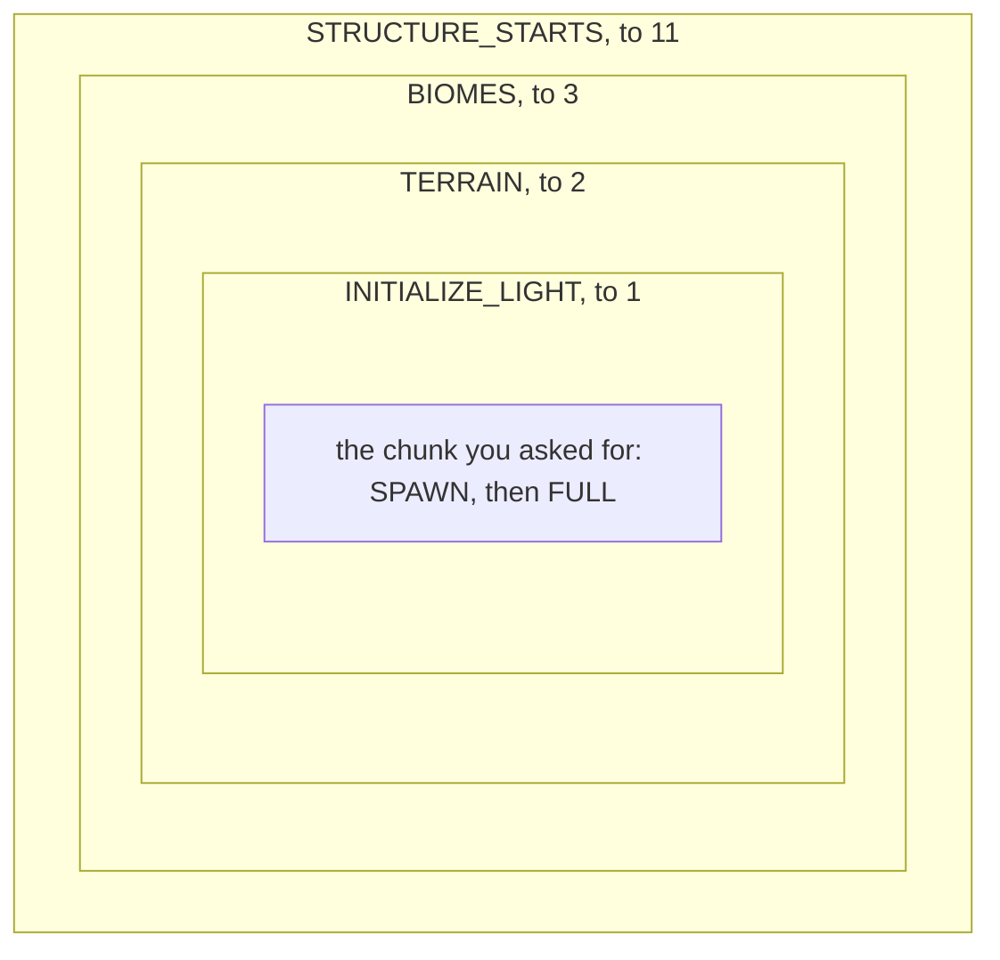
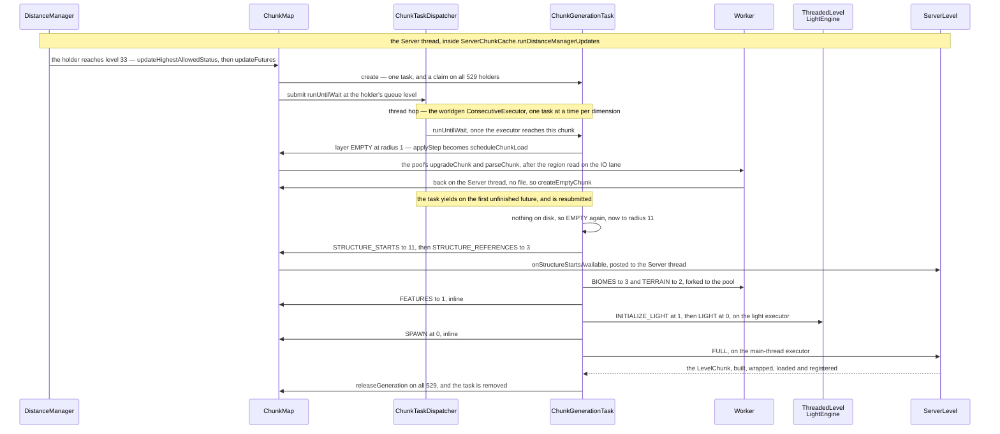

# The chunk generation pipeline

> Verified against **Minecraft 26.3** · Part IV · A ticket asks for one chunk at *FULL*, and the server claims five hundred and twenty-nine of them before it runs a single step.

A player walks east, a loading ticket lands on the chunk that just entered
view, and `ChunkHolder.updateFutures` asks that chunk for `ChunkStatus.FULL`.
The request names that chunk and the eight around it, and nothing further out.
But *FULL* is the last of ten
steps, and the steps below it read — and one of them writes — the chunks
around the one being built, so the first thing `ChunkGenerationTask.create`
does is walk out to Chebyshev distance 11 and take a claim on every holder in
that square: **asking for one chunk asks for 529 of them, and the eleven
rings it claims will never, on this task's account, become chunks you could
stand on.** Eleven is not a tuning constant. It is the index of the last entry of
`ChunkStep.accumulatedDependencies` for the FULL step — a twelve-entry list,
one per ring from the centre out: `ChunkLevel.RADIUS_AROUND_FULL_CHUNK` reads
that radius off the pyramid, and `ChunkLevel.MAX_LEVEL`, 44, is 33 plus it.
Change the pyramid and the world's loading radius changes with it.

## The cast

| class | what it decides | thread |
|---|---|---|
| `ChunkStatus` | the ten names and their order, each with the chunk type and the heightmaps it leaves — no task, no radius, no work | static, a `BuiltInRegistries.CHUNK_STATUS` entry |
| `ChunkPyramid` | the two step lists — one for generating, one for loading — that say what each status needs and what runs it | static |
| `ChunkStep` | one status's direct and accumulated dependencies, its block-state write radius, and its body | static |
| `ChunkGenerationTask` | one (chunk, target) walk: which layer is in flight, which pyramid it is using, and when to yield | the *worldgen* executor |
| `GenerationChunkHolder` | one chunk's ten futures, its ticket-derived ceiling, and the compare-and-set that runs each step exactly once | any — its mutable fields are atomic or volatile |
| `ChunkMap` | makes the tasks, owns both executors, and turns the *EMPTY* step into a disk read | Server, but `ChunkMap.applyStep` runs on whatever thread reached it |
| `ChunkTaskDispatcher` | which chunk's batch of work the executor gets next, and re-sorts the queue when tickets move | its own single-file queue on the worker pool |
| `WorldGenRegion` | what a running step may read and what it may write, checked per call | the thread running the step |

## The pyramid, drawn

The pipeline is ten steps in a fixed order, and three facts about each of
them — how wide it is swept, where it runs, and how far from its own chunk it
may write. Those are three columns, so they are a table:

| # | status | swept to | where it runs | may write |
|--:|---|--:|---|--:|
| 1 | `ChunkStatus.EMPTY` | 11 | the disk read — region file on the IO lane, upgrade and parse on the pool, chunk object on the Server thread | — |
| 2 | `ChunkStatus.STRUCTURE_STARTS` | 11 | inline, worldgen executor | — |
| 3 | `ChunkStatus.STRUCTURE_REFERENCES` | 3 | inline, worldgen executor | — |
| 4 | `ChunkStatus.BIOMES` | 3 | **forked** to the worker pool, as *createBiomes* | — |
| 5 | `ChunkStatus.TERRAIN` | 2 | **forked** to the worker pool, as *buildTerrain* | 0 |
| 6 | `ChunkStatus.FEATURES` | 1 | inline, worldgen executor | 1 |
| 7 | `ChunkStatus.INITIALIZE_LIGHT` | 1 | **the light executor** | — |
| 8 | `ChunkStatus.LIGHT` | 0 | **the light executor** | — |
| 9 | `ChunkStatus.SPAWN` | 0 | inline, worldgen executor | — |
| 10 | `ChunkStatus.FULL` | 0 | **the Server thread** | — |

Six of the ten leave the worldgen executor and one of them —
`ChunkStatus.EMPTY` — is not worldgen work at all. The *swept to* column is how
wide that layer is swept **when the target is FULL and the task has decided it
must generate**: `ChunkGenerationTask.getRadiusForLayer` asks the FULL step of
whichever pyramid is in play for `ChunkStep.getAccumulatedRadiusOf` that status.
A task aiming lower sweeps narrower rings, and a chunk that only ever reaches
*STRUCTURE_STARTS* is swept at radius 0 by its own task. `ChunkStatus.EMPTY` is
the row to read twice: the first sweep is the loading pyramid's radius 1, and
only a chunk that turns out to need generating is swept at 11, as the
load-or-generate section below explains.

Those radii nest, and nesting is what the word *pyramid* is doing. Read from
the middle outward:

```mermaid
flowchart TD
    subgraph OUT["STRUCTURE_STARTS, to 11"]
        subgraph R3["BIOMES, to 3"]
            subgraph R2["TERRAIN, to 2"]
                subgraph R1["INITIALIZE_LIGHT, to 1"]
                    C["the chunk you asked for: SPAWN, then FULL"]
                end
            end
        end
    end
```

*The pyramid seen from above: each box is a ring of neighbours, labelled with
how deep into the pipeline that ring must already be, four rings at one
instant rather than an order in time. The outer one is the number to take
away: radius 11 is 23 by 23, so one chunk reaching `ChunkStatus.FULL` has
claimed 529.*

That is `ChunkStep.accumulatedDependencies` drawn: a list indexed by distance,
holding the deepest status needed at that distance. For FULL it has twelve
entries — `ChunkStatus.SPAWN` at distance 0, `ChunkStatus.INITIALIZE_LIGHT` at
1, `ChunkStatus.TERRAIN` at 2, `ChunkStatus.BIOMES` at 3, and
`ChunkStatus.STRUCTURE_STARTS` for every distance from 4 out to 11 — so the
radius is 11 and the neighbourhood is 529.

A `ChunkStatus` carries no work. It is a registry entry with an index, a
parent, a `ChunkType` (`ChunkType.PROTOCHUNK` for the first nine,
`ChunkType.LEVELCHUNK` for `ChunkStatus.FULL`) and the heightmaps that become
valid after it, `ChunkStatus.heightmapsAfter`. Everything else — the
dependencies, the write radius, the body — lives in the `ChunkStep` that
`ChunkPyramid` holds for that status. Each step is built from its
predecessor, so every step silently requires its own parent status at
distance 0 before it declares anything; `ChunkStep.Builder.addRequirement`
then widens the array outward, taking the later of the two statuses at every
distance already covered.

The generation pyramid's declared requirements, with the parent requirement
resolved in (*INITIALIZE_LIGHT* and *FULL*, like *STRUCTURE_STARTS*, declare
nothing beyond their parent):

| step | needs | may write |
|---|---|---|
| *STRUCTURE_STARTS* | *EMPTY* at 0 | — |
| *STRUCTURE_REFERENCES* | *STRUCTURE_STARTS* from 0 out to 8 | — |
| *BIOMES* | *STRUCTURE_REFERENCES* at 0, *STRUCTURE_STARTS* out to 8 | — |
| *TERRAIN* | *BIOMES* within 1, *STRUCTURE_STARTS* out to 8 | radius 0 |
| *FEATURES* | *TERRAIN* within 1, *STRUCTURE_STARTS* out to 8 | radius 1 |
| *LIGHT* | *INITIALIZE_LIGHT* within 1 | — |
| *SPAWN* | *LIGHT* at 0, *BIOMES* at 1 | — |

The rows that do the work are the radius-1 ones: they force a neighbour to
run one step ahead of the chunk being built. Four requirements in the pyramid
have radius 1, and only three of them widen the accumulated list — which is
the arithmetic the page's headline number rests on, so it is worth stating as
a rule.

`ChunkStep.Builder.getRadiusOfParent` asks a narrower question than *does this
step want anything a ring out*. It asks **how far out this step still demands
its own immediate predecessor**, and it charges that many rings to everything
the predecessor already needed. *TERRAIN*'s predecessor is *BIOMES* and *TERRAIN*
asks for *BIOMES* at radius 1, so its whole inherited list slides out by one.
*SPAWN*'s predecessor is *LIGHT*, and although *SPAWN* also asks for
*BIOMES* within 1, *BIOMES* is behind *LIGHT*: at ring 1 *SPAWN* is
demanding something its predecessor has already passed, which costs nothing.
The three that pay are *TERRAIN* wanting *BIOMES*, *FEATURES* wanting *TERRAIN*
and *LIGHT* wanting *INITIALIZE_LIGHT*, each one ring. Three ones on top of
*STRUCTURE_STARTS* out to 8 is where the 11 comes from — a radius of 11 is a
list of twelve, and the walk that claims it is 23 chunks on a side, or 529.
The 8 is the distance `ChunkStatus.MAX_STRUCTURE_DISTANCE` names.

The same arithmetic sets the edge of the world. `ChunkPyramid.SAFETY_MARGIN_CHUNKS`
is 32 plus the twelve accumulated entries plus one, doubled — 90 chunks —
subtracted from the coordinate maximum to give
`ChunkPyramid.MAX_CHUNK_COORDINATE_VALUE`, which `ChunkPos.isValid` enforces
and the `GenerationChunkHolder` constructor throws on. It is a guard against
arithmetic, not against players: at about 33.5 million blocks it sits three
and a half million blocks *outside* `Level.MAX_LEVEL_SIZE`, the ±30 000 000
nobody can build past anyway.

## A ticket sets a ceiling, and a separate call names the target

Two different numbers reach a holder from the ticket system.
`DistanceManager.runAllUpdates` first gives every touched holder
`GenerationChunkHolder.updateHighestAllowedStatus`, which is
`ChunkLevel.generationStatus` of the new ticket level — the number line that
maps 34 through 44 onto ever-earlier statuses belongs to [the number
line](tickets-and-loading.md#the-number-line). That is a ceiling, not a
goal: `GenerationChunkHolder.isStatusDisallowed` gates every request against
it and hands back `GenerationChunkHolder.UNLOADED_CHUNK_FUTURE` for anything
above. Then `ChunkHolder.updateFutures` crosses `FullChunkStatus.FULL`,
calls `ChunkMap.prepareAccessibleChunk`, and *that* names the target:
`ChunkMap.getChunkRangeFuture` over the 3×3, `ChunkStatus.FULL` on the
centre and `ChunkLevel.getStatusAroundFullChunk` — *INITIALIZE_LIGHT* — on
the eight around it, each through `GenerationChunkHolder.scheduleChunkGenerationTask`.

If the ceiling later drops, `GenerationChunkHolder.updateHighestAllowedStatus`
fails every pending future between the new ceiling and the old with
`GenerationChunkHolder.UNLOADED_CHUNK` and reschedules the task at the
highest status anyone is still waiting for. Nothing is interrupted; a worker
mid-step finishes it and finds nobody listening.

The other way in is synchronous: `ServerChunkCache.getChunk` from the server
thread manufactures its own ticket and then blocks on the future it arms
([when the graphs run](tickets-and-loading.md#when-the-graphs-run)). What
matters to this page is the consequence — the thread that is blocked on
generation is also the thread finishing it, because the executor it blocks on
drains chunk work while it waits.

## The task claims its 529 before it runs anything

`GenerationChunkHolder.scheduleChunkGenerationTask` finds no task in flight,
so `GenerationChunkHolder.rescheduleChunkTask` calls
`ChunkMap.scheduleGenerationTask` and `ChunkGenerationTask.create` builds the
holder set: a `StaticCache2D` whose radius is the *generation* pyramid's
accumulated radius of `ChunkStatus.EMPTY` for the target — 11 for *FULL* —
filled by `GeneratingChunkMap.acquireGeneration`, the five-method interface
`ChunkMap` implements and the pipeline holds. That radius is taken
from the generation pyramid unconditionally, before anything has looked at
the disk, so even a chunk that turns out to be sitting complete in a region
file claims all 529 holders first.

The claim is a reference count. `GenerationChunkHolder.increaseGenerationRefCount`
on the first claim arms `GenerationChunkHolder.generationSaveSyncFuture` and
hangs it off the holder's save dependency, so nothing in the square can be
saved or unloaded while the task lives ([a chunk nobody needs any
more](chunk-storage.md#a-chunk-nobody-needs-any-more)).
The task itself waits in `ChunkMap.pendingGenerationTasks` until
`ChunkMap.runGenerationTasks`, at the end of the same
`ServerChunkCache.runDistanceManagerUpdates` that created it.

## Dispatch, and why the parallelism is smaller than the thread names

`ChunkMap` builds two `ConsecutiveExecutor`s over the shared worker pool,
named *worldgen* and *light*, each wrapped in a `ChunkTaskDispatcher`. A
`ConsecutiveExecutor` runs **one task at a time**: `AbstractConsecutiveExecutor.run`
pops a single item, runs it under the executor's name, and re-registers
itself on the pool. The dispatcher in front of it is a
`ChunkTaskPriorityQueue` of `ChunkTaskPriorityQueue.PRIORITY_LEVEL_COUNT`
buckets — 46, `ChunkLevel.MAX_LEVEL` plus two — keyed by the holder's queue
level, and `ChunkTaskDispatcher.scheduleForExecution` hands over one chunk's
runnables at a time, polling again only when they have all returned. So the
steps a dimension runs inline run single file, however many `Worker-Main-n`
threads the shared pool has ([four threads worth
memorising](../anatomy/anatomy.md#four-threads-worth-memorising) sizes it, and
serialising onto a pool is what a `ConsecutiveExecutor` is for); what runs in
parallel is what a step hands off: the disk read's upgrade and parse and the
biome and terrain forks on the pool, many chunks' at once, the light work on
its own executor, and *FULL* on the Server thread. **There is no generation
thread setting**: the only
knob is the pool's, and widening it widens those forks and everything else that
shares the pool.

**One worldgen runnable** executes at a time per dimension
(`ChunkMap.worldgenTaskDispatcher`, over a single `ConsecutiveExecutor`).

Overlap comes from yielding.
`ChunkGenerationTask.runUntilWait` returns the moment a layer holds a future
that is not yet done; `ChunkMap.runGenerationTask` chains a resubmit onto
that future and the executor moves to another chunk's task at once. No worldgen thread
ever blocks waiting for a neighbour, and a task parked on a biome fork costs
nothing.

Priority is live, not fixed at submission. `ChunkHolder.updateFutures` ends
by telling both dispatchers through `ChunkTaskDispatcher.onLevelChange`, and
`ChunkTaskPriorityQueue.resortChunkTasks` moves work already queued into its
new bucket — at a higher priority inside the dispatcher's own four-slot queue
than new submissions get, so "closer to a player runs first" stays true while
the player is moving. `ThrottlingChunkTaskDispatcher` is a subclass of the
same thing but is *not* worldgen: it caps how many player-view chunks the
ticket tracker may have in flight, on the Server thread.

## The EMPTY step asks the only question that changes the walk

`ChunkGenerationTask.scheduleNextLayer` always begins with `ChunkStatus.EMPTY`
at the *loading* pyramid's radius, which for a *FULL* target is 1.
`ChunkMap.applyStep` special-cases that status: instead of a step body it
runs `ChunkMap.scheduleChunkLoad` — the region read, `ChunkMap.upgradeChunkTag`
on the pool under *upgradeChunk*, `SerializableChunkData.parse` on the pool
under *parseChunk*, the POI file prefetched alongside through
`SectionStorage.prefetch`, then `SerializableChunkData.read` **on the server
thread**. What comes out is a `ProtoChunk` at whatever status the file
recorded, an `ImposterProtoChunk` wrapping a real `LevelChunk` if the file
was already at *FULL*, or `ChunkMap.createEmptyChunk` when there was no file.
The futures are not done, so the task yields and is re-entered when they land
([chunk storage](chunk-storage.md#the-way-back-in)).

### A file that will not parse is regenerated, not skipped

There is a fourth outcome, and it rejoins the third.
`SerializableChunkData.parse` returning null logs *missing level
data* and empties the optional, so the step falls through to
`ChunkMap.createEmptyChunk` exactly as though the file had never existed; and
anything thrown along the way reaches `ChunkMap.handleChunkLoadFailure` on the
Server thread, which re-throws a JVM *Error* as a crash report and otherwise
reports the failure through `MinecraftServer.reportChunkLoadFailure` and hands
back an empty chunk. Either way the empty proto chunk fails the load test
below, so the walk generates, and the position is marked replaceable in
`ChunkMap.chunkTypeCache`, which lets the saver write a half-made chunk over
it — **an unreadable chunk is regenerated, not skipped, and the old bytes stay
on disk until something writes over them**.

### Load or generate, decided per chunk and per layer

Now `ChunkGenerationTask.canLoadWithoutGeneration` decides, and it asks two
things. First, is the centre persisted at or past the target — for a *FULL*
target, *FULL*. Then, separately, is every chunk in the loading pyramid's
accumulated square at or past what its distance demands: for *FULL* that
square is the 3×3, wanting *SPAWN* at the centre and *INITIALIZE_LIGHT* on the
ring, so the centre is checked twice and the second check is the weaker one.

If both hold, the walk stays narrow. Ten steps still run, but
`ChunkPyramid.LOADING_PYRAMID` gives five of them no body at all —
*STRUCTURE_REFERENCES*, *BIOMES*, *TERRAIN*, *FEATURES* and *SPAWN* pass
straight through. Of the five that remain, *EMPTY* is the
disk read `ChunkMap.applyStep` special-cases, and four carry a task:
`ChunkStatusTasks.loadStructureStarts`, which only posts the saved starts to
`StructureCheck`, the two light steps, and `ChunkStatusTasks.full`. **A
loaded chunk still walks all ten steps**, and it still needs its 3×3
neighbours at *INITIALIZE_LIGHT* before its own *LIGHT* step will run.

If it does not hold, `ChunkGenerationTask.needsGeneration` goes true and
*EMPTY* is scheduled a second time, now at radius 11 — reading only the
chunks the first sweep did not touch.
`GenerationChunkHolder.applyStep` runs `GenerationChunkHolder.acquireStatusBump`,
a compare-and-set on `GenerationChunkHolder.startedWork` from a status's
parent to the status itself, so exactly one caller ever runs a step for a
holder and every other caller is handed the existing future.

And the choice of pyramid is made again for **every chunk in every layer**,
not once for the task. `ChunkGenerationTask.scheduleChunkInLayer` compares
that chunk's persisted status with the layer being applied and takes the
generation pyramid only if the chunk is genuinely behind, so a generating
task's 23×23 square routinely mixes both — which is exactly what stops
already-finished neighbours being generated a second time.

## Two steps may write, and only two

`ChunkStep`'s default block-state write radius is **−1**, not 0 — so for
eight of the ten steps `WorldGenRegion.ensureCanWrite` fails even for the
chunk's own column, and `WorldGenRegion.setBlock` logs and returns false
rather than doing anything. Only *TERRAIN* (radius 0) and *FEATURES*
(radius 1) can change a block at all. What rides on those
steps — the density functions, the material rules, the carvers, the features
and the structures they place — is Part XII's subject
([terrain](../worldgen/terrain.md),
[density functions](../worldgen/density-functions.md),
[structure placement](../worldgen/structure-placement.md)). This page is the conveyor.

*STRUCTURE_STARTS* runs `ChunkGenerator.createStructures` for every chunk in
the radius-11 square that is not already past it — seed and placement state
only, no terrain — and is skipped entirely when `WorldOptions.generateStructures`
is off. Either way `ServerLevel.onStructureStartsAvailable` posts the chunk's
starts to the Server thread. *STRUCTURE_REFERENCES* then records, per chunk,
which starts within eight chunks reach into it: the reason starts needed a
radius of 8 around *it*. *BIOMES* forks — `ChunkGenerator.createBiomes`,
which no generator overrides, puts the work on the pool under
*createBiomes* — so biomes always leave the worldgen executor. *TERRAIN* forks
only for `NoiseBasedChunkGenerator`, under *buildTerrain* — the noise fill, the
surface and the carvers in one job — and then applies the `BelowZeroRetrogen`
bedrock fix-ups if the chunk is being deepened and primes the four final
heightmaps with `Heightmap.primeHeightmaps`; `FlatLevelSource` and
`DebugLevelSource` return a completed future and stay inline. *FEATURES*
decorates and calls `Blender.generateBorderTicks`
([blending](../worldgen/blending.md)).

*FEATURES* is the interesting one, because a tree at a chunk edge writes into
a neighbour and nothing about that neighbour's status says it is safe. What
makes it safe is the executor: the layer steps its chunks one at a time, and
every worldgen task in the dimension is serialised behind the one
`ConsecutiveExecutor`, so no two feature steps in a dimension are ever
running at once. The ordinary cross-chunk write is the plain
`ChunkAccess.setBlockState`, which takes and releases the section per write;
only `OreFeature` holds a section open across many writes, through
`BulkSectionAccess` ([sections and their four
counters](chunk-anatomy.md#sections-and-their-four-counters)).

### A read too far crashes, a read too wide only warns

Both bad accesses are caught, and they are caught differently. A read outside
the step's `ChunkStep.directDependencies` — too far away, or at a status that
distance does not guarantee — throws out of `WorldGenRegion.getChunk` as a
crash report naming the step, the requested and actual statuses, the distance
and the whole dependency list. A read that is merely outside the *write* zone
is one line in the log, at error level, from `WorldGenRegion.warnIfReadOutsideWriteZone`, naming the
feature through `WorldGenRegion.currentlyGenerating`. The first is a bug in
the pyramid; the second is a bug in a feature, and the game keeps going.

## Light runs on a second executor, and the task waits for it

`ChunkStatusTasks.initializeLight` calls `ChunkAccess.initializeLightSources`
and `ProtoChunk.setLightEngine` — from that moment the proto chunk forwards
block changes to the engine — and then hands the chunk to
`ThreadedLevelLightEngine.initializeLight`. `ChunkStatusTasks.light` follows
with `ThreadedLevelLightEngine.lightChunk`. Both queue through the *light*
`ChunkTaskDispatcher` onto the *light* `ConsecutiveExecutor`, and the future
each returns is completed by a later task on that same executor, so the
generation task genuinely parks here ([what actually kicks
it](lighting.md#what-actually-kicks-it)).

Both are passed a *lighted* flag from `ChunkStatusTasks.isLighted`, and what
it decides — that light saved on disk is re-enabled rather than recomputed —
is told in [lit before you ever see
it](lighting.md#lit-before-you-ever-see-it).

## FULL is assembled on the server thread

`ChunkStatusTasks.full` is scheduled exactly like the other nine steps, but
its body is a *supplyAsync* on `WorldGenContext.mainThreadExecutor` — the
`ServerChunkCache.MainThreadExecutor`, a `BlockableEventLoop` pinned to the
Server thread. There are two shapes it can take. If the chunk is already an
`ImposterProtoChunk`, because the file held a finished chunk, it unwraps the
`LevelChunk` inside and replaces nothing. Otherwise a `LevelChunk` is built
from the `ProtoChunk`, sharing its sections, and
`GenerationChunkHolder.replaceProtoChunk` rewrites slots 0 through 8 of the
holder's future array to an `ImposterProtoChunk` over it with writes
disallowed — every slot checked, and an exception thrown if any of them is not
a `ProtoChunk` or was changed by another thread in the meantime, which
`GenerationChunkHolder.applyStep` relays as a crash.

Then the chunk becomes part of the world, in order: `LevelChunk.setFullStatus`
wired to the holder, `LevelChunk.runPostLoad` turning `ProtoChunk.getEntities`
into real entities through `ServerLevel.addWorldGenChunkEntities`,
`LevelChunk.setLoaded`, `LevelChunk.registerAllBlockEntitiesAfterLevelLoad`,
`LevelChunk.registerTickContainerInLevel` and `LevelChunk.setUnsavedListener`.
`GenerationChunkHolder.completeFuture` publishes it at *FULL*.

Nothing here crosses the network. A chunk reaches a client only after the
separate promotion to `FullChunkStatus.BLOCK_TICKING` ([which chunks a player
is owed](tickets-and-loading.md#which-chunks-a-player-is-owed-and-what-makes-one-eligible)).

## Release, and what the ring is left as

`ChunkGenerationTask.runUntilWait` comes round, finds the scheduled status
equal to the target, and calls `ChunkGenerationTask.releaseClaim`:
`GenerationChunkHolder.removeTask` on the centre, then
`ChunkMap.releaseGeneration` on all 529. Every holder whose count reaches zero
completes its save-sync future, and the square is free to be saved or dropped
as its own tickets dictate — which the outer rings, only ever raised to the
status their distance demanded, mostly are.
`ChunkHolder.scheduleFullChunkPromotion` was called back in
`ChunkHolder.updateFutures`, long before any of this; what happens now is its
confirmation landing on the Server thread and `ChunkMap.onFullChunkStatusChange` tells
the entity manager. `ChunkLoadCounter` watches this from outside — at start-up
it holds the holders the restored saved tickets raise to *FULL*, and for a
joining player those its spawn ticket raises, drops each as it arrives and
feeds the load progress, and `MinecraftServer.prepareLevels` loops until none
is left.

## The whole walk, once

Everything above, spent once on one chunk that was not on disk. The lanes are
the seven objects that hand it along, and the interesting thing about them is
which thread each is standing on.

```mermaid
sequenceDiagram
    participant DM as DistanceManager
    participant CM as ChunkMap
    participant CTD as ChunkTaskDispatcher
    participant CGT as ChunkGenerationTask
    participant Worker as Worker
    participant TLE as ThreadedLevel<br/>LightEngine
    participant SL as ServerLevel

    Note over DM,SL: the Server thread, inside ServerChunkCache.runDistanceManagerUpdates
    DM->>CM: the holder reaches level 33 — updateHighestAllowedStatus, then updateFutures
    CM->>CGT: create — one task, and a claim on all 529 holders
    CM->>CTD: submit runUntilWait at the holder's queue level
    Note over CTD,CGT: thread hop — the worldgen ConsecutiveExecutor, one task at a time per dimension
    CTD->>CGT: runUntilWait, once the executor reaches this chunk
    CGT->>CM: layer EMPTY at radius 1 — applyStep becomes scheduleChunkLoad
    CM->>Worker: the pool's upgradeChunk and parseChunk, after the region read on the IO lane
    Worker->>CM: back on the Server thread, no file, so createEmptyChunk
    Note over CTD,CGT: the task yields on the first unfinished future, and is resubmitted
    CGT->>CGT: nothing on disk, so EMPTY again, now to radius 11
    CGT->>CM: STRUCTURE_STARTS to 11, then STRUCTURE_REFERENCES to 3
    CM->>SL: onStructureStartsAvailable, posted to the Server thread
    CGT->>Worker: BIOMES to 3 and TERRAIN to 2, forked to the pool
    CGT->>CM: FEATURES to 1, inline
    CGT->>TLE: INITIALIZE_LIGHT at 1, then LIGHT at 0, on the light executor
    CGT->>CM: SPAWN at 0, inline
    CGT->>SL: FULL, on the main-thread executor
    SL-->>CGT: the LevelChunk, built, wrapped, loaded and registered
    CGT->>CM: releaseGeneration on all 529, and the task is removed
```

*One chunk from a level change to a live `LevelChunk`, handed between the
worldgen executor the task runs on, the IO lane for the region read, the
worker pool for its upgrade and parse stages and the two forks, the light
executor, and the Server thread for the read's result, the posted structure
starts and `ChunkStatus.FULL`. The self-message in the middle is the
load-or-generate decision: below it, the sweep to radius 11 and the structure,
biome, terrain, feature and spawn generation are what a chunk already on disk
would skip, and the structure-start replay, the light steps and FULL are what
it would still run.*

## Questions players ask

**Why does adding cores not speed up world generation?** It speeds up only
the part that forks. A dimension's inline steps run on one `ConsecutiveExecutor`,
one task at a time, and the dispatcher in front of it releases one chunk's work
at a time; what it forks onto the worker pool — the biome fill and the terrain
job, the noise, the surface and the carvers — runs many chunks at once, and a
wider pool runs more of it. The structure starts, the features and
the spawns stay single file, and there is no thread-count setting for generation.

**Why does a chunk I have visited before still take work to load?** It walks
all ten steps. Five of them pass through and cost nothing, but the disk
read, the structure-start replay, both light steps and the *FULL* assembly are
real work, and its *LIGHT* step needs the 3×3 neighbours read first.

**Why does a chunk sometimes hang on the edge of the view forever?** Its
ticket level puts the ceiling below *FULL*.
`GenerationChunkHolder.isStatusDisallowed` refuses anything higher, so the
chunk sits at whatever its level allows — *STRUCTURE_STARTS* at the outer
edge, *INITIALIZE_LIGHT* just outside the ring that reaches *FULL* — correct
and unfinished, for as long as the level says so.

> **For a 1.21-era reader.** The *noise*, *surface* and *carvers* statuses are
> gone: *terrain* does their work, as one step. The pool jobs *init_biomes* and
> *wgen_fill_noise* are now *createBiomes* and *buildTerrain*.

## Where to look

The two lists that decide everything: `ChunkPyramid.GENERATION_PYRAMID` ·
`ChunkPyramid.LOADING_PYRAMID` · `ChunkStep.getAccumulatedRadiusOf`. Then one
task's life, in order: `ChunkGenerationTask.create` ·
`ChunkGenerationTask.runUntilWait` ·
`ChunkGenerationTask.canLoadWithoutGeneration` ·
`ChunkGenerationTask.scheduleChunkInLayer`. Where a step runs:
`ChunkMap.applyStep` · `GenerationChunkHolder.acquireStatusBump` ·
`ChunkStatusTasks.full`. And what polices a running step:
`WorldGenRegion.getChunk` · `WorldGenRegion.ensureCanWrite`.

---

*Rules: names, never code · how the system works, not how the code reads ·
newest version only · every backticked name passes `tools/verify_names.py`.*
