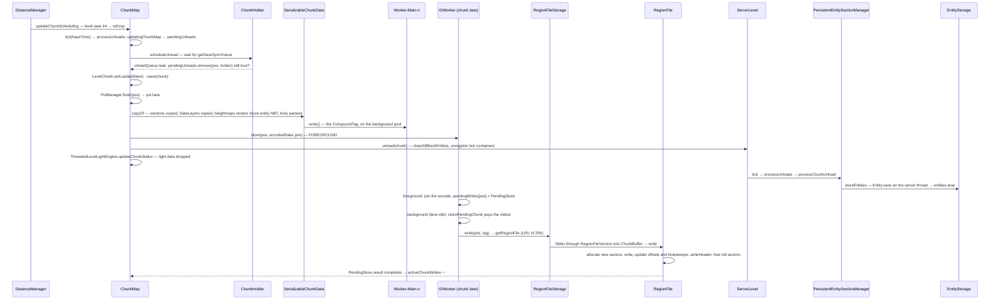

# Chunk storage

> Verified against **Minecraft 26.2** · Part IV · A chunk nobody needs any more is unloaded and written: the snapshot on the server thread, the encode on the worker pool, the write-behind lane on the IO pool, and the sectors in the region file.

## Responsibility

Three folders per dimension hold everything a chunk is: *region/* for
blocks, light, heightmaps, ticks and block entities; *entities/* for the
entities; *poi/* for points of interest. Each is a set of 32×32-chunk
region files behind one single-lane asynchronous writer. This page follows
a chunk out of memory and onto disk, and shows which thread does which
part — the point of the design is that the server thread only ever pays for
a copy.

The one sentence a player recognises: *the .mca files in your save, and
why the game says "All chunks are saved" a beat after you hit Save.*

## The data it owns

- **The folders.** `LevelStorageSource.LevelStorageAccess.getDimensionPath`
  → `DimensionType.getStorageFolder`: every dimension, the overworld
  included, lives at *dimensions/\<namespace\>/\<path\>/* under the world
  folder, with *region/*, *entities/*, *poi/* and *data/* inside. *DIM-1*
  and *DIM1* are gone (a file-fix migrates them — out of scope).
- **`RegionFile`** — one *r.X.Z.mca*. `RegionFile.SECTOR_BYTES` is 4096;
  `RegionFile.header` is two sectors, a 1024-entry offset table
  (`RegionFile.offsets`, sector ≪ 8 | sector count) and a 1024-entry
  timestamp table (`RegionFile.timestamps`, wall-clock seconds from
  `RegionFile.getTimestamp`). Each chunk starts with
  `RegionFile.CHUNK_HEADER_SIZE` (5) bytes — a length and a compression id.
  `RegionFile.usedSectors` is a `RegionBitmap` (`RegionBitmap.allocate` is
  first-fit); a chunk needing `RegionFile.EXTERNAL_CHUNK_THRESHOLD` (256)
  sectors or more goes to a sidecar `RegionFile.EXTERNAL_FILE_EXTENSION`
  (*.mcc*) and the in-file stub carries `RegionFile.EXTERNAL_STREAM_FLAG`
  — the count field is eight bits, so it *cannot* fit. `RegionFile.file` is
  opened with DSYNC when *sync* is set.
- **`RegionFileVersion`** — the id byte: `RegionFileVersion.VERSION_GZIP`
  (1, read-only), `RegionFileVersion.VERSION_DEFLATE` (2, the
  `RegionFileVersion.DEFAULT`), `RegionFileVersion.VERSION_NONE` (3),
  `RegionFileVersion.VERSION_LZ4` (4), and `RegionFileVersion.VERSION_CUSTOM`
  (127, recognised only to be rejected). `RegionFileVersion.selected` is
  set once by `RegionFileVersion.configure` from
  `DedicatedServerProperties.regionFileComression` (Mojang's spelling;
  *region-file-compression*, default *deflate*). Reads honour whatever
  byte each chunk carries.
- **`RegionFileStorage`** — the open-file cache for one folder:
  `RegionFileStorage.regionCache`, an LRU of `RegionFileStorage.MAX_CACHE_SIZE`
  (256) `RegionFile`s, keyed by region position; `RegionFileStorage.read`
  and `RegionFileStorage.write` are `NbtIo` over the chunk streams, and a
  null write is `RegionFile.clear`.
- **`IOWorker`** — the single lane. `IOWorker.consecutiveExecutor` is a
  `PriorityConsecutiveExecutor` with three lanes (`IOWorker.Priority.FOREGROUND`,
  `IOWorker.Priority.BACKGROUND`, `IOWorker.Priority.SHUTDOWN`) that borrows
  threads from `Util.ioPool` — a cached, unbounded pool named *IO-Worker-n*.
  It is not a thread; it is a promise that one task runs at a time.
  `IOWorker.pendingWrites` is the write-behind buffer (chunk →
  `IOWorker.PendingStore`, whose data a later store overwrites in place).
  `IOWorker.store` and `IOWorker.loadAsync` are foreground tasks;
  `IOWorker.storePendingChunk` is the background task that actually writes
  the oldest pending entry, and it only runs when no foreground task is
  queued. `IOWorker.loadAsync` returns a *copy* of a pending tag before it
  looks at disk — read-your-writes by lane order, not by locks.
  `IOWorker.STORE_EMPTY` deletes a chunk. `IOWorker.scanChunk` is the
  streaming `ChunkScanAccess` that `StructureCheck` uses to peek at unloaded
  chunks.
- **`SimpleRegionStorage`** — three fields: an `IOWorker`, a `DataFixer`
  and a fix type (`SimpleRegionStorage.upgradeChunkTag`; migration is out of
  scope). The `RegionStorageInfo` — level id, dimension and a type string,
  *chunk* / *entities* / *poi* — belongs to the `IOWorker`'s
  `RegionFileStorage`, and names the store in error reports through
  `ChunkIOErrorReporter` (`MinecraftServer.reportChunkLoadFailure`,
  `MinecraftServer.reportChunkSaveFailure`). **`ChunkMap` extends
  `SimpleRegionStorage`**: the chunk map *is* the *region/* store. There is
  no *ChunkStorage* class — but note that `EntityStorage` and
  `SectionStorage` do **not** extend it; each *holds* one.
- **`SerializableChunkData`** — the chunk file as a record:
  `SerializableChunkData.sectionData` (one `SerializableChunkData.SectionData`
  per light section **that has something in it** — a chunk section, or a
  non-empty block or sky `DataLayer`; light sections with none of the three
  are omitted from the record and from the file), `SerializableChunkData.heightmaps`,
  `SerializableChunkData.packedTicks`, `SerializableChunkData.blockEntities`,
  `SerializableChunkData.structureData`, `SerializableChunkData.inhabitedTime`,
  `SerializableChunkData.chunkStatus`, `SerializableChunkData.lightCorrect`,
  `SerializableChunkData.upgradeData`, `SerializableChunkData.blendingData`,
  `SerializableChunkData.belowZeroRetrogen`, and — for proto chunks only —
  `SerializableChunkData.entities` and `SerializableChunkData.carvingMask`.
  A `LevelChunk`'s entities are **not** in *region/*; the *entities* list a
  full chunk might still carry from an old save is handed to
  `ServerLevel.addLegacyChunkEntities`.
- **`EntityStorage`** — the *entities/* store (`DataFixTypes.ENTITY_CHUNK`):
  a per-chunk file of *Position* and *Entities*; `EntityStorage.emptyChunks`
  remembers chunks it has already cleared, so the *first* time a chunk goes
  empty it costs one write (the region entry is zeroed and any sidecar
  deleted) and every later save of it costs nothing;
  `EntityStorage.entityDeserializerQueue` is a `ConsecutiveExecutor` over
  the **server** main-thread executor — NBT is read on the IO lane, but
  entities are built on the server thread.
- **`SectionStorage`** — the base of `PoiManager`: `SectionStorage.storage`
  keyed by section, `SectionStorage.dirtyChunks`, `SectionStorage.pendingLoads`;
  `SectionStorage.writeChunk` packs sections through the codec
  (`PoiSection.Packed`) on the server thread — the packed record is
  immutable, so no copy step; `SectionStorage.PackedChunk` is the load
  shape. `PoiManager.checkConsistencyWithBlocks` validates stored POIs
  against the block section on every chunk read.
- **The dirty set.** `LevelChunk.markUnsaved` fires `LevelChunk.UnsavedListener`
  once on the false→true edge; `ChunkMap.setChunkUnsaved` (installed as
  `WorldGenContext.unsavedListener`) adds the chunk to
  `ChunkMap.chunksToEagerlySave`. `ChunkMap.nextChunkSaveTime` is the
  per-chunk cooldown and `ChunkMap.activeChunkWrites` the in-flight count.
- **Save sync.** `ChunkHolder.saveSync` is a future chained through
  `ChunkHolder.addSaveDependency` by every promotion future and by
  `GenerationChunkHolder.generationSaveSyncFuture`; `ChunkHolder.isReadyForSaving`
  is "nothing in flight". A chunk mid-generation or mid-promotion cannot be
  saved or unloaded.

## When it runs

- **Unload**: `ServerChunkCache.tick` → `ChunkMap.tick` with the level's
  time supplier: `PoiManager.tick` writes dirty POI chunks while there is
  time — **unconditionally** — and then `ChunkMap.processUnloads` (below),
  which alone is skipped when `ServerLevel.noSave`. A no-save world still
  writes POI data and never drains its unload queue. Entities unload in the same level tick,
  later, from `PersistentEntitySectionManager.tick`.
- **Eager saves**: the tail of `ChunkMap.processUnloads` is
  `ChunkMap.saveChunksEagerly`: up to `ChunkMap.CHUNK_SAVED_EAGERLY_PER_TICK`
  (20) dirty chunks per tick, only while `ChunkMap.activeChunkWrites` is
  under `ChunkMap.MAX_ACTIVE_CHUNK_WRITES` (128) and there is time, each no
  sooner than `ChunkMap.EAGER_CHUNK_SAVE_COOLDOWN_IN_MILLIS` (10 s) after
  its last save (`ChunkMap.saveChunkIfNeeded`). A busy chunk is written
  roughly every ten seconds without anyone asking.
- **Autosave**: `MinecraftServer.autoSave` → `MinecraftServer.saveEverything`
  → `MinecraftServer.saveAllChunks` → `ServerLevel.save` →
  `ServerChunkCache.save` (no flush) → `ChunkMap.saveAllChunks` visits every
  visible holder through `ChunkMap.saveChunkIfNeeded` with the cooldown
  cleared, and `PersistentEntitySectionManager.autoSave`. The first
  interval is `MinecraftServer.AUTOSAVE_INTERVAL` (6000 ticks); after that
  `MinecraftServer.computeNextAutosaveInterval` is 300 s × the tick rate,
  floored at `MinecraftServer.MIMINUM_AUTOSAVE_TICKS` (100, Mojang's
  spelling) — autosave is five minutes of wall clock, whatever `/tick rate`
  says.
- **Full save** (`/save-all flush`, `/stop`): `ChunkMap.saveAllChunks` with
  flush loops until no holder saves, blocking on each
  `ChunkHolder.isReadyForSaving` through the main-thread executor, then
  `SectionStorage.flushAll`, `ChunkMap.processUnloads` with an always-true
  supplier, and `IOWorker.synchronize` with flush — the only time the server
  thread waits for the disk. `PersistentEntitySectionManager.saveAll` and
  `EntityStorage.flush` do the same for entities.

Threads, in one line: the **Server thread** decides and copies;
**Worker-Main-n** encodes NBT; an **IO-Worker-n** compresses and writes.

## The trace: a chunk is unloaded and written

1. **Marked for drop.** A ticket change raises the chunk's loading level
   past `ChunkLevel.MAX_LEVEL`; `ChunkMap.updateChunkScheduling` puts the
   key in `ChunkMap.toDrop`. The same level change reaches
   `PersistentEntitySectionManager.updateChunkStatus`, whose `Visibility`
   drops to hidden and queues the chunk in
   `PersistentEntitySectionManager.chunksToUnload`.
2. **Scheduled.** `ChunkMap.processUnloads` moves the holder from
   `ChunkMap.updatingChunkMap` to `ChunkMap.pendingUnloads` and calls
   `ChunkMap.scheduleUnload`, which waits on `ChunkHolder.getSaveSyncFuture`
   and then appends the unload task to `ChunkMap.unloadQueue`. Tasks drain
   while the level's time supplier says yes — or regardless, once the queue
   is more than 2000 deep.
3. **The guard.** The task first re-checks the sync future is still the
   one it waited on, then `ChunkMap.pendingUnloads` remove-if-same. If a
   ticket re-adopted the holder meanwhile ([tickets](tickets-and-loading.md)),
   the remove fails and nothing happens — no data is lost and nothing is
   written twice. Otherwise `LevelChunk.setLoaded` false.
4. **The snapshot.** `ChunkMap.save`: `SectionStorage.flush` for the
   chunk's POIs; `ChunkAccess.tryMarkSaved` (a clean chunk stops here);
   guards so a `ProtoChunk` does not overwrite a full chunk on disk
   (`ChunkMap.isExistingChunkFull`, backed by `ChunkMap.chunkTypeCache` —
   and on a cold cache this **joins the read future on the server thread**,
   the one unplanned disk wait in the save path) and
   an `ChunkStatus.EMPTY` proto chunk with no valid structure start is never
   written at all; `ChunkMap.activeChunkWrites` up; then
   **`SerializableChunkData.copyOf`** on the server thread — every
   `LevelChunkSection.copy`, every `DataLayer.copy` from
   `LevelLightEngine.getLayerListener`, heightmaps cloned, block
   entities through `ChunkAccess.getBlockEntityNbtForSaving`, ticks through
   `ChunkAccess.getTicksForSerialization`, structures packed.
5. **The encode.** `SerializableChunkData.write` runs on
   `Util.backgroundExecutor` and builds the `CompoundTag`: *DataVersion*,
   *Status*, *sections* with *block_states* and *biomes* through the
   `PalettedContainerFactory` codecs plus *BlockLight* / *SkyLight*,
   *Heightmaps*, *block_ticks* / *fluid_ticks*, *block_entities*,
   *PostProcessing*, *structures*, *isLightOn*.
6. **Handed to the lane.** `ChunkMap.write` → `IOWorker.store` with a
   supplier that joins the encode future. The foreground task runs on the
   IO lane, joins (so a slow encode stalls the region lane, never the
   server), upserts `IOWorker.pendingWrites`, and completes the returned
   future with the entry's result.
7. **The chunk leaves the level.** Back in the unload task:
   `ServerLevel.unload` → `LevelChunk.clearAllBlockEntities` (each
   `BlockEntity.setRemoved`, tickers rebound to `LevelChunk.NULL_TICKER`)
   and `LevelChunk.unregisterTickContainerFromLevel`; then
   `ThreadedLevelLightEngine.updateChunkStatus` queues the light engine to
   forget the chunk's layers ([lighting](lighting.md)).
8. **Entities.** Later in the same level tick,
   `PersistentEntitySectionManager.tick` → `PersistentEntitySectionManager.processUnloads`
   → `PersistentEntitySectionManager.storeChunkSections`: if the chunk's
   entity load is still pending it is retried next tick (the chunk stays
   around until its load finishes, so a partial set never clobbers disk);
   otherwise `EntityStorage.storeEntities` serialises each entity with
   `Entity.save` on the server thread and stores on the *entities* lane,
   and each entity is removed with `Entity.RemovalReason.UNLOADED_TO_CHUNK`.
9. **The write.** When the chunk lane has no foreground work,
   `IOWorker.storePendingChunk` pops the oldest `IOWorker.PendingStore` →
   `RegionFileStorage.write` → `RegionFileStorage.getRegionFile` (LRU, opens
   the file lazily) → `RegionFile.getChunkDataOutputStream` wraps a
   `RegionFile.ChunkBuffer` in the selected compressor → `NbtIo` writes →
   closing the buffer back-patches the length and calls `RegionFile.write`:
   allocate sectors from the bitmap, write them (or the *.mcc* and a stub),
   update both header tables, `RegionFile.writeHeader`, and only then free
   the *old* sectors — an in-file chunk never overwrites itself in place. A
   chunk too big for the file takes the other branch: the *.mcc* is written
   to a temp file, a one-sector stub goes in the region file, the header is
   committed **and only then** is the sidecar moved into place, over the
   previous one.
10. **Done.** The `IOWorker.PendingStore.result` completes; `ChunkMap.save`'s
    handler decrements `ChunkMap.activeChunkWrites` or reports through
    `MinecraftServer.reportChunkSaveFailure` with the `RegionStorageInfo`.
    Nobody waited for the write. (The cold-cache branch in step 4 is the
    exception, and `SectionStorage.getOrLoad` is the other one: a POI
    section that was never prefetched is joined synchronously.)

## Interfaces

- **Called by:** `ServerChunkCache.tick` (unload and eager save),
  `MinecraftServer.saveAllChunks` (autosave and full save),
  `ChunkMap.scheduleChunkLoad` (the read path is four stages on three
  thread pools: the region read on the IO lane, then
  `SimpleRegionStorage.upgradeChunkTag` on the worker pool under the name
  *upgradeChunk* — this is where datafixing happens — then
  `SerializableChunkData.parse` on the worker pool under *parseChunk*, then
  `SerializableChunkData.read` on the server thread, alongside
  `SectionStorage.prefetch` for POIs — the [generation pipeline](chunk-generation-pipeline.md)
  picks it up from there).
- **Calls into:** `PalettedContainer` codecs and `LevelChunkSection.copy`
  ([chunk anatomy](chunk-anatomy.md)), `ThreadedLevelLightEngine`,
  `Entity.save` / `EntityType.loadEntitiesRecursive` (Part VI),
  `PoiManager`, `NbtIo`, the `DataFixer` (named only).
- **Crosses the network as:** nothing. Storage is invisible to the client.
- **Data-driven by:** *region-file-compression*, and the setting that
  decides whether region files are opened with DSYNC.
  `MinecraftServer.forceSynchronousWrites` returns true as the base default,
  but both subclasses override it: `DedicatedServer` from
  `DedicatedServerProperties.syncChunkWrites` (*sync-chunk-writes*, default
  true) and `IntegratedServer` from the client option `Options.syncWrites`,
  whose default is **true only on Windows**. Also the autosave interval
  above.

## Invariants and surprises

- **The server thread pays for a copy, never for a write.** `SerializableChunkData.copyOf`
  on the server thread, `SerializableChunkData.write` on the worker pool,
  compression and disk on the IO lane. Only a flush save joins.
- **`IOWorker` is a lane, not a thread.** Any *IO-Worker-n* may run any
  store's next task; the `PriorityConsecutiveExecutor` guarantees one at a
  time per store. Disk writes are background priority: reads and stores
  always jump ahead of the actual flushing.
- **Loads read pending writes.** `IOWorker.loadAsync` returns a copy of a
  not-yet-written tag; a chunk unloaded and re-loaded in the same second
  never touches the region file.
- **Entities are not in the chunk.** *entities/* is its own region store;
  a full chunk's `SerializableChunkData.entities` is empty, and only a
  `ProtoChunk` carries entities in *region/* (worldgen spawns waiting for
  the chunk to become full).
- **Entities deserialise on the server thread**, through the
  *entity-deserializer* `ConsecutiveExecutor`; only the NBT read is
  off-thread.
- **A chunk never overwrites itself in place — unless it is oversized.**
  New sectors are allocated before old ones are freed and the header is
  written in between, so a crash mid-write leaves the old chunk. A chunk of
  256 sectors or more lives in a *.mcc* sidecar instead, and there the
  header is committed *before* the file is moved into place, over the
  previous one. And the whole ordering only buys durability if the writes
  reach the platter in order, which is what DSYNC is for.
- **Every dimension, including the overworld, is under *dimensions/*.**
  *DimensionDataStorage* is now `SavedDataStorage`
  ([level data](level-data-and-rules.md)).
- **Autosave is wall-clock**, and `MinecraftServer.onTickRateChanged` can
  only ever bring it *forward*: slowing the tick rate does not push the next
  autosave out.
- **A proto chunk does not clobber a full one — best effort.**
  `ChunkMap.isExistingChunkFull` allows the overwrite whenever the read
  throws or the tag is null, so an IO error on read licenses exactly the
  clobber the guard exists to prevent. And `ChunkAccess.tryMarkSaved` clears
  the unsaved flag *before* the guards run, so a chunk the guard rejects has
  already been marked clean and will not be retried. The eager saver only
  touches chunks that `ChunkHolder.wasAccessibleSinceLastSave`.
- **Repeated saves of one chunk collapse into one write.** `IOWorker` keeps
  a pending-writes map keyed by position and does not re-order an existing
  key, so N stores before the lane drains become one disk write and one
  shared future — and a read of that chunk in the meantime is answered from
  the pending copy, by lane order rather than by any lock.
- **Region timestamps are epoch seconds; the save cooldown is monotonic
  `Util.getMillis`.** Two clocks, neither is game time.

## Where to look

`ChunkMap.processUnloads` · `ChunkMap.scheduleUnload` · `ChunkMap.save` ·
`ChunkMap.saveChunkIfNeeded` · `ChunkMap.saveAllChunks` · `ChunkMap.scheduleChunkLoad` ·
`SerializableChunkData.copyOf` · `SerializableChunkData.write` ·
`SerializableChunkData.read` · `IOWorker.store` · `IOWorker.loadAsync` ·
`IOWorker.storePendingChunk` · `PriorityConsecutiveExecutor` ·
`RegionFileStorage.getRegionFile` · `RegionFile.write` ·
`RegionFile.getChunkDataInputStream` · `RegionFileVersion.configure` ·
`RegionBitmap.allocate` · `EntityStorage.storeEntities` ·
`EntityStorage.loadEntities` · `PersistentEntitySectionManager.storeChunkSections` ·
`SectionStorage.writeChunk` · `PoiManager.checkConsistencyWithBlocks` ·
`MinecraftServer.computeNextAutosaveInterval` · `ServerLevel.unload` ·
`DimensionType.getStorageFolder`

---

*Rules: names, never code · how the system works, not how the code reads ·
newest version only · every backticked name passes `tools/verify_names.py`.*
