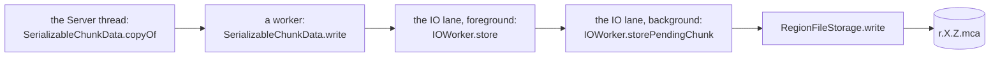
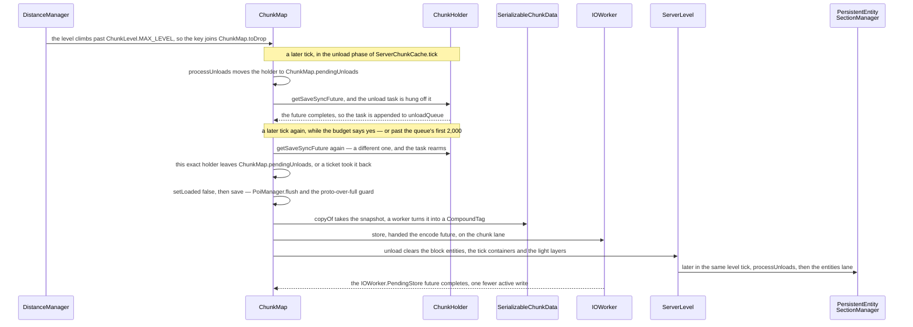
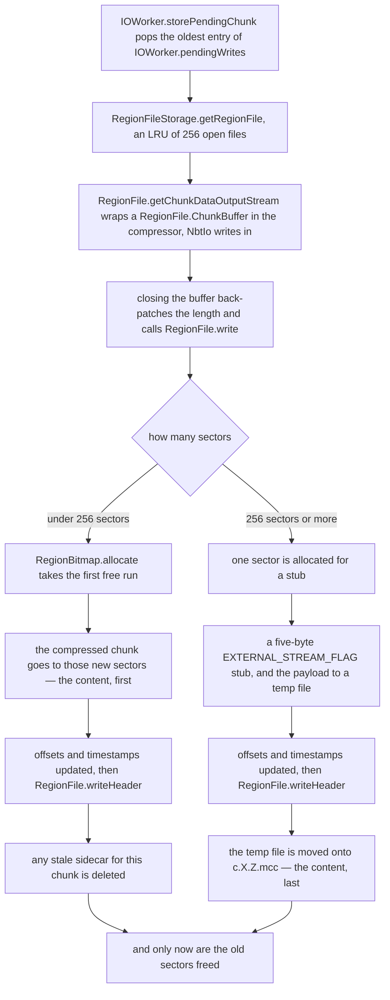

# Chunk storage

> Verified against **Minecraft 26.2** · Part IV · A chunk nobody needs any more is dropped from the world and written to disk, and the server thread never waits for it.

You walk away from your base. Soon after, the chunk you were standing in is
no longer reachable from any ticket, its loading level climbs past
`ChunkLevel.MAX_LEVEL`, and a queued task takes a snapshot of it, hands
that to a worker to turn into NBT, and hands *that* to a lane that
compresses it and finds it somewhere to live in *r.X.Z.mca*. Nothing about
that is surprising. What is surprising is that the chunk was almost
certainly written several times before you left, and that neither of those
writes was anybody's idea. A chunk you keep changing is written by a
background sweep roughly every ten seconds — `ChunkMap.saveChunksEagerly`,
at most `ChunkMap.CHUNK_SAVED_EAGERLY_PER_TICK` (20) chunks a tick, only
while fewer than `ChunkMap.MAX_ACTIVE_CHUNK_WRITES` (128) writes are in
flight, each chunk no sooner than
`ChunkMap.EAGER_CHUNK_SAVE_COOLDOWN_IN_MILLIS` (10 000 ms) after its last —
and the autosave everyone thinks of as *the* save is five minutes of wall
clock whatever `/tick rate` says. **Almost every write of your world is one
nobody asked for.**

## The cast

| class | what it decides | thread |
|---|---|---|
| `ChunkMap` | which chunks are dirty, at which of four moments each is written, and whether a half-generated chunk may overwrite a finished one — it *is* the *region/* store, because it extends `SimpleRegionStorage` | Server |
| `SerializableChunkData` | the chunk file as a record: what gets copied while the world is frozen and what gets encoded after | Server copies, a *Worker-Main-n* encodes |
| `IOWorker` | one store's single lane, and the write-behind map that lets a read answer from a write that has not landed | any *IO-Worker-n*, one task at a time |
| `RegionFileStorage` | which *r.X.Z.mca* files are open — an LRU of `RegionFileStorage.MAX_CACHE_SIZE` (256) | the IO lane |
| `RegionFile` | the sector allocator and the two header tables of one 32×32-chunk file, and the order the bytes land in | the IO lane |
| `EntityStorage` | the *entities/* store: what a chunk's mobs cost to write, and that they are rebuilt on the server thread | Server builds and parses, IO lane writes |
| `SectionStorage` | the *poi/* store under `PoiManager`: which sections are dirty, and the one load that blocks | Server |
| `MinecraftServer` | when the next autosave falls, and whether every region file is opened with DSYNC | Server |

## Copy on the server, encode on a worker, write on the IO lane

*One chunk saved, across the three threads that touch it, coloured by which one.
The server's share is the first box alone, and it ends at a snapshot: everything
to the right of it happens after the tick that decided to save has finished. The
two middle boxes are the same lane at two priorities — the foreground call parks
the tag in `IOWorker.pendingWrites` and returns, and the background one runs
only when nothing is queued in front of it, which is why a write can sit there
for a long time and cost nobody anything.*

That figure is the page's answer to *why doesn't saving lag the server*. Apart from
flushing the position's POI section, the server thread's whole share of a
save is the middle of `ChunkMap.save`: `SerializableChunkData.copyOf`, which copies every `LevelChunkSection` with
`LevelChunkSection.copy` and each non-empty block and sky `DataLayer` out of
`LevelLightEngine.getLayerListener`, clones the heightmaps the chunk's
persisted status calls for, pulls block-entity NBT through
`ChunkAccess.getBlockEntityNbtForSaving`, packs the ticks through
`ChunkAccess.getTicksForSerialization`, and packs the structure starts.
Everything after that — the palette codecs, the deflate, the sector
arithmetic, the syscall — runs somewhere else, and `ChunkMap.save` returns
as soon as the copy is done.

## Four folders, three of them the same shape

`LevelStorageSource.LevelStorageAccess.getDimensionPath` defers to
`DimensionType.getStorageFolder`, which puts **every** dimension — the
overworld included — under *dimensions/\<namespace\>/\<path\>/* in the world
folder. Inside are *region/*, *entities/*, *poi/* and *data/*. The first
three are region stores of the same shape — a folder of *r.X.Z.mca* files, a
`RegionFileStorage`, an `IOWorker`, and a `RegionStorageInfo` naming the
store (*chunk*, *entities* or *poi*) so that
`MinecraftServer.reportChunkSaveFailure` can say which one broke. Only
*chunk* belongs to `ChunkMap` itself; `EntityStorage` and `SectionStorage`
each *hold* a `SimpleRegionStorage` rather than being one. *data/* is not a
region store at all, and it is the section below.

A `LevelChunk`'s entities are **not** in *region/*. The
`SerializableChunkData.entities` list is written only when the chunk's
persisted status is a `ChunkType.PROTOCHUNK` — worldgen's spawns, waiting
for the column to become full — and `SerializableChunkData.carvingMask` goes
the same way. A full chunk's entities live in *entities/*, one file per
chunk, holding a *Position* and an *Entities* list. If an old save still has
entities inside a full chunk's *region/* entry,
`ServerLevel.addLegacyChunkEntities` adopts them on load.

### The other store under *data/*

`SavedDataStorage` is the fourth folder and the one that is not a region
store: no sectors, no LRU of open files, one gzipped `<id>.dat` per thing
that has state. It saves on the same principle as a chunk, and for the same
reason. `SavedDataStorage.scheduleSave` encodes every dirty entry **on the
caller's thread** — the server thread, inside the save it was asked for —
and hands the finished tags to `Util.ioPool`, at most
`Util.maxAllowedExecutorThreads` writes at a time, chaining each onto
`SavedDataStorage.pendingWriteFuture` so that two saves of one file cannot
race. `SavedDataStorage.saveAndJoin` is the only place anything waits, and it
is shutdown. Copy while the world is still, encode and write while it moves:
the same bargain the chunk path makes, over a much smaller object. Which
file holds what is [level data and
rules](../../reference/level-data-and-rules.md#two-saved-data-storages-neither-of-them-the-overworlds)'s.

## The four moments a chunk is written

| the moment | what runs it | which chunks | what holds it back |
|---|---|---|---|
| **an unload** | the task `ChunkMap.scheduleUnload` queued, drained by `ChunkMap.processUnloads` | the one chunk being dropped, at whatever status it reached | nothing — no cooldown, and whatever `ChunkMap.unloadQueue` holds beyond 2,000 tasks drains regardless of the tick budget |
| **the eager sweep** | `ChunkMap.saveChunksEagerly`, the last statement of that same `ChunkMap.processUnloads` | everything in `ChunkMap.chunksToEagerlySave` | 20 a tick, fewer than 128 writes outstanding, the tick's time budget, and ten seconds per chunk |
| **an autosave** | `MinecraftServer.autoSave` → `ServerLevel.save` → `ServerChunkCache.save` → `ChunkMap.saveAllChunks`, without flush | every holder in `ChunkMap.visibleChunkMap` | only the per-chunk gates: `ChunkMap.saveAllChunks` clears `ChunkMap.nextChunkSaveTime`, but `ChunkMap.saveChunkIfNeeded` still wants an accessible, ready, unsaved `LevelChunk` or `ImposterProtoChunk` |
| **a flush save** | `/save-all flush`, `/stop`, `ServerChunkCache.close` | every accessible holder, over and over until a pass saves none | it blocks the server thread instead |

The dirty set behind the second row is narrower than it looks.
`ChunkMap.setChunkUnsaved` is installed as `WorldGenContext.unsavedListener`
and handed to a chunk by `ChunkStatusTasks` at the moment it becomes full,
and `LevelChunk.markUnsaved` fires that listener **only on the false→true
edge**. So `ChunkMap.chunksToEagerlySave` holds full chunks that have
changed since their last write, each added once, and a chunk still being
generated is never in it.

Turning saving off is not as total as it sounds. `ChunkMap.tick` ticks
`PoiManager` first and *unconditionally*, and only then asks
`ServerLevel.noSave` whether to run `ChunkMap.processUnloads` — so a no-save
world still writes village data through `SectionStorage.tick`, and stops
letting go of chunks until something forces the issue. The only other drain
of `ChunkMap.unloadQueue` and `ChunkMap.toDrop` is inside
`ChunkMap.saveAllChunks` with flush, which runs `ChunkMap.processUnloads` on
an always-true budget — so *`/save-all flush`* and shutdown do unload them,
the first because `MinecraftServer.saveAllChunks` suppresses `ServerLevel.noSave`
when *force* is set and the second because `ServerChunkCache.close` never
consults it at all. An explicit save is a different question again:
`MinecraftServer.saveAllChunks` passes `ServerLevel.noSave` on to
`ServerLevel.save` only when its *force* flag is clear, and `/save-all`
sets that flag while `MinecraftServer.autoSave` does not.

### The guard against writing a half-made chunk over a finished one, and where it leaks

The cast row promises this one, so here it is: `ChunkMap.save` refuses to
write a non-full chunk over a full one on disk, and the refusal is best
effort in two ways. `ChunkMap.isExistingChunkFull` returns false — meaning
*go ahead* — whenever the read throws or comes back empty, so an IO error
licenses exactly the clobber the guard exists to prevent. And
`ChunkAccess.tryMarkSaved` clears the unsaved flag *before* the guards run,
so a chunk the guard turns away has already been marked clean and will not be
offered again.

Two shapes never reach the write at all. A proto chunk still at
`ChunkStatus.EMPTY` with no valid structure start is dropped by the same
block, and an `ImposterProtoChunk` refuses outright:
`ImposterProtoChunk.tryMarkSaved` and `ImposterProtoChunk.canBeSerialized` are
flat falses, not the pass-throughs the wrapper's other methods are
(`ImposterProtoChunk.markUnsaved`, `ImposterProtoChunk.isLightCorrect` and
`ImposterProtoChunk.setLightCorrect` all defer to the chunk underneath —
[chunk anatomy](chunk-anatomy.md#the-four-shapes-a-chunk-takes)). The reason
is the same in both cases: the `LevelChunk` under the imposter is what the
saver will be handed instead.

## A chunk nobody needs any more

The save above is the middle of a longer story, and the longer story is three
ticks apart. This is the whole of it, from the level change that drops the chunk
to the write that finally records it.

*A chunk nobody needs, from the level that stopped needing it to the write that
records it. The three note bars are three separate ticks, and the two arrows
that come back are the only two waits in the picture: everything else is a
hand-off the server thread does not watch. The last two arrows are the
entities, which leave by a different road and a later step.*

Three things there are load-bearing. The first is that nothing happens until
`ChunkHolder.saveSync` is done: every promotion future is chained into it by
`ChunkHolder.addSaveDependency`, and so is
`GenerationChunkHolder.generationSaveSyncFuture` for as long as a generation
step holds a reference, so a chunk mid-promotion or mid-generation cannot be
saved or unloaded at all.

The second is the guard. `ChunkMap.pendingUnloads` is removed *by identity*:
if a ticket re-adopted the position while the task waited,
`ChunkMap.updateChunkScheduling` has already pulled the holder back out of
that map, the removal fails, and the task quietly does nothing — nothing is
lost and nothing is written twice. And if the sync future changed while
waiting, the task rearms itself on the new one rather than proceeding.

The third is that entities go by a different road and a later step.
`PersistentEntitySectionManager.updateChunkStatus` saw the same level change
and queued the position in `PersistentEntitySectionManager.chunksToUnload`.
If the chunk's entity file is still being read,
`PersistentEntitySectionManager.storeChunkSections` returns false and the
whole thing is retried next tick, so a half-loaded set never clobbers the
file. Otherwise each entity `EntityAccess.shouldBeSaved` accepts is serialised
with `Entity.save` **on the server thread**, the tag goes to the *entities*
lane, and those entities are removed with
`Entity.RemovalReason.UNLOADED_TO_CHUNK`. The filter runs before the removal,
not after it, so what it turns away — a `Player`, an `EnderDragonPart`, a
passenger, a vehicle carrying exactly one player — is neither written nor
removed. The last of those is not an oddity: `ServerPlayer` writes its own
root vehicle into the player file under *RootVehicle* under exactly that
condition, so a boat with one rider travels in the player's file rather than
the chunk's.

Two other things leave with the chunk, both after the snapshot is taken:
`ServerLevel.unload` clears its block entities and unregisters its tick
containers, and `ThreadedLevelLightEngine.updateChunkStatus` queues the
light engine to forget its layers ([lit before you ever see
it](lighting.md#lit-before-you-ever-see-it)).

## Why the server thread never waits

`IOWorker` is not a thread. It holds a `PriorityConsecutiveExecutor` over
`Util.ioPool` — a cached pool whose threads are named *IO-Worker-n* — and
its guarantee is that one task at a time runs for that store, not that the
same thread runs them. Its three priorities are strictly ordered:
`IOWorker.Priority.FOREGROUND` for `IOWorker.store` and
`IOWorker.loadAsync`, `IOWorker.Priority.BACKGROUND` for
`IOWorker.storePendingChunk` — the task that actually touches the disk — and
`IOWorker.Priority.SHUTDOWN` last. The lowest priority has exactly one user
in the whole game: the barrier `IOWorker.waitForShutdown` parks behind
everything else when the store closes. A flush is not one of them —
`IOWorker.synchronize` submits it at foreground priority like a store — but
it still lands behind the writes, because before it flushes it waits on
every `IOWorker.PendingStore` future, and those complete only when the
background tasks have run.

`IOWorker.pendingWrites` is what that buys. It is a sequenced map from
`ChunkPos` to `IOWorker.PendingStore`, and a second store for a position
already in it overwrites that entry's data *in place* without moving it, so
N saves of one chunk before the lane drains become **one** disk write and
one shared future. `IOWorker.loadAsync` looks in the same map first and
returns a *copy* of the pending tag, so a chunk unloaded and re-loaded a
second later never touches the region file — read-your-writes by lane order
rather than by any lock. `IOWorker.STORE_EMPTY` is the null supplier that
means *delete*, and `IOWorker.scanChunk` is the streaming `ChunkScanAccess`
that `StructureCheck` uses to peek into chunks nobody has loaded.

### The three places that do wait

Three places make the server thread wait on a disk. `ChunkMap.isExistingChunkFull`,
the guard that stops a `ProtoChunk` overwriting a finished chunk, answers
from `ChunkMap.chunkTypeCache` when it can but joins the read future inline
on a cold entry — the IO lane, then a datafix pass on the worker pool. And
`SectionStorage.getOrLoad` joins too, for a POI section that
`SectionStorage.prefetch` never fetched. The third is not a chunk-storage
method at all: `StructureCheck.tryLoadFromStorage` joins `IOWorker.scanChunk`
to peek at a chunk it will not load, which is what an eye of ender, a
dolphin, an explorer map and `/locate` all end up doing on the server
thread. None of the three is on the save path, which is why the save path
costs a copy.

## Inside a region file

The last box of the first figure is a file format, and it is where the ordering
that makes a half-finished save survivable actually lives.

*Two ways to write one chunk, and they put the content and the pointer to it in
opposite orders. Follow the left arm and the bytes are on disk before the header
that names them; follow the right arm and the header is written first, pointing
at a stub, and the real payload only lands when the temp file is moved. Both
arms meet at the last box, which is the rule that makes either safe: the old
sectors are not freed until the new ones can be found.*

A `RegionFile` is one *r.X.Z.mca*: two header sectors
(`RegionFile.SECTOR_BYTES` is 4096) holding a 1024-entry offset table,
`RegionFile.offsets`, packed as sector number ≪ 8 with the sector count in
the low byte, and a 1024-entry `RegionFile.timestamps`. Free space is a
`RegionBitmap`, with the header's two sectors forced used at construction
and `RegionBitmap.allocate` handing out the first run big enough. Nothing
ever reads the timestamp table back: `RegionFile.write` stamps each entry
with epoch seconds from `RegionFile.getTimestamp`, and the only clock the
save path consults is the monotonic `Util.getMillis` behind
`ChunkMap.nextChunkSaveTime`. Two clocks, and neither of them is game time. Each
stored chunk starts with `RegionFile.CHUNK_HEADER_SIZE` (5) bytes — a length
and a compression id — and both `RegionFile.write` and
`RegionFile.getChunkDataInputStream` are synchronised on the `RegionFile`
itself rather than on the channel, though in practice only one lane ever
drives a given folder.

Read the two branches of the figure against each other and the page's best
fact falls out. For an ordinary chunk the new bytes are on disk **before**
the header points at them, and the old bytes are released **after** — so a
crash at any point leaves either the old chunk or the new one, and a chunk
never overwrites itself in place. For an oversized chunk the ordering is
reversed. Anything needing `RegionFile.EXTERNAL_CHUNK_THRESHOLD` (256)
sectors or more cannot be described by an eight-bit count field at all, so
it goes to a *.mcc* sidecar and the region file keeps only a stub carrying
`RegionFile.EXTERNAL_STREAM_FLAG`; and the sidecar is moved into place
*after* `RegionFile.writeHeader` has already committed the pointer to it,
destroying the previous copy at a fixed path. The in-file case is
content-then-pointer. The sidecar case is pointer-then-content. Either way
the ordering only buys anything if the writes reach the platter in that
order, which is what DSYNC is for:
`MinecraftServer.forceSynchronousWrites` returns true as the base default,
and two of the three servers override it — `DedicatedServer` from
`DedicatedServerProperties.syncChunkWrites` (*sync-chunk-writes*, default
true) and `IntegratedServer` from `Options.syncWrites`, whose default is
true only on Windows. `GameTestServer` keeps the base answer.

The compression byte is per chunk, not per file.
`RegionFileVersion.selected` — set once by `RegionFileVersion.configure`
from `DedicatedServerProperties.regionFileComression` (Mojang's spelling;
the property is *region-file-compression*) — decides only what *new* writes
use, choosing between `RegionFileVersion.VERSION_DEFLATE` (the
`RegionFileVersion.DEFAULT`), `RegionFileVersion.VERSION_NONE` and
`RegionFileVersion.VERSION_LZ4`. Reads honour whatever byte each chunk
carries, including `RegionFileVersion.VERSION_GZIP`, which has no option
name and so can be read but never chosen, and
`RegionFileVersion.VERSION_CUSTOM`, which exists so that
`RegionFile.createChunkInputStream` can recognise it and refuse.

## The way back in

Loading is the same road driven backwards, in four stages across three lanes.
`ChunkMap.scheduleChunkLoad` starts with `IOWorker.loadAsync` on the IO
lane; `ChunkMap.readChunk` then hops to `Util.backgroundExecutor` under the
name *upgradeChunk* for `ChunkMap.upgradeChunkTag`, which is
where datafixing happens; `SerializableChunkData.parse` runs on the same
pool under *parseChunk*, so those two stages share a lane; and
`SerializableChunkData.read` runs on the server
thread, where the sections are installed, the saved light is queued into the
light engine, and `PoiManager.checkConsistencyWithBlocks` re-derives each
section's points of interest from its blocks. Running beside all of it,
`SectionStorage.prefetch` pulls the POI file in, and the two are joined
before the server-thread step — which is exactly why that step's
`SectionStorage.getOrLoad` calls do not block. From there the [generation
pipeline](chunk-generation-pipeline.md#the-empty-step-asks-the-only-question-that-changes-the-walk)
takes over — including what happens when the bytes will not parse.

Entities come back the same shape but land differently: `EntityStorage`
schedules both the datafix and `EntityType.loadEntitiesRecursive` on
`EntityStorage.entityDeserializerQueue`, a `ConsecutiveExecutor` over the
**server** main-thread executor, so only the NBT read is off-thread.

### Doing all of it at once, with no server running

*Optimize World* in the world-select screen is the same read and the same
write with the game in between removed. `WorldUpgrader` starts a single daemon
thread named *World Upgrader* and hands each of the three stores to a
`RegionStorageUpgrader`, which walks every *r.X.Z.mca* file in the folder,
datafixes each chunk tag and writes it back — optionally into fresh region
files, which is what compacts a save whose sectors have fragmented.
`UpgradeProgress` is the counter the screen reads. Nothing here loads a chunk,
generates one, or consults a status: the world is a folder of tags, and the
button's whole promise is that every tag is at the current data version before
a server ever opens the save.

## Questions players ask

**Does the game stall when it saves?** Only on a flush.
`ChunkMap.saveAllChunks` with flush loops over the accessible holders,
blocking the main-thread executor on each `ChunkHolder.isReadyForSaving`
until a whole pass saves nothing, then flushes POIs with
`SectionStorage.flushAll`, runs `ChunkMap.processUnloads` with an
always-true budget, and finally joins `IOWorker.synchronize` with flush.
That is the only place where waiting for the disk is the point rather than
an accident, and it is what `/save-all flush` and `/stop` do.

**Why does lowering the tick rate not push out my autosave?** Because the
interval is wall clock. `MinecraftServer.computeNextAutosaveInterval` is the
tick rate times 300 — or, while the server is sprinting, 300 times the rate
its recent tick times imply — floored at `MinecraftServer.MIMINUM_AUTOSAVE_TICKS`
(100 — the typo is Mojang's); the very first interval is
`MinecraftServer.AUTOSAVE_INTERVAL` (6000 ticks).
`MinecraftServer.onTickRateChanged` recomputes it on every `/tick rate`, but
assigns the result only when it is **smaller** than the pending countdown,
so changing the rate can bring the next autosave forward and can never push
it back. [The server tick](../server/server-tick.md#the-bookkeeping-at-the-bottom) has the rest of that
loop.

**Why is my *entities/* folder full of files with nothing in them?** It is
not — but emptying a chunk costs one write. `EntityStorage.storeEntities`
with an empty set only writes when `EntityStorage.emptyChunks` did not
already contain the position, and that write is `IOWorker.STORE_EMPTY`,
which zeroes the region entry and deletes any sidecar. The first time a
chunk goes empty costs a write. Every later save of it costs nothing.

## Where to look

`ChunkMap.tick` · `ChunkMap.processUnloads` · `ChunkMap.scheduleUnload` ·
`ChunkMap.save` · `ChunkMap.saveChunksEagerly` · `ChunkMap.saveChunkIfNeeded` ·
`ChunkMap.saveAllChunks` · `SerializableChunkData.copyOf` ·
`SerializableChunkData.write` · `IOWorker.store` ·
`IOWorker.storePendingChunk` · `IOWorker.loadAsync` ·
`RegionFileStorage.write` · `RegionFile.write` · `RegionBitmap.allocate` ·
`PersistentEntitySectionManager.storeChunkSections` ·
`EntityStorage.storeEntities` · `SectionStorage.writeChunk` ·
`SectionStorage.prefetch` · `ChunkMap.scheduleChunkLoad` ·
`SerializableChunkData.read` · `MinecraftServer.computeNextAutosaveInterval` ·
`DimensionType.getStorageFolder`

Next door: [tickets and loading](tickets-and-loading.md) raises the level,
[chunk anatomy](chunk-anatomy.md) owns what `LevelChunkSection.copy` copies,
[lighting](lighting.md) owns the layers the unload throws away, [points of
interest](points-of-interest.md) owns the *poi/* store, [the server
tick](../server/server-tick.md#the-budget-and-where-it-stops-applying) owns the budget every method here is handed,
[how a server dies](../server/how-a-server-dies.md) is the save that does
not happen, and [entity lifecycle](../entities/entity-lifecycle.md#ending-two-the-chunk-goes-away) is what
`Entity.RemovalReason.UNLOADED_TO_CHUNK` means to a mob.

---

*Rules: names, never code · how the system works, not how the code reads ·
newest version only · every backticked name passes `tools/verify_names.py`.*
