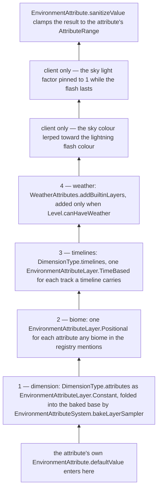
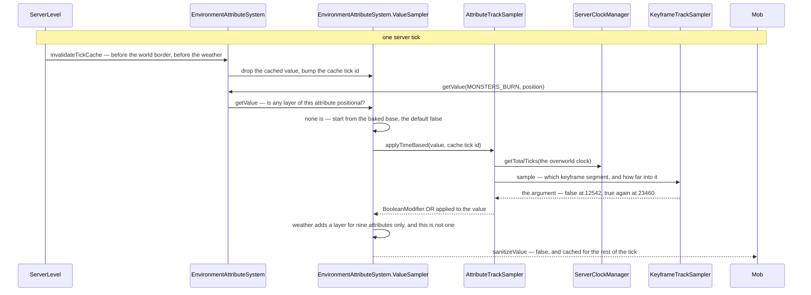
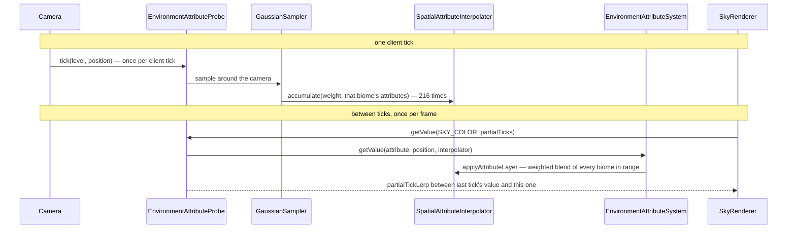

# Environment attributes and timelines

> Verified against **Minecraft 26.2** · Part IV · dusk falls over a taiga, and one value is resolved through a stack of layers — on the server for a mob, and again on the client for the sky.

Dusk on the overworld clock is a stretch and not an instant. Between tick
11867 and tick 13670 the sky over a taiga slides from its pale blue towards
black, and the sky over a pale garden slides from its grey towards black by
the same proportion; part-way through, at tick 12542, every mob standing in
the open stops being in danger of burning until dawn. A player would never
connect the three, and in 26.2 they are one mechanism. An **environment
attribute** is a named, typed, registered property of the world —
`EnvironmentAttributes` puts 48 of them in
`BuiltInRegistries.ENVIRONMENT_ATTRIBUTE` — and the world answers one for a
position and an instant by running a short stack of **layers** over the
attribute's default value: the dimension, the biome, the **timelines**, the
weather. The surprise is in what a timeline holds. The day timeline does not
know what colour a taiga sky is and never learns: its keyframes are not
values but *modifier arguments*, and the night segment of the sky track is a
multiply. **Night does not set the sky's colour — it multiplies whatever the
biome produced**, which is how one data-driven curve darkens every overworld
biome correctly without being told about any of them.

## The cast

Eight classes carry a value from the data pack to the sky. The first two
thirds of this page is the machinery, object by object; the last third runs
dusk through it twice, once on each side.

| class | what it decides | thread |
|---|---|---|
| `EnvironmentAttribute` | the key: a type, a default, an `AttributeRange`, and three flags — *positional*, *spatially interpolated*, *syncable*. It holds no value and no state | — (registry constant) |
| `EnvironmentAttributeMap` | what one dimension or one biome contributes — a modifier and an argument per attribute, never a bare value | — (loaded from data) |
| `EnvironmentAttributeSystem` | the baked per-level resolver: one `EnvironmentAttributeSystem.ValueSampler` for each attribute some layer mentions | built in the level constructor, read on that level's thread |
| `Timeline` | a clock, an optional period, one `AttributeTrack` per attribute, and the named instants on that clock | — (loaded from data) |
| `AttributeTrackSampler` | one track baked against a clock, with a one-tick cache of the sampled argument | Server or Render |
| `ServerClockManager` | **the owner of day time** — one `ServerClockManager.ClockInstance` per registered `WorldClock`, saved as *world_clocks* | Server |
| `ClientClockManager` | the client's copy: free-runs each clock forward between packets | Render |
| `EnvironmentAttributeProbe` | the client's smoothing layer, living on `Camera`: 216 biome samples a tick, a lerp every frame | Render |

## The stack a value falls through

`EnvironmentAttributeSystem.Builder.addDefaultLayers` stacks those four in
that order and only that order. There is no priority number anywhere and no
ordering data: a biome cannot run before its dimension, and weather is the
last word on the server — on the client the two lightning-flash layers sit
above it. The stack is *per attribute*, too — an attribute nothing
in the level mentions has no `EnvironmentAttributeSystem.ValueSampler` at
all, and `EnvironmentAttributeSystem.getValue` hands back its default. And it
is baked once: the whole thing is built in the `ServerLevel` and
`ClientLevel` constructors and never rebuilt, the only writer being
`ServerLevel.setEnvironmentAttributes`, which is deprecated, marked for
testing and called only from `TestEnvironmentDefinition`. A data-pack reload
does not touch it.

Each rung earns its shape. The dimension's is an
`EnvironmentAttributeLayer.Constant`, and
`EnvironmentAttributeSystem.bakeLayerSampler` walks off the front of the list
folding every *leading* constant into one baked base value, so a dimension
costs nothing at read time. The biome's is an
`EnvironmentAttributeLayer.Positional`, added once per attribute that any
biome in the whole registry mentions — in vanilla, eleven attributes across
sixty-six biome files, with *visual/sky_color* in fifty-six of them. Timeline
layers are `EnvironmentAttributeLayer.TimeBased`, one per track, and so is
weather: one for each of the nine attributes named by
`WeatherAttributes.RAIN` or `WeatherAttributes.THUNDER`, blending rain in
first and thunder second — rain at `Level.getRainLevel` *minus* the thunder
level, so a thunderstorm never counts twice. `Level.canHaveWeather` wants sky
light, no ceiling and not the End, so a rain-free dimension does not carry a
weather layer that does nothing: it carries none.

`ClientLevel` adds two more after those four, both keyed on the lightning
flash that `LightningBolt` sets through `Level.setSkyFlashTime`. One lerps
`EnvironmentAttributes.SKY_COLOR` a fixed 22% toward a pale blue-white, the
other pins `EnvironmentAttributes.SKY_LIGHT_FACTOR` to 1 outright, and both
read the flash through the accessibility option *Hide Lightning Flashes*,
which reports a flash time of zero while it is switched on — so the two
layers are still there and simply never fire. (The End's sky flash is a
different thing
entirely — `EndFlashState`, read by the renderers rather than through the
stack; see [lightmap, fog and sky](../rendering/lightmap-fog-and-sky.md).)

An attribute is **positional** unless its builder says otherwise — positional
meaning its answer is allowed to differ from block to block — and that flag
is what polices who may write it. `Biome.getAttributes` is read through
`EnvironmentAttributeMap.CODEC_ONLY_POSITIONAL`, so naming a non-positional
attribute in a biome file is a load error, and no biome can locally change
sky light level or lava speed. `WorldGenRegion.environmentAttributes` shuts
the door from the other side, returning `EnvironmentAttributeReader.EMPTY`
and answering everything with its default: a feature that asks about the
environment during generation gets a constant, deliberately, because
generation must not depend on the hour.

## Arguments, not values

`EnvironmentAttributeMap` is not a map of values. It is a map of
`EnvironmentAttributeMap.Entry`, and an entry is an *argument* plus an
`AttributeModifier`. `EnvironmentAttributeMap.Builder.set` is sugar for
`EnvironmentAttributeMap.Builder.modify` with `AttributeModifier.override`;
the interesting entries multiply, blend, maximise or *or* into whatever the
layer below produced. `AttributeTrack` is the same shape — a modifier plus a
`KeyframeTrack` of arguments — which is why `Timeline.Builder.addTrack` is
only the override case and `Timeline.Builder.addModifierTrack` is the general
one, and why the day timeline can say *multiply sky light by 0.267 at night*
rather than *sky light is 4 at night*. In a data pack the shorthand shows: an
entry written as a bare value means override, one written as an object
carries a *modifier* and an *argument*.

### What a type allows

`AttributeType` is a record of a
value codec, an `AttributeType.modifierLibrary` of the operations legal on
that type, and **four** separate `LerpFunction`s, one for each way two values
of it can meet.

| lerp slot | used when |
|---|---|
| `AttributeType.keyframeLerp` | between two keyframes of a timeline track that overrides the value — a track of *modifier arguments* uses the modifier's own `AttributeModifier.argumentKeyframeLerp` instead |
| `AttributeType.stateChangeLerp` | fading weather in and out |
| `AttributeType.spatialLerp` | across a biome boundary |
| `AttributeType.partialTickLerp` | between two client ticks, inside a frame |

`AttributeTypes` registers fourteen of them, in four families: two boolean
kinds, three numeric, two colour, and seven enumerations a data pack picks a
name from — a moon phase, a villager activity, a bed rule, a particle, a
piece of background music. One built by `AttributeType.ofNotInterpolated`
gets a step function in all four slots, each with its own threshold, which is
how a `MoonPhase` snaps while a colour slides; `AttributeType.toFloat` is
nullable, and its presence decides whether an attribute can be read as a
number by a loot table, which the trace below reaches. Each type publishes a
small, closed library of operations —
six logic gates for a boolean, six arithmetic ones for a float, four ways to
combine two colours — and `AttributeType.checkAllowedModifier` throws at
build time when a track or an entry asks for one the type does not publish,
so an illegal combination is a load error rather than a runtime surprise.
Three codecs then decide who may write what:

| codec | used by | effect |
|---|---|---|
| `EnvironmentAttributeMap.CODEC` | `DimensionType.attributes` | anything |
| `EnvironmentAttributeMap.CODEC_ONLY_POSITIONAL` | `Biome.getAttributes` | **rejects non-positional attributes** |
| `EnvironmentAttributeMap.NETWORK_CODEC` | `DimensionType.NETWORK_CODEC`, `Biome.NETWORK_CODEC` | drops every non-syncable entry before the wire |

## Who owns the clock

`WorldClock` is a unit record. It holds nothing at all: it is an identity
token in the `Registries.WORLD_CLOCK` registry, and vanilla registers two,
`WorldClocks.OVERWORLD` and `WorldClocks.THE_END`. Every piece of state lives
in `ServerClockManager.ClockInstance` — a total tick count, a fractional
partial tick, a rate and a paused flag — and the manager holding those is a
`SavedData` under `ServerClockManager.TYPE`, saved once for the whole server
as *world_clocks*.

### The four numbers, and the two records that copy them

The live instance is mutable, so its numbers exist twice more as records.
`ClockState` is the saved form and carries all four; `PackedClockStates` is
the map of them a save file holds. `ClockNetworkState` is the wire form and
carries three — total ticks, partial tick and rate — and the one it leaves
behind, the paused flag, is the whole of what the client does not get.
`ClockManager` is the one thing the two managers share, an interface with a
single method: *what is the total tick count of this clock*. Everything a
reader of an attribute needs from a clock is behind that method, which is why
`AttributeTrackSampler` can be the same class on both sides, and why
**`ServerClockManager` is the owner of day time** in this book.

### What moves a clock

`MinecraftServer` calls `ServerClockManager.tick` once per server tick,
inside the *clocks* profiler zone and only while the tick-rate manager runs
normally; the `GameRules.ADVANCE_TIME` check sits inside the method itself,
and gates every clock at once where `ServerClockManager.setPaused` gates one.
Each unpaused instance then gains its rate, accumulating the fraction, so a
clock at rate 0.5 gains a tick every other server tick and one at rate 1000
gains a thousand — `/time rate` accepts anything from 0.00001 to 1000.

### Naming an instant on a clock

A `ClockTimeMarker` is a named instant on a clock: `ClockTimeMarkers.DAY`,
*NOON*, *NIGHT*, *MIDNIGHT*, *WAKE_UP_FROM_SLEEP*, *ROLL_VILLAGE_SIEGE*.
Markers are declared *inside* timelines and collected onto the clock by
`ServerClockManager.init`, and `Timeline.validateRegistry` fails the whole
registry load if two timelines on one clock declare the same one. The subset
a player can name is the one flagged `ClockTimeMarker.showInCommands`;
`ServerClockManager.isAtTimeMarker` is how `VillageSiege` asks whether the
siege roll is due, and `ServerLevel.tick` calls
`ServerClockManager.moveToTimeMarker` to jump the clock when enough players
are asleep. Everything `TimeCommand` offers is offered twice, once against
the source level's `DimensionType.defaultClock` and once under `/time of`
against a clock the player names, because a command that says *set the time*
has to be told whose time it means.

## The four timelines

| timeline | period | what it carries |
|---|---:|---|
| `Timelines.OVERWORLD_DAY` | 24000 | the whole day/night curve — sun, moon and star angles, sky and fog colours, sky light, and the gameplay flags that flip at dusk |
| `Timelines.MOON` | 192000 — eight days | the moon phase, and the surface slime spawn chance riding the same steps |
| `Timelines.VILLAGER_SCHEDULE` | 24000 | `EnvironmentAttributes.VILLAGER_ACTIVITY` and `EnvironmentAttributes.BABY_VILLAGER_ACTIVITY` |
| `Timelines.EARLY_GAME` | none | one ramp that *and*s `EnvironmentAttributes.CAN_PILLAGER_PATROL_SPAWN` with false until tick 120000 |

Three of the four have a period and are cycles. The fourth is the interesting
one: a timeline with no period is not a cycle at all — its track runs once
against the clock's total ticks and then holds its last value forever, which
is what makes `Timelines.EARLY_GAME` a one-way switch thrown a hundred
minutes into a world rather than something that comes round again.

All four run on `WorldClocks.OVERWORLD`; nothing in vanilla is bound to the
End's clock. Which of them a dimension runs is a tag on
`DimensionType.timelines`: `TimelineTags.IN_OVERWORLD` names the day, moon
and early-game timelines on top of `TimelineTags.UNIVERSAL`, while
`TimelineTags.IN_NETHER` and `TimelineTags.IN_END` name only the universal
one, which holds the villager schedule. That schedule is the clearest case of
a timeline driving something that is not a colour: `Brain.setSchedule` takes
an `EnvironmentAttribute` of `Activity`, `Villager` is the only caller —
adults read `EnvironmentAttributes.VILLAGER_ACTIVITY` and babies
`EnvironmentAttributes.BABY_VILLAGER_ACTIVITY`, two tracks on the one
timeline — and `Brain.updateActivityFromSchedule` samples it at the
villager's own position, but only when more than 20 game ticks have passed
since it last looked. Where the activity it reads then sends a villager is in
[points of interest](points-of-interest.md).

## What crosses the wire

The *rules* travel, never the resolved values. `Registries.TIMELINE` and
`Registries.WORLD_CLOCK` are in `RegistryDataLoader.SYNCHRONIZED_REGISTRIES`
— the timeline through `Timeline.NETWORK_CODEC`, so only syncable tracks go —
while `Registries.ENVIRONMENT_ATTRIBUTE` and `Registries.ATTRIBUTE_TYPE` are
built-in code registries that never go out at all.

**Syncable** is the third flag, and it draws the line between the two sides.
Thirty-three of the 48 carry it: every one of the 24 *visual/* attributes and
all four *audio/* ones, and five of the gameplay flags — *sky_light_level*,
*fast_lava*, *water_evaporates*, *piglins_zombify*, *creaking_active*. The
fifteen left behind are gameplay decisions the server makes alone: whether
monsters burn, whether a raid can start, what a villager should be doing now.
Dropping their entries and tracks before the wire costs the client nothing,
because it would never ask. So the client's stack is shorter than the
server's, and identical everywhere the client actually looks.

Clock *state* rides
`ClientboundSetTimePacket`: a game time plus a `ClockNetworkState` — total
ticks, partial tick, rate — per clock in its map.
`ServerClockManager.createFullSyncPacket` fills that map on join and on a
`GameRules.ADVANCE_TIME` change and every mutator broadcasts a one-clock
update, but the routine broadcast from
`MinecraftServer.forceGameTimeSynchronization`, once every twenty ticks,
sends an *empty* map and nothing but the game time.
`ClientClockManager.handleUpdates` adopts what arrives and
`ClientClockManager.tick` free-runs the rest — which is why a paused clock
travels as rate 0: the client has no paused flag to receive.

## Dusk, and the same question asked twice

A mob asks whether it should be burning, and the camera asks what colour the
sky is. Both go through the stack above, and this is the machinery running.

Read the arrows as decisions. `EnvironmentAttributeSystem.invalidateTickCache`
computes nothing: it drops each sampler's cached value and bumps a counter,
and that counter is the identity every downstream sampler compares against.
`AttributeTrackSampler.applyTimeBased` keeps a one-entry cache of the sampled
*argument* and reuses it for every reader arriving with the same tick id, so
a thousand mobs asking `EnvironmentAttributes.MONSTERS_BURN` cost one
keyframe sample between them.

The step that reads oddly is the one where the sampler asks whether any layer
of the attribute is positional and finds that none is.
`EnvironmentAttributes.MONSTERS_BURN` *is* a positional attribute, and yet
its stack is one layer deep, because in vanilla nothing but the day timeline
mentions it: no dimension type, no biome.
`EnvironmentAttributeSystem.ValueSampler` decides by *layers*, not by the
flag, so with no positional layer present the position is ignored and the
whole answer is memoised for the tick. The flag still governs where the
attribute may be read: it makes `EnvironmentAttributeCheck` and
`EnvironmentAttributeValue` declare `LootContextParams.ORIGIN` a required
parameter, and it makes `EnvironmentAttributeSystem.getDimensionValue` throw
in a development build if asked for a positional attribute at all. Only two
attributes are built `EnvironmentAttribute.Builder.notPositional` — sky light
level and lava speed — and three call sites read them that positionless way:
`Level.updateSkyBrightness` for `EnvironmentAttributes.SKY_LIGHT_LEVEL`, and
`LavaFluid.isFastLava` and `Entity` for `EnvironmentAttributes.FAST_LAVA`,
the two sites that between them decide [how fast lava flows](fluids.md) and
how hard it shoves. A fourth site names no attribute at all:
`EnvironmentAttributeReader` sends any non-positional attribute down this road
when a loot context asks for one.

`KeyframeTrackSampler.sample` is where the period matters: for a periodic
track it bakes two extra segments, last keyframe to first on either side of
the loop, so a value interpolates *across the wrap* — tick 0, which on this
clock is dawn — instead of snapping, and it reduces the clock's total ticks
with a floor-mod before choosing one. `EasingType` supplies the curve, and
the day timeline's sun, moon and star angles share one symmetric cubic
Bézier whose two keyframes both sit at tick 6000, so the baked segment runs
noon to noon. The sun therefore turns slowest at its zenith — two thirds of
the linear rate — and fastest at midnight, at about six fifths of it. That is
why a Minecraft day is not two equal halves: the sun spends roughly 13,560
ticks above the horizon against 10,440 below.

### The same value on the client

The client resolves the *same* stack from the *same* data — it is never sent
a resolved value. What it adds is two kinds of smoothing the server never
does. In space, `EnvironmentAttributeProbe.tick` prunes, clears, then runs
`GaussianSampler.sample` over a 6×6×6 neighbourhood of quart-resolution biome
cells — the 4×4×4 blocks a biome is stored per — for 216 samples in all. The
weights come from a seven-entry kernel, 0-1-4-6-4-1-0, with each of the six
taps along an axis lerped between two neighbouring entries by the camera's
sub-cell offset: the weights slide as the camera moves instead of snapping
when it crosses a cell. Those weights accumulate into a
`SpatialAttributeInterpolator`, whose
`SpatialAttributeInterpolator.applyAttributeLayer` applies each contributing
biome's modifier to the base value and lerps the *results* together by
weight. Only the 21 attributes flagged
`EnvironmentAttribute.isSpatiallyInterpolated` are resolved that way; anything
else takes the single biome under the position. But that flag is not a gate on
the *sampling*: the probe runs its 216 samples every tick regardless, and the
test is applied afterwards, when the layer is applied. The server pays none of
it — it passes no interpolator at all. In time, each probed value keeps last tick's
answer beside this tick's and returns `AttributeType.partialTickLerp` between
them — and prunes itself, dropping any value nobody read during a tick.

The probe lives on `Camera`, ticked from `Camera.tick` and emptied by
`Camera.reset`, and everything that draws the sky goes through it — the sky,
the lightmap, the two fog environments, the clouds and the music. That is why
[lightmap, fog and sky](../rendering/lightmap-fog-and-sky.md) never touches
`EnvironmentAttributeSystem` directly. The probe is not a wall, though: the
clock item reads *sun_angle* and *moon_phase* off
`ClientLevel.environmentAttributes` directly, and so does `ClientLevel`
itself for ambient particles.

The last difference is a tick wide, and it is the reason the two sides can
disagree about the sky for one tick at dusk. They invalidate at opposite ends
of the tick: `ServerLevel.tick` calls
`EnvironmentAttributeSystem.invalidateTickCache` before the world border and
the weather, then runs `Level.updateSkyBrightness` later in the same method,
once sleeping and weather have resolved; `ClientLevel.tick` does the reverse,
`Level.updateSkyBrightness` first and invalidation last, so the client's
sky-darken value comes from the previous tick's clock.

## Questions players ask

**Why does the nether have no night?** It has no day timeline: the nether's
and the End's `DimensionType.timelines` both resolve to
`TimelineTags.UNIVERSAL` alone. Its environment is constants instead — the
dimension type pins *gameplay/sky_light_level*, *gameplay/fast_lava*,
*gameplay/water_evaporates* and eleven more, which
`EnvironmentAttributeSystem.bakeLayerSampler` folds into a base value that
never changes again.

**Does setting the time in the overworld move the End?** No: each clock keeps
its own `ServerClockManager.ClockInstance`. Every mutator does invalidate the
cache on *every* level at once, though — `ServerClockManager` walks
`MinecraftServer.getAllLevels` on each change, because a time jump must not
leave half a tick of stale sky behind.

**Why do pillager patrols not show up on day one?** Because
`Timelines.EARLY_GAME` is the timeline with no period, and its single
modifier track *and*s `EnvironmentAttributes.CAN_PILLAGER_PATROL_SPAWN` with
false until tick 120000 — a hundred minutes of play — and with true after.
Nothing counts your days; the switch is one keyframe on a track that never
comes round again.

> **For a 1.21-era reader.** Three sets of names moved. The gameplay booleans
> on `DimensionType` — *ultrawarm*, *bed_works*, *piglin_safe*,
> *respawn_anchor_works* — are entries in `DimensionType.attributes` now, and
> *ultrawarm* has become two of them, `EnvironmentAttributes.FAST_LAVA` and
> `EnvironmentAttributes.WATER_EVAPORATES`. `BiomeSpecialEffects` keeps only
> the water, foliage and grass tints: sky and fog are `Biome.getAttributes`.
> And the villager *Schedule* class is `Timelines.VILLAGER_SCHEDULE`, a
> data-pack `Timeline` like any other.

## Where to look

`EnvironmentAttributes` · `EnvironmentAttribute.Builder` · `AttributeTypes` ·
`EnvironmentAttributeMap.Entry` · `EnvironmentAttributeSystem.Builder` ·
`EnvironmentAttributeSystem.bakeLayerSampler` ·
`EnvironmentAttributeSystem.invalidateTickCache` ·
`WeatherAttributes.addBuiltinLayers` · `Timelines` · `Timeline.createTrackSampler` ·
`AttributeTrackSampler.applyTimeBased` · `KeyframeTrackSampler.sample` ·
`ServerClockManager.tick` · `ClientClockManager.handleUpdates` ·
`EnvironmentAttributeProbe.tick` · `SpatialAttributeInterpolator.applyAttributeLayer` ·
`GaussianSampler.sample` · `TimeCommand`

---

*Rules: names, never code · how the system works, not how the code reads ·
newest version only · every backticked name passes `tools/verify_names.py`.*
