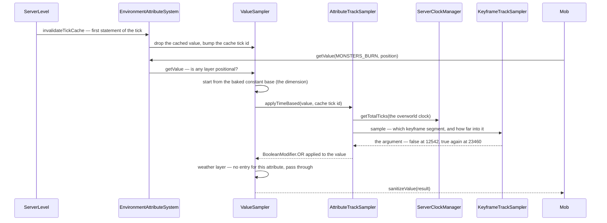
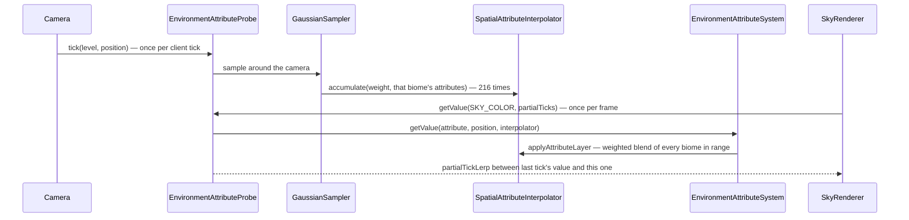

# Environment attributes and timelines

> Verified against **Minecraft 26.2** · Part IV · The trace: dusk falls — one value resolved through four layers, on the server and again on the client.

## Responsibility

Everything the *place and the hour* decide. Whether lava flows fast, whether
a bed explodes, what colour the fog is, which activity a villager should be
doing, how bright the sky counts as: in 26.2 all of it is one system. An
**environment attribute** is a named, typed, registered property of the
world; the world answers it for a position and an instant by running a
short stack of **layers** — dimension, biome, timeline, weather — over the
attribute's default value.

This replaced three separate mechanisms. `DimensionType` used to carry a
row of booleans (*ultrawarm*, *natural*, *bed_works*, *piglin_safe*,
*respawn_anchor_works*, *ambient_light*, *fixed_time*); `BiomeSpecialEffects`
used to carry the whole visual palette; the villager day was a *Schedule*
class of its own. All three are now attribute maps, and the day/night curve
that drives them is a data-driven **timeline** — a set of keyframe tracks
sampled against a **world clock**.

The one sentence a player recognises: *the sky reddening at sunset, mobs
catching fire at dawn, and villagers going to work at 2000 — the same
mechanism, three times.*

## The data it owns

### The attribute and its type

- `EnvironmentAttribute` is the key. It is not a value and holds no state:
  it is `EnvironmentAttribute.type` (an `AttributeType`),
  `EnvironmentAttribute.defaultValue`, an `AttributeRange` used by
  `EnvironmentAttribute.sanitizeValue`, and three flags —
  `EnvironmentAttribute.isSyncable` (does the client get the rule),
  `EnvironmentAttribute.isPositional` (does the answer depend on *where*),
  `EnvironmentAttribute.isSpatiallyInterpolated` (may biomes be blended
  across the boundary). Built through `EnvironmentAttribute.Builder`, and
  note the default: **positional unless a builder says
  `EnvironmentAttribute.Builder.notPositional`**.
- `EnvironmentAttributes` registers **48** of them into
  `BuiltInRegistries.ENVIRONMENT_ATTRIBUTE`, in three id namespaces —
  24 *visual/*, 4 *audio/*, 20 *gameplay/*. 33 are syncable, 21 are
  spatially interpolated, and exactly **two** are not positional:
  `EnvironmentAttributes.SKY_LIGHT_LEVEL` and
  `EnvironmentAttributes.FAST_LAVA`.
- `AttributeType` is what makes a value operable: its `AttributeType.valueCodec`,
  an `AttributeType.modifierLibrary` of the operations legal on it, and
  **four** separate `LerpFunction`s — `AttributeType.keyframeLerp` (between
  timeline keyframes), `AttributeType.stateChangeLerp` (fading weather in),
  `AttributeType.spatialLerp` (across a biome boundary) and
  `AttributeType.partialTickLerp` (between two client ticks). A type built
  by `AttributeType.ofNotInterpolated` gets step functions in all four
  slots with different thresholds, which is how a `MoonPhase` snaps while a
  colour slides. `AttributeType.toFloat` is nullable, and is what decides
  whether an attribute can be used as a loot number.
- `AttributeTypes` registers fourteen: *boolean*, *tri_state*, *float*,
  *angle_degrees*, *rgb_color*, *argb_color*, *integer*, *moon_phase*,
  *activity*, *bed_rule*, *particle*, *ambient_particles*,
  *background_music*, *ambient_sounds*.

### The map, and the modify-don't-set model

`EnvironmentAttributeMap` is what a dimension or a biome contributes. It is
**not** a map of values — it is a map of `EnvironmentAttributeMap.Entry`,
each an argument plus an `AttributeModifier`. `EnvironmentAttributeMap.set`
is sugar for `EnvironmentAttributeMap.modify` with
`AttributeModifier.override`; the interesting entries multiply, blend,
maximise or *or* into whatever the layer below produced. That is why the
night curve can dim a nether-red fog and a taiga-blue fog by the same
factor without knowing either colour.

The modifier library is small and per-type: `BooleanModifier` (six logic
gates), `FloatModifier` (`FloatModifier.ADD`, *SUBTRACT*, *MULTIPLY*,
*MINIMUM*, *MAXIMUM*, and `FloatModifier.ALPHA_BLEND` taking a
`FloatWithAlpha`), `ColorModifier` (`ColorModifier.MULTIPLY_RGB`,
`ColorModifier.MULTIPLY_ARGB`, `ColorModifier.BLEND_TO_GRAY` taking a
`ColorModifier.BlendToGray`, `ColorModifier.ALPHA_BLEND`) and
`IntegerModifier`. `AttributeType.checkAllowedModifier` throws at build time
if a track or an entry asks for an operation the type does not publish, so
an illegal combination is a data-pack load error, not a runtime surprise.

Three codecs decide who may write what:

| codec | used by | effect |
|---|---|---|
| `EnvironmentAttributeMap.CODEC` | `DimensionType.attributes` | anything |
| `EnvironmentAttributeMap.CODEC_ONLY_POSITIONAL` | `Biome.getAttributes` | **rejects non-positional attributes** — a biome can never set sky light level or fast lava |
| `EnvironmentAttributeMap.NETWORK_CODEC` | `DimensionType.NETWORK_CODEC`, `Biome.NETWORK_CODEC` | drops every non-syncable entry before the wire |

### The system

`EnvironmentAttributeSystem` is the baked, per-level resolver, built once
per level and stored on it — `ServerLevel.environmentAttributes` and
`ClientLevel.environmentAttributes`, declared abstract on
`Level.environmentAttributes` and as the read-only
`LevelReader.environmentAttributes` (returning an `EnvironmentAttributeReader`).
Inside it is one `EnvironmentAttributeSystem.ValueSampler` per attribute
that some layer mentions; an attribute nothing touches has no sampler at all
and `EnvironmentAttributeSystem.getValue` returns its default.

`EnvironmentAttributeSystem.Builder.addDefaultLayers` stacks the layers, in
this order and only this order:

1. **dimension** — `DimensionType.attributes`, added as
   `EnvironmentAttributeLayer.Constant`;
2. **biome** — one `EnvironmentAttributeLayer.Positional` per attribute any
   biome in the registry mentions;
3. **timelines** — `DimensionType.timelines`, each contributing an
   `EnvironmentAttributeLayer.TimeBased` per attribute it has a track for;
4. **weather** — only when `Level.canHaveWeather`, from
   `WeatherAttributes.addBuiltinLayers`, blending
   `WeatherAttributes.RAIN` then `WeatherAttributes.THUNDER` in by their
   current levels.

`EnvironmentAttributeSystem.bakeLayerSampler` then folds every *leading*
constant layer into a single base value, so the dimension's contribution
costs nothing at read time. `ClientLevel` adds two extra time-based layers
of its own after those four, both keyed on the **lightning** flash that
`LightningBolt` sets on the level: one lerps
`EnvironmentAttributes.SKY_COLOR` toward white, one pins
`EnvironmentAttributes.SKY_LIGHT_FACTOR` to 1. (The End's sky flash is a
different thing entirely — `EndFlashState`, read directly by the
renderers rather than through the stack; see
[lightmap, fog and sky](../rendering/lightmap-fog-and-sky.md).)

### The clock and the timeline

- `WorldClock` is a **unit record** — it holds nothing. It is an identity
  token in the `Registries.WORLD_CLOCK` registry, and vanilla registers two:
  `WorldClocks.OVERWORLD` and `WorldClocks.THE_END`. All the state is in the
  manager.
- `ServerClockManager` is a `SavedData` (`ServerClockManager.TYPE`, saved
  under the id *world_clocks*), server-wide, holding one
  `ServerClockManager.ClockInstance` per registered clock: a total tick
  count, a fractional partial tick, a rate and a paused flag. It is the
  owner of day time — [level data and rules](level-data-and-rules.md) and
  [the level tick](../server/server-level-tick.md) both point here.
- `Timeline` is a data-pack object: a clock, an optional period in ticks, a
  map of `AttributeTrack` by attribute, and a map of `Timeline.TimeMarkerInfo`
  by `ClockTimeMarker` key. `Timelines` registers four —
  `Timelines.OVERWORLD_DAY` (period 24000, the whole day/night curve),
  `Timelines.MOON` (period 24000 × `MoonPhase.COUNT`),
  `Timelines.VILLAGER_SCHEDULE` (period 24000) and `Timelines.EARLY_GAME`
  (**no period**: a one-shot ramp that turns
  `EnvironmentAttributes.CAN_PILLAGER_PATROL_SPAWN` on at 120000 ticks and
  never repeats).
- An `AttributeTrack` is a modifier plus a `KeyframeTrack` of *arguments* —
  not of values. `Timeline.Builder.addTrack` is the override case;
  `Timeline.Builder.addModifierTrack` is the general one, and it is what
  lets the day timeline express "multiply sky light by 0.267 at night"
  rather than "sky light is 4 at night".
- `ClockTimeMarker` is a named instant on a clock: `ClockTimeMarkers.DAY`,
  *NOON*, *NIGHT*, *MIDNIGHT*, *WAKE_UP_FROM_SLEEP*, *ROLL_VILLAGE_SIEGE*.
  Markers are declared *inside* timelines and collected onto the clock by
  `ServerClockManager.init`; `Timeline.validateRegistry` rejects the whole
  registry if two timelines on one clock declare the same marker.

## When it runs

Nothing about this system is scheduled. Its layers are baked once, in the
`ServerLevel` and `ClientLevel` constructors, and never rebuilt for the life
of the level — the only writer is `ServerLevel.setEnvironmentAttributes`,
which is deprecated, marked for testing, and called only from
`TestEnvironmentDefinition`. A data-pack reload does not rebuild it.

What *does* happen on a schedule is invalidation, and the two sides disagree
about where:

- **Server.** `ServerLevel.tick`'s very first statement is
  `EnvironmentAttributeSystem.invalidateTickCache` — before the world border,
  before weather, before anything. Every read for the rest of that tick sees
  a consistent instant. `Level.updateSkyBrightness` runs later in the same
  method, after sleeping and weather have been resolved.
- **Client.** `ClientLevel.tick` calls `Level.updateSkyBrightness` **first**
  and `EnvironmentAttributeSystem.invalidateTickCache` **last**, so the
  client's sky-darken value is derived from the previous tick's clock.
- **Out of band.** Every mutator on `ServerClockManager` —
  `ServerClockManager.setTotalTicks`, `ServerClockManager.addTicks`,
  `ServerClockManager.moveToTimeMarker`, `ServerClockManager.setPaused`,
  `ServerClockManager.setRate` — invalidates the cache on *every* level
  immediately, because `/time set` must not leave half a tick of stale sky.

`ServerClockManager.tick` is called from `MinecraftServer`, once per server
tick, and only when the `GameRules.ADVANCE_TIME` rule is on. It advances
each unpaused instance by its rate, accumulating the fraction — a clock at
rate 0.5 gains a tick every other server tick, and a clock at rate 1000
gains a thousand.

The cache itself is per attribute and only covers the **non-positional**
answer. `EnvironmentAttributeSystem.getDimensionValue` memoises;
`EnvironmentAttributeSystem.getValue` with a position recomputes the whole
layer stack on **every call**, every time. There is no spatial cache on the
server. In development builds `EnvironmentAttributeSystem.getDimensionValue`
throws outright if the attribute is positional, which is why
`LavaFluid.isFastLava` and `Level.updateSkyBrightness` — the two
positionless readers — read the two non-positional attributes.

## The trace: dusk falls

A mob asks whether it should be burning, and the camera asks what colour the
sky is. Both questions are the same question.

Read the arrows as decisions. `EnvironmentAttributeSystem.invalidateTickCache`
does not compute anything; it bumps a counter, and that counter is the
identity every downstream sampler compares against — `AttributeTrackSampler`
keeps its own one-entry cache of the sampled *argument* and reuses it for
every reader in the same tick, so a thousand mobs asking
`EnvironmentAttributes.MONSTERS_BURN` cost one keyframe sample between them.

`KeyframeTrackSampler.sample` is where the period matters. For a periodic
track the sampler bakes two extra wrap-around segments — last keyframe to
first keyframe, on either side of the loop — so a value interpolates *across*
midnight instead of snapping. `EasingType` supplies the curve; the day
timeline's sun, moon and star angles all share one symmetric cubic Bézier,
which is why the sun visibly slows near the horizon.

### The same value on the client

The client resolves the *same* layer stack from the *same* data — it does
not receive resolved values. What it adds is two kinds of smoothing the
server never does:

- **Space.** `EnvironmentAttributeProbe.tick` runs `GaussianSampler.sample`
  over a 6×6×6 neighbourhood of quart-resolution biome cells — 216 samples,
  a 1-4-6-4-1 kernel on each axis — and accumulates the weights into a
  `SpatialAttributeInterpolator`. `SpatialAttributeInterpolator.applyAttributeLayer`
  then applies each contributing biome's modifier to the base value and
  lerps the *results* together by weight. This happens only for attributes
  flagged `EnvironmentAttribute.isSpatiallyInterpolated`; anything else
  takes the single biome under the position.
- **Time.** Each probed value keeps last tick's answer and this tick's, and
  returns `AttributeType.partialTickLerp` between them. The probe prunes
  itself: a value nobody read during a tick is dropped from the map on the
  next `EnvironmentAttributeProbe.tick`.

The probe lives on `Camera`, ticked from `Camera.tick` and cleared by
`Camera.reset`. Every consumer of a visual attribute goes through it —
`SkyRenderer`, `LightmapRenderStateExtractor`, `AtmosphericFogEnvironment`,
`WaterFogEnvironment`, `LevelExtractor` for clouds, and `Minecraft` for
music — which is why [lightmap, fog and sky](../rendering/lightmap-fog-and-sky.md)
never touches `EnvironmentAttributeSystem` directly.

## Interfaces

- **Called by:** about eighty sites across fifty classes. The gameplay half
  is the interesting one: `LavaFluid` (flow speed), `BedBlock` and `Player`
  (`BedRule`), `Mob` (burning at dawn), `Entity` (cloud height, lava flow
  scale), `IceBlock`, `WetSpongeBlock` and `BucketItem`
  (`EnvironmentAttributes.WATER_EVAPORATES`), `FireBlock`,
  `NetherPortalBlock`, `RespawnAnchorBlock`, `TurtleEggBlock`,
  `EyeblossomBlock`, `CreakingHeartBlock`, `FireflyBushBlock`,
  `PointedDripstoneBlock`, `DaylightDetectorBlock` (which reads the sun
  angle, not the time), `Bee`, `Cat`, `SnowGolem`, `Slime`, `Hoglin`,
  `AbstractPiglin`, `Villager`, `Raids`, `PatrolSpawner`, `SpawnContext`
  and `MoonBrightnessCheck`.
- **Calls into:** `ClockManager.getTotalTicks`, and nothing else. The system
  never reads a level's own time field.
- **Crosses the network as:** the *rules*, not the values. `Registries.TIMELINE`
  and `Registries.WORLD_CLOCK` are both in
  `RegistryDataLoader.SYNCHRONIZED_REGISTRIES`, the timeline through
  `Timeline.NETWORK_CODEC` (syncable tracks only); `DimensionType` and
  `Biome` go through their network codecs, which drop non-syncable entries.
  `Registries.ENVIRONMENT_ATTRIBUTE` and `Registries.ATTRIBUTE_TYPE` are
  built-in code registries and are never sent at all. The only per-tick
  traffic is `ClientboundSetTimePacket`, carrying a game time plus a
  `ClockNetworkState` per clock — total ticks, partial tick and rate.
  `ServerClockManager.createFullSyncPacket` sends every clock on join;
  `ServerClockManager` broadcasts a one-clock update on every mutation.
  `ClientClockManager.handleUpdates` adopts it; `ClientClockManager.tick`
  otherwise free-runs each clock forward by the game-time delta times the
  rate, so a paused clock is expressed as **rate 0**.
- **Data-driven by:** `DimensionType.attributes`, `DimensionType.timelines`,
  `DimensionType.defaultClock`, `Biome.getAttributes`, and the *timeline*
  and *world_clock* data-pack registries. `EnvironmentAttributeCheck` (a
  loot condition) and `EnvironmentAttributeValue` (a loot number provider)
  expose attributes to loot tables and predicates; both declare
  `LootContextParams.ORIGIN` as a required parameter **only** when the
  attribute is positional. `/time` is the command surface — *set*, *add*,
  *pause*, *resume*, *rate*, `/time set` with a time-marker id, and
  `/time query` against a timeline for its ticks or its repetition count —
  all of it scoped to a clock through `/time of`. `TimeCommand` is the only
  class outside `world/clock` that touches `ServerClockManager` directly.

## Invariants and surprises

- **The layer stack is fixed and short: dimension, biome, timeline,
  weather.** There is no priority number and no ordering data anywhere. A
  biome cannot run before its dimension, and weather always wins last.
- **A biome may only set positional attributes.**
  `EnvironmentAttributeMap.CODEC_ONLY_POSITIONAL` makes it a load error to
  try, so no biome can locally change sky light level or lava speed.
- **Worldgen sees defaults only.** `WorldGenRegion.environmentAttributes`
  returns `EnvironmentAttributeReader.EMPTY`, which answers every attribute
  with its default value. A feature that asks about the environment during
  generation gets a constant answer, deliberately — generation must not
  depend on the time of day.
- **The system is built once and never rebuilt.** Layers are baked in the
  level constructor; the only setter is test-only. Weather layers are added
  or not added *at construction* from `Level.canHaveWeather`, so a
  rain-free dimension does not have a weather layer that does nothing — it
  has no weather layer.
- **`WorldClock` holds no state.** It is a unit record used as a registry
  key; all the state is `ServerClockManager.ClockInstance`. Two clocks exist
  in vanilla and the End's is separate from the overworld's, so `/time add`
  in the overworld does not move the End's timelines.
- **A clock has a rate, and can be paused independently of the game rule.**
  `GameRules.ADVANCE_TIME` gates `ServerClockManager.tick` globally;
  `ServerClockManager.setPaused` gates one clock. On the wire the two are
  indistinguishable — `ServerClockManager.ClockInstance` packs rate 0 for
  either.
- **Timeline tracks carry modifier arguments, not values.** The night
  darkening is a multiply, so it composes with whatever the dimension and
  biome produced instead of overwriting it. This is the single design
  decision the whole system rests on.
- **The tick cache covers the positionless answer only.** A positional read
  walks the layer stack on every call, for every reader. The client's
  per-frame smoothing exists partly because the server does no caching
  worth speaking of.
- **The villager schedule is a timeline.** `Brain.setSchedule` now takes an
  `EnvironmentAttribute` of `Activity`, and
  `Brain.updateActivityFromSchedule` reads it out of the level's attribute
  system at the villager's position — throttled to once every 20 ticks.
  Adults and babies read two different attributes off the same timeline.
- **The moon is a timeline with a period of eight days**, and moon phase is
  a non-interpolated attribute, so it steps rather than fades. The surface
  slime spawn chance rides the same timeline on a constant easing.
- **`Timelines.EARLY_GAME` has no period.** A timeline without one is not a
  cycle: its keyframe track runs once against total ticks and holds its last
  value forever. It exists to keep pillager patrols out of the first hundred
  minutes of a world.
- **Time markers are declared by timelines but owned by clocks.** Two
  timelines on one clock declaring the same marker fails the whole registry
  load through `Timeline.validateRegistry`.

## Where to look

`EnvironmentAttributes` · `EnvironmentAttribute.Builder` · `AttributeTypes` ·
`EnvironmentAttributeMap.Entry` · `EnvironmentAttributeSystem.Builder` ·
`EnvironmentAttributeSystem.invalidateTickCache` ·
`WeatherAttributes.addBuiltinLayers` · `Timelines` · `Timeline.createTrackSampler` ·
`AttributeTrackSampler.applyTimeBased` · `KeyframeTrackSampler.sample` ·
`ServerClockManager.tick` · `ClientClockManager.handleUpdates` ·
`EnvironmentAttributeProbe.tick` · `SpatialAttributeInterpolator.applyAttributeLayer` ·
`GaussianSampler.sample` · `TimeCommand`

---

*Rules: names, never code · how the system works, not how the code reads ·
newest version only · every backticked name passes `tools/verify_names.py`.*
