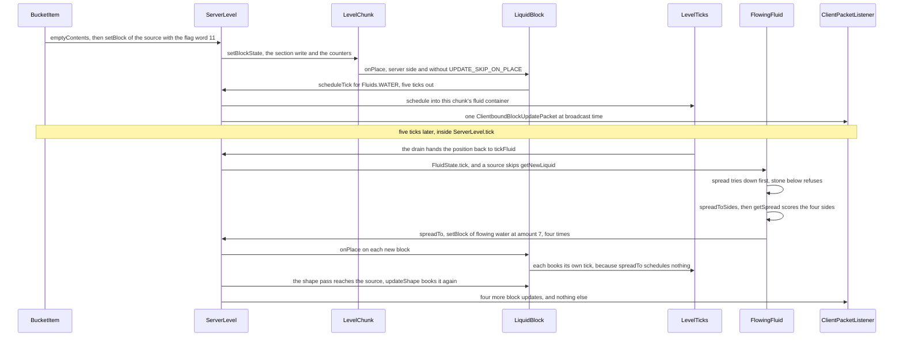
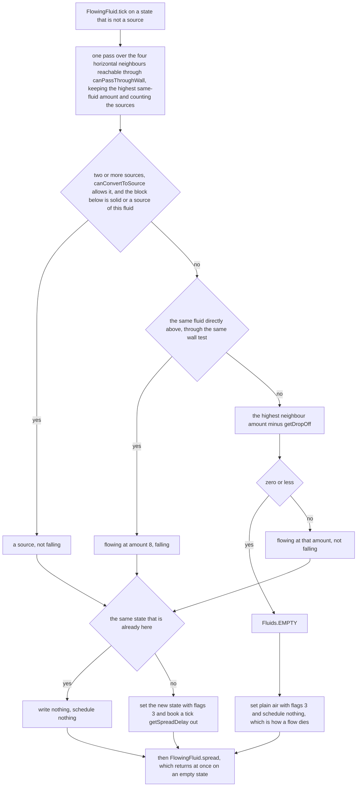

# Fluids

> Verified against **Minecraft 26.2** · Part IV · A bucket of water is emptied on flat stone and spreads one step.

A player holding a water bucket clicks the top of a stone block. Their own
client places the source at once, on a prediction, and it will sit there doing
nothing for the rest of the session. The server places the same block and then
also does nothing — for five ticks. When the appointment falls due, the source
looks down, finds stone, and hands the decision to four independent searches,
one per horizontal direction, each walking out through the surrounding blocks
looking for somewhere the water could fall. On flat stone all four fail in
exactly the same way, so all four tie and the water goes out evenly. Break the
symmetry and it does not, because **water turns toward a hole four steps past
the block it is about to fill, every side running its own depth-first search —
and a side the water is not allowed to replace still votes on where the rest of it
goes.**

This page is the fluid model: the two registry objects behind each fluid, the
block that carries them, what one fluid tick decides and where it sends the
result. The queue that appointment sits in — booked, deduped, drained, saved and
reloaded — is [scheduled ticks](scheduled-ticks.md), which this page borrows
whole and never explains.

## The cast

| class | what it decides | thread |
|---|---|---|
| `Fluid` | the registry object: its `Fluid.stateDefinition`, and every per-fluid number as an overridable method | built at bootstrap, read anywhere |
| `FluidState` | one interned combination of `FlowingFluid.FALLING` and `FlowingFluid.LEVEL` — what a block reports and what a tick names | immutable |
| `FlowingFluid` | the whole algorithm: what a position should hold, whether to go down or sideways, and which sides win | Server |
| `WaterFluid` | water's numbers, and whether two sources may make a third | Server |
| `LavaFluid` | lava's numbers, and the one override that turns liquid into rock | Server |
| `LiquidBlock` | the block form of a fluid, and where a fluid tick is booked from when the fluid is the block | Server |
| `SimpleWaterloggedBlock` | that a stair can be full of water without being a water block | Server |
| `BucketItem` | where a source comes from, and the one attribute that stops it arriving | Server, with a client prediction |

## Two registry objects, one substance

`Fluid` is to `FluidState` what `Block` is to `BlockState`, and it is literally
the same machinery: `StateHolder`, a `StateDefinition` built in the constructor,
and one interned instance per combination of properties, so two `FluidState`s
can be compared by identity. `FlowingFluid` puts `FlowingFluid.FALLING` on every
state it defines, and the flowing subclasses — `WaterFluid.Flowing`,
`LavaFluid.Flowing` — add `FlowingFluid.LEVEL`
(`BlockStateProperties.LEVEL_FLOWING`, 1 to 8) on top of it. The static
initialiser in `Fluids` then walks `BuiltInRegistries.FLUID` and pours every
state of every fluid into `Fluid.FLUID_STATE_REGISTRY`, the one global id table.

**Thirty-seven** — every fluid state in the game: one for `Fluids.EMPTY`, and
eighteen each for water and lava (two from the source object, sixteen from its
flowing twin).

Each fluid being *two* registry objects is not bookkeeping. `Fluids.WATER` is a
`WaterFluid.Source` whose `WaterFluid.Source.getAmount` returns 8 and whose
`WaterFluid.Source.isSource` returns true without consulting any property;
`Fluids.FLOWING_WATER` is a `WaterFluid.Flowing` whose
`WaterFluid.Flowing.getAmount` reads `FlowingFluid.LEVEL` and whose
`WaterFluid.Flowing.isSource` returns false without consulting anything either. `WaterFluid.isSame` answers true for either, which is how
the algorithm treats water as one substance no matter which object it is
holding. The scheduler does not: a scheduled tick is keyed on the fluid object,
so `Fluids.WATER` and `Fluids.FLOWING_WATER` are two different appointments and
one of each can be pending at a single position ([scheduled
ticks](scheduled-ticks.md)).

The amount is also the height. `FluidState.getOwnHeight` delegates to
`FlowingFluid.getOwnHeight`, which divides the amount by *nine* — so a full
source stands 8/9 of a block tall, and `FlowingFluid.getHeight` has to
special-case a same-fluid block overhead and return a flat 1 so that a submerged
column is not full of seams.

## The block underneath the water

Nothing in the world stores a `FluidState`. A chunk section stores `BlockState`s
([chunk anatomy](chunk-anatomy.md)), and
`BlockBehaviour.BlockStateBase.getFluidState` returns a field —
`BlockBehaviour.BlockStateBase.fluidState`, filled once by
`BlockBehaviour.BlockStateBase.initCache` at bootstrap by asking the block.
Reading the fluid at a position is a block lookup and a field read, which is why
the flow algorithm can afford to ask hundreds of times a tick.

For water and lava the block is `LiquidBlock`, whose single property is
`LiquidBlock.LEVEL` (`BlockStateProperties.LEVEL`, 0 to 15). Its constructor
builds `LiquidBlock.stateCache`, nine `FluidState`s: index 0 is the source, 1
through 7 are flowing at amount 8 minus the index, and index 8 is flowing at
amount 8 with `FlowingFluid.FALLING` set. `LiquidBlock.getFluidState` clamps the
level to 8, so block levels 8 through 15 all read back as *falling and full*,
and `FlowingFluid.getLegacyLevel`, the encoder going the other way, is
correspondingly lossy for falling flows — which costs nothing, because
`FlowingFluid.getNewLiquid` only ever produces a falling state at amount 8.

Waterlogging runs the other way round: a block that implements
`SimpleWaterloggedBlock` reports water of its own accord.
`SimpleWaterloggedBlock.canPlaceLiquid` accepts `Fluids.WATER` and nothing else,
and `SimpleWaterloggedBlock.placeLiquid` sets `BlockStateProperties.WATERLOGGED`
and books the water tick itself rather than leaving it to `LiquidBlock.onPlace`.
The state it reports is a *source*, which is why a waterlogged stair is never
drained by a fluid tick: the first half of `FlowingFluid.tick` is skipped
entirely for a source. Exactly one block in the game reports a source that is
also falling — `WaterloggedTransparentBlock`, the copper grate — and
`FlowingFluid.FALLING` is the flag that lets `FlowingFluid.getFlow` add a
downward component to the current it pushes entities with.

## A bucket, five ticks, four neighbours

`BucketItem.use` picks the position, then `BucketItem.emptyContents` asks two
questions before it places anything. Is the block there a `LiquidBlockContainer`
that will take water — that is the waterlogging path — and does
`EnvironmentAttributes.WATER_EVAPORATES` hold at this position, read through
`EnvironmentAttributeReader.getValue`? The Nether's dimension type sets that
attribute, so there the bucket plays a hiss, throws eight smoke particles and
returns success having placed nothing: this page's whole trace never happens in
the Nether ([environment attributes](environment-attributes-and-timelines.md)).
The first question only decides whether the position is a legal target; the
evaporation branch returns before the waterlogging is actually done, so a
bucket on a Nether stair hisses too.
On overworld stone it destroys and drops whatever was there and calls
`Level.setBlock` with the source's `FluidState.createLegacyBlock` and the flag
word 11 — `Block.UPDATE_NEIGHBORS`, `Block.UPDATE_CLIENTS`,
`Block.UPDATE_IMMEDIATE` ([blocks and states](../blocks/blocks-and-states.md),
[items and stacks](../items/items-and-stacks.md)).

The appointment is the *block's* doing, not the fluid's.
`LevelChunk.setBlockState` writes the section and then, server-side and unless
`Block.UPDATE_SKIP_ON_PLACE` is set, calls `LiquidBlock.onPlace`, which asks
`LiquidBlock.shouldSpreadLiquid` (always true for water) and schedules a tick
for `Fluids.WATER` at `WaterFluid.getTickDelay`, five ticks out. `LiquidBlock.neighborChanged` and
`LiquidBlock.updateShape` book the same appointment when something next door
moves, and so does `SimpleWaterloggedBlock.placeLiquid` — but the habit is not
`LiquidBlock`'s alone. Sixty-one call sites across fifty-two classes schedule a
fluid tick, because every waterloggable block books water's tick from its own
override of `BlockBehaviour.updateShape`, `WaterloggedTransparentBlock`
included. Nothing in `FlowingFluid`
books its own future except the single line in `FlowingFluid.tick` that follows
a state change.

The client is told none of this, because there is nothing to tell. The placing
player's client ran `BucketItem.use` itself inside
`MultiPlayerGameMode.startPrediction`, so the source appears locally with no
round trip, and the blocks the water later touches arrive the way any
run of block changes does: one `ClientboundBlockUpdatePacket` when a section
changed exactly one block that tick, and a single
`ClientboundSectionBlocksUpdatePacket` for the rest — which, for a spreading
flow, is the ordinary case. `LevelChunk.setBlockState` skips
`LiquidBlock.onPlace` off the server, and `ClientLevel.getFluidTicks` hands out
a `BlackholeTickAccess` that accepts every appointment and keeps none. No client ever runs the
spread. What it does run is `FluidState.animateTick` from
`ClientLevel.doAnimateTick` — ambient sound and particles, with
`Fluid.getDripParticle` fetched separately just after — and
`FluidState.getFlow`, which both the fluid mesher and shared entity physics
need to know which way the surface leans. Flowing water on a client is a stream
of block updates and a direction.

Five ticks on, `LevelTicks` drains the fluid queue and hands the position back
through `ServerLevel.tickFluid`, which re-reads the block and fires
`FluidState.tick` only if the fluid still there is the one the tick named. It
is, and because it is a source, `FlowingFluid.tick` goes straight to
`FlowingFluid.spread`.

## What one fluid tick decides

For anything that is *not* a source, the first half of `FlowingFluid.tick`
answers a question with nothing to do with spreading: what should this position
hold, given its surroundings? `FlowingFluid.getNewLiquid` answers it, and the
order of its three branches is most of a fluid's character.

The scan that feeds the branches counts a neighbour only if
`FlowingFluid.canPassThroughWall` says the face between the two positions is
open, so a pane of glass between two source blocks is enough to stop them making
a third.

The first branch is source conversion, and it is where infinite water lives: two
source neighbours, a yes from `WaterFluid.canConvertToSource` — which reads
`GameRules.WATER_SOURCE_CONVERSION`, true by default ([game
rules](../../reference/gamerules.md)) — and something solid
(`BlockBehaviour.BlockStateBase.isSolid`) or another source of the same fluid
*directly below the position being filled*. `LavaFluid.canConvertToSource` reads
`GameRules.LAVA_SOURCE_CONVERSION`, false by default, so infinite lava is one
rule away rather than a property of lava. The second branch is the same fluid
overhead, which always produces a falling state at full amount, however little
is actually falling past. The fallback is the highest same-fluid neighbour minus
`FlowingFluid.getDropOff` — one for water, two for lava outside the Nether — and
zero or less is empty.

Two outcomes at the bottom of the figure matter more than the branches above
them. **Empty means the block becomes plain air and nothing is rescheduled**: a
fluid tick that decides a position should be dry books no follow-up, and the
appointment book simply forgets it. And when the answer equals the state already
there — the ordinary case for a settled flow — neither the write nor the booking
happens, so a stable pool that is ticked one last time falls silently off the
books.

## Down first, then sideways

`FlowingFluid.spread` tries below before anything else. If the block there can
hold the fluid, its existing `FluidState.canBeReplacedWith` allows the swap and
the floor between them is open, the fluid falls: `FlowingFluid.spreadTo` fills
the position below and `FlowingFluid.spread` returns — *unless*
`FlowingFluid.sourceNeighborCount` finds three or more source neighbours around
the position that is pouring, in which case it spreads sideways as well. That is
the lip of a large pool draining into a hole: it pours down and keeps flooding
outward in the same tick.

Under our bucket the block below is stone, so nothing passes. Because the state
is a source, `FlowingFluid.spreadToSides` runs anyway (the other way in is a
position whose floor is not a `FlowingFluid.isWaterHole`). Its first act is a
gate, not a value: the amount minus the drop-off, or a flat 7 for a falling
state, and if that is zero or less nothing spreads at all. What each side
actually *receives* is whatever `FlowingFluid.getNewLiquid` computes for that
side from scratch.

### Four searches, and the losers still vote

`FlowingFluid.getSpread` returns a map from direction to the state that
direction would get, and building it is the most expensive thing a fluid does. A
direction is a candidate if `FlowingFluid.canMaybePassThrough` — not already a
source of this fluid, a block that can hold fluid at all, and not walled off —
and if the state it would receive can be held there. Each candidate is then
scored by its distance to the nearest *hole*, where a hole is
`FlowingFluid.isWaterHole`: a position whose floor will let the fluid through
and whose lower neighbour will take it.

A candidate that is itself a hole scores 0 with no search at all. Otherwise
`FlowingFluid.getSlopeDistance` searches outward from it: a depth-first walk
that tries the three horizontal directions other than the one it arrived from,
returns the pass number the moment it finds a hole, and recurses only while the
pass is still below `WaterFluid.getSlopeFindDistance` — 4 for water, 2 for lava,
4 for lava in the Nether. A search that finds nothing returns 1000. So a side's
score is 0 to 4, or 1000 for *nowhere to fall from here*, and a score of 4 means
the hole is four steps past the block the water is about to fill. Three
branches, four deep, is up to a hundred and twenty positions per side;
`FlowingFluid.SpreadContext`, built once per `FlowingFluid.getSpread` call, caches block
states and hole answers in two maps keyed by the candidate's x and z offset from
the origin packed into a short, so the overlap between the four searches is paid
for once.

The winners are the sides holding the minimum score. A better score clears
everything collected so far and a tie is kept, which is why on flat stone all
four directions score 1000, all four survive, and the water goes out evenly. And
here is the part nobody expects: **the running minimum is updated by every
scored candidate, but only a candidate whose existing fluid passes
`FluidState.canBeReplacedWith` is put in the map.**
`WaterFluid.canBeReplacedWith` allows replacement only from directly above and
only by something that is not water, so a neighbour that is *already* water
refuses every sideways spread — and still clears the map, and still lowers the
minimum. One unreplaceable near neighbour can therefore suppress every other
direction. It is also why a pool that has finished spreading is quiet: the
source's four neighbours all refuse, the map comes back empty, and
`FlowingFluid.spreadToSides` places nothing.

`FlowingFluid.spreadTo` does the placing and is deliberately dumb. A
`LiquidBlockContainer` gets `LiquidBlockContainer.placeLiquid`; anything else
that is not air — air, the usual target, is skipped — has
`FlowingFluid.beforeDestroyingBlock` run over it —
`WaterFluid.beforeDestroyingBlock` drops the block's items through
`Block.dropResources`, `LavaFluid` plays a fizz — and then
`LevelWriter.setBlock` with flags 3. It schedules nothing at all. Every new
flowing block books its own tick from its own `LiquidBlock.onPlace`, and the
shape-update pass at the tail of `Level.setBlock` reaches back to the source,
whose `LiquidBlock.updateShape` books the source again.

## How a flow stops

Two ways, and only one of them is dramatic. The quiet one is the gate. Water
leaves a source at amount 7 and loses one per block, so the seventh block out
holds amount 1, its `FlowingFluid.spreadToSides` gate computes zero, and the front simply
stops. Behind it every block's tick keeps getting the same answer from
`FlowingFluid.getNewLiquid`, writes nothing and books nothing, and the pool
falls off the books until a `LiquidBlock.neighborChanged` or a
`LiquidBlock.updateShape` wakes it.

The loud one is what happens when the source is taken back.
`LiquidBlock.pickupBlock` swaps it for air — level 0 only, which is why you
cannot fill a bucket from flowing water — the flag word runs
`Level.updateNeighborsAt`, each neighbouring `LiquidBlock.neighborChanged` books
a fluid tick, and five ticks later those blocks compute
`FlowingFluid.getNewLiquid` with no source in reach. Only the outermost block
of the flow comes back empty and turns to air; every ring behind it comes back
one level *lower* than the ring beyond, writes that, and books itself again. So
the pool re-levels repeatedly on its way out, one ring per tick delay, and each
ring's last act is to schedule nothing.

## Lava is water with worse numbers, and three exceptions

| | water | lava | lava under `EnvironmentAttributes.FAST_LAVA` |
|---|---|---|---|
| `Fluid.getTickDelay` | 5 | 30 | 10 |
| `FlowingFluid.getDropOff` | 1 | 2 | 1 |
| `FlowingFluid.getSlopeFindDistance` | 4 | 2 | 4 |
| how far a flow reaches | 7 blocks | 3 blocks | 7 blocks |
| source conversion | `GameRules.WATER_SOURCE_CONVERSION`, true | `GameRules.LAVA_SOURCE_CONVERSION`, false | unchanged |
| `Fluid.isRandomlyTicking` | no | yes | yes |

`LavaFluid.isFastLava` reads `EnvironmentAttributes.FAST_LAVA` through
`EnvironmentAttributeReader.getDimensionValue`. The attribute is declared
`EnvironmentAttribute.Builder.notPositional`, so it is a property of the whole
dimension rather than of a place in it, and the Nether's dimension type sets it
— along with `EnvironmentAttributes.WATER_EVAPORATES`. Nether lava is not
special-cased anywhere in `LavaFluid`; it is the same three methods reading one
boolean.

On top of the numbers, `LavaFluid.getSpreadDelay` multiplies the delay by four,
three times in four, whenever a non-falling flow is about to get deeper. Lava
does not creep — it creeps unevenly, and the unevenness is rolled fresh on each
tick.

The three exceptions are where lava stops behaving like a fluid.
`LavaFluid.spreadTo` intercepts a downward spread onto water: the fizz plays
and nothing spreads, whatever the water is in, and the target becomes
`Blocks.STONE` when — and only when — it was a `LiquidBlock`. So a lavafall into
a pool builds a plug rather than replacing the water, while a lavafall onto a
waterlogged stair is merely stopped. The other two are in `LiquidBlock.shouldSpreadLiquid`, called from
`LiquidBlock.onPlace` and `LiquidBlock.neighborChanged`: for lava it walks
`LiquidBlock.POSSIBLE_FLOW_DIRECTIONS` and tests each direction's *opposite*, so
the faces it inspects are the top and the four sides and never the bottom. Water
at any of them turns *this* block into `Blocks.OBSIDIAN` if its own fluid is a
source and `Blocks.COBBLESTONE` if it is not, and returns false so no tick is
booked at all. The `Blocks.BASALT` case is the exception to the exception and
the only place the block below is read: `Blocks.SOUL_SOIL` underneath and
`Blocks.BLUE_ICE` at one of those five opposites.

Lava's *random* tick is fire rather than flow, and a selected position gets it
twice — once as a block and once as a fluid — for reasons that belong to
[scheduled ticks](scheduled-ticks.md).

## Questions players ask

**Why does a water block have a block tick at all?** `LiquidBlock.tick` spreads
nothing. It calls `BubbleColumnBlock.updateColumn`, and only when the fluid
there is a full source in `FluidTags.BUBBLE_COLUMN_CAN_OCCUPY`; the tick was
booked twenty ticks out by `LiquidBlock.tryScheduleBubbleBlockColumn` because
soul sand or magma is underneath. Flow is entirely a *fluid* tick, in the other
queue with its own budget.

**Why is my infinite pool not infinite?** Because
`GameRules.WATER_SOURCE_CONVERSION` can be turned off, and because the first
branch of `FlowingFluid.getNewLiquid` also demands something solid or another
source directly below the position being filled. Two sources over a hole make
nothing.

**Why does water refuse to run the way that looks downhill?** Because a water
block already sitting on one side scores in the slope vote and then refuses to
be replaced, so it can drag the minimum down to its own distance and empty the
winners' map on the way past.

**Why is the wall test worth caching?** Because it runs constantly.
`FlowingFluid.canPassThroughWall` short-circuits the easy cases — either side a
full cube is a no, both sides empty is a yes — and otherwise merges the two
collision shapes with `Shapes.mergedFaceOccludes` and memoises the answer in
`FlowingFluid.OCCLUSION_CACHE`, a thread-local 200-entry map keyed by
`FlowingFluid.BlockStatePairKey`, which hashes both states by identity and is
skipped entirely when either block has a dynamic shape
(`Block.hasDynamicShape`).

## Where to look

`BucketItem.emptyContents` · `LiquidBlock.onPlace` ·
`LiquidBlock.shouldSpreadLiquid` · `ServerLevel.tickFluid` · `FlowingFluid.tick`
· `FlowingFluid.getNewLiquid` · `FlowingFluid.spread` ·
`FlowingFluid.spreadToSides` · `FlowingFluid.getSpread` ·
`FlowingFluid.getSlopeDistance` · `FlowingFluid.SpreadContext` ·
`FlowingFluid.spreadTo` · `FlowingFluid.canPassThroughWall` ·
`LiquidBlock.stateCache` · `SimpleWaterloggedBlock.placeLiquid` · `WaterFluid` ·
`LavaFluid.spreadTo`

---

*Rules: names, never code · how the system works, not how the code reads ·
newest version only · every backticked name passes `tools/verify_names.py`.*
