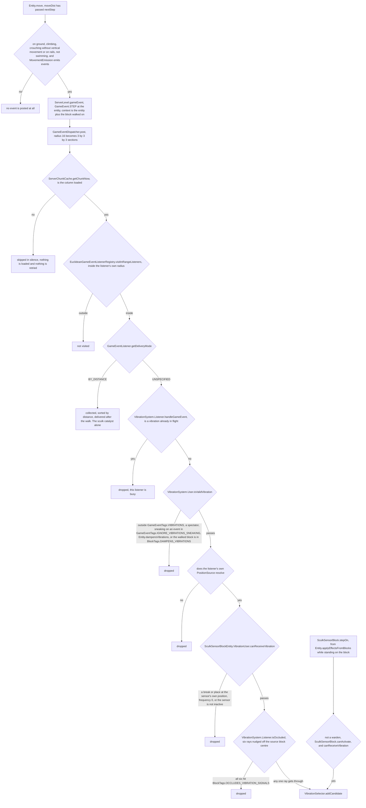
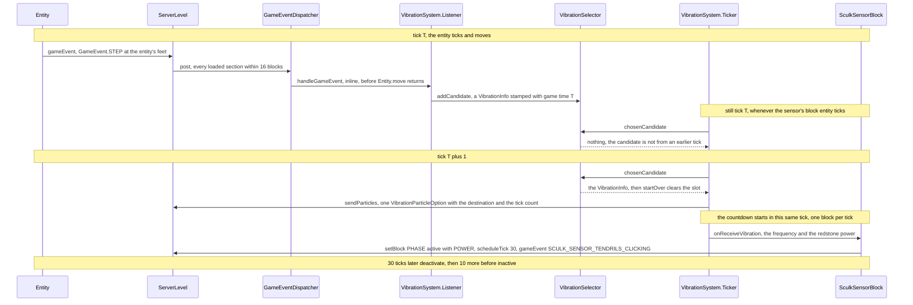

# Game events and vibrations

> Verified against **Minecraft 26.2** · Part IV · A footstep reaches a sculk sensor.

You walk across a stone floor and, eight blocks away, a sculk sensor's
tendrils flick up and it pushes redstone power out of its side. Nothing
scanned for you: the step itself posted a `GameEvent.STEP` into
`GameEventDispatcher.post`, which walked the loaded chunk sections around
you and called every listener inside its own radius *inline*, before
`Entity.move` had finished. What a player believes about sculk lives in the
gates that footstep then has to pass, and their shape is the surprise.
**The sensor always hears you at least one tick late by design,
because `VibrationSelector.chosenCandidate` hands over a candidate only if
it was recorded on an *earlier* tick. The wool box works only if all six
rays of `VibrationSystem.Listener.isOccluded` hit wool, not just the one on
the straight line. And standing on the sensor skips the whole cascade —
`SculkSensorBlock.stepOn` calls `VibrationSystem.Listener.forceScheduleVibration`
with no dispatcher, no occlusion test and no
`VibrationSystem.User.isValidVibration`, so sneaking does not save you.**
Only a warden gets out of that one.

## The cast

| class | what it decides | thread |
|---|---|---|
| `GameEvent` | how far the news travels — one field, `GameEvent.notificationRadius` | — (a record) |
| `GameEventDispatcher` | which sections are walked, and who is told inline rather than sorted | Server |
| `EuclideanGameEventListenerRegistry` | which listeners in one section Y are close enough to be visited | Server |
| `DynamicGameEventListener` | which section a *moving* listener is registered in | Server |
| `VibrationSystem.Listener` | the gates between an event and a candidate | Server |
| `VibrationSelector` | which of a tick's candidates survives, and that none is used before the next tick | Server |
| `VibrationSystem.Ticker` | the travel countdown, the particle, and the moment of arrival | Server, from the host's own tick |
| `SculkSensorBlockEntity.VibrationUser` | whether this sensor takes a vibration, and what it does with one | Server |

## A game event is one number

`GameEvent` is a record of a single field, `GameEvent.notificationRadius`.
That is the whole type. Sixty-one constants live in
`BuiltInRegistries.GAME_EVENT`, fifteen of them `GameEvent.RESONATE_1`
through `GameEvent.RESONATE_15`, one per vibration frequency, so a
resonating block can re-emit the frequency it heard. All but three take
`GameEvent.DEFAULT_NOTIFICATION_RADIUS`, 16 blocks: `GameEvent.JUKEBOX_PLAY`
and `GameEvent.JUKEBOX_STOP_PLAY` are 10, `GameEvent.SHRIEK` is 32. The
radius is the *dispatcher's* number, and each listener then applies its
own. Everything else rides beside the event in a `GameEvent.Context` — the
source entity and the affected block state, either of which may be absent.

The registry is a `DefaultedMappedRegistry` on *step*, which is narrower
than it sounds. `DefaultedMappedRegistry.getValue` and
`DefaultedMappedRegistry.byId` substitute `GameEvent.STEP` for an unknown
key, so a raw lookup that misses becomes a footstep — but `GameEvent.CODEC`
is a `RegistryFixedCodec`, which errors on an unknown name. Bad data in a
pack fails loudly; only the raw lookup silently becomes a step.

## Listeners live in the chunk, one registry per section

A `GameEventListener` is three methods: a `PositionSource`
(`BlockPositionSource` for a block, `EntityPositionSource` for a mob, the
latter resolving a stored UUID against the level the first time it is
asked), a `GameEventListener.getListenerRadius` and
`GameEventListener.handleGameEvent`. They are stored per chunk section in
`LevelChunk.gameEventListenerRegistrySections`
([chunk anatomy](chunk-anatomy.md)), and `LevelChunk.getListenerRegistry`
creates an `EuclideanGameEventListenerRegistry` for a section Y the first
time anyone asks — including the dispatcher, merely walking past. One is
dropped again through `LevelChunk.removeGameEventListenerRegistry`, but
only when an `EuclideanGameEventListenerRegistry.unregister` empties it.
`ChunkAccess.getListenerRegistry` answers
`GameEventListenerRegistry.NOOP`: proto chunks and the client have none.

Block entities join on the chunk's terms: `LevelChunk.addGameEventListener`
runs from `LevelChunk.addAndRegisterBlockEntity` on placement and from
`LevelChunk.registerAllBlockEntitiesAfterLevelLoad` when the chunk comes
back, asking `EntityBlock.getListener` — whose default returns the listener
of any block entity implementing `GameEventListener.Provider` ([block
entities](../blocks/block-entities.md)). A sensor's section is fixed for
the life of the block. Entities move, so they carry a
`DynamicGameEventListener` instead: a listener plus the last `SectionPos`
it was filed under. `Entity.updateDynamicGameEventListener` is empty on
`Entity` and overridden by `Warden` and by `Allay`, which hands over two.
`ServerLevel.EntityCallbacks` drives it — `DynamicGameEventListener.add`,
`DynamicGameEventListener.remove`, and `DynamicGameEventListener.move` on
every section change, which does nothing at all if either chunk is not
loaded to `ChunkStatus.FULL`.

## The dispatcher never queues

`ServerLevel.gameEvent` is one line into `GameEventDispatcher.post`, and
`ServerLevel.gameEventDispatcher` owns nothing between calls. `GameEventDispatcher.post` turns
the radius into a range of sections — 3 by 3 by 3 for the default 16, 5 by
5 by 5 for a shriek — fetches each chunk column once with
`ServerChunkCache.getChunkNow`, and visits each section's registry.
`EuclideanGameEventListenerRegistry.visitInRangeListeners` resolves each
listener's position, compares block-position distance *squared* against the
listener's own radius squared — a sphere inside the dispatcher's cube — and
calls `GameEventListener.handleGameEvent` there and then. No queue, no
ordering, no next-tick delivery: the broadcast is a nested loop inside
`Entity.move`, and the emitter's method has not returned yet.

Two things follow. `ServerChunkCache.getChunkNow` returns null for a column
that is not already loaded and `GameEventDispatcher.post` skips it, so an
event at the edge of the loaded world is never delivered over the border.
And because a listener can be told mid-walk, a registry sets
`EuclideanGameEventListenerRegistry.processing` while it iterates and
defers every `EuclideanGameEventListenerRegistry.register` and
`EuclideanGameEventListenerRegistry.unregister` to the end of the visit.

One listener does wait. `GameEventListener.getDeliveryMode` is
`GameEventListener.DeliveryMode.UNSPECIFIED` everywhere except
`SculkCatalystBlockEntity.CatalystListener`, which answers
`GameEventListener.DeliveryMode.BY_DISTANCE`. Those are collected as
`GameEvent.ListenerInfo`s, sorted by squared distance and delivered by
`GameEventDispatcher.handleGameEventMessagesInQueue` after the walk,
because a catalyst *consumes* the dead mob's experience
(`LivingEntity.skipDropExperience`) and `LivingEntity.wasExperienceConsumed`
means only the first told gets any. Sorting is how the nearest one wins.

## The gates between a footstep and a candidate

The order is not the one a player would guess. The busy check comes first,
so a sensor already carrying a vibration ignores everything without
evaluating a single tag, and the occlusion raycast — much the most
expensive gate — comes last, after every cheap refusal has had its chance.
Before any of it, `Entity.vibrationAndSoundEffectsFromBlock` decides
whether the event exists at all, which is why walking emits a footstep per
stride rather than per tick. Two gates ask the *user* rather than the
system: `VibrationSystem.User.getListenableEvents` supplies the tag
`VibrationSystem.User.isValidVibration` tests first, and
`SculkSensorBlockEntity.VibrationUser.canReceiveVibration` refuses
`GameEvent.BLOCK_DESTROY` and `GameEvent.BLOCK_PLACE` at the sensor's *own*
position — which is why placing a sensor does not set it off — refuses a
frequency of `VibrationSystem.NO_VIBRATION_FREQUENCY`, and otherwise defers
to `SculkSensorBlock.canActivate`: inactive only.

The occlusion test is worth reading slowly.
`VibrationSystem.Listener.isOccluded` takes the source block's centre,
nudges it a hundred-thousandth of a block along each of the six `Direction`
values in turn, and runs `BlockGetter.isBlockInLine` with a
`ClipBlockStateContext` looking for `BlockTags.OCCLUDES_VIBRATION_SIGNALS`.
It reports *occluded* only if all six rays are stopped, and returns the
moment one is not — so a single block of wool on the straight line is
almost never enough, and a wool box is a box because a box is what makes
all six fail.

## The trace: one footstep, several ticks

`VibrationSystem.Ticker.tick` is the whole of the wait, and runs from
whoever hosts the listener: `SculkSensorBlock.getTicker` and
`SculkShriekerBlock.getTicker` for the blocks — server-side only, and
already gated by `Level.shouldTickBlocksAt` on their own chunk — and
`Warden.tick` and `Allay.tick` for the mobs. One call does three things in
order: select, if nothing is in flight; send or re-send the particle; then
decrement the travel time and arrive if it has reached zero.

That particle is the only thing the client is told.
`VibrationParticleOption` carries the destination `PositionSource` and the
remaining tick count, and the client animates the flight from that alone:
`ClientLevel.gameEvent` is an empty method and there is no vibration
packet. When the block entity was loaded from disk,
`VibrationSystem.Data.shouldReloadVibrationParticle` is set and the ticker
re-sends the particle from a point interpolated along the path covered.

## One tick, structurally

`VibrationSelector` holds at most one candidate, stamped with the game time
it arrived. `VibrationSelector.addCandidate` takes an empty slot
unconditionally; against a candidate from the *same* tick it takes the
closer one, breaking a distance tie in favour of the higher frequency; and
against one held over from an *earlier* tick it does nothing at all,
because that one is already waiting to be consumed. That is the whole of
"the nearest event wins" — per listener, per tick, one slot.

The latency falls out of the read side. `VibrationSelector.chosenCandidate`
returns the candidate only if its stamp is strictly *less* than the current
game time, so one added during tick T is invisible for the rest of tick T
however the ordering falls, and the earliest it can be selected is the tick
after. Travel is measured from there:
`VibrationSystem.User.calculateTravelTimeInTicks` is the floor of the
distance — one block per tick — and the countdown's first decrement happens
inside the same call that selected the vibration, so a source *n* whole
blocks away arrives *n* minus 1 ticks after selection, and anything closer
than two blocks arrives on the selecting tick itself.

Arrival can be refused. `VibrationSystem.User.requiresAdjacentChunksToBeTicking`
is true for both sculk blocks, and `VibrationSystem.Ticker` will not deliver
unless all nine columns of the 3 by 3 around the listener are loaded and
pass `Level.shouldTickBlocksAt` — [tickets and
loading](tickets-and-loading.md) is what "ticking" means. It does not drop
the vibration: the travel time is floored at zero, so the ticker asks again
every tick until the neighbourhood ticks. And the whole of
`VibrationSystem.Data` is written to disk under *listener* through
`VibrationSystem.Data.CODEC`, so a vibration survives a reload with its
countdown intact.

## What arrival costs the block

`VibrationSystem.VIBRATION_FREQUENCY_FOR_EVENT` maps game events to
frequencies 1 to 15 and returns 0 for anything unmapped: a step, a swim and
a flap are 1, a death or an explosion 15. That number is kept by
`SculkSensorBlockEntity.setLastVibrationFrequency` and is what a comparator
reads out of an *active* sensor — `SculkSensorBlock.getAnalogOutputSignal`
answers 0 in any other phase. The redstone power is a different number:
`VibrationSystem.getRedstoneStrengthForDistance` is the larger of 1 and 15
minus the floor of 15 times the distance over the listener's radius, using
a distance recomputed from the two *block* positions at arrival, not the
float stored when the candidate was made.

`SculkSensorBlock.activate` sets `SculkSensorBlock.PHASE` to
`SculkSensorPhase.ACTIVE` with that power, schedules a block tick
`SculkSensorBlock.ACTIVE_TICKS` (30) out, runs
`SculkSensorBlock.tryResonateVibration` — which, for each of the six
neighbours in `BlockTags.VIBRATION_RESONATORS`, posts the matching
`GameEvent.RESONATE_1` … `GameEvent.RESONATE_15` at the *neighbour's*
position, so an amethyst block beside a sensor rebroadcasts the frequency
it heard — and then emits `GameEvent.SCULK_SENSOR_TENDRILS_CLICKING`, the
single entry in `GameEventTags.SHRIEKER_CAN_LISTEN`. Shriekers do not hear
you. They hear sensors hearing you.

Coming down takes two scheduled ticks. At 30, `SculkSensorBlock.tick` calls
`SculkSensorBlock.deactivate`, which drops the power to zero, moves the
phase to `SculkSensorPhase.COOLDOWN` and schedules another tick
`SculkSensorBlock.COOLDOWN_TICKS` (10) out; only *that* tick returns the
block to `SculkSensorPhase.INACTIVE`. In between the sensor is dark and
still refuses every vibration, because `SculkSensorBlock.canActivate` tests
for inactive.

## The other listeners

| listener | radius | what it listens to | what a vibration does |
|---|---:|---|---|
| `SculkSensorBlockEntity` | 8 | `GameEventTags.VIBRATIONS` | activates for 30 ticks, power by distance, frequency on the comparator |
| `CalibratedSculkSensorBlockEntity` | 16 | `GameEventTags.VIBRATIONS` | the same, but when the block behind `CalibratedSculkSensorBlock.FACING` gives a redstone signal, only that exact frequency is accepted |
| `SculkShriekerBlockEntity` | 8 | `GameEventTags.SHRIEKER_CAN_LISTEN` | needs a player behind the event, then `SculkShriekerBlockEntity.tryShriek` — warning level, darkness, and a warden at level 4 |
| `Warden` | 16 | `GameEventTags.WARDEN_CAN_LISTEN` | anger through `Warden.increaseAngerAt`, a 40-tick `MemoryModuleType.VIBRATION_COOLDOWN`, and a disturbance location for `WardenAi` |
| `Allay` | 16 | `GameEventTags.ALLAY_CAN_LISTEN`, note blocks only | `AllayAi.hearNoteblock` stores `MemoryModuleType.LIKED_NOTEBLOCK_POSITION`, after which it accepts that block and no other |
| `Allay.JukeboxListener` | 10 | not a vibration at all | a plain `GameEventListener` for `GameEvent.JUKEBOX_PLAY` and `GameEvent.JUKEBOX_STOP_PLAY` — it makes the allay dance |
| `SculkCatalystBlockEntity.CatalystListener` | 8 | not a vibration at all | on `GameEvent.ENTITY_DIE`, takes the mob's experience as sculk cursors and blooms |

The tags are where the personalities live, and they are data
([tags](../foundations/tags.md)): `GameEventTags.WARDEN_CAN_LISTEN` covers
shrieks and tendril clicks that `GameEventTags.VIBRATIONS` leaves out, and
leaves out the flap that sensors hear. The warden is also the one entity
whose `Entity.dampensVibrations` is true — invisible to every other
listener while being the most sensitive one on the list, and the one entity
`SculkSensorBlock.stepOn` refuses by name. Its brain and the allay's are
[Part VI](../entities/ai-goals-and-brains.md).

## Questions players ask

**Does sneaking make me silent?** It makes six events silent.
`GameEventTags.IGNORE_VIBRATIONS_SNEAKING` holds `GameEvent.STEP`,
`GameEvent.SWIM`, `GameEvent.HIT_GROUND`, `GameEvent.PROJECTILE_SHOOT`,
`GameEvent.ITEM_INTERACT_START` and `GameEvent.ITEM_INTERACT_FINISH`, and
the test is `Entity.isSteppingCarefully` — whether the sneak key is down.
Open a chest while crouched and the sensor hears it. Sneak past one as a
player and `CriteriaTriggers.AVOID_VIBRATION` notes the advancement,
because sensors and wardens answer `VibrationSystem.User.canTriggerAvoidVibration`.

**Then why does the sensor I am crouching on still fire?** That path is not
the dispatcher's. `SculkSensorBlock.stepOn` runs from
`Entity.applyEffectsFromBlocks` every tick an entity stands on the block
and calls `VibrationSystem.Listener.forceScheduleVibration` directly: no
section walk, no radius test, no occlusion, and no
`VibrationSystem.User.isValidVibration`, which is where the sneaking tag
lives. It still asks `VibrationSystem.User.canReceiveVibration`, so an
active sensor stays quiet, and it still refuses a warden. The tick of
latency remains, since the shortcut ends at `VibrationSelector.addCandidate`
like everything else.

**Why did my wool floor not stop it?** Wool underfoot and wool in the way
are different tags doing different jobs. `BlockTags.DAMPENS_VIBRATIONS` on
the block being walked on kills the event at
`VibrationSystem.User.isValidVibration`, and `ItemTags.DAMPENS_VIBRATIONS`
does the same for a dropped item through `ItemEntity.dampensVibrations`.
`BlockTags.OCCLUDES_VIBRATION_SIGNALS` is the six-ray test, and it has to
stop all six.

**Why does a sensor near the edge of the world miss?** Two reasons, both
silent: `GameEventDispatcher.post` skips any column
`ServerChunkCache.getChunkNow` does not already have, and a sensor whose
3 by 3 neighbourhood is not ticking holds a finished vibration until it is.
Both are visible on the debug channel — `DebugSubscriptions.GAME_EVENTS`
and `DebugSubscriptions.GAME_EVENT_LISTENERS`, broadcast through
`ServerLevel.debugSynchronizers`
([debugging the running game](../client/debugging-the-running-game.md)).

## Where to look

`GameEvent` · `GameEventDispatcher.post` ·
`EuclideanGameEventListenerRegistry.visitInRangeListeners` ·
`LevelChunk.getListenerRegistry` · `LevelChunk.addGameEventListener` ·
`DynamicGameEventListener.move` · `ServerLevel.EntityCallbacks` ·
`Entity.vibrationAndSoundEffectsFromBlock` ·
`VibrationSystem.Listener.handleGameEvent` ·
`VibrationSystem.User.isValidVibration` ·
`VibrationSystem.Listener.isOccluded` · `VibrationSelector.addCandidate` ·
`VibrationSelector.chosenCandidate` · `VibrationSystem.Ticker.tick` ·
`SculkSensorBlockEntity.VibrationUser` · `SculkSensorBlock.activate` ·
`SculkSensorBlock.stepOn` · `SculkShriekerBlockEntity.tryShriek` ·
`Warden.VibrationUser` · `SculkCatalystBlockEntity.CatalystListener` —
then [entity anatomy](../entities/entity-anatomy.md) for
`Entity.updateDynamicGameEventListener` and
[registries](../../reference/registries.md) for
`BuiltInRegistries.GAME_EVENT`. The other index the world keeps about
itself — where things worth walking to are, rather than what just happened
— is [points of interest](points-of-interest.md).

---

*Rules: names, never code · how the system works, not how the code reads ·
newest version only · every backticked name passes `tools/verify_names.py`.*
