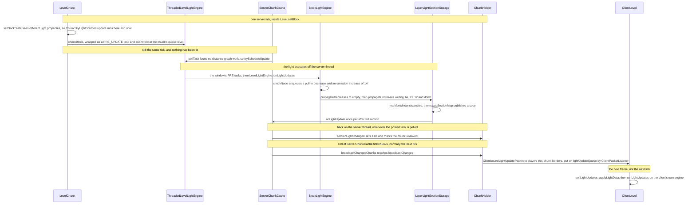
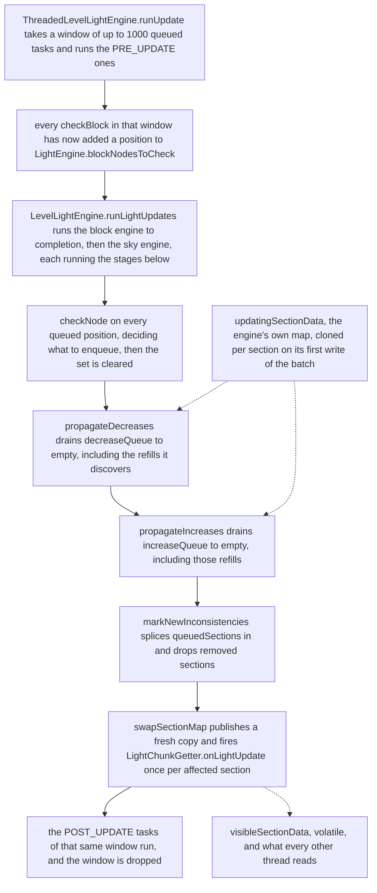

# Lighting

> Verified against **Minecraft 26.2** · Part IV · A torch is placed on a cave wall: the write queues a task, a worker floods the change, and the sections it touched are published as a copy and mailed to the client.

A player right-clicks a torch onto stone. The block goes into its
`LevelChunkSection` immediately, the heightmaps move, and then
`LevelChunk.setBlockState` does exactly one thing about light: it calls
`LevelLightEngine.checkBlock`, which on the server computes nothing at all.
It wraps the call in a runnable and puts it on a queue that nothing in the
level tick will ever drain. There is no light thread and no light phase of
the tick: the flood that turns the torch's 14 into a sphere of falling
numbers runs because **the server thread finished early and went looking for
something to do**. The kick is `ThreadedLevelLightEngine.tryScheduleUpdate`,
whose only routine caller is `ServerChunkCache.MainThreadExecutor.pollTask` —
the idle poll `MinecraftServer.pollTaskInternal` reaches only when the tick
has budget left. Ask the server engine to light something synchronously and
it refuses: `ThreadedLevelLightEngine.runLightUpdates` throws.

## The cast

| class | what it decides | thread |
|---|---|---|
| `LevelLightEngine` | the facade both sides hold — one `LightEngine` per layer, the read side, and the padding above and below the world | whoever calls it |
| `ThreadedLevelLightEngine` | the server's wrapper: every mutator becomes a queued task, and running updates on demand is an error | queued from Server, drained on the light executor |
| `BlockLightEngine` · `SkyLightEngine` | the algorithm — what a changed block means, and how far the change travels | the light executor (Client: the render thread) |
| `LayerLightSectionStorage` | the double buffer: which sections hold data, which changed, and when to publish | the same |
| `DataLayer` | 2048 bytes of nibbles for one section, or no bytes at all | whoever holds it |
| `ChunkSkyLightSources` | the chunk's 256-entry *lowest sky source Y* table — the one piece of light work that is not deferred | Server, inside the block write |
| `ServerChunkCache` | the `LightChunkGetter`: which chunks the engine may read, and where the one callback lands | callback on the light executor, body on Server |
| `ChunkHolder` | which sections each watching player is owed, as two `BitSet`s | Server |

## From a click to a lit wall

Every section below walks one stretch of that diagram. Two classes are absent
because they carry no decision: `ChunkTaskDispatcher`, which holds the queued
task under the chunk's priority and hands it to the executor, and
`ClientPacketListener`, which only wraps the packet in a closure for later.

## Two 4-bit fields, and the sections that may not exist

Light is `LightLayer.SKY` and `LightLayer.BLOCK`, computed by separate
machinery that shares only its shape. `LevelLightEngine` holds one
`LightEngine` per layer — `LevelLightEngine.skyEngine` is null in a dimension
whose `DimensionType.hasSkyLight` is false, and
`LevelLightEngine.getLayerListener` hands out
`LayerLightEventListener.DummyLightLayerEventListener` in its place. Readers
rarely see the layers apart: `LevelLightEngine.getRawBrightness` is the
maximum of block light and sky light minus a darkening term, which is what
`LevelReader.getMaxLocalRawBrightness` passes `LevelReader.getSkyDarken` into,
and `BlockAndLightGetter.canSeeSky` is just sky light at 15.

Storage is per layer and per *section*, one section taller than the world at
each end — `LevelLightEngine.LIGHT_SECTION_PADDING` is 1 and
`LevelLightEngine.getLightSectionCount` is the world's sections plus two. A
section's storage is a `DataLayer`: 16×16×16 nibbles in `DataLayer.SIZE`
bytes, indexed *y* then *z* then *x*, and allocated lazily. `DataLayer.data`
starts null and every read answers `DataLayer.defaultValue` until the first
write forces the array into existence, and `DataLayer.fill` throws it away
again. `DataLayer.isEmpty` therefore means *homogeneous zero*, not *all
zeroes I checked*, and it is the test both the chunk saver and the packet
builder use to charge nothing for a dark section.

Which sections have a `DataLayer` at all is decided by
`LayerLightSectionStorage.sectionStates`, one byte per section holding a
has-data bit and a five-bit count of how many of its 26 neighbours have data
(`LayerLightSectionStorage.SectionState`). A byte of zero means no storage,
so a section of pure air beside a built-up one is allocated and a section in
the middle of nothing is not. Above the sky column's top section there is no
storage at all, and `SkyLightSectionStorage.getLightValue` walks upward until
it finds data or runs past the top, where it answers 15.

## The write that queues nothing but a task

`LevelChunk.setBlockState` asks two questions about light. If the section
flipped between all-air and not — the torch is the first block into an empty
section, or the last one out — `LevelLightEngine.updateSectionStatus` goes in.
Then, if `LightEngine.hasDifferentLightProperties` says the old and new states
disagree on emission, on dampening, or on whether either uses a shape for
light occlusion, two things happen. The first is `ChunkSkyLightSources.update`
on the chunk's own table, and it runs **inline, on the server thread**, inside
the block write: the sky column's *lowest source Y* for that one *(x, z)* is
repaired immediately, because everything downstream reads it. The second is
`LevelLightEngine.checkBlock`, and on the server that is where the work stops.
`ProtoChunk.setBlockState` does the same pair, but only once the chunk's
status has reached `ChunkStatus.INITIALIZE_LIGHT`; before that a generator
writing blocks tells the light engine nothing.

`ThreadedLevelLightEngine` overrides every mutator the same way. The call
becomes a `Runnable` tagged `ThreadedLevelLightEngine.TaskType.PRE_UPDATE` or
`ThreadedLevelLightEngine.TaskType.POST_UPDATE` and goes through
`ChunkMap.lightTaskDispatcher`, at the chunk's own queue level for the five
mutators that belong to one chunk —
`LevelLightEngine.checkBlock`, `LightEventListener.propagateLightSources`,
`LevelLightEngine.setLightEnabled`, `ThreadedLevelLightEngine.initializeLight`
and `ThreadedLevelLightEngine.lightChunk` — and at a flat top priority for
bookkeeping such as `LevelLightEngine.updateSectionStatus` and
`LevelLightEngine.queueSectionData`. When the dispatcher releases the task it
runs on the *light* executor, not on the server thread, and all it does there
is append to `ThreadedLevelLightEngine.lightTasks` — a plain array list with
no synchronisation, safe precisely because only that executor appends to it.

## What actually kicks it

The light executor is a `ConsecutiveExecutor` named *light*, built in
`ChunkMap`'s constructor over the shared background pool. It has no thread of
its own: it takes one task from its queue, runs it on a borrowed pool thread,
and re-registers itself. Two callers ever start a batch on it.
`ServerChunkCache.MainThreadExecutor.pollTask` runs the distance-graph
updates first and calls `ThreadedLevelLightEngine.tryScheduleUpdate` only if
they had nothing to do — so light propagates in the gaps of a tick that
finished early, after the ticket system is quiescent
([tickets](tickets-and-loading.md)). The other caller is
`ChunkMap.scheduleUnload`, kicking the engine once a chunk's data has been
nulled out. `ThreadedLevelLightEngine.scheduled`, an `AtomicBoolean`, keeps
exactly one batch in flight.

If nobody kicks, the queue is still not unbounded:
`ThreadedLevelLightEngine.addTask` runs a batch inline the moment
`ThreadedLevelLightEngine.lightTasks` reaches
`ThreadedLevelLightEngine.DEFAULT_BATCH_SIZE`, a thousand — still on the light
executor, still never on the server thread.

## One batch, and what it publishes

The two maps are why nothing else in the game ever waits on the light engine.
`LayerLightSectionStorage.updatingSectionData` is the engine's scratch copy
and no other thread reads it; `LayerLightSectionStorage.visibleSectionData`
is volatile and is what every reader, saver and packet builder sees.
`LayerLightSectionStorage.setStoredLevel` clones a section's `DataLayer`
through `DataLayerStorageMap.copyDataLayer` the first time the batch touches
that section, recording it in `LayerLightSectionStorage.changedSections`, and
`LayerLightSectionStorage.swapSectionMap` copies the whole updating map into
a new visible map at the end. A reader on another thread sees the state
before the batch or the state after it, never a half-propagated flood.

Inside a layer the order is fixed. Every position from
`LightEngine.blockNodesToCheck` goes through `LightEngine.checkNode`, which only decides
what to enqueue; then `LightEngine.propagateDecreases` runs the decrease
queue to empty, then `LightEngine.propagateIncreases` runs the increase queue
to empty. Decreases always finish first because a decrease discovers brighter
neighbours and enqueues them as *increase back toward me* refills — running
increases first would spread light that is about to be removed. Both queues
hold pairs of longs whose second member is a `LightEngine.QueueEntry`: four
bits of level, six of allowed directions, and the two flags
`LightEngine.QueueEntry.FLAG_FROM_EMPTY_SHAPE` and
`LightEngine.QueueEntry.FLAG_INCREASE_FROM_EMISSION`. The torch's own entries
are `LightEngine.PULL_LIGHT_IN_ENTRY` — a level-1 decrease in all six
directions, meaning *re-pull from my neighbours* — and an emission increase of
14, `Blocks.TORCH` being a `BlockBehaviour.Properties.lightLevel` of 14.
`BlockLightEngine.propagateIncrease` then spreads level minus
`LightEngine.getOpacity`, which is
`BlockBehaviour.BlockStateBase.getLightDampening` floored at
`LightEngine.MIN_OPACITY`, stopping where a neighbour is already brighter,
where `LightEngine.shapeOccludes`, or when the next level would be 1.

The batch's only exit is `LightChunkGetter.onLightUpdate`, fired from the map
swap. The engine has no idea that `ChunkHolder` exists.

## The sky column is a table, not a flood

Sky light does not use the heightmaps, and it does not usually propagate
downward one block at a time. Each chunk owns a `ChunkSkyLightSources`
(`ChunkAccess.skyLightSources`), a bit-packed 256-entry table of *the lowest
Y at this (x, z) that still sees the sky*, filled by
`ChunkSkyLightSources.fillFrom` and repaired per block by
`ChunkSkyLightSources.update`. What ends a column is
`ChunkSkyLightSources.isEdgeOccluded`: the lower block dampens light at all,
or the two faces occlude each other.

`SkyLightEngine.checkNode` reads that table and takes one of three paths. A
block at or above the column's lowest source enqueues a remove-source
decrease and an add-source increase — the expensive case. A block below it
that held light has that light zeroed and decreased away. A block below it
that was already dark, which is what a torch under a solid ceiling is, gets a
pull-in that changes nothing: placing a torch in a cave does no sky work
worth measuring. Before any of the three, `SkyLightEngine.updateSourcesInColumn`
runs `SkyLightEngine.removeSourcesBelow` and `SkyLightEngine.addSourcesAbove`
so the stored 15s agree with the table again.

Two more pieces of the sky model exist because sections may have no storage.
`SkyLightEngine.propagateFromEmptySections` handles light crossing a section
edge sideways at the bottom row of a section: if the source column had no
data for a run of sections below it, light had been continuing downward
implicitly, so the same level is written straight down the destination column
through that run. And `SkyLightSectionStorage.createDataLayer` seeds a newly
needed section below existing data by repeating the bottom slice of the
section above it (`SkyLightSectionStorage.repeatFirstLayer`) rather than
starting dark.

## Lit before you ever see it

Generation lights a chunk in two steps, and the first usually turns light
*off*. `ChunkStatusTasks.initializeLight` builds the sky table with
`ChunkAccess.initializeLightSources`, then calls
`ThreadedLevelLightEngine.initializeLight`, whose PRE task marks every
non-air section as having data and whose POST task sets the column's enabled
flag to whatever `ChunkStatusTasks.isLighted` says — *false* for a freshly
generated chunk, whose persisted status has not reached `ChunkStatus.LIGHT`.
Enabling is the next step's doing: `ChunkStatusTasks.light` calls
`ThreadedLevelLightEngine.lightChunk`, which for an unlit chunk runs
`LevelLightEngine.propagateLightSources`, and both
`BlockLightEngine.propagateLightSources` and
`SkyLightEngine.propagateLightSources` open by enabling the column before
seeding it — the block engine from `LightChunk.findBlockLightSources`, the sky
engine from its own table and its four neighbours'. Only then does a POST
task set `ChunkAccess.setLightCorrect`. A chunk read from disk with
*isLightOn* set skips the propagation entirely, because
`ThreadedLevelLightEngine.initializeLight` already enabled its column.

Two consequences are worth naming. `ServerChunkCache.getChunkForLighting`
hands the engine chunks at `ChunkStatus.FEATURES`, one status below
`ChunkStatus.INITIALIZE_LIGHT` — the engine reads chunks the rest of the game
is not allowed to see yet. And nothing waits for light before sending a chunk:
what stops a half-lit chunk shipping is the pyramid, because
`ChunkPyramid.GENERATION_PYRAMID` gives `ChunkStatus.LIGHT` a requirement of
`ChunkStatus.INITIALIZE_LIGHT` at radius 1, so a chunk cannot climb to
`ChunkStatus.FULL` until its neighbours have their sections marked
([the generation pipeline](chunk-generation-pipeline.md)). The one real send
dependency, `ChunkMap.waitForLightBeforeSending` →
`ThreadedLevelLightEngine.waitForPendingTasks` → `ChunkHolder.addSendDependency`,
has exactly one caller: `EnderDragonFight`, grafting an exit portal's light
onto chunks the client already holds.

Unloading is the mirror: `ChunkMap.scheduleUnload` calls
`ThreadedLevelLightEngine.updateChunkStatus`, which disables the column,
drops the retain flag and nulls every section's data
([chunk storage](chunk-storage.md)). On load `SerializableChunkData.read`
calls `LevelLightEngine.retainData` once and then
`LevelLightEngine.queueSectionData` for each saved `DataLayer`.

## Off the server thread and onto the wire

`ServerChunkCache.onLightUpdate` is the whole of the hop back. It is called
on the light executor, and its body is a task posted to
`ServerChunkCache.mainThreadProcessor` — no `ChunkHolder` is touched
off-thread. When the server thread later runs that task it finds the holder
in the visible map and calls `ChunkHolder.sectionLightChanged`, which marks
the chunk unsaved (light is saved data), gives up if there is no ticking
chunk to broadcast for, and otherwise sets one bit in
`ChunkHolder.skyChangedLightSectionFilter` or
`ChunkHolder.blockChangedLightSectionFilter` and puts the holder in
`ServerChunkCache.chunkHoldersToBroadcast`.

The packet goes out at the end of `ServerChunkCache.tickChunks` — so only on
a tick where the level ticked chunks, and never at all in a debug world,
whose `Level.isDebug` guard wraps that whole method.
`ServerChunkCache.broadcastChangedChunks` calls `ChunkHolder.broadcastChanges`,
which builds **one** `ClientboundLightUpdatePacket` per chunk from the two
filters and sends it before any block-change packet — but not to everyone
watching. It asks `ChunkHolder.PlayerProvider.getPlayers` with *borderOnly*
true, so `ChunkMap.isChunkOnTrackedBorder` keeps only the players for whom
this chunk has an untracked neighbour. A player in the middle of their own
view distance is never sent light for a block change: they were sent the
block, they have every neighbouring chunk, and their own engine will reach
the same numbers. The packet exists for the players who cannot, because the
flood may be arriving from a chunk they do not have. Its
`ClientboundLightUpdatePacketData` carries four bitsets — a data mask and an
empty mask per layer — and the 2048 bytes of each non-empty changed section,
read through `LayerLightEventListener.getDataLayerData`, which answers the
queued layer if there is one and the *visible* map otherwise, never the
updating copy. A section whose `DataLayer` is empty costs one bit; one with
no `DataLayer` at all appears in neither mask. The same
`ClientboundLightUpdatePacketData` rides inside
`ClientboundLevelChunkWithLightPacket` with both filters null — every section
— when `PlayerChunkSender.sendChunk` first sends a chunk.

**Up to 27** — sections one torch can dirty, and not because a write marks
its neighbours. `LayerLightSectionStorage.setStoredLevel` marks only the
sections within one block of the position written
(`SectionPos.aroundAndAtBlockPos`): one for an interior block, up to eight
for a block on a corner. The 27 comes from the flood, which writes as far as
thirteen blocks away, so the marked sections span up to three per axis —
across as many as nine chunk holders. The real 3×3×3
marking, `LayerLightSectionStorage.markSectionAndNeighborsAsAffected`, fires
only when a section is first given a `DataLayer`.

## The client lights per frame

The client runs the same `LevelLightEngine` unwrapped: `ClientChunkCache.lightEngine`
is a plain one, and its `LightChunkGetter.onLightUpdate` goes straight to
`LevelExtractor.setSectionDirty`. It runs from `ClientLevel.update`, which
`Minecraft.renderFrame` calls once a **frame**, not once a tick, so light
converges at your framerate. `ClientPacketListener.handleLightUpdatePacket`
applies nothing; it pushes a closure onto `ClientLevel.lightUpdateQueue`, and
`ClientLevel.pollLightUpdates` runs a bounded number of them per frame — the
larger of ten and a tenth of the backlog, or the whole backlog once it passes
a thousand — so a burst of chunk loads is spread over frames instead of
stalling one. Each closure is `ClientPacketListener.applyLightData`:
`ClientPacketListener.readSectionList` turns every masked section into a
cloned or empty `DataLayer` through `LevelLightEngine.queueSectionData` and
dirties it with its neighbours, and then the chunk's column is enabled with
`LevelLightEngine.setLightEnabled`. Only after the polled closures does
`ClientLevel.update` call `LevelLightEngine.runLightUpdates`, splicing the
queued layers in and swapping the map exactly as the server does.

Enabling a column is a separate thing from lighting it, and on the client it
gates geometry. `SectionUpdateTracker.hasAllNeighbors` asks
`LevelLightEngine.lightOnInColumn` about each of the eight surrounding
columns, and `LevelExtractor` queues a never-yet-meshed section for rebuild
only when they all answer yes — a light flag deciding whether a section may
have a mesh at all ([section meshing](../rendering/section-meshing.md)).
Meanwhile the client had already lit this torch itself:
`MultiPlayerGameMode.startPrediction` runs the placement locally through the
same `LevelChunk.setBlockState`, so the packet mostly confirms what the
client computed a frame or two earlier.

> **For a 1.21-era reader.** *getLightBlock* is now
> `BlockBehaviour.BlockStateBase.getLightDampening`, and it is derived rather
> than declared — 15 for a solid render, 0 for a state that
> `BlockBehaviour.BlockStateBase.propagatesSkylightDown`, 1 otherwise.
> *LightTexture* is `Lightmap` (Part XI).
> `DynamicGraphMinFixedPoint`, `LeveledPriorityQueue` and `SpatialLongSet`
> still live in `world/level/lighting`, but no light engine uses them any
> more: their only callers are `ChunkTracker` and `SectionTracker`
> ([tickets](tickets-and-loading.md)).

## Questions players ask

**Why does the torch light up a tick after it lands?** The write only queues
a task, the queue is drained in the server thread's idle time, the callback
is posted back to the server thread, and the packet is built at the end of
`ServerChunkCache.tickChunks`. Four hand-offs, none of them scheduled.

**Why does breaking one block re-light half a room?** A block-light change
propagates thirteen blocks, and every written position marks the sections
within one block of it — up to 27 sections across nine chunks, each of which
the client must re-mesh.

**Does an empty sky section cost anything?** No. A `DataLayer` with no array
is homogeneous zero, `SerializableChunkData.copyOf` skips it on disk, and the
packet spends one bit on it instead of 2048 bytes. Sections above the sky
column's top have no `DataLayer` at all and answer 15 by walking upward.

**Why is a newly loaded chunk sometimes a black wall?** Its column's light is
not enabled yet, and enabling is a separate step from lighting: until
`LevelLightEngine.lightOnInColumn` is true for a section's eight neighbouring
columns, `LevelExtractor` will not build that section's first mesh at all.

**Why do the F3 light numbers not match what I see?** They are two numbers.
`BlockAndLightGetter.getBrightness` reports each layer raw, while what
renders comes from `LevelLightEngine.getRawBrightness` — the maximum of block
light and sky light *after* the time-of-day darkening that
`LevelReader.getSkyDarken` supplies.

## Where to look

`LevelChunk.setBlockState` · `LightEngine.hasDifferentLightProperties` ·
`ChunkSkyLightSources.update` · `ThreadedLevelLightEngine.addTask` ·
`ThreadedLevelLightEngine.tryScheduleUpdate` · `ThreadedLevelLightEngine.runUpdate` ·
`LightEngine.runLightUpdates` · `LightEngine.QueueEntry` ·
`BlockLightEngine.checkNode` · `BlockLightEngine.propagateIncrease` ·
`SkyLightEngine.checkNode` · `SkyLightEngine.propagateFromEmptySections` ·
`LayerLightSectionStorage.setStoredLevel` · `LayerLightSectionStorage.swapSectionMap` ·
`SkyLightSectionStorage.getLightValue` · `DataLayer` ·
`ThreadedLevelLightEngine.initializeLight` · `ThreadedLevelLightEngine.lightChunk` ·
`ServerChunkCache.onLightUpdate` · `ChunkHolder.sectionLightChanged` ·
`ChunkHolder.broadcastChanges` · `ClientboundLightUpdatePacketData` ·
`ClientPacketListener.applyLightData` · `ClientLevel.pollLightUpdates` ·
`SectionUpdateTracker.hasAllNeighbors`

---

*Rules: names, never code · how the system works, not how the code reads ·
newest version only · every backticked name passes `tools/verify_names.py`.*
