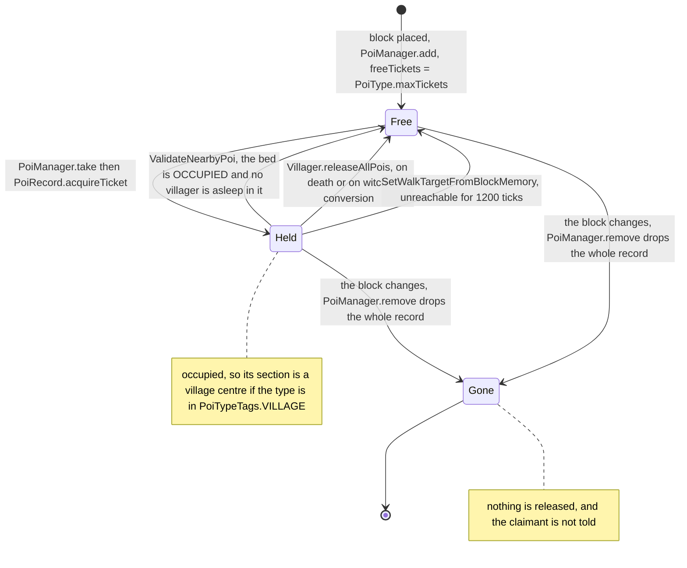
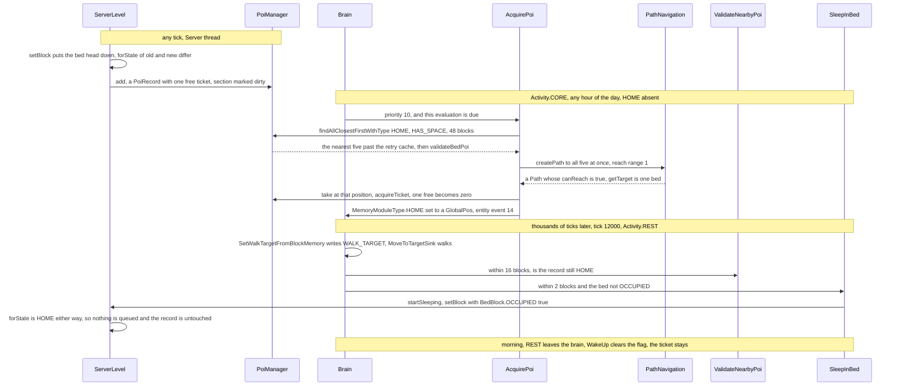

# Points of interest

> Verified against **Minecraft 26.2** · Part IV · A villager claims a bed.

A villager standing in the middle of a field at noon decides which bed is
his. He is not near it, he is not looking at it, and he will not walk to it
for another six thousand ticks. `AcquirePoi` asked the index for the beds
with a free ticket within 48 blocks, took the five nearest, asked `PathNavigation` for a path to all five at once, and the
moment `Path.canReach` came back true it called `PoiManager.take` and
decremented that bed's ticket. Night has nothing to do with it. Hours later
`SleepInBed` will finally put him in the bed and set `BedBlock.OCCUPIED`,
and because both occupied variants of a bed head are in `PoiTypes.BEDS` and
map to the same `PoiTypes.HOME`, that block change does not touch the record
at all: **the claim and the *occupied* flag speak in one direction only. Going
to sleep tells the index nothing; the single behaviour that reads the flag
back can only take a claim away.** Neither is what a player would call
ownership.

## The cast

| class | what it decides | thread |
|---|---|---|
| `PoiType` | how many tickets a kind of block hands out and how close is close enough — a record of `PoiType.matchingStates`, `PoiType.maxTickets`, `PoiType.validRange` | static, built at bootstrap |
| `PoiTypes` | the catalogue, and the block-state → type map `PoiTypes.TYPE_BY_STATE` that every lookup goes through | static |
| `PoiRecord` | one position's type and its `PoiRecord.freeTickets` counter | Server |
| `PoiSection` | the records in one 16³ section, by section-relative position and by type, plus the *Valid* flag that decides whether the section is rebuilt on load | Server |
| `PoiManager` | the index: a `SectionStorage` over the *poi/* region files, the whole query family, and the village distance graph | Server |
| `ServerLevel` | that a block change happened at all — `ServerLevel.updatePOIOnBlockStateChange` is the door every ordinary write goes through | Server, or a worldgen worker |
| `AcquirePoi` | which POI a mob claims, and when to stop asking about one it cannot reach | Server |
| `ValidateNearbyPoi` · `SleepInBed` | whether a remembered POI is still real, and what to do on arrival | Server |

## A ticket is a claim nothing enforces

A point of interest is a block state the game has decided is worth going to.
There are twenty-one kinds, none data-pack-driven: `PoiTypes.bootstrap`
registers them into `BuiltInRegistries.POINT_OF_INTEREST_TYPE` and files every
one of their block states into `PoiTypes.TYPE_BY_STATE`, throwing at startup
if two types claim one state. `PoiTypes.forState` and `PoiTypes.hasPoi` are
the only questions anyone asks of that map.

A ticket is the claim. A `PoiRecord` starts with `PoiType.maxTickets` free
and hands them out one at a time: `PoiRecord.acquireTicket` decrements,
`PoiRecord.releaseTicket` increments, both refuse to run past their end of the
range, and both mark the section dirty. `PoiRecord.hasSpace` asks whether any
are left, `PoiRecord.isOccupied` whether any are gone — the second question
being the one the village graph reads. Neither says anything about *who*: a
record does not know its holder, a holder is not told when its record
disappears, and no state on the block corresponds to a claim.

The asymmetry in that figure is deliberate on the release side and merely
survivable on the removal side. `PoiManager.release` **throws** when the
section is not there and `PoiSection.release` throws when the record is not,
which is why three of the four releasers check `PoiManager.getType` or
`PoiManager.exists` first — `Villager.releasePoi` checks the type and then
tests it against `Villager.POI_MEMORIES` before it dares. The fourth,
`VillagerMakeLove`, checks nothing, and gets away with it because the
position it releases is one `PoiManager.take` handed back a moment earlier. `PoiSection.remove` on
a missing record only logs an error, so the removal path is allowed to be
wrong and the release path is not.

Erasing a memory is not a release, which is what makes the job-site behaviours
noisy and harmless: `PoiCompetitorScan` awards a contested site to whichever
villager has the higher `Villager.getVillagerXp` and makes the loser erase
`MemoryModuleType.JOB_SITE`, `YieldJobSite` hands a
`MemoryModuleType.POTENTIAL_JOB_SITE` over to an unemployed neighbour, and
`AssignProfessionFromJobSite` promotes the potential site to the real one.
None of those three touches a ticket — though `GoToPotentialJobSite` does,
`GoToPotentialJobSite.stop` giving back the ticket `AcquirePoi` took on the
potential site.

## The catalogue

| types | the block | `PoiType.maxTickets` | `PoiType.validRange` |
|---|---|---:|---:|
| `PoiTypes.ARMORER` `PoiTypes.BUTCHER` `PoiTypes.CARTOGRAPHER` `PoiTypes.CLERIC` `PoiTypes.FARMER` `PoiTypes.FISHERMAN` `PoiTypes.FLETCHER` `PoiTypes.LEATHERWORKER` `PoiTypes.LIBRARIAN` `PoiTypes.MASON` `PoiTypes.SHEPHERD` `PoiTypes.TOOLSMITH` `PoiTypes.WEAPONSMITH` | one work block each — blast furnace, smoker, cartography table, brewing stand, composter, barrel, fletching table, lectern, stonecutter, loom, smithing table, grindstone, and for the leatherworker all four cauldrons | 1 | 1 |
| `PoiTypes.HOME` | the bed's **head** half only — `PoiTypes.BEDS` filters `BedBlock.PART` to `BedPart.HEAD` | 1 | 1 |
| `PoiTypes.MEETING` | the bell | 32 | 6 |
| `PoiTypes.BEEHIVE` `PoiTypes.BEE_NEST` | hive and nest | 0 | 1 |
| `PoiTypes.NETHER_PORTAL` | the portal block | 0 | 1 |
| `PoiTypes.LODESTONE` | the lodestone | 0 | 1 |
| `PoiTypes.LIGHTNING_ROD` | the rod, every facing | 0 | 1 |
| `PoiTypes.TEST_INSTANCE` | the test instance block | 0 | 1 |

Six of the twenty-one types are locatable but unclaimable.
`PoiRecord.hasSpace` is false for them forever, so nothing can
`PoiManager.take` one, and `PoiRecord.isOccupied` — which asks whether the free
count has moved off `PoiType.maxTickets` — is false forever too. Not that it
would matter: none of the six is in `PoiTypeTags.VILLAGE`, so none was ever a
candidate for a village centre. They are indexed purely so something can find
the nearest one fast: the bee's hive search asks for `PoiTypeTags.BEE_HOME`
within 20 blocks and then filters through `Bee.doesHiveHaveSpace`, which asks
the `BeehiveBlockEntity` whether it is full. The index answers *where* and
something else answers *whether*. Three tags cut across the catalogue
([tags](../foundations/tags.md)): `PoiTypeTags.ACQUIRABLE_JOB_SITE` for the
thirteen professions, `PoiTypeTags.BEE_HOME` for the two hives, and
`PoiTypeTags.VILLAGE` for those thirteen plus `PoiTypes.HOME` and
`PoiTypes.MEETING` — fifteen types whose occupied records are what a village
*is*.

## Where the index lives, and how it repairs itself

`PoiManager` extends `SectionStorage` ([chunk storage](chunk-storage.md)), so
the unit of storage is a chunk section and the unit of file a region:
`ChunkMap` builds it on the dimension's *poi/* folder with
`DataFixTypes.POI_CHUNK`, and `PoiSection.Packed` is the on-disk shape — a
*Valid* boolean and a list of *Records*, each a position, a type and a
*free_tickets* count. Tickets survive a restart, and so do the villagers'
memories of them, and nothing on load reconciles the two.

`ChunkMap.tick` runs `PoiManager.tick` under the profiler's *poi*, which
writes dirty chunks for as long as the tick has time and then settles the
village graph ([the level tick](../server/server-level-tick.md) owns the
budget). Reads are the interesting half. The query family is a dozen shapes of
the same walk — `PoiManager.getInSquare` over a chunk range, `PoiManager.getInRange`
narrowing it to a sphere, and `PoiManager.findClosest`, `PoiManager.getRandom`,
`PoiManager.getCountInRange`, `PoiManager.exists` and `PoiManager.getType`
above them — and every one bottoms out in `SectionStorage.getOrLoad`, where a
section that was never prefetched is read from disk **synchronously, on the
Server thread, blocking**. That is why `ChunkMap.scheduleChunkLoad` fires
`SectionStorage.prefetch` beside the chunk's own parse and joins the two
before either is used.

The repair runs on every chunk read. `SerializableChunkData.read` calls
`PoiManager.checkConsistencyWithBlocks` once per section with block data. If
the section is in storage, `PoiSection.refresh` rebuilds it — but only if its
*Valid* flag is false, and the rebuild reuses the existing `PoiRecord` objects
for positions that still have a POI, so **a repair does not reset anybody's
tickets**. If it is not in storage, one is created and scanned. Both scans are
short-circuited by `PoiManager.mayHavePoi`, which asks
`LevelChunkSection.maybeHas` whether the palette holds any state
`PoiTypes.hasPoi` recognises ([chunk anatomy](chunk-anatomy.md) has the
palette), so a section of plain stone is dismissed without one block read. The
*Valid* flag's codec defaults to **false**: anything not explicitly written as
validated gets rescanned.

## A record appears when a block changes, sometimes a task late

`Level.setBlock` calls `Level.updatePOIOnBlockStateChange` last, after the
neighbour updates, and on a `ServerLevel` that override compares
`PoiTypes.forState` of the old and the new state. Equal types mean nothing
happens — exactly the bed case, since a bed head that gains
`BedBlock.OCCUPIED` is still `PoiTypes.HOME`. Different types mean a
`PoiManager.remove` for the old and a `PoiManager.add` for the new, each
wrapped in a `BlockableEventLoop.execute` on the server.

That wrapper exists because `WorldGenRegion.setBlock` calls the same hook from
worldgen workers and the index is Server-thread-only. What it does *not* do is
defer the ordinary case: `MinecraftServer.scheduleExecutables` is false when
the caller is already the Server thread and not inside a task the loop is
running (`ReentrantBlockableEventLoop.runningTask`), so a block placed by a
player, a command or a mob during the tick body gets its record synchronously.
Deferral is the worldgen and nested-task case — there the record appears a
task later than the block it describes, and a read in between gets the old
answer.

## The trace: a villager claims a bed

The scan is cheap and the path is not. `PoiManager.findAllClosestFirstWithType`
turns a 48-block radius into a chunk radius of four, walks every section of
those chunks, filters by `PoiManager.Occupancy.HAS_SPACE` and sorts by
distance; `AcquirePoi` takes the first five and only then runs
`VillagerGoalPackages.validateBedPoi`, which re-reads each block to confirm it
is in `BlockTags.BEDS` and not already `BedBlock.OCCUPIED`. Then
`AcquirePoi.findPathToPois` hands all five positions to
`PathNavigation.createPath` as one target set, at the reach range from
`PoiType.validRange` — one, for a bed. A villager's constructor raises
`PathNavigation.setRequiredPathLength` to 48 so that this search can span the
scan range ([goals and brains](../entities/ai-goals-and-brains.md) owns the
pathfinder). Beds that failed before are held off by
`AcquirePoi.JitteredLinearRetry`, whose delay is **cumulative**: each attempt
adds another 40 to 79 ticks to that position's own counter, capped at
`AcquirePoi.JitteredLinearRetry.MAX_RETRY_PATHFINDING_INTERVAL`, 400. A bed
behind a wall is checked ever more rarely — but never as rarely as once every
twenty seconds, because a marker untouched for 400 ticks is dropped on the
very tick the cap would first apply, so the interval saws back to the
beginning. A successful claim clears the whole cache.

The claim itself is five statements. `PoiManager.take` — alone among the
radius searches in having no `PoiManager.Occupancy` parameter, because it
always means *HAS_SPACE* — is called with radius 1 around the path's target and a filter
accepting only that exact position, and calls `PoiRecord.acquireTicket` on
what it finds. Then `MemoryModuleType.HOME` is set to a `GlobalPos`, then
`ServerLevel.broadcastEntityEvent` sends event 14 — the green particle burst,
and the only thing an ordinary client learns of any of this. The last two
statements clear the retry cache and tell the debug channel. The memory is set
inside `PoiManager.getType`'s *ifPresent*, not inside `PoiManager.take`'s —
the take's result is never consulted.

## After the claim: the night shift

`Brain.updateActivityFromSchedule`, run from `UpdateActivityFromSchedule` at
priority 99 and only when more than twenty ticks have passed since it last did
anything, reads the villager's schedule *attribute* —
`EnvironmentAttributes.VILLAGER_ACTIVITY` for an adult,
`EnvironmentAttributes.BABY_VILLAGER_ACTIVITY` for a child — at the villager's
own position, and `Timelines.VILLAGER_SCHEDULE` puts the `Activity.REST`
keyframe at tick 12000 of a 24000-tick period
([environment attributes](environment-attributes-and-timelines.md) owns the
mechanism; the old *Schedule* class is gone). Only then does the bed half of
the brain exist at all: `VillagerGoalPackages.getRestPackage` is where
`SetWalkTargetFromBlockMemory`, `ValidateNearbyPoi` for `PoiTypes.HOME` and
`SleepInBed` live, while the core package validates the *job site* and not the
bed. So between dawn and dusk a villager whose bed was mined keeps pointing at
a position with no record, and nothing tells it otherwise.

At night the three run in priority order. `SetWalkTargetFromBlockMemory` at
priority 2 writes `MemoryModuleType.WALK_TARGET` whenever the bed is more than
one block away in Manhattan distance — straight at it when it is nearer than
150, and at a random intermediate position when it is further — and gives up,
releasing the ticket and erasing the memory, once `MemoryModuleType.CANT_REACH_WALK_TARGET_SINCE` has stood for
more than 1200 ticks. `ValidateNearbyPoi` at priority 3 does
nothing at all unless the bed is within 16 blocks and in this dimension: then
it erases the memory if `PoiManager.exists` no longer agrees on the type, and
if the bed is `BedBlock.OCCUPIED` and this villager is not itself the
sleeper, it erases the memory and releases the ticket — unless some villager
is asleep in that block, in which case the memory goes and the ticket stays,
the sleeper being presumed to hold it. `SleepInBed`, also priority 3, needs the villager within 2 blocks, the bed
unoccupied, and `SleepInBed.COOLDOWN_AFTER_BEING_WOKEN` ticks since
`MemoryModuleType.LAST_WOKEN`. It calls `LivingEntity.startSleeping`, which is
what actually sets the flag, and then records `MemoryModuleType.LAST_SLEPT`
and erases the walk target itself.

Morning ends it twice over: `WakeUp`, at priority 0 in the core package, calls
`LivingEntity.stopSleeping` the instant `Activity.REST` goes inactive, and
`SleepInBed.stop` does the same when the behaviour ends. Either way the flag
clears and the ticket does not.

## What makes a village

`PoiManager.DistanceTracker` is a `SectionTracker` — the same
`DynamicGraphMinFixedPoint` flood the ticket system's two graphs use
([tickets and loading](tickets-and-loading.md)), and the only one of the five
outside `server/level` — over chunk sections instead of chunks. Its sources are the sections where
`PoiManager.isVillageCenter` holds: at least one record whose type is in
`PoiTypeTags.VILLAGE` and whose `PoiManager.Occupancy` is *IS_OCCUPIED*. They
sit at level 0 and the flood runs out to `PoiManager.MAX_VILLAGE_DISTANCE`,
six sections, past which the level is simply absent from the map.

**An unclaimed bed makes no village.** A hundred empty beds are a hundred
records and zero sources; one villager taking one ticket lights the section up.
`PoiManager.setDirty` and `PoiManager.onSectionLoad` re-seed the source,
`PoiManager.tick` settles the flood every tick, and
`PoiManager.sectionsToVillage` settles it again before answering.
`ServerLevel.isVillage` is that distance being one section or less;
`ServerLevel.isCloseToVillage` takes the distance as an argument and refuses
anything past six.

That boolean is load-bearing far outside this system. `BadOmenMobEffect`
starts a raid only where `ServerLevel.isVillage` is true, `VillageSiege` needs
one to put zombies in, `PatrolSpawner` refuses to spawn a patrol within two
sections of one and `CatSpawner` insists on being within two. `Raid` re-checks
it as the raid runs, and `Raids` sets the raid's centre to the average
position of the occupied `PoiTypeTags.VILLAGE` records within 64 blocks.

## Everyone else who reads the index

| who | what it asks for | radius | `PoiManager.Occupancy` |
|---|---|---|---|
| `PortalForcer.findClosestPortalPosition` | `PoiTypes.NETHER_PORTAL`, after `PoiManager.ensureLoadedAndValid` drags the sections in | 16 going to the Nether, 128 coming back | *ANY* |
| `Bee` | `PoiTypeTags.BEE_HOME`, then `Bee.doesHiveHaveSpace` for the real occupancy | 20 | *ANY* |
| `ServerLevel.findLightningRod` | `PoiTypes.LIGHTNING_ROD` standing at the surface height | 128 | *ANY* |
| `LodestoneTracker` | one position — is `PoiTypes.LODESTONE` still there | — | — |
| `LocateCommand` | `PoiManager.findClosestWithType` for a type or a tag | 256 | *ANY* |
| `Raids` | the records it averages into a raid's centre | 64 | *IS_OCCUPIED* |
| `CatSpawner` | more than four claimed `PoiTypes.HOME` nearby | 48 | *IS_OCCUPIED* |
| `WanderingTraderSpawner` | a `PoiTypes.MEETING` near a player, to arrive at | 48 | *ANY* |
| `NearestBedSensor` | `PoiTypes.HOME` for `MemoryModuleType.NEAREST_BED`, babies only, no ticket taken | 48 | *ANY* |

`PoiManager.ensureLoadedAndValid` in the first row is the only caller that
forces loading rather than tolerating what is in memory: for any nearby
section missing or invalid it pulls the chunk in at `ChunkStatus.EMPTY`, once
per chunk per server run since `PoiManager.loadedChunks` never forgets. The
index is on the debug channel too — `LevelDebugSynchronizers.registerPoi`,
`LevelDebugSynchronizers.updatePoi` and `LevelDebugSynchronizers.dropPoi` feed
`DebugSubscriptions.POIS` and `DebugSubscriptions.VILLAGE_SECTIONS`.

## Questions players ask

**Why is a villager sleeping in the bed I built for someone else?** Because
the claim is a number in a file and the bed is a block, and neither knows the
other. `PoiManager.take` decremented a counter 48 blocks away hours before
anyone walked anywhere, and `SleepInBed` only ever checks that the bed is *not
currently occupied* — never who holds the ticket.

**Why do villagers stop breeding when I take a bed away?**
`VillagerMakeLove.tryToGiveBirth` calls `VillagerMakeLove.takeVacantBed`
first — a `PoiManager.take` for `PoiTypes.HOME` within 48 blocks, filtered by
reachability. No free ticket, no baby, and the pair get entity event 13
instead. If the birth then fails the ticket is released; if it succeeds,
`VillagerMakeLove.giveBedToChild` writes the baby's `MemoryModuleType.HOME`
directly, with no `AcquirePoi` involved. This is the raw `PoiManager.take`,
which finds the first reachable match in section order rather than the
nearest, so the baby's bed need not be the closest.

**Why does the same bed get claimed twice after I break and replace it?**
Breaking it runs `PoiManager.remove` and the record ceases to exist with its
ticket count — no release, no notification. The villager keeps its `GlobalPos`
until `ValidateNearbyPoi` next runs, which needs `Activity.REST` active *and*
the villager within 16 blocks. Replace the bed first and there is a brand-new
record with a full ticket, claimable by anyone — including the villager that
thought it already had one.

## Where to look

`PoiTypes.bootstrap` · `PoiRecord.acquireTicket` · `PoiSection.refresh` ·
`PoiManager.add` · `PoiManager.take` · `PoiManager.release` ·
`PoiManager.getInRange` · `PoiManager.checkConsistencyWithBlocks` ·
`ServerLevel.updatePOIOnBlockStateChange` · `AcquirePoi.create` ·
`VillagerGoalPackages.getCorePackage` · `VillagerGoalPackages.getRestPackage` ·
`ValidateNearbyPoi.create` · `SleepInBed.start` · `Villager.releasePoi` ·
`PoiManager.DistanceTracker` · `ServerLevel.isVillage`

The other index in this corner of the tree — the fire-and-forget broadcast
sculk sensors listen to — is
[game events and vibrations](game-events-and-vibrations.md). The brain belongs
to [goals and brains](../entities/ai-goals-and-brains.md), death and
conversion to [the entity lifecycle](../entities/entity-lifecycle.md), the bed
block to [blocks and states](../blocks/blocks-and-states.md).

---

*Rules: names, never code · how the system works, not how the code reads ·
newest version only · every backticked name passes `tools/verify_names.py`.*
