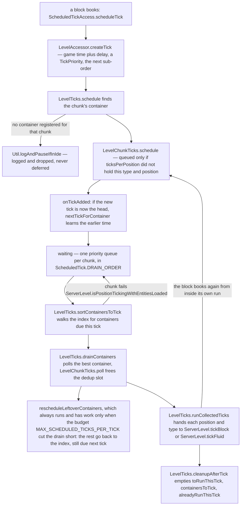
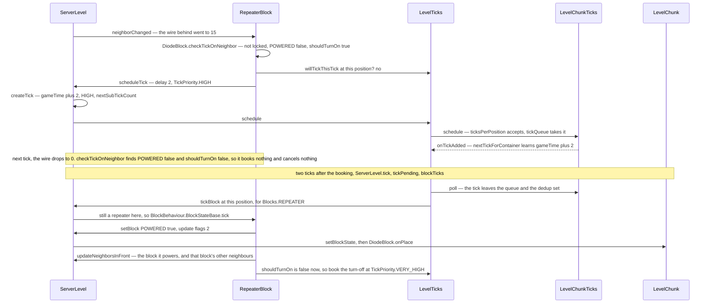

# Scheduled ticks

> Verified against **Minecraft 26.2** · Part IV · A repeater's input goes high, and the two ticks before its output follows are one entry in a queue.

A repeater set to its shortest delay is not counting anything. When the wire
behind it changes, `DiodeBlock.neighborChanged` runs on the server thread,
notices that `DiodeBlock.POWERED` no longer matches the input, and books an
appointment — a `ScheduledTick` naming this `Block` at this `BlockPos`, due
two game ticks from now, at `TickPriority.HIGH` — and then forgets. Two ticks
later a scheduler the repeater has never heard of hands the position back to
`ServerLevel.tickBlock`, which checks that a repeater is still there and
calls the block again. Nearly everything the world does *later* is one of
these: a fluid flowing, a sapling sprouting after bonemeal, a pressure plate
releasing, a piece of amethyst budding. They all share two queues per chunk
and one rule that surprises everybody: **the queue dedups on type and
position alone, so a second tick for the same block — even a much sooner
one — is silently dropped.**

"Rescheduling moves the tick" is folklore. `ScheduledTick.UNIQUE_TICK_HASH`
hashes the position and compares the type by object identity — the trigger
tick, the priority and the sub-order are no part of it — and
`LevelChunkTicks.schedule` queues a tick only if its dedup set,
`LevelChunkTicks.ticksPerPosition`, did not already hold that pair. The
booking that loses is not queued, not merged and not logged, which is why so
many blocks ask before they book: `DiodeBlock`, `ComparatorBlock` and
`RedstoneTorchBlock` consult `LevelTickAccess.willTickThisTick`, and seven
blocks — `ObserverBlock`, `TargetBlock`, `LightningRodBlock`, `TripWireBlock`,
`SculkSensorBlock`, `DriedGhastBlock` and `SpeleothemBlock` — consult
`TickAccess.hasScheduledTick`.

## The cast

| class | what it decides | thread |
|---|---|---|
| `ScheduledTick` | the appointment itself — type, position, trigger tick, `TickPriority`, sub-order — and the comparisons the system sorts and dedups by | a record, no thread |
| `LevelChunkTicks` | one chunk's queue and its dedup set: whether a booking is new, and which of its ticks is next | Server |
| `LevelTicks` | the per-level scheduler: which chunks are due, which ticks run this level tick, and where the budget falls | Server |
| `ScheduledTickAccess` | the write side every block sees, so no block knows which container it is booking into | any — worldgen workers book through it |
| `ServerLevel` | when the drain runs, the per-chunk gate it runs under, and the type re-check that makes a tick cancellable | Server |
| `SavedTick` | the disk form: a *relative* delay in place of an absolute time | Server, written by the IO worker |
| `ProtoChunkTicks` | a generating chunk's bookings, all at delay zero | worldgen workers |
| `BlackholeTickAccess` | accept every booking and run nothing — the client's answer to the whole system, and also an `ImposterProtoChunk`'s | Render, and the server thread |

Those containers implement one small interface stack — `TickAccess`
(schedule, ask, count), `TickContainerAccess` per chunk, `LevelTickAccess` per
level, which also answers `LevelTickAccess.willTickThisTick`, and
`SerializableTickContainer` for one that can `SerializableTickContainer.pack`
itself for disk — which is why `LiquidBlock` and `RepeaterBlock` run unchanged
during generation, on a client that will never tick them, and on a server that
will.

## The pipeline, end to end

Everything below is one stage of that figure.

## Booking: a type, a position, a time and a tie-breaker

A block calls one of the `ScheduledTickAccess.scheduleTick` defaults with a
delay in ticks and, optionally, a `TickPriority`. The default asks the level
for `LevelAccessor.createTick`, which stamps the appointment with
`LevelAccessor.getGameTime` plus the delay, the priority (`TickPriority.NORMAL` if
none was given) and a fresh sub-order from `LevelAccessor.nextSubTickCount`,
then hands it to `ScheduledTickAccess.getBlockTicks` or
`ScheduledTickAccess.getFluidTicks`. Two type parameters, two parallel
worlds: a `Block` tick and a `Fluid` tick never meet, and `ServerLevel` owns
one `LevelTicks` of each.

The sub-order is the FIFO tie-breaker for two ticks at the same time and
priority, and it carries the one threading fact of this page.
`Level.subTickCount` is a plain counter incremented by
`Level.nextSubTickCount`, because a level's scheduler is touched only from the
server thread; `WorldGenRegion.subTickCount` is an atomic one, because
generation books ticks from the worker pool. **The drain is server-thread
only. Booking is not.**

`TickPriority` runs `TickPriority.EXTREMELY_HIGH` (−3) through
`TickPriority.NORMAL` (0) to `TickPriority.EXTREMELY_LOW` (3), lower first,
and it is not a queue-jump across time: a `TickPriority.LOW` tick due now
still beats a `TickPriority.EXTREMELY_HIGH` tick due next tick. Priority only
settles ties between ticks already due together.

Fluids are the scheduler's largest customer by a distance, and they exploit
the dedup key: `Fluids.WATER` and `Fluids.FLOWING_WATER` are different
registry objects, so one tick of each can be pending at one position. What
those ticks then *do* is [fluids](fluids.md).

> **For a 1.21-era reader.** `BlockBehaviour.updateShape` no longer takes a
> `LevelAccessor`. It takes a `LevelReader` and a separate
> `ScheduledTickAccess` — a small interface whose whole job is booking:
> `ScheduledTickAccess.createTick`, `ScheduledTickAccess.getBlockTicks`,
> `ScheduledTickAccess.getFluidTicks` and four `ScheduledTickAccess.scheduleTick`
> overloads that compose them.

## Where an appointment waits

Every `LevelChunk` owns exactly two containers, `LevelChunk.blockTicks` and
`LevelChunk.fluidTicks`, and they are the only place a pending tick ever lives
([chunk anatomy](chunk-anatomy.md)): a priority queue,
`LevelChunkTicks.tickQueue`, in `ScheduledTick.DRAIN_ORDER`, beside the dedup
set that decides what gets into it.

`LevelTicks` never scans those queues looking for work. It keeps
`LevelTicks.allContainers`, chunk key to container, and
`LevelTicks.nextTickForContainer`, chunk key to the earliest trigger time that
chunk holds, defaulting for an unknown chunk to the largest possible long. The
index is maintained by `LevelTicks.chunkScheduleUpdater`, the callback every
container is handed through `LevelChunkTicks.setOnTickAdded` when it
registers, and it fires only when the tick just added *is* the container's new
head. **A chunk with nothing due costs one map entry and one comparison per
level tick, and a chunk with an empty queue costs nothing at all** — which is
what makes tens of thousands of loaded chunks affordable.

Registration follows the chunk's life exactly: `ChunkStatusTasks.full` calls
`LevelChunk.registerTickContainerInLevel` (`LevelTicks.addContainer`, both
types), and `ServerLevel.unload` calls
`LevelChunk.unregisterTickContainerFromLevel` → `LevelTicks.removeContainer`,
which also drops the callback so an orphaned container can no longer touch the
index. In between, a tick aimed at a chunk with no registered container is
neither deferred nor queued: `LevelTicks.schedule` finds nothing, calls
`Util.logAndPauseIfInIde`, and the appointment ceases to exist. `ClientLevel`
short-circuits all of it — `ClientLevel.getBlockTicks` and
`ClientLevel.getFluidTicks` return `BlackholeTickAccess.emptyLevelList`, which
accepts every booking, answers false to every question and runs nothing, so
everything a client sees of a flowing fluid or a firing repeater arrives as
block-update packets. (`ContainerSingleItem` also lives in `world/ticks`, a
one-slot inventory interface with nothing to do with ticks — a packaging
accident, noted only so it does not confuse you.)

## What one drain actually does

`ServerLevel.tick` calls `LevelTicks.tick` twice in its *tickPending*
section, blocks first and then fluids, each with the current game time and a
budget of `ServerLevel.MAX_SCHEDULED_TICKS_PER_TICK`, 65536 — a budget per
call, so 65536 block ticks *and* 65536 fluid ticks ([the level
tick](../server/server-level-tick.md)). The whole section is skipped in a
debug world and whenever `TickRateManager.runsNormally` is false. Each call
is three phases.

**Collect.** `LevelTicks.sortContainersToTick` walks the index, not the
containers: it leaves a future entry alone, deletes one whose container has
vanished or emptied, corrects one whose head is later than the index claimed,
and tests a genuinely due one against `LevelTicks.tickCheck`. That predicate
is `ServerLevel.isPositionTickingWithEntitiesLoaded`, asked about the
**chunk**, not the position, and true only when the chunk is in
`DistanceManager.inBlockTickingRange`, its
`ChunkHolder.getTickingChunkFuture` has already succeeded, and
`PersistentEntitySectionManager.areEntitiesLoaded` holds ([tickets and
loading](tickets-and-loading.md)). A chunk that fails keeps its index entry
untouched and is asked again next tick — its ticks are late, never lost — and
one that passes moves into `LevelTicks.containersToTick`, a priority queue of
*containers* ordered by `LevelTicks.CONTAINER_DRAIN_ORDER`, on their heads.

`LevelTicks.drainContainers` polls the best container, takes one tick and
hands to `LevelTicks.drainFromCurrentContainer`, which keeps pulling from that
same container while its next tick is still due and still beats the next-best
container's head — containers are re-heaped only when the winner stops
winning. A container that is overtaken, or that still has something due when the
budget is spent, goes back into the container queue; one merely overdue goes
back to the index; one drained empty goes to neither. And
`LevelTicks.rescheduleLeftoverContainers` returns whatever the budget cut off
to the index at its head's trigger time, already in the past — which gets it
*collected* next tick but buys it no place in the order, because
`LevelTicks.CONTAINER_DRAIN_ORDER` compares priority and sub-order and has no
time term at all.

**Run.** `LevelTicks.runCollectedTicks` drains `LevelTicks.toRunThisTick` in
order, moving each entry to `LevelTicks.alreadyRunThisTick` and handing its
position and type to `ServerLevel.tickBlock` or `ServerLevel.tickFluid`. Both
re-read the world there and run `BlockBehaviour.BlockStateBase.tick` or
`FluidState.tick` only if the block or fluid is still the one the appointment
named. **A tick is a promise to a type**, and that check is the whole of
cancellation for anything a block does: break the block and its pending ticks
evaporate with no cancellation code anywhere. The only code that removes a
pending tick outright is bulk — `LevelChunkTicks.removeIf`, through
`LevelTicks.clearArea`, forty lines below. **Clean up** is
`LevelTicks.cleanupAfterTick`, emptying all four working collections including
`LevelTicks.toRunThisTickSet`, which is built lazily and only if somebody
actually asks `LevelTicks.willTickThisTick`.

### The comparisons, and which is used where

| comparison | compares | used by |
|---|---|---|
| `ScheduledTick.DRAIN_ORDER` | trigger tick, then priority, then sub-order | the priority queue inside every `LevelChunkTicks` |
| `ScheduledTick.INTRA_TICK_DRAIN_ORDER` | priority, then sub-order — **no time term** | `LevelTicks.drainFromCurrentContainer`, comparing two already-due ticks |
| `LevelTicks.CONTAINER_DRAIN_ORDER` | the same, applied to two containers' heads | `LevelTicks.containersToTick` |
| `LevelChunkTicks.SUB_TICK_ORDERING` | sub-order alone | `LevelChunkTicks.pack`, on save only |
| `ScheduledTick.UNIQUE_TICK_HASH` | not an ordering — identity on type and position | `LevelChunkTicks.ticksPerPosition` and `LevelTicks.toRunThisTickSet` |

Time drops out of the second comparison because a container reaches the
collect queue only once its head is already due, and once everything in play
is due, time no longer discriminates.

Separating the phases has two consequences. A tick booked *during* the run
phase lands in its container after collect has finished, so it waits for a
later drain even at delay zero — the one exception being a block tick that
books a **fluid** tick at delay zero, which the fluid drain, running
afterwards in the same `ServerLevel.tick`, still catches. And the dedup slot
is released by `LevelChunkTicks.poll` during *collect*, not at run, so a tick
may book its own successor from inside its own run: exactly how a fluid keeps
flowing and how a repeater arms its turn-off.

That the run list outlives the run is what makes bulk edits correct across the
phase boundary. `LevelTicks.copyAreaFrom`, called by `/clone` in
`CloneCommands`, harvests matching ticks from `LevelTicks.alreadyRunThisTick`,
from `LevelTicks.toRunThisTick` *and* from the containers in the area, then
re-bases every sub-order above the highest it found so copies keep their
relative order without colliding with the originals. `LevelTicks.clearArea`
does the mirror image for the gametest framework
(`StructureUtils.clearSpaceForStructure`, `GameTestInfo`). Both touch block
ticks only — nothing in the game copies or clears fluid ticks by area.

## A repeater, appointment by appointment

A repeater with `RepeaterBlock.DELAY` 1 — `RepeaterBlock.getDelay` doubles
it, so two game ticks — with a redstone wire behind it that goes to 15 and
then back to 0 one tick later.

**A repeater almost never books at `TickPriority.NORMAL`.**
`DiodeBlock.checkTickOnNeighbor` picks `TickPriority.HIGH` to turn on,
`TickPriority.VERY_HIGH` to turn off and `TickPriority.EXTREMELY_HIGH` when
`DiodeBlock.shouldPrioritize` holds — when the block it powers is itself a
diode that is not pointing straight back at it. So a diode's turn-off beats
another's turn-on due on the same tick, and a diode feeding a diode beats
both. The single `TickPriority.NORMAL` booking a repeater makes is
`DiodeBlock.setPlacedBy`, delay 1, when you place it into a powered spot.

**The pending appointment is immune to the input changing.**
`DiodeBlock.checkTickOnNeighbor` books only when the *current*
`DiodeBlock.POWERED` disagrees with the *current* input, and nothing anywhere
removes a booked tick. A pulse shorter than the delay therefore does not
cancel the repeater: `DiodeBlock.tick` finds `DiodeBlock.POWERED` false, turns
it on anyway, and — because the input is already gone — books its own turn-off
one delay later. Pulse extension is two entries in this queue.

**Nothing here uses `Block.UPDATE_NEIGHBORS`.** `DiodeBlock.tick` writes with
`Block.UPDATE_CLIENTS` alone, and the signal leaves through
`DiodeBlock.onPlace` — which `LevelChunk.setBlockState` runs on the server for
any write without `Block.UPDATE_SKIP_ON_PLACE` — calling
`DiodeBlock.updateNeighborsInFront`. The rest is [diodes and the
observer](../blocks/diodes-and-observers.md).

## The other kind of turn: random ticks

The appointment book is one of two ways a block gets a turn, and the contrast
is what defines it: a random tick is booked by nobody, aimed at no block, and
carries no promise.

It also reaches a different set of chunks. `ServerChunkCache.tickChunks` reads
`GameRules.RANDOM_TICK_SPEED` — default 3, minimum 0 — **once per level
tick**, then walks `ChunkMap.forEachBlockTickingChunk`, which despite its name
is `DistanceManager.forEachEntityTickingChunk` filtered to chunks with a live
`ChunkHolder.getTickingChunk`. The scheduled-tick gate,
`ServerLevel.isPositionTickingWithEntitiesLoaded`, reads the wider
block-ticking radius instead, so random ticks stop one ring sooner than
scheduled ticks do.

Inside such a chunk, `ServerLevel.tickChunk` skips every section where
`LevelChunkSection.isRandomlyTicking` is false — a pair of counters,
`LevelChunkSection.tickingBlockCount` and
`LevelChunkSection.tickingFluidCount`, maintained on every block write, so
solid stone is skipped without one position being generated. In each surviving
section it picks that many positions and rolls
`BlockBehaviour.BlockStateBase.randomTick` where
`BlockBehaviour.BlockStateBase.isRandomlyTicking` — a flag baked into the
state at `BlockBehaviour.BlockStateBase.initCache` from
`BlockBehaviour.Properties.randomTicks` — and then, separately,
`FluidState.randomTick` where `FluidState.isRandomlyTicking`.

**Lava gets its random tick twice.** `LiquidBlock.isRandomlyTicking` and
`LiquidBlock.randomTick` both delegate straight to the fluid, so a chosen lava
position runs `LavaFluid.randomTick` once through the block branch of that
loop and again through the fluid branch. It is the only fluid it happens to:
`Fluid.isRandomlyTicking` is false by default and `LavaFluid.isRandomlyTicking`
is the sole override. Water is never randomly ticked at all — every inch of
its motion is a scheduled tick. The same number also drives the ice-and-snow
pass, so zeroing the rule freezes crops, fire, leaf decay and precipitation
together ([the level tick](../server/server-level-tick.md)).

## Appointments that survive a restart

A `SavedTick` stores a **relative** delay rather than an absolute time, so a
world closed and reopened a month later still fires its ticks on schedule:
`ScheduledTick.toSavedTick` subtracts the current game time on the way out and
`SavedTick.unpack` adds the new one on the way back. `LevelChunkTicks.pack`
writes the pending list first and then the live queue sorted by
`LevelChunkTicks.SUB_TICK_ORDERING`, and `SerializableChunkData` stores the two
lists under *block_ticks* and *fluid_ticks* through `SavedTick.codec` ([chunk
storage](chunk-storage.md)). On the way in,
`SavedTick.filterTickListForChunk` discards any saved tick whose position is
not in the chunk being loaded.

Coming back is two-stage. `SerializableChunkData` builds a `LevelChunkTicks`
for a chunk at `ChunkStatus.FULL` and a `ProtoChunkTicks` for one below it, and
the `LevelChunkTicks` constructor holds the saved list as
`LevelChunkTicks.pendingTicks` — *not* in the queue — while pre-seeding the
dedup set from it, so a fresh booking cannot double up a saved one that is not
unpacked yet. The queue fills only when `ChunkMap.prepareTickingChunk` reaches
`ServerLevel.startTickingChunk` → `LevelChunk.unpackTicks` →
`LevelChunkTicks.unpack`, which counts sub-orders up from minus the list's
length. **Every unpacked tick gets a negative sub-order**, and
`Level.subTickCount` starts each session at zero and only rises, so a loaded
tick always sorts before anything this session booked at the same time and
priority.

Generation takes the same road. A `ProtoChunk` holds `ProtoChunkTicks`, which
records everything at delay **zero** and dedups under
`SavedTick.UNIQUE_TICK_HASH`, and `WorldGenRegion` exposes both of its
containers as a `WorldGenTickAccess` — a router that finds the right chunk per
position and answers `LevelTickAccess.willTickThisTick` with a flat false. At
promotion `ProtoChunk.unpackBlockTicks` turns that list into a
`LevelChunkTicks` in the pending state, and it becomes real at the same
`ServerLevel.startTickingChunk` a loaded chunk goes through — due immediately,
at the game time the chunk started ticking.

## Questions players ask

**I rescheduled the tick for sooner and nothing changed. Why?** Because
`LevelChunkTicks.schedule` dedups on type and position only, and the first
booking wins. No block moves or cancels a pending tick — only `/clone` and the gametest
framework do, in bulk, through `LevelTicks.copyAreaFrom` and
`LevelTicks.clearArea`. So ask
`TickAccess.hasScheduledTick` whether one is already booked, or
`LevelTickAccess.willTickThisTick` whether one is about to run in this very
level tick, which reads the already-collected list that
`LevelTicks.hasScheduledTick` can no longer see.

**Why did breaking one block stop a machine that was two ticks from firing?**
A tick names a type. The appointment stays in the queue and still runs, but
`ServerLevel.tickBlock` re-reads the position, finds a different block, and
runs it to nothing.

**Does `/tick freeze` stop scheduled ticks?** Yes, and among the tick
commands it is the only one that does — a debug world skips the section too.
`TickRateManager.runsNormally` returns `TickRateManager.runGameElements`,
recomputed every tick as *not frozen, or stepping* — so `/tick step` runs the
*tickPending* section normally for the ticks it steps, and `/tick sprint`
clears the freeze flag outright for the length of the sprint
(`ServerTickRateManager.requestGameToSprint`) and puts back whatever it found
when the sprint ends.

**Where do my ticks go when a chunk stops ticking?** Nowhere. They sit in the
chunk's own queue, the index entry is left untouched, and the moment the chunk
is block-ticking again they are all collected in one drain. If the chunk
unloads first they are written to disk with it. The only appointment actually
lost is one booked into a chunk with no registered container.

**Why does lava set things alight faster than the number of random ticks
suggests?** Because a chosen lava position runs `LavaFluid.randomTick` twice
per selection, once as a block and once as a fluid.

## Where to look

`ScheduledTick` · `ScheduledTick.UNIQUE_TICK_HASH` ·
`ScheduledTick.DRAIN_ORDER` · `TickPriority` · `ScheduledTickAccess.scheduleTick` ·
`LevelAccessor.createTick` · `LevelTicks.schedule` · `LevelChunkTicks.schedule` ·
`LevelChunkTicks.poll` · `LevelTicks.tick` · `LevelTicks.sortContainersToTick` ·
`LevelTicks.drainContainers` · `LevelTicks.runCollectedTicks` ·
`ServerLevel.tickBlock` · `ServerLevel.isPositionTickingWithEntitiesLoaded` ·
`LevelChunk.registerTickContainerInLevel` · `LevelChunkTicks.unpack` ·
`SavedTick` · `ProtoChunkTicks` · `WorldGenTickAccess` · `BlackholeTickAccess` ·
`ServerLevel.tickChunk` · `LevelChunkSection.isRandomlyTicking` ·
`DiodeBlock.checkTickOnNeighbor` · `DiodeBlock.tick` · `LevelTicks.copyAreaFrom`

---

*Rules: names, never code · how the system works, not how the code reads ·
newest version only · every backticked name passes `tools/verify_names.py`.*
