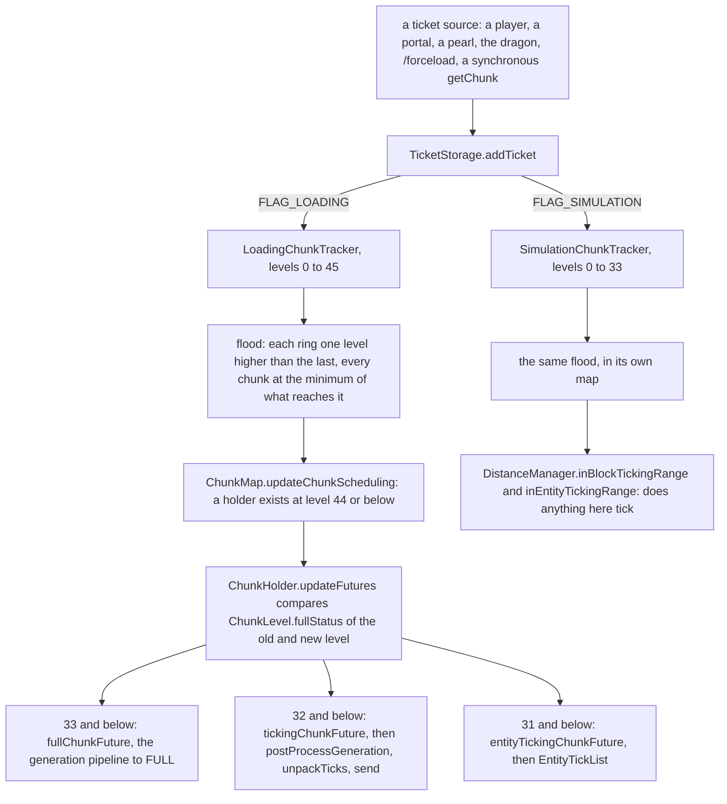
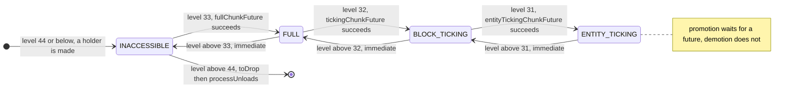
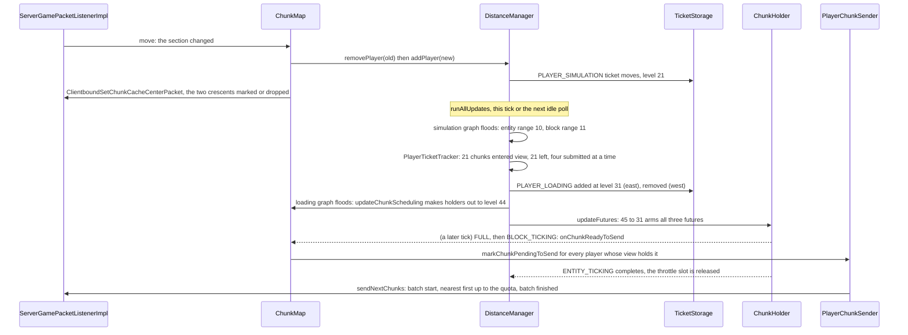

# Tickets and loading

> Verified against **Minecraft 26.2** · Part IV · A player walks one block east across a chunk boundary, and a column of chunks thirteen past the edge of view is asked for.

A player standing at the eastern edge of a chunk takes one step. On the
server, `ChunkMap.move` notices that the player's section changed, and
before the tick is out a column of twenty-one chunks to the east has been
asked for. The nearest of them will be generated, lit, sent and alive within
a second or two. The furthest, thirteen chunks past the ticket that
asked for it, will exist only as a `ChunkHolder` at level 44, allowed no
further than `ChunkStatus.STRUCTURE_STARTS` and never becoming a
`LevelChunk` at all. Nothing in that machinery ever asks for a
chunk *because* it is loaded — even `ChunkLevel.isLoaded` is a question
about a number. Everything asks for a chunk at a *level*, and the ticket
system decides what the level means. That is the whole design, and it has
one consequence a player can see: **there are two graphs reading one ticket
store, and they answer different questions** — so a chunk can be
`FullChunkStatus.ENTITY_TICKING` by every measure the holder knows and tick
nothing, because render distance is how far you can see and simulation
distance is how far the world is alive.

## The cast

| class | what it decides | thread |
|---|---|---|
| `TicketStorage` | which tickets exist on which chunk, and which survive a restart — it is the *chunk_tickets* `SavedData` | Server |
| `DistanceManager` | owns both graphs, the two player-radius trackers and the four-slot throttle | Server |
| `LoadingChunkTracker` · `SimulationChunkTracker` | the two graphs: `ChunkTracker`s over `DynamicGraphMinFixedPoint`, one level higher per ring | Server |
| `ChunkLevel` | the number line — which level means which `FullChunkStatus` and which generation status | static |
| `ChunkHolder` | one chunk's level and its three futures | Server; futures complete on workers, confirmations hop back |
| `ChunkMap` | the holders (an updating map and a visible clone), each player's `ChunkTrackingView`, unloads | Server; workers read the visible map |
| `ServerChunkCache` | the level's `ChunkSource`: the tick slot, the synchronous `ServerChunkCache.getChunk`, and a `BlockableEventLoop` pinned to the server thread | Server |
| `PlayerChunkSender` | the per-player batches, paced by the client's acknowledgements | Server |

## From a ticket to a future

The figure is the page. A ticket lands on one chunk; each graph the ticket's
flags name floods outward from it; the loading graph's levels decide which
holders exist and what futures they arm; the simulation graph's levels decide
what ticks. The rest of the page is one section per decision on that path.

### What a ticket asks for

A `Ticket` is a `TicketType`, a `Ticket.ticketLevel` and a countdown,
`Ticket.ticksLeft`. Its identity is the pair (type, level): there is no key
object and no owner, and re-adding an identical ticket only
`Ticket.resetTicksLeft`. The type is a record of a timeout and a set of
flags, registered in `BuiltInRegistries.TICKET_TYPE`, and the flags say what
the ticket *does*: `TicketType.FLAG_LOADING` feeds the loading graph,
`TicketType.FLAG_SIMULATION` the simulation graph, `TicketType.FLAG_PERSIST`
writes it to disk, `TicketType.FLAG_KEEP_DIMENSION_ACTIVE` stops the level's
empty-tick countdown and `TicketType.FLAG_CAN_EXPIRE_IF_UNLOADED` lets its
countdown run under a chunk that has no holder yet. There are exactly nine
types, and every reason a chunk is ever loaded is one of them:

| type | timeout | loads | simulates | keeps dimension active | persists | who adds it |
|---|---:|---|---|---|---|---|
| `TicketType.PLAYER_LOADING` | — | ✓ | | | | `DistanceManager.PlayerTicketTracker`, one per chunk in view |
| `TicketType.PLAYER_SIMULATION` | — | | ✓ | ✓ | | `DistanceManager.addPlayer`, the player's own chunk |
| `TicketType.FORCED` | — | ✓ | ✓ | ✓ | ✓ | `/forceload` via `TicketStorage.updateChunkForced` |
| `TicketType.PORTAL` | 300 | ✓ | ✓ | ✓ | ✓ | `Entity` on portal travel, radius 3 |
| `TicketType.ENDER_PEARL` | 40 | ✓ | ✓ | ✓ | | `ServerPlayer`, the pearl's chunk, radius 2 |
| `TicketType.DRAGON` | — | ✓ | ✓ | | | `EnderDragonFight`, radius 9 |
| `TicketType.PLAYER_SPAWN` | 20 | ✓ | | | | `PrepareSpawnTask` during configuration, radius 3 |
| `TicketType.SPAWN_SEARCH` | 1 | ✓ | | | | `PlayerSpawnFinder` |
| `TicketType.UNKNOWN` | 1 | ✓ | | | | a synchronous `ServerChunkCache.getChunk` that may generate, at the level for its target status |

Two things in that table are easy to read past. The ticket that keeps a
dimension alive is the player's *simulation* ticket, not the loading
tickets: `TicketStorage.shouldKeepDimensionActive` feeds
`ServerChunkCache.hasActiveTickets`, which resets `ServerLevel.emptyTime`,
the counter that past 300 makes a dimension skip its entity loop and its
block entities ([the level tick](../server/server-level-tick.md#an-empty-dimension-skips-exactly-three-things)). And only
two types come back after a restart: `TicketStorage.packTickets` writes the
types that `TicketType.persist`, so forced and portal tickets are in the
dimension's *chunk_tickets* file and everything else evaporates. On
shutdown `TicketStorage.deactivateTicketsOnClosing` parks every ticket
except `TicketType.UNKNOWN` in `TicketStorage.deactivatedTickets`, and
`TicketStorage.activateAllDeactivatedTickets` replays them during
`MinecraftServer.prepareLevels`.

> **For a 1.21-era reader.** There is no *LIGHT*, *PLAYER*, *START* or
> *POST_TELEPORT* ticket, and there is no forced-chunks file: `TicketStorage`
> (in `world/level`, not `server/level`) is the saved data now. The two
> graphs are separate top-level classes, not inner classes of
> `DistanceManager`, and the whole `ChunkHolder` generation half is a
> superclass, `GenerationChunkHolder`.

### The number line

`ChunkLevel` is the scale every ticket is measured on. Its thresholds are
declared and its ceiling is derived. `ChunkLevel.byStatus` gives 31 for
`FullChunkStatus.ENTITY_TICKING`, 32 for `FullChunkStatus.BLOCK_TICKING`
and 33 for `FullChunkStatus.FULL`. Above 33 a chunk is
`FullChunkStatus.INACCESSIBLE` but still *generating*: the FULL step of
`ChunkPyramid.GENERATION_PYRAMID` needs a neighbourhood of eleven
(`ChunkLevel.RADIUS_AROUND_FULL_CHUNK`, computed from the pyramid), so
`ChunkLevel.MAX_LEVEL` is 44 and `ChunkLevel.generationStatus` maps
34 … 44 onto ever-earlier `ChunkStatus`es — but not one per level:
`ChunkStatus.INITIALIZE_LIGHT` at 34, `ChunkStatus.CARVERS` at 35,
`ChunkStatus.BIOMES` at 36, and `ChunkStatus.STRUCTURE_STARTS` for all eight
of 37 … 44. `ChunkStatus.NOISE` is on that list nowhere. Level 45 means no
holder. Change the pyramid and the loading radius changes with it.

**Thirteen** — chunks past a level-31 ticket that get a holder: two rings to
reach level 33, and eleven more because FULL needs that many neighbours
generated.

### Two graphs, one store

Both graphs are `ChunkTracker`s over the same `TicketStorage`, but each
reads only the tickets whose flags name it, and each is asked a different
kind of question:

| the question | who asks it | which graph answers |
|---|---|---|
| does a holder exist, and how far may it generate | `ChunkMap.updateChunkScheduling`, `GenerationChunkHolder.updateHighestAllowedStatus` | loading |
| may this chunk be sent to a player | `ChunkMap.onChunkReadyToSend`, from the level-32 future | loading |
| do its blocks and fluids tick | `ServerLevel.shouldTickBlocksAt` | simulation |
| do its entities tick | the entity loop, through `DistanceManager.inEntityTickingRange` | simulation |
| which chunks does the level walk for random ticks | `ChunkMap.forEachBlockTickingChunk`, a wrapper over `DistanceManager.forEachEntityTickingChunk` | simulation |
| may mobs spawn here | `DistanceManager.naturalSpawnChunkCounter`, feeding `ChunkMap.anyPlayerCloseEnoughForSpawning` | neither: a fixed radius-8 tracker of its own |

The last row is the third radius, and it is the only one no setting moves:
the tracker's radius of 8 is a constant. It is not the only gate, though —
`ChunkMap.collectSpawningChunks` keeps a candidate only if the holder has a
ticking chunk and some non-spectating player is within 128 blocks of it. And the two graphs have different sizes: the loading graph
runs 0 … 45 and the simulation graph 0 … 33, where 33 is not a ticking level
but the tracker's word for *no simulation ticket at all* —
`SimulationChunkTracker.setLevel` drops the entry at 33 and the map answers
33 for anything absent. A `TicketType.PLAYER_LOADING` ticket puts a chunk at level 31 in the
loading graph — `FullChunkStatus.ENTITY_TICKING` by holder status, all three
futures armed — and contributes nothing to the simulation graph, which is
why the far edge of a large render distance is generated, lit, sent and
inert.

## The four statuses

`ChunkHolder.updateFutures` compares `ChunkLevel.fullStatus` of
`ChunkHolder.oldTicketLevel` (what the futures reflect) with that of
`ChunkHolder.ticketLevel` (what the graph last said). Each threshold crossed
upward arms one future — `ChunkMap.prepareAccessibleChunk` at 33,
`ChunkMap.prepareTickingChunk` at 32, `ChunkMap.prepareEntityTickingChunk`
at 31 — and a chunk that goes from 45 to 31 in one update arms all three at
once. Every one is wrapped by `ChunkHolder.scheduleFullChunkPromotion`, so
that success fires `ChunkMap.onFullChunkStatusChange` on the main thread,
and chained into `ChunkHolder.addSaveDependency`, so the chunk cannot be
saved or unloaded mid-promotion. Under the hood each future is a
`GenerationChunkHolder.scheduleChunkGenerationTask` — [the task claims its 529
before it runs anything](chunk-generation-pipeline.md#the-task-claims-its-529-before-it-runs-anything).

What those futures carry is a `ChunkResult` — a two-case result type of
`ChunkResult.Success` or `ChunkResult.Fail`, the second holding a string
supplier rather than an exception. Every one of the holder's three futures is
completed with one, and `ChunkHolder.UNLOADED_LEVEL_CHUNK` is simply the shared
failure whose message is *Unloaded level chunk*. A chunk that never arrives is
not an error anyone throws; it is a value the waiter is handed.

Demotion is the asymmetry. A threshold crossed downward completes the
matching future with `ChunkHolder.UNLOADED_LEVEL_CHUNK` and
`ChunkHolder.demoteFullChunk` fires the status change *now*, cancelling any
promotion still pending. Entities in a chunk whose level rose past 31 stop
ticking in the same update; nothing waits for a worker.

What each promotion means when it lands: at FULL,
`PersistentEntitySectionManager.updateChunkStatus` makes the chunk's
entities `Visibility.TRACKED` and queues their data to load (Part VI). At
BLOCK_TICKING the continuation runs `LevelChunk.postProcessGeneration`,
`ServerLevel.startTickingChunk` — which is `LevelChunk.unpackTicks`, the
saved scheduled ticks becoming real — and `ChunkMap.onChunkReadyToSend`. At
ENTITY_TICKING, `PersistentEntitySectionManager.startTicking` puts the
entities on the `EntityTickList`.

## When the graphs run

All of it on the **Server thread**, in three slots:

1. **The tick.** `ServerChunkCache.tick`, from the level tick, runs
   `TicketStorage.purgeStaleTickets` and then
   `ServerChunkCache.runDistanceManagerUpdates`.
2. **Idle time.** Whenever the server thread would otherwise wait,
   `MinecraftServer.pollTaskInternal` polls every level's
   `ServerChunkCache.MainThreadExecutor.pollTask`, which runs the distance
   updates *first* and, if they did any work, returns at once. The light
   schedule and the one queued chunk task only happen on a poll where the
   graphs were already settled — propagation does not share the queue with
   chunk work, it starves it until quiescent.
3. **A synchronous ask.** `ServerChunkCache.getChunk` from anywhere on the
   server thread checks a four-entry cache, then
   `ServerChunkCache.getChunkFutureMainThread` adds a `TicketType.UNKNOWN`
   ticket and, if `ServerChunkCache.chunkAbsent`, runs the distance updates
   synchronously so the holder exists in this call, then
   `BlockableEventLoop.managedBlock` until the future is done. The server
   thread never sleeps on a chunk: it runs chunk tasks while it waits.
   Off-thread callers are bounced to the main thread and joined.

Inside `DistanceManager.runAllUpdates` the order is fixed: the spawn
counter, the simulation tracker, the player ticket tracker, the loading
tracker, and then **two passes** over `DistanceManager.chunksToUpdateFutures`
— `GenerationChunkHolder.updateHighestAllowedStatus` for every changed
holder first, `ChunkHolder.updateFutures` for every holder second — because
a holder's range future depends on its neighbours' allowed status. Nothing
here adds a ticket from a worker. The throttle's
`ThrottlingChunkTaskDispatcher` is built over a `TaskScheduler` wrapping
`DistanceManager.mainThreadExecutor`, so the ticket task it releases runs
on the main thread; only the dispatcher's own priority-queue bookkeeping
runs on the worker pool.

## The walk east

View distance 10, simulation distance 10.

The move is `ServerGamePacketListenerImpl.handleMovePlayer` →
`ServerChunkCache.move` → `ChunkMap.move`, which updates every
`ChunkMap.TrackedEntity` for the player and then compares
`ServerPlayer.getLastSectionPos` with the new `SectionPos`.
`DistanceManager.removePlayer` finds the old chunk's
`DistanceManager.playersPerChunk` set empty and removes the
`TicketType.PLAYER_SIMULATION` ticket; `DistanceManager.addPlayer` mirrors
it at `DistanceManager.getPlayerTicketLevel`, 31 minus the simulation
distance. `TicketStorage.addTicket` compares the new ticket's level against the
lowest each graph the flags name already had, and tells the registered
`TicketStorage.ChunkUpdated` listener only when the new one is lower; the
removal path is the one that recomputes a minimum. Either way the listener
only *queues* the change; the flood happens in
`DistanceManager.runAllUpdates`.

The simulation graph settles first and needs no futures and no IO: level 31
out to distance 10, 32 at 11, and from that moment
`DistanceManager.inEntityTickingRange` and
`DistanceManager.inBlockTickingRange` answer differently for the far
western edge, whose block ticking has already stopped. Then
`DistanceManager.PlayerTicketTracker.runAllUpdates` floods its own radius-32
graph. For each chunk newly within `DistanceManager.PlayerTicketTracker.haveTicketFor`
it submits a task to the dispatcher at priority = distance; for each chunk
that left, it releases the slot with a continuation that removes the
`TicketType.PLAYER_LOADING` ticket. The dispatcher lets **four** through at
a time; each adds a ticket at `DistanceManager.PLAYER_TICKET_LEVEL`, 31, and
records the key in `DistanceManager.ticketsToRelease`. The loading graph
floods from it — 31 at the chunk, 32 and 33 in the rings, then 34 … 44
eleven chunks further east — and `LoadingChunkTracker.setLevel` →
`ChunkMap.updateChunkScheduling` creates a `ChunkHolder` for every chunk
whose level dropped to 44 or below, or resurrects one from
`ChunkMap.pendingUnloads`. Finally `ChunkMap.promoteChunkMap` publishes the
new holders to the visible map and `ServerChunkCache.clearCache`.

The release is what makes sprinting outrun the loader by design.
`DistanceManager.runAllUpdates` does not wait for the entity-ticking
future: on a pass where nothing else needed updating, it hangs a
continuation on each pending key's future and clears the set. A busy tick
defers every release, and the slot frees whenever the already-attached
future completes, so at most four view chunks are ever loading at once and
they are the four nearest.

The west unloads without a timeout. The removed loading tickets raise the
western column past 44 → `ChunkMap.toDrop` → the futures complete with
`ChunkHolder.UNLOADED_LEVEL_CHUNK` and the demotion fires at once → the next
`ChunkMap.tick` with the time supplier runs `ChunkMap.processUnloads` →
`ChunkMap.scheduleUnload`, save and `ServerLevel.unload`
([a chunk nobody needs any more](chunk-storage.md#a-chunk-nobody-needs-any-more)). If a ticket re-adopts the chunk first,
`ChunkMap.updateChunkScheduling` pulls it back out of
`ChunkMap.pendingUnloads` and the unload task finds nothing to do.

## Which chunks a player is owed, and what makes one eligible

Sending is Part IX's ([chunks arrive on a loop the client
paces](../networking/what-the-client-is-told.md#chunks-arrive-on-a-loop-the-client-paces)
has the batches, the acknowledgement limit and the rate the client asks for).
What belongs here is the other half: which chunks are in a player's set at
all, and what makes one *eligible* to go — because both are answers the
ticket system gives.

| the moment | what the ticket system decides | the gate |
|---|---|---|
| the player crosses a section boundary | the two crescents: which chunks entered the view and which left | `ChunkMap.updateChunkTracking` returns early on the same centre and view distance, and `ChunkMap.applyChunkTrackingView` sends `ClientboundSetChunkCacheCenterPacket` only when the centre moved |
| a chunk enters the view | `ChunkMap.markChunkPendingToSend`, but only for a chunk that already exists | `ChunkMap.getChunkToSend` wants a ticking chunk; a fresh one waits for its promotion instead |
| a chunk reaches BLOCK_TICKING | `ChunkMap.onChunkReadyToSend` makes it pending for every player whose view holds it | `ChunkHolder.sendSync`, which starts complete; the one thing that delays it is `ChunkMap.waitForLightBeforeSending`, whose single caller is `EnderDragonFight` after building the exit portal |
| a chunk leaves the view | `ClientboundForgetLevelChunkPacket` | only if it was not still pending, and only to a living player — you cannot forget what was never delivered |
| a block changes in a chunk not yet delivered | nothing at all | `ChunkMap.isChunkTracked` is false while the chunk sits in `PlayerChunkSender.pendingChunks`; the full chunk will carry it |
| the settings change | both radii move at once | `PlayerList.setViewDistance` and `PlayerList.setSimulationDistance`, the second swapping every simulation ticket's level through `TicketStorage.replaceTicketLevelOfType` |

**The third row is the join between the two systems**, and it is why this
table is here: a chunk becomes sendable at the same threshold that makes its
blocks tick, so nothing is ever sent that the server is not also simulating.

Two shapes hide in that table. The view is a rounded square, not a disc:
`ChunkTrackingView.isWithinDistance` subtracts a buffer of two from each
axis *before* squaring, so at view distance 10 it reaches eleven chunks
along the axes and nine on the diagonal. And view distance shapes what is
*sent*, not what is loaded: `ChunkMap.getPlayerViewDistance` clamps a
player's request to the server's, but the ticket tracker's radius comes from
the **server** view distance through `DistanceManager.updatePlayerTickets`.
Singleplayer skips the size cap and not the pacing, which is Part IX's to
explain.

## When a ticket dies

| the ticket | dies when |
|---|---|
| no timeout — player, forced, dragon | its source removes it: the player leaves the chunk, `/forceload remove`, the fight ends |
| timed and `TicketType.canExpireIfUnloaded` — only `TicketType.UNKNOWN` | the countdown runs every tick regardless, so it can expire before the chunk it asked for loads; `ServerChunkCache.addTicketAndLoadWithRadius` refuses such types for that reason |
| timed, everything else — portal, pearl, spawn | the countdown runs only while there is **no holder at all** or the holder `ChunkHolder.isReadyForSaving`; a portal ticket never expires under a chunk still loading, and one over a chunk nothing tracks expires normally |
| the server stops | every type but `TicketType.UNKNOWN` is parked and replayed on the next start; only the persisting types reach disk |

`TicketStorage.purgeStaleTickets` runs from `ServerChunkCache.tick` and
applies exactly those rules — once a tick, unless the level is frozen and
chunk ticking is on, in which case it does not run at all.

## Questions players ask

**Why does turning my render distance down not help the server?** Because
the server loads to *its* view distance, not yours. Your request only
clamps what you are sent.

**Why does the world load in a square?** It does not, quite: the tracking
view is a square with its corners cut by the buffer-of-two test above.
Loading, though, follows the graph, and the graph floods in Chebyshev rings
— every ring is a square.

**Why do mobs spawn where I did not expect?** The spawn set is a fixed
radius of eight around each player, on a tracker that reads neither graph
and no setting.

**Why does a portal keep its chunks after I have gone?** A
`TicketType.PORTAL` ticket lasts 300 ticks, persists across restarts with
its remaining `Ticket.ticksLeft`, and only counts down while its chunk is
saveable.

**Why does sprinting outrun chunk loading?** Four in flight, nearest
first, one slot released per completed entity-ticking future. It is a
throttle, not a bug.

**Do spectators load chunks?** Only if `GameRules.SPECTATORS_GENERATE_CHUNKS`
says so: `ChunkMap.skipPlayer` is the gate, and a skipped player is still
sent chunks that exist, but places no tickets that would generate them. The
gate is remembered rather than re-asked — `ChunkMap` keeps its players in a
`PlayerMap` that records each one as ignored or not at the moment it joins
(`PlayerMap.ignorePlayer`, `PlayerMap.ignoredOrUnknown`), so entering and
leaving spectator mode is what adds and removes the player from the distance
manager, and everything else reads the remembered answer.

## Where to look

`TicketType` · `TicketStorage.addTicket` · `TicketStorage.purgeStaleTickets` ·
`ChunkLevel.byStatus` · `ChunkLevel.fullStatus` · `DistanceManager.addPlayer` ·
`DistanceManager.runAllUpdates` · `DistanceManager.PlayerTicketTracker.onLevelChange` ·
`LoadingChunkTracker` · `SimulationChunkTracker` · `ChunkTracker.computeLevelFromNeighbor` ·
`ChunkMap.updateChunkScheduling` · `ChunkMap.move` · `ChunkMap.applyChunkTrackingView` ·
`ChunkMap.prepareTickingChunk` · `ChunkHolder.updateFutures` ·
`ChunkHolder.scheduleFullChunkPromotion` · `ServerChunkCache.getChunk` ·
`ServerChunkCache.getChunkFutureMainThread` · `ServerChunkCache.runDistanceManagerUpdates` ·
`ChunkTrackingView.difference` · `PlayerChunkSender.sendNextChunks`

---

*Rules: names, never code · how the system works, not how the code reads ·
newest version only · every backticked name passes `tools/verify_names.py`.*
