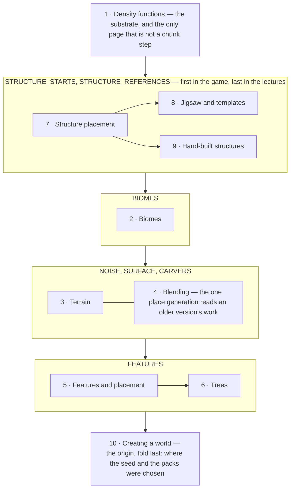

# XII · World generation

> Verified against **Minecraft 26.2** · Part XII · a world made out of one number per point, decided before anything about it exists, and reproducible from a seed and a data pack alone.

Everything in this part is determined by two things: the world seed, and the
data packs enabled when the world is opened — `WorldLoader.load` re-reads the
worldgen registries out of the current packs every time, so only the seed and
the dimension list are actually saved. No entity, no player and no tick has
any say in it. Give the same seed and the same packs to two copies of the game
and they will agree, block for block, forever — which is the property
speedrunners, seed-hunting sites and structure finders all depend on. It holds
not because nothing here reads the world — the decoration step reads block
states, heights and the carving mask through `PlacementContext`, and the
surface pass reads its neighbours' biomes — but because **everything it reads
is itself a function of that seed and those packs**. There is one deliberate
exception, and it is the only place generation reads something the current
seed did not produce:
[the boundary with chunks an older version generated](blending.md).

What a player recognises the part by is the seam: the flat shelf of ground
under a village that was not there before, the cave that is flooded the
moment you break into it, the desert that becomes a jungle along a ragged
line, the tree that grows up through another tree.

Counting `world/level/levelgen` and `world/level/biome` together — one class
per file, one line per line of decompiled source, the way
[the atlas](../../maps/README.md) counts everything else — that is **451
classes and 45,700 lines**. This part does not cover all of it;
[what this book skips](../anatomy/what-this-book-skips.md) says which parts
are declined and why.

## The shape of the part

Part XII is **a substrate, a pipeline, and a wing** — and the wing runs
first while being taught last. Part IV owns the conveyor that runs the
statuses ([the chunk generation pipeline](../world/chunk-generation-pipeline.md));
this part is the cargo of seven of them.

Read the outer chain as the order the game runs, and the numbers as the order
to watch. They disagree on purpose. A structure is *decided* two statuses
before the biomes and the terrain it will stand in exist — it asks the
generator directly for the numbers it needs rather than reading a chunk — and
it writes its blocks four statuses later, inside the decoration step. Putting
the three structure pages last keeps that whole arc in one place, at the cost
of one forward topic: five of the six pages before them reach for the
beardifier — three by link, two by name — before the page that owns it.

The substrate arrow means *is made of*, not *happens before*. Four of the
nine pages below it are consumers of the density graph — the biome sampler is
six of its functions, the aquifer is four more, ore veins are three, and the
beardifier is a node the chunk splices in. The decoration and structure
packages never mention `DensityFunction` at all; they reach the substrate only
through the beardifier and the heights the generator hands them.

The tenth page is the part's origin, told last. The object every other page
reads — the seed and the map of dimensions, each a generator built out of
noise settings, biome sources and placed features — is a tree of everything
the first nine explain, so the page that says where it came from is a
closer with nine satisfied references rather than an opener with nine
forward ones.

## Before you start

[The chunk generation pipeline](../world/chunk-generation-pipeline.md) from
Part IV, and not optionally. It is the only page that says *when* any of this
runs, what the twelve chunk statuses are, how the dependency pyramid keeps
neighbours out of each other's way, and which thread each step is on. Seven
of the ten pages here name a status, and four of them open on one.

[Chunk anatomy](../world/chunk-anatomy.md), for what is being written into —
sections, the two paletted containers, and the heightmaps the terrain steps
maintain by hand.

[Environment attributes and timelines](../world/environment-attributes-and-timelines.md),
also from Part IV, for lecture two: `Biome` has been hollowed out, and the sky,
the fog, the music and a dozen gameplay switches now reach the player through a
stack of modifier layers in which the biome is one layer rather than the owner.

[Codecs, NBT and JSON](../foundations/codecs-nbt-json.md) and
[identifiers and registries](../foundations/identifiers-and-registries.md)
from Part II, because worldgen is the most thoroughly data-driven system in
the game and this part assumes the dynamic-registry model rather than
re-teaching it. [The data-driven type pattern](../foundations/data-driven-types.md)
lists fifty-six instances of the pattern, and twenty-six of them are owned by
a page in this part.

## Watch in this order

1. [Density functions](density-functions.md) — the substrate, and the
   abstract one. Three forms of one graph, two rewrites, and six caches that
   cache nothing until something else installs them.
2. [Biomes](biomes.md) — a nearest-neighbour search in seven dimensions, one
   of which is not sampled from the world at all, and the two biome borders
   the game keeps a couple of blocks apart.
3. [Terrain](terrain.md) — noise, surface and carvers. Seven hundred and
   sixty-eight cells filled from their corners, and a cave whose water was
   decided before the cave was.
4. [Blending at the old-chunk border](blending.md) — the one place world
   generation reads the world. Sixteen columns an old chunk re-measures out
   of its own blocks, and a seam where the terrain splines are switched
   off entirely.
5. [Features and placement](features-and-placement.md) — decoration as a
   stream of positions folded through filters, in an order the whole
   dimension agreed on before any chunk existed.
6. [Trees](trees.md) — one algorithm with five slots in it, and the
   clearance scan that runs after the crown has been sized.
7. [Structure placement](structure-placement.md) — the part's policy page.
   A lottery that never looks at the world, an absence stored as a hole, and
   a command that generates chunks to answer a question.
8. [Jigsaw and templates](jigsaw-and-templates.md) — how a village assembles
   itself, and how any piece becomes blocks. A growth limit that works by
   taking the right pool away.
9. [Hand-built structures](hand-built-structures.md) — the older assembler,
   which is still most of the code. Four families of piece grammar, and the
   one structure that throws itself away and starts again.
10. [Creating a world](creating-a-world.md) — where the seed and the data
    packs came from. A screen that is a running data-pack load with widgets
    on it, settings carried across a reload by being serialised to JSON, and
    a Cancel button that does not undo.

Two comes before three: `ChunkStatus.BIOMES` is the parent of
`ChunkStatus.NOISE`, it is where the terrain's own workspace is built, and the
surface pass reads the biome. Four needs both, and reaches one status forward:
the last of its five consumers is a border tick run at `ChunkStatus.FEATURES`.
Seven
comes before eight and nine, which are alternatives to each other rather
than a sequence. Ten can be watched first by a viewer who wants the origin
before the machinery, at the cost of nine forward references.

## Reference this part uses

[Density-function nodes](../../reference/density-function-nodes.md) is the
catalogue behind lecture one: all thirty-four node types in registration
order, what each takes, and what the per-chunk rewrite turns it into.
[Registries](../../reference/registries.md) for the fourteen *worldgen/*
registries a data pack writes into, and
[the data-driven type pattern](../foundations/data-driven-types.md) for why
some of them are frozen at startup and some reload with the world.
[Diagram lanes](../../reference/lanes.md) for the abbreviations these figures
use. [Naming drift](../../reference/naming-drift.md) has twelve rows for
this part, all of them re-derived and none of them changed since pass 2.
[Level data and rules](../../reference/level-data-and-rules.md) for which
file the seed, the dimensions and the rules each end up in, which lecture
nine links to rather than restates. And
[the glossary](../../reference/glossary.md) for *density function*,
*aquifer*, *beardifier*, *NoiseChunk*, *blending data*, *old chunk*,
*PlacedFeature*, *jigsaw*, *world preset* and *world gen settings*.

Where the part stops: what happens to a chunk *after* `ChunkStatus.FEATURES`
— lighting, spawning, promotion to a live chunk, and being saved or sent — is
Part IV. What the client is told about any of it is Part IX, and the answer
is the finished chunk with none of the machinery: block states and the biome
palette in one buffer, the heightmaps, and the block entities.

---

*Rules: names, never code · how the system works, not how the code reads ·
newest version only · every backticked name passes `tools/verify_names.py`.*
