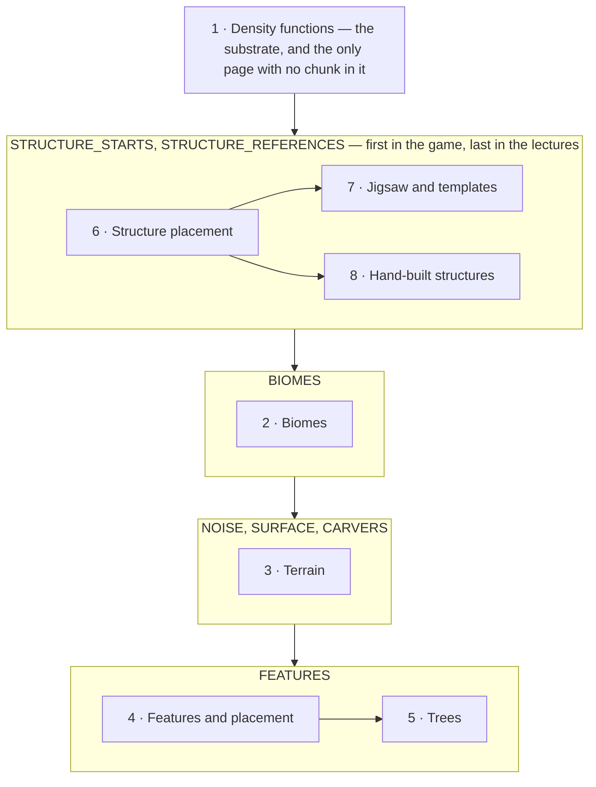

# XII · World generation

> Verified against **Minecraft 26.2** · Part XII · a world made out of one number per point, decided before anything about it exists, and reproducible from a seed and a data pack alone.

Everything in this part is determined by two things: the world seed, and the
data packs loaded when the world was created. No entity, no player, no
previously generated chunk and no tick has any say in it. Give the same seed
to two copies of the game and they will agree, block for block, forever —
which is the property speedrunners, seed-hunting sites and structure finders
all depend on, and it holds because **nothing here reads the world it is
building**, with one deliberate exception at the boundary with chunks an
older version generated.

What a player recognises the part by is the seam: the flat shelf of ground
under a village that was not there before, the cave that is flooded the
moment you break into it, the desert that becomes a jungle along a ragged
line, the tree that grows up through another tree.

Counting `world/level/levelgen` and `world/level/biome` together — one class
per file, one line per line of decompiled source, the way
[the atlas](../../maps/README.md) counts everything else — that is **423
classes and 45,600 lines**. This part does not cover all of it;
[what this book skips](../anatomy/what-this-book-skips.md) says which parts
are declined and why.

## The shape of the part

Part XII is **a substrate, a pipeline, and a wing** — and the wing runs
first while being taught last. Part IV owns the conveyor that runs the
statuses ([the chunk generation pipeline](../world/chunk-generation-pipeline.md));
this part is the cargo of six of them.

Read the outer chain as the order the game runs, and the numbers as the order
to watch. They disagree on purpose. A structure is *decided* two statuses
before the biomes and the terrain it will stand in exist — it asks the
generator directly for the numbers it needs rather than reading a chunk — and
it writes its blocks four statuses later, inside the decoration step. Putting
the three structure pages last keeps that whole arc in one place, at the cost
of one forward reference: the terrain pages mention the beardifier before the
page that owns it.

The substrate arrow means *is made of*, not *happens before*. Every other
page in the part is a consumer of the density graph — the biome sampler is
six of its functions, the aquifer is four more, ore veins are three, and the
beardifier is a node the chunk splices in.

## Before you start

[The chunk generation pipeline](../world/chunk-generation-pipeline.md) from
Part IV, and not optionally. It is the only page that says *when* any of this
runs, what the twelve chunk statuses are, how the dependency pyramid keeps
neighbours out of each other's way, and which thread each step is on. Every
page here begins by naming a status.

[Chunk anatomy](../world/chunk-anatomy.md), for what is being written into —
sections, the two paletted containers, and the heightmaps the terrain steps
maintain by hand.

[Codecs, NBT and JSON](../foundations/codecs-nbt-json.md) and
[identifiers and registries](../foundations/identifiers-and-registries.md)
from Part II, because worldgen is the most thoroughly data-driven system in
the game and this part assumes the dynamic-registry model rather than
re-teaching it. [The data-driven type pattern](../foundations/data-driven-types.md)
names five of its instances in this part alone.

## Watch in this order

1. [Density functions](density-functions.md) — the substrate, and the
   abstract one. Three forms of one graph, two rewrites, and six caches that
   cache nothing until something else installs them.
2. [Biomes](biomes.md) — a nearest-neighbour search in seven dimensions, one
   of which is not sampled from the world at all, and the two biome borders
   the game keeps a couple of blocks apart.
3. [Terrain](terrain.md) — noise, surface and carvers. Seven hundred and
   sixty-eight cells filled from their corners, and a cave whose water was
   decided before the cave was.
4. [Features and placement](features-and-placement.md) — decoration as a
   stream of positions folded through filters, in an order the whole
   dimension agreed on before any chunk existed.
5. [Trees](trees.md) — one algorithm with five slots in it, and the
   clearance scan that shortens the trunk and not the crown.
6. [Structure placement](structure-placement.md) — the part's policy page.
   A lottery that never looks at the world, an absence stored as a hole, and
   a command that generates chunks to answer a question.
7. [Jigsaw and templates](jigsaw-and-templates.md) — how a village assembles
   itself, and how any piece becomes blocks. A growth limit that works by
   offering the wrong pool.
8. [Hand-built structures](hand-built-structures.md) — the older assembler,
   which is still most of the code. Four families of piece grammar, and the
   one structure that throws itself away and starts again.

Two and three can be watched in either order — they are independent statuses
and neither reads the other. Six comes before seven and eight, which are
alternatives to each other rather than a sequence.

## Reference this part uses

[Density-function nodes](../../reference/density-function-nodes.md) is the
catalogue behind lecture one: all thirty-four node types in registration
order, what each takes, and what the per-chunk rewrite turns it into.
[Registries](../../reference/registries.md) for the dozen worldgen registries
a data pack writes into, and
[the data-driven type pattern](../foundations/data-driven-types.md) for why
some of them are frozen at startup and some reload with the world.
[Diagram lanes](../../reference/lanes.md) for the abbreviations these figures
use. [Naming drift](../../reference/naming-drift.md) has thirteen rows for
this part, all of them re-derived and none of them changed since pass 2. And
[the glossary](../../reference/glossary.md) for *density function*,
*aquifer*, *beardifier*, *NoiseChunk*, *PlacedFeature* and *jigsaw*.

Where the part stops: what happens to a chunk *after* `ChunkStatus.FEATURES`
— lighting, spawning, promotion to a live chunk, and being saved or sent — is
Part IV. What the client is told about any of it is Part IX, and the answer
is "finished blocks, and nothing else".

---

*Rules: names, never code · how the system works, not how the code reads ·
newest version only · every backticked name passes `tools/verify_names.py`.*
