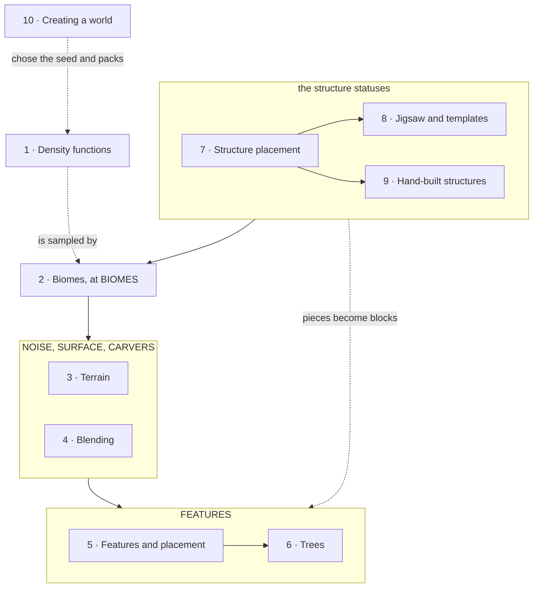

# XII · World generation

> Verified against **Minecraft 26.2** · Part XII · the one system in the game that nothing can perturb: a world reproducible from a seed and a data pack alone, and the single deliberate exception to it.

What a player recognises the part by is the seam: the flat shelf of ground
under a village that was not there before, the cave that is flooded the
moment you break into it, the desert that becomes a jungle along a ragged
line, the tree that grows up through another tree.

Everything in this part is determined by two things: the world seed, and the
data packs enabled when the world is opened — `WorldLoader.load` re-reads the
worldgen registries out of the current packs every time, so only the seed and
the dimension list are actually saved. No entity, no player and no tick has
any say in it. Give the same seed and the same packs to two copies of the game
and they will agree, block for block, forever — which is the property
speedrunners, seed-hunting sites and structure finders all depend on. It holds
not because nothing here reads the world — the decoration step reads block
states, heights and the carving mask through `PlacementContext`
([features and placement](features-and-placement.md#the-fold)), and the
carvers read a whole neighbourhood of chunks for the biome that seeds each
cave ([terrain](terrain.md#carving-and-who-chooses-the-block)) — but because
**everything it reads is itself a function of that seed and those packs**.
There is one deliberate
exception, and it is the only place generation reads something the current
seed did not produce:
[the boundary with chunks an older version generated](blending.md#one-measurement-five-consumers).

Counting `world/level/levelgen` and `world/level/biome` together, the way
[the atlas](../../maps/README.md) counts everything else, that is
{{#include ../../generated/part-worldgen.md}} — and two of those classes are
the standing counter-example to the paragraph above. `PatrolSpawner` and
`PhantomSpawner` sit in these packages, run on the server tick, and belong to
Parts III and VI.

## The shape of the part

Part XII is **a substrate, a pipeline, and a wing**. The substrate is the
scalar field every terrain step samples; the pipeline is the chunk being made,
step by step; the wing is the three structure lectures, which run *first* in
the game and are taught *last* here. Part IV owns the conveyor that runs the
statuses ([the chunk generation
pipeline](../world/chunk-generation-pipeline.md#the-pyramid-drawn)); this part
is the cargo of seven of them.

The numbers below are the order to watch and the arrows the order the game
runs, and the disagreement between them is the argument for the order.

*The part laid against the chunk-status ladder and numbered to the watch
order; a solid arrow is the order the game runs, a dashed one says what it
means in its label. The structure arc, at `ChunkStatus.STRUCTURE_STARTS` and
`ChunkStatus.STRUCTURE_REFERENCES`, is first in the game and last in the
lectures.*

A structure is *decided* at `ChunkStatus.STRUCTURE_STARTS`, two statuses before
the biomes it will stand in exist, and writes no block until
`ChunkStatus.FEATURES`, three statuses after the noise fill: told in run order
it is two lectures with six between them, and told last it is one arc — the
dashed arrow from the structure box to `ChunkStatus.FEATURES` is that gap. The
arrow out of lecture ten is the same trade at the other end. Both cost one thing, a forward
topic — three of the six pages before the structure arc reach for the beardifier
before the page that owns it
([structure placement](structure-placement.md#the-ground-bends-before-the-ground-exists)).

The arrow out of lecture one means *is sampled by* rather than *happens before*:
the biome step is the first status to read the field, through the
`NoiseChunk` built there. The decoration and structure packages never mention `DensityFunction` at all,
and reach the substrate only through the beardifier and the heights the
generator hands them
([density functions](density-functions.md#seed-once-per-dimension)).

## Before you start

[The chunk generation pipeline](../world/chunk-generation-pipeline.md#the-pyramid-drawn)
from Part IV, and not optionally. It is the only page that says *when* any of
this runs, what the twelve chunk statuses are, how the dependency pyramid keeps
neighbours out of each other's way, and
[which thread each step is on](../world/chunk-generation-pipeline.md#dispatch-and-why-the-parallelism-is-smaller-than-the-thread-names).
Eight of the ten pages here name a status, and two of them open on one.

[Chunk anatomy](../world/chunk-anatomy.md#sections-and-their-four-counters),
for what is being written into — sections, the two paletted containers, and
[the heightmaps](../world/chunk-anatomy.md#the-six-heightmaps) the terrain
steps maintain by hand. And
[environment attributes and timelines](../world/environment-attributes-and-timelines.md),
also from Part IV, for lecture two: `Biome` has been hollowed out, and the sky,
the fog, the music and a dozen gameplay switches now reach the player through a
stack of modifier layers in which the biome is one layer rather than the owner.

[Codecs, NBT and JSON](../foundations/codecs-nbt-json.md#where-the-registry-context-comes-from)
and
[identifiers and registries](../foundations/identifiers-and-registries.md#when-a-world-opens)
from Part II, because worldgen is the most thoroughly data-driven system in
the game and this part assumes the dynamic-registry model rather than
re-teaching it. [The data-driven type
pattern](../foundations/data-driven-types.md#fifty-six-of-them)
lists fifty-six instances of the pattern, and twenty-six of them are owned by
a page in this part — more than any other part of the book.

## Watch in this order

1. [Density functions](density-functions.md) — the substrate, and the
   abstract one. Three forms of one graph, two rewrites, and six caches that
   cache nothing until something else installs them.
2. [Biomes](biomes.md) — a nearest-neighbour search in seven dimensions, one
   of which is not sampled from the world at all, and the two biome borders
   the game keeps a couple of blocks apart.
3. [Terrain](terrain.md) — noise, surface and carvers. Seven hundred and
   sixty-eight cells filled from their corners, and a cave whose water was
   decided before the cave was.
4. [Blending at the old-chunk border](blending.md) — the one place world
   generation reads the world. Sixteen columns an old chunk re-measures out
   of its own blocks, and a seam where the terrain splines are switched
   off entirely.
5. [Features and placement](features-and-placement.md) — decoration as a
   stream of positions folded through filters, in an order the whole
   dimension agreed on before any chunk existed — and which a data pack can
   make impossible.
6. [Trees](trees.md) — one algorithm with five slots in it, and the
   clearance scan that runs after the crown has been sized.
7. [Structure placement](structure-placement.md) — the part's policy page.
   A lottery that never looks at the world, an absence stored as a hole, and
   a command that generates chunks to answer a question.
8. [Jigsaw and templates](jigsaw-and-templates.md) — how a village assembles
   itself, and how any piece becomes blocks. A growth limit that works by
   taking the right pool away.
9. [Hand-built structures](hand-built-structures.md) — the older assembler,
   which is still most of the code. Four families of piece grammar, and the
   one structure that throws itself away and starts again.
10. [Creating a world](creating-a-world.md) — where the seed and the data
    packs came from. A screen that is a running data-pack load with widgets
    on it, settings carried across a reload by being serialised to JSON, and
    a Cancel button that does not undo.

Watch one to six straight through: that is the chunk being made, in the order
it is made, and each page needs the one before it. `ChunkPyramid` makes
`ChunkStatus.BIOMES` a requirement of both `ChunkStatus.NOISE` and
`ChunkStatus.SURFACE`, so two really does come before three, and four needs
both. Then stop and read seven, eight and nine as one arc — eight and nine are
alternatives to each other, not a sequence, so either order works. Ten is the
only page that moves: a viewer who wants the origin before the machinery can
watch it first, at the cost of nine forward references.

## Where the part stops

At `ChunkStatus.FEATURES`. What happens to a chunk after that — lighting,
spawning, promotion to a live chunk, and being saved — is Part IV; what the
client is told about any of it is Part IX, and the answer is the finished
chunk with none of the machinery.

It stops in a second direction too:
{{#include ../../generated/coverage-worldgen.md}}, and almost all of them are
one shape — **an algorithm that writes blocks and adds no mechanism.**
Sixty-two of the seventy-four classes in the *feature* package are one
`Feature` each — icebergs, geodes, lakes, coral, the End spikes — with
thirty-six more as their configurations, and beside them four smaller families
of the same kind: the block predicates, the height providers, the state
providers and the rule tests, whose members are combinators over a shape one of
these pages already teaches. Naming them would be a catalogue, and
[what this book skips](../anatomy/what-this-book-skips.md) declines it. What
the part owes, and pays, is the head of each family — on
[features and placement](features-and-placement.md#what-a-feature-may-write-and-where-it-may-read),
[trees](trees.md#the-trunk-placers),
[terrain](terrain.md#carving-and-who-chooses-the-block) and
[jigsaw and templates](jigsaw-and-templates.md#the-processors-and-what-the-shipped-lists-use).

## Reference this part uses

[Density-function nodes](../../reference/density-function-nodes.md#the-table)
is the catalogue behind lecture one: all thirty-four node types, what each
takes, what the per-chunk rewrite turns it into, what range each reports, and
which ids the shipped data writes. Beside it,
[registries](../../reference/registries.md) for the fourteen *worldgen/*
registries a data pack writes into;
[structure spawn overrides](../../reference/structure-spawn-overrides.md) for
the six structures whose JSON replaces the biome's spawn list, which lecture
eight places and Part VI runs;
[level data and rules](../../reference/level-data-and-rules.md#dimensions-and-the-seed)
for which file the seed, the dimensions and the rules end up in, which lecture
ten links to rather than restates; and
[math and primitives](../../reference/math-and-primitives.md#two-random-families-and-two-that-are-neither)
for the two random families the determinism this page opens on actually lives
in. [Diagram lanes](../../reference/lanes.md) and
[naming drift](../../reference/naming-drift.md)'s thirteen rows for this part
are the two every part uses. And
[the glossary](../../reference/glossary.md) holds this part's ten headwords,
which is where to go first if a page above spends one before you have met it.

---

*Rules: names, never code · how the system works, not how the code reads ·
newest version only · every backticked name passes `tools/verify_names.py`.*
