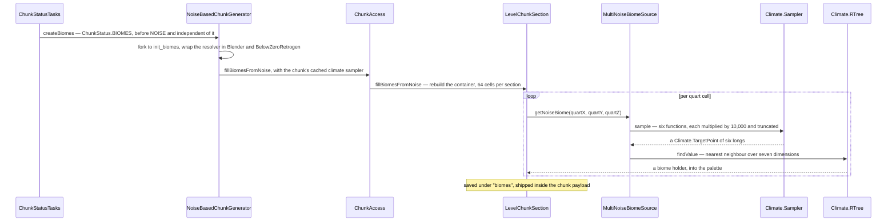

# Biomes

> Verified against **Minecraft 26.2** · Part XII · A point in the world gets a biome: six numbers quantised to integers, a nearest-neighbour search in seven dimensions, and the two different answers the game keeps for the same block.

Walk out of a desert into a jungle and watch the ground. The grass changes
colour at one line. The fog and the sky change at a *different* line, a
couple of blocks away. Neither is a bug and neither is a rendering artefact:
the game genuinely stores one biome per four-by-four-by-four volume and then
answers "which biome is this block in?" **two different ways**, one jittered
and one not, and different systems ask different questions. The surprise is
which side each thing is on — grass colour, mob spawning and whether water
freezes are all on the *jittered* side, and the sky is not.

A biome is a label in the chunk at quarter resolution plus a bundle of
consequences hanging off that label. In 26.2 the bundle has been hollowed
out: `Biome` itself holds five things, and most of what a player would call
"the biome" now lives in the environment-attribute stack, where the biome is
one layer among several rather than the owner
([environment attributes and timelines](../world/environment-attributes-and-timelines.md)).

## The cast

| class | what it decides | when |
|---|---|---|
| `BiomeSource` | which biome a quart cell gets. Four implementations, and `BiomeSource.possibleBiomes` is the memoised pre-filter everything else leans on | `ChunkStatus.BIOMES`, on a worldgen worker |
| `Climate.Sampler` | the six climate numbers at a point — the cacheless copy of the router's climate half ([density functions](density-functions.md)) | per quart cell |
| `Climate.ParameterList` | the search space: one `Climate.ParameterPoint` per biome, indexed by a `Climate.RTree` | built once per world |
| `OverworldBiomeBuilder` | the overworld's parameter table, in Java — temperature, humidity, erosion and continentalness bands over six tables of biome keys | build time |
| `LevelChunkSection` | where the answer lives: a second `PalettedContainer` keyed by biome holder, two bits per axis | written once, saved, shipped |
| `BiomeManager` | the jitter — which biome this *block* gets, as opposed to which cell it is in | every gameplay read |
| `Biome` | five things: climate settings, an `EnvironmentAttributeMap`, `BiomeSpecialEffects`, generation settings and mob settings | — |
| `EnvironmentAttributeMap` | the biome's contribution to sky, fog, music and a dozen gameplay switches — as *modifiers*, not values | per attribute, per read |

## The trace: a chunk's biomes

The two wrappers in the second arrow only do anything beside chunks an
older version generated — [blending at the old-chunk border](blending.md)
is where they are explained.

**Biomes are decided before terrain, and not for it.** `ChunkStatus.BIOMES`
precedes `ChunkStatus.NOISE`, and the two do not depend on each other at all:
the noise fill never reads a biome. What makes a jungle and its terrain agree
is that both were computed from the *same* noise router — `RandomState` builds
the climate sampler out of the depth, continents, erosion and ridges
functions, the very ones that shape the land. Neither was consulted about the
other. The biome does not touch a block until `ChunkStatus.SURFACE`
([terrain](terrain.md)).

Only the noise generator does the above. `FlatLevelSource` and
`DebugLevelSource` inherit the base implementation and use the level's
uncached sampler directly. The End is a `NoiseBasedChunkGenerator` like the
overworld and the nether — just with `TheEndBiomeSource` in front of it,
which does not do a climate search at all: it thresholds a single erosion
sample outside a fixed central radius.

## The search, and the axis that is not sampled

`Climate.quantizeCoord` multiplies each of the six climate values by ten
thousand and truncates, so the entire search is integer arithmetic. The
target is a `Climate.TargetPoint` of six longs; each biome declares a
`Climate.ParameterPoint` of six `Climate.Parameter` intervals; and
`Climate.ParameterList.findValue` walks a `Climate.RTree` — six children per
node — minimising the sum of squared distances from the target to each
interval.

Except the count is seven, not six. `Climate.PARAMETER_COUNT` is **7** and
`Climate.RTree.create` refuses a point that does not supply seven, because
each `Climate.ParameterPoint` carries a scalar *offset* alongside its six
intervals, and `Climate.TargetPoint.toParameterArray` appends a literal zero
as the seventh coordinate of every query. So the seventh term of the metric
is always that biome's offset squared: a fixed penalty added to its score. It
is a "make this biome harder to win" dial, not anything sampled from the
world.

The tree also remembers. `Climate.RTree` keeps the winning leaf in a
`ThreadLocal` and seeds the next search with it as the initial candidate.
Adjacent quart cells almost always resolve to the same biome, so the walk
usually prunes immediately — which is what makes filling sixty-four cells a
section cheap. The tree is therefore stateful per thread, though never
incorrect: the remembered leaf is only a starting bound.

One thing the parameter table does *not* have is a separate underground
system. `OverworldBiomeBuilder.addUndergroundBiomes` and
`OverworldBiomeBuilder.addBottomBiome` place dripstone caves, lush caves and
the deep dark into the same seven-dimensional table by their *depth* band. A
cave biome is an ordinary entry that happens to win only below the surface.

## The two borders

The label goes into the section's biome palette — two bits per axis, so
**sixty-four biome cells per section** — is written to NBT under *biomes*
([chunk storage](../world/chunk-storage.md)) and is shipped to the client
inside the chunk payload. From then on it is *stored*, not computed, which is
why `/fillbiome` can exist at all and why `ClientboundChunksBiomesPacket`
exists to tell the client about it.

And then two different readers ask for it two different ways.

| | the jittered read | the exact read |
|---|---|---|
| entry point | `LevelReader.getBiome` → `BiomeManager.getBiome` | `BiomeManager.getNoiseBiomeAtPosition`, and on the client `BiomeManager.getNoiseBiomeAtQuart` |
| what it does | offsets by two, takes the eight surrounding quart corners, and picks the one minimising `BiomeManager.getFiddledDistance` — a seeded hash worth up to ±0.45 of a cell per axis | floors to the quart cell and reads the palette |
| who uses it | freezing and precipitation, mob spawning, commands — **and block tint**: grass, foliage and water colour, through `ClientLevel.calculateBlockTint` | the environment-attribute stack, and nothing else |
| what it looks like | the ragged border | the straight one |

**Block tint is on the jittered side**, which is the half of this that
surprises people: grass colour follows exactly the same ragged line as
whether snow falls. What softens the colour boundary in game is not the biome
lookup but a box blur on top of it — `ClientLevel.calculateBlockTint`
averages the result over the columns named by the *biome blend radius* option
and caches that in a `BlockTintCache`. Fog and sky are the ones on the other
border.

The client's exact read is the more expensive of the two, and
unconditionally so: `EnvironmentAttributeProbe.tick` runs a
`GaussianSampler` over the neighbourhood **every tick**, accumulating whole
`EnvironmentAttributeMap`s into a `SpatialAttributeInterpolator`. Whether an
attribute is actually interpolated is tested later, when the layer is
applied, and one that fails the test falls back to a single unfuzzed lookup.
The server never interpolates at all — it passes no interpolator.

## What a biome still owns

Five things, and two of them are read only by worldgen.

`Biome.climateSettings` is precipitation, a base temperature, a
`Biome.TemperatureModifier` and downfall. Temperature is the interesting one:
`Biome.getHeightAdjustedTemperature` samples noise per block high above sea
level — which is why snow lines are ragged rather than flat — and `Biome`
keeps a fixed-size per-thread cache in front of it that evicts rather than
grows. Most of the public surface is the questions rather than the number:
`Biome.warmEnoughToRain`, `Biome.coldEnoughToSnow`, `Biome.shouldFreeze`,
`Biome.shouldSnow`. `Biome.getBaseTemperature` is the raw, uncached,
unadjusted escape hatch.

`BiomeSpecialEffects` is, in 26.2, **only block tint** — five fields, all of
them colours or a grass-colour modifier. Fog, sky, clouds, ambient sound,
music and particles have all left it for the attribute stack
([lightmap, fog and sky](../rendering/lightmap-fog-and-sky.md)). And when
those five are silent, the tint does not come from the biome at all: grass
and foliage colour are a lookup into the colormap images by temperature and
downfall, through `GrassColor`, `FoliageColor` and `DryFoliageColor`. "The
biome's grass colour" is usually just the two climate numbers that index a
texture.

`Biome.getAttributes` returns the `EnvironmentAttributeMap`, whose entries
are `AttributeModifier`s rather than values — so a biome may *override* the
layer below it or merely *modify* it, which is how a swamp thickens water fog
without naming a distance. One restriction lands here specifically:
`EnvironmentAttributeMap.CODEC_ONLY_POSITIONAL` means a biome may not set a
non-positional attribute at all.

`BiomeGenerationSettings` is a set of carvers and one set of placed features
*per decoration step*, read by [features and placement](features-and-placement.md);
`BiomeGenerationSettings.getBoneMealFeatures` is its only reader outside
worldgen, and its one caller is `GrassBlock`. `MobSpawnSettings` is the
weighted spawn lists `NaturalSpawner` reads
([entity lifecycle](../entities/entity-lifecycle.md)) — and its entry
constructor silently rewrites any miscellaneous-category entity type to pig.

## Questions players ask

**Why do I always spawn near the origin?** Because the world spawn is a
climate search, not a terrain search. `Climate.SpawnFinder` and
`Climate.findSpawnPosition` look for the point whose climate best matches the
noise settings' spawn target, in two spiral passes out to a maximum radius of
2,048 blocks, with depth pinned to zero and the fitness deliberately biased
toward the origin so that a tie lands near 0,0. A dimension whose settings
name no spawn target skips the search and answers the origin exactly.

**Why does `/locate biome` find biomes in chunks I have never visited?**
Because it asks the generator, not the world. `BiomeSource.findClosestBiome3d`
spirals through `BiomeSource.getNoiseBiome` with the live sampler and never
reads a palette — so it finds biomes in ungenerated chunks and will **never**
find one placed by `/fillbiome`. It pre-filters against
`BiomeSource.possibleBiomes`, so asking for an impossible biome fails
instantly rather than after six thousand blocks of spiral.

**Can a data pack change the overworld's biome layout?** Not the vanilla
preset. `OverworldBiomeBuilder` is hardcoded, and the data-pack element that
would carry a parameter list serialises to nothing but a preset name — there
are two presets. A pack can supply its own parameter list for a multi-noise
source; it cannot edit the one that ships.

**What does the client actually have?** A hollow `Biome`.
`Biome.NETWORK_CODEC` sends the climate settings, the *syncable* attributes
and the effects, and substitutes empty generation and mob settings — features,
carvers and spawn lists never cross the wire. And when a client asks for a
biome in a chunk it does not have, it gets plains.

**Does the biome decide which mobs spawn?** Not on its own, and not first.
`ChunkGenerator.getMobsAt` consults `Structure.spawnOverrides` *before*
`Biome.getMobSettings` ([structure placement](structure-placement.md)), and
nether fortresses are special-cased earlier still, inside `NaturalSpawner`.

**Why does adding one biome change the whole dimension?** Because
`EnvironmentAttributeSystem` builds one positional layer per attribute that
*any* biome in the registry mentions, at level construction. One new biome
naming one new attribute adds a layer every position in the dimension then
carries.

## Where to look

`Biome` · `Biome.getAttributes` · `BiomeSpecialEffects` ·
`BiomeSource.getNoiseBiome` · `BiomeSource.possibleBiomes` ·
`MultiNoiseBiomeSource` · `TheEndBiomeSource` · `Climate.Sampler.sample` ·
`Climate.quantizeCoord` · `Climate.ParameterList.findValue` ·
`Climate.RTree.search` · `Climate.PARAMETER_COUNT` ·
`Climate.findSpawnPosition` · `OverworldBiomeBuilder.addBiomes` ·
`OverworldBiomeBuilder.addUndergroundBiomes` ·
`LevelChunkSection.fillBiomesFromNoise` · `BiomeManager.getBiome` ·
`BiomeManager.getFiddledDistance` · `BiomeManager.getNoiseBiomeAtPosition` ·
`BiomeGenerationSettings` · `MobSpawnSettings` · `BiomeColors` ·
`EnvironmentAttributeProbe`

---

*Rules: names, never code · how the system works, not how the code reads ·
newest version only · every backticked name passes `tools/verify_names.py`.*
