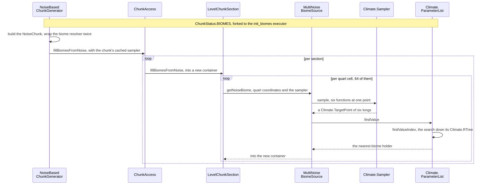

# Biomes

> Verified against **Minecraft 26.2** · Part XII · A point in the world gets a biome: six numbers quantised to integers, a nearest-neighbour search in seven dimensions, and the two different answers the game keeps for the same block.

Walk out of a desert into a jungle and watch the ground. The grass changes
colour at one line. The fog and the sky change at a *different* line, a
couple of blocks away. Neither is a bug and neither is a rendering artefact:
the game genuinely stores one biome per four-by-four-by-four volume and then
answers "which biome is this block in?" **two different ways**, one jittered
and one not, and different systems ask different questions. The surprise is
which side each thing is on — grass colour, mob spawning and whether water
freezes are all on the *jittered* side, and the sky is not.

A biome is a label in the chunk at quarter resolution — one per
four-by-four-by-four block volume, which this book and the code both call a
**quart cell** — plus a bundle of consequences hanging off that label. In 26.2 the bundle has been hollowed
out: `Biome` itself holds five things, and most of what a player would call
"the biome" now lives in the environment-attribute stack, where the biome is
one layer among several rather than the owner
([environment attributes and timelines](../world/environment-attributes-and-timelines.md)).

## The cast

| class | what it decides | when |
|---|---|---|
| `BiomeSource` | which biome a quart cell gets, through the `BiomeResolver` interface the chunk fill takes. `BiomeSources.bootstrap` registers four — `MultiNoiseBiomeSource`, `TheEndBiomeSource`, `FixedBiomeSource` (one biome everywhere, which is what a buffet world is) and `CheckerboardColumnBiomeSource` (a listed few in squares) — and `BiomeSource.possibleBiomes` is the memoised pre-filter everything else leans on | `ChunkStatus.BIOMES`, on a worldgen worker |
| `Climate.Sampler` | the six climate numbers at a point — temperature, humidity, continentalness, erosion, depth and weirdness. Filling a chunk uses `NoiseChunk.cachedClimateSampler`, the chunk-wrapped copy; `RandomState.sampler` is the flattened, cacheless one everything outside a chunk asks ([density functions](density-functions.md#seed-once-per-dimension)) | per quart cell |
| `Climate.ParameterList` | the search space: one `Climate.ParameterPoint` per biome, indexed by a `Climate.RTree` | built once per world |
| `OverworldBiomeBuilder` | the overworld's parameter table, in Java — temperature, humidity, erosion and continentalness bands over six tables of biome keys | build time |
| `LevelChunkSection` | where the answer lives: a second `PalettedContainer` keyed by biome holder, two bits per axis | written once, saved, shipped |
| `BiomeManager` | the jitter — which biome this *block* gets, as opposed to which cell it is in | every gameplay read |
| `Biome` | five things: climate settings, an `EnvironmentAttributeMap`, `BiomeSpecialEffects`, generation settings and mob settings | — |
| `EnvironmentAttributeMap` | the biome's contribution to sky, fog, music and the gameplay switches — as *modifiers*, not values. Twenty gameplay attributes exist; the sixty-six vanilla biome files touch three of them between them, and fifty-one touch none | per attribute, per read |

## Deciding a chunk's biomes, cell by cell

*A chunk's biomes are 64 climate searches per section, each a sample at one point and a nearest-neighbour walk; no block is read and none is written.*

The two wrappers in the first arrow only do anything beside chunks an
older version generated — [blending at the old-chunk
border](blending.md#what-the-blender-actually-answers)
is where they are explained.

**Biomes are decided before terrain, and not for it.** `ChunkPyramid` makes
`ChunkStatus.BIOMES` a requirement of both `ChunkStatus.NOISE` and
`ChunkStatus.SURFACE`, so the order is enforced — but what the noise step
collects from it is the chunk's `NoiseChunk` workspace, not a single biome
label. **The noise fill never reads a biome.** What makes a jungle and its
terrain agree is that both were computed from the *same* noise router:
`RandomState` builds the climate sampler out of the depth, continents, erosion
and ridges functions, the very ones that shape the land — under the
`Climate.Sampler` names *depth*, *continentalness*, *erosion* and *weirdness*.
Neither was consulted about the other. The biome does not touch a block until
`ChunkStatus.SURFACE`
([terrain](terrain.md#the-surface-pass-and-the-two-places-it-breaks-its-own-rule)).

The *fork* at the top of that trace is not the noise generator's: the base
`ChunkGenerator.createBiomes` forks to *init_biomes* too, so a superflat world
leaves the worldgen executor for its biomes exactly as the overworld does.
What `NoiseBasedChunkGenerator` overrides it for is the three lines below
the fork — building the chunk's `NoiseChunk`, wrapping the resolver, and
sampling through the chunk's cached sampler instead of the level's uncached
one. `FlatLevelSource` and `DebugLevelSource` do none of those. The End is a
`NoiseBasedChunkGenerator` like the
overworld and the nether — just with `TheEndBiomeSource` in front of it,
which does not do a climate search at all: it thresholds a single erosion
sample outside a fixed central radius.

## The search, and the axis that is not sampled

`Climate.quantizeCoord` multiplies each of the six climate values by ten
thousand and truncates, so the entire search is integer arithmetic. The
target is a `Climate.TargetPoint` of six longs; each biome declares a
`Climate.ParameterPoint` of six `Climate.Parameter` intervals; and
`Climate.ParameterList.findValue` walks a `Climate.RTree` — six children per
node — minimising the sum of squared distances from the target to each
interval.

Except the count is seven, not six. `Climate.PARAMETER_COUNT` is **7** and
`Climate.RTree.create` refuses a point that does not supply seven, because
each `Climate.ParameterPoint` carries a scalar *offset* alongside its six
intervals, and `Climate.TargetPoint.toParameterArray` appends a literal zero
as the seventh coordinate of every query. So the seventh term of the metric
is always that biome's offset squared: a fixed penalty added to its score. It
is a "make this biome harder to win" dial, not anything sampled from the
world.

The tree also remembers. `Climate.RTree` keeps the winning leaf in a
`ThreadLocal` and seeds the next search with it as the initial candidate.
Adjacent quart cells almost always resolve to the same biome, so the walk
usually prunes immediately — which is what makes filling sixty-four cells a
section cheap. The tree is therefore stateful per thread, though never
incorrect: the remembered leaf is only a starting bound.

Which is also the answer to whether a pack can move the overworld's biomes
around: not the vanilla preset. `OverworldBiomeBuilder` is hardcoded Java, and
the data-pack element that would carry it,
`MultiNoiseBiomeSourceParameterList`, serialises to nothing but a preset name —
`MultiNoiseBiomeSourceParameterLists` registers two. A pack may supply its own
parameter list inline for a multi-noise source; it cannot edit the one that
ships.

One thing the parameter table does *not* have is a separate underground
system. `OverworldBiomeBuilder.addUndergroundBiomes` and
`OverworldBiomeBuilder.addBottomBiome` place dripstone caves, lush caves,
sulfur caves and the deep dark into the same seven-dimensional table by their
*depth* band. A
cave biome is an ordinary entry that happens to win only below the surface.

## The two borders

The label goes into the section's second paletted container — two bits per
axis, so **sixty-four biome cells per section**
([sections and their four counters](../world/chunk-anatomy.md#sections-and-their-four-counters)) —
and is shipped to the client
inside the chunk payload. From then on it is *stored*, not computed, which is
why `FillBiomeCommand` can exist at all and why `ClientboundChunksBiomesPacket`
exists to tell the client about the result.

And then two different readers ask for it two different ways.

| | the jittered read | the exact read |
|---|---|---|
| entry point | `LevelReader.getBiome` → `BiomeManager.getBiome` | `BiomeManager.getNoiseBiomeAtPosition`, and on the client `BiomeManager.getNoiseBiomeAtQuart` |
| what it does | offsets by two, takes the eight surrounding quart corners, and picks the one minimising `BiomeManager.getFiddledDistance` — a seeded hash worth up to ±0.45 of a cell per axis | floors to the quart cell and reads the palette |
| who uses it | freezing and precipitation, mob spawning, commands, the surface rules during generation — **and block tint**: grass, foliage and water colour, through `ClientLevel.calculateBlockTint` | the environment-attribute stack, and nothing else that goes through `BiomeManager` |
| what it looks like | the ragged border | the straight one |

**Block tint is on the jittered side**, which is the half of this that
surprises people: grass colour follows exactly the same ragged line as
whether snow falls. What softens the colour boundary in game is not the biome
lookup but a box blur on top of it, which the client owns
([the client level](../client/the-client-level.md#the-four-tint-caches-and-the-soft-biome-edge)).
Fog and sky are the ones on the other border.

The client's exact read is the more expensive of the two, and it is spent
**unconditionally**: the probe that feeds the attribute stack runs its
Gaussian pass over the neighbourhood every tick whether or not any attribute
at that position is interpolated at all, because the test is applied later,
when the layer is applied
([the same value on the client](../world/environment-attributes-and-timelines.md#the-same-value-on-the-client)).
The server never interpolates and never pays it — it passes no interpolator.

## What a biome still owns

Five things, and none of them stops being read once the chunk is generated —
`NaturalSpawner` asks the mob settings every tick and a bone-mealed grass block
asks the generation settings.

`Biome.climateSettings` is precipitation, a base temperature, a
`Biome.TemperatureModifier` and downfall. Temperature is the interesting one:
`Biome.getHeightAdjustedTemperature` samples noise per block high above sea
level — which is why snow lines are ragged rather than flat — and `Biome`
keeps a fixed-size per-thread cache in front of it that evicts rather than
grows. Most of the public surface is the questions rather than the number:
`Biome.warmEnoughToRain`, `Biome.coldEnoughToSnow`, `Biome.shouldFreeze`,
`Biome.shouldSnow`. `Biome.getBaseTemperature` is the raw, uncached,
unadjusted escape hatch.

`BiomeSpecialEffects` is, in 26.2, **only block tint** — five fields, all of
them colours or a grass-colour modifier, and only the water colour is
mandatory. Fog, sky, clouds, ambient sound, music and particles have all left
it for the attribute stack. What is left is read by nothing in the attribute
system at all: `BiomeColors` reaches these five fields through four
`ColorResolver`s, with no probe and no layer stack anywhere in the path
([lightmap, fog and sky](../rendering/lightmap-fog-and-sky.md)). And when the
four optional ones are silent, the tint does not come from the biome at all:
grass
and foliage colour are a lookup into the colormap images by temperature and
downfall, through `GrassColor`, `FoliageColor` and `DryFoliageColor`. "The
biome's grass colour" is usually just the two climate numbers that index a
texture.

`Biome.getAttributes` returns the `EnvironmentAttributeMap`, and what a biome
puts in it are *modifiers*, not values — which is how a swamp thickens water
fog without naming a distance
([arguments, not values](../world/environment-attributes-and-timelines.md#arguments-not-values)).
One restriction lands here specifically:
`EnvironmentAttributeMap.CODEC_ONLY_POSITIONAL` means a biome may not set a
non-positional attribute at all. And one cost lands on the whole dimension:
a positional layer is built per attribute that **any** biome in the registry
mentions, at level construction
([the stack a value falls through](../world/environment-attributes-and-timelines.md#the-stack-a-value-falls-through)),
and a layer is not free where the biome that wanted it is absent — adding one
biome adds a layer every position in the dimension then falls through.

`BiomeGenerationSettings` holds two lists, and they are read by different
pages: the placed features, one set *per decoration step*, by
[features and placement](features-and-placement.md#one-chunks-decoration-from-the-corner-outward),
and the carvers by [terrain](terrain.md#carving-and-who-chooses-the-block), at
a different status. `BiomeGenerationSettings.getBoneMealFeatures` is its only
reader outside worldgen, and its one caller is `GrassBlock`. `MobSpawnSettings`
is the weighted spawn lists `NaturalSpawner` reads — though a structure at the
position can replace them outright before the spawner ever looks
([a spawn attempt is a filter](../entities/entity-lifecycle.md#a-spawn-attempt-is-a-filter-not-a-conversation)) —
and its entry constructor silently rewrites any miscellaneous-category entity
type to pig.

Of the five, the client is given two and a half. `Biome.NETWORK_CODEC` sends
the climate settings, the *syncable* attributes and the effects, and
substitutes empty generation and mob settings: features, carvers and spawn
lists never cross the wire. And when a client asks for a biome in a chunk it
does not have, it gets plains.

## Questions players ask

**Why do I always spawn near the origin?** Because the *chunk* is chosen by a
climate search — once, the first time the world is ever loaded, and never
again ([building the levels](../server/starting-a-server.md#building-the-levels)
owns *when*). `Climate.SpawnFinder` and `Climate.findSpawnPosition` look for
the point whose climate best matches the noise settings' spawn target, in two
spiral passes out to a maximum radius of 2,048 blocks, with depth pinned to
zero and the fitness deliberately biased toward the origin so that a tie lands
near 0,0. `MinecraftServer` then keeps only that answer's chunk and does a
terrain search inside it: an eleven-by-eleven chunk spiral of
`PlayerSpawnFinder.getSpawnPosInChunk`, over a first guess taken from
`ChunkGenerator.getSpawnHeight` or, failing that, the *WORLD_SURFACE*
heightmap. A dimension whose settings name no spawn target skips the climate
half and starts that spiral at the origin chunk.

**Why does `/locate biome` find biomes in chunks I have never visited?**
Because it asks the generator, not the world. `BiomeSource.findClosestBiome3d`
spirals through `BiomeSource.getNoiseBiome` with the live sampler and never
reads a palette — so it finds biomes in ungenerated chunks and will **never**
find one placed by `/fillbiome`. It pre-filters against
`BiomeSource.possibleBiomes`, so asking for an impossible biome fails
instantly rather than after a spiral out to six thousand four hundred blocks.

## Where to look

`BiomeSource.getNoiseBiome` is the one method the whole search hangs off; read
it with `MultiNoiseBiomeSource` beside it, and `TheEndBiomeSource` after, for
the source that does no search at all. Then `Climate` whole — it is one file
holding `Climate.Sampler`, `Climate.quantizeCoord`,
`Climate.ParameterList.findValue` and the `Climate.RTree` — and
`Climate.PARAMETER_COUNT` is the line that explains the seventh dimension.
`OverworldBiomeBuilder.addBiomes` is vanilla's table, in Java, and
`OverworldBiomeBuilder.addUndergroundBiomes` is where the cave biomes turn out
not to be a separate system. For the two reads, `BiomeManager.getBiome` against
`BiomeManager.getNoiseBiomeAtPosition`, with `BiomeManager.getFiddledDistance`
as the jitter itself. Finish at `Biome`, which is short, and at
`LevelChunkSection.fillBiomesFromNoise` for where the answer is stored. Two
doors the page does not open: `BiomeColors`, for how the five effects fields
reach a rendered block, and `Climate.RTree.search`, for the walk the page only
describes.

---

*Rules: names, never code · how the system works, not how the code reads ·
newest version only · every backticked name passes `tools/verify_names.py`.*
