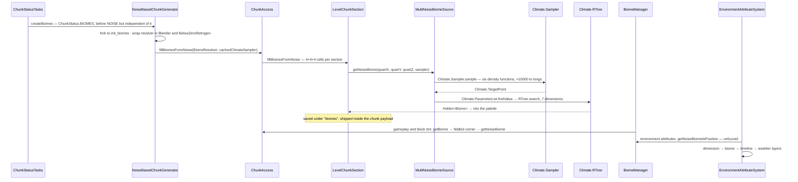

# Biomes

> Verified against **Minecraft 26.2** · Part XII · A point in the world gets a biome: a climate sample, a nearest-neighbour search in seven dimensions, and the two different answers the game keeps for the same block.

## Responsibility

A biome is a label stored in the chunk at quarter resolution, and a bundle
of consequences attached to that label: which features decorate, which mobs
spawn, whether water freezes, what colour the grass is, and — through the
environment-attribute stack — what the sky looks like. In 26.2 the bundle
has been hollowed out. `Biome` holds five things and most of what a player
would call "the biome" now lives in `EnvironmentAttributeMap`, where the
biome is one layer among several rather than the owner.

The one sentence a player recognises: *the line where the desert becomes
the jungle* — and this page's best surprise is that there are two such
lines, a couple of blocks apart, and different systems use different ones.

## The data it owns

- **`Biome`** — a final class (not a record) with a private constructor,
  holding exactly five things:
  `Biome.climateSettings` (the private record `Biome.ClimateSettings`:
  precipitation, temperature, `Biome.TemperatureModifier`, downfall),
  `Biome.attributes` (an `EnvironmentAttributeMap`), `Biome.specialEffects`,
  `Biome.generationSettings` and `Biome.mobSettings`. Plus one
  `ThreadLocal` temperature cache.
- **`BiomeSpecialEffects`** — in 26.2 this is **only block tint**: five
  fields, `BiomeSpecialEffects.waterColor`,
  `BiomeSpecialEffects.foliageColorOverride`,
  `BiomeSpecialEffects.dryFoliageColorOverride`,
  `BiomeSpecialEffects.grassColorOverride` and
  `BiomeSpecialEffects.grassColorModifier`. Fog, sky, clouds, ambient
  sound, music and particles have all left it
  ([lightmap, fog and sky](../rendering/lightmap-fog-and-sky.md)).
- **`EnvironmentAttributeMap`** — what `Biome.getAttributes` returns. Each
  `EnvironmentAttributeMap.Entry` is an `AttributeModifier` plus its
  argument, so a biome may **override** a value or merely **modify** the
  one coming from the layer below. The attributes themselves are
  `EnvironmentAttribute`s from `EnvironmentAttributes` — *visual*
  (`EnvironmentAttributes.FOG_COLOR`, `EnvironmentAttributes.SKY_COLOR`,
  `EnvironmentAttributes.CLOUD_HEIGHT`, `EnvironmentAttributes.STAR_BRIGHTNESS`…),
  *audio* (`EnvironmentAttributes.AMBIENT_SOUNDS`,
  `EnvironmentAttributes.BACKGROUND_MUSIC`) and *gameplay*
  (`EnvironmentAttributes.PIGLINS_ZOMBIFY`,
  `EnvironmentAttributes.CREAKING_ACTIVE`,
  `EnvironmentAttributes.VILLAGER_ACTIVITY`…). The biome is the second of
  the four *kinds* of layer `EnvironmentAttributeSystem` stacks — and the
  only positional one, since the dimension is a constant and the timeline
  and weather layers are time-based. The count of actual layers is larger
  and varies: one per timeline the dimension declares, one per weather
  attribute, and on the client two more that `ClientLevel` adds for sky
  colour and sky light. The system itself, the modifier model and the
  timelines that drive it are
  [environment attributes and timelines](../world/environment-attributes-and-timelines.md).
  Note the one restriction that lands on biomes:
  `EnvironmentAttributeMap.CODEC_ONLY_POSITIONAL` means a biome may not
  set a non-positional attribute at all.
- **`BiomeGenerationSettings`** — a `HolderSet` of
  `ConfiguredWorldCarver`s and one `HolderSet` of `PlacedFeature`s **per
  `GenerationStep.Decoration` ordinal**. Read by
  [features and placement](features-and-placement.md).
  `BiomeGenerationSettings.getCarvers` is read at `ChunkStatus.CARVERS` and
  `BiomeGenerationSettings.hasFeature` by `BiomeFilter` during decoration;
  `BiomeGenerationSettings.getBoneMealFeatures` is the only read from
  outside worldgen, and its one caller is `GrassBlock`.
- **`MobSpawnSettings`** — `MobSpawnSettings.creatureGenerationProbability`,
  a weighted list of `MobSpawnSettings.SpawnerData` per `MobCategory`, and
  `MobSpawnSettings.MobSpawnCost` per entity type. Read by `NaturalSpawner`
  ([entity lifecycle](../entities/entity-lifecycle.md)).
- **`BiomeSource`** — the abstract chooser, and a `BiomeResolver`. Four
  implementations, their codecs registered by `BiomeSources.bootstrap`:
  `FixedBiomeSource`, `CheckerboardColumnBiomeSource`,
  `MultiNoiseBiomeSource`, `TheEndBiomeSource`.
  `BiomeSource.possibleBiomes` is memoised and used as a pre-filter by the
  structure-set filter and by `/locate biome` — but *not* by the surface
  step, which reads the biomes actually written into the chunk palettes
  through `ChunkAccess.collectBiomesInPalette` instead. Beyond
  `BiomeSource.getNoiseBiome` there are three search entry points:
  `BiomeSource.findClosestBiome3d`, `BiomeSource.findBiomeHorizontal` and
  `BiomeSource.getBiomesWithin`.
- **`Climate`** — the search space. `Climate.Sampler` is a record of six
  `DensityFunction`s plus a spawn target; `Climate.TargetPoint` is six
  quantised longs; `Climate.Parameter` is an interval;
  `Climate.ParameterPoint` is six intervals **plus a scalar offset**;
  `Climate.ParameterList` holds the pairs and builds a `Climate.RTree`.
  `Climate.quantizeCoord` multiplies by 10,000 and truncates, so the whole
  search is integer arithmetic. `Climate.PARAMETER_COUNT` is seven, and
  `Climate.RTree.create` refuses a point that does not supply seven.
  The same class also finds the **world spawn**: `Climate.SpawnFinder` and
  `Climate.findSpawnPosition` search for the point whose climate best
  matches the sampler's spawn target, two spiral passes out to a maximum
  radius of 2,048 blocks, with depth pinned to zero and the fitness biased
  toward the origin so a tie lands near 0,0. A sampler with an empty spawn
  target skips the search and answers `BlockPos.ZERO`.
- **`OverworldBiomeBuilder`** — the overworld's parameter table, in Java:
  temperature, humidity, erosion and continentalness bands, and six tables
  of biome keys — five 5×5 (middle, middle-variant, plateau,
  plateau-variant, shattered) plus a 2×5 ocean table, deep and shallow
  across the five temperature bands — assembled by
  `OverworldBiomeBuilder.addBiomes`. The **cave biomes are entries in the
  same table**: `OverworldBiomeBuilder.addUndergroundBiomes` and
  `OverworldBiomeBuilder.addBottomBiome` place dripstone caves, lush caves
  and the deep dark by their *depth* band, so there is no separate
  underground biome system — a cave biome is an ordinary 7-D entry that
  happens to win only below the surface.
  `MultiNoiseBiomeSourceParameterList` is a data-pack registry element
  holding a `MultiNoiseBiomeSourceParameterList.Preset` and the
  `Climate.ParameterList` it expands to; only the *codec* reduces to a
  preset name, and there are only two presets.
- **Where the label lives** — a second `PalettedContainer` in every
  `LevelChunkSection`, keyed by `Holder<Biome>`, built with
  `Strategy.createForBiomes`: **two bits per axis**, so 4×4×4 = 64 biome
  cells per section ([chunk anatomy](../world/chunk-anatomy.md)).
  `PalettedContainerFactory.defaultBiome` is plains.
- **`BiomeManager`** — the fuzz layer between "which quart cell" and "which
  biome does this *block* have". `BiomeManager.obfuscateSeed` derives its
  seed; `BiomeManager.getFiddledDistance` jitters the eight surrounding
  quart corners.

## When it runs

- **Once per chunk, on a worldgen worker.** `ChunkStatus.BIOMES` sits after
  structure references and **before `ChunkStatus.NOISE`** — but the two
  steps do not depend on each other at all. `NoiseBasedChunkGenerator.createBiomes`
  forks to `Util.backgroundExecutor` under the name *init_biomes*. The
  biome does not affect a block until `ChunkStatus.SURFACE`.
- **Constantly, on the server thread**, for gameplay: precipitation and
  freezing in `ServerLevel.tickPrecipitation`, spawning in
  `NaturalSpawner`, commands.
- **Every client tick, on the main thread**, for looks:
  `EnvironmentAttributeProbe.tick` on the `Camera` re-samples the
  neighbourhood; `EnvironmentAttributeProbe.getValue` interpolates it per
  frame. Block tint is resolved on the render path through `BiomeColors`.

## The trace: a point gets a biome

1. **Generation.** `ChunkGenerator.createBiomes` is the status task's entry.
   `NoiseBasedChunkGenerator` wraps its `BiomeSource` in the blending and
   below-zero-retrogen resolvers and uses
   `NoiseChunk.cachedClimateSampler` so the sample hits the chunk's caches
   ([density functions](density-functions.md)). Only `FlatLevelSource` and
   `DebugLevelSource` inherit the base `ChunkGenerator.createBiomes`, which
   uses `RandomState.sampler` directly — the End is a
   `NoiseBasedChunkGenerator` like the overworld and the nether, just with
   `TheEndBiomeSource` in front of it.
2. **Per quart cell.** `ChunkAccess.fillBiomesFromNoise` walks the sections;
   `LevelChunkSection.fillBiomesFromNoise` rebuilds the container and
   writes 64 entries per section.
3. **The sample.** `Climate.Sampler.sample` converts quart to block
   coordinates, builds a single-point context, computes the six functions —
   temperature, humidity, continentalness, erosion, depth, weirdness — and
   quantises each into a `Climate.TargetPoint`.
4. **The search.** `MultiNoiseBiomeSource.getNoiseBiome` hands the target to
   `Climate.ParameterList.findValue`, which walks the `Climate.RTree`:
   six children per node, the metric a sum of squared distances from the
   target to each `Climate.Parameter` interval, over seven dimensions. The
   winning `Climate.RTree.Leaf` carries the `Holder<Biome>`. The end does
   not do this at all — `TheEndBiomeSource` thresholds one erosion sample
   outside a fixed central radius.
5. **Storage.** The holder goes into the section's palette, is written to
   NBT under *biomes* ([chunk storage](../world/chunk-storage.md)) and is
   sent to the client inside the chunk payload
   ([what the client is told](../networking/what-the-client-is-told.md)).
6. **The fuzzed read — gameplay *and* block tint.** `LevelReader.getBiome`
   goes through `BiomeManager.getBiome`, which does not floor to the quart
   cell: it offsets by two, takes the eight surrounding corners, and picks
   the one minimising `BiomeManager.getFiddledDistance` — a seeded hash
   giving each corner up to ±0.45 of jitter per axis. That is the ragged
   border. The chosen corner then resolves through
   `ChunkAccess.getNoiseBiome` to the palette. Grass, foliage and water
   colour come through **this** path:
   `ClientLevel.calculateBlockTint` calls `LevelReader.getBiome`, then box-blurs the
   result over the `(2r+1)²` columns named by the *biome blend radius*
   option and caches it in a `BlockTintCache`.
7. **The unfuzzed read — environment attributes only.** Two different
   callers, two different methods.
   `EnvironmentAttributeSystem.addBiomeLayerForAttribute` reads
   `BiomeManager.getNoiseBiomeAtPosition` directly. The client's
   `EnvironmentAttributeProbe.tick` instead runs `GaussianSampler.sample`
   over `BiomeManager.getNoiseBiomeAtQuart` **every tick and
   unconditionally**, accumulating whole `EnvironmentAttributeMap`s into a
   `SpatialAttributeInterpolator`; the
   `EnvironmentAttribute.isSpatiallyInterpolated` test happens later, when
   the layer is applied, and an attribute that fails it falls back to the
   single unfuzzed lookup. The server never interpolates — it passes no
   interpolator at all.

## Interfaces

- **Called by:** `ChunkGenerator.createBiomes` and
  `ChunkGenerator.getMobsAt`; `NaturalSpawner`;
  `ServerLevel.tickPrecipitation`; `SurfaceRules` and `SurfaceSystem`;
  `LocateCommand` and `FillBiomeCommand`; on the client, `BiomeColors`,
  `BiomeAmbientSoundsHandler` and `SkyRenderer` through the probe.
- **Calls into:** `Climate.Sampler` and, behind it, the density-function
  graph; nothing else. Choosing a biome reads no blocks.
- **Crosses the network as:** the registry itself, synced with
  `Biome.NETWORK_CODEC`; the palette, inside the chunk payload; and
  `ClientboundChunksBiomesPacket` after `/fillbiome`
  (`ChunkMap.resendBiomesForChunks`).
- **Data-driven by:** `Registries.BIOME` (a data-pack registry loaded with
  `Biome.DIRECT_CODEC`), `Registries.MULTI_NOISE_BIOME_SOURCE_PARAMETER_LIST`,
  and `BiomeTags`. `BuiltInRegistries.BIOME_SOURCE` and
  `BuiltInRegistries.ENVIRONMENT_ATTRIBUTE` are code registries — a pack
  adds biomes, not kinds of biome source.

## Invariants and surprises

- **The game keeps two biomes for the same block, deliberately** — and the
  split is not the one you would guess. Gameplay uses the fuzzed
  `BiomeManager.getBiome`; only the environment-attribute stack uses the
  unfuzzed value. **Block tint is on the fuzzed side**: grass, foliage and
  water colour follow exactly the same ragged border as freezing and mob
  spawning, because `ClientLevel.calculateBlockTint` calls `LevelReader.getBiome`. What
  softens the colour boundary is not the biome lookup but the blur on top
  of it. Fog and sky are the ones on the other border.
- **`BiomeSpecialEffects` is only block tint now.** Anything else you
  remember on it is an `EnvironmentAttribute`, and the biome is one layer
  in a stack — it can multiply the dimension's value rather than replace
  it, which is how swamps thicken water fog without naming a distance.
- **The search is seven-dimensional and the seventh axis is a handicap.**
  `Climate.TargetPoint.toParameterArray` appends a literal zero as the
  seventh coordinate of every *query*; each biome's
  `Climate.ParameterPoint.parameterSpace` puts the degenerate interval
  `[offset, offset]` in that slot. So the seventh term of the metric is
  always `offset²` — a fixed penalty added to that biome's score, a "make
  this biome harder to win" dial rather than anything sampled from the
  world.
- **Biomes are decided before terrain, but not *for* it.**
  `ChunkStatus.BIOMES` precedes `ChunkStatus.NOISE` and the two are
  independent: `NoiseBasedChunkGenerator.fillFromNoise` never reads a
  biome. Neither shapes the other — both are read off the *same* noise
  router, since `RandomState` builds the `Climate.Sampler` out of
  `NoiseRouter.depth`, `NoiseRouter.continents`, `NoiseRouter.erosion` and
  `NoiseRouter.ridges`, the very functions that shape the land. A jungle
  and its terrain agree because they were computed from one set of
  numbers, not because either was consulted about the other. The biome
  first touches a block at `ChunkStatus.SURFACE`
  ([the pipeline](../world/chunk-generation-pipeline.md)).
- **Biomes are stored, not computed** — at 1/64 the resolution of blocks,
  in a second palette per section. `/fillbiome` exists because the stored
  value can be made to disagree with what the generator would say, and
  `ClientboundChunksBiomesPacket` exists to tell the client about it.
- **`/locate biome` asks the generator, not the world.**
  `BiomeSource.findClosestBiome3d` spirals through `BiomeSource.getNoiseBiome` with the
  live sampler and never reads a palette — so it finds biomes in
  ungenerated chunks and will never find one placed by `/fillbiome`. It
  pre-filters against `BiomeSource.possibleBiomes`, so an impossible biome
  fails instantly rather than after 6,400 blocks.
- **The overworld's biome table is code.** `OverworldBiomeBuilder` is a
  hardcoded parameter table; a pack can supply its own parameter list for a
  multi-noise source, but it cannot edit the vanilla preset — the data-pack
  element serialises to nothing but a preset name.
- **The client's `Biome` is hollow.** `Biome.NETWORK_CODEC` sends climate,
  the *syncable* attributes and the effects, and substitutes
  `BiomeGenerationSettings.EMPTY` and `MobSpawnSettings.EMPTY`. Features,
  carvers and spawn lists never cross the wire. And when a client asks for
  a biome in a chunk it does not have, it gets plains.
- **Structures outrank biomes for spawning.** `ChunkGenerator.getMobsAt`
  consults `Structure.spawnOverrides` before `Biome.getMobSettings`
  ([structures](structures.md)). And `MobSpawnSettings.SpawnerData`'s
  constructor silently rewrites any `MobCategory.MISC` entity type to pig.
- **Temperature is noisy above sea level and cached per thread.**
  `Biome.getHeightAdjustedTemperature` samples noise per block high up —
  that is why snow lines are ragged rather than flat — and `Biome` keeps a
  fixed-size, per-thread cache in front of it that evicts rather than
  grows. Most of the public API is the questions rather than the number —
  `Biome.warmEnoughToRain`, `Biome.coldEnoughToSnow`, `Biome.shouldFreeze`,
  `Biome.shouldSnow`, `Biome.getPrecipitationAt` — with
  `Biome.getBaseTemperature` the raw, uncached, unadjusted escape hatch.
- **The nearest-neighbour search remembers its last answer.**
  `Climate.RTree` keeps the winning leaf in a `ThreadLocal` and seeds the
  next search with it as the initial candidate. Adjacent quart cells almost
  always resolve to the same biome, so the walk usually prunes immediately
  — which is what makes filling 64 cells a section cheap. It also means the
  tree is stateful per thread, though never incorrect: the seed is only a
  starting bound.
- **`Biome.TemperatureModifier.FROZEN` is the odd one out.** Temperature is
  otherwise a flat per-biome constant with a height adjustment; the frozen
  modifier layers two noises to punch warm patches into frozen oceans. One
  of them, `Biome.BIOME_INFO_NOISE`, is marked for removal and is also what
  drives `BiomeSpecialEffects.GrassColorModifier.SWAMP`.
- **When the effects are silent, the tint comes from a texture.** With no
  override set, grass and foliage colour are a lookup into the colormap
  images by temperature and downfall (`GrassColor`, `FoliageColor`,
  `DryFoliageColor`) — so "the biome's grass colour" is usually not stored
  in the biome at all, only the two climate numbers that index it.
- **Adding one biome can change the whole dimension's layer stack.**
  `EnvironmentAttributeSystem` builds one positional layer per attribute
  *any* biome in the registry mentions, at level construction.

## Where to look

`Biome` · `Biome.BiomeBuilder` · `BiomeSpecialEffects` ·
`Biome.getAttributes` · `EnvironmentAttributeMap` ·
`EnvironmentAttributeSystem` · `BiomeSource.getNoiseBiome` ·
`MultiNoiseBiomeSource` · `Climate.Sampler.sample` ·
`Climate.ParameterList.findValue` · `Climate.RTree.search` ·
`OverworldBiomeBuilder.addBiomes` · `BiomeManager.getBiome` ·
`BiomeManager.getFiddledDistance` · `LevelChunkSection.fillBiomesFromNoise` ·
`Strategy.createForBiomes` · `BiomeColors` · `EnvironmentAttributeProbe`

---

*Rules: names, never code · how the system works, not how the code reads ·
newest version only · every backticked name passes `tools/verify_names.py`.*
