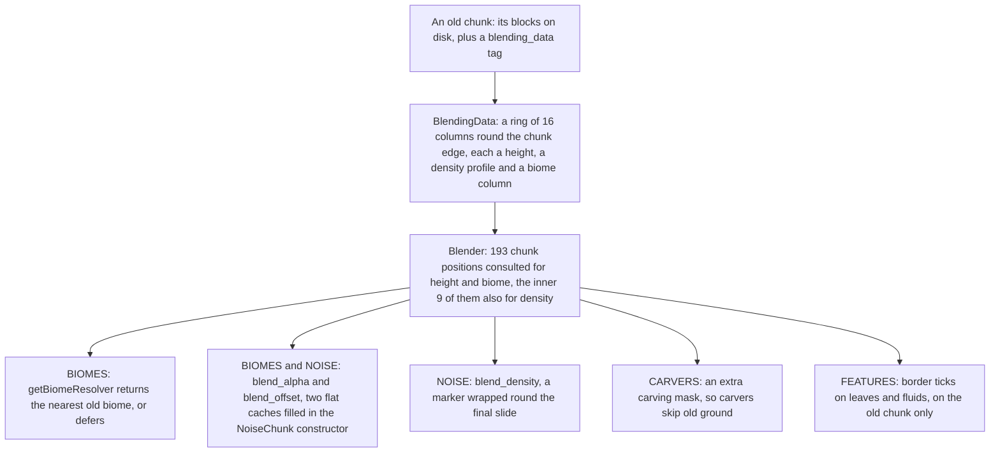
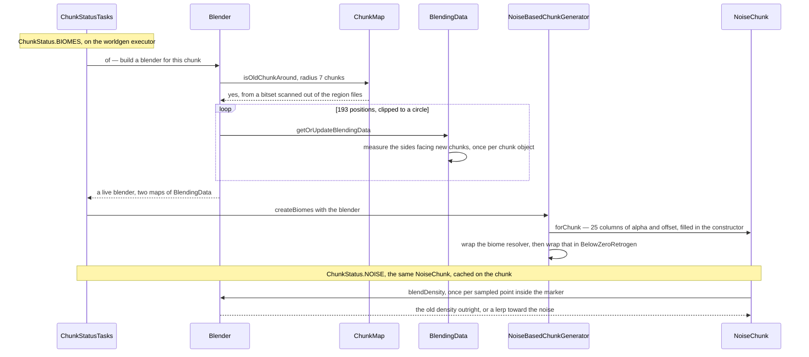

# Blending at the old-chunk border

> Verified against **Minecraft 26.2** · Part XII · a chunk generated beside one an older version left behind, and the five places its generation is bent toward that neighbour.

You are walking east through a world you have had for years. Behind you the
ground was decided by a version that is not this one; ahead of you it has not
been decided at all. Put the debug screen up and the chunk-generation entry
reads *Blending: Old* while you stand on the old side, and stops reading it
once you cross. For roughly a hundred blocks either side of that line the game
is generating chunks that are not free to be whatever the seed says — and
directly against the seam they are hardly generated at all. The three splines
that shape overworld terrain are swapped out for a ground height the game read
off the old chunk's blocks a moment earlier, the constant ten, and zero.

This is the deliberate exception [the part's premise](README.md) names.
Everywhere else in world generation, a chunk is a function of the seed and the
data packs. Here it is a function of the seed, the data packs, **and the
blocks in up to a hundred and ninety-three of its neighbours** — which the
game does not remember and has to go and measure, one column at a time.

## The flag is a nullable field, and looking for it costs a disk read

A chunk is old if `ChunkAccess.blendingData` is non-null. That is the whole
test: `ChunkAccess.isOldNoiseGeneration` returns exactly whether that field is
set, and the field is *final* — it arrives through the constructor from
`SerializableChunkData`, which reads a *blending_data* compound out of the
chunk's NBT, and nothing sets it afterwards. Which saves carry that key is
`util/datafix`'s business, which
[this book skips](../anatomy/what-this-book-skips.md); by the time world
generation sees a chunk the key is either there or it is not.

> **For a 1.21-era reader.** The class that used to read and write the chunk
> NBT is now `SerializableChunkData`, a record with a *blending_data*
> component and its own parse and write halves. The old *ChunkSerializer*
> name is gone.

The awkward part is that a chunk being generated cannot ask its neighbours
whether they are old, because most of them do not exist yet. So `Blender.of` —
the factory every noise-generation step calls — starts by asking the *save
file*. `WorldGenRegion.isOldChunkAround` hands the question to the level's
`ChunkMap`, which inherits `SimpleRegionStorage.isOldChunkAround` and lands on
`IOWorker.isOldChunkAround`. That walks the region files covering a square of
radius seven, and for each region it needs a `BitSet` with one bit per chunk,
built by scanning all 1,024 chunks in the region for two NBT fields and
nothing else: *DataVersion* and *blending_data*. A chunk counts as old if its
stored *DataVersion* is below 4882 or if it already carries a *blending_data*
compound. The scan runs on the background executor, the caller joins it, and
the bitset is kept in a 1,024-entry region cache.

**Every** chunk generated in **every** world pays for that lookup at least
twice, whatever generator the dimension uses:
`ChunkStatusTasks.generateBiomes` and `ChunkStatusTasks.generateNoise` both
evaluate `Blender.of` eagerly, before knowing whether the answer can possibly
be yes. The noise generator adds two more —
`NoiseBasedChunkGenerator.buildSurface`, eagerly again, and
`NoiseBasedChunkGenerator.applyCarvers`, the only call site written inside a
supplier and so the only one that can be skipped. When nothing is old the
bitsets come back empty and `Blender.of` hands back the shared empty blender,
which is not an empty map but an anonymous subclass overriding the three
answering methods with identities: alpha one, offset zero, density unchanged,
resolver returned as given.

## The cast

| class | what it decides | when |
|---|---|---|
| `Blender` | the four answers — the height alpha and offset, the blended density, the biome override, and where carvers may not dig | built per step, used on the worldgen executor |
| `BlendingData` | one old chunk's measurements: a ring of sixteen columns holding a height, a density profile and a biome column each | measured once per loaded chunk object |
| `IOWorker` | whether any chunk within seven is old, from a per-region `BitSet` scanned out of the region files | on the background executor, joined by the caller |
| `NoiseChunk` | where the answers enter the density graph: two pre-filled flat caches and one wrapper | `ChunkStatus.BIOMES` onward, cached on the chunk |
| `NoiseRouterData` | which router functions are blendable at all — three overworld splines and one post-process wrapper | world creation, once |
| `CarvingMask` | the extra predicate that makes carvers treat old ground as already carved | `ChunkStatus.CARVERS` |
| `BelowZeroRetrogen` | the separate world-deepening path that rides the same hooks | `ChunkStatus.NOISE` and `ChunkStatus.BIOMES` |
| `SerializableChunkData` | the *blending_data* key: which chunks are flagged, and which measurements survive a save | chunk load and save |

## One measurement, five consumers

`BlendingData` is gathered once and then read by five unrelated pieces of
machinery at four chunk statuses — three inside the density graph, two nowhere
near it.

Two maps, not one. `Blender.of` sweeps the square from seven chunks west to
seven chunks east and clips it to a circle — the test is that the squared
offsets sum to no more than sixty-four — which leaves **193 positions**. Every
one that yields data goes into the height-and-biome map; only the inner three
by three also goes into the density map. That asymmetry is the whole reason
the terrain seam is a hundred blocks wide and the cave seam is a handful.

A neighbour yields data only if it passes two tests in
`BlendingData.getOrUpdateBlendingData`: it carries a `BlendingData`, **and**
`ChunkAccess.getHighestGeneratedStatus` is not before `ChunkStatus.BIOMES`.
The second test is what keeps this honest — during the *BIOMES* step the
dependency window only guarantees neighbours at *STRUCTURE_STARTS*, so a
half-built chunk in the queue contributes nothing, and in practice the only
chunks that pass are ones loaded whole from the save.

**Seven** — the radius in chunks the height blend reaches, which `Blender`
derives from the twenty-seven-cell height range: four quart cells per section
across seven sections, less one, plus three, converted back to chunks. It sits
inside the radius-eight
dependency window every noise step declares, so none of the 193 reads can
trip `WorldGenRegion.getChunk`'s out-of-range crash.

## Sixteen columns, read out of blocks

`BlendingData` does not store a copy of the old terrain. It stores sixteen
columns in a ring round the chunk's edge, measured from the neighbour's blocks
the first time anyone asks. Seven of them are *inside*
indices — the corner and three more along the north edge, three along the
west — at block coordinates 0, 4, 8 and 12. The other nine are *outside*
indices, sampled at block coordinate 15 along the east and south edges, which
in cell arithmetic belong to the next chunk's first cell. Sixteen slots is
what `BlendingData.Packed`'s codec validates the saved height array against,
and it is exactly the array length the class computes from a chunk being four
quarts wide.

Which of the sixteen get filled depends on which way the chunk faces new
ground. `BlendingData.sideByGenerationAge` asks each of the eight `Direction8`
neighbours whether it is old, and `BlendingData.calculateData` fills only the
columns on the sides that are **not** — the ones facing chunks the game is
about to generate. There is one call site in the whole game and it passes
*false*, so "sides by generation age" only ever means "sides facing new
chunks". The method also guards on `BlendingData.hasCalculatedData`, so a
chunk object measures itself once and never again: whichever sides were new at
that moment are the sides it will carry until it is unloaded.

Each filled column gets three things. **A height**:
`BlendingData.getHeightAtXZ` starts at the *WORLD_SURFACE_WG* heightmap if the
chunk has one primed and at the top of the old area if not, then walks
straight down looking for one of eleven block types — podzol, gravel, grass,
stone, coarse dirt, sand, red sand, mycelium, snow, terracotta or dirt — and
returns the first Y at which it finds one, or the bottom of the old area if it
never does. **A density profile**: for each eight-block-tall cell,
`BlendingData` reads fifteen consecutive blocks downward, scoring each plus or
minus one for whether it is ground, and divides by fifteen — ground meaning
not air, not a leaf, not a log, not a mushroom block and with a non-empty
collision shape, so a cave counts as air and a tree does not count as terrain.
One more pass rewrites the two cells straddling the measured height so the
surface lands where the height said it did. And **a biome column**: one
`Biome` holder per four-block layer of the old area, read straight out of the
neighbour's biome container.

Of those three, **only the heights are saved.** `BlendingData.pack` writes the
minimum section, the maximum section and the sixteen doubles, and omits the
heights entirely if none of them was ever measured; the density array is
declared *transient* and the biome list is not in the codec at all. Unload the
region and come back and the game re-reads the neighbour's blocks to rebuild
both.

## Following one chunk through

The order matters in one non-obvious way. `NoiseChunk` is created at *BIOMES*,
not at *NOISE*, because the biome step needs the chunk's climate sampler, and
it is then cached on `ChunkAccess`. So the blender that reaches the density
graph is the one built at *BIOMES* — the later three are passed to
`ChunkAccess.getOrCreateNoiseChunk`, find it already created, and are thrown
away.

The twenty-five columns are the other thing worth noticing. Before any router
mapping runs, the `NoiseChunk` constructor loops over the chunk's five-by-five
grid of quart columns, calls `Blender.blendOffsetAndFactor` for each, and
fills two `NoiseChunk.FlatCache` instances. Only afterwards does
`NoiseChunk.wrapNew` swap `DensityFunctions.BlendAlpha` and
`DensityFunctions.BlendOffset` — by object identity, the same trick the
beardifier uses — for those already-full caches
([density functions](density-functions.md)). An empty blender skips the swap:
the two singletons stay the constants one and zero that they are, and a
*blend_density* marker is replaced by its own child.

## What the blender actually answers

Three questions, three different shapes of answer, and only two of them are
blends.

**Height, as an alpha and an offset.** `Blender.blendOffsetAndFactor` first
checks whether the sample point sits exactly on a measured column; if it does,
it returns alpha zero and the old height, converted by a fixed cubic. If not,
it walks every measured height in the height map, keeps those within
twenty-seven quart cells — a hundred and eight blocks — and averages them
weighted by the inverse fourth power of distance, with alpha the smoothstep of
the *nearest* distance over twenty-eight. Nothing in range means alpha one and
offset zero: the identity.

Alpha is then used as a mixing weight in `NoiseRouterData.splineWithBlending`,
which interpolates from a fixed target at alpha zero to
the real spline at alpha one, and this is where the page's opening claim comes
from. Exactly three router functions are built that way — *offset*, *factor*
and *jaggedness*, for each of the three overworld variants — and their targets
are, respectively, `DensityFunctions.BlendOffset`,
`NoiseRouterData.BLENDING_FACTOR` (the constant ten) and
`NoiseRouterData.BLENDING_JAGGEDNESS` (zero). Against the seam alpha is zero,
so overworld terrain is not shaped by its splines at all: the ground height is
whatever `BlendingData` measured, the factor is ten and the jaggedness is
nothing. The shipped data pack agrees — *blend_alpha* appears in nine density
function files and *blend_offset* in three, all of them under the three
overworld directories.

Because *offset* and *factor* are also the two inputs to
`NoiseRouterData.preliminarySurfaceLevel`, which `Aquifer.NoiseBasedAquifer`
reads to place its fluid levels, the water table follows the old ground. Nobody
wrote a rule for that: it falls out of the aquifer sampling a blended
function.

**Density, as a lerp with a very short reach.** `Blender.blendDensity` is
called per sample from inside `NoiseChunk.BlendDensity`, the wrapper the
*blend_density* marker becomes. It measures distance in cells with the Y
difference doubled — cells are twice as tall as they are wide — keeps
neighbours within two, and mixes toward the noise with an alpha of the closest
distance over three. An exact hit returns the old density with no mixing at
all. This one wrapper is in every dimension's router: *blend_density* appears
in all seven shipped noise settings, while the alpha and offset nodes are
overworld-only.

**Biome, as a replacement.** `Blender.getBiomeResolver` wraps the biome source
in a resolver that asks `Blender.blendBiome` first and only falls through when
it declines. And it is not a blend: it finds the nearest measured biome within
twenty-seven cells, adds twelve cells' worth of a fixed shift noise to that
distance, divides by twenty-eight, and returns the old biome if the result is
below one half and nothing at all if it is above. So the biome boundary is a
hard line at roughly half the terrain blending distance, roughened by noise —
one biome or the other, never a mixture, which is the only answer a palette of
biome holders can represent.

## The two consumers that are not density functions

**Carvers are told to stay out.** At *CARVERS*,
`Blender.addAroundOldChunksCarvingMaskFilter` collects the `BlendingData` of
all eight `Direction8` neighbours plus the chunk's own, turns each into a
`Blender.DistanceGetter` measuring distance to a box eight blocks in X and Z
and as tall as that chunk's old area, and installs the minimum of them as a
`CarvingMask.Mask` on the chunk's carving mask. A position within four blocks
of any such box — after each axis is displaced by the same shift noise,
scaled by four — reads as already carved. Since `WorldCarver.carveEllipsoid`
skips any position the mask already reports, the effect is that carvers refuse
to dig into or right up against old ground. The mask is additional: it is
consulted by `CarvingMask.get` alongside the real bits and never written to
the saved array.

**Leaves and water at the seam are marked for a second look.** At *FEATURES*,
after decoration, `ChunkStatusTasks.generateFeatures` calls
`Blender.generateBorderTicks` — and this is the one hook that fires on the
*old* side rather than the new one. It returns immediately unless the chunk
being generated carries a `BlendingData` of its own, which a chunk generated
fresh today never does: it acts only on an old chunk that is still being
carried through the statuses, one saved before *FEATURES* or one being
deepened. Given such a chunk it sweeps four Y levels — one below and one at
the bottom of the old area, one at and one above the top — across all 256
columns, and then, for each of the four horizontal neighbours that is *not*
old, walks the whole sixteen-wide face from the bottom of the old area up to
that column's *MOTION_BLOCKING* height. Every leaf block and every non-empty
fluid it passes goes to `ChunkAccess.markPosForPostProcessing`. Nothing is
changed: the positions are queued for the post-processing pass that runs when
the chunk becomes live, which is what makes water at the seam flow and
orphaned leaves decay instead of hanging there. The step's ordering is what
makes the heightmap read safe — `ChunkStatusTasks.generateFeatures` primes the
four final heightmaps before decorating, so *MOTION_BLOCKING* is current by
the time the border walk reads it.

## The other passenger

`BelowZeroRetrogen` is not blending, but it rides the same hooks and is easy
to mistake for it. A chunk carrying one is being *deepened* rather than
blended: `ChunkAccess.getHighestGeneratedStatus` folds its
`BelowZeroRetrogen.targetStatus` in, `ChunkStatusTasks.generateNoise` calls
`BelowZeroRetrogen.replaceOldBedrock` and then
`BelowZeroRetrogen.applyBedrockMask` if there are holes, and
`BelowZeroRetrogen.getBiomeResolver` wraps the blender's resolver in one more
layer that keeps three cave biomes from the new generation and takes
everything else from the chunk's existing biome column.

## Questions players ask

**Why is the seam wide for hills and narrow for caves?** Two maps, two radii.
Height and biome are averaged over every measured column within a hundred and
eight blocks, gathered from up to 193 chunks; density is mixed only from the
nine chunks nearest the one being generated, over two cells. The ground slopes
for a hundred blocks and the caves change their mind in eight.

**Can the blend leave a visible edge anyway?** Yes, twice over. A column whose
old surface is none of the eleven blocks the height scan recognises reports
the bottom of the old area instead, and that bogus height is averaged in with
the rest. And the biome switch is a threshold rather than a ramp, so the
surface rules can change block for block along a line while the terrain under
them is still sloping.

**Does any of this happen in a brand-new world?** The lookup does, the work
does not — `Blender.of` runs its region scan for every chunk in every world
and returns the empty blender when nothing is old. Development builds can
switch the whole thing off with the `SharedConstants.DEBUG_DISABLE_BLENDING`
flag, which short-circuits `Blender.of`, the carving-mask filter and the
border ticks alike.

## Where to look

Start at `Blender.of` and read down: the two maps, the two radii, the three
answering methods. Then `BlendingData.calculateData` and
`BlendingData.getHeightAtXZ` for what a measurement is, and
`BlendingData.Packed` for what survives a save. `NoiseChunk`'s constructor and
`NoiseChunk.wrapNew` show where the answers enter the density graph,
`NoiseRouterData` which three functions were built to receive them, and
`ChunkStatusTasks` when each hook fires.

---

*Rules: names, never code · how the system works, not how the code reads ·
newest version only · every backticked name passes `tools/verify_names.py`.*
