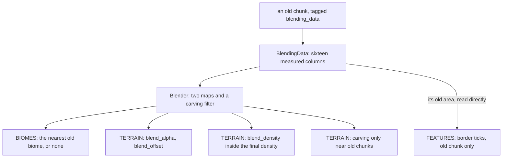
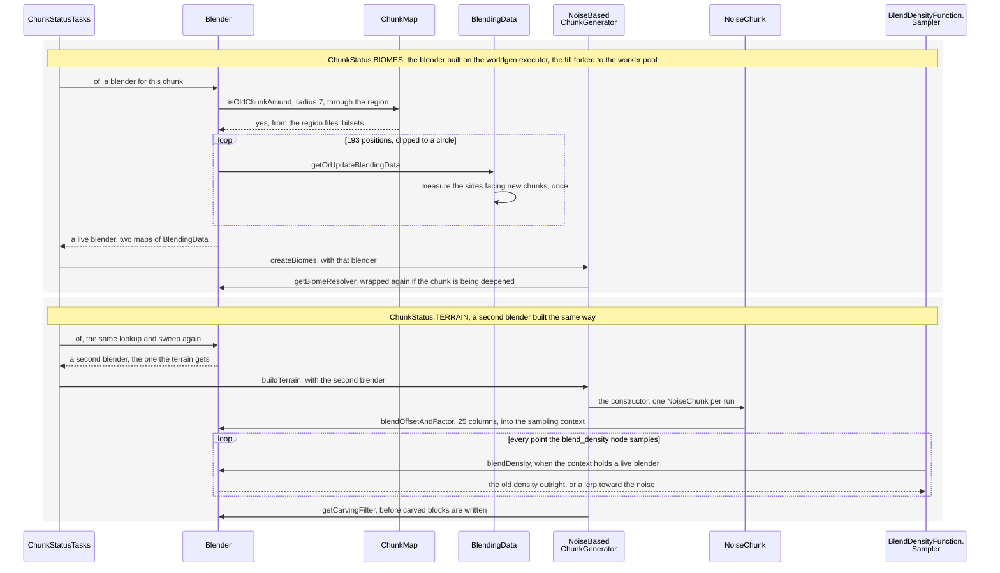

# Blending at the old-chunk border

> Verified against **Minecraft 26.3** · Part XII · a chunk generated beside one an older version left behind: one measurement of the old ground, and the five places generation is bent around it.

In a world old enough to have been generated by a previous version, the debug
screen's chunk-generation entry reads *Blending: Old* on one side of a line and
stops reading it on the other. For roughly a hundred blocks on the new side of that line the game is generating chunks that are not free to be whatever the seed
says — and directly against the seam they are hardly generated at all. The three
functions that shape overworld terrain, *offset*, *factor* and *jaggedness*, are
each swapped for a fixed target: a ground height measured from the old chunk's own blocks, the constant ten, and zero. **At the seam the overworld's terrain splines have no say.**

This is the deliberate exception [the part's premise](README.md) names.
Everywhere else in world generation, a chunk is built to be a function of the
world's settings and its data packs. Here it is a function of those **and of the blocks
in the old chunks around it** — which the game remembers only in part and has to go and measure, one column at a time.

## The flag is a nullable field, and looking for it costs a disk read

A chunk is old if `ChunkAccess.blendingData` is non-null. That is the whole
test: `ChunkAccess.isOldNoiseGeneration` returns exactly whether that field is
set, and the field is *final* — it arrives through the constructor from
`SerializableChunkData`, the record that reads a chunk's NBT
([chunk storage](../world/chunk-storage.md#the-cast)), which pulls a
*blending_data* compound out of it and nothing sets afterwards. Which saves
carry that key is `util/datafix`'s business, which
[this book skips](../anatomy/what-this-book-skips.md); by the time world
generation sees a chunk the key is either there or it is not.

The awkward part is cost. A chunk being generated could ask its neighbours whether they are old — the dependency window guarantees them — but that is 193 chunks to reach for an answer that, in a world this version created, is always no. So `Blender.of` —
the factory the *BIOMES* and *TERRAIN* steps call — starts by asking the *save
file*. `WorldGenRegion.isOldChunkAround` hands the question to the level's
`ChunkMap`, which inherits `SimpleRegionStorage.isOldChunkAround` and lands on
`IOWorker.isOldChunkAround`. That walks the region files covering a square of
radius seven, and for each region it needs a `BitSet` with one bit per chunk,
built by scanning all 1,024 chunks in the region — a region file is
thirty-two by thirty-two
([inside a region file](../world/chunk-storage.md#inside-a-region-file)) — for
two NBT fields and
nothing else: *DataVersion* and *blending_data*. The save check counts a chunk if its stored *DataVersion* is below 4997 or if it already carries a *blending_data* compound — a wider net than the flag, so a yes can still end in the empty blender. The scan runs on the [worker pool](../../reference/threads.md#the-threads-a-lecture-leans-on), the caller joins it, and
the bitset is kept in a 1,024-entry region cache.

**Every** chunk generated in **every** world pays for that lookup twice,
whatever generator the dimension uses:
`ChunkStatusTasks.generateBiomes` and `ChunkStatusTasks.buildTerrain` both
evaluate `Blender.of` eagerly, before knowing whether the answer can possibly
be yes ([which steps may
write](../world/chunk-generation-pipeline.md#two-steps-may-write-and-only-two)),
and nothing else in the game calls it. The noise generator adds none: its
carving pass asks the *TERRAIN* run's blender for its filter. When nothing is old the
bitsets come back empty and `Blender.of` hands back the shared empty blender,
an anonymous subclass over two empty maps that overrides the three answering methods with identities: alpha one, offset zero, density unchanged,
resolver returned as given. The lookup is cheap after the first time, because
the per-region bitset is memoised behind
`IOWorker.getOrCreateOldDataForRegion` and so is scanned once per region rather
than once per chunk; a debug flag set from JVM system properties, `SharedConstants.DEBUG_DISABLE_BLENDING`, can drop it entirely, which short-circuits
`Blender.of`, the carving-mask filter and the border ticks alike.

## The cast

| class | what it decides | when |
|---|---|---|
| `Blender` | the three answers — the height alpha and offset, the blended density, and the biome override — and the carving filter it builds beside them. The border ticks are a *static* method on the same class and never ask an instance anything | built per step on the worldgen executor, asked from the worker pool; the border ticks run inline at `ChunkStatus.FEATURES` |
| `BlendingData` | one old chunk's measurements: a ring of sixteen columns holding a height, a density profile and a biome column each | measured once per loaded chunk object |
| `IOWorker` | whether any chunk within seven is old, from a per-region `BitSet` scanned out of the region files | on the worker pool, joined by the caller |
| `NoiseChunk` | where the answers enter the density graph: the blender and its two samplers, set in the sampling context | `ChunkStatus.TERRAIN`, one per run |
| `NoiseRouterData` | which router functions the shipped data makes blendable — three overworld splines and one post-process wrapper | build time, emitted as the JSON that ships |
| `CarvingMask` | the positions one run's carvers dig, and the `CarvingMask.Filter` that, beside an old chunk, lets only those near it become blocks | `ChunkStatus.TERRAIN` |
| `BelowZeroRetrogen` | the separate world-deepening path that rides the same hooks | `ChunkStatus.TERRAIN` and `ChunkStatus.BIOMES` |
| `SerializableChunkData` | the *blending_data* key: which chunks are flagged, and which measurements survive a save | chunk load and save |

## One measurement, five consumers

`BlendingData` is gathered once and then read by five unrelated pieces of
machinery at three chunk statuses — two inside the density graph, three nowhere near it, and two of the five reading only the old area the chunk was saved with, not its measured columns.

```mermaid
flowchart TD
    OLD["an old chunk, tagged blending_data"] --> BD["BlendingData: sixteen measured columns"]
    BD --> B["Blender: two maps and a carving filter"]
    B --> R1["BIOMES: the nearest old biome, or none"]
    B --> R2["TERRAIN: blend_alpha, blend_offset"]
    B --> R3["TERRAIN: blend_density inside the final density"]
    B --> R4["TERRAIN: carving only near old chunks"]
    BD --->|"its old area, read directly"| R5["FEATURES: border ticks, old chunk only"]
```

*One old chunk's `BlendingData` fans out five ways: three consumers go through the `Blender` and its two maps of measured columns, the carving pass through the filter `Blender.of` builds from nine chunks' old areas, and the border ticks read the old chunk's own old area with no blender at all.*

Two maps, not one. `Blender.of` sweeps the square from seven chunks west to
seven chunks east and clips it to a circle — the test is that the squared
offsets sum to no more than sixty-four — which leaves **193 positions**. Every
one that yields data goes into the height-and-biome map; only the inner three
by three also goes into the density map. That asymmetry follows the two reaches — the height blend looks twenty-seven quart cells out and the density blend two — and the reaches, not the maps, are why the terrain seam is a hundred blocks wide and the cave seam is a handful.

A neighbour yields data only if it passes two tests in
`BlendingData.getOrUpdateBlendingData`: it carries a `BlendingData`, **and**
`ChunkAccess.getHighestGeneratedStatus` is not before `ChunkStatus.BIOMES`.
The first turns away every chunk this version generated, which never carries one. The second turns away a flagged chunk whose status, with any deepening target folded in, is before *BIOMES*.

**Seven chunks** is the radius the height blend reaches, which `Blender` derives from the twenty-seven-cell height range. The cell here is the *quart* —
the four-by-four-by-four volume a biome is stored per
([biomes](biomes.md#deciding-a-chunks-biomes-cell-by-cell)) — and the
arithmetic is four quart cells per section across seven sections, less one, plus
three, converted back to chunks. It sits
inside the radius-eight
dependency window the *BIOMES* and *TERRAIN* steps both declare, so none of the 193 reads can
trip the crash a read past that window would be
([a read too far crashes, a read too wide only
warns](../world/chunk-generation-pipeline.md#a-read-too-far-crashes-a-read-too-wide-only-warns)).

## Sixteen columns, read out of blocks

`BlendingData` does not store a copy of the old terrain. It stores sixteen
columns in a ring round the chunk's edge — a column here being one horizontal
position sampled through the chunk's **old area**, the vertical band between the minimum and maximum sections saved with it — measured out of that same old chunk's own blocks the first time anyone asks: `BlendingData.getOrUpdateBlendingData` fetches one chunk and hands it to its
own `BlendingData.calculateData`. Seven of them are *inside*
indices — the corner and three more along the north edge, three along the
west — at block coordinates 0, 4, 8 and 12. The other nine are *outside*
indices, sampled at block coordinate 15 along the east and south edges, which
in cell arithmetic belong to the next chunk's first cell. Sixteen slots is
what `BlendingData.Packed`'s codec validates the saved height array against,
and it is exactly the array length the class computes from a chunk being four
quarts wide.

Which of the sixteen get filled depends on which way the chunk faces new
ground. `BlendingData.sideByGenerationAge` asks each of the eight `CompositeDirection.Direction8`
neighbours whether it is old, and `BlendingData.calculateData` fills only the
columns on the sides that are **not** — the ones facing chunks the game is
about to generate. There is one call site in the whole game and it passes
*false*, so "sides by generation age" only ever means "sides facing new
chunks". The method also guards on `BlendingData.hasCalculatedData`, so a
chunk object measures itself once and never again: whichever sides were new at
that moment are the sides it will carry until it is unloaded.

Each filled column gets three things. **A height**:
`BlendingData.getHeightAtXZ` starts at the *WORLD_SURFACE_WG* heightmap ([the six heightmaps](../world/chunk-anatomy.md#the-six-heightmaps)) if the chunk has one primed, capped at the top of the old area, and at the top of the old area if not, then walks
straight down looking for one of eleven block types — podzol, gravel, grass,
stone, coarse dirt, sand, red sand, mycelium, a snow *block*, terracotta or
dirt — and
returns the first Y at which it finds one, or the bottom of the old area if it
never does. **A density profile**: for each eight-block-tall noise cell,
`BlendingData` reads fifteen consecutive blocks downward, scoring each plus or
minus one for whether it is ground, and divides by fifteen — ground meaning
not air, not a leaf, not a log, not a mushroom block and with a non-empty
collision shape, so a cave counts as air and a tree does not count as terrain.
One more pass rewrites the two cells straddling the measured height so the
surface lands where the height said it did. And **a biome column**: one
`Biome` holder per four-block layer of the old area, read straight out of that
chunk's own biome container.

Of those three, **only the heights are saved.** `BlendingData.pack` writes the
minimum section, the maximum section and the sixteen floats, and omits the
heights entirely if none of them was ever measured; the density array is
declared *transient* and the biome list is not in the codec at all. Unload the
region and come back and the game re-reads the old chunk's blocks to rebuild
both.

## Following one chunk through

```mermaid
sequenceDiagram
    participant CST as ChunkStatusTasks
    participant Blender as Blender
    participant CM as ChunkMap
    participant BD as BlendingData
    participant NBC as NoiseBased<br/>ChunkGenerator
    participant NC as NoiseChunk
    participant BDFS as BlendDensityFunction.<br/>Sampler

    rect rgba(0, 0, 0, 0.04)
    Note over CST,BDFS: ChunkStatus.BIOMES, the blender built on the worldgen executor, the fill forked to the worker pool
    CST->>Blender: of, a blender for this chunk
    Blender->>CM: isOldChunkAround, radius 7, through the region
    CM-->>Blender: yes, from the region files' bitsets
    loop 193 positions, clipped to a circle
        Blender->>BD: getOrUpdateBlendingData
        BD->>BD: measure the sides facing new chunks, once
    end
    Blender-->>CST: a live blender, two maps of BlendingData
    CST->>NBC: createBiomes, with that blender
    NBC->>Blender: getBiomeResolver, wrapped again if the chunk is being deepened
    end
    rect rgba(0, 0, 0, 0.04)
    Note over CST,BDFS: ChunkStatus.TERRAIN, a second blender built the same way
    CST->>Blender: of, the same lookup and sweep again
    Blender-->>CST: a second blender, the one the terrain gets
    CST->>NBC: buildTerrain, with the second blender
    NBC->>NC: the constructor, one NoiseChunk per run
    NC->>Blender: blendOffsetAndFactor, 25 columns, into the sampling context
    loop every point the blend_density node samples
        BDFS->>Blender: blendDensity, when the context holds a live blender
        Blender-->>BDFS: the old density outright, or a lerp toward the noise
    end
    NBC->>Blender: getCarvingFilter, before carved blocks are written
    end
```

*The blender that bends a chunk's terrain is the one built at `ChunkStatus.TERRAIN`: the `NoiseChunk` is made inside that run and takes its answers into the sampling context, while the one built at `ChunkStatus.BIOMES` answers biomes and nothing else.*

Two blenders are built, then, the same way, and each is asked different
questions. The biome step builds no `NoiseChunk` — it samples climate through
a caching sampler of its own — so its blender is asked for the biome override
and nothing else. The `NoiseChunk` is made inside
`NoiseBasedChunkGenerator.buildTerrain`, one per run and closed when the run
ends, so the blender that reaches the density graph, and the carving filter
with it, is the one built at *TERRAIN*.

The twenty-five columns are the other thing worth noticing, because they are
where this page's measurements physically enter the density graph. Before it
binds a single sampler, the `NoiseChunk` constructor hands its blender the
chunk's volume, and `Blender.blendOffsetAndFactor` works through the
five-by-five grid of quart columns that covers it and returns a
`Blender.OutputBuffer` of twenty-five alphas and twenty-five offsets. The
constructor sets the blender and the buffer's two samplers in the sampling
context, under `Blender.CONTEXT_KEY`, `Blender.ALPHA_KEY` and
`Blender.OFFSET_KEY`, which is where the two blend leaves and the
*blend_density* node look for them. With no old chunk near it sets none of
the three, so the leaves fall back to the constants one and zero and
*blend_density* hands its input through unchanged
([wrap: once per chunk](density-functions.md#wrap-once-per-chunk)).

## What the blender actually answers

Three questions, three different shapes of answer, and only two of them are
blends. Three is fewer than the five consumers above because the last two are
not answered from the maps: the carving filter is built by `Blender.of`
straight from the `BlendingData` of the chunk and its eight neighbours, the
border ticks read the old chunk's own, and neither of the two maps is involved.

### Height, as an alpha and an offset

For each column, `Blender.blendOffsetAndFactor` first checks whether the sample point sits exactly on a measured column; if it does,
it returns alpha zero and the old height, put through
`Blender.heightToOffset` — a rational function, not a polynomial. If not,
it walks every measured height in the height map, keeps those within
twenty-seven quart cells — a hundred and eight blocks — and averages them
weighted by the inverse fourth power of distance, with alpha the smoothstep of
the *nearest* distance over twenty-eight. Nothing in range means alpha one and
offset zero: the identity.

Alpha is then used as a mixing weight in `NoiseRouterData.splineWithBlending`,
which interpolates from a fixed target at alpha zero to
the real spline at alpha one, and this is where the page's opening claim comes
from. Exactly three router functions are built that way — *offset*, *factor*
and *jaggedness*, for each of the three overworld variants — and their targets
are, respectively, `SimpleDensityFunction.BLEND_OFFSET`,
`NoiseRouterData.BLENDING_FACTOR` (the constant ten) and
`NoiseRouterData.BLENDING_JAGGEDNESS` (zero). Against the seam alpha is zero,
so overworld terrain is not shaped by its splines at all: the ground height is
whatever `BlendingData` measured, the factor is ten and the jaggedness is
nothing. The shipped data pack agrees — *blend_alpha* appears in nine density
function files and *blend_offset* in three, all of them under the three
overworld directories.

Because *offset* and *factor* are also the two inputs to
`NoiseRouterData.preliminarySurfaceLevel`, the *surface_level* the aquifer is
configured with
([the aquifer](terrain.md#the-aquifer-what-the-number-becomes)), the
water table follows the old ground. Nobody
wrote a rule for that: it falls out of the aquifer sampling a blended
function.

### Density, as a lerp with a very short reach

`Blender.blendDensity` is called per sample by `BlendDensityFunction.Sampler`,
the compiled form of `BlendDensityFunction` — the wrapper *blend_density*
decodes to — whenever the sampling context holds a live blender. It measures distance in noise cells with the Y difference doubled — noise cells are twice as tall as they are wide — keeps
neighbours within two, and mixes toward the noise with an alpha of the closest
distance over three. An exact hit returns the old density with no mixing at
all. This one wrapper is in every dimension's router: *blend_density* is
written into four of the seven shipped noise settings and into the three
overworld *final_density* files the other three name, while the alpha and
offset nodes are overworld-only.

### Biome, as a replacement

`Blender.getBiomeResolver` wraps the biome source's resolver
in another `BiomeResolver` — the functional interface the chunk's biome fill takes
([the trace: a chunk's biomes](biomes.md#deciding-a-chunks-biomes-cell-by-cell)) — that
asks `Blender.blendBiome` first and only falls through when
it declines. And it is not a blend: it finds the nearest measured biome within
twenty-seven cells, adds twelve cells' worth of a fixed shift noise to that
distance, divides by twenty-eight, and returns the old biome if the result is
below one half and nothing at all if it is above. So the biome boundary is a
hard line at roughly half the terrain blending distance, roughened by noise —
one biome or the other, never a mixture, which is the only answer a palette of
biome holders can represent.

Between them those three shapes are why the blend can still leave a visible
edge, in two different ways. A column whose old surface is none of the eleven
blocks the height scan recognises reports the bottom of the old area instead,
and that bogus height is averaged in with the rest. And because the biome is a
threshold rather than a ramp, the material rules can change block for block
along a line while the terrain under them is still sloping.

## The two consumers that never touch the noise router

**Carving is held to the seam.** At *TERRAIN* the blender carries one thing
besides its two maps: `Blender.of` ends with
`Blender.createAroundOldChunksCarvingMaskFilter`, which collects the
`BlendingData` of all eight `CompositeDirection.Direction8` neighbours plus the
chunk's own, turns each into a `Blender.DistanceGetter` measuring distance to a
box eight blocks either side of the chunk centre in X and Z — a whole chunk
wide — and as tall as that chunk's old area, and puts the minimum of them
behind a `CarvingMask.Filter`, or builds none if none of the nine is old. A
position within four blocks of any such box — after each axis is displaced by
the same shift noise, scaled by four — passes it. The carvers never see it:
`WorldCarver.carveEllipsoid` records what they dig in the run's `CarvingMask`
([carving, and who chooses the block](terrain.md#carving-and-who-chooses-the-block)),
and `NoiseBasedChunkGenerator.applyCarvingMask`, turning those bits into
blocks, is handed the filter `Blender.getCarvingFilter` returns and writes
only the positions it passes. So beside an old chunk the carvers' work
survives only within about four blocks of it, and the rest is dropped. Neither
the filter nor the mask is ever saved.

**Leaves and water at the seam are marked for a second look.** At *FEATURES*,
after decoration, `ChunkStatusTasks.generateFeatures` calls
`Blender.generateBorderTicks` — and this is the one hook that acts only on the *old* side. It returns immediately unless the chunk
being generated carries a `BlendingData` of its own, which a chunk generated
fresh today never does: it acts only on an old chunk that is still being
carried through the statuses, one saved before *FEATURES* or one being
deepened. Given such a chunk it sweeps four Y levels — one below and one at
the bottom of the old area, one at and one above the top — across all 256
columns, and then, for each of the four horizontal neighbours that is *not*
old, walks the whole sixteen-wide face from the bottom of the old area up to that column's *MOTION_BLOCKING* height, capped at the top of the old area. Every leaf block and every non-empty
fluid it passes goes to `ChunkAccess.markPosForPostProcessing`. Nothing is
changed: the positions are queued for the post-processing pass that runs when
the chunk becomes live
([what the chunk goes on holding](../world/chunk-anatomy.md#what-step-11-leaves-behind-and-what-the-chunk-goes-on-holding)),
which is what makes water at the seam flow and
orphaned leaves decay instead of hanging there. The heightmap read is safe whatever the chunk's history: an old chunk loaded at *TERRAIN* had its four final maps primed as it was read from the save, one that ran *TERRAIN* here had them primed as `ChunkStatusTasks.buildTerrain` ended, and `ChunkAccess.getHeight` primes a missing one on demand besides.

## The other passenger

`BelowZeroRetrogen` is not blending, but it rides the same hooks and is easy
to mistake for it. A chunk carrying one is being *deepened*, whether or not it is also blended: `ChunkAccess.getHighestGeneratedStatus` folds its
`BelowZeroRetrogen.targetStatus` in
([the four shapes a chunk takes](../world/chunk-anatomy.md#the-four-shapes-a-chunk-takes)),
`ChunkStatusTasks.buildTerrain` calls
`BelowZeroRetrogen.replaceOldBedrock` and then
`BelowZeroRetrogen.applyBedrockMask` if there are holes, and
`BelowZeroRetrogen.getBiomeResolver` wraps the blender's resolver in one more
layer that keeps three cave biomes from the new generation and takes everything else from the biome the chunk already has at Y 0 in each column.

## Where to look

Start at `Blender.of` and read down: the two maps, the two radii, the three
answering methods. Then `BlendingData.calculateData` and
`BlendingData.getHeightAtXZ` for what a measurement is, and
`BlendingData.Packed` for what survives a save. `NoiseChunk`'s constructor,
`SimpleDensityFunction` and `BlendDensityFunction` show where the answers enter the density graph,
`NoiseRouterData` which three functions were built to receive them, and
`ChunkStatusTasks` when each hook fires.

---

*Rules: names, never code · how the system works, not how the code reads ·
newest version only · every backticked name passes `tools/verify_names.py`.*
