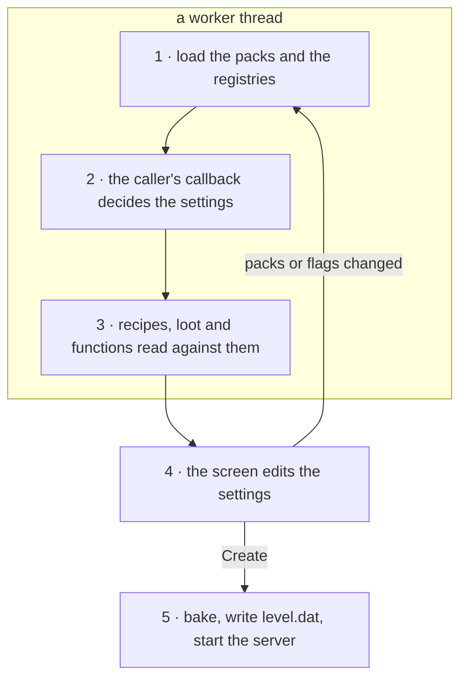
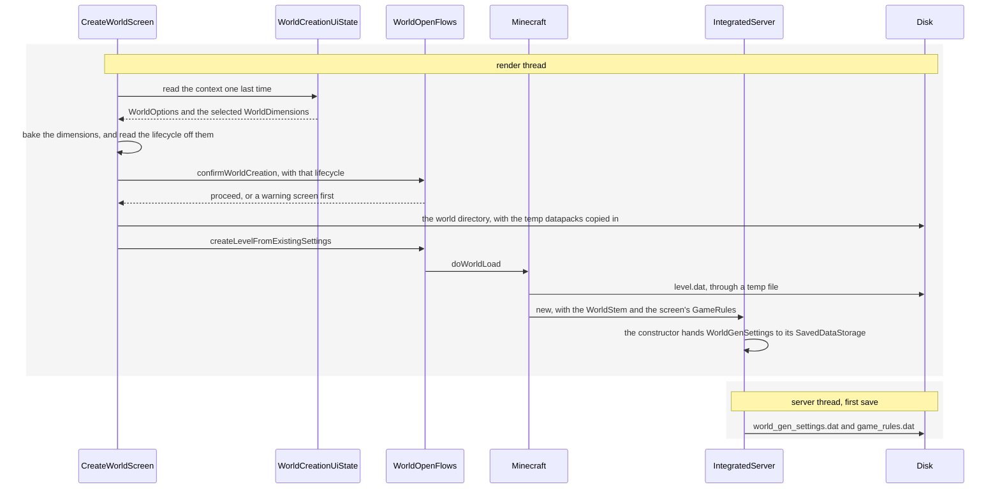

# Creating a world

> Verified against **Minecraft 26.2** · Part XII · *Create New World*: a seed typed in, Superflat chosen, a layer deleted, an experiment switched on, and the settings object that comes out the other end.

You click *Create New World* and nothing happens for a moment. Then a
three-tab screen: a name, a game mode, a seed box, a world-type button, and
buttons for game rules, data packs and experiments. You type a seed, cycle the
type to *Superflat*, open *Customize* and delete the dirt layer, switch on an
experiment, set one game rule, and press *Create*.

That opening pause is what this page is about. Before the screen can draw a
single widget the game has already run a **complete server-side data-pack
load** — the same `WorldLoader.load` a dedicated server runs at startup
([the world load](../server/starting-a-server.md#everything-main-does-before-there-is-a-second-thread)) —
on a
background thread, with the client's main thread parked on
`BlockableEventLoop.managedBlock`, running other people's tasks while it waits
([the event loop](../server/server-tick.md#the-event-loop-and-what-a-ticks-spare-time-buys)),
until it finishes. The object the screen
exists to edit, `WorldGenSettings`, was built halfway through that load, out
of registries the load had just filled. Every widget on the *World* tab is an
edit to it — the name, the game mode, the difficulty, Allow Commands and the
game rules go somewhere else entirely, into the `LevelSettings` and the
`GameRules` that ride beside it. Two of the buttons throw the whole load away
and run it again. And *Create* barely
touches it: by the time you press the button, the world's generation settings
have existed in memory for as long as the screen has.

Everything else in [Part XII](README.md) reads that object. This page is where
it comes from, where it goes, and the three different programs that build one.

## The cast

| class | what it owns | its thread |
|---|---|---|
| `WorldGenSettings` | the whole answer: a `WorldOptions` and a `WorldDimensions`, and nothing else. It is a `SavedData` | built on the worker, read on the server thread |
| `WorldOptions` | the seed, *generate structures*, *bonus chest* — four fields, all immutable, each *with*-method returning a new one | — |
| `WorldDimensions` | a map from `LevelStem` key to `LevelStem`, each a dimension type plus a `ChunkGenerator`. Refuses to exist without an overworld | — |
| `WorldLoader` | the data-pack load every path shares, and the seam (`WorldLoader.WorldDataSupplier`) where the caller decides what the settings are | worker, with two hops to the main thread |
| `WorldCreationContext` | the settings *plus* the loaded registries and `ReloadableServerResources` they were parsed against — the screen's whole world | render thread, replaced wholesale |
| `WorldCreationUiState` | the widget-visible state, and the listener list that keeps the tabs agreeing with it — `CreateWorldScreen` registers seven | render thread |
| `WorldOpenFlows` | every route from the world list into a running server, each one a chain of methods that can interpose a confirmation | render thread |
| `MinecraftServer` | takes the finished object out of the `WorldStem` and hands it to `SavedDataStorage`, which is what puts it on disk | server thread |

## Five stages, and only one of them is the screen

*Stages one to three are one `WorldLoader.load` call off the render thread, and the screen is stage four — the only stage that can send the whole load back to the start.*

The ordering that matters is stage 2 before stage 3, and it is the reason
this page exists at all. `WorldLoader.load` takes the settings-building
callback as a parameter and calls it in the gap between loading the registries
and compiling the recipes — so the registry set
that recipes, loot tables and functions are then parsed against includes the
dimension registry that callback produced. The seed and the dimension list
are settled before a single recipe is read, and they are settled by a lambda
the *caller* supplied, which is the only reason the client's create screen,
the client's world-opener, the dedicated server and the game-test server can
share one loader.

The registry pass that callback sits behind is
`RegistryDataLoader.DIMENSION_REGISTRIES`, and it is the last of the registry
passes a world load walks
([when a world opens](../foundations/identifiers-and-registries.md#when-a-world-opens)).
It holds exactly one registry,
`Registries.LEVEL_STEM`, loaded in its own pass because its entries need every
worldgen registry already in hand — and that single-entry list is the
*dimension/* folder of a data pack.

## The object, and what is not in it

`WorldGenSettings` has two fields. `WorldOptions` holds the seed, a
*generate structures* flag, a *bonus chest* flag and a string that only a very
old save carries. `WorldDimensions` holds the map of `LevelStem`s. There is no
world name in it, no difficulty, no game mode, no game rule and no data-pack
list — those are `LevelSettings` and `GameRules`, and
[level data and rules](../../reference/level-data-and-rules.md#dimensions-and-the-seed)
says which file each of them ends up in.

It does not end up in *level.dat* either. `WorldGenSettings` extends
`SavedData` and carries its own `SavedDataType`, so it is written to
*data/minecraft/world_gen_settings.dat* — and the game rules to
*data/minecraft/game_rules.dat* — by the ordinary saved-data machinery rather
than by the level-data writer. That is a different writer on a different thread
at a different moment, which is the last thing this page traces.

A seed is not a number the box gives you. `WorldOptions.parseSeed` trims the
text, returns nothing at all for an empty string, parses a long if it can, and
otherwise returns the Java string hash of what you typed — which is why a seed
of *glacier* is a seed and a seed of *99999999999999999999* is the hash of
that text rather than the number. And *nothing at all* is not zero:
`WorldOptions.withSeed` turns an absent seed into `WorldOptions.randomSeed`,
one draw from a fresh `RandomSource`. The seed field's responder calls
`WorldCreationUiState.setSeed` on every keystroke, so an empty box is
re-rolling a new random world every time you touch it.

## Every widget is an edit to a live object

`WorldCreationUiState` is not a form. It holds the `WorldCreationContext`
itself, rebuilds it on almost every change, and then walks a listener list so
that each widget re-reads what it should now show. The state is also opinionated
about what it returns: `WorldCreationUiState.getDifficulty` reports *hard* in
hardcore whatever the button last set, `WorldCreationUiState.isAllowCommands`
reports true in a debug world and false in hardcore, and
`WorldCreationUiState.isBonusChest` reports false in both. The buttons are
disabled to match, but the state would lie to them anyway.

The world-type button is the destructive one. `WorldCreationUiState.setWorldType`
calls `WorldPreset.createWorldDimensions` and replaces **all** the dimensions
with the preset's, so a trip through *Superflat* and back to *Default* discards
every layer you edited. Seven world presets ship as JSON under
*data/minecraft/worldgen/world_preset/*, and the button reaches six of them: it
cycles the *normal* tag, which holds five — Default, Superflat, Large Biomes,
Amplified and Single Biome — and holding Alt swaps it for the *extended* tag,
which is those five plus *debug_all_block_states*. The seventh,
`WorldPresets.FLAT_ALL_DIMENSIONS`, is in neither tag and appears on no button:
the only thing that ever selects it is `CreateWorldScreen.testWorld`, behind a
*TW* button the title screen adds when `SharedConstants.IS_RUNNING_IN_IDE`.

*Customize* is rarer than it looks. `PresetEditor.EDITORS` is a two-entry map:
`WorldPresets.FLAT` opens `CreateFlatWorldScreen` and
`WorldPresets.SINGLE_BIOME_SURFACE` opens `CreateBuffetWorldScreen`, whose one
choice becomes a `FixedBiomeSource` — the buffet world is the whole of that
biome source's use in the game. For the
other five presets the button is inactive. Both editors end the same way, in
`WorldCreationContext.DimensionsUpdater` lambdas that call
`WorldDimensions.replaceOverworldGenerator` — the overworld only. Nothing in
the create screen can edit the nether or the end.

## The layer editor edits the generator you already have

`FlatLevelGeneratorSettings` is the odd object in a part where everything else
is a record. Its layer list — of `FlatLayerInfo`, a block and a height — is
mutable, its *lakes* and *features* flags are
set by void methods, and `FlatLevelGeneratorSettings.getLayersInfo` hands out
the live list. `PresetEditor` passes `CreateFlatWorldScreen` the settings of
the current overworld generator when that generator is already a
`FlatLevelSource` — the same object, not a copy — and the *Remove Layer* button
removes an entry from that list directly and calls
`FlatLevelGeneratorSettings.updateLayers`.

So **the *Cancel* button on the layer editor does not undo a layer deletion.**
Cancel only skips the `WorldCreationContext.DimensionsUpdater` that would build
a new `FlatLevelSource`; the list it would have been built from has already
changed. The *Presets* screen is the well-behaved half of the same screen:
`PresetFlatWorldScreen` reads and writes the layer stack as a text string and
hands back a *new* settings object through
`FlatLevelGeneratorSettings.withBiomeAndLayers`. Nine flat presets ship as
JSON, one for each key `FlatLevelGeneratorPresets` registers a value for; the
tenth key, `FlatLevelGeneratorPresets.TEST_WORLD`, is declared, never given a
value, and read by nothing in the game.

One thing the flat generator does not do is place all its own blocks.
`FlatLevelGeneratorSettings.adjustGenerationSettings` walks the built layer
stack and, for every layer whose block fails
`Heightmap.Types.MOTION_BLOCKING`'s opacity test, replaces it with a null and
re-adds it as an inline `Feature.FILL_LAYER` placed feature in the
*TOP_LAYER_MODIFICATION* decoration step. That test is *blocks motion or holds
a fluid*, so the water in *Water World* stays terrain; what leaves it are the
air of *The Void* and the snow layer on top of *Snowy Kingdom*, which arrive
as [features](features-and-placement.md).

## An experiment is a data pack, so switching one on reloads everything

`ExperimentsScreen` looks like a toggle list and is a filtered pack browser: it
walks the repository's available packs and keeps only those whose
`Pack.getPackSource` is `PackSource.FEATURE` — a built-in pack that carries a
feature-flag section and deliberately refuses to be selected automatically
([the repository and its packs](../foundations/resource-system.md#discover-the-repository-and-its-packs)).
Three ship in 26.2 —
*minecart_improvements*, *redstone_experiments* and *trade_rebalance* — one per
non-vanilla flag in `FeatureFlags`, and what a flag then gates is
[feature flags](../foundations/identifiers-and-registries.md#feature-flags-the-same-registry-narrowed). Pressing *Done* rewrites the repository's
selection and lands in `CreateWorldScreen` exactly where the data-pack screen
lands, in `CreateWorldScreen.tryApplyNewDataPacks`.

That method has a fast path and a slow one. If the enabled-pack list and the
feature set both come back unchanged, `WorldCreationUiState.tryUpdateDataConfiguration`
swaps the configuration in and nothing reloads. Otherwise
`CreateWorldScreen.applyNewPackConfig` puts a *validating* message on screen and
runs `WorldLoader.load` again from the top — and it has to carry your settings
across a registry set that is about to be replaced. It does that by
**serialising them**: `WorldGenSettings.CODEC` encodes the current options and
dimensions to JSON using the old registries as context
([where the registry context comes from](../foundations/codecs-nbt-json.md#where-the-registry-context-comes-from)),
and re-parses that JSON
against the new ones. Every `Holder` in the object — every biome, every noise
settings, every structure set the flat generator overrides — is written out as
an id and looked up again. If the new packs have no world preset or no biome,
or the re-parse fails, the future completes exceptionally and the player gets a
retry-or-reset confirmation instead of a screen.

The two routes into that method differ in one boolean.
`CreateWorldScreen.tryApplyNewDataPacks` shows
`ConfirmExperimentalFeaturesScreen` only when the requested flags are
experimental **and** the caller was the data-pack screen. Toggling an experiment
in the Experiments screen skips it — that screen carries a red warning line of
its own instead.

Data packs added here do not go into a world folder that does not exist yet.
`CreateWorldScreen.getOrCreateTempDataPackDir` makes a temporary directory
prefixed *mcworld-*, the pack browser is pointed at that, and the directory is
copied into the new world's *datapacks* folder by
`CreateWorldScreen.createNewWorldDirectory` at the very end. It is then deleted
on **every** exit including that one: `CreateWorldScreen.removeTempDataPackDir`
runs on the line after the create callback returns.

## What *Create* does

*The client writes `level.dat` before the server exists; the settings reach disk later, from the server's own first save, in two files of their own under data/minecraft.*

Three details in that order are worth stopping on. `CreateWorldScreen.onCreate`
bakes the dimensions to decide the *lifecycle* and the
`PrimaryLevelData.SpecialWorldProperty`, but the `WorldGenSettings` it stores
holds the **unbaked** selection — the bake is what runs, the selection is what
is saved. The warning is skipped when the world is not a re-create and the baked
registries are stable, and `WorldDimensions.checkStability` asks that question
per key — anything under a fourth key is experimental by construction — but it
asks a **different question of the overworld than of the other two**.
`WorldDimensions.isStableNether` and its End counterpart require a
`NoiseBasedChunkGenerator` on the vanilla noise settings and a
`MultiNoiseBiomeSource` on the vanilla parameter list. The overworld's check
tests the dimension type, and then the parameter list *only if* the biome source
happens to be a `MultiNoiseBiomeSource` at all. So Amplified passes on
non-vanilla noise settings, and Superflat and Buffet pass by not having a
multi-noise biome source to fail on. The upshot is that **no preset the button
can reach ever raises this warning**: the only shipped one that fails is *Flat
(all dimensions)*, which gives the nether and the end flat generators — and it
is on no button. In practice the warning is a data-pack warning. And
*level.dat* is written by
the client, in `Minecraft.doWorldLoad`, **before the server thread exists** —
while the settings file is written by the server after it starts, because
`MinecraftServer`'s constructor is the first thing to hand the object to
`SavedDataStorage`.

The game rules take a third route to disk, beside those two.
`CreateWorldScreen.onCreate` copies the screen's `GameRules` into an `Optional` that travels through
`CreateWorldCallback`, `WorldOpenFlows.createLevelFromExistingSettings` and
`Minecraft.doWorldLoad` to the `MinecraftServer` constructor, which builds a
fresh rule set from the saved-data default and then overlays the screen's
values on top.

## The same object, built two other ways

The screen is one of three programs that produce a `WorldGenSettings`, and
setting the three side by side is the clearest way to see which parts of this
page are the subject and which are only its interface. The dedicated server
never sees a screen at all; *Re-Create* sees this one and feeds it an answer.

| | client create screen | dedicated server | *Re-Create* |
|---|---|---|---|
| who builds it | `CreateWorldScreen.onCreate` | `Main.createNewWorldData` | `WorldOpenFlows.recreateWorldData` |
| the seed | the seed box, per keystroke | *level-seed*, once, in the `DedicatedServerProperties` constructor | copied from the old world's settings |
| the dimensions | a `WorldPreset` plus screen edits | *level-type* as a world-preset id, with *default* and *largebiomes* as legacy aliases | the old world's saved `LevelStem` map |
| customising | `PresetEditor`, overworld only | *generator-settings* JSON, parsed by `FlatLevelGeneratorSettings.CODEC` **and only when the preset is** `WorldPresets.FLAT` | the create screen again |
| game rules | `WorldCreationGameRulesScreen` | one, and it is a legacy key: *announce-player-achievements* sets `GameRules.SHOW_ADVANCEMENT_MESSAGES` | read back from *game_rules.dat* |
| when | only if the folder is new | only if there is no *level.dat* | always a new folder |

Both seed paths are the same method. `DedicatedServerProperties` calls
`WorldOptions.parseSeed` on *level-seed* and falls back to
`WorldOptions.randomSeed`, exactly as the seed box does — so an empty
*level-seed* draws its random seed the moment the properties file is parsed,
whether or not a world is about to be created. An unrecognised *level-type* is
a warning in the log and the *normal* preset, not a failure.

*Re-Create* is the interesting column. `WorldOpenFlows.recreateWorldData` reads
the old world with a deliberately **empty** `LevelStem` registry, so the
dimensions come from the saved settings rather than from any pack, then hands
`CreateWorldScreen.createFromExisting` a `LevelSettings` and a context. The
result is a new world folder with the old seed pre-filled. Nothing in the
family edits an existing world's `WorldGenSettings` in place: `EditWorldScreen`
offers a rename, an icon reset, a folder button, a backup and *Optimize World*,
and not one generation setting.

## The rest of the family

Two of the nineteen classes in `client/gui/screens/worldselection` matter to
this page, and both for the same reason: they are where the split the
blockquote describes is paid for. The rows of `SelectWorldScreen`'s
`WorldSelectionList` are `LevelSummary` objects read by
`LevelStorageSource.readLightweightData`, an NBT parse that
deliberately skips the *Data/Player* and *Data/WorldGenSettings* subtrees — the
second of them named by `PrimaryLevelData.OLD_WORLD_GEN_SETTINGS`, all that is
left of the old key — so that listing a hundred worlds never costs a settings
parse. And `WorldOpenFlows.openWorld` is a chain of eight methods — itself, then
level data, version compatibility, the world stem, stem compatibility, a bundled
resource pack, disk space, and finally `Minecraft.doWorldLoad` — each of which
can stop and put a confirmation screen in the way, which is the shape every
route in this page's family takes.

> **For a 1.21-era reader.** The seed has left *level.dat*.
> `WorldGenSettings` is a `SavedData` with its own file,
> *data/minecraft/world_gen_settings.dat*, and the game rules likewise;
> `PrimaryLevelData` keeps the old key name only as the constant
> `PrimaryLevelData.OLD_WORLD_GEN_SETTINGS`.

## Where to look

Start with `net/minecraft/world/level/levelgen`: `WorldGenSettings` is fifty-one
lines and tells you the whole shape, `WorldOptions` and `WorldDimensions` are
the two halves, and `WorldDimensions.bake` is the method that turns a selection
into a registry. Then `net/minecraft/server/WorldLoader` — one method, and the
spine every path shares. Only then
`net/minecraft/client/gui/screens/worldselection`, in the order
`WorldCreationContext`, `WorldCreationUiState`, `CreateWorldScreen` and
`WorldOpenFlows`, with `net/minecraft/client/gui/screens/CreateFlatWorldScreen`
and `net/minecraft/world/level/levelgen/flat` beside them. The comparison is
`DedicatedServerProperties.createDimensions` and `Main.createNewWorldData`, and
the destination is the first forty lines of the `MinecraftServer` constructor.

---

*Rules: names, never code · how the system works, not how the code reads ·
newest version only · every backticked name passes `tools/verify_names.py`.*
