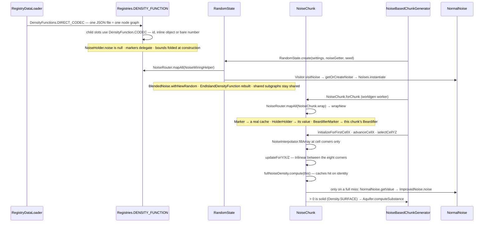

# Density functions

> Verified against **Minecraft 26.2** · Part XII · One number out of one point: how a JSON graph becomes "stone or air", and why the graph in the registry is never the graph that runs.

## Responsibility

Terrain in 26.2 is a scalar field. Somewhere there is a function that takes
a block position and returns a *double*, and everything about the shape of
the world — continents, erosion, cliffs, caves, the underside of the
floating islands — is that one function being large or small. `DensityFunction`
is the interface, `DensityFunctions` is the library of nodes you build it
out of, and a data pack assembles them as JSON. The convention is that
zero is the surface, so **positive means solid**, and ±64 are the values a
node reaches for when it wants to end an argument. `Density` writes all
three down as constants — `Density.SURFACE`,
`Density.UNRECOVERABLY_DENSE`, `Density.UNRECOVERABLY_THIN` — and then
nothing reads them: the class has no callers anywhere in 26.2, and the
routers spell the same numbers as literals. It is documentation that
happens to compile.

The one sentence a player recognises: *the seed*. Everything on this page
is deterministic given the seed and the data pack, and nothing on it
touches a block.

This page is the core idea, not a catalogue. The terrain steps that call
it are [the worldgen pipeline](worldgen-pipeline.md); the six functions
that pick biomes are [biomes](biomes.md).

## The data it owns

- **`DensityFunction`** — one method that matters, `DensityFunction.compute`,
  taking a `DensityFunction.FunctionContext` (just
  `DensityFunction.FunctionContext.blockX`,
  `DensityFunction.FunctionContext.blockY`,
  `DensityFunction.FunctionContext.blockZ`) and
  returning a *double*. `DensityFunction.fillArray` is the batch form,
  driven by a `DensityFunction.ContextProvider`; leaves fall back to
  `DensityFunction.ContextProvider.fillAllDirectly`.
  `DensityFunction.minValue` and `DensityFunction.maxValue` are static
  bounds computed at construction and propagated up the tree.
  `DensityFunction.SimpleFunction` marks a context-free leaf.
- **The rewrite primitives.** `DensityFunction.mapChildren` rebuilds one
  node's direct children through a `DensityFunction.Visitor`;
  `DensityFunction.mapAll` applies one bottom-up over a whole graph. A
  `DensityFunction.Visitor` has two channels — `DensityFunction.Visitor.apply`
  for nodes and `DensityFunction.Visitor.visitNoise` for noise leaves.
  Everything interesting in this system is a
  `DensityFunction.mapAll`.
- **`DensityFunction.NoiseHolder`** is the seeding seam: a record of a
  `NormalNoise.NoiseParameters` holder and a `NormalNoise` that is
  **null as parsed**. An unfilled holder answers 0.0 from
  `DensityFunction.NoiseHolder.getValue`.
- **`DensityFunctions`** — the nodes, in families. Leaves:
  `DensityFunctions.Constant`, `DensityFunctions.YClampedGradient`,
  `DensityFunctions.Noise`, `DensityFunctions.ShiftedNoise`,
  `DensityFunctions.EndIslandDensityFunction`, and the domain-warp trio
  `DensityFunctions.ShiftA`, `DensityFunctions.ShiftB`,
  `DensityFunctions.Shift` behind `DensityFunctions.ShiftNoise`.
  Arithmetic: `DensityFunctions.TwoArgumentSimpleFunction` (its
  `DensityFunctions.TwoArgumentSimpleFunction.Type` is ADD, MUL, MIN, MAX)
  realised as `DensityFunctions.Ap2`, or as `DensityFunctions.MulOrAdd`
  when one side folded to a constant. Transforms:
  `DensityFunctions.Mapped` (`DensityFunctions.Mapped.Type` — ABS, SQUARE,
  CUBE, HALF_NEGATIVE, QUARTER_NEGATIVE, INVERT, SQUEEZE) and
  `DensityFunctions.Clamp`, both `DensityFunctions.PureTransformer`s.
  Selectors: `DensityFunctions.RangeChoice`,
  `DensityFunctions.IntervalSelect`. Shaping:
  `DensityFunctions.Spline` over a `CubicSpline`. Indirection:
  `DensityFunctions.HolderHolder`, a live pointer at a registry entry.
- **The markers** — `DensityFunctions.Marker` and its six
  `DensityFunctions.Marker.Type` constants (Interpolated, FlatCache,
  Cache2D, CacheOnce, CacheAllInCell, BlendDensity; note the mixed-case
  Java names). A marker holds a wrapped function and **computes nothing of
  its own** — it delegates. `DensityFunctions.MarkerOrMarked` is the
  interface a real cache implements so it still reports its marker type.
  `DensityFunctions.BeardifierMarker` and
  `DensityFunctions.BeardifierOrMarker` are the same trick for structure
  terrain flattening; `DensityFunctions.BlendAlpha` and
  `DensityFunctions.BlendOffset` for old-world blending.
- **`NoiseRouter`** — the fifteen functions a generator asks for, as one
  record: `NoiseRouter.temperature`, `NoiseRouter.vegetation`,
  `NoiseRouter.continents`, `NoiseRouter.erosion`, `NoiseRouter.depth`,
  `NoiseRouter.ridges` (the six climate ones),
  `NoiseRouter.preliminarySurfaceLevel`, `NoiseRouter.finalDensity`,
  `NoiseRouter.barrierNoise`, `NoiseRouter.fluidLevelFloodednessNoise`,
  `NoiseRouter.fluidLevelSpreadNoise`, `NoiseRouter.lavaNoise` (the
  aquifer's four), and `NoiseRouter.veinToggle`, `NoiseRouter.veinRidged`,
  `NoiseRouter.veinGap` (the ore veins'). `NoiseRouter.mapAll` rebuilds
  all fifteen at once.
- **`NoiseRouterData`** — vanilla's graph, written in Java and *emitted* as
  the JSON that ships: `NoiseRouterData.overworld`, `NoiseRouterData.nether`,
  `NoiseRouterData.end`, `NoiseRouterData.caves`,
  `NoiseRouterData.floatingIslands`, `NoiseRouterData.none`, with
  `NoiseRouterData.bootstrap` registering the named pieces and helpers like
  `NoiseRouterData.splineWithBlending`, `NoiseRouterData.slide`,
  `NoiseRouterData.spaghetti2D`, `NoiseRouterData.noodle`,
  `NoiseRouterData.pillars` and the nested
  `NoiseRouterData.QuantizedSpaghettiRarity`.
- **`RandomState`** — the per-world instantiation. It holds
  `RandomState.random` (the root `PositionalRandomFactory`),
  `RandomState.aquiferRandom`, `RandomState.oreRandom`, a seeded
  `RandomState.router`, a `RandomState.sampler` for climate, a
  `RandomState.surfaceSystem`, and two `ConcurrentHashMap` memos —
  `RandomState.noiseIntances` (the spelling is the decompile's) and
  `RandomState.positionalRandoms`, behind `RandomState.getOrCreateNoise`
  and `RandomState.getOrCreateRandomFactory`.
- **`NoiseChunk`** — the per-chunk everything. It implements *both*
  `DensityFunction.FunctionContext` and `DensityFunction.ContextProvider`,
  so it is simultaneously the sample position and the loop driver, and it
  owns the caches: `NoiseChunk.interpolators`, `NoiseChunk.cellCaches`,
  the memo map `NoiseChunk.wrapped`, and the nested
  `NoiseChunk.NoiseInterpolator`, `NoiseChunk.FlatCache`,
  `NoiseChunk.Cache2D`, `NoiseChunk.CacheOnce`,
  `NoiseChunk.CacheAllInCell`, `NoiseChunk.BlendDensity`.
- **The noise itself**, in `world/level/levelgen/synth`: `NormalNoise` (two
  `PerlinNoise` stacks summed and normalised), `PerlinNoise` (octaves of
  `ImprovedNoise`), `ImprovedNoise` (one octave of 3-D Perlin over a
  permutation table), `BlendedNoise` (the pre-1.18 terrain noise, itself a
  `DensityFunction.SimpleFunction`), `SimplexNoise`, `PerlinSimplexNoise`,
  `NoiseUtils`. `Noises` holds the 63 `ResourceKey`s for the parameter
  sets and `Noises.instantiate` builds one from a positional factory.

## When it runs

Three stages, and they are on different clocks:

- **Parse** — once per data-pack load, with the dynamic registries
  ([codecs and registries](../foundations/codecs-nbt-json.md)). Produces an
  immutable, *unseeded, cacheless* graph shared by everything.
- **Seed** — once per dimension, in `RandomState.create`. Produces
  `RandomState.router`: the same shape with real `NormalNoise` objects in
  the leaves. Shared by every chunk in that dimension, and treated as
  immutable — which is why the two memos are `ConcurrentHashMap`s, with
  many worldgen workers in them at once.
- **Instantiate and sample** — once per chunk, on a worldgen worker
  (`Util.backgroundExecutor`, task name *wgen_fill_noise*;
  [the pipeline](../world/chunk-generation-pipeline.md) owns the
  scheduling). `NoiseChunk` rewrites the router a second time, this time
  installing caches, and then runs the cell loop.

Nothing here is thread-safe below the chunk: a `NoiseChunk` mutates its own
in-cell coordinates as it walks, keeps a plain hash map, and every cache
holds mutable arrays. One `NoiseChunk` belongs to one chunk — but not to
one *thread*: it is created at the biomes step and reused by the noise,
surface and carver steps, which run as separate tasks on whichever worker
picks them up. What makes that safe is that the chunk-status future chain
never lets two of them overlap, not thread affinity. Above the chunk,
`NormalNoise` and friends are read-only after construction and shared
freely.

## The trace: one density function, from JSON to a number

1. **Parse.** Every file under a pack's *worldgen/density_function*
   directory becomes one entry through `DensityFunctions.DIRECT_CODEC`,
   which is an either: a bare number in the JSON is silently a
   `DensityFunctions.Constant`, anything else dispatches on its type id
   through `BuiltInRegistries.DENSITY_FUNCTION_TYPE`. Every *child* slot
   uses `DensityFunction.CODEC`, a `RegistryFileCodec`, so a string id, an
   inline object and a number are interchangeable everywhere — a string
   becomes a `DensityFunctions.HolderHolder`. Constructors fold as they
   build: `DensityFunctions.TwoArgumentSimpleFunction.create` collapses a
   constant argument into a `DensityFunctions.MulOrAdd`, and the bounds
   propagate upward.
2. **Seed.** `RandomState.create` forks the seed into named positional
   factories and calls `NoiseRouter.mapAll` with a wiring visitor. Each
   `DensityFunction.NoiseHolder` gets its `NormalNoise` filled in from
   `RandomState.getOrCreateNoise` — except the two nether climate noises,
   which the wiring visitor special-cases into
   `NormalNoise.createLegacyNetherBiome` over a `LegacyRandomSource`, and
   which therefore skip the memo entirely. `BlendedNoise.withNewRandom`
   re-seeds the legacy noise and the end-islands node is rebuilt. The visitor's own
   memo means a subgraph referenced from five router fields is rewritten
   **once** and stays one object — which is what makes the caching in the
   next step pay.
3. **A second, flattening visitor** strips `DensityFunctions.HolderHolder`
   and every marker out of the six climate functions to build
   `RandomState.sampler`, a `Climate.Sampler` with no caches at all
   ([biomes](biomes.md) uses it).
4. **Instantiate per chunk.** `NoiseChunk.forChunk` builds the object and
   runs `NoiseRouter.mapAll` through `NoiseChunk.wrap`. `NoiseChunk.wrapNew`
   is the switch that matters: a `DensityFunctions.Marker` becomes the real
   cache its type names — `NoiseChunk.NoiseInterpolator`,
   `NoiseChunk.FlatCache`, `NoiseChunk.Cache2D`, `NoiseChunk.CacheOnce`,
   `NoiseChunk.CacheAllInCell`, `NoiseChunk.BlendDensity` (or, if the
   `Blender` is empty, nothing at all); a `DensityFunctions.HolderHolder`
   is resolved to its value once instead of on every sample; the
   beardifier marker becomes this chunk's `Beardifier`; and
   `DensityFunctions.BlendAlpha` and `DensityFunctions.BlendOffset` become
   two flat caches the constructor has **already filled**, before any
   router mapping ran.
   `NoiseChunk.fullNoiseDensity` is the final density with the beardifier
   added and one more `DensityFunctions.cacheAllInCell` around it.
5. **The cell loop.** `NoiseChunk.initializeForFirstCellX` and
   `NoiseChunk.advanceCellX` keep two slices of cell-corner values live;
   every registered `NoiseChunk.NoiseInterpolator` fills them with
   `DensityFunction.fillArray` at corners only.
   `NoiseChunk.selectCellYZ` loads eight corners, and
   `NoiseChunk.updateForY`, `NoiseChunk.updateForX`,
   `NoiseChunk.updateForZ` interpolate down to a block while bumping
   `NoiseChunk.interpolationCounter`.
6. **The sample.** `NoiseChunk.getInterpolatedState` runs the
   `NoiseChunk.BlockStateFiller` chain, which computes
   `NoiseChunk.fullNoiseDensity`. Each cache in the path answers from
   memory — the cell cache if we are still in the cell,
   `NoiseChunk.CacheOnce` if the counter has not moved,
   `NoiseChunk.Cache2D` if the column has not, `NoiseChunk.FlatCache` from
   its quart-resolution array — and only a full miss reaches
   `NormalNoise.getValue` → `PerlinNoise.getValue` → `ImprovedNoise.noise`.
   Positive is solid, and `Aquifer.computeSubstance` turns the number into
   a `BlockState`.

## Interfaces

- **Called by:** `NoiseBasedChunkGenerator` (through `NoiseChunk`),
  `Aquifer.NoiseBasedAquifer`, `OreVeinifier`, `Climate.Sampler.sample`
  from `MultiNoiseBiomeSource`, and `SurfaceRules.Context` through
  `NoiseChunk.preliminarySurfaceLevel`. `Blender` is *not* a caller — it is
  a callee, reached from the three blend nodes.
- **Calls into:** the *synth* package, `CubicSpline` — and, through the
  blend nodes only, `Blender`. That last one is the single exception to
  "a density function reads nothing": `NoiseChunk.BlendDensity` and its two
  siblings reach `BlendingData` harvested from **neighbouring chunks**.
  Everything else reads no blocks, no chunks and no level.
- **Crosses the network as:** nothing. Density functions are server-side
  only; the client is sent finished blocks
  ([what the client is told](../networking/what-the-client-is-told.md)).
- **Data-driven by:** `Registries.DENSITY_FUNCTION` (the graphs),
  `Registries.NOISE` (`NormalNoise.NoiseParameters`), and
  `Registries.DENSITY_FUNCTION_TYPE` (the *kinds* of node, a built-in
  registry bootstrapped by `DensityFunctions.bootstrap` — this is the one
  a mod extends). The first two are dynamic-registry data reloaded with the
  world; the third is a **built-in** registry frozen at startup, which is
  precisely why adding a new *kind* of node takes code and adding a new
  graph takes a JSON file. `NoiseGeneratorSettings` carries the router.

## Invariants and surprises

- **The graph in the registry never runs as written.** It is rewritten
  twice — once per world by `RandomState`, once per chunk by `NoiseChunk` —
  and the registry copy is unseeded and uncached. Reading the JSON tells
  you the shape of the terrain and nothing about its cost.
- **A caching marker does not cache.** `DensityFunctions.Marker` delegates
  to its wrapped function. *cache_once* in a data pack is a *request* that
  `NoiseChunk.wrapNew` install a `NoiseChunk.CacheOnce` in that slot; sample
  the registry graph directly and every cache is a no-op. Worldgen
  performance lives in a switch statement, not in the data.
- **Three of the six caches are keyed on object identity; the other three
  are not, and that is the load-bearing half.**
  `NoiseChunk.NoiseInterpolator`, `NoiseChunk.CacheAllInCell` and
  `NoiseChunk.CacheOnce` each begin by checking that the context *is* the
  `NoiseChunk` and delegate to the wrapped function otherwise — they are
  meaningful only inside the cell loop, and `NoiseChunk.NoiseInterpolator`
  throws outright if sampled while `NoiseChunk` is not interpolating.
  `NoiseChunk.FlatCache` and `NoiseChunk.Cache2D` do the opposite: they key
  on **position alone** and will happily answer a
  `DensityFunction.SinglePointContext`. (`NoiseChunk.Cache2D` could not do
  otherwise — it is the one nested class here that is *static*, so it holds
  no reference to the chunk to compare against.) That is exactly what makes
  `NoiseChunk.cachedClimateSampler` and
  `NoiseChunk.preliminarySurfaceLevel` cheap: both sample the wrapped graph
  with single-point contexts and both hit the 2-D caches every time. A
  single-point sample is not a cache bypass — it is a cache bypass for the
  3-D caches only.
- **Only the 3-D functions are interpolated — and the 2-D ones are on a
  lattice of their own.** The *interpolated* marker sits on the expensive
  terms, evaluated at cell corners (`NoiseSettings.getCellWidth` ×
  `NoiseSettings.getCellHeight`) and trilinearly filled in. The 2-D shaping
  terms sit behind *flat_cache*, which is **not** exact per column:
  `NoiseChunk.FlatCache` fills its array by sampling at the quart corner
  with y = 0 and reads back through `QuartPos.fromBlock`, so one value
  serves a 4×4 block group. Only *cache_2d* is genuinely per column, and in
  vanilla it always sits *inside* a flat cache. "Minecraft terrain is a
  lattice" is true twice, at two resolutions.
- **The bounds are a static analysis that talks back.**
  `DensityFunction.minValue` and `DensityFunction.maxValue` propagate at construction, fold
  constants, and log a warning when a MIN or MAX is built over two ranges
  that cannot overlap. `DensityFunctions.HolderHolder` reports infinite
  bounds while unbound, which is what lets forward references parse.
- **`DensityFunctions.HolderHolder` cannot be serialised** — asking it for
  its codec throws. It exists only in memory; writing the graph back out
  goes through `DensityFunction.CODEC`, which recognises it and emits the
  id string it came from.
- **The rewrite is reversible, for the caches.** The six caches
  `NoiseChunk` installs implement `DensityFunctions.MarkerOrMarked`, so
  they report their original marker type and rebuild as plain markers. The
  blend nodes are not reversible: `DensityFunctions.BlendAlpha` comes back
  wrapped in a flat cache it did not start inside.
- **One noise supplies both horizontal offsets.**
  `DensityFunctions.ShiftB` samples the same parameters as
  `DensityFunctions.ShiftA` with its axes swapped, and the registry id
  behind `Noises.SHIFT` is *offset*, not *shift*.
- **`DensityFunctions.Spline.compute` allocates** a
  `DensityFunctions.Spline.Point` per call, because `CubicSpline` wants a
  value and not a context. That is why all three of vanilla's splines are
  built through `NoiseRouterData.splineWithBlending`, which wraps them in a
  flat cache over a *cache_2d*: they are the 2-D shaping terms and must not
  run per block.
- **`DensityFunctions.TransformerWithContext` has no implementation** in
  26.2. It reads as load-bearing and is dead.
- **Two vocabularies for the same six functions.** `NoiseRouter` calls them
  *vegetation*, *ridges* and *continents*; `Climate.Sampler` calls the same
  three *humidity*, *weirdness* and *continentalness*.
- **A marker delegates its value but not its bounds.**
  `DensityFunctions.Marker` passes `DensityFunction.compute` and
  `DensityFunction.fillArray` straight through, and then reports ±infinity for its own minimum and maximum when
  its type is *blend_density* — the one place a marker is not transparent.
- **The rewrite memo is structural, not by reference.** Both visitors key
  their memo map on the node itself, and the nodes are records — so two
  separately-parsed but identical subgraphs are *merged* into one object,
  and in `NoiseChunk` that means they end up sharing one cache instance.
- **The seeded-but-unwrapped router does run, every time you open F3.**
  `NoiseBasedChunkGenerator.addDebugScreenInfo` samples
  `RandomState.router` with single-point contexts to fill the debug noise
  readout. It is the one production path that samples the graph with every
  marker a no-op — and the reason the once-rewritten graph has to stay
  safe to sample from anywhere.

## Where to look

`Density` · `DensityFunction.compute` · `DensityFunction.mapAll` ·
`DensityFunction.NoiseHolder` · `DensityFunctions.Marker` ·
`DensityFunctions.MarkerOrMarked` · `DensityFunctions.HolderHolder` ·
`NoiseRouter` · `NoiseRouterData.overworld` · `RandomState.create` ·
`RandomState.getOrCreateNoise` · `NoiseChunk.wrapNew` ·
`NoiseChunk.NoiseInterpolator` · `NoiseChunk.fillSlice` ·
`Climate.Sampler` · `NormalNoise.create` · `ImprovedNoise.noise` ·
`Noises.instantiate`

---

*Rules: names, never code · how the system works, not how the code reads ·
newest version only · every backticked name passes `tools/verify_names.py`.*
