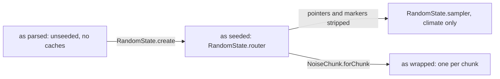

# Density functions

> Verified against **Minecraft 26.2** · Part XII · One number out of one point: how a JSON file becomes "stone or air", and why the graph you can read in the registry is never the graph that runs.

Open the overworld's *depth* function in a data pack and you can read the
shape of the world out of it in eleven lines: a gradient down the Y axis,
added to *overworld/offset* — which is fifteen hundred lines of continents and
erosion wrapped in things called *flat_cache* and *cache_2d*. Both files are
honest and readable. And the
object it parses into is never sampled by anything: it is rewritten once per
dimension, and again per chunk, and only the third form ever computes a
number for a block. **The caches named in that file cache nothing.** They are
requests, and something else grants them.

Terrain in 26.2 is a scalar field: a function from a block position to a
*double*, where the convention is that zero is the surface and **positive
means solid**. `DensityFunction` is the interface, `DensityFunctions` is the
library of node classes you build one out of, and a data pack assembles them
as JSON. Thirty-four *ids* are registered, which is not the same number as the
classes behind them: six of them are one `DensityFunctions.Marker`, seven are
one `DensityFunctions.Mapped`, and *old_blended_noise* is `BlendedNoise`,
which is not a `DensityFunctions` member at all. This page is the three forms
that one graph takes and the machinery that moves between them; the node types
themselves are
[the node catalogue](../../reference/density-function-nodes.md#the-table), and
the terrain steps that sample the result are
[terrain](terrain.md#filling-the-noise-six-loops-one-number-at-the-bottom).

Nothing here touches a block, and nothing here differs between two worlds
built from the same seed and the same packs. This is the layer that *the
seed* actually means.

## The cast

| class | what it owns | its clock |
|---|---|---|
| `DensityFunction` | one method that matters — `DensityFunction.compute`, taking a position and returning a double — plus `DensityFunction.fillArray` for the batch form and the two static bounds | — |
| `DensityFunctions` | the node library, and the codecs that dispatch a JSON *type* to one of them | data-pack load |
| `DensityFunction.NoiseHolder` | the seeding seam: a noise-parameters holder plus a `NormalNoise` that is **null as parsed** | filled once per dimension |
| `DensityFunctions.Marker` | a cache *request*, wrapping one function and computing nothing itself | replaced once per chunk |
| `NoiseRouter` | the fifteen functions a generator asks for, as one record; `NoiseRouter.mapAll` rebuilds all fifteen at once | — |
| `NoiseRouterData` | vanilla's graph, written in Java and *emitted* as the JSON that ships | build time |
| `RandomState` | the per-dimension instantiation: the seeded router, the climate sampler, the noise memo, the `SurfaceSystem` | once per level |
| `NoiseChunk` | the per-chunk instantiation, and simultaneously the sample position *and* the loop driver — it implements `DensityFunction.FunctionContext` and `DensityFunction.ContextProvider` both | once per chunk |

Underneath all of it is the *synth* package: `NormalNoise` (two `PerlinNoise`
stacks summed and normalised), `PerlinNoise` (octaves of `ImprovedNoise`),
`ImprovedNoise` (one octave of 3-D Perlin over a permutation table),
`BlendedNoise` (the pre-1.18 terrain noise, itself a
`DensityFunction.SimpleFunction`), plus two that no density function reaches:
`SimplexNoise`, which the End islands node uses directly, and
`PerlinSimplexNoise`, whose only three instances are the fixed-seed noises
`Biome` keeps for its own per-block temperature
([biomes](biomes.md#what-a-biome-still-owns)). `Noises` holds the sixty-three
keys for the parameter sets and `Noises.instantiate` builds one from a
positional factory. With `NoiseUtils` that is the whole package, seven
classes.

## Three forms of one graph

*One graph, three forms and a side copy: each arrow is a visitor rebuilding the whole graph, and only the wrapped form ever fills a chunk.*

What changes between the forms is four kinds of node, and the rest of the
graph — an *add*, a gradient, a spline — comes through every rewrite as it was.

| the node | as parsed | as seeded | as wrapped |
|---|---|---|---|
| a pointer at another entry, `DensityFunctions.HolderHolder` | a pointer | still a pointer | the graph it pointed at |
| a cache request, `DensityFunctions.Marker` | delegates, caches nothing | still delegates | the real cache, such as `NoiseChunk.FlatCache` |
| a noise leaf, `DensityFunction.NoiseHolder` | no noise, answers 0.0 | a real `NormalNoise` | the same `NormalNoise` |
| the blend and beardifier leaves | constants and a marker | unchanged | this chunk's blender and `Beardifier` |
| who samples it | nothing | the F3 readout, one point at a time | the cell loop |

All three arrows are `DensityFunction.mapAll`, which is the only interesting
operation in this system: it applies a `DensityFunction.Visitor` bottom-up
over a whole graph, rebuilding each node's children through
`DensityFunction.mapChildren`. A visitor has two channels —
`DensityFunction.Visitor.apply` for nodes and
`DensityFunction.Visitor.visitNoise` for noise leaves — and everything below
is one or other channel doing its job.

## Parse: one file, one graph

Every file under a pack's *worldgen/density_function* directory becomes one
registry entry through `DensityFunctions.DIRECT_CODEC`, which is an *either*:
a bare number in the JSON is silently a `DensityFunctions.Constant`, and
anything else dispatches on its type id through
`BuiltInRegistries.DENSITY_FUNCTION_TYPE` — the ordinary shape of a
data-driven type, and the reason a pack can write a new graph but not a new
kind of node, because that registry is frozen at start-up
([the data-driven type pattern](../foundations/data-driven-types.md#the-idea-stated-once),
[the freeze rule](../foundations/identifiers-and-registries.md#the-freeze-rule-stated)).
Every *child* slot instead uses
`DensityFunction.CODEC`, a `RegistryFileCodec`, so a string id, an inline
object and a bare number are interchangeable everywhere a function is
expected — and a `RegistryFileCodec` is exactly the kind that cannot resolve
an id without a registry context to read it against
([codecs, NBT and JSON](../foundations/codecs-nbt-json.md#where-the-registry-context-comes-from)).
A string becomes a `DensityFunctions.HolderHolder` — a live pointer
at another entry, which is how a graph references a graph.

Two things happen during construction that a reader of the JSON cannot see.
Constructors **fold**: `DensityFunctions.TwoArgumentSimpleFunction.create`
collapses an *add* or a *mul* with one constant argument into a
`DensityFunctions.MulOrAdd`, so a node type in the file is not necessarily
the class in memory. And the **bounds propagate**:
`DensityFunction.minValue` and `DensityFunction.maxValue` are computed as
each node is built and pushed upward, which makes them a static analysis of
the data pack — one that talks back, because building a *min* or a *max* over
two ranges that cannot possibly overlap logs a warning naming both arguments.

`DensityFunctions.HolderHolder` is the one node that cannot be written back
out: it is not registered, and asking it for its codec throws. It exists only
in memory, and re-serialising a graph goes through `DensityFunction.CODEC`,
which recognises it and emits the id string it came from.

## Seed: once per dimension

`RandomState.create` forks the seed into named positional factories —
`RandomState.aquiferRandom`, `RandomState.oreRandom`, and whatever else asks
through `RandomState.getOrCreateRandomFactory`, each an `XoroshiroRandomSource`
unless the settings ask for the legacy family
([math and primitives](../../reference/math-and-primitives.md#two-random-families-and-two-that-are-neither))
— and then runs
`NoiseRouter.mapAll` with a wiring visitor over all fifteen router fields.
The fifteen partition cleanly by consumer, and the partition is the map of
the rest of the part: six are the climate sampler's ([biomes](biomes.md#the-search-and-the-axis-that-is-not-sampled)),
five are the aquifer's — its four noises plus *preliminary_surface_level*,
which it samples at a single point to find the ground it should put a water
table under — three are the ore veins', and the last, *final_density*, is the
one the cell loop actually fills a chunk from
([terrain](terrain.md#the-two-fillers-what-the-number-becomes)). Nothing in
the decoration or structure packages ever mentions `DensityFunction` at all;
they reach the substrate only through the beardifier and the heights the
generator hands them.
The visitor fills each `DensityFunction.NoiseHolder` with a real
`NormalNoise` from `RandomState.getOrCreateNoise`, rebuilds `BlendedNoise`
with a new random source, and replaces the end-islands node with a reseeded
one. Everything else it passes through untouched: the markers and the
pointers survive this rewrite intact.

Two details in there matter later. The **two nether climate noises are
special-cased** into a legacy construction over a `LegacyRandomSource` and
therefore skip the memo entirely. And the visitor keeps its own memo of what
it has already rewritten, so a subgraph referenced from five router fields is
rewritten **once and stays one object** — which is precisely what makes the
per-chunk caching in the next step pay, because five router fields that share
a subgraph will share its cache.

The memo goes further than that, because it keys on the node *itself* and the
nodes are records: two separately parsed but structurally identical subgraphs
are equal, and so are merged into one object with one cache.
`DensityFunctions.Spline` makes the intent explicit with a hand-written
equality that compares only the spline and ignores the derived sampler beside
it, so two identical splines written into two different files end up as one
node.

This once-rewritten form is the one thing outside a chunk that ever samples
the graph, and it does it in production: `NoiseBasedChunkGenerator.addDebugScreenInfo`
walks `RandomState.router` with single-point contexts to fill the F3 noise
readout. That is the whole reason the seeded form has to stay safe to sample
from anywhere, with every marker still a no-op.

Then a *second*, different visitor runs, and it strips machinery rather than
installing it: it unwraps every `DensityFunctions.HolderHolder` to its value
and every `DensityFunctions.Marker` to its wrapped function, over the six
climate functions only, to build `RandomState.sampler`. That is the
`Climate.Sampler` [biomes](biomes.md#the-search-and-the-axis-that-is-not-sampled) reads — a copy
of the climate half of the graph with no caches and no indirection in it at
all.

## Wrap: once per chunk

`NoiseChunk.forChunk` builds the workspace and runs `NoiseRouter.mapAll` a
second time, and `NoiseChunk.wrapNew` is the switch that matters. A
`DensityFunctions.Marker` becomes the real cache its type names. A
`DensityFunctions.HolderHolder` is resolved to its value once instead of on
every sample. And three singletons are swapped **by object identity**:
`DensityFunctions.BlendAlpha` and `DensityFunctions.BlendOffset` become two
flat caches the `NoiseChunk` constructor has *already filled* from the
blender's own measurements, before any router mapping ran
([blending](blending.md#following-one-chunk-through)), and
`DensityFunctions.BeardifierMarker` becomes this chunk's `Beardifier`. If the
level's `Blender` is empty, the blend nodes
survive as the constants they are and a *blend_density* marker is replaced by
its own child, erasing the node.

So a *cache_once* written into a data pack does something, but not what it
says: it is a request that `NoiseChunk.wrapNew` install a cache in that slot,
and the node itself computes nothing and delegates. Worldgen performance lives
in a switch statement, not in the data.

Afterwards `NoiseChunk` adds the beardifier marker to the router's final
density itself, wraps the sum in one more cache-all-in-cell, and maps
*that* — which is why `NoiseChunk.fullNoiseDensity` is not any node the data
pack wrote ([terrain](terrain.md#filling-the-noise-six-loops-one-number-at-the-bottom)
walks the cells that sample it). Because the splice happens in the
constructor rather than in the data, **every noise dimension is beardified
whether or not its router JSON ever mentions a beardifier**, and "structures
flatten terrain" is implemented as an object comparison inside a visitor.

The rewrite is reversible, for the caches: the six installed classes all
implement `DensityFunctions.MarkerOrMarked`, so they still report their
original marker type and would serialise back to the id they came from — with
the standing exception that where there is no blending to do the sixth is
never installed at all. The blend leaves are not reversible either:
`DensityFunctions.BlendAlpha` comes back wrapped in a flat
cache it did not start inside.

## The six caches, and the three a single point may use

This is the payoff of the whole arrangement, and the split inside it is not
the one the names suggest.

`NoiseChunk.NoiseInterpolator`, `NoiseChunk.CacheAllInCell` and
`NoiseChunk.CacheOnce` each begin by checking that the sampling context *is*
the `NoiseChunk` itself, and delegate to the wrapped function when it is not.
They are meaningful only inside the cell loop — the interpolator throws
outright if sampled while the chunk is not interpolating, and the other two
key on a cell index or on an interpolation counter, neither of which means
anything outside it.

The other three do the opposite. `NoiseChunk.FlatCache` and
`NoiseChunk.Cache2D` key on **position alone** and will happily answer a
`DensityFunction.SinglePointContext`; `NoiseChunk.Cache2D` could not do
otherwise — it is the one nested class here that is *static*, so it holds no
reference to the chunk to compare against. The sixth, `NoiseChunk.BlendDensity`,
caches nothing at all — it is the wrapper a *blend_density* marker becomes, and
it hands every sample to the level's `Blender`
([blending](blending.md#what-the-blender-actually-answers)) — but it tests no
context either, so it too answers from anywhere. And that is exactly what makes
`NoiseChunk.cachedClimateSampler` and `NoiseChunk.preliminarySurfaceLevel`
cheap: both sample the wrapped graph with single-point contexts, and both hit
the two-dimensional caches every time. **A single-point sample is not a cache
bypass — it is a bypass of the three-dimensional caches only.**

All six carry a second entry point beside `DensityFunction.compute`:
`DensityFunction.fillArray` computes a whole run of positions against a
`DensityFunction.ContextProvider`, which is what the cell loop drives them
through. The array form is where the two counter-keyed caches earn their
keep, and it is why `NoiseChunk.CacheOnce` keeps a second counter of its own.

The resolutions are worth saying once. The *interpolated* marker sits on the
expensive three-dimensional terms and is evaluated at cell corners.
*flat_cache* is **not** exact per column: it fills its array by sampling at
the quart corner with y = 0, so one value serves a four-by-four block group.
Only *cache_2d* is genuinely per column, and vanilla is not consistent about
where it puts one: of the twenty-four in the shipped files, eleven sit inside
a flat cache and thirteen do not — and no *noise_settings* file contains a
*flat_cache* at all.

## What a bound is worth, and which form told you

`DensityFunction.minValue` and `DensityFunction.maxValue` are answered without
a position, which makes the pair a static analysis of the data pack — and the
analysis is of a graph that will be rewritten twice before it runs. Which
*individual* nodes report something other than their child's range — the
markers, the unbound pointer, the node that answers in Y — is the catalogue's
([the node catalogue](../../reference/density-function-nodes.md#bounds)). What
this page owns is that a bound can be wrong **because of which form the graph
is in**, and the two rewrites are wrong in opposite directions.

**Seeding widens.** `DensityFunction.NoiseHolder` answers a maximum of 2.0
while its noise is still null, and every one of the sixty-three shipped noise
definitions comes out between 2.57 and 7.32 once seeded. A freshly parsed
router therefore under-reports every noise in it.

**Wrapping changes.** The two blend leaves parse as the constants 1 and 0 and
are replaced by `NoiseChunk.BlendAlpha` and `NoiseChunk.BlendOffset` — inner
classes of the chunk, not the `DensityFunctions` singletons whose place they
take — with a range of zero to one and an infinite one. So a fold the
constructor decided above a blend node was decided on a range the running graph
does not have.

## What nothing reaches

Four names in this package read as machinery and are reached by nothing, and
one of them is the most misleading thing in the catalogue.
`DensityFunctions.shift`, the three-dimensional domain warp, is written by no
shipped file: vanilla uses only the two two-dimensional warps, which read the
*same* noise parameters with their axes swapped, behind a registry id called
*offset* rather than *shift*
([which ids vanilla uses](../../reference/density-function-nodes.md#what-vanilla-actually-uses)).
Beside it, `DensityFunctions.TransformerWithContext` is the shape a
position-dependent transform would take and has no implementation; `Density`
writes down the three conventions this whole system rests on — surface at
zero, and the two values a node reaches for when it wants to end an argument —
as constants **nothing anywhere reads**, the routers spelling the same numbers
as literals; and `NoiseUtils.biasTowardsExtreme` is a curve with no callers in
a package where every other class is on a hot path.

## The two nodes that read the world

Everything in the catalogue — every noise, spline, selector and cache — reads
no block, no chunk and no level, which is why the whole system can run on a
worldgen worker with nothing loaded, one chunk-status task at a time
([the chunk generation pipeline](../world/chunk-generation-pipeline.md#the-pyramid-drawn)).
Two nodes are the exception, and both keep the property anyway by the same
trick: they harvest what they need at construction and never touch a chunk
afterwards. The three blend nodes reach `BlendingData`
([blending at the old-chunk border](blending.md#one-measurement-five-consumers));
the *beardifier* marker becomes a `Beardifier`, whose
`Beardifier.forStructuresInChunk` reads the structure references out of chunks
at `ChunkStatus.STRUCTURE_REFERENCES`
([structure placement](structure-placement.md#the-ground-bends-before-the-ground-exists)).

That is what *deterministic* means here, stated once: the graph is a function
of the seed and the packs because the only two things in it that read anything
read work the same seed and the same packs already produced.

> **For a 1.21-era reader.** Three of the six climate functions have two
> names. `NoiseRouter` calls them *vegetation*, *ridges* and *continents*;
> `Climate.Sampler` calls the same three *humidity*, *weirdness* and
> *continentalness*. Neither vocabulary is wrong and both ship.

## Where to look

Read `DensityFunction` first — the interface is `DensityFunction.compute`,
`DensityFunction.fillArray` and the two bounds, and everything else is a node.
Then `DensityFunction.mapAll` and `DensityFunction.Visitor`, which are the only
interesting operation in the system, with `DensityFunctions.Marker` and
`DensityFunctions.HolderHolder` as the two node types the visitors exist to
replace. `DensityFunctions.DIRECT_CODEC` is the parse; `RandomState.create` and
`NoiseChunk.wrapNew` are the two rewrites, in that order, and reading them side
by side is the page. `NoiseRouter` is what they rewrite. Finish inside
`NoiseChunk`, where the six cache classes and `NoiseChunk.cachedClimateSampler`
live, and in `NoiseRouterData.overworld` for the graph vanilla actually ships.
One door the page never opens: `Noises.instantiate`, which is where a noise
definition becomes a `NormalNoise`.

---

*Rules: names, never code · how the system works, not how the code reads ·
newest version only · every backticked name passes `tools/verify_names.py`.*
