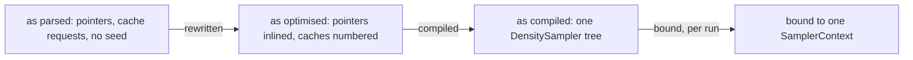

# Density functions

> Verified against **Minecraft 26.3** · Part XII · One number out of one point: how a JSON file becomes "stone or air", and why the graph you can read in the registry is never the graph that runs.

Open the overworld's *depth* function in a data pack and you can read the
shape of the world out of it in twelve lines: a gradient down the Y axis,
added to *overworld/offset* — which is fifteen hundred lines of continents and
erosion wrapped in a node called *cache*. Both files are
honest and readable. And the
object it parses into is never sampled by anything, because it has no method
that answers a number for a position: it is rewritten and compiled per
dimension, and only the compiled form ever computes a number for a block. **The cache named
in that file caches nothing.** It is a request, and something else grants it.

Terrain is a scalar field: a function from a block position to a
*float*, where the convention is that zero is the surface and **positive
means solid**. `DensityFunction` is the interface, `DensityFunctions` is the
library of factories you build one out of — the node classes themselves sit in
the *generator* and *op* packages under it — and a data pack assembles them
as JSON. Forty-four *ids* are registered, which is not the same number as the
classes behind them: eleven of them are one `UnaryFunction`, six are one
`BinaryFunction`, four are one `RoundFunction`, three are one
`SimpleDensityFunction`, and *old_blended_noise* is `BlendedNoise`, which
lives with the noises in the *synth* package. This page is the three forms
that one graph takes and the machinery that moves between them; the node types
themselves are
[the node catalogue](../../reference/density-function-nodes.md#the-table), and
the terrain steps that sample the result are
[terrain](terrain.md#filling-the-noise-six-loops-one-number-at-the-bottom).

Nothing here touches a block, and nothing here differs between two worlds
built from the same settings and the same packs. This is the layer that *the seed* means.

## The cast

| class | what it owns | its clock |
|---|---|---|
| `DensityFunction` | the description, which answers no number for a position: `DensityFunction.compileSampler` builds its sampler, `DensityFunction.rewriteChildren` lets a rule rebuild it, and `DensityFunction.range` and `DensityFunction.domainAxes` are the static analysis | — |
| `DensityFunctions` | the factories, the registration of the node types, and the codecs that dispatch a JSON *type* to one of them | start-up, then data-pack load |
| `DensitySampler` | the compiled form, the only one that answers a number: `DensitySampler.sampleValue` for one point, `DensitySampler.sampleVolume` for a whole `DensityVolume` at once | compiled once per dimension |
| `CacheFunction` | a cache *request*, wrapping one function; it refuses to compile | replaced once per dimension |
| `NoiseRouter` | the eight functions a generator asks for, as one record; `NoiseRouter.createClimateSampler` turns six of them into a `Climate.Sampler` | — |
| `NoiseRouterData` | vanilla's graph, written in Java and *emitted* as the JSON that ships | build time, and at run time for `NoiseRouterData.none` and `NoiseRouterData.peaksAndValleys` |
| `RandomState` | the per-dimension instantiation: the seed's random factories, the noise memo, the `DensityFunctionCompiler`, the `MaterialSystem` | once per level |
| `NoiseChunk` | one run of the graph: its `DensityVolume` — the chunk's, or one column's for a height query — its aquifer, and the one `SamplerContext` every sampler it hands out is bound to | once per chunk, and once per height query |

Underneath all of it is the *synth* package: `NormalNoise` (a noise
*definition* — octaves, amplitudes, normalisation — which `NormalNoise.create`
seeds into one `NoiseStack` of paired `PerlinNoise` octaves), `PerlinNoise`
(one octave of 3-D Perlin over `GradientNoise`'s permutation table),
`NoiseStack` (octaves summed, each at its own frequency and amplitude),
`BlendedNoise` (the pre-1.18 terrain noise, itself a density function node,
built from `SmearedPerlinNoise` octaves), `LegacyFbmInitializer` (the old
construction the two nether climate noises keep), and `SimplexNoise`, which no
noise definition reaches: the End islands node uses it directly, and the
fixed-seed noises `Biome` keeps for its own per-block temperature are built
from it ([biomes](biomes.md#what-a-biome-still-owns)). Every seeded noise is a `Noise`, and with `NoiseUtils` that is the whole package. `Noises`, one package up, holds the sixty-four keys for the definitions, and `Noises.instantiate` seeds one from a positional factory.

## Three forms of one graph

```mermaid
flowchart LR
    P["as parsed: pointers, cache requests, no seed"] -->|"rewritten"| O["as optimised: pointers inlined, caches numbered"]
    O -->|"compiled"| C["as compiled: one DensitySampler tree"]
    C -->|"bound, per run"| B["bound to one SamplerContext"]
```

*One graph, three forms and a binding: the rewrite and the compile happen once per dimension, and every run binds the same compiled tree to a context of its own.*

What changes between the forms is four kinds of node and any subgraph that
ignores an axis, and the rest of the graph — an *add*, a gradient, a spline —
comes through the rewrite as it was.

| the node | as parsed | as optimised | as compiled |
|---|---|---|---|
| a pointer at another entry, `DensityFunctions.HolderHolder` | a pointer | the graph it pointed at | that graph's sampler |
| a cache request, `CacheFunction` | refuses to compile | a numbered `DensityFunctionCompiler.PreparedCache`, one per distinct input | a `CachingDensitySampler` that asks the context for its cell |
| a seeded leaf: `NoiseFunction`, and the shift, blended-noise and end-islands nodes | a definition, no seed | unchanged | seeded from the compile context |
| the blend and beardifier leaves, `SimpleDensityFunction` | three singletons | unchanged | a `ContextBoundSampler` that asks the context, else answers 1, 0 or 0 |
| a subgraph that ignores an axis its parent uses | as written | wrapped in a `SliceFunction` at zero on that axis | computed once, copied along that axis |
| who samples it | nothing | nothing | everything, each against its own `SamplerContext` |

The first two arrows are where the graph changes. A `DfRewriteRule` takes a
node and returns one, reaching its children through
`DensityFunction.rewriteChildren`, which rebuilds a node when a child comes
back different; the compiler runs two in sequence — its own, which
inlines every pointer and numbers every cache, then
`DfRewriteRule.SLICE_UNIFORM_AXES`. Then `DensityFunction.compileSampler`
turns what is left into samplers, each node building its own from its
children's. The third arrow changes nothing in the tree: it pairs it with a
context, and everything a chunk adds — its caches, its blender, its
beardifier — arrives that way.

## Parse: one file, one graph

Every file under a pack's *worldgen/density_function* directory becomes one
registry entry through `DensityFunctions.DIRECT_CODEC`, which is an *either*:
a bare number in the JSON is silently a `ConstantFunction`, and
anything else dispatches on its type id through
`BuiltInRegistries.DENSITY_FUNCTION_TYPE` — the ordinary shape of a
data-driven type, and the reason a pack can write a new graph but not a new
kind of node, because that registry is frozen at start-up
([the data-driven type pattern](../foundations/data-driven-types.md#the-idea-stated-once),
[the freeze rule](../foundations/identifiers-and-registries.md#the-freeze-rule-stated)).
Every *child* slot instead uses
`DensityFunction.CODEC`, a `RegistryFileCodec`, so a string id, an inline
object and a bare number are interchangeable everywhere a function is
expected — and a `RegistryFileCodec` is exactly the kind that cannot resolve
an id without a registry context to read it against
([codecs, NBT and JSON](../foundations/codecs-nbt-json.md#where-the-registry-context-comes-from)).
A string becomes a `DensityFunctions.HolderHolder` — a live pointer
at another entry, which is how a graph references a graph.

Two things a reader of the JSON cannot see happen at the compile; construction
keeps every node as the file wrote it. The compiler **folds**:
`BinaryFunction.compileSampler` turns a two-argument node with one constant
argument into a sampler that carries the constant, such as `BinaryFunction.ConstAddSampler`, unless a *min* or *max* has already been settled from its bounds, so a node type in the file is not
necessarily the sampler that runs. And it **reads the bounds**, a static analysis of the data pack: `DensityFunction.range` answers from a node's children without
a position — one that talks back, because compiling a *min* or a *max* over
two ranges that cannot possibly overlap logs a warning naming both arguments,
and compiles only the side that wins whenever the inputs stay inside their declared ranges.

`DensityFunctions.HolderHolder` is the one parsed node that cannot be written back
out: it is not registered, and asking it for its codec throws. It exists only
in memory, and re-serialising a graph goes through `DensityFunction.CODEC`,
which recognises it and emits the id string it came from.

## Seed: once per dimension

`RandomState.create` forks the seed into one positional factory — from which
`RandomState.getOrCreateRandomFactory` hands out named ones, *aquifer* and
*ore* among them, each a factory of `XoroshiroRandomSource`s unless the settings ask for the legacy family
([math and primitives](../../reference/math-and-primitives.md#two-random-families-a-saved-table-and-a-mixer))
— and builds a `DensityFunctionCompiler`, rewriting nothing: the first
`RandomState.getSampler` for a function rewrites and compiles it, once for the
dimension.
The eight router fields partition cleanly by consumer, and the partition is
the map of the rest of the part: six are the climate sampler's ([biomes](biomes.md#the-search-and-the-axis-that-is-not-sampled)),
one — *chunk_surface_level* — is the surface rules', and the last,
*final_density*, is the one the fill samples a chunk from
([terrain](terrain.md#the-aquifer-what-the-number-becomes)). The aquifer
and the ore veins read functions of their own, from the settings' *aquifers*
block and the two ore-vein material rules; the aquifer's *surface_level*,
sampled on a quart grid, is how it finds the ground it should put a water
table under. Nothing in
the decoration or structure packages ever mentions `DensityFunction` at all; they reach the substrate only through the beardifier, the heights the generator hands them and the `Climate.Sampler` a structure's biome test reads — the generator's own for a structure start, and one that `StructureCheck` and `JigsawPlacement.generateJigsaw` each build for themselves.
A density function is seeded inside the compile and nowhere else, through the `DensityFunction.CompileContext` that `RandomState` builds: a noise leaf
gets a seeded `Noise` from `RandomState.getOrCreateNoise`, a memo keyed by the
definition's id; `BlendedNoise` gets a random source forked by the name *terrain*, or under the legacy family a `LegacyRandomSource` on the bare seed; the end-islands node gets a `LegacyRandomSource` on the bare seed.
The parsed graph itself is never touched.

Two details in there matter later. The **two nether climate noises are
special-cased** into a legacy construction over a `LegacyRandomSource` and
therefore skip the memo entirely. And the compiler keeps its own memo of the
caches it has prepared, keyed by what each one wraps, so a cache reached from several router fields is prepared **once and stays one object** — which is precisely what makes the per-chunk caching in the next step pay, because router fields that share a cache share its number, and a number is one cell in
a context.

The memo goes further than that, because it keys on the wrapped node *itself*
and the nodes are records: two separately parsed but structurally identical
cache requests are equal, and so are merged into one object with one cache.

The compiled form is the only one anything ever samples, and away from the
fill it is sampled in production: the biome step, the biome searches, the structure starts and checks, the height queries behind `ChunkGenerator.getBaseHeight`, the spawn search and the F3 noise readout, which
`NoiseBasedChunkGenerator.addDebugScreenInfo` fills from the settings' own
*debug_functions* list, all run the dimension's compiled samplers against
contexts of their own. That is the whole reason a compiled sampler has to stay
safe to run against any context, down to `SamplerContext.EMPTY_UNCACHED`, which
holds no cache and no field at all. No second graph is built for the climate
either: `RandomState.createClimateSampler` binds the six climate fields'
samplers to whatever context its caller brings, and that is the
`Climate.Sampler` [biomes](biomes.md#the-search-and-the-axis-that-is-not-sampled)
reads.

## Wrap: once per chunk

`NoiseBasedChunkGenerator.createNoiseChunk` builds the workspace and rewrites
nothing; the `SamplerContext` the `NoiseChunk` constructor builds is the
switch that matters. It has caches on, buffers from a `DensityBufferPool`
borrowed from `RandomState`, and user fields that carry this chunk's world:
the chunk's `Beardifier` under `Beardifier.CONTEXT_KEY` and, when the step's
`Blender` is not empty, the blender under `Blender.CONTEXT_KEY` and two
samplers under `Blender.ALPHA_KEY` and `Blender.OFFSET_KEY`, over an alpha and
an offset the constructor has *already measured* for the whole volume, before
anything is sampled ([blending](blending.md#following-one-chunk-through)).
Every sampler the chunk hands out is the dimension's compiled one, wrapped in a
`DensitySampler.Bound` with that context. The three `SimpleDensityFunction`
leaves look their key up on every call and fall back to 1, 0 and 0 when it is
missing, and a *blend_density* node passes its input through when the context
has no blender.

So a *cache* written into a data pack does something, but not by itself: it
is a request that the compiler give that slot a number, and the node itself
cannot even be compiled. The cell behind the number is the context's, and a
context built without caches, such as `SamplerContext.EMPTY_UNCACHED`, grants
none. Worldgen performance lives in the compiler and the context, not in the
node.

The fill samples the router's *final_density* as the data pack wrote it, one
volume for the whole chunk
([terrain](terrain.md#filling-the-noise-six-loops-one-number-at-the-bottom)
walks the loop that reads it). The beardifier is in the data too: every
shipped router's *final_density* ends in an *add* with a *beardifier* node,
and the chunk only puts a `Beardifier` into the context, so **a noise
dimension is beardified only if its router's graph has a beardifier node in
it**, and "structures flatten terrain" is implemented as a context lookup
inside one leaf.

Nothing here needs reversing: the registry keeps the graph as parsed, and it
serialises back unchanged, while `DensityFunctionCompiler.PreparedCache`
refuses to encode and the compiled form is not a `DensityFunction` at all.

## The one cache, and what a single point may use

This is the payoff of the whole arrangement: the data asks for one kind of
cache, and what that cache does is decided by the context it runs in and the
call it answers.

Each cache number is one cell in a context that enables caches, and the cell
answers two calls. `SamplerContext.sampleVolumeCached` answers a volume: the
first request samples the whole volume into a buffer from the context's arena,
and every later request for the same volume gets a copy, until a different
volume replaces it. `SamplerContext.sampleValueCached` answers one point —
from the one point the cell last computed, else from the cell's buffer when
the point lies on its volume, else by computing it and remembering it. A
context built without caches has no cells, and every cache computes straight
through.

**A single-point sample is not a cache bypass — it reads the volume a cache
already holds, when the point lies on it.** A volume can be coarser than the
blocks it covers, as the corners of interpolation cells are, and then a point
on its grid is a hit while a point between is computed. Every
sampler carries both calls, `DensitySampler.sampleValue` and
`DensitySampler.sampleVolume`, and the volume is what the fill drives: one
call for the chunk's whole volume, each node filling a buffer from its
children's.

The resolutions are worth saying once. *interpolated* is not a cache at all:
it carries its own cell size — four by eight by four under the overworld's
and the Nether's final density, eight by four by eight under the End's and
the floating islands', sixteen by one by sixteen for *chunk_surface_level* —
samples its input at the cell corners, and fills the blocks between by
trilinear interpolation. The per-column saving is no node's:
`DfRewriteRule.SLICE_UNIFORM_AXES` wraps every subgraph whose
`DensityFunction.domainAxes` lack an axis its parent's have, constants and
gradients aside, in a `SliceFunction` at zero on that axis, so a
two-dimensional term inside a three-dimensional graph is computed once per
column of whatever volume is asked for. And vanilla spends the one cache
freely: thirty-two *cache* nodes sit in the shipped *density_function* files,
and no *noise_settings* file contains one at all.

## What a bound is worth, and which form told you

`DensityFunction.range` is answered without a position, which makes it a
static analysis of the data pack — and the analysis is of a graph that will
be rewritten and compiled before it runs. Which *individual* nodes report
something other than their child's range is the catalogue's
([the node catalogue](../../reference/density-function-nodes.md#bounds)). What
this page owns is what the compiler does with a bound — settles a *min* or a
*max* from it, and hands the sampler the other side's limit so that a single
point can skip that side — and that **every form that reports a bound reports the same one**.

**Seeding changes nothing.** A noise leaf answers from its definition, not
from a seeded noise: `NormalNoise.range` is fixed when the definition is
decoded, and every one of the sixty-four shipped noise definitions reports a
symmetric bound, from ±0.87 to ±5.73, before any seed exists. A freshly parsed
router therefore reports the bounds the compiled one runs with.

**Nor does the context.** The three leaves a context can replace declare the
range of what replaces them — zero to one for *blend_alpha*, unbounded for
*blend_offset* and the *beardifier* — and their fallbacks, 1, 0 and 0, sit
inside it. So a *min* or a *max* the compiler settles above a blend leaf is
settled on the range the running graph has.

## What nothing reaches

Among the names in this system that read as machinery and are reached by nothing, two are worth a warning, and one of them is the most misleading thing in the catalogue.
`DensityFunctions.shift`, the three-dimensional domain warp, is written by no
shipped file: vanilla uses only the two two-dimensional warps, which read the
*same* noise parameters with their axes swapped, behind a registry id called
*offset* rather than *shift*
([which ids vanilla uses](../../reference/density-function-nodes.md#what-vanilla-actually-uses)).
Beside it, `NoiseUtils.biasTowardsExtreme` is a curve with no callers in a package where every other class builds or samples a noise. `Density` cannot join them: its three values are compile-time constants, which javac writes into whatever uses them, so the decompile cannot say who reads them — but it names the three conventions this whole system rests on: surface at zero, and the 64 and −64 a node reaches for when it wants to end an argument.

## The nodes that read the world

Everything in the catalogue — every noise, spline, selector and cache — reads
no block, no chunk and no level, which is why the whole system can run on the [worker pool](../../reference/threads.md#the-threads-a-lecture-leans-on) with nothing loaded, one chunk-status task at a time
([the chunk generation pipeline](../world/chunk-generation-pipeline.md#the-pyramid-drawn)).
Four nodes from two sources are the exception, and all keep the property anyway by the same trick: they read only what the sampling context carries, and everything in it
was harvested before the first sample. The three blend nodes reach
`BlendingData` through the blender
([blending at the old-chunk border](blending.md#one-measurement-five-consumers));
the *beardifier* node reads a `Beardifier`, whose
`Beardifier.forStructuresInChunk` reads the structure references out of chunks
at `ChunkStatus.STRUCTURE_REFERENCES`
([structure placement](structure-placement.md#the-ground-bends-before-the-ground-exists)).

That is what *deterministic* means here, stated once: the only two sources anything in the graph reads hold work done before the first sample — structures the same seed and the same packs placed, and, beside a chunk an older version left, what that chunk's blocks measure — so the graph is a function of the seed and the packs everywhere except beside such a chunk, which is the part's one deliberate exception ([world generation](README.md)).

> **For a 1.21-era reader.** The cache
> markers *flat_cache*, *cache_2d*, *cache_once* and *cache_all_in_cell* are
> gone, and *cache* does their work; *DensityFunction.compute* is gone, and
> `DensitySampler.sampleValue` does its work on the compiled form.

## Where to look

Read `DensityFunction` first — the interface is `DensityFunction.compileSampler`,
`DensityFunction.rewriteChildren` and the static analysis, and everything else
is a node — and then `DensitySampler`, the form that answers. Then
`DfRewriteRule` and `DensityFunctionCompiler`, which are where the graph
changes, with `CacheFunction` and
`DensityFunctions.HolderHolder` as the two node types the rewrite exists to
replace. `DensityFunctions.DIRECT_CODEC` is the parse;
`DensityFunctionCompiler.getSampler` and the `NoiseChunk` constructor are the
compile and the binding, in that order, and reading them side by side is the
page. `NoiseRouter` names most of what they compile. Finish inside
`SamplerContext`, where the cache cells live, and in
`NoiseRouterData.registerTerrainNoises` for the graph vanilla ships.
One door the page never opens: `Noises.instantiate`, which is where a noise
definition becomes a seeded `Noise`.

---

*Rules: names, never code · how the system works, not how the code reads ·
newest version only · every backticked name passes `tools/verify_names.py`.*
