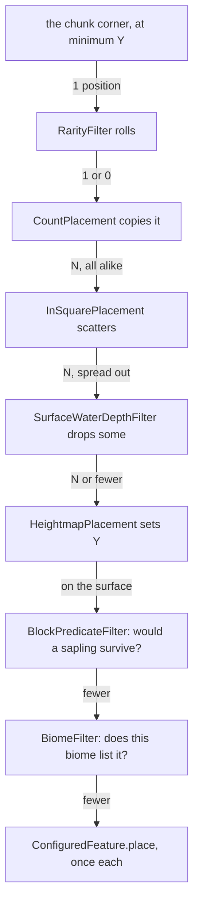
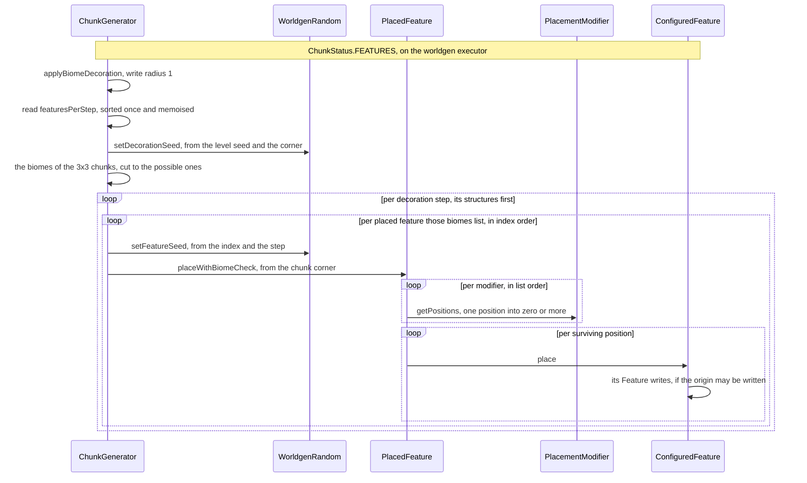

# Features and placement

> Verified against **Minecraft 26.2** · Part XII · A chunk decorates: a stream of positions folded through filters, an order every chunk in the dimension already agreed on, and a data pack that can stop the world from opening.

The oak in the middle of a plains chunk was not placed by the plains biome.
It was placed by a list that every biome in the dimension contributed to,
sorted once at world load into one order per decoration step, with an index
per entry that the random seed for each feature is derived from. That is how the same
seed grows the same forest — and it is also why **two biomes that list the
same two features in opposite orders make the world refuse to open.** The
order is a topological sort of a graph, and a graph can have a cycle.

Decoration is everything the terrain steps did not put there: trees, flowers,
ores, lakes, patches, springs. The system separates three things a modder
usually wants separately — *what* to build, *where* to try, and *who* wants
it — and this page is how those three meet at `ChunkStatus.FEATURES`. All
three are registries of dispatched types, which makes this the largest single
instance of [the data-driven type
pattern](../foundations/data-driven-types.md#the-idea-stated-once) in the
game. The
biggest single feature, the tree, has its own page
([trees](trees.md#one-algorithm-five-slots)); the terrain that decoration
lands on is [terrain](terrain.md#the-two-fillers-what-the-number-becomes).

## The chain, before anything else

Everything below is one picture: a stream that starts as a single position and
is flat-mapped through an ordered list of modifiers until whatever survives it
gets built. A realistic chain for a tree runs like this.

*One position becomes many and then fewer: only the count multiplies, Y is not set until the fifth modifier, and the shipped plains trees run this chain without its rarity roll.*

List order *is* the meaning — the same seven modifiers in another order place a
different forest, or none — and the rest of the page is who assembles that list,
who seeds it, and what each link in it is allowed to know.

## The cast

| class | its job | notes |
|---|---|---|
| `Feature` | the algorithm, with one method: `Feature.place`, taking a `FeaturePlaceContext` and returning whether it wrote anything | **63** registered into `BuiltInRegistries.FEATURE` — and being a `Feature` is not the same as being in it: `EndPodiumFeature` is constructed directly by the dragon fight and appears in no registry at all |
| `FeatureConfiguration` | its parameters, per feature type | `NoneFeatureConfiguration` for the ones that need none |
| `ConfiguredFeature` | a feature plus its configuration, and **no position logic at all** | the unit a sapling grows |
| `PlacedFeature` | a configured feature plus an ordered list of modifiers | the unit a biome names — the only one of the three that owns placement modifiers |
| `PlacementModifier` | one function from a position to a *stream* of positions, over a `PlacementContext` | 15 registered types |
| `GenerationStep.Decoration` | the eleven steps, in order, from raw generation to top-layer modification | a biome's list is a list of lists, by ordinal |
| `FeatureSorter` | flattens every possible biome's per-step lists into one sorted list per step, with an index lookup | run once; `ChunkGenerator.featuresPerStep` is the memoised field that holds its answer |
| `WorldgenRandom` | the seed, reseeded absolutely twice: once per chunk, then once per feature | on the worldgen executor |

## One chunk's decoration, from the corner outward

*Two reseedings and two nested loops: every feature is reseeded from its own index before it runs, and each surviving position is one call into the feature's algorithm.*

**The driver.** `ChunkGenerator.applyBiomeDecoration` starts at the chunk's
minimum corner, at the world's minimum Y. There is no eight-block population
offset; the scatter comes later, from a modifier.

**The seed.** A `WorldgenRandom` is built over a genuinely random seed and
then reseeded absolutely, twice, before anything uses it.
`WorldgenRandom.setDecorationSeed` derives a per-chunk seed from the world
seed and the chunk corner, and each feature then gets
`WorldgenRandom.setFeatureSeed` from that seed, its index within the step and
the step number, which the seed multiplies by ten thousand to keep the steps
apart. Features in a step therefore do *not* share a random stream: every one
is reseeded absolutely before it runs, so an extra draw inside a feature
perturbs the rest of *that* feature and nothing after it.

**Who wants what.** The biome palettes of the surrounding 3×3 chunks are
unioned and intersected with the biome source's possible biomes
([biomes](biomes.md#the-cast)). Every placed
feature any of those biomes lists for this step — the per-step lists on its
`BiomeGenerationSettings` — is collected by its index in
that step's list, and the indices are **sorted** — that sort is the execution order, and
it is the same for every chunk *in that dimension*, because
`ChunkGenerator.featuresPerStep` is memoised per generator and built from
that generator's possible biomes. The Nether's order has nothing to do with
the Overworld's. Within each step, structures at that step are placed before
its features ([structure
placement](structure-placement.md#then-the-blocks-arrive-one-chunk-at-a-time)) —
and they share the step loop without sharing the index space, so a structure
and a feature sitting at the same index in the same step draw the **same**
feature seed. They differ in reach as well: a structure piece gets an explicit
writable box covering exactly the centre chunk, where a feature gets only the
softer write-zone check below.

## The order is a graph, and a graph can have a cycle

That sort is where a data pack can stop a world from opening, and it is the
only place in generation where one can. Every biome's per-step list contributes
*this before that* edges to one graph per step, and
`FeatureSorter.buildFeaturesPerStep` topologically sorts it. Two biomes listing
the same two features in opposite orders form a cycle, and the sort throws
rather than returning an order — it will even re-run itself, dropping one source
at a time, to name the smallest offending set.

Where you find out depends on which side you are on. The **client** calls
`ChunkGenerator.validate` from `WorldOpenFlows` while opening the world, catches
the exception and offers safe mode. A dedicated server never calls
`ChunkGenerator.validate` at all, so there the cycle surfaces later, as a crash
report wrapped around the first chunk that tries to decorate.

## The fold

`PlacedFeature.placeWithBiomeCheck` starts that stream at the chunk corner, at
the world's minimum Y, and flat-maps it through each modifier in turn. Nothing
about it is a filter chain in the usual sense: a modifier may return nothing,
one position, or many.

Four of the modifiers in that chain are pure filters — `RarityFilter` at the
head, which turns one position into one or none on a roll;
`SurfaceWaterDepthFilter`; `BlockPredicateFilter`, the survival check; and
`BiomeFilter` — and they are what a `PlacementFilter` is: a modifier that
returns the position it was given, or nothing. Three other things about the
chain are load-bearing, and none of them is obvious from a data pack.

**A repeating placement does not scatter.** `CountPlacement`,
`NoiseBasedCountPlacement` and `NoiseThresholdCountPlacement` are
`RepeatingPlacement`s: they emit the *same* position N times, and the scatter
is a separate modifier downstream. List order decides the outcome —
count-then-scatter gives ten trees in ten places, scatter-then-count gives
ten trees in one.

**Y is set late.** Positions travel through most of the chain at the world's
minimum Y; a `HeightmapPlacement` or a `HeightRangePlacement` is what puts
them on the ground, and a chain that forgets one places at the bottom of the
world. `WorldGenRegion.getHeight` returns the stored height **plus one**, so
a heightmap placement lands on top of the surface rather than in it. Two of
vanilla's heightmap presets read the *worldgen* heightmaps, which are not
among the four `ChunkStatusTasks.generateFeatures` primed on the way in
([the six heightmaps](../world/chunk-anatomy.md#the-six-heightmaps)).

**The biome is checked twice.** A feature was selected because *some* biome
in the 3×3 wanted it; `BiomeFilter` re-reads the biome at the scattered
position and asks whether *that* biome's generation settings contain this
exact placed feature. Without it every biome would bleed its trees a chunk in
each direction. Vanilla is not consistent about where it goes: the base tree
placement ends with the biome filter and the survival-checked variant appends
its block predicate *after* it, so both orders ship.

What every one of them is handed is a `PlacementContext`, and it is more
world than anything else in this system gets: the block state at a position,
a heightmap reading, the chunk's carving mask, and — the field the biome
filter needs — which placed feature the chain started from.

Fifteen modifier types are registered, and this page has named ten of them —
the seven in the chain and three more beside it. The shapes account for all fifteen. **Five** extend `PlacementFilter` —
the four in the chain plus `SurfaceRelativeThresholdFilter`, which keeps a
position only if a heightmap reading above or below it falls in a range.
**Three** are `RepeatingPlacement`s and **two** set Y. **Four** simply move a
position: `InSquarePlacement` scatters within the chunk,
`RandomOffsetPlacement` jitters, `EnvironmentScanPlacement` searches up or down
for a surface over a `CaveSurface`, and `FixedPlacement` names absolute
positions. The fifteenth fits no shape at all: `CountOnEveryLayerPlacement` is
deprecated, extends `PlacementModifier` directly, and does its own scatter and
cave-layer scan inside `PlacementModifier.getPositions`.

## A feature that is a tree of features

Five of the sixty-three registered features write no blocks of their own.
They take other *placed* features and choose between them, which is how a data
pack builds decoration out of decoration rather than out of algorithms:
`RandomSelectorFeature` walks a weighted list rolling each entry's chance and
falls back to a default; `SimpleRandomSelectorFeature` picks a uniform index;
`WeightedRandomSelectorFeature` draws from a weighted list;
`RandomBooleanSelectorFeature` flips a coin between two;
and `SequenceFeature` places every entry in order and **stops at the first
failure**, reporting failure itself. The plains oak is one of these — a
random selector between a fancy oak, a fallen oak and a plain oak with bees.
(A sixth writes nothing and chooses nothing: `Feature.NO_OP` is a deliberate
blank, and it is what an empty slot in a data pack is spelled as.)

All five call `PlacedFeature.place`, not
`PlacedFeature.placeWithBiomeCheck` — which is exactly why a `BiomeFilter`
inside a nested placed feature is an *error* rather than a no-op. The filter
needs the context's top feature, and only the biome-check entry sets it. That
is why the "checked" tree placements carry no biome filter and the
biome-level ones do.

## What a feature may write, and where it may read

`ChunkStatus.FEATURES` is the only step in the generation pyramid with a
*positive* block write radius, and the radius is one — so a tree may cross
into a neighbour, and nothing else in generation may cross into anything
([four steps may write, and only
four](../world/chunk-generation-pipeline.md#four-steps-may-write-and-only-four)).

What that permission is worth is decided twice, and the second time is this
page's. `Feature.place` checks `WorldGenLevel.ensureCanWrite` for the origin
once, and then each individual write is re-checked by
`WorldGenRegion.ensureCanWrite`, which logs — and pauses, in a development
environment — and does not write. A canopy that would reach two chunks out is
therefore **truncated**, not moved and not abandoned: half a tree, written
without complaint. Reading is looser and then suddenly much stricter. A read
outside the write zone is a warning and still happens; a read past the step's
declared dependency radius — eight chunks at this step, and only of chunks at
`ChunkStatus.STRUCTURE_STARTS` — throws instead of loading, which is what makes
cascading worldgen structurally impossible rather than merely discouraged
([a read too far crashes, a read too wide only
warns](../world/chunk-generation-pipeline.md#a-read-too-far-crashes-a-read-too-wide-only-warns)).

A radius of one in both directions means a chunk goes on changing after it has
decorated: all eight neighbours write into it when *they* decorate, and nothing
in the dependency graph says that is safe — the graph fixes the *order*, not the
exclusion. What makes it safe is that every worldgen task in a dimension is
serialised behind one executor, so no two neighbours are ever inside the centre
chunk at once
([dispatch, and why the parallelism is smaller than the thread
names](../world/chunk-generation-pipeline.md#dispatch-and-why-the-parallelism-is-smaller-than-the-thread-names)).

The supporting value types are worth naming because they sit on a ladder of
four rungs, and each rung is how much world its types are trusted with. On the
first, `IntProvider` and `FloatProvider` get a random source and nothing else.
On the second, `HeightProvider.sample` and `VerticalAnchor.resolveY` get a
`WorldGenerationContext`, which despite the name is two integers — the world's
minimum Y and its height. On the third, a `BlockStateProvider` gets a random
source and a position, and picks the block to write from them. Only the
fourth sees the world: `BlockPredicate` extends
`BiPredicate<WorldGenLevel, BlockPos>`, which is why a placement can ask what
block is under the sapling — and why `BlockPredicateFilter` is the one modifier
in the chain that can refuse a position on the strength of what is already
there. Every one of those types is its own registry of dispatched types, and
every registry is mostly instances: fourteen block predicates, of which four
are boolean combinators over the other ten; six height providers, which are
distribution shapes over one range; eight state providers, which pick a block
from a weight, a noise or a rule. The head of each family is explained once,
here; the members are a catalogue this book declines
([what this book skips](../anatomy/what-this-book-skips.md)).

## Questions players ask

**Does a sapling grow the same way a worldgen tree does?** No — it skips this
whole page, and it is one of three doors into a feature. Decoration is the
first and is everything above. `/place feature` is the second, and places a
configured feature outright with no placement layer at all. Growth is the
third: `SaplingBlock.advanceTree` and bone meal run on the **server main
thread** and call `ConfiguredFeature.place` on the `ServerLevel` directly, so
there is no placement chain, no biome filter and no write guard
(`WorldGenLevel.ensureCanWrite` is an interface default that is always true).
It also hand-manages the sapling block, which is a story of its own
([trees](trees.md#one-algorithm-five-slots)).

**Where are the actual features?** Sixty-three algorithms is the longest tail
in the part — icebergs, geodes, dripstone clusters, lakes, springs, coral,
huge fungi, the End spikes — and none of them is a mechanism this page has not
already explained: each is one `Feature.place` writing blocks from a
configuration, reached the same way as every other. The book names the
framework and declines the catalogue
([what this book skips](../anatomy/what-this-book-skips.md)); the two that do
something structurally different are named where they bite, `OreFeature` on
[chunk anatomy](../world/chunk-anatomy.md#sections-and-their-four-counters)
for holding a section open across many writes, and `TreeFeature` on
[trees](trees.md#one-algorithm-five-slots).

## Where to look

`ChunkGenerator.applyBiomeDecoration` is the driver and holds the whole
scenario: the two reseedings, the 3x3 biome union and the sorted index loop.
Read `FeatureSorter.buildFeaturesPerStep` next, because it is the sort the
hook turns on, with `ChunkGenerator.validate` beside it for where the cycle is
caught. Then the fold: `PlacedFeature.placeWithBiomeCheck` and
`PlacementModifier.getPositions` are the whole of it, and
`PlacementFilter`, `RepeatingPlacement` and `HeightmapPlacement` are one
example of each shape a modifier can take — `BiomeFilter` last, since it is
the one that needs the context the entry point sets. `PlacementContext` is
what a modifier is trusted with and `FeaturePlaceContext` what a feature is;
reading the two side by side is the ladder. Finish at
`WorldGenRegion.ensureCanWrite`, which is where a tree gets truncated, and at
`RandomSelectorFeature` for a feature made of features. One door the page does
not open: `BlockStateProvider`, the busiest of the four value families.

---

*Rules: names, never code · how the system works, not how the code reads ·
newest version only · every backticked name passes `tools/verify_names.py`.*
