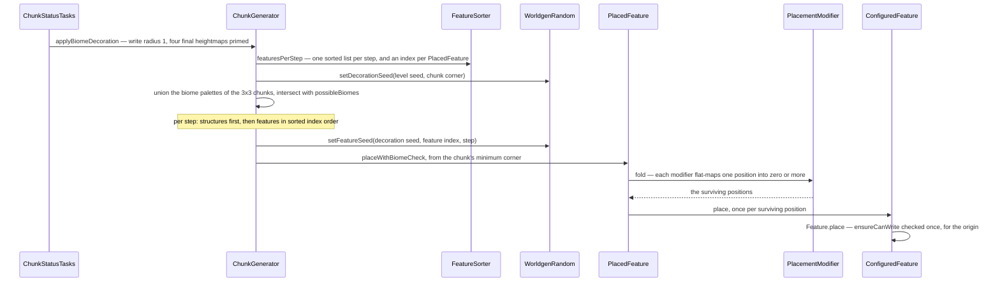
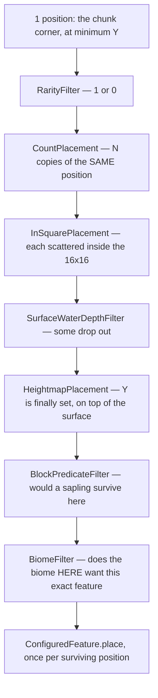

# Features and placement

> Verified against **Minecraft 26.2** · Part XII · A chunk decorates: a stream of positions folded through filters, an order every chunk in the dimension already agreed on, and a data pack that can stop the world from opening.

The oak in the middle of a plains chunk was not placed by the plains biome.
It was placed by a list that every biome in the dimension contributed to,
sorted once at world load into one order per decoration step, with an index
per entry that the random seed for each feature is derived from. That is how the same
seed grows the same forest — and it is also why **two biomes that list the
same two features in opposite orders make the world refuse to open.** The
order is a topological sort of a graph, and a graph can have a cycle.

Decoration is everything the terrain steps did not put there: trees, flowers,
ores, lakes, patches, springs. The system separates three things a modder
usually wants separately — *what* to build, *where* to try, and *who* wants
it — and this page is how those three meet at `ChunkStatus.FEATURES`. The
biggest single feature, the tree, has its own page
([trees](trees.md)); the terrain that decoration lands on is
[terrain](terrain.md).

## The cast

| class | its job | notes |
|---|---|---|
| `Feature` | the algorithm, with one method: `Feature.place`, which returns whether it wrote anything | **63** registered into `BuiltInRegistries.FEATURE` |
| `FeatureConfiguration` | its parameters, per feature type | `NoneFeatureConfiguration` for the ones that need none |
| `ConfiguredFeature` | a feature plus its configuration, and **no position logic at all** | the unit a sapling grows |
| `PlacedFeature` | a configured feature plus an ordered list of modifiers | the unit a biome names — the only one of the three that owns placement modifiers |
| `PlacementModifier` | one function from a position to a *stream* of positions | 15 registered types |
| `GenerationStep.Decoration` | the eleven steps, in order, from raw generation to top-layer modification | a biome's list is a list of lists, by ordinal |
| `FeatureSorter` | flattens every possible biome's per-step lists into one sorted list per step, with an index lookup | once per generator, memoised |
| `WorldgenRandom` | the seed, reseeded absolutely twice: once per chunk, then once per feature | on the worldgen executor |

## The trace: a chunk decorates

**The driver.** `ChunkGenerator.applyBiomeDecoration` starts at the chunk's
minimum corner, at the world's minimum Y. There is no eight-block population
offset; the scatter comes later, from a modifier.

**The seed.** A `WorldgenRandom` is built over a genuinely random seed and
then reseeded absolutely, twice, before anything uses it.
`WorldgenRandom.setDecorationSeed` derives a per-chunk seed from the world
seed and the chunk corner, and each feature then gets
`WorldgenRandom.setFeatureSeed` from that seed, its index within the step and
the step number, which the seed multiplies by ten thousand to keep the steps
apart. Features in a step therefore do *not* share a random stream: every one
is reseeded absolutely before it runs, so an extra draw inside a feature
perturbs the rest of *that* feature and nothing after it.

**Who wants what.** The biome palettes of the surrounding 3×3 chunks are
unioned and intersected with the biome source's possible biomes. Every placed
feature any of those biomes lists for this step is collected by its index in
that step's list, and the indices are **sorted** — that sort is the execution order, and
it is the same for every chunk *in that dimension*, because
`ChunkGenerator.featuresPerStep` is memoised per generator and built from
that generator's possible biomes. The Nether's order has nothing to do with
the Overworld's. Within each step, structures at that step are placed before
its features ([structure placement](structure-placement.md)).

## The fold

`PlacedFeature.placeWithBiomeCheck` starts a stream containing exactly one
position — the chunk corner — and flat-maps it through each modifier in list
order. Nothing about that is a filter chain in the usual sense: a modifier
may return nothing, one position, or many.

Three things about that chain are load-bearing and none of them is obvious
from a data pack.

**A repeating placement does not scatter.** `CountPlacement`,
`NoiseBasedCountPlacement` and `NoiseThresholdCountPlacement` are
`RepeatingPlacement`s: they emit the *same* position N times, and the scatter
is a separate modifier downstream. List order decides the outcome —
count-then-scatter gives ten trees in ten places, scatter-then-count gives
ten trees in one.

**Y is set late.** Positions travel through most of the chain at the world's
minimum Y; a `HeightmapPlacement` or a `HeightRangePlacement` is what puts
them on the ground, and a chain that forgets one places at the bottom of the
world. `WorldGenRegion.getHeight` returns the stored height **plus one**, so
a heightmap placement lands on top of the surface rather than in it. Two of
vanilla's heightmap presets read the *worldgen* heightmaps, which are not
among the four `ChunkStatusTasks.generateFeatures` primed on the way in.

**The biome is checked twice.** A feature was selected because *some* biome
in the 3×3 wanted it; `BiomeFilter` re-reads the biome at the scattered
position and asks whether *that* biome's generation settings contain this
exact placed feature. Without it every biome would bleed its trees a chunk in
each direction. Vanilla is not consistent about where it goes: the base tree
placement ends with the biome filter and the survival-checked variant appends
its block predicate *after* it, so both orders ship.

The rest of the fifteen modifiers move a position rather than counting or
filtering it: `InSquarePlacement` scatters within the chunk,
`RandomOffsetPlacement` jitters, `EnvironmentScanPlacement` searches up or
down for a surface, `FixedPlacement` names absolute positions. One of the
fifteen fits neither shape: `CountOnEveryLayerPlacement` is deprecated,
extends `PlacementModifier` directly, and does its own scatter and cave-layer
scan inside `PlacementModifier.getPositions`.

## A feature that is a tree of features

Six of the sixty-three registered features write no blocks. `Feature.NO_OP`
is a deliberate nothing; the other five take other placed features and choose
between them, which is how a data pack builds decoration out of decoration
rather than out of algorithms:
`RandomSelectorFeature` walks a weighted list rolling each entry's chance and
falls back to a default; `SimpleRandomSelectorFeature` picks a uniform index;
`WeightedRandomSelectorFeature` draws from a weighted list;
`RandomBooleanSelectorFeature` flips a coin between two;
and `SequenceFeature` places every entry in order and **stops at the first
failure**, reporting failure itself. The plains oak is one of these — a
random selector between a fancy oak, a fallen oak and a plain oak with bees.

All five call `PlacedFeature.place`, not
`PlacedFeature.placeWithBiomeCheck` — which is exactly why a `BiomeFilter`
inside a nested placed feature is an *error* rather than a no-op. The filter
needs the context's top feature, and only the biome-check entry sets it. That
is why the "checked" tree placements carry no biome filter and the
biome-level ones do.

## What a feature may write, and where it may read

`ChunkStatus.FEATURES` is the **only** step in the generation pyramid with a
positive block write radius: one, so a tree may cross into a neighbour
([the chunk generation pipeline](../world/chunk-generation-pipeline.md)). The
terrain steps declare zero and every other step declares minus one, which no
position satisfies — a write from a step that has not declared a radius is
logged and dropped.

Writes and reads are guarded in different places, and the reads reach much
further. `Feature.place` checks `WorldGenLevel.ensureCanWrite` for the origin
once, and then each individual write is re-checked by
`WorldGenRegion.ensureCanWrite`, which logs — and pauses, in a development
environment — and does not write. A canopy that would reach two chunks out is
**truncated**, not moved and not abandoned. A *read* outside the write zone is
only warned about by `WorldGenRegion.warnIfReadOutsideWriteZone` and still
happens. What makes cascading worldgen structurally impossible is one level
further out: `WorldGenRegion.getChunk` **throws** rather than loading once the
request passes the step's declared dependency radius — eight chunks of
chessboard distance at this step — and what it may legally see there is a
chunk at `ChunkStatus.STRUCTURE_STARTS`.

The supporting value types are worth naming because they are handed three
different amounts of world. An `IntProvider` gets a random source and nothing
else. `HeightProvider.sample` and `VerticalAnchor.resolveY` get a
`WorldGenerationContext`, which despite the name is two integers — the world's
minimum Y and its height. Only `BlockPredicate` sees the world itself: it
extends `BiPredicate<WorldGenLevel, BlockPos>`, and that is why a placement
can ask what block is under the sapling.

## Questions players ask

**How does a datapack make a world refuse to load?** Feature order is global:
every biome's list contributes "this before that" edges to one graph, and
`FeatureSorter.buildFeaturesPerStep` topologically sorts it. Two biomes
listing the same two features in opposite orders form a cycle, and the sort
throws rather than returning an order — it will even re-run itself, dropping
one source at a time, to name the smallest offending set. Where you find out
depends on which side you are: the **client** calls
`ChunkGenerator.validate` from `WorldOpenFlows` while opening the world,
catches the exception and offers safe mode. A dedicated server never calls
`ChunkGenerator.validate` at all, so there the cycle surfaces later, as a
crash report wrapped around the first chunk that tries to decorate.

**Why does a chunk keep changing after it has decorated?** Because all eight
neighbours write into it when *they* decorate. What makes that safe is not
locking and not the dependency graph: every decoration step in a level runs on
the single-threaded `ConsecutiveExecutor` named *worldgen*, so no two
neighbours are ever inside the centre chunk at once. The dependency graph
fixes the *order* — lighting requires the whole ring to have decorated
first — not the exclusion.

**Does a sapling grow the same way a worldgen tree does?** No — it skips this
whole page. `SaplingBlock.advanceTree` and bone meal run on the **server main
thread** and call `ConfiguredFeature.place` on the `ServerLevel` directly, so
there is no placement chain, no biome filter and no write guard at all
(`WorldGenLevel.ensureCanWrite` is an interface default that is always true).
It also hand-manages the sapling block, which is a story of its own
([trees](trees.md)).

**Is every `Feature` subclass in the registry?** No, and the exception is a
good one: `EndPodiumFeature` is constructed directly by the dragon fight and
appears in no registry at all. Being a `Feature` and being data-driven are
different things.

**Are structures and features really the same step?** They share the step
loop and not the index space, so a structure and a feature at the same index
in the same step draw the *same* feature seed. They also differ in reach: a
structure piece gets an explicit writable box covering exactly the centre
chunk, while a feature gets only the softer 3×3 write-zone check.

## Where to look

`Feature.place` · `ConfiguredFeature` ·
`PlacedFeature.placeWithBiomeCheck` · `PlacementModifier.getPositions` ·
`PlacementFilter` · `RepeatingPlacement` · `CountPlacement` ·
`InSquarePlacement` · `HeightmapPlacement` · `BiomeFilter` ·
`RandomSelectorFeature` · `SequenceFeature` ·
`GenerationStep.Decoration` · `FeatureSorter.buildFeaturesPerStep` ·
`ChunkGenerator.applyBiomeDecoration` · `ChunkGenerator.validate` ·
`WorldgenRandom.setDecorationSeed` · `WorldgenRandom.setFeatureSeed` ·
`WorldGenRegion.ensureCanWrite` · `WorldGenRegion.getChunk` ·
`BlockPredicate` · `HeightProvider` · `VerticalAnchor` ·
`SaplingBlock.advanceTree`

---

*Rules: names, never code · how the system works, not how the code reads ·
newest version only · every backticked name passes `tools/verify_names.py`.*
