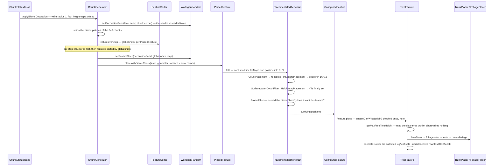

# Features and placement

> Verified against **Minecraft 26.2** · Part XII · A tree is generated: a global sort order every chunk in the world agrees on, a stream of positions filtered by modifiers, and an algorithm that reads the ground before it writes a log.

## Responsibility

Decoration is everything the terrain steps did not put there: trees,
flowers, ores, lakes, patches, springs. The system separates three things
that a modder usually wants separately — **what** to build (`Feature` plus
its configuration), **where** to try (`PlacementModifier`s), and **who
wants it** (the biome's list). A `PlacedFeature` is the unit a biome names,
and it is the only one of the three that knows about position.

The one sentence a player recognises: *the same seed grows the same
forest* — and it does so because the order features run in is decided
once, for the whole world, before a single chunk exists.

## The data it owns

- **`Feature`** — the algorithm. One abstract method, `Feature.place`,
  taking a `FeaturePlaceContext` and returning whether it wrote anything.
  Sixty-three instances are registered into `BuiltInRegistries.FEATURE` as
  constants on the class (`Feature.TREE`, `Feature.ORE`, `Feature.LAKE`,
  `Feature.GEODE`, `Feature.SIMPLE_BLOCK`…) — though being a `Feature`
  subclass does not imply being registered: `EndPodiumFeature` is
  constructed directly by the dragon fight and appears in no registry.
  The shared write helpers are `Feature.setBlock` and
  `Feature.safeSetBlock` — though `TreeFeature` overrides the first.
- **`FeatureConfiguration`** — the parameters, per feature type;
  `NoneFeatureConfiguration` for the ones that need none.
- **`ConfiguredFeature`** — a record of a feature and its configuration. No
  position logic at all. This is the unit a sapling grows.
- **`PlacedFeature`** — a record of a `ConfiguredFeature` holder and an
  ordered list of `PlacementModifier`s. `PlacedFeature.place` runs the
  chain; `PlacedFeature.placeWithBiomeCheck` does the same but records
  itself as the context's top feature, which is what makes `BiomeFilter`
  possible.
- **`PlacementModifier`** — one function from a position to a stream of
  positions, through `PlacementModifier.getPositions`. Two important
  shapes: `PlacementFilter` (one in, zero or one out —
  `RarityFilter`, `BiomeFilter`, `BlockPredicateFilter`,
  `SurfaceWaterDepthFilter`, `SurfaceRelativeThresholdFilter`) and
  `RepeatingPlacement` (one in, N *copies* out — `CountPlacement`,
  `NoiseBasedCountPlacement`, `NoiseThresholdCountPlacement`). The rest
  move a position: `InSquarePlacement` scatters within the chunk,
  `HeightmapPlacement` and `HeightRangePlacement` decide Y,
  `RandomOffsetPlacement` jitters, `EnvironmentScanPlacement` searches up
  or down for a surface, `FixedPlacement` names absolute positions.
  `PlacementContext` is what they read the world through, and
  `PlacementModifierType` is the registry that makes the set data-driven:
  fifteen constants, of which the fifteenth,
  `CountOnEveryLayerPlacement`, fits neither shape — it is deprecated,
  extends `PlacementModifier` directly, and does its own scatter and
  cave-layer scan inside `PlacementModifier.getPositions`.
- **`GenerationStep.Decoration`** — the eleven steps, in order (though a
  biome's list is not *capped* at eleven: the driver and the sorter both
  size themselves from the longest list they find, so a data pack can
  declare a twelfth that runs after top-layer modification):
  raw generation, lakes, local modifications, underground structures,
  surface structures, strongholds, underground ores, underground
  decoration, fluid springs, vegetal decoration (trees), top-layer
  modification. A biome's `BiomeGenerationSettings.features` is a list of
  lists indexed by this ordinal.
- **`FeatureSorter`** — the global ordering.
  `FeatureSorter.buildFeaturesPerStep` flattens every possible biome's
  per-step lists into one topologically sorted list per step, held as
  `FeatureSorter.StepFeatureData` with an index lookup.
  `ChunkGenerator.featuresPerStep` memoises it and
  `ChunkGenerator.validate` forces it at world load.
- **Trees** — `TreeFeature` with `TreeConfiguration`, nine fields
  assembled from five pluggable parts: a `TrunkPlacer` (which writes the
  logs and returns `FoliagePlacer.FoliageAttachment`s), a `FoliagePlacer`,
  an optional `RootPlacer`, a `FeatureSize` (the clearance profile the tree
  needs at each height) and a list of `TreeDecorator`s that run afterwards
  over the blocks that were placed. Blocks come from **three** separate
  `BlockStateProvider`s — trunk, foliage, and
  `TreeConfiguration.belowTrunkProvider`, the dirt column laid under the
  trunk. The other caller is `TreeGrower` — now a single
  final class with static constants, not a hierarchy — driven by
  `SaplingBlock.advanceTree`.
- **Supporting value types** — `BlockPredicate` (the
  `world/level/levelgen/blockpredicates` package), `HeightProvider`,
  `IntProvider` and `VerticalAnchor`. Only two of them take a
  `WorldGenerationContext`: `HeightProvider.sample` and
  `VerticalAnchor.resolveY`. An `IntProvider` needs only a random source,
  and a `BlockPredicate` is a predicate over a level and a position.

## When it runs

`ChunkStatus.FEATURES`, on the worldgen executor, and it is the **only**
step in the generation pyramid with a *positive* block write radius: one,
so a tree may cross into a neighbour
([the pipeline](../world/chunk-generation-pipeline.md)). The terrain steps
declare zero and everything else declares minus one, which forbids even the
centre chunk. `ChunkStatusTasks.generateFeatures` primes the four final
heightmaps first — though two of vanilla's `HeightmapPlacement` presets
read the *worldgen* heightmaps instead, which are not among those four —
and finishes with `Blender.generateBorderTicks`. `WorldGenRegion.getHeight`
returns the stored height **plus one**, so a heightmap placement lands on
top of the surface rather than in it.

The other entry is sapling growth, on the **server main thread**, from
`SaplingBlock.randomTick` or bone meal. That path skips the placement layer
entirely and calls `ConfiguredFeature.place` on the `ServerLevel`, whose
`WorldGenLevel.ensureCanWrite` is the interface default — always true.

## The trace: a tree

1. **The driver.** `ChunkGenerator.applyBiomeDecoration` starts at the
   chunk's minimum corner — `SectionPos.origin()`, at the world's minimum
   Y. There is **no eight-block population offset**; the scatter comes
   later, from `InSquarePlacement`.
2. **The seed.** A `WorldgenRandom` is built over a genuinely random seed
   and then immediately reseeded: `WorldgenRandom.setDecorationSeed` derives
   a per-chunk decoration seed from the world seed and the chunk corner, and
   each feature then gets `WorldgenRandom.setFeatureSeed` from that seed,
   its **global** index and the step. Same world seed, same trees.
3. **Who wants what.** The biome palettes of the surrounding 3×3 chunks are
   unioned and intersected with the biome source's possible biomes. Every
   `PlacedFeature` any of those biomes lists for this step is collected —
   by its global index — and the indices are **sorted**. That sort is the
   execution order, and it is the same for every chunk **in that
   dimension**: `ChunkGenerator.featuresPerStep` is memoised per generator
   and built from that generator's possible biomes, so the Nether's order
   has nothing to do with the Overworld's.
4. **Structures first.** Within each step, structures at that step are
   placed before its features ([structures](structures.md)).
5. **The modifier fold.** `PlacedFeature.placeWithBiomeCheck` starts a
   stream containing just the chunk corner and flat-maps it through each
   modifier in list order. For a plains oak: a count that yields zero or one
   attempt; `InSquarePlacement` throwing it somewhere in the 16×16
   footprint; a surface-water-depth filter; a heightmap placement that
   **finally sets Y**; a block predicate asking whether an oak sapling
   would survive there; and `BiomeFilter` last. Vanilla is not consistent
   about those last two — `VegetationPlacements.treePlacementBase` ends
   with the biome filter, and the survival-checked variant appends its
   predicate *after* it — so both orders ship.
6. **The biome check happens twice.** A feature was selected because *some*
   biome in the 3×3 wanted it; `BiomeFilter` re-reads the biome at the
   scattered position and asks whether *that* biome's generation settings
   actually contain this exact placed feature. Without it, every biome would
   bleed its trees a chunk in each direction.
7. **The feature.** `ConfiguredFeature.place` reaches `Feature.place`, which
   checks `WorldGenLevel.ensureCanWrite` for the origin — once — and builds
   the `FeaturePlaceContext`. For plains this is a random selector that
   picks between a fancy oak, a fallen oak and a plain oak with bees.
8. **The tree reads before it writes.** `TreeFeature` collects the blocks it
   places into four sets as it goes. First it negotiates a height: the trunk
   placer proposes one, and a clearance scan tests every column the
   `FeatureSize` profile demands. "Free" is generous — air, anything in the
   replaceable-by-trees tag, **or an existing log** — which is how a new
   tree grows through an old one. A blocked layer clips the height, and a
   clipped height below the profile's `FeatureSize.minClippedHeight`
   **abandons the tree with nothing written**; where the profile declares
   no minimum, *any* clipping at all abandons it.
9. **Trunk, then foliage, then decorators.** `TrunkPlacer.placeTrunk` writes
   the logs and returns the attachment points; `FoliagePlacer.createFoliage`
   writes leaf rows at each; each `TreeDecorator` then runs over the
   recorded log and leaf sets — that is how a beehive finds a good spot.
10. **Leaf distance is computed, not decayed.** `TreeFeature` runs a
    breadth-first pass out from the logs and writes the distance property on
    every leaf it reaches. Leaves beyond the range are left alone and decay
    on their first random tick.

## Interfaces

- **Called by:** `ChunkStatusTasks.generateFeatures` →
  `ChunkGenerator.applyBiomeDecoration`; `SaplingBlock.advanceTree` →
  `TreeGrower.growTree`; bone meal through
  `BiomeGenerationSettings.getBoneMealFeatures`; `FeaturePoolElement` inside
  a jigsaw structure.
- **Calls into:** `WorldGenRegion` for every read and write,
  `BlockStateProvider`, `BlockPredicate`, and `ChunkGenerator` height
  queries.
- **Crosses the network as:** nothing — features are server-side and
  produce ordinary blocks.
- **Data-driven by:** `Registries.CONFIGURED_FEATURE` and
  `Registries.PLACED_FEATURE` (data-pack registries, never synced), with the
  feature *types* and every placer/provider/modifier type in code
  registries. Vanilla's content is generated from the Java in
  `TreeFeatures`, `VegetationFeatures`, `TreePlacements`,
  `VegetationPlacements` and `PlacementUtils`.

## Invariants and surprises

- **A datapack can make the world refuse to load.** Feature order is
  global: every biome's list contributes "this before that" edges to one
  graph, and `FeatureSorter` topologically sorts it. Two biomes listing the
  same two features in opposite orders form a cycle, and the sort throws
  rather than returning an order. The sorter will even re-run itself,
  dropping one source at a time, to name the smallest offending set. Where
  you find out depends on the side: the **client** calls
  `ChunkGenerator.validate` from `WorldOpenFlows` while opening the world,
  catches the exception and offers safe mode, so the world refuses to open.
  A dedicated server never calls `ChunkGenerator.validate` at all — there
  the cycle surfaces later, as the crash report
  `ChunkGenerator.applyBiomeDecoration` wraps around the first chunk that
  tries to decorate.
- **`CountPlacement` does not scatter.** A repeating placement emits the
  *same* position N times; the scatter is a separate modifier downstream.
  List order is load-bearing: count-then-scatter gives ten trees in ten
  places, scatter-then-count gives ten trees in one.
- **Y is set late.** Positions travel through most of the chain at the
  world's minimum Y; a heightmap or height-range modifier is what puts them
  on the ground. A chain that forgets one places at the bottom of the world.
- **`BiomeFilter` throws inside a nested feature.** It needs the context's
  top feature, and only `PlacedFeature.placeWithBiomeCheck` sets that — so a
  biome filter in an inline or nested placed feature is an error, not a
  no-op. That is why the "checked" tree placements carry no biome filter and
  the biome-level ones do.
- **Writes outside the 3×3 window are dropped and logged.** `Feature.place`
  checks the origin, but each individual write is re-checked by
  `WorldGenRegion.ensureCanWrite`, which logs — and pauses, in a
  development environment — and does not write. A canopy that would reach
  two chunks out is **truncated**, not moved and not aborted.
- **Reads are guarded in a different place, and further out.** A read
  outside the write zone is only *warned* about by
  `WorldGenRegion.warnIfReadOutsideWriteZone`; it still happens. What makes
  cascading worldgen structurally impossible is
  `WorldGenRegion.getChunk`, which **throws** rather than loading once the
  request passes the step's declared dependency radius — for
  `ChunkStatus.FEATURES` that is nine chunks of chessboard distance, and
  what it may see there is a chunk at `ChunkStatus.STRUCTURE_STARTS`. So a
  feature can legally read much further than it can write, and beyond that
  it crashes rather than generating anything.
- **A chunk keeps receiving blocks after its own features step.** All eight
  neighbours write into it when they decorate. What makes that safe is the
  dependency graph: lighting requires the whole ring to have decorated
  first.
- **A tree can abandon itself, but cannot roll back.** The clearance scan
  runs before any block is placed; once the trunk starts there is no undo.
- **Sapling growth bypasses the placement layer entirely** and runs on the
  main thread with real block updates and no write guard. It also
  hand-manages the sapling — replacing it with the fluid's block so a
  waterlogged sapling grows into water, and restoring all four saplings of a
  2×2 mega tree if the feature fails.
- **Structures and features share the step loop but not the index space,**
  so a structure and a feature at the same index in the same step draw the
  same feature seed.
- **Structures are clipped to one chunk; features are not.** A structure
  piece gets an explicit writable box covering exactly the centre chunk;
  a feature gets only the softer 3×3 write-zone check.
- **Features in a step do *not* share a random stream.** Every one is
  reseeded absolutely before it runs — `WorldgenRandom.setFeatureSeed` is
  the decoration seed plus the global index plus ten thousand times the
  step — so an extra draw inside a feature perturbs the rest of *that*
  feature and nothing after it. `WorldgenRandom` does keep a draw counter,
  and in 26.2 nothing reads it.

## Where to look

`Feature.place` · `ConfiguredFeature` · `PlacedFeature.placeWithBiomeCheck` ·
`PlacementModifier.getPositions` · `PlacementFilter` · `RepeatingPlacement` ·
`InSquarePlacement` · `HeightmapPlacement` · `BiomeFilter` ·
`GenerationStep.Decoration` · `FeatureSorter.buildFeaturesPerStep` ·
`ChunkGenerator.applyBiomeDecoration` · `WorldgenRandom.setDecorationSeed` ·
`WorldgenRandom.setFeatureSeed` · `TreeFeature` · `TreeConfiguration` ·
`TrunkPlacer.placeTrunk` · `FoliagePlacer.createFoliage` · `TreeDecorator` ·
`TreeGrower.growTree` · `SaplingBlock.advanceTree`

---

*Rules: names, never code · how the system works, not how the code reads ·
newest version only · every backticked name passes `tools/verify_names.py`.*
