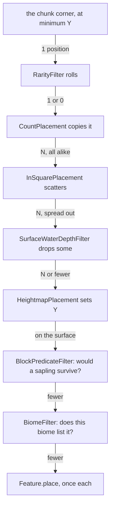
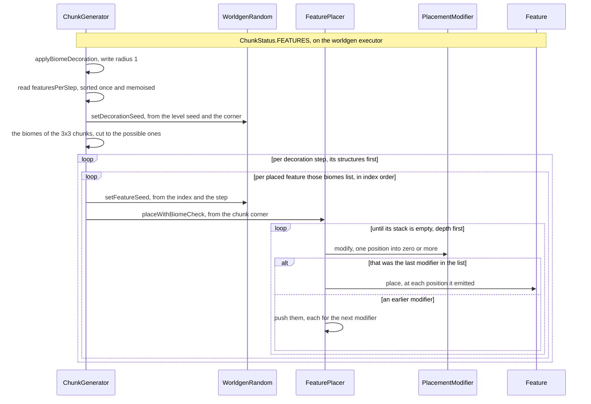

# Features and placement

> Verified against **Minecraft 26.3** · Part XII · A chunk decorates: a stream of positions folded through filters, an order every chunk in the dimension already agreed on, and a data pack that can stop the world from opening.

The oak in the middle of a plains chunk was not placed by the plains biome.
It was placed by a list that every biome in the dimension contributed to,
sorted once per dimension into one order per decoration step, with an index
per entry that the random seed for each feature is derived from. That is how the same seed grows the same forest, all but where two chunks' trees meet ([below](#what-a-feature-may-write-and-where-it-may-read)) — and it is also why **two biomes that list the
same two features in opposite orders make the world refuse to open.** The
order is a topological sort of a graph, and a graph can have a cycle.

Decoration is everything the terrain step did not put there: trees, flowers,
ores, lakes, patches, springs. The system separates three things a modder
usually wants separately — *what* to build, *where* to try, and *who* wants
it — and this page is how those three meet at `ChunkStatus.FEATURES`. The *what* and the *where* are registries of dispatched types ([the data-driven type pattern](../foundations/data-driven-types.md#the-idea-stated-once)), and the *who* is the biome. The
biggest single feature, the tree, has its own page
([trees](trees.md#one-algorithm-five-slots)); the terrain that decoration
lands on is [terrain](terrain.md#the-aquifer-what-the-number-becomes).

## The chain, before anything else

Everything below is one picture: a stream that starts as a single position and
is flat-mapped through an ordered list of modifiers until whatever survives it
gets built. A realistic chain for a tree runs like this.

```mermaid
flowchart TD
    A["the chunk corner, at minimum Y"] -->|"1 position"| B["RarityFilter rolls"]
    B -->|"1 or 0"| C["CountPlacement copies it"]
    C -->|"N, all alike"| D["InSquarePlacement scatters"]
    D -->|"N, spread out"| E["SurfaceWaterDepthFilter drops some"]
    E -->|"N or fewer"| F["HeightmapPlacement sets Y"]
    F -->|"on the surface"| G["BlockPredicateFilter: would a sapling survive?"]
    G -->|"fewer"| H["BiomeFilter: does this biome list it?"]
    H -->|"fewer"| I["Feature.place, once each"]
```

*One position becomes many and then fewer: only the count multiplies, Y is not set until the fifth modifier, and the shipped plains trees run this chain without its rarity roll.*

List order *is* the meaning — the same seven modifiers in another order place a
different forest, or none — and the rest of the page is who assembles that list,
who seeds it, and what each link in it is allowed to know.

## The cast

| class | its job | notes |
|---|---|---|
| `Feature` | the algorithm and its parameters in one object, with one working method: `Feature.place`, handed the level, the generator, a random source and an origin, and returning whether it succeeded | **58** types registered into `BuiltInRegistries.FEATURE_TYPE`; the instances are the data registry `Registries.FEATURE`, and an instance is the unit a sapling grows |
| `PlacedFeature` | a feature plus an ordered list of modifiers | the unit a biome names — the one of the two that owns placement modifiers |
| `PlacementModifier` | one function from a position to zero or more positions, handed to a consumer, over a `PlacementContext` | 18 registered types |
| `FeaturePlacer` | the fold: walks a placed feature's positions through its modifiers depth first, on one stack, and calls the feature at each position the last modifier emits | the driver builds one per chunk; only its biome-check entry records which placed feature a chain started from |
| `GenerationStep.Decoration` | the eleven steps, in order, from raw generation to top-layer modification | a biome's list is a list of lists, by ordinal |
| `FeatureSorter` | flattens every possible biome's per-step lists into one sorted list per step, with an index lookup | run once; `ChunkGenerator.featuresPerStep` is the memoised field that holds its answer |
| `WorldgenRandom` | the seed, reseeded absolutely twice: once per chunk, then once per feature | on the worldgen executor |

## One chunk's decoration, from the corner outward

```mermaid
sequenceDiagram
    participant ChunkG as ChunkGenerator
    participant WR as WorldgenRandom
    participant FeatP as FeaturePlacer
    participant PMod as PlacementModifier
    participant Feature as Feature

    Note over ChunkG,Feature: ChunkStatus.FEATURES, on the worldgen executor
    ChunkG->>ChunkG: applyBiomeDecoration, write radius 1
    ChunkG->>ChunkG: read featuresPerStep, sorted once and memoised
    ChunkG->>WR: setDecorationSeed, from the level seed and the corner
    ChunkG->>ChunkG: the biomes of the 3x3 chunks, cut to the possible ones
    loop per decoration step, its structures first
        loop per placed feature those biomes list, in index order
            ChunkG->>WR: setFeatureSeed, from the index and the step
            ChunkG->>FeatP: placeWithBiomeCheck, from the chunk corner
            loop until its stack is empty, depth first
                FeatP->>PMod: modify, one position into zero or more
                alt that was the last modifier in the list
                    FeatP->>Feature: place, at each position it emitted
                else an earlier modifier
                    FeatP->>FeatP: push them, each for the next modifier
                end
            end
        end
    end
```

*Two reseedings and a depth-first stack: every feature is reseeded from its own index before it runs, and each position the last modifier emits is one call into the feature's algorithm.*

**The driver.** `ChunkGenerator.applyBiomeDecoration` starts at the chunk's
minimum corner, at the world's minimum Y. There is no eight-block population
offset; the scatter comes later, from a modifier.

**The seed.** A `WorldgenRandom` is built over a genuinely random seed and
then reseeded absolutely, twice, before anything uses it.
`WorldgenRandom.setDecorationSeed` derives a per-chunk seed from the world
seed and the chunk corner, and each feature then gets
`WorldgenRandom.setFeatureSeed` from that seed, its index within the step and
the step number, which the seed multiplies by ten thousand to keep the steps
apart. Features in a step therefore do *not* share a random stream: every one
is reseeded absolutely before it runs, so an extra draw inside a feature
perturbs the rest of *that* feature and nothing after it.

**Who wants what.** The biome palettes of the surrounding 3×3 chunks are
unioned and intersected with the biome source's possible biomes
([biomes](biomes.md#the-cast)). Every placed feature any of those biomes lists for this step (the per-step lists on its `BiomeGenerationSettings`) is collected by its index in
that step's list, and the indices are **sorted** — that sort is the execution order, and
it is the same for every chunk *in that dimension*, because
`ChunkGenerator.featuresPerStep` is memoised per generator and built from
that generator's possible biomes. The Nether's order has nothing to do with
the Overworld's. Within each step, structures at that step are placed before
its features ([structure
placement](structure-placement.md#then-the-blocks-arrive-one-chunk-at-a-time)) —
and they share the step loop without sharing the index space, so a structure
and a feature sitting at the same index in the same step draw the **same**
feature seed. They differ in reach as well: a structure piece gets an explicit writable box covering the centre chunk, where a feature gets only the
softer write-zone check below.

## The order is a graph, and a graph can have a cycle

That sort is where a data pack can stop a world from opening, and it is the
only place in generation where one can. Every biome's per-step list contributes
*this before that* edges to one graph, whose nodes are features at their steps, and
`FeatureSorter.buildFeaturesPerStep` topologically sorts it. Two biomes listing
the same two features in opposite orders form a cycle, and the sort throws
rather than returning an order — it will even re-run itself, dropping one source
at a time, to name a minimal offending set.

Where you find out depends on which side you are on. The **client** calls
`ChunkGenerator.validate` from `WorldOpenFlows` while opening the world, catches
the exception and offers safe mode. A dedicated server never calls
`ChunkGenerator.validate` at all, so there the cycle surfaces later, as a crash
report wrapped around the first chunk that tries to decorate.

## The fold

`FeaturePlacer.placeWithBiomeCheck` starts that stream at the chunk corner, at
the world's minimum Y, and flat-maps it through each modifier in turn, depth
first on one stack. Nothing about it is a filter chain in the usual sense: a
modifier may emit nothing, one position, or many.

Four of the modifiers in that chain are pure filters — `RarityFilter` at the
head, which turns one position into one or none on a roll;
`SurfaceWaterDepthFilter`; `BlockPredicateFilter`, the survival check; and
`BiomeFilter` — and they are what a `PlacementFilter` is: a modifier that
emits the position it was given, or nothing. Three other things about the
chain are load-bearing, and none of them is obvious from a data pack.

**A repeating placement does not scatter.** `CountPlacement`,
`NoiseBasedCountPlacement` and `NoiseThresholdCountPlacement` are
`RepeatingPlacement`s: they emit the *same* position N times, and the scatter
is a separate modifier downstream. List order decides the outcome —
count-then-scatter gives ten attempts in ten places, scatter-then-count ten attempts at one spot.

**Y is set late.** Positions travel through most of the chain at the world's
minimum Y; a `HeightmapPlacement` or a `HeightRangePlacement` is what puts
them on the ground, and a chain that forgets one places at the bottom of the
world. `WorldGenRegion.getHeight` returns the stored height **plus one**, so
a heightmap placement lands on top of the surface rather than in it. Two of
vanilla's heightmap presets read the *worldgen* heightmaps, which are not
among the four `ChunkStatusTasks.buildTerrain` primes as the terrain step ends
([the six heightmaps](../world/chunk-anatomy.md#the-six-heightmaps)).

**The biome is checked twice.** A feature was selected because *some* biome
in the 3×3 wanted it; `BiomeFilter` re-reads the biome at the scattered
position and asks whether *that* biome's generation settings contain this
exact placed feature. Without it every biome would bleed its trees a chunk in
each direction. Vanilla is not consistent about where it goes: the base tree
placement ends with the biome filter and the survival-checked variant appends its block predicate *after* it, while the plains trees put the predicate first, so both orders ship.

What every one of them is handed is a `PlacementContext`, which carries the level, the generator and — the field the biome filter needs — the placed feature the chain started from, and reads the block state at a position and a heightmap through the level.

Eighteen modifier types are registered, and this page has named ten of them —
the seven in the chain and three more beside it. The shapes account for all eighteen. **Six** implement `PlacementFilter` —
the four in the chain, `SurfaceRelativeThresholdFilter`, which keeps a position only if its height falls within a range of a heightmap reading, and
`RandomChancePlacement`, which keeps it on a fractional chance. **Three** are
`RepeatingPlacement`s and **two** set Y. **Four** move or replace a position: `InSquarePlacement` scatters within the chunk, `OffsetPlacement` shifts it, `EnvironmentScanPlacement` steps up or down to a block a predicate accepts or drops it, and `FixedPlacement` swaps it for those of the absolute positions it names that lie in its chunk. The last three fit no shape at all:
`CuboidPlacement` fans a position out into a box, `RandomlySelectedPlacement`
runs one of its modifiers at random, and `CountOnEveryLayerPlacement`, deprecated,
does its own scatter and cave-layer scan inside `PlacementModifier.modify`.

## A feature that is a tree of features

Six of the fifty-eight registered features exist only to choose between other
*placed* features or to run them in turn, writing no blocks of their own, which
is how a data pack builds decoration out of decoration rather than out of
algorithms:
`RandomSelectorFeature` walks a weighted list rolling each entry's chance and
falls back to a default; `SimpleRandomSelectorFeature` picks a uniform index;
`WeightedRandomSelectorFeature` draws from a weighted list;
`RandomBooleanSelectorFeature` flips a coin between two;
`SequenceFeature` places every entry in order and **stops at the first
failure**, reporting failure itself; and `OverlayFeature` places every entry
whatever the others did, reporting success if any entry succeeded. The plains oak is one
of these — a random selector between a fancy oak, a fallen oak and a plain oak
with bees. (One more writes nothing and chooses nothing: `NoOpFeature` is a
deliberate blank, and it is what an empty slot in a data pack is spelled as.)

All six reach `FeaturePlacer.place`, directly or through `PlacedFeature.place`,
and never `FeaturePlacer.placeWithBiomeCheck` — which is exactly why a
`BiomeFilter` inside a nested placed feature is an *error* rather than a no-op. The filter
needs the context's top feature, and only the biome-check entry sets it. That
is why the "checked" tree placements carry no biome filter and the
biome-level ones do.

## What a feature may write, and where it may read

`ChunkStatus.FEATURES` is the only step in the generation pyramid with a
*positive* block write radius, and the radius is one — so a tree may cross
into a neighbour, and nothing else in generation may cross into anything
([two steps may write, and only
two](../world/chunk-generation-pipeline.md#two-steps-may-write-and-only-two)).

What that permission is worth is decided one write at a time. Nothing checks a
feature's origin before it runs; each individual write is checked by
`WorldGenRegion.ensureCanWrite`, which logs — and pauses, in a development
environment — and does not write. A canopy that would reach two chunks out is
therefore **truncated**, not moved and not abandoned: half a tree, each refused block one line in the log. Reading is looser and then suddenly much stricter. A read outside the write zone is logged at error level and still happens; a read past the step's
declared dependency radius — eight chunks at this step, and only of chunks at
`ChunkStatus.STRUCTURE_STARTS` — throws instead of loading, which is what makes
cascading worldgen structurally impossible rather than merely discouraged
([a read too far crashes, a read too wide is only logged](../world/chunk-generation-pipeline.md#a-read-too-far-crashes-a-read-too-wide-only-warns)).

A radius of one in both directions means a chunk can go on changing after it has decorated: any of its eight neighbours that decorates later may write into it, and nothing in the dependency graph says that is safe. The graph fixes what a step may assume of its neighbours — `ChunkStatus.FEATURES` asks them only to have reached `ChunkStatus.TERRAIN`, and no step may ask a neighbour for its own status — not which of two neighbours decorates first, which is whichever generation task reaches it first; so a tree near the border finds the other chunk's tree already standing, or not, by the order the two decorated in. Nor does the graph say who is inside the chunk at once. What makes it safe is that a dimension's decoration steps run one at a time on its one worldgen executor, so no two neighbours are ever inside the centre chunk at once
([dispatch, and why the parallelism is smaller than the thread
names](../world/chunk-generation-pipeline.md#dispatch-and-why-the-parallelism-is-smaller-than-the-thread-names)).

The supporting value types are worth naming because they sit on a ladder of
three rungs, and each rung is how much world its types are trusted with. On the
first, `IntProvider` and `FloatProvider` get a random source and nothing else.
On the second, `HeightProvider.sample` and `VerticalAnchor.resolveY` get a
`WorldGenerationContext`, which is three integers — the world's minimum Y, its
height and its sea level. Only the third sees the world, and two families share
it. A `BlockStateProvider` gets the level as well as a random source and a
position, and picks the block to write from them; `BlockPredicate` extends
`BiPredicate<LevelAccessor, BlockPos>`, which is why a placement can ask what block is under the sapling — and why `BlockPredicateFilter` is the chain's general test of what is already there. Every one of those types but `VerticalAnchor` is its own registry of dispatched types, and
every registry is mostly instances: sixteen block predicates, three of them the *any_of*, *all_of* and *not* combinators over the rest; six height providers, most of them distribution shapes over one range; ten state providers, which pick a block from a fixed state, a weight, a noise or a rule, or adjust the one another provider picks. The head of each family is explained once,
here; the members are a catalogue this book declines
([what this book skips](../anatomy/what-this-book-skips.md)).

## Questions players ask

**Does a sapling grow the same way a worldgen tree does?** No — it skips this whole page. Decoration is one door into a feature and is everything above; `/place feature` is another, and places a feature outright with no placement layer at all; and a sapling's growth is a third, beside the other growing blocks, the bonus chest and the End's own features: `SaplingBlock.advanceTree`, from a random tick or from bone meal, runs on the **Server thread** and call `Feature.place` on the `ServerLevel` directly, so there is no placement chain, no biome filter and no write guard (`WorldGenLevel.ensureCanWrite` is an interface default that is always true, and nothing on this path asks it).
It also hand-manages the sapling block, which is a story of its own
([trees](trees.md#one-algorithm-five-slots)).

**Where are the actual features?** Fifty-eight feature types are the longest tail in the part — icebergs, geodes, dripstone clusters, lakes, springs, coral,
huge fungi, the End spikes — and none of them is a mechanism this page has not
already explained: each is one `Feature.place` working from its own parameters. The book names the
framework and declines the catalogue
([what this book skips](../anatomy/what-this-book-skips.md)); the two that do
something structurally different are named where they bite, `OreFeature` on
[chunk anatomy](../world/chunk-anatomy.md#sections-and-their-four-counters)
for holding a section open across many writes, and `TreeFeature` on
[trees](trees.md#one-algorithm-five-slots).

> **For a 1.21-era reader.** *ConfiguredFeature*, *FeatureConfiguration* and
> *FeaturePlaceContext* are gone: a `Feature` carries its own parameters, and
> its instances are the data registry *worldgen/feature*.
> *PlacedFeature.placeWithBiomeCheck* is now `FeaturePlacer.placeWithBiomeCheck`,
> *PlacementModifier.getPositions* is now `PlacementModifier.modify`, and
> *RandomOffsetPlacement* is now `OffsetPlacement`.

## Where to look

`ChunkGenerator.applyBiomeDecoration` is the driver and holds the whole
scenario: the two reseedings, the 3x3 biome union and the sorted index loop.
Read `FeatureSorter.buildFeaturesPerStep` next, because it is the sort the
hook turns on, with `ChunkGenerator.validate` beside it, which the client calls while opening a world to meet the cycle early. Then the fold: `FeaturePlacer.placeWithBiomeCheck` and
`PlacementModifier.modify` are the whole of it, and
`PlacementFilter` and `RepeatingPlacement` are two of the shapes a modifier can take and `HeightmapPlacement` an example of a third — `BiomeFilter` last, since it is
the one that needs the context the entry point sets. `PlacementContext` is
what a modifier is trusted with and the arguments of `Feature.place` what a
feature is; reading the two side by side shows that both are handed the same level and generator, and that only the modifier is told which placed feature it serves. Finish at
`WorldGenRegion.ensureCanWrite`, which is where a tree gets truncated, and at
`RandomSelectorFeature` for a feature made of features. One door the page does
not open: `BlockStateProvider`, the family that picks what many features write, a tree's trunk and leaves among them.

---

*Rules: names, never code · how the system works, not how the code reads ·
newest version only · every backticked name passes `tools/verify_names.py`.*
