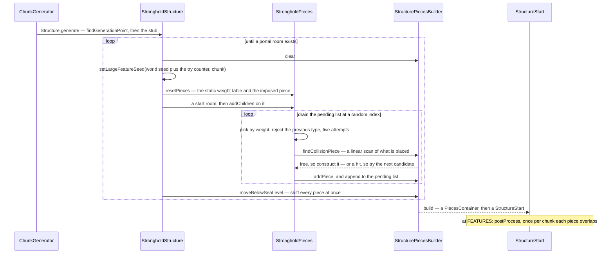

# Hand-built structures

> Verified against **Minecraft 26.2** · Part XII · A stronghold is generated: a piece grammar written in Java, a graph assembled at an imaginary height and moved down afterwards, and a whole structure thrown away and rebuilt because it had no portal room.

Every stronghold has exactly one end portal. Not usually, not almost always —
exactly one, in every stronghold in every world, and the mechanism is not a
counter or a guarantee. The portal room is weighted heavily, capped at one
placement, and forbidden near the entrance; and if the maze finishes without
one, `StrongholdStructure` **clears the whole builder, adds one to the seed
and generates the entire stronghold again.** It is the only structure in the
game that regenerates itself until it likes the result.

[Jigsaw and templates](jigsaw-and-templates.md) traces a village, and a
village is a jigsaw: pieces come from a data-pack registry and find each
other through connector blocks. That is one of the sixteen structure types.
**The other fifteen use an older assembler that is still the majority of the
code** — 30 classes and about 10,000 lines under
`levelgen/structure/structures`, against roughly 1,300 for the whole jigsaw
package. Strongholds, mineshafts, nether fortresses, ocean monuments,
woodland mansions, end cities, ruined portals, igloos, shipwrecks, ocean
ruins, desert pyramids, jungle temples, swamp huts, buried treasure and
nether fossils are all built this way.

Everything *around* the assembler is shared, and belongs to
[structure placement](structure-placement.md): the lottery, `Structure`,
`StructureStart`, `StructureCheck`, the reference scan, `Beardifier`, and the
per-chunk write. This page is only the part where the pieces come from.

## The idea

There is no pool and no registry of pieces. A piece is a **Java class that
knows how to write its own blocks**, and it grows the structure by
constructing its own neighbours.

| class | its role |
|---|---|
| `StructurePiece` | the base, and the reason the system holds together: a **mutable** `BoundingBox`, an orientation, a mirror, a rotation, a depth, and a piece type |
| `StructurePiece.placeBlock` | the single write choke point — converts to world coordinates, drops anything outside the chunk box it was handed, applies the piece's mirror and rotation *to the block state*, and schedules a fluid tick if it displaced one |
| `StructurePiece.BlockSelector` | a stateful per-block state chooser, and the entire visual character of a structure |
| `StructurePieceAccessor` | eleven lines, two methods, and `StructurePiece.findCollisionPiece` is a **linear scan returning the first overlapping box**. There is no spatial index |
| `StructurePiecesBuilder` | accumulates the pieces, and can move all of them vertically at once |
| `TemplateStructurePiece` | the bridge to the `.nbt` machinery, for structures that are procedural in *layout* and templated in *content* |
| `ScatteredFeaturePiece` | the base for one-shot surface buildings, with two ground-finders |
| `SinglePieceStructure` | the forty-line `Structure` that places exactly one of those |

Three things about that base class do most of the work.

**Orientation is not independent of mirror and rotation.**
`StructurePiece.setOrientation` derives both from the facing direction, and a
south-facing piece is expressed as a **left-right mirror** rather than a
180° rotation. That trick is why every piece in this package is written once,
in a north-facing local frame, and comes out correct four ways.

**Local Y is measured from the box floor.** `StructurePiece.getWorldX`,
`StructurePiece.getWorldY` and `StructurePiece.getWorldZ` map local
coordinates into the world, and because Y is relative to the floor, moving a
finished graph vertically is free. When the orientation is null the transform
is the identity, which is how `BuriedTreasurePieces` gets away with a
bounding box one block wide.

**`StructurePiece.addChildren` is not a framework hook.** Its default body is
empty and nothing in the framework ever calls it; every call site is a
structure's own generation code. The recursion is arranged by each family for
itself, in one of two shapes. Strongholds and nether fortresses use a
**shuffled work queue**: a new piece goes into the builder *and* onto the
start piece's pending list, and the structure drains that list by repeatedly
removing a **random** index and expanding it, so growth is breadth-ish and
unbiased. Mineshafts use **inline recursion** and expand each new piece
immediately, so the first branch of a crossing is fully grown before the
second is attempted.

The vocabulary a piece writes with is the rest of the base class:
`StructurePiece.generateBox` fills a local box while distinguishing edge
cells from interior ones, and `StructurePiece.generateAirBox`,
`StructurePiece.generateMaybeBox`,
`StructurePiece.generateUpperHalfSphere`,
`StructurePiece.fillColumnDown` and `StructurePiece.createChest` are the
rest. `StrongholdPieces.SmoothStoneSelector` is the canonical block selector:
on a box edge it rolls cracked, mossy or infested stone brick and otherwise
plain, and interior cells become cave air. One small object is the whole look
of a stronghold. `JungleTemplePiece.MossStoneSelector` is the other one.

## The trace: a stronghold

All of this runs at `ChunkStatus.STRUCTURE_STARTS`, inside the same
`Structure.GenerationStub` consumer the jigsaw assembler runs in — so the
whole graph is built in memory, on a worldgen worker, with no world access
and no blocks written.

**It is built at an imaginary height.** The start piece is constructed at a
fixed Y — sixty-four for strongholds and fortresses, fifty for mineshafts —
with no idea where the ground is. Every collision test, every staircase
descent and the floor guard that refuses a box below Y 10 happens in that
frame. Only afterwards does `StructurePiecesBuilder.moveBelowSeaLevel` shift
the whole graph so its top sits below sea level. Nether fortresses use
`StructurePiecesBuilder.moveInsideHeights` to land in a band, and a mesa
mineshaft uses `StructurePiecesBuilder.offsetPiecesVertically` to sit between
sea level and the surface. This is the payoff for local-Y-from-the-floor.

**Growth stops when the budget is spent, not when the depth runs out.**
`StrongholdPieces.STRONGHOLD_PIECE_WEIGHTS` pairs each piece class with a
weight *and* a maximum placement count: corridors and turns are unlimited, a
room crossing may appear six times, a library twice, a portal room once — and
the library and portal room additionally refuse to appear before a certain
depth. The picker makes up to five weighted attempts, rejecting whichever
type was placed immediately before, and falls back to a filler corridor. The
depth cap is fifty, far more than any real stronghold reaches; what actually
ends generation is the picker returning nothing once every limited type has
hit its limit.

**Collision is the other brake, and some pieces negotiate.** Each candidate
constructor computes its box and asks
`StructurePieceAccessor.findCollisionPiece`; a hit means the candidate simply
is not built. A mineshaft corridor tries decreasing lengths until one fits,
and a stronghold library falls back from its tall variant to its short one.

## The four families

| family | how the pieces come to exist | members |
|---|---|---|
| **procedural piece graphs** | the pieces write their own blocks and construct their own neighbours — the pattern in its pure form | `StrongholdPieces`, `MineshaftPieces`, `NetherFortressPieces` |
| **grid and graph solvers** | a layout is *solved* first and pieces are emitted afterwards, so neither ever calls `StructurePieceAccessor.findCollisionPiece` — the layout **is** the collision guarantee | `WoodlandMansionPieces`, `OceanMonumentPieces` |
| **template-backed pieces** | procedural placement, `.nbt` content, and therefore the same processors and the same `StructureTemplate.placeInWorld` the jigsaw path uses | `EndCityPieces`, `RuinedPortalPiece`, `OceanRuinPieces`, `ShipwreckPieces`, `IglooPieces`, `NetherFossilPieces`, `BuriedTreasurePieces` |
| **one-shot surface buildings** | no graph and no children: one box, dropped on the ground, over `ScatteredFeaturePiece` | `DesertPyramidPiece`, `JungleTemplePiece`, `SwampHutPiece` |

The nether fortress is the most elaborate of the first family: it runs *two*
weight tables and a mode switch, where a castle entrance is a one-way door
out of bridge mode into castle mode, and only a T-balcony can fall back, on a
one-in-eight roll per branch.

Almost nothing here is data-driven, and that is the point. Piece choice,
weights, budgets, layout rules and adjacency are all Java.
`Registries.STRUCTURE` still supplies the settings wrapper, and the templated
families read `.nbt` files, but **a data pack cannot add a room to a
stronghold.**

## Where the families bend the idea

**The mansion is grown and then tidied to a fixed point.** Corridors are
recursed out from the entrance on an 11×11 grid, rooms are stamped alongside
them, and then an edge-cleaning pass runs **repeatedly until nothing
changes**, filling any cell with enough occupied neighbours. That pass is why
a mansion is a solid block of building rather than the thin maze the corridor
walk actually produced. Rooms are then greedily merged into 2×2, 1×2 and 1×1
units, with type, id and flags packed into a single integer per cell — and a
room that ends up with no corridor edge becomes a **secret room**, reachable
only from above. A mansion may also have two floors instead of three: the
third needs a second-floor room with a door to hang its staircase on, and if
there is none, or no free direction to grow into, the third-floor grid is
blanked entirely.

**The ocean monument carves its maze backwards.** It wires a lattice of rooms
fully connected, then repeatedly closes a random opening and **keeps the
closure only if both sides can still reach the entrance room**, using a
depth-first reachability walk with an increasing scan counter in place of a
visited set. Rooms are then fitted by a list of room-shape fitters in fixed
order, first match wins, so the large double rooms get first refusal and the
plain room is the fallback.

**End city sections collide as groups, not as pieces.** Each candidate
section is generated into a scratch list and tagged with one shared random
`StructurePiece.genDepth` — used as a **group identity, not a depth**. The
section is accepted only if every collision it finds is with a piece carrying
the *parent's* tag; one foreign overlap discards the entire candidate list
atomically. Bridges opt out with a tag of minus one, and the ship becomes
likelier the longer the bridge gets, with at most one per city.

**Ruined portal decay is a processor stack, not code.** The rot, the
gold-block gaps, the lava-to-magma substitutions and the mossiness are
`StructureProcessor`s assembled per portal and stored in the saved piece, so
decay reproduces exactly on reload — and every one of those processors is
shared with the jigsaw path
([jigsaw and templates](jigsaw-and-templates.md)).

## Questions players ask

**Why does `/locate stronghold` point at the portal rather than the
entrance?** Because the portal room's entire `StructurePiece.addChildren`
body is a record of itself on the start piece — and that record is both the
regeneration loop's exit condition and what the command reports.

**Would two strongholds generating at once interfere?** In principle, yes,
and visibly so. `StrongholdPieces` keeps its remaining-piece list, its
running weight total and a one-shot "force this piece next" override in
**private static fields**, reset by `StrongholdPieces.resetPieces` from
inside a generation lambda that runs on chunk workers. The nether fortress's
placement counters live on static array elements merely reset at start-piece
construction, so its per-structure budget is an illusion. It is rare enough
not to bite, and it is the sharpest contrast with the stateless jigsaw path.

**Why do some structures come back different after a reload?** One does.
Ocean monument room pieces are held privately on the main building, never
reach the builder, are therefore never saved — and their save method is empty
anyway. `StructureStart.loadStaticStart` carries a hardcoded type check that
calls `OceanMonumentStructure.regeneratePiecesAfterLoad`, which reads position
and orientation from the save and rebuilds every room from the world seed.
Every other structure deserialises what it wrote.

**Is a saved bounding box where the structure is?** Not always. Buried
treasure rewrites its own box while placing; igloos are built at a hardcoded
Y 90 and re-seated at write time from the live heightmap, then put *back*;
shipwrecks latch a flag so the second chunk does not move them again. For
those types the persisted box is a placement hint, not a location. Two pieces
go further and deliberately **widen the chunk they were given** — a ruined
portal and a nether fossil both encapsulate the writable area so they are
placed whole from a single chunk rather than sliced across several. Since
`BoundingBox` is mutable and shared between the pieces of one start, that
widening leaks; harmlessly today, because both structures have exactly one
piece.

**Does a hand-built template know about jigsaw blocks?**
`TemplateStructurePiece.postProcess` scans what it placed for jigsaw blocks
and replaces each with its final state, so a stray jigsaw block in a mansion
`.nbt` resolves quietly instead of connecting to anything. `Beardifier`'s
projection test is the only place at runtime where the two assemblers are
told apart.

**Is any of this on its way out?** The whole-graph move is.
`StructurePiecesBuilder.moveBelowSeaLevel`,
`StructurePiecesBuilder.offsetPiecesVertically`,
`TemplateStructurePiece.move` and the mansion's siting helper are all marked
for removal, and the jigsaw path has nothing deprecated in it at all. Mojang
has flagged the idiom, not just the methods. Three separate *magic start Y*
constants in this package are also read by nothing — the literals are
retyped at their use sites, which is a trap for anyone changing one. And one
discarded random draw is load-bearing:
`MineshaftStructure.findGenerationPoint` opens by drawing a double and
throwing it away, a random-stream alignment relic that has to stay or every
mineshaft in every existing world moves.

## Where to look

`StructurePiece` · `StructurePiece.addChildren` ·
`StructurePiece.placeBlock` · `StructurePiece.generateBox` ·
`StructurePiece.BlockSelector` · `StructurePiece.setOrientation` ·
`StructurePiece.getWorldY` ·
`StructurePieceAccessor.findCollisionPiece` · `StructurePiecesBuilder` ·
`StructurePiecesBuilder.moveBelowSeaLevel` ·
`StructurePiecesBuilder.moveInsideHeights` · `StrongholdStructure` ·
`StrongholdPieces.STRONGHOLD_PIECE_WEIGHTS` ·
`StrongholdPieces.resetPieces` · `MineshaftPieces` ·
`NetherFortressPieces` · `WoodlandMansionPieces` ·
`OceanMonumentPieces` · `EndCityPieces` · `RuinedPortalPiece` ·
`TemplateStructurePiece` · `ScatteredFeaturePiece` ·
`SinglePieceStructure` · `OceanMonumentStructure.regeneratePiecesAfterLoad` ·
`StructureStart.loadStaticStart`

---

*Rules: names, never code · how the system works, not how the code reads ·
newest version only · every backticked name passes `tools/verify_names.py`.*
