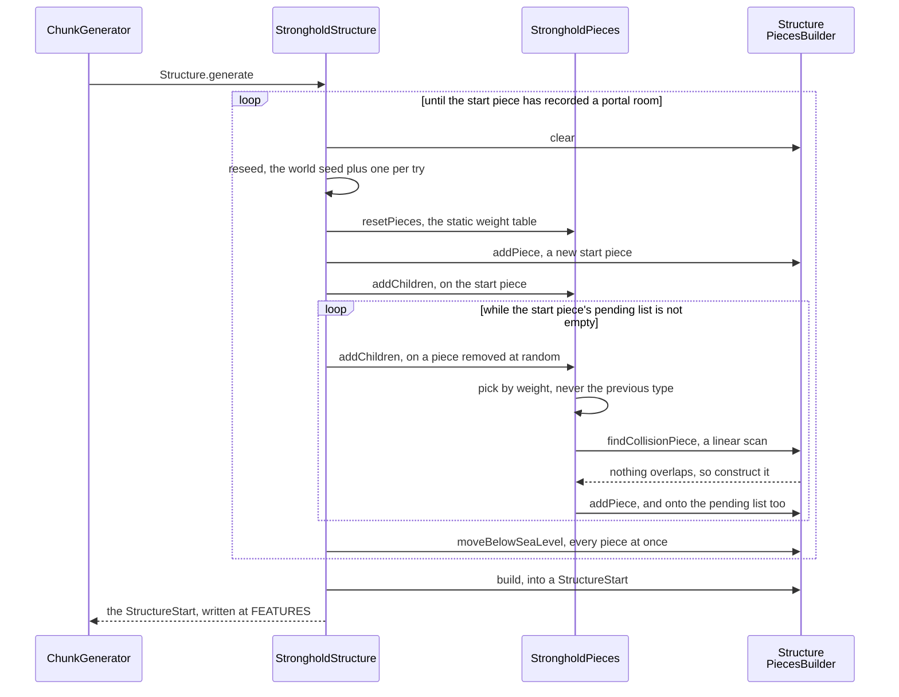

# Hand-built structures

> Verified against **Minecraft 26.3** · Part XII · A stronghold is generated: a piece grammar written in Java, a graph assembled at an imaginary height and moved down afterwards, and a whole structure thrown away and rebuilt because it had no portal room.

Every stronghold has exactly one end portal. Not usually, not almost always —
exactly one, in every stronghold in every world, and the grammar alone does not guarantee it. The portal room is weighted heavily, capped at one
placement, and forbidden near the entrance; and if the maze finishes without
one, `StrongholdStructure` **clears the whole builder, adds one to the seed
and generates the entire stronghold again.** It is the only structure in the
game that regenerates itself until it likes the result.

[Jigsaw and templates](jigsaw-and-templates.md#a-village-assembles-from-town-centre-to-blocks)
traces a village, and a village is a jigsaw: pieces come from a data-pack registry and find each
other through connector blocks. That is one of the sixteen structure types.
**The other fifteen use an older assembler that is still the majority of the
code** — thirty classes and about 10,000 lines under `levelgen/structure/structures`, against about 1,550 for the whole jigsaw package, aliases included. Strongholds, mineshafts, nether fortresses, ocean monuments,
woodland mansions, end cities, ruined portals, igloos, shipwrecks, ocean
ruins, desert pyramids, jungle temples, swamp huts, buried treasure and
nether fossils are all built this way.

Everything *around* the assembler is shared, and belongs to structure
placement: [the lottery](structure-placement.md#which-chunk-arithmetic-and-the-two-places-a-biome-still-gets-in),
[the presence cache](structure-placement.md#the-presence-cache-and-the-hole-that-proves-an-absence)
that `StructureCheck` is, [the reference
scan](structure-placement.md#which-chunks-have-to-be-told),
[`Beardifier`](structure-placement.md#the-ground-bends-before-the-ground-exists)
and [the per-chunk
write](structure-placement.md#then-the-blocks-arrive-one-chunk-at-a-time). This
page is only the part where the pieces come from.

## The idea

There is no pool and no registry of pieces. A piece is a **Java class that
knows how to write its own blocks**, and it grows the structure by
constructing its own neighbours.

| class | its role |
|---|---|
| `StructurePiece` | the base, and the reason the system holds together: a **mutable** `BoundingBox`, an orientation, a mirror, a rotation, a depth, and a registered `StructurePieceType` — which is how a piece comes back off disk, and the reason every one of these classes needs a loader beside it |
| `StructurePiece.placeBlock` | the conventional write path — converts to world coordinates, drops anything outside the chunk box it was handed, applies the piece's mirror and rotation *to the block state*, and schedules a tick for whatever fluid is at the position **after** the write. Not a choke point: the structure classes call `LevelWriter.setBlock` on the level directly two dozen times |
| `StructurePiece.BlockSelector` | a stateful per-block state chooser, and the entire visual character of a structure |
| `StructurePiecesBuilder` | accumulates the pieces, can move all of them vertically at once, and is what every piece's `StructurePiece.addChildren` is handed: its `StructurePiecesBuilder.findCollisionPiece` is `StructurePiece.findCollisionPiece`, a **linear scan returning the first overlapping box** — there is no spatial index, and the list being scanned is the list being built |
| `TemplateStructurePiece` | the bridge to [the `.nbt` machinery](jigsaw-and-templates.md#from-a-piece-to-blocks), for structures that are procedural in *layout* and templated in *content* |
| `ScatteredFeaturePiece` | the base for one-shot surface buildings, with two ground-finders |
| `SinglePieceStructure` | the forty-line `Structure` that places exactly one of those |

Three things about that base class do most of the work.

### Orientation is not independent of mirror and rotation

`StructurePiece.setOrientation` derives both from the facing direction, and a
south-facing piece is expressed as a **left-right mirror** rather than a
180° rotation. That trick is why nearly every hand-written piece in this package is written once, in a north-facing local frame, and comes out correct in all four horizontal
facings.

### Local Y is measured from the box floor

`StructurePiece.getWorldX`,
`StructurePiece.getWorldY` and `StructurePiece.getWorldZ` map local
coordinates into the world, and because Y is relative to the floor, moving a
finished graph vertically is free. When the orientation is null the transform is the identity, which is how a mineshaft's one room and its crossings write in world coordinates.

### `StructurePiece.addChildren` is not a framework hook

Its default body is empty and nothing in the framework ever calls it; every call site is a
structure's own generation code. The recursion is arranged by each family for
itself, in one of two shapes. Strongholds and nether fortresses use a
**shuffled work queue**: a new piece goes into the builder *and* onto the
start piece's pending list, and the structure drains that list by repeatedly
removing a **random** index and expanding it, so growth is breadth-ish and
unbiased. Mineshafts use **inline recursion** and expand each new piece
immediately, so the first branch of a crossing is fully grown before the
second is attempted.

### The vocabulary a piece writes with

The rest of the base class is what a piece says things in:
`StructurePiece.generateBox` fills a local box while distinguishing edge
cells from interior ones, and `StructurePiece.generateAirBox`,
`StructurePiece.generateMaybeBox`,
`StructurePiece.generateUpperHalfSphere`,
`StructurePiece.fillColumnDown` and `StructurePiece.createChest` — which
leaves a loot-table key and a seed rather than items
([loot tables](../items/loot-tables.md#the-chest-was-empty-before-you-got-there)) —
are the rest. `StrongholdPieces.SmoothStoneSelector` is the canonical block selector:
on a box edge it rolls cracked, mossy or infested stone brick and otherwise
plain, and interior cells become cave air. One small object is the whole look
of a stronghold. `JungleTemplePiece.MossStoneSelector` is the other one.

## A stronghold, built twice if it has to be

All of this runs at `ChunkStatus.STRUCTURE_STARTS`
([the pyramid, drawn](../world/chunk-generation-pipeline.md#the-pyramid-drawn)),
inside the same
[`Structure.GenerationStub`](structure-placement.md#the-layout-is-deferred-and-the-centre-is-not)
consumer the jigsaw assembler runs in — so the
whole graph is built in memory, on the worldgen executor, with no world access
and no blocks written. The stub's generator is an *either*, and one structure
takes the branch nothing else takes:
`MineshaftStructure.findGenerationPoint` hands it a builder it has
already filled instead of a consumer to run later, so a presence check that reaches a mineshaft candidate lays the whole graph out too, on the Server thread ([structure placement](structure-placement.md#the-layout-is-deferred-and-the-centre-is-not)).

```mermaid
sequenceDiagram
    participant ChunkG as ChunkGenerator
    participant SStr as StrongholdStructure
    participant SPie as StrongholdPieces
    participant SPB as Structure<br/>PiecesBuilder

    ChunkG->>SStr: Structure.generate
    loop until the start piece has recorded a portal room
        SStr->>SPB: clear
        SStr->>SStr: reseed, the world seed plus one per try
        SStr->>SPie: resetPieces, the static weight table
        SStr->>SPB: addPiece, a new start piece
        SStr->>SPie: addChildren, on the start piece
        loop while the start piece's pending list is not empty
            SStr->>SPie: addChildren, on a piece removed at random
            SPie->>SPie: pick by weight, never the previous type
            SPie->>SPB: findCollisionPiece, a linear scan
            SPB-->>SPie: nothing overlaps, so construct it
            SPie->>SPB: addPiece, and onto the pending list too
        end
        SStr->>SPB: moveBelowSeaLevel, every piece at once
    end
    SStr->>SPB: build, into a StructureStart
    SStr-->>ChunkG: the StructureStart, written at FEATURES
```

*The whole stronghold is grown in memory by one method on `StrongholdStructure`, and the outer loop is the one that throws it all away: it ends only when a try's start piece holds a portal room.*

The structure only ever asks a piece to grow; the piece does the picking, the
collision test and the adding, and each piece it adds joins the start piece's
pending list for a later pass.

**It is built at an imaginary height.** The start piece is constructed at a
fixed Y — sixty-four for strongholds and fortresses, fifty for mineshafts —
with no idea where the ground is. Every collision test, every staircase
descent and the floor guard that refuses a box at or below Y 10 happens in that
frame. Only afterwards does `StructurePiecesBuilder.moveBelowSeaLevel` shift
the whole graph so its top sits below sea level. Nether fortresses use
`StructurePiecesBuilder.moveInsideHeights` to land in a band, and a mesa
mineshaft uses `StructurePiecesBuilder.offsetPiecesVertically` to sit between
sea level and the surface. This is the payoff for local-Y-from-the-floor.

**The weight table is static, and so is the piece the loop is forced to place
next.** `StrongholdPieces.resetPieces` — the *reset* in the diagram — refills a remaining-piece list with the whole table, zeroes the placement counts in the static weight table and clears a one-shot "place this type next" override that only the start piece ever sets, and all three are reached through **static fields** on `StrongholdPieces`, reset from inside a generation
lambda on the worldgen executor. The nether fortress shares less: its lists live on its start piece, and only the placement counts in its static weight tables are shared, reset when a start piece is constructed. Two strongholds laid out at once would interfere; what keeps it from happening is the worldgen executor, which runs one task at a time per dimension, and only the overworld has strongholds in the shipped data, so only `/place structure` racing generation could. It is the sharpest contrast with the stateless jigsaw path.

**Growth stops when the budget is spent or no door can take a piece.**
`StrongholdPieces.STRONGHOLD_PIECE_WEIGHTS` pairs each piece class with a
weight *and* a maximum placement count: most corridors and turns are unlimited, a room crossing may appear six times, a library twice, a portal room once — and
the library and portal room additionally refuse to appear before a certain
depth. The picker makes up to five weighted attempts, rejecting whichever
type was placed immediately before, and falls back to a filler corridor. Two bounds sit beside the budget — a depth cap of fifty, and a square reaching 112 blocks from the start piece's corner on each axis, outside which no new piece may begin — and inside them the picker returns nothing once every limited type has hit its limit.

**Collision is a brake too, and some pieces negotiate.** Each candidate
constructor computes its box and asks
`StructurePiecesBuilder.findCollisionPiece`; a hit means the candidate simply
is not built. A mineshaft corridor tries decreasing lengths until one fits,
and a stronghold library falls back from its tall variant to its short one.

And the loop's exit condition is a piece of bookkeeping that looks like a
feature. The portal room's entire `StructurePiece.addChildren` body is a record
of itself on the start piece, which is how `StrongholdStructure` knows whether
to run again. That record is also reachable as
`StrongholdPieces.StartPiece.getLocatorPosition`, an override that returns the portal room's position where the base method returns the centre of the piece's box —
so a stronghold is the one structure in the game that knows where its own
landmark is, and **nothing in 26.3 calls the method**
([what `/locate` answers with](structure-placement.md#what-locate-asks-and-what-it-answers-with)).

The whole-graph move that ends the loop is also deprecated: `StructurePiecesBuilder.moveBelowSeaLevel`, `StructurePiecesBuilder.offsetPiecesVertically`, `TemplateStructurePiece.move` and the siting helper the mansion and the end city share are all marked so, and the jigsaw package declares nothing deprecated of its own. The start heights have names — `StrongholdPieces.MAGIC_START_Y` and `NetherFortressPieces.MAGIC_START_Y` at sixty-four, `MineshaftPieces.MAGIC_START_Y` at fifty — and one discarded random draw is load-bearing: `MineshaftStructure.findGenerationPoint` opens by drawing a double and throwing it away, and without that draw every mineshaft a seed generated from then on would be laid out differently.

## The four families

| family | how the pieces come to exist | members |
|---|---|---|
| **procedural piece graphs** | the pieces write their own blocks and construct their own neighbours — the pattern in its pure form | `StrongholdPieces`, `MineshaftPieces`, `NetherFortressPieces` |
| **grid and graph solvers** | a layout is *solved* first and pieces are emitted afterwards, so neither ever calls `StructurePiecesBuilder.findCollisionPiece` — the layout **is** the collision guarantee | `WoodlandMansionPieces`, `OceanMonumentPieces` |
| **template-backed pieces** | procedural placement, `.nbt` content, and therefore the same processors and the same `StructureTemplate.placeInWorld` the jigsaw path uses | `EndCityPieces`, `RuinedPortalPiece`, `OceanRuinPieces`, `ShipwreckPieces`, `IglooPieces`, `NetherFossilPieces`, `WoodlandMansionPieces` |
| **one-shot surface buildings** | no graph and no children: one box, dropped on the ground, over `ScatteredFeaturePiece`, or — for buried treasure — a ground scan of its own | `DesertPyramidPiece`, `JungleTemplePiece`, `SwampHutPiece`, `BuriedTreasurePieces` |

The nether fortress is the most elaborate of the first family: it runs *two*
weight tables and a mode switch, where a castle entrance is a one-way door
out of bridge mode into castle mode, and only a T-balcony can fall back, on a
one-in-eight roll per branch. `WoodlandMansionPieces` is in the table twice
because it genuinely is: its layout is solved and its rooms are then stamped
from `.nbt` files.

Beside each of those piece families sits a `Structure` subclass — `RuinedPortalStructure`, `DesertPyramidStructure`, `OceanRuinStructure`, `ShipwreckStructure`, `WoodlandMansionStructure`, `NetherFossilStructure` and the rest — which is the settings wrapper and the entry point. For the jungle temple that is all, a `SinglePieceStructure` of forty lines, and the swamp hut's, the igloo's, buried treasure's and the ocean ruins' are nearly as thin; the other ten add something of their own — a siting rule, a scan for ground, a generation loop, a rebuild at load, or work after the blocks are down. Two are worth stopping on. `RuinedPortalStructure` draws the decay setup, below. And `DesertPyramidStructure`, a `SinglePieceStructure` too, has one of the two live `Structure.afterPlace` overrides (the other, `WoodlandMansionStructure`'s, fills the space under the mansion with cobblestone down to the ground): once the pyramid's blocks are down it collects every candidate
position its pieces recorded, shuffles them from a positional random source,
turns five to seven into suspicious sand and the rest into plain sand — which
is why a pyramid's archaeology is the same in two worlds with one seed and
never the same twice within one.

### What a Java piece keeps that a template cannot

Three of the families hold state the framework has no place for, and each case
is a consequence of a piece being an object rather than a file. **The ocean
monument's rooms are never saved**: they are held privately on the main
building, never reach the builder, and their save method is empty anyway —
`StructureStart.loadStaticStart` carries a hardcoded type check that calls
`OceanMonumentStructure.regeneratePiecesAfterLoad`, which reads position and
orientation from the save and rebuilds every room from the world seed, so the monument comes back identical rather than merely present. Every other structure's pieces are read back from what they wrote, a template piece's box recomputed from its template on the way. **A saved bounding box is not always where the
structure is**: buried treasure rewrites its own box while placing, igloos are built at a hardcoded Y 90 and re-seated at write time from the live heightmap, with only their template position put *back*, so a reloaded igloo's box is recomputed at Y 90, and shipwrecks latch a flag so the second chunk does not
move them again — for those types the box is a placement hint. Two
pieces go further and deliberately **widen the chunk they were given**, a ruined portal and a nether fossil both encapsulating the writable area so they are placed whole rather than sliced — the portal from the chunk holding its centre, the fossil from every chunk it touches; since
`BoundingBox` is mutable and shared between the pieces of one start, that
widening leaks, harmlessly today because both structures have exactly one piece.
And **a template-backed piece still cleans up after a connector it never
used**: `TemplateStructurePiece.postProcess` scans what it placed for jigsaw
blocks and replaces each with its final state, so the jigsaw block inside each of five ruined-portal templates resolves quietly instead of connecting to anything.
`Beardifier`'s projection test is the only place at runtime where the two
assemblers are told apart.

Almost nothing here is data-driven, and that is the point. Piece choice, weights, budgets, layout rules and adjacency are Java, bar a few knobs a structure's JSON sets: the ruined portal's weighted setups, the ocean ruin's odds of a large ruin and of a cluster, and the shipwreck's beached flag, which picks its template list.
`Registries.STRUCTURE` still supplies the settings wrapper
([structure placement](structure-placement.md#the-cast)) and the templated
families read `.nbt` files, but **a data pack cannot add a room to a
stronghold** — which makes this the book's clearest counter-example to the
data-driven type pattern: a registry whose instances are Java grammars
([the pattern](../foundations/data-driven-types.md#the-idea-stated-once)).

## Where the families bend the idea

**The mansion is grown and then tidied to a fixed point.** Corridors are
recursed out from the entrance on an 11×11 grid, rooms are stamped alongside
them, and then an edge-cleaning pass runs **repeatedly until nothing
changes**, filling any cell with enough occupied neighbours. That pass is why
a mansion is a solid block of building rather than the thin maze the corridor walk produced. Rooms are then greedily merged into 2×2, 1×2 and 1×1
units, with type, id and flags packed into a single integer per cell — and a
room that ends up with no corridor edge becomes a **secret room**, reachable
only from above. A mansion may also have two floors instead of three: the third needs a second-floor one-by-two room with a door to hang its staircase on, and if
there is none, or no free direction to grow into, the third-floor grid is
blanked entirely.

**The ocean monument carves its maze backwards.** It wires a lattice of rooms
fully connected, then repeatedly closes a random opening and **keeps the
closure only if both sides can still reach the entrance room**, using a
depth-first reachability walk with an increasing scan counter in place of a
visited set. Rooms are then fitted by a list of room-shape fitters in fixed
order, first match wins, so the large double rooms get first refusal and the
plain room is the fallback.

**End city sections collide as groups, not as pieces.** Each candidate
section is generated into a scratch list and tagged with one shared random
`StructurePiece.genDepth` — used as a **group identity, not a depth**. The
section is accepted only if every collision it finds is with a piece carrying
the *parent's* tag; one foreign overlap discards the entire candidate list
atomically. A bridge tags its first span minus one, a tag no parent carries, so the tower hung off its far end may not overlap it, and the section's shared tag replaces the mark before the bridge itself is checked; the ship becomes likelier the deeper a section sits in the city's recursion, with at most one per city.

**Ruined portal decay is mostly a processor stack.** The ageing, the gold-block gaps, the lava-to-magma substitutions and the mossiness are `StructureProcessor`s assembled per portal and rebuilt at load from the settings the piece saves, so decay reproduces exactly on reload; the netherrack spread, the netherrack columns under the portal, the vines and the leaves are the piece's own code. What makes it unusual is that the stack is
built in Java and appears in no data pack at all
([the processors](jigsaw-and-templates.md#the-processors-and-what-the-shipped-lists-use)):
`BlockAgeProcessor` — which is the ageing and the mossiness at once —
`LavaSubmergedBlockProcessor` and `BlackstoneReplaceProcessor` are
`RuinedPortalPiece`'s alone. Which placement a portal gets — on the surface, partly buried, underground, in a mountain, on the ocean floor or in the nether — is settled from the setups its JSON lists before any piece exists: a weighted draw for the standard and mountain portals, which list two, and the one setup for the other five.

## Where to look

`StructurePiece` is the whole framework and repays reading straight through:
the mutable `BoundingBox`, `StructurePiece.setOrientation` for the mirror
trick, `StructurePiece.getWorldY` for the floor-relative frame, and
`StructurePiece.generateBox` and `StructurePiece.BlockSelector` for the
vocabulary a piece writes with. `StructurePiece.addChildren` is the method to
read for what it *does not* do. Then `StrongholdStructure` beside
`StrongholdPieces` — the regeneration loop, `StrongholdPieces.resetPieces` and
`StrongholdPieces.STRONGHOLD_PIECE_WEIGHTS` in one sitting — and
`StructurePiecesBuilder` for the builder `StructurePiece.addChildren` is handed and
`StructurePiecesBuilder.moveBelowSeaLevel` for the move. After that pick one
family per shape: `MineshaftPieces` for inline recursion,
`WoodlandMansionPieces` or `OceanMonumentPieces` for a solver,
`RuinedPortalPiece` for the template-backed kind, and `ScatteredFeaturePiece`
with `SinglePieceStructure` for the one-shot buildings. One door the page does
not open: `OceanMonumentStructure.regeneratePiecesAfterLoad`, the only
structure whose pieces are rebuilt from the seed at load rather than read back.

---

*Rules: names, never code · how the system works, not how the code reads ·
newest version only · every backticked name passes `tools/verify_names.py`.*
