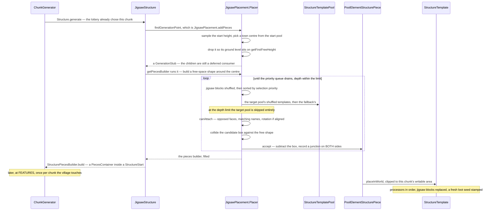

# Jigsaw and templates

> Verified against **Minecraft 26.2** · Part XII · A village assembles itself: pieces that find each other through connector blocks, a priority queue instead of a stack, and a growth limit that works by taking the right pool away.

A village stops somewhere. Follow a street out from the town centre and the
houses run out and the path ends in a stub of dirt path with nothing on it.
Nothing measured the distance and nothing counted the buildings. That stub is
a *terminator*, and it comes from the street pool's **fallback** pool — which
`JigsawPlacement.Placer` appends to the candidate list at **every** depth,
behind the pool the piece actually asked for. A street ends wherever the
street pieces stop fitting. What the depth limit does is stop offering the
asked-for pool at all, so at the limit the fallback is the only thing left.
The edge of a village is a substitution, not a stop condition.

This is the assembler one of the sixteen structure types uses — the jigsaw —
together with the `.nbt` template system that turns each of its pieces into
blocks. Everything *outside* the assembler is
[structure placement](structure-placement.md): the lottery that chose this
chunk, `StructureStart`, the reference scan, the beardifier, and the moment
`StructurePiece.postProcess` is called. The other fifteen types use a
different assembler and reach this page only for the templates
([hand-built structures](hand-built-structures.md)).

## The cast

| class | what it holds | when |
|---|---|---|
| `JigsawStructure` | the start pool, the start jigsaw name, a depth, a start height, a maximum distance and the pool aliases | data pack |
| `StructureTemplatePool` | a weighted list of `StructurePoolElement`s and a **fallback** pool — the two fields its codec has | data pack |
| `StructurePoolElement` | one candidate: a single template, a legacy single, a list, a placed *feature*, or nothing | data pack |
| `JigsawPlacement.Placer` | the assembly loop and its priority queue; the `VoxelShape` of free space travels with each queue entry | `ChunkStatus.STRUCTURE_STARTS`, worldgen worker |
| `JigsawBlock` | the connector, with `JigsawBlockEntity.JointType` deciding whether rotation must match | in the template |
| `PoolElementStructurePiece` | one accepted candidate, with its junctions | in memory until `ChunkStatus.FEATURES` |
| `StructureTemplate` | a parsed `.nbt` file: block palettes, entities, and the jigsaw blocks in it | loaded by `StructureTemplateManager` |
| `StructurePlaceSettings` | rotation, mirror, the chunk box, liquid handling and an **ordered** list of `StructureProcessor`s | per piece, per chunk |

## The trace: a village, from town centre to blocks

## The pools

A `StructureTemplatePool` is the unit of choice, and its codec has exactly two
fields — all 188 shipped pool files carry those two and nothing else. The
weighted *elements* list is the candidates. The **fallback** pool is a second
pool appended behind them, tried whenever nothing in the first list fits and
the only thing tried at the depth limit. The third thing you might expect on
the pool is not there: `StructureTemplatePool.Projection` is a field of each
*element*, so one pool can mix them. It decides how Y is chosen: *rigid* keeps
the parent piece's vertical offset, and *terrain matching* asks the generator
for the ground height and brings a gravity processor with it.

Five kinds of element can sit in that list. `SinglePoolElement` is one
template. `LegacySinglePoolElement` is the same with an older block-shape
rule. `ListPoolElement` is several placed as a unit. `EmptyPoolElement` is a
deliberate nothing. And `FeaturePoolElement` places a `PlacedFeature`
instead of a template — which is how village trees arrive
([features and placement](features-and-placement.md)).

`PoolAliasBinding` and `PoolAliasLookup` sit on top: one structure can swap
which pool a name resolves to, per placement, resolved once from a positional
random source. Trial chambers are the only vanilla structure that uses it, and
what they swap is which pool the spawners draw their mobs from.

## The assembly loop

`JigsawPlacement.addPieces` builds a `VoxelShape` of free space around the
start piece and hands it to `JigsawPlacement.Placer`. From then on the
algorithm is: take a placed piece, look at its jigsaw blocks, and for each one
try to hang something off it.

Four details in that loop are the ones worth watching.

**It is a priority queue, not a stack.** Children are expanded in order of
the jigsaw block's placement priority, with insertion order breaking ties —
not depth-first — so a pool can insist its connections are made before its
siblings'. `JigsawPlacement.Placer.placing` is that queue.

**Attachment is a name match plus a geometry match.** `JigsawBlock.canAttach`
requires the two jigsaw blocks to face each other and their target names to
agree; an *aligned* joint additionally requires the rotations to match, while
a rollable one does not.

**Collision is against a shrinking shape, not against a list.** Every
accepted piece subtracts its own box from the free-space shape, so the next
candidate is tested against what is genuinely left. A candidate that
intersects is simply not built, and the next one on the shuffled list is
tried.

**A junction is recorded on both sides.** Each connection writes a
`JigsawJunction` into the parent piece *and* the child, which is what lets
`Beardifier` treat junctions as their own terrain contribution rather than
inferring them from the boxes
([structure placement](structure-placement.md)).

## From a piece to blocks

Nothing above has written a block. When `ChunkStatus.FEATURES` finally calls
`StructurePiece.postProcess` on a `PoolElementStructurePiece`, the element
assembles a `StructurePlaceSettings` — the chunk box, the rotation, the
ignore processor, then `JigsawReplacementProcessor`, then the element's own
processor list, then the projection's. `LegacySinglePoolElement`, which is
what every vanilla village piece is, then pops its ignore processor and
re-appends a wider one at the **end** of that list, so for the pieces a player
actually sees the ignore step runs last and drops the template's air as well
as its structure blocks. `StructureTemplate.placeInWorld`
runs every block in the template through
`StructureTemplate.processBlockInfos`.

A `StructureTemplate` is a parsed `.nbt` file: `StructureTemplate.Palette`s
of `StructureTemplate.StructureBlockInfo`, an entity list, and
`StructureTemplate.JigsawBlockInfo` for the connectors. Placing it writes
what falls inside the box, loads block-entity data
([block entities](../blocks/block-entities.md)) and stamps a **fresh loot
seed** into containers rather than a table's contents
([loot tables](../items/loot-tables.md)) — which is why a village chest's
contents are decided when you open it, not when the village generated.

The processors are the interesting layer, because they are shared with the
other assembler and with the structure blocks a player can use. `RuleProcessor`
applies `ProcessorRule`s, and each rule holds **two** block tests with
different subjects: an *input predicate* against the template's own block and
a *location predicate* against the block already in the world. A position test,
a replacement state and an optional block-entity modifier follow, and the
first rule that matches wins.
`BlockRotProcessor` deletes a fraction of the blocks. `GravityProcessor`
drops them to a heightmap. `BlockIgnoreProcessor` skips a named list of
blocks, and its three presets name the structure block, air, or both — never
structure void, which `JigsawReplacementProcessor` handles instead. And `JigsawReplacementProcessor` is the one that cleans up after the
assembler: it swaps each jigsaw block for the state named in its final-state
string, or removes it entirely. **The assembly graph is invisible in the
finished village** unless the debug flag in `SharedConstants` is set.

`StructureTemplateManager` loads templates in a fixed order — the world's
generated directory, then the gametest source, then data packs — and the
folder it looks in is *structure*, singular.

> **For a 1.21-era reader.** The `.nbt` folder is
> *data/&lt;namespace&gt;/structure/*, not *structures/*. The plural
> directory is the one you remember and it is not read.

## Questions players ask

**Why is one village bigger than another?** Because the growth limit is
probabilistic in effect even though the depth cap is fixed. A village's
declared *size* is six, well under the twenty `JigsawStructure.MAX_DEPTH`
allows, and what usually ends a branch is not the cap at all: it is every
candidate in the street pool failing the collision test, which hands the
branch to the fallback's terminators. A street that happens to run downhill
into free space grows further than one that turns back on itself. Villages
also set *use_expansion_hack*, which inflates a candidate's box upward before
the test, so a piece that would fit can be rejected for the children it would
need room for.

**Can I watch the assembler run?** Yes, two ways. The jigsaw *editor* runs
in both directions: `ServerboundSetJigsawBlockPacket` and
`ServerboundJigsawGeneratePacket` let a creative player run the assembler live
against a loaded `ServerLevel`, and `JigsawBlockEntity` syncs its pool, target
and joint back the other way. `/place jigsaw` does the same from a command,
with a pool, a target and a depth. Both are exceptions to "structures cross
the network as ordinary blocks", and there is a third that only a developer
sees: `DebugSubscriptions.STRUCTURES` ships every piece's bounding box to the
client for the debug renderer.

**Why do the same houses appear in different rotations?** Because rotation is
chosen per piece and applied to the block *states* as they are written, not
to a pre-rotated template. Whether a neighbour may differ in rotation is the
joint type's decision.

**Does the layout depend on the terrain?** Yes, wherever a piece is
terrain-matching — which is every village street. Whenever the source or the
target is not rigid, `JigsawPlacement.Placer` asks
`ChunkGenerator.getFirstFreeHeight` for the ground under the source's jigsaw
block and puts the candidate's box there; that box is exactly what the
collision test then tests, so the ground decides what fits. What the assembly
never does is *read a chunk*: `ChunkGenerator.getFirstFreeHeight` samples the
density graph, which is why the whole thing can run at
`ChunkStatus.STRUCTURE_STARTS`, before any terrain has been written.

**What is a village made of, if not blocks?** Until
`ChunkStatus.FEATURES`, a `PiecesContainer` of `PoolElementStructurePiece`s
inside a `StructureStart`, saved to the chunk as NBT and reloaded on demand.
The village is data for its entire generated life and becomes blocks last.

## Where to look

`JigsawStructure` · `JigsawStructure.MAX_DEPTH` ·
`JigsawPlacement.addPieces` · `JigsawPlacement.Placer` ·
`StructureTemplatePool` · `StructureTemplatePool.Projection` ·
`StructurePoolElement` · `SinglePoolElement` · `FeaturePoolElement` ·
`JigsawBlock.canAttach` · `JigsawBlockEntity.JointType` ·
`JigsawJunction` · `PoolAliasBinding` ·
`PoolElementStructurePiece.place` · `StructurePiecesBuilder` ·
`StructureTemplate.placeInWorld` · `StructureTemplate.processBlockInfos` ·
`StructureTemplate.Palette` · `StructureTemplateManager` ·
`StructurePlaceSettings` · `StructureProcessorList` · `RuleProcessor` ·
`ProcessorRule` · `GravityProcessor` · `JigsawReplacementProcessor`

---

*Rules: names, never code · how the system works, not how the code reads ·
newest version only · every backticked name passes `tools/verify_names.py`.*
