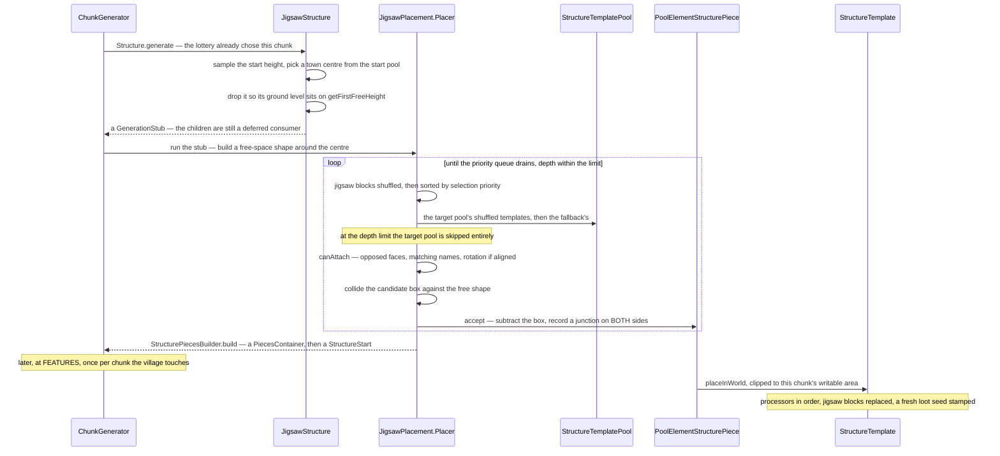

# Jigsaw and templates

> Verified against **Minecraft 26.2** · Part XII · A village assembles itself: pieces that find each other through connector blocks, a priority queue instead of a stack, and a growth limit that works by offering the wrong pool.

A village stops somewhere. Follow a street out from the town centre and after
five or six turns the houses run out and the path ends in a lamp post or in
nothing. Nothing measured the distance and nothing counted the buildings.
What happened is that the assembler reached its depth limit and, at that
depth, **stopped offering the pool the piece asked for and offered the
fallback pool instead** — and the fallback pool for a village street contains
terminators. The edge of a village is a substitution, not a stop condition.

This is the assembler one of the sixteen structure types uses — the jigsaw —
together with the `.nbt` template system that turns each of its pieces into
blocks. Everything *outside* the assembler is
[structure placement](structure-placement.md): the lottery that chose this
chunk, `StructureStart`, the reference scan, the beardifier, and the moment
`StructurePiece.postProcess` is called. The other fifteen types use a
different assembler and reach this page only for the templates
([hand-built structures](hand-built-structures.md)).

## The cast

| class | what it holds | when |
|---|---|---|
| `JigsawStructure` | the start pool, the start jigsaw name, a depth, a start height, a maximum distance and the pool aliases | data pack |
| `StructureTemplatePool` | a weighted list of `StructurePoolElement`s, a **fallback** pool, and a `StructureTemplatePool.Projection` | data pack |
| `StructurePoolElement` | one candidate: a single template, a legacy single, a list, a placed *feature*, or nothing | data pack |
| `JigsawPlacement.Placer` | the assembly loop, and the `VoxelShape` of remaining free space | `ChunkStatus.STRUCTURE_STARTS`, worldgen worker |
| `JigsawBlock` | the connector, with `JigsawBlockEntity.JointType` deciding whether rotation must match | in the template |
| `PoolElementStructurePiece` | one accepted candidate, with its junctions | in memory until `ChunkStatus.FEATURES` |
| `StructureTemplate` | a parsed `.nbt` file: block palettes, entities, and the jigsaw blocks in it | loaded by `StructureTemplateManager` |
| `StructurePlaceSettings` | rotation, mirror, the chunk box, liquid handling and an **ordered** list of `StructureProcessor`s | per piece, per chunk |

## The trace: a village, from town centre to blocks

## The pools

A `StructureTemplatePool` is the unit of choice, and it has three parts that
each do something different. The weighted list is the candidates. The
**fallback** pool is what gets offered when the target pool is not on the
table — at the depth limit, and only then. And the
`StructureTemplatePool.Projection` decides how Y is chosen: *rigid* keeps the
parent piece's vertical offset, and *terrain matching* drops the piece onto
the surface and brings a gravity processor with it.

Five kinds of element can sit in that list. `SinglePoolElement` is one
template. `LegacySinglePoolElement` is the same with an older block-shape
rule. `ListPoolElement` is several placed as a unit. `EmptyPoolElement` is a
deliberate nothing. And `FeaturePoolElement` places a `PlacedFeature`
instead of a template — which is how village trees arrive
([features and placement](features-and-placement.md)).

`PoolAliasBinding` and `PoolAliasLookup` sit on top: one structure can swap
which pool a name resolves to, per placement, which is how one trial-chamber
definition produces differently-furnished chambers.

## The assembly loop

`JigsawPlacement.addPieces` builds a `VoxelShape` of free space around the
start piece and hands it to `JigsawPlacement.Placer`. From then on the
algorithm is: take a placed piece, look at its jigsaw blocks, and for each one
try to hang something off it.

Four details in that loop are the ones worth watching.

**It is a priority queue, not a stack.** Children are expanded in order of
the jigsaw block's placement priority, with insertion order breaking ties —
not depth-first — so a pool can insist its connections are made before its
siblings'. `JigsawPlacement.Placer.placing` is that queue.

**Attachment is a name match plus a geometry match.** `JigsawBlock.canAttach`
requires the two jigsaw blocks to face each other and their target names to
agree; an *aligned* joint additionally requires the rotations to match, while
a rollable one does not.

**Collision is against a shrinking shape, not against a list.** Every
accepted piece subtracts its own box from the free-space shape, so the next
candidate is tested against what is genuinely left. A candidate that
intersects is simply not built, and the next one on the shuffled list is
tried.

**A junction is recorded on both sides.** Each connection writes a
`JigsawJunction` into the parent piece *and* the child, which is what lets
`Beardifier` treat junctions as their own terrain contribution rather than
inferring them from the boxes
([structure placement](structure-placement.md)).

## From a piece to blocks

Nothing above has written a block. When `ChunkStatus.FEATURES` finally calls
`StructurePiece.postProcess` on a `PoolElementStructurePiece`, the element
assembles a `StructurePlaceSettings` — the chunk box, the rotation, the
ignore processor, then `JigsawReplacementProcessor`, then the element's own
processor list, then the projection's — and `StructureTemplate.placeInWorld`
runs every block in the template through
`StructureTemplate.processBlockInfos`.

A `StructureTemplate` is a parsed `.nbt` file: `StructureTemplate.Palette`s
of `StructureTemplate.StructureBlockInfo`, an entity list, and
`StructureTemplate.JigsawBlockInfo` for the connectors. Placing it writes
what falls inside the box, loads block-entity data
([block entities](../blocks/block-entities.md)) and stamps a **fresh loot
seed** into containers rather than a table's contents
([loot tables](../items/loot-tables.md)) — which is why a village chest's
contents are decided when you open it, not when the village generated.

The processors are the interesting layer, because they are shared with the
other assembler and with the structure blocks a player can use. `RuleProcessor`
applies `ProcessorRule`s — a block test, a position test and a replacement.
`BlockRotProcessor` deletes a fraction of the blocks. `GravityProcessor`
drops them to a heightmap. `BlockIgnoreProcessor` skips structure voids or
air. And `JigsawReplacementProcessor` is the one that cleans up after the
assembler: it swaps each jigsaw block for the state named in its final-state
string, or removes it entirely. **The assembly graph is invisible in the
finished village** unless the debug flag in `SharedConstants` is set.

`StructureTemplateManager` loads templates in a fixed order — the world's
generated directory, then the gametest source, then data packs — and the
folder it looks in is *structure*, singular.

> **For a 1.21-era reader.** The `.nbt` folder is
> *data/&lt;namespace&gt;/structure/*, not *structures/*. The plural
> directory is the one you remember and it is not read.

## Questions players ask

**Why is one village bigger than another?** Because the growth limit is
probabilistic in effect even though the depth cap is fixed. A village's
declared depth is six, well under the twenty `JigsawStructure.MAX_DEPTH`
allows, and what actually ends a branch is the collision test failing or the
depth limit substituting the fallback pool. A street that happens to run
downhill into free space grows further than one that turns back on itself.

**Can I watch the assembler run?** Yes, and it is the only place in
generation you can. The jigsaw *editor* is a serverbound protocol:
`ServerboundSetJigsawBlockPacket` and `ServerboundJigsawGeneratePacket` let a
creative player run the assembler live against a loaded `ServerLevel`, and
`JigsawBlockEntity` syncs its pool, target and joint back to the client. It
is the exception to "structures cross the network as ordinary blocks".

**Why do the same houses appear in different rotations?** Because rotation is
chosen per piece and applied to the block *states* as they are written, not
to a pre-rotated template. Whether a neighbour may differ in rotation is the
joint type's decision.

**Does the layout depend on the terrain?** Only through two numbers: the
start piece's ground height, from `ChunkGenerator.getFirstFreeHeight`, and a
terrain-matching projection's per-piece drop. The collision test, the pool
draws and the junction graph read nothing about the world at all — which is
why the whole assembly can run at `ChunkStatus.STRUCTURE_STARTS`, before the
terrain exists.

**What is a village made of, if not blocks?** Until
`ChunkStatus.FEATURES`, a `PiecesContainer` of `PoolElementStructurePiece`s
inside a `StructureStart`, saved to the chunk as NBT and reloaded on demand.
The village is data for its entire generated life and becomes blocks last.

## Where to look

`JigsawStructure` · `JigsawStructure.MAX_DEPTH` ·
`JigsawPlacement.addPieces` · `JigsawPlacement.Placer` ·
`StructureTemplatePool` · `StructureTemplatePool.Projection` ·
`StructurePoolElement` · `SinglePoolElement` · `FeaturePoolElement` ·
`JigsawBlock.canAttach` · `JigsawBlockEntity.JointType` ·
`JigsawJunction` · `PoolAliasBinding` ·
`PoolElementStructurePiece.place` · `StructurePiecesBuilder` ·
`StructureTemplate.placeInWorld` · `StructureTemplate.processBlockInfos` ·
`StructureTemplate.Palette` · `StructureTemplateManager` ·
`StructurePlaceSettings` · `StructureProcessorList` · `RuleProcessor` ·
`ProcessorRule` · `GravityProcessor` · `JigsawReplacementProcessor`

---

*Rules: names, never code · how the system works, not how the code reads ·
newest version only · every backticked name passes `tools/verify_names.py`.*
