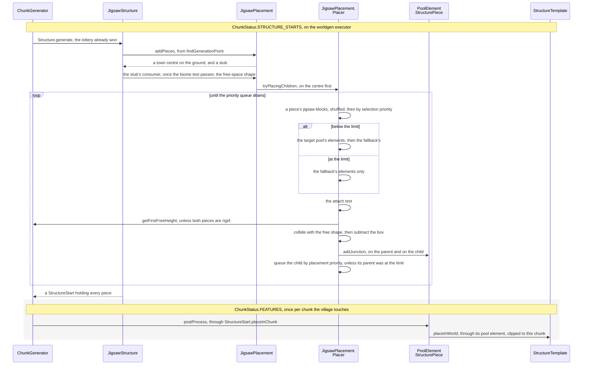

# Jigsaw and templates

> Verified against **Minecraft 26.3** · Part XII · A village assembles itself: pieces that find each other through connector blocks, a priority queue instead of a stack, and a growth limit that takes the right pool away a piece before it stops the queue.

A village stops somewhere. Follow a street out from the town centre and the
houses run out and the path ends in a stub of dirt path with nothing on it.
Nothing measured the street and nothing counted the buildings. That stub is
a *terminator*, and it comes from the street pool's **fallback** pool — which
`JigsawPlacement.Placer` appends to the candidate list at **every** depth,
behind the pool the piece asked for. A street ends wherever the
street pieces stop fitting. What the depth limit — a *size* the structure
declares, six for a village against the twenty `JigsawStructure.MAX_DEPTH`
allows — does is stop offering the asked-for pool at all, so at the limit the
fallback is the only thing left, and stop queuing whatever a piece there places. The edge of a village is a substitution first, and a
stop condition only one piece further out.

This is the assembler one of the sixteen structure types uses — the jigsaw —
together with the `.nbt` template system that turns each of its pieces into
blocks, which is also what a structure block reads and writes. Everything
*outside* the assembler is structure placement:
[the lottery](structure-placement.md#which-chunk-arithmetic-and-the-two-places-a-biome-still-gets-in) that
chose this chunk, [the reference
scan](structure-placement.md#which-chunks-have-to-be-told),
[the beardifier](structure-placement.md#the-ground-bends-before-the-ground-exists),
and [the moment `StructurePiece.postProcess` is
called](structure-placement.md#then-the-blocks-arrive-one-chunk-at-a-time). The
other fifteen types use a
different assembler and reach this page only for the templates
([hand-built structures](hand-built-structures.md#the-four-families)).

## The cast

| class | what it holds | when |
|---|---|---|
| `JigsawStructure` | ten data-pack fields: the start pool, the start jigsaw name, a depth, a start height, a heightmap to project onto, a maximum distance, the pool aliases, the expansion hack, the dimension padding and the liquid settings | data pack, `Registries.STRUCTURE` |
| `StructureTemplatePool` | a weighted list of `StructurePoolElement`s and a **fallback** pool — the two fields its codec has | data pack |
| `StructurePoolElement` | one candidate: a single template, a legacy single, a list, a placed *feature*, or nothing — a dispatched type like the processors and the rule tests below ([the pattern](../foundations/data-driven-types.md#the-idea-stated-once)) | data pack |
| `JigsawPlacement.Placer` | the body of the assembly loop, and the priority queue that loop drains; the `VoxelShape` of free space ([shapes and collision](../../reference/math-and-primitives.md#shapes-and-collision)) travels with each queue entry | `ChunkStatus.STRUCTURE_STARTS`, on the worldgen executor |
| `JigsawBlock` | the connector. Five things are written on one: its own **name**, the **target name** it looks for, the **pool** to draw a neighbour from, the **final state** it turns into once the assembler is done with it, and a `JigsawBlockEntity.JointType` deciding whether rotation must match, which matters only on an up- or down-facing one. Two priorities sit beside them, below | in the template |
| `PoolElementStructurePiece` | one accepted candidate, with its junctions | built at `ChunkStatus.STRUCTURE_STARTS`, saved with the chunk |
| `StructureTemplate` | a parsed `.nbt` file: block palettes, entities, and the jigsaw blocks in it | loaded by `StructureTemplateManager` |
| `StructurePlaceSettings` | rotation, mirror, the chunk box, liquid handling and an **ordered** list of `StructureProcessor`s | per piece, per chunk |

## A village assembles, from town centre to blocks

```mermaid
sequenceDiagram
    participant ChunkG as ChunkGenerator
    participant JS as JigsawStructure
    participant JP as JigsawPlacement
    participant JPP as JigsawPlacement.<br/>Placer
    participant PESP as PoolElement<br/>StructurePiece
    participant STemp as StructureTemplate

    Note over ChunkG,STemp: ChunkStatus.STRUCTURE_STARTS, on the worldgen executor
    ChunkG->>JS: Structure.generate, the lottery already won
    JS->>JP: addPieces, from findGenerationPoint
    JP-->>JS: a town centre on the ground, and a stub
    JS->>JP: the stub's consumer, once the biome test passes: the free-space shape
    JP->>JPP: tryPlacingChildren, on the centre first
    loop until the priority queue drains
        JPP->>JPP: a piece's jigsaw blocks, shuffled, then by selection priority
        alt below the limit
            JPP->>JPP: the target pool's elements, then the fallback's
        else at the limit
            JPP->>JPP: the fallback's elements only
        end
        JPP->>JPP: the attach test
        JPP->>ChunkG: getFirstFreeHeight, unless both pieces are rigid
        JPP->>JPP: collide with the free shape, then subtract the box
        JPP->>PESP: addJunction, on the parent and on the child
        JPP->>JPP: queue the child by placement priority, unless its parent was at the limit
    end
    JS-->>ChunkG: a StructureStart holding every piece
    rect rgba(0, 0, 0, 0.04)
    Note over ChunkG,STemp: ChunkStatus.FEATURES, once per chunk the village touches
    ChunkG->>PESP: postProcess, through StructureStart.placeInChunk
    PESP->>STemp: placeInWorld, through its pool element, clipped to this chunk
    end
```

*A village is a queue drained in memory at the second status and written chunk by chunk at `ChunkStatus.FEATURES`; at the depth limit a piece is still queued, and only the fallback pool is offered to it.*

The alternative box and the loop's last arrow are the page's opening in one frame: nothing in the loop counts houses or measures a street, and the depth limit changes two things: which pool a jigsaw block is offered, and whether what a piece at the limit places is queued at all, which it is not. `JigsawPlacement.addPieces` does the centre and the stub, `Structure.GenerationStub.getPiecesBuilder` runs the stub once it has passed its biome test, and `JigsawPlacement.Placer.tryPlacingChildren` does everything inside the loop; the sections below take the loop's steps in order.

## The pools

A `StructureTemplatePool` is the unit of choice, and its codec has exactly two
fields — all 245 shipped pool files carry those two and nothing else. The
weighted *elements* list is the candidates. The **fallback** pool is a second
pool appended behind them, tried whenever nothing in the first list fits — unless that list holds an empty element, which ends the search wherever the shuffle put it, fallback and all — and the only thing tried at the depth limit. The third thing you might expect on
the pool is not there: `StructureTemplatePool.Projection` is a field of each
*element*, so one pool can mix them. It decides how Y is chosen: *rigid* keeps the parent piece's vertical offset when the parent is rigid too, and *terrain matching* asks the generator
for the ground height and brings a gravity processor with it.

Five kinds of element can sit in that list. `SinglePoolElement` is one
template. `LegacySinglePoolElement` is the same with a wider ignore rule, which drops the template's air. `ListPoolElement` is several placed as a unit. `EmptyPoolElement` is a
deliberate nothing. And `FeaturePoolElement` places a `PlacedFeature`
instead of a template — which is how village trees arrive
([features and placement](features-and-placement.md#the-fold)).

`PoolAliasBinding` and `PoolAliasLookup` sit on top: one structure can swap
which pool a name resolves to, per placement, resolved once from a positional
random source before the assembly loop starts. `PoolAliasBindings` registers
three kinds — `DirectPoolAlias` names a replacement outright, `RandomPoolAlias`
draws one from a weighted list, and `RandomGroupPoolAlias` draws a whole group
of substitutions together so they agree. Trial chambers are the only vanilla
structure that uses any of them, and what they swap is which pool the spawners
draw their mobs from.

## The assembly loop

`JigsawPlacement.addPieces` builds a `VoxelShape` of free space around the
start piece and hands it to `JigsawPlacement.Placer`. From then on the
algorithm is: take a placed piece, look at its jigsaw blocks, and for each one
try to hang something off it.

Five details in that loop are the ones worth watching.

**It is a priority queue, not a stack, and two different priorities steer it.**
Within one piece, its jigsaw blocks are shuffled and then sorted by
**selection** priority, highest first, so a mapmaker can decide which connector
on a house gets first refusal. Across pieces,
`JigsawPlacement.Placer.placing` orders the queue by the source jigsaw block's
**placement** priority, with insertion order breaking ties — not depth-first —
so a template can have the piece hung on one of its connectors expanded before everything queued at a lower priority.

**Attachment is a name match plus a geometry match.** `JigsawBlock.canAttach`
requires the two jigsaw blocks to face each other and the source's target name to be the candidate's name, or the candidate to have none; an *aligned* joint additionally requires the rotations to match, while
a rollable one does not — a difference only an up- or down-facing pair can show.

**The ground decides what fits, without a chunk being read.** Whenever the
source or the target piece is not *rigid* — which is every village street —
`JigsawPlacement.Placer` asks `ChunkGenerator.getFirstFreeHeight` for the ground
under the source's jigsaw block and puts the candidate's box there, and that box
— raised first by the expansion hack where the structure sets it ([below](#the-boxes-drawn-round-the-loop)) — is what the collision test below then tests. `ChunkGenerator.getFirstFreeHeight`
samples the density graph rather than reading blocks
([density functions](density-functions.md#three-forms-of-one-graph)), which is
the whole reason the assembly can run at `ChunkStatus.STRUCTURE_STARTS`, before
any terrain has been written.

**Collision is against a shrinking shape, not against a list.** One
`VoxelShape` of free space is built around the start piece and then travels
down the queue inside each `JigsawPlacement.PieceState`, and every accepted
piece subtracts its own box from it — so the next candidate is tested against
what is genuinely left. A candidate that intersects is simply not built, and the candidate's next connector is tried, then its next rotation, then the next candidate. There is one branch: when a jigsaw block points *into* its own piece's box, the child is tested against a shape of that piece's box instead of the shared one, and every inward child of the piece shares it — which is how a village street carries its houses, whose entrances point into the street's own box.

**A junction is recorded on both sides.** Each connection writes a
`JigsawJunction` into the parent piece *and* the child, which is what lets
`Beardifier` treat junctions as their own terrain contribution rather than
inferring them from the boxes
([structure placement](structure-placement.md#the-ground-bends-before-the-ground-exists)).

## The boxes drawn round the loop

Of the ten data-pack fields on `JigsawStructure`, three are spatial limits on
everything above — and none of them is the depth limit, which is the *size* field
the hook turns on. **`JigsawStructure.MaxDistance`** is the
horizontal and vertical reach from the centre, and the free-space shape is
built to exactly that box — so a piece the queue would otherwise accept is
refused for being too far out. It is also the field the data-pack load
validates: `JigsawStructure.MAX_TOTAL_STRUCTURE_RANGE` is 128, and a horizontal
reach plus the twelve blocks a terrain adaptation needs must fit inside it, or
the pack fails to load rather than generating a structure the
[17×17 reference scan](structure-placement.md#which-chunks-have-to-be-told) could miss.
**`DimensionPadding`** shrinks that box at the top and the bottom, in blocks,
and rejects the start piece outright if the centre itself will not fit inside
the padded world — which is how a structure declines to generate near the
build limits instead of being clipped by them. And **the expansion hack** stretches a candidate at most sixteen blocks tall *upward* before the collision test, until it has room above its floor for the tallest piece the pools its own inward-facing jigsaws point at could need — in a village, a street raised for the houses that will stand inside its box. A street that fits can therefore be rejected for the houses it would carry.

One more field is not about space at all. **`LiquidSettings`** decides
whether the blocks a piece writes keep the water that was already there —
*apply_waterlogging* re-floods what it can, *ignore_waterlogging* leaves the piece dry — and *apply_waterlogging* is the default, overridable per element as well as per structure.

The shipped data is the clearest thing about the last three of those —
the expansion hack, the padding and the liquid settings. Of the fifty-two structure files the game ships, twenty-four turn the expansion hack on (the five villages, the pillager outpost and the eighteen abandoned camps), and **exactly one sets either of the other two**: trial chambers, which pads ten blocks off the
top and the bottom because it generates deep and must not punch through, and
turns waterlogging off because a flooded chamber is not the room it was drawn
as. No shipped pool element overrides the liquid setting at all.

## The processors, and what the shipped lists use

The processors are the interesting layer, because they are shared with the
other assembler and with the structure blocks a player can use. A
`StructureProcessorList` is the data-pack object — a registry element that is
just an ordered list of them — and each entry is a dispatched type
([the pattern](../foundations/data-driven-types.md#the-idea-stated-once)).

`RuleProcessor`
applies `ProcessorRule`s, and each rule holds **two** block tests with
different subjects: an *input predicate* against the template's own block and
a *location predicate* against the block already in the world. Both are
`RuleTest`s, a family of ten ways to match a block — by state, by block, by tag, by height, or by a block or a state on a random roll, with *always_true* and the *all_of*, *any_of* and *not* combinators over the rest — and a `PosRuleTest` follows, its
own family, measuring position against the reference the structure's piece
zero fixed. A replacement state and an optional `RuleBlockEntityModifier` come
last, and the first rule that matches wins.
`BlockRotProcessor` deletes a fraction of the blocks. `GravityProcessor`
drops them to a heightmap. `ProtectedBlockProcessor` refuses to overwrite
anything in a tag. `CappedProcessor` lets another processor change at most a sampled number of the blocks. `BlockIgnoreProcessor` skips a named list of
blocks, and its three presets name the structure block, air, or both — never
structure void, which never reaches a template in the first place, because a
structure block excludes it when it saves. And `JigsawReplacementProcessor` is
the one that cleans up after the
assembler: it swaps each jigsaw block for the state named in its final-state
string, or removes it entirely. **The assembly graph is invisible in the
finished village** unless `SharedConstants.DEBUG_KEEP_JIGSAW_BLOCKS_DURING_STRUCTURE_GEN`
is set.

Which of those a data pack uses is a much shorter list than the registry. **Forty** processor lists ship, and between them they name four
types: rule thirty-five times, protected blocks seven, block rot six, capped
four. Gravity and jigsaw replacement never appear in one, because the
projection and the assembler add them; the ruined portal's stack never appears
either, because it is assembled in Java
([hand-built structures](hand-built-structures.md#where-the-families-bend-the-idea)).

## From a piece to blocks

Nothing above has written a block. When `ChunkStatus.FEATURES` finally calls
`StructurePiece.postProcess` on a `PoolElementStructurePiece`, the element
assembles a `StructurePlaceSettings` — the chunk box, the rotation, the
ignore processor, then `JigsawReplacementProcessor`, then the element's own
processor list, then the projection's. `LegacySinglePoolElement`, which is
what every vanilla village piece is, then pops its ignore processor and
re-appends a wider one at the **end** of that list, so for the pieces a player sees the ignore step runs last and drops the template's air as well
as its structure blocks. `StructureTemplate.placeInWorld`
runs every block in the template through
`StructureTemplate.processBlockInfos`.

A `StructureTemplate` is a parsed `.nbt` file: `StructureTemplate.Palette`s
of `StructureTemplate.StructureBlockInfo`, an entity list, and
`StructureTemplate.JigsawBlockInfo` for the connectors. Placing it writes
what falls inside the box, loads block-entity data
([block entities](../blocks/block-entities.md#create-keep-replace-remove)) and stamps a **fresh loot
seed** into containers rather than a table's contents
([loot tables](../items/loot-tables.md#the-chest-was-empty-before-you-got-there)) — which is why a village chest's
contents are decided when you open it, not when the village generated.

## Where a template comes from

`StructureTemplateManager` loads templates in a fixed order — the world's generated directory, then the gametest source when one is set, then data packs — through two or three `TemplateSource`s: a `DirectoryTemplateSource` reading files off disk, a second one parsing the *.snbt* text form the game tests keep, and a `ResourceManagerTemplateSource` reading the pack stack like any other resource. `TemplatePathFactory` is what turns an id into a path when a template is saved. The
first source that answers wins, which is what lets a structure block's saved
file shadow a data pack's, and the folder every one of them looks in is
*structure*, singular.

That first source is also the seam with the block a player can use. A
**structure block** in save mode calls `StructureTemplate.fillFromWorld` over
its box — excluding structure void, which is how a saved template gets its holes — and,
saved from its screen, writes the result into the world's generated directory; a
redstone pulse only replaces the copy the template loader holds, which generation
reads all the same. In load mode it hands a `StructurePlaceSettings` to the same
`StructureTemplate.placeInWorld` a village piece uses, with rotation, mirror,
an integrity roll that is a `BlockRotProcessor`, and a seed. `/place template`
is the command form of the same call. `StructureBlockEntity` holds all of that
state, and `ServerboundSetStructureBlockPacket` is how the screen edits it; the
jigsaw block's editor is the same arrangement one class along.

## Questions players ask

**Why is one village bigger than another?** Because the size field is an outer
bound and almost never the thing that stops a branch. What usually ends one is
every candidate in the street pool failing the collision test, which hands the
branch to the fallback's terminators — so a street that happens to run downhill
into free space grows further than one that turns back on itself. The expansion
hack sharpens it: a piece that would fit is rejected for the children it would
need room for.

**Can I watch the assembler run?** Yes, two ways, and a third only a developer
sees. The jigsaw *editor* runs in both directions —
`ServerboundSetJigsawBlockPacket` and `ServerboundJigsawGeneratePacket` let a creative-mode operator run the assembler live against a loaded `ServerLevel`, and `JigsawBlockEntity` syncs its fields back the other way — and
`/place jigsaw` does the same from a command, with a pool, a target and a depth.
Neither sends the client anything shaped like a structure: it sees the jigsaw block's fields and the blocks as they are written. The third is
`DebugSubscriptions.STRUCTURES`, which ships every piece's bounding box to the
debug renderer
([debugging the running game](../client/debugging-the-running-game.md#the-sixteen-instances)).

**Why do the same houses appear in different rotations?** Because rotation is
chosen per piece and applied to the block *states* as they are written, not to
a pre-rotated template. Whether a neighbour on an up- or down-facing connector may differ in rotation is the joint type's decision; two side-facing connectors fix it by facing each other.

> **For a 1.21-era reader.** A structure block now saves into the world's
> *generated/&lt;namespace&gt;/structure/*, not *structures/* — the singular
> folder a data pack's templates were already read from.

## Where to look

`JigsawPlacement.addPieces` sets the start piece and the free-space shape;
`JigsawPlacement.Placer` under it is the loop's body, and reading its one long method straight through is the page — the shuffle, the two priorities, `JigsawBlock.canAttach`,
the collision test, the junction on both sides. `JigsawBlock.canAttach` and
`JigsawBlockEntity.JointType` are the attachment rule in isolation.
`StructureTemplatePool` is two fields and worth opening for that alone, with
`StructurePoolElement` and `SinglePoolElement` for what a candidate is and
`StructureTemplatePool.Projection` for how Y is chosen. Then the writing half:
`StructureTemplate.placeInWorld` and `StructureTemplate.processBlockInfos`,
with `StructurePlaceSettings` beside them for the ordered processor list, and
`RuleProcessor` with `ProcessorRule` as the one processor worth reading in
full. `JigsawReplacementProcessor` is what makes the assembly graph disappear. Finish at `StructureTemplateManager`, for the sources and why a structure block's file wins. One door the page does not open:
`StructureBlockEntity`, which is the whole editor's state in one class.

---

*Rules: names, never code · how the system works, not how the code reads ·
newest version only · every backticked name passes `tools/verify_names.py`.*
