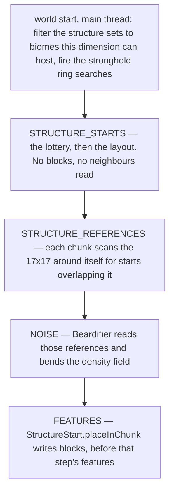

# Structure placement

> Verified against **Minecraft 26.2** · Part XII · A village is decided: a lottery that never looks at the world, a layout that may be computed twice, an absence stored as a hole, and a command that generates chunks to answer a question.

Type `/locate structure village` and one of two things happens. Usually the
answer is instant, from a couple of thousand blocks away, in a direction you
have never been. Occasionally the game stops for a second first. Both come
out of the same machinery, and the difference is a cache.

The reason the fast answer is possible at all is that **whether a village
*could* be here is pure arithmetic on the world seed**. No biome is
consulted, no terrain is sampled, no chunk is read. Divide the chunk
coordinates by a spacing, seed a random source from the level seed and the
grid cell, draw two offsets, and compare. Everything the world has a say
in — the biome, the ground height, whether the layout fits — happens
*afterwards*, and can still say no.

A structure is a thing the generator decides to build **at** a place rather
than **from** it. This page is the framework all sixteen structure types
share: the decision, the caching, the reference scan, the way terrain bends
around it, and the moment blocks are finally written. What builds the pieces
is one of two assemblers — [jigsaw and templates](jigsaw-and-templates.md) for
villages and their relatives, [hand-built structures](hand-built-structures.md)
for the other fifteen types.

## The cast

| class | the decision it owns | when |
|---|---|---|
| `StructureSet` | which structures share a grid, with weights, and which `StructurePlacement` lays that grid out | data pack |
| `StructurePlacement` | where the grid falls. `RandomSpreadStructurePlacement` is the spacing-and-separation lottery; `ConcentricRingsStructurePlacement` is strongholds | world start, then per chunk |
| `ChunkGeneratorStructureState` | which sets are possible in this dimension at all, and the stronghold ring positions | once per world, on the main thread |
| `Structure` | the settings wrapper: allowed biomes, spawn overrides, the decoration step, the terrain adjustment — and `Structure.findGenerationPoint` | `ChunkStatus.STRUCTURE_STARTS` |
| `StructureStart` | the answer: a structure, the chunk it started in, a `PiecesContainer`, a reference count and a cached box | stored on the chunk |
| `StructureManager` | the per-level view of starts and references | worldgen and main thread |
| `StructureCheck` | the presence cache — two caches over a partial-NBT reader — and the thing `/locate` actually asks | **main thread only**, unsynchronised |
| `Beardifier` | how much the terrain bends, as a density term | `ChunkStatus.NOISE` |

## Four decisions, on four different clocks

The odd thing about that ladder is where it starts. `ChunkStatus.STRUCTURE_STARTS`
is the **second** status a chunk passes through, two before
`ChunkStatus.BIOMES` — so a structure is decided before the biomes and the
terrain it will sit in exist. Everything the structure needs to know about
the world it asks for directly, from the generator, rather than reading it
out of a chunk.

## Which chunk: a grid, and nothing else

`ChunkGenerator.createStructures` walks the possible structure sets. For a
village that means `RandomSpreadStructurePlacement.getPotentialStructureChunk`:
divide the chunk coordinates by the spacing, seed a `WorldgenRandom` from the
level seed, the grid cell and the set's own salt, and draw two offsets inside
the cell. This chunk is the village chunk only if the draw lands exactly
here. `RandomSpreadType` decides whether the draw is uniform or triangular,
and `StructurePlacement.isStructureChunk` adds a frequency roll, a
`StructurePlacement.FrequencyReductionMethod` and a deprecated
`StructurePlacement.ExclusionZone` that lets one set repel another.

Two qualifiers, and both matter. The *other* placement type is not like this
at all: `ConcentricRingsStructurePlacement` positions strongholds by asking
`BiomeSource.findBiomeHorizontal` for real biome positions, on the background
pool, at world start. And even for villages a coarse biome test has already
happened once — when `ChunkGenerator.createState` built the
`ChunkGeneratorStructureState` and dropped every set no biome in this
dimension can host.

## Which structure, and whether the biome allows it

The set has entries with weights, so a second `WorldgenRandom` picks one.
Then `Structure.findValidGenerationPoint` runs
`Structure.findGenerationPoint` and filters it through
`Structure.isValidBiome` — **the biome is sampled at the proposed point,
after the lottery has already chosen the chunk.**

If that fails — most often the biome, but also an empty start pool, a missing
start jigsaw, or a structure that would sit too close to the world height
limits — the entry is *removed*, its weight subtracted, and the roll
repeated. A chunk on a biome border therefore usually gets *a* village where
a single-candidate set would get none. If every entry fails, the loop drains
and the cell stays empty: the slot still exists, the village does not.

## Whether it is worth laying out

`Structure.generate` does not return pieces. It returns a
`Structure.GenerationStub`, and the stub holds the *child expansion* as an
unexecuted consumer. That is what lets `StructureCheck` answer "a village
exists here" without laying the village out — and it means
`Structure.generate` may run the layout **twice**, once for the check and
once for real. Both runs agree, because the generation context rebuilds its
`WorldgenRandom` from the seed and the chunk position.

What is *not* deferred is the centre: the start template, its rotation and
its ground height are all resolved before the stub comes back.

`StructureCheck` is the cache in front of all of this, and it is two caches
over a partial-NBT reader: chunk → structure → **reference count** (which is
what makes "unreferenced only" searches possible), and structure → chunk →
would-generate. On a miss it reads the chunk off disk through
`ChunkScanAccess`, pulling only the data version and the structure starts and
data-fixing that fragment alone. It is main-thread-only and unsynchronised,
which is why `ServerLevel.onStructureStartsAvailable` hops back to the server
thread from the worldgen executor to feed it.

**Absence is stored as a hole, not as a marker.** An invalid start is never
written at all: `ChunkGenerator.tryGenerateStructure` calls
`StructureManager.setStartForStructure` only for a valid start, and
`StructureStart.INVALID_START` is dropped on the floor. What lets a partial
scan prove absence is that every saved chunk carries a *starts* compound
unconditionally, empty or not — so a structure simply missing from that map
is a definite "not here". The *INVALID* ids that do turn up in old saves are
legacy, and `StructureCheck` skips them while loading.

## Who needs to know

At `ChunkStatus.STRUCTURE_REFERENCES`, `ChunkGenerator.createReferences` scans
the **17×17 chunk square around each chunk** and records the packed position
of every start whose bounding box overlaps it. Discovery is outside-in: a
village never walks its own pieces to announce itself, and this is why almost
every later step in the generation pyramid requires structure starts within
eight.

The box that scan tests is not always the box the assembler produced.
`Structure.adjustBoundingBox` inflates it by twelve the moment
`TerrainAdjustment` is anything but *none* — and that inflated box is what
the reference scan, `StructureManager.getStructureAt` and the spawn overrides
all see. The margin the beardifier needs is therefore also the margin in
which a village counts as "here" for mob spawning. The 128-block cage that
keeps a 17×17 scan sufficient is enforced when the **data pack loads**, not
when the structure generates: a jigsaw whose maximum distance plus the
terrain margin exceeds `JigsawStructure.MAX_TOTAL_STRUCTURE_RANGE` fails
validation.

## The ground bends, and then the blocks arrive

At `ChunkStatus.NOISE`, `Beardifier.forStructuresInChunk` reads those
references and turns the nearby pieces into `Beardifier.Rigid` boxes plus
their junctions. **No blocks are edited.** The flat shelf under a village is
the density field being told to be solid there
([terrain](terrain.md)), and `TerrainAdjustment` picks the shape: only two of
its five values use the kernel the name *beard* refers to — the two beard
modes, where junctions contribute at half the weight of the pieces, which is
where the smooth shoulders under village streets come from. *Bury* and
*encapsulate* use a plain linear distance falloff instead. The *rigid* filter
applies only to jigsaw pieces, which have a projection to test; a desert
pyramid or a mineshaft corridor contributes unconditionally.

Then at `ChunkStatus.FEATURES`, `ChunkGenerator.applyBiomeDecoration` places
structures at their declared decoration step, *before* that step's features.
`StructureStart.placeInChunk` derives a reference position from **piece
zero** — piece order is semantic, not cosmetic, and that position seeds the
processors' randomness — and calls `StructurePiece.postProcess` on every
piece overlapping this chunk's writable area. Every chunk the structure
touches does this with its own box, so a house straddling four chunks is
written in four slices, at four different times, and a piece's
`StructurePiece.postProcess` must be idempotent.

## Questions players ask

**Why does `/locate` sometimes pause?** Because on a cache miss it can drive
world generation, from the server thread. `StructureCheck` re-runs the
start-point and biome test — the grid arithmetic having already produced the
candidate chunk — and on a result of `StructureCheckResult.CHUNK_LOAD_NEEDED`
it loads the chunk to structure starts, **synchronously**, for up to a
hundred expanding rings of grid cells.

**Why can two treasure maps never point at the same monument?**
`StructureStart.getMaxReferences` is one. An exploration map asks for an
*unreferenced* structure and takes a reference when it finds one, and the
reference count is exactly what `StructureCheck`'s first cache stores.

**Do structures override the biome for mob spawning?** Yes, and first.
`ChunkGenerator.getMobsAt` consults `Structure.spawnOverrides` before
`Biome.getMobSettings` ([biomes](biomes.md)), scoped either to the piece or
to the whole start. Nether fortresses are special-cased earlier still, inside
`NaturalSpawner`.

**Which `StructureManager` is which?** There are two unrelated things with
that shape of name, and both live on the level.
`ServerLevel.structureManager` is the starts-and-references view on this
page; `ServerLevel.getStructureManager` returns the `.nbt` template loader
owned by the server ([jigsaw and templates](jigsaw-and-templates.md)). There
is also a second, unrelated `StructureCheck` in the entity-variant package.

**Is there dead code in here?** Some, and it reads as load-bearing.
`PostPlacementProcessor` is referenced by nothing at all, and
`PieceGenerator` and `PieceGeneratorSupplier` are referenced only by each
other. The live post-placement hook is `Structure.afterPlace`.

## Where to look

`Structure.generate` · `Structure.findValidGenerationPoint` ·
`Structure.StructureSettings` · `Structure.adjustBoundingBox` ·
`StructureSet` · `StructurePlacement.isStructureChunk` ·
`RandomSpreadStructurePlacement.getPotentialStructureChunk` ·
`ConcentricRingsStructurePlacement` ·
`ChunkGeneratorStructureState.generatePositions` ·
`ChunkGenerator.createStructures` · `ChunkGenerator.createReferences` ·
`ChunkGenerator.tryGenerateStructure` · `StructureStart.placeInChunk` ·
`StructureStart.INVALID_START` · `StructureManager.startsForStructure` ·
`StructureManager.addReferenceForStructure` · `StructureCheck.checkStart` ·
`ChunkScanAccess` · `Beardifier.forStructuresInChunk` ·
`TerrainAdjustment` · `ChunkGenerator.findNearestMapStructure` ·
`BuiltinStructures` · `BuiltinStructureSets`

---

*Rules: names, never code · how the system works, not how the code reads ·
newest version only · every backticked name passes `tools/verify_names.py`.*
