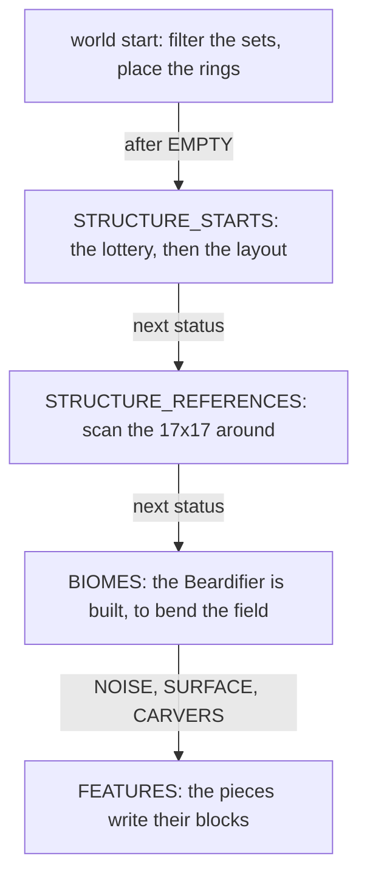

# Structure placement

> Verified against **Minecraft 26.2** · Part XII · A village is decided: a lottery that never looks at the world, a layout that is deferred and then run by the method that deferred it, an absence stored as a hole, and a command that generates chunks to answer a question.

Type `/locate structure village` and the answer usually comes back instantly,
from a couple of thousand blocks away, in a direction you have never been —
naming a chunk in a world that has never been generated. It can do that because
**whether a village *could* be here is pure arithmetic on the world seed**. No
biome is consulted, no terrain is sampled, no chunk is read. Divide the chunk
coordinates by a spacing, seed a random source from the level seed and the grid
cell, draw two offsets, and compare. Everything the world has a say in — the
biome, the ground height, whether the layout fits — happens *afterwards*, and
can still say no.

A structure is a thing the generator decides to build **at** a place rather
than **from** it. This page is the framework all sixteen structure types
share: the decision, the caching, the reference scan, the way terrain bends
around it, and the moment blocks are finally written. What builds the pieces
is one of two assemblers — [jigsaw and templates](jigsaw-and-templates.md#the-assembly-loop) for
villages and their relatives, [hand-built structures](hand-built-structures.md#the-idea)
for the other fifteen types.

## The cast

| class | the decision it owns | when |
|---|---|---|
| `StructureSet` | which structures share a grid, with weights, and which `StructurePlacement` lays that grid out | data pack, `Registries.STRUCTURE_SET` |
| `StructurePlacement` | where the grid falls, dispatched on a `StructurePlacementType` like any data-driven type ([the pattern](../foundations/data-driven-types.md#the-idea-stated-once)). `RandomSpreadStructurePlacement` is the spacing-and-separation lottery; `ConcentricRingsStructurePlacement` is strongholds | world start, then per chunk |
| `ChunkGeneratorStructureState` | which sets are possible in this dimension at all, and the stronghold ring positions | once per world — the filter on the main thread, the ring searches on the background pool |
| `Structure` | the settings wrapper: allowed biomes, spawn overrides, the decoration step, the terrain adjustment — and `Structure.findGenerationPoint`. Its `StructureType` is what the sixteen concrete subclasses are registered as | `Registries.STRUCTURE`, then `ChunkStatus.STRUCTURE_STARTS` |
| `StructureStart` | the answer: a structure, the chunk it started in, a `PiecesContainer`, a reference count and a cached box | stored on the chunk |
| `StructureManager` | the per-level view of starts and references. Two unrelated things carry that shape of name and both live on the level: this one is `ServerLevel.structureManager`, while `ServerLevel.getStructureManager` returns the server's `.nbt` template loader ([jigsaw and templates](jigsaw-and-templates.md#from-a-piece-to-blocks)) | worldgen and main thread |
| `StructureCheck` | the presence cache — two caches over a partial-NBT reader — and the thing `/locate` actually asks | **main thread only**, unsynchronised |
| `Beardifier` | how much the terrain bends, as a density term | built with the `NoiseChunk` at `ChunkStatus.BIOMES` |

## Five decisions, on five different clocks

*Five decisions on the chunk-status ladder, with the statuses between them on the arrows: a structure is decided at the second status and writes nothing until the three terrain statuses are past.*

The odd thing about that ladder is where it starts. `ChunkStatus.STRUCTURE_STARTS`
is the **second** status a chunk passes through, two before
`ChunkStatus.BIOMES` ([the pyramid,
drawn](../world/chunk-generation-pipeline.md#the-pyramid-drawn) is the ladder
and the dependency rules it enforces) — so a structure is decided before the
biomes and the
terrain it will sit in exist. Everything the structure needs to know about
the world it asks for directly, from the generator, rather than reading it
out of a chunk.

## Which chunk: arithmetic, and the two places a biome still gets in

`ChunkGenerator.createStructures` walks the possible structure sets. For a
village that means `RandomSpreadStructurePlacement.getPotentialStructureChunk`:
divide the chunk coordinates by the spacing, seed a `WorldgenRandom` from the
level seed, the grid cell and the set's own salt, and draw two offsets inside
the cell. This chunk is the village chunk only if the draw lands exactly
here. `RandomSpreadType` decides whether the draw is uniform or triangular,
and `StructurePlacement.isStructureChunk` adds a frequency roll, a
`StructurePlacement.FrequencyReductionMethod` and a deprecated
`StructurePlacement.ExclusionZone` that lets one set repel another.

Two qualifiers, and both matter. The *other* placement type is not like this
at all: `ConcentricRingsStructurePlacement` positions strongholds by asking
`BiomeSource.findBiomeHorizontal` for real biome positions, on the background
pool, at world start. And even for villages a coarse biome test has already
happened once — when `ChunkGenerator.createState` built the
`ChunkGeneratorStructureState` and dropped every set no biome in this
dimension can host.

## Which structure, and whether the biome allows it

The set has entries with weights, so a second `WorldgenRandom` picks one.
Then `Structure.findValidGenerationPoint` runs
`Structure.findGenerationPoint` and filters it through
`Structure.isValidBiome` — **the biome is sampled at the proposed point,
after the lottery has already chosen the chunk.**

If that fails — most often the biome, but also an empty start pool, a missing
start jigsaw, or a structure that would sit too close to the world height
limits — the entry is *removed*, its weight subtracted, and the roll
repeated. A chunk on a biome border therefore usually gets *a* village where
a single-candidate set would get none. If every entry fails, the loop drains
and the cell stays empty: the slot still exists, the village does not.

## The layout is deferred, and the centre is not

`Structure.findGenerationPoint` does not return pieces. It returns a
`Structure.GenerationStub`, and the stub holds the *child expansion* as an
unexecuted consumer. `Structure.generate` then calls
`Structure.GenerationStub.getPiecesBuilder` on the same line it takes the stub
back, so on the generation path the deferral lasts one statement. What the
deferral is actually for is `StructureCheck.canCreateStructure`, which calls
`Structure.findValidGenerationPoint` and asks only whether the result is
present. So a presence question costs a centre and never a layout: **the child
expansion runs once, on the chunk that is really generating**, and never for
the hundreds of candidate chunks a search walks past.

What is *not* deferred is the centre: the start template, its rotation and its
ground height are all resolved before the stub comes back — which is why a
presence question is not free either, merely much cheaper than a village.

Three names in this package read as the framework for all of that and are
reached by nothing: `PostPlacementProcessor` by anything at all, and
`PieceGenerator` and `PieceGeneratorSupplier` only by each other. The live
post-placement hook is `Structure.afterPlace`.

## The presence cache, and the hole that proves an absence

`StructureCheck` is the cache in front of all of this, and it is two caches
over a partial-NBT reader: chunk → structure → **reference count** (which is
what makes "unreferenced only" searches possible), and structure → chunk →
would-generate. On a miss it reads the chunk off disk through
`ChunkScanAccess`, which answers a question about a chunk without loading it
and is one of the three joins that block the server thread ([the three places
that do wait](../world/chunk-storage.md#the-three-places-that-do-wait)),
pulling only the data version and the structure starts — a field-selected read
that never builds the rest of the tag
([a whole file need not be read](../foundations/codecs-nbt-json.md#what-nbt-actually-is)) —
and data-fixing that fragment alone. It is main-thread-only and
unsynchronised, which is why both routes in hop to the server thread to feed
it: `ServerLevel.onStructureStartsAvailable` from the worldgen executor when a
chunk generates its starts, and the loading pyramid's own
`ChunkStatusTasks.loadStructureStarts` when a chunk arrives from disk with
starts already in it.

**Absence is stored as a hole, not as a marker.** An invalid start is never
written at all: `ChunkGenerator.tryGenerateStructure` calls
`StructureManager.setStartForStructure` only for a valid start, and
`StructureStart.INVALID_START` is dropped on the floor. What lets a partial
scan prove absence is that every saved chunk carries a *starts* compound
unconditionally, empty or not — so a structure simply missing from that map
is a definite "not here". The *INVALID* ids that do turn up in old saves are
legacy, and `StructureCheck` skips them while loading.

## Which chunks have to be told

At `ChunkStatus.STRUCTURE_REFERENCES`, `ChunkGenerator.createReferences` scans
the **17×17 chunk square around each chunk** and records the packed position
of every start whose bounding box overlaps it. Discovery is outside-in: a
village never walks its own pieces to announce itself, and this is why every
step from this one through `ChunkStatus.FEATURES` — six of the twelve —
requires structure starts eight chunks out.

The box that scan tests is not always the box the assembler produced.
`Structure.adjustBoundingBox` inflates it by twelve blocks on every side the
moment `TerrainAdjustment` is anything but *none* — and that inflated box is what
the reference scan, `StructureManager.getStructureAt` and the spawn overrides
all see. The margin the beardifier needs is therefore also the margin in
which a village counts as "here" for mob spawning. The 128-block cage that
keeps a 17×17 scan sufficient is enforced when the **data pack loads**, not
when the structure generates: a jigsaw whose maximum distance plus the
terrain margin exceeds `JigsawStructure.MAX_TOTAL_STRUCTURE_RANGE` fails
validation.

## The ground bends before the ground exists

`Beardifier.forStructuresInChunk` reads those references and turns the nearby
pieces into `Beardifier.Rigid` boxes plus their junctions. It is built with
the `NoiseChunk`, which is born at `ChunkStatus.BIOMES` rather than at the
noise step ([four statuses, and what each hands
on](terrain.md#four-statuses-and-what-each-hands-on)) — so the beardifier
exists a status before the density field it bends.
**No blocks are edited.** The flat shelf under a village is a term added to
the scalar field before anything samples it, and `TerrainAdjustment` picks the
shape: only two of
its five values use the kernel the name *beard* refers to — the two beard
modes, where junctions contribute at half the weight of the pieces, which is
where the smooth shoulders under village streets come from. *Bury* and
*encapsulate* use a plain linear distance falloff instead. The *rigid* filter
applies only to jigsaw pieces, which have a projection to test; a hand-built
piece contributes unconditionally.

Most structures never reach any of that. A structure that names no
*terrain_adaptation* defaults to `TerrainAdjustment.NONE` and is filtered out
before its pieces are looked at, and that is **twenty-three of the thirty-four
shipped structure files** — the desert pyramid and the mineshaft among them,
which is why neither leaves a shelf. The hand-built pieces that do reach the
branch belong to the stronghold and the nether fossil.

## Then the blocks arrive, one chunk at a time

At `ChunkStatus.FEATURES`, `ChunkGenerator.applyBiomeDecoration` places
structures at their declared decoration step, *before* that step's features —
inside the same step loop that runs decoration
([the trace: a chunk decorates](features-and-placement.md#one-chunks-decoration-from-the-corner-outward)).
`StructureStart.placeInChunk` derives a reference position from **piece
zero** — piece order is semantic, not cosmetic, and every `PosRuleTest`
measures its distances from that point — and calls `StructurePiece.postProcess`
on every
piece overlapping this chunk's writable area. Every chunk the structure
touches does this with its own box, so a house straddling four chunks is
written in four slices, at four different times, and a piece's
`StructurePiece.postProcess` must be idempotent.

## What `/locate` asks, and what it answers with

Occasionally the command stops for a second before answering, and that is a
cache miss being paid for on the server thread. `StructureCheck` re-runs the
start-point and biome test — the grid arithmetic having already produced the
candidate chunk — and on a result of `StructureCheckResult.CHUNK_LOAD_NEEDED`
it loads the chunk to structure starts, **synchronously**, for up to a hundred
expanding rings of grid cells. An eye of ender, a dolphin and an explorer map
all reach the same code and can all pay the same pause.

What comes back is not the structure. `ChunkGenerator.findNearestMapStructure`
returns `StructurePlacement.getLocatePos`, which is the start chunk's minimum
block plus the placement's own offset, and the eye of ender takes the same
answer. A stronghold's portal room can be two hundred blocks from it, and the
stronghold does keep a pointer at the room that nothing in 26.2 reads
([hand-built structures](hand-built-structures.md#a-stronghold-built-twice-if-it-has-to-be)).

An exploration map asks a sharper version of the same question, and the
reference count is what makes it answerable. `StructureStart.getMaxReferences`
is one, and `ExplorationMapFunction` defaults *skip_existing_chunks* to true,
so a map asks for an **unreferenced** structure and takes a reference when it
finds one — which is exactly what the first of `StructureCheck`'s two caches
stores, and why two maps usually do not send two players to one monument. It
is a default and not a guarantee: the three buried-treasure tables, in
shipwrecks and both ocean ruins, set the flag to false and will happily send
both.

## Where to look

`Structure.generate` is the entry and the whole shape in one method: it calls
`Structure.findValidGenerationPoint`, which is the lottery's answer filtered by
biome, and hands back the stub. Read `Structure.StructureSettings` beside it for
what a structure declares. Then the placement side — `StructureSet`,
`StructurePlacement.isStructureChunk` and
`RandomSpreadStructurePlacement.getPotentialStructureChunk` — which is the grid
arithmetic, with `ConcentricRingsStructurePlacement` as the one that does not
work that way. `ChunkGenerator.createStructures` and
`ChunkGenerator.createReferences` are the two chunk statuses, in that order, and
`StructureStart.placeInChunk` is the third. `StructureCheck.checkStart` is the
cache, and `ChunkScanAccess` under it is the partial read that makes it cheap.
Finish at `Beardifier.forStructuresInChunk` and `TerrainAdjustment`, which are
how the whole arrangement reaches the terrain. Two doors the page does not
open: `BuiltinStructures` and `BuiltinStructureSets`, where the shipped sixteen
and their grids are declared.

---

*Rules: names, never code · how the system works, not how the code reads ·
newest version only · every backticked name passes `tools/verify_names.py`.*
