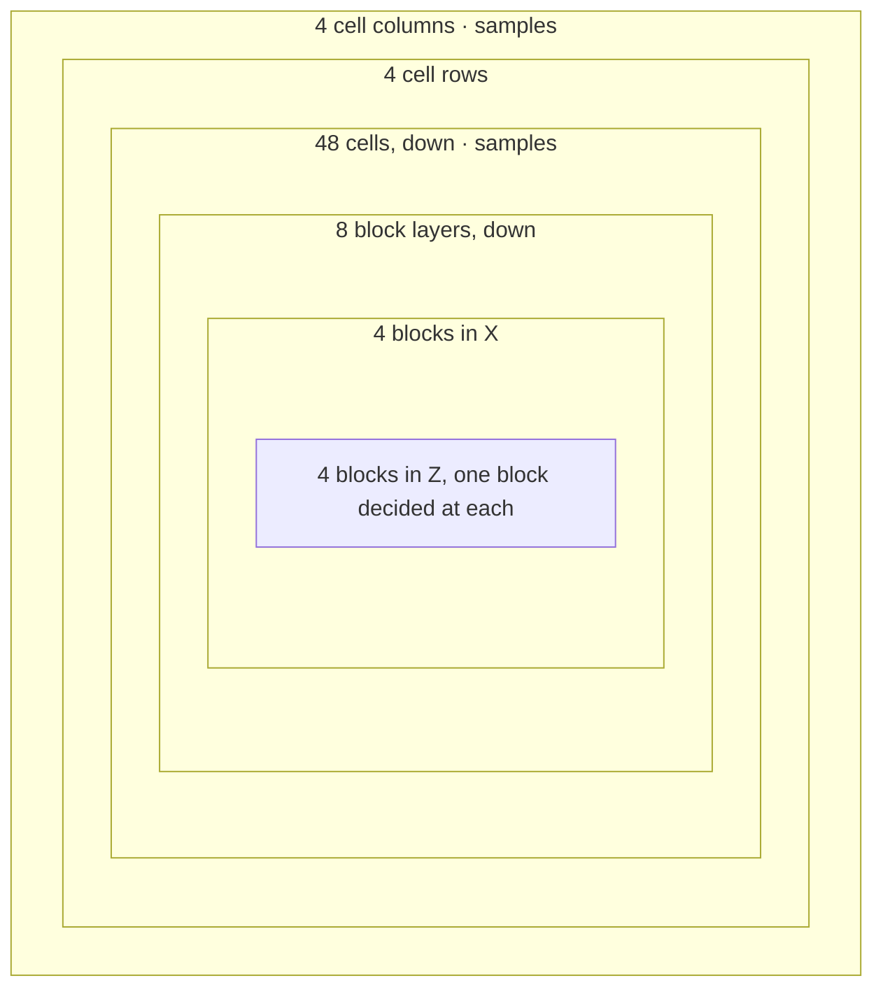

# Terrain

> Verified against **Minecraft 26.2** · Part XII · One chunk's rock: seven hundred and sixty-eight cells filled from their corners, a water table decided before the caves are cut, and the cave that fills with water because of it.

You dig into a cave and it is flooded. The water is not a fluid that flowed
in and settled; nothing flowed anywhere. Before the cave existed, while the
chunk was still solid stone, something decided that a point at that depth in
that column belongs to water rather than to air — and when the carver came
through and asked what to put in the hole it was digging, that answer was
still on file. **A carver does not choose the block it carves.** It chooses
the *shape*; the `Aquifer` chooses the material, and it chose it for the
stone as well.

This page is four chunk statuses: the three that turn a scalar field into
blocks — `ChunkStatus.NOISE`, `ChunkStatus.SURFACE` and `ChunkStatus.CARVERS` —
and `ChunkStatus.BIOMES` before them, which writes nothing and builds the
workspace all three share.
The conveyor that runs the statuses, the dependency pyramid and the
threading are [the chunk generation
pipeline](../world/chunk-generation-pipeline.md#the-pyramid-drawn) in Part IV;
this is the
cargo. The scalar field itself is [density
functions](density-functions.md#three-forms-of-one-graph), and the labels that
steer the surface pass are [biomes](biomes.md#deciding-a-chunks-biomes-cell-by-cell).

## The cast

| class | what it decides | when |
|---|---|---|
| `ChunkGenerator` | the API the statuses call — `ChunkGenerator.fillFromNoise`, `ChunkGenerator.buildSurface`, `ChunkGenerator.applyCarvers`. `ChunkGenerators.bootstrap` registers exactly three implementations | worldgen executor |
| `NoiseGeneratorSettings` | the whole per-dimension recipe: the `NoiseSettings` cell dimensions, the default block and fluid, the `NoiseRouter`, the surface rules, the sea level, the aquifer and ore-vein switches | data, loaded with the world |
| `NoiseChunk` | the per-chunk workspace — the wrapped router, the cell interpolators, the `Aquifer`, the filler chain | built at `ChunkStatus.BIOMES`, dies with the chunk |
| `MaterialRuleList` | which filler answers first: the aquifer, then the ore veins | inside the cell loop |
| `Aquifer` | what liquid, if any, belongs at a point — and therefore what a carver may leave behind | noise *and* carvers |
| `OreVeinifier` | copper or iron, from the sign of one router function | inside the cell loop |
| `SurfaceSystem` | the column re-skin: grass over dirt over stone, sand, the badlands bands | `ChunkStatus.SURFACE`, one instance per level |
| `WorldCarver` | the shape of caves and canyons, and nothing about their contents | `ChunkStatus.CARVERS` |

Everything here runs on the worldgen executor, and two of these steps fan out
from it — the biome fill for every generator, the noise fill for this one
([which steps fork, and why the parallelism is smaller than the thread
names](../world/chunk-generation-pipeline.md#dispatch-and-why-the-parallelism-is-smaller-than-the-thread-names)).
What is worth carrying from that into this page is one object.
`RandomState` — the per-level seed root — is built once in `ChunkMap` and
shared by every generating chunk, and it owns the `SurfaceSystem`, which is
therefore per **level**, not per chunk.

## Four statuses, and what each hands on

*One workspace rides the whole chain: the `NoiseChunk` built at the first status is the one the next three use, and the last box belongs to a later page.*

The odd arrow is the first one. **The workspace is born one status before
the terrain needs it**, because the biome sampler wants the chunk's caches
too ([biomes](biomes.md#deciding-a-chunks-biomes-cell-by-cell) reads the climate functions
through `NoiseChunk.cachedClimateSampler`). So `NoiseChunk.forChunk` runs at
`ChunkStatus.BIOMES`, wrapping the seeded router into chunk-local caches and
constructing the `Aquifer` and the `NoiseChunk.BlockStateFiller` chain,
before a single block exists. Two passengers ride in on that one status of
slack, and both are things this page's terrain is bent by rather than things it
decides.

The **beardifier** is one of them: a density term spliced into the router in
code, swapped for this chunk's real `Beardifier` during the per-chunk rewrite
([wrap: once per chunk](density-functions.md#wrap-once-per-chunk)). Because it
is built with the workspace, a structure has bent the density field before the
field is ever sampled — the flat shelf under a village is a number added to a
scalar field, not a block edit made afterwards. What that term's shape is —
`Beardifier.Rigid` boxes, junctions at half weight, and the five
`TerrainAdjustment` modes — is
[structure placement](structure-placement.md#the-ground-bends-before-the-ground-exists)'s.
A structure asking how high the ground is gets the answer from *before* it bent
anything: `NoiseBasedChunkGenerator.iterateNoiseColumn`, behind
`ChunkGenerator.getBaseHeight` and `ChunkGenerator.getBaseColumn`, builds a
throwaway one-cell `NoiseChunk` with an empty `Blender` and the bare beardifier
marker, samples a column, and discards it.

The **blender** is the other, and it is why an empty one appears in that
sentence. `Blender` reads measurements harvested from chunks an older version
generated and enters the density graph as three nodes; the one that reaches the
graph is the one built here, at *BIOMES*, rather than at any later step, because
the `NoiseChunk` is cached on the chunk and the later blenders find it already
made ([blending at the old-chunk border](blending.md#following-one-chunk-through)).
`BelowZeroRetrogen`, the world-deepening path, rides the same hooks: it wraps
the biome resolver, patches bedrock after the noise step, and gates the spawn
step ([the other passenger](blending.md#the-other-passenger)).

That one instance then serves all three terrain steps, which is exactly what
makes the aquifer's answers agree between filling and carving. It is heavily
mutated on the way — and `NoiseChunk.stopInterpolation`, at the end of the
noise fill, *disarms* it: from the surface step onward, an interpolator
sampled with the `NoiseChunk` itself as the context throws, while every other
context is served by the wrapped function
([the caches, and which of them a single point may use](density-functions.md#the-six-caches-and-the-three-a-single-point-may-use)).
What survives for reuse is the aquifer's grid cache and
the preliminary surface level. It is never cleared and it is not pinned to a
thread; the three steps run as separate tasks on whichever worker takes
them, and what serialises them is the chunk-status future chain rather than
thread affinity.

## Filling the noise: six loops, one number at the bottom

The overworld's `NoiseSettings` asks for a horizontal noise size of one and
a vertical size of two, and `NoiseSettings.getCellWidth` and
`NoiseSettings.getCellHeight` turn those into blocks by multiplying by four.
So the unit of overworld terrain is a cell **four blocks wide, four deep and
eight tall**, and a chunk is four by four by forty-eight of them.

**768** — cells in one overworld chunk, each holding 128 blocks
(`NoiseBasedChunkGenerator.fillFromNoise`).

`NoiseChunk` evaluates the *interpolated* density terms at cell **corners**
only. Everything inside a cell is three linear interpolations away from the
eight corners around it, and the walk that does this is six loops deep:

*Six loops, and the graph is sampled at two of them — once per cell column and once per cell; everything nested inside a cell is interpolation.*

| loop | runs | what it calls on `NoiseChunk` | samples the graph |
|---|---:|---|---|
| cell column, in X | 4 | `NoiseChunk.advanceCellX` first, `NoiseChunk.swapSlices` last | yes — the next slice of corners |
| cell row, in Z | 4 | nothing | no |
| cell, Y downward | 48 | `NoiseChunk.selectCellYZ` | yes — every *cache_all_in_cell* term, for the whole cell |
| block layer, Y downward | 8 | `NoiseChunk.updateForY` | no |
| block, in X | 4 | `NoiseChunk.updateForX` | no |
| block, in Z | 4 | `NoiseChunk.updateForZ`, then `NoiseChunk.getInterpolatedState` | only the fillers' own noise |

Read the nesting as the cost model. A slice of corner values is filled per
cell column and dropped one column later, and `NoiseChunk.selectCellYZ` loads
a cell's eight corners and fills its per-cell caches; below it, every
*interpolated* term is arithmetic on eight numbers. The counts go up by one in each direction when
you move from cells to their corners: four by four by forty-eight cells have
five by five by forty-nine corners between them, so one *interpolated* term is
sampled

**1,225** — corner samples per interpolated density term, per chunk
(`NoiseChunk.fillSlice`, five slices of five by forty-nine).

The Y direction runs **downward** at both nesting levels, which matters
because the two worldgen heightmaps are updated as blocks are written and
the first non-air block seen from the top is the answer.

**Eight** — *interpolated* terms in the overworld router, resolved through
every reference: one round the whole final-density subtree, four inside the
noodle-cave graph, and three across the two vein terms. *vein_gap* is not one
of them, and neither is the aquifer's barrier, which the `Aquifer` samples per
block. Those eight are the only terms this loop reads at cell corners; the
final density is then wrapped in a *cache_all_in_cell* and filled for every
block in the cell. Everything else in the router is sampled at a resolution of
its own, and the resolutions are coarser than the names suggest
([the caches, and which of them a single point may
use](density-functions.md#the-six-caches-and-the-three-a-single-point-may-use)).

The write at the bottom of the loop skips air entirely — a chunk starts empty,
so only non-air is ever written — and updates
`Heightmap.Types.OCEAN_FLOOR_WG` and `Heightmap.Types.WORLD_SURFACE_WG` by
hand rather than through the chunk's ordinary write path. It can, because it
holds every section across its noise range for the whole fill
([what placing a block actually does](../world/chunk-anatomy.md#what-placing-a-block-actually-does)).

Those two stop being maintained one status after this one, and not because
anything stops writing them: which maps are live is a property of the
**status**, not of the step — the two *_WG* maps up to `ChunkStatus.SURFACE`,
the four final ones from `ChunkStatus.CARVERS` on
([the six heightmaps](../world/chunk-anatomy.md#the-six-heightmaps)). A chunk
saved mid-generation really does persist the pair the fill was keeping.

## The two fillers: what the number becomes

`NoiseChunk.getInterpolatedState` does not read the density and compare it
to zero. It runs the `MaterialRuleList` — a chain of
`NoiseChunk.BlockStateFiller`s — and takes the first non-null answer. There
are two of them, in this order.

**The aquifer.** `Aquifer.computeSubstance` receives the final density and
decides, from four of its own noises sampled on a coarse grid — a barrier, two
fluid-level noises for floodedness and spread, and a lava noise — whether this
point is stone, air, or a fluid. It takes five of the router's fifteen
functions: those four, and *preliminary_surface_level*,
which it samples at a single point per column through
`NoiseChunk.preliminarySurfaceLevel` to know roughly where the ground is
before any ground exists. `Aquifer.FluidPicker`
and `Aquifer.FluidStatus` are the global fallback underneath its local water
tables — the sea, and the lava. `Aquifer.NoiseBasedAquifer` is the real
implementation; a dimension with aquifers switched off gets a trivial one.

**The ore veins.** `OreVeinifier` is the second filler, active only when the
settings enable it, and it is why copper and iron veins are *terrain rather
than decoration*: they exist before the surface pass and before the carvers,
and no feature places them. Every other ore in the game is an `OreFeature`
placed at `ChunkStatus.FEATURES`
([features and placement](features-and-placement.md#what-a-feature-may-write-and-where-it-may-read)).
Which of the two `OreVeinifier.VeinType`s you
get is the **sign** of one router function, `NoiseRouter.veinToggle` — there
is no separate "which ore" noise.

If both fillers return nothing, the block becomes the settings' default
block.

## The surface pass, and the two places it breaks its own rule

`SurfaceSystem.buildSurface` compiles the **dimension's**
`NoiseGeneratorSettings.surfaceRule` tree once for the whole chunk — one rule
tree per dimension, which then branches on biome inside itself, then walks each of the 256 columns downward
from the worldgen surface heightmap, tracking depth below stone and water
height in a `SurfaceRules.Context` that carries its own caches. Every write
is gated on the existing block still being the settings' **default block**,
which is what makes ore veins and aquifer water immune to being turned into
grass.

That rule tree is itself two registries of data-driven types inlined into the
noise settings — `SurfaceRules.RuleSource` for what to write and
`SurfaceRules.ConditionSource` for when, each dispatched on a type id like any
other ([the data-driven type
pattern](../foundations/data-driven-types.md#the-idea-stated-once)) — so a
pack composes a surface out of the shipped conditions and cannot write a new
kind of condition. The biome the tree branches on is the *jittered* read,
`BiomeManager.getBiome`, not the palette's exact one
([the two borders](biomes.md#the-two-borders)), which is why a surface rule
can change block for block along the same ragged line the grass colour does.

Almost none of this runs in a superflat world. `FlatLevelSource` and
`DebugLevelSource` implement surface, carvers and spawning as no-ops, and
`DebugLevelSource` writes its state grid at the decoration step rather than the
noise step — so of the three `ChunkGenerators.bootstrap` registers, two skip
most of this page. Development builds can switch off much more:
`SharedConstants` carries flags that disable the surface pass, the carvers, the
aquifers, the ore veins and fluid generation outright.

Two things sit outside the rule system entirely, and neither obeys that
gate. `SurfaceSystem.erodedBadlandsExtension` runs *before* the column walk
and fills air with the default block to raise the terracotta pillars.
`SurfaceSystem.frozenOceanExtension` runs *after* it and writes snow and
packed ice over air **and over water**, ungated. Both are selected by biome
rather than by rule, and `SurfaceSystem` owns the noises they need along
with the ones for the badlands bands and the icebergs.

## Carving, and who chooses the block

`ChunkGenerator.applyCarvers` does not carve the chunk it was given from the
chunk it was given. It loops over a **17×17 neighbourhood of source
chunks**, asks each configured carver of that source chunk's biome whether a
cave or a canyon *starts* there, and carves whatever does into the centre
chunk. That reach costs the dependency pyramid nothing: the neighbours are
read only as memo holders for `ChunkAccess.carverBiome`, and the biome
itself is recomputed from the biome source. The reach is already paid for,
because every generation step from `ChunkStatus.STRUCTURE_REFERENCES` to
`ChunkStatus.FEATURES` asks for structure starts eight chunks out anyway
([the pyramid, drawn](../world/chunk-generation-pipeline.md#the-pyramid-drawn)).

Three carvers are **registered** — `WorldCarver.CAVE` and `WorldCarver.CANYON`,
which are `CaveWorldCarver` and `CanyonWorldCarver`, and
`WorldCarver.NETHER_CAVE`, which is the odd one below. Four **configured**
carvers ship, because the cave carver is configured twice, once for the surface
caves and once for a deeper set. Each pairs a carver with a
`CarverConfiguration` as a
`ConfiguredWorldCarver`, reading the world through a `CarvingContext` and
recording what they touched in a `CarvingMask`, the per-chunk bit set. The
two configuration classes, `CaveCarverConfiguration` and
`CanyonCarverConfiguration`, are the data-pack half, and each carries a
`CarverDebugSettings` that a development build can turn on to write marker
blocks instead of real ones.

And then the hook. `WorldCarver.getCarveState` returns lava below the
configuration's own `CarverConfiguration.lavaLevel`, and otherwise asks
`Aquifer.computeSubstance` with a
density of **zero** what belongs at this point. `Aquifer.FluidStatus.at`
answers plain air above the local water table and the fluid below it — never
null; the null is `Aquifer.computeSubstance`'s own, and it means *do not carve
here at all*. So the water in a flooded cave
was decided by the same object that decided the water in the stone around
it, and a dry cave is the carver writing air one block at a time because the
aquifer told it to. What a cave may eat through is itself a data-pack
decision: `WorldCarver.canReplaceBlock` tests the configuration's
*replaceable* `HolderSet`, which is also what stops a carver from hollowing
out an ore vein it was not told about. If a grass or mycelium block was
passed on the way down, the dirt below is re-skinned through
`SurfaceSystem.topMaterial`.

`NetherWorldCarver` is the exception that proves the rule. It overrides
`WorldCarver.carveBlock`, never consults the aquifer at all, and writes lava at
or below thirty-one blocks above the dimension's minimum and cave air above —
so its configured carver's own lava level, the only one of the four that is not
eight above the bottom, is read by nothing.

The seeding is the other thing a data pack cannot reach here.
`NoiseBasedChunkGenerator.applyCarvers` hardcodes a `LegacyRandomSource`
whatever the settings say, so switching a dimension to the modern random family
does not move a single cave. That setting,
`NoiseGeneratorSettings.useLegacyRandomSource`, does reach past the level's root
random in two other ways: it re-seeds `BlendedNoise`, and it changes the *Y* at
which the surface pass samples a column's biome.

## Questions players ask

**Why is there always lava at the same depth, in every world?** Because the
two levels are anchored to different things. The sea level is a field of the
noise settings and moves with them; the lava a carver leaves behind is
`CarverConfiguration.lavaLevel`, a `VerticalAnchor` on the *configured carver*
rather than on the dimension — and the three overworld configured carvers all
anchor it eight blocks above the world's **bottom**, not below its sea. A data
pack could move it; nothing in vanilla does, and changing the sea level would
not.

**Why is the water in a cave already settled when I break into it?** Because
it was decided before the cave was, and marked for the chunk's first live
tick rather than flowed. `Aquifer` records the positions where it placed fluid
for post-processing, so the water table you can see in a cross-section becomes
real fluid ticks the moment the chunk is promoted
([scheduled ticks](../world/scheduled-ticks.md#appointments-that-survive-a-restart)).
"Nothing flowed in" is a true statement about worldgen and not about the
chunk's first tick as part of a live world.

## Where to look

`NoiseBasedChunkGenerator` is the page in one class:
`NoiseBasedChunkGenerator.fillFromNoise`, `NoiseBasedChunkGenerator.buildSurface`
and `NoiseBasedChunkGenerator.applyCarvers` are the three statuses, and reading them in
that order is the trace. Under the first, `NoiseChunk.fillSlice` and
`NoiseChunk.getInterpolatedState` are the six loops and the decision at the
bottom of them, with `NoiseChunk.stopInterpolation` as the line that disarms
the workspace. `MaterialRuleList` is the two-filler chain;
`Aquifer.computeSubstance` is the interesting half of it and repays being read
twice, because the carvers call it too. `SurfaceSystem.buildSurface` is the
column walk, and `SurfaceRules.RuleSource` beside `SurfaceRules.ConditionSource`
is the data-pack half of it. Then `WorldCarver.getCarveState`, which is the
sentence this page is built around, with `CaveWorldCarver` for the shape and
`WorldCarver.canReplaceBlock` for what a cave may eat. `NoiseGeneratorSettings`
is worth opening once to see how much of all this is one data file. Two doors
the page does not open: `CarvingContext`, for what a carver may read, and
`OreVeinifier.create`, for the second filler in full.

---

*Rules: names, never code · how the system works, not how the code reads ·
newest version only · every backticked name passes `tools/verify_names.py`.*
