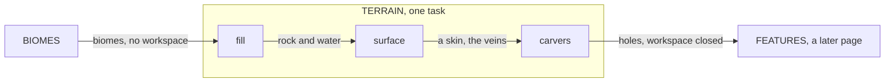
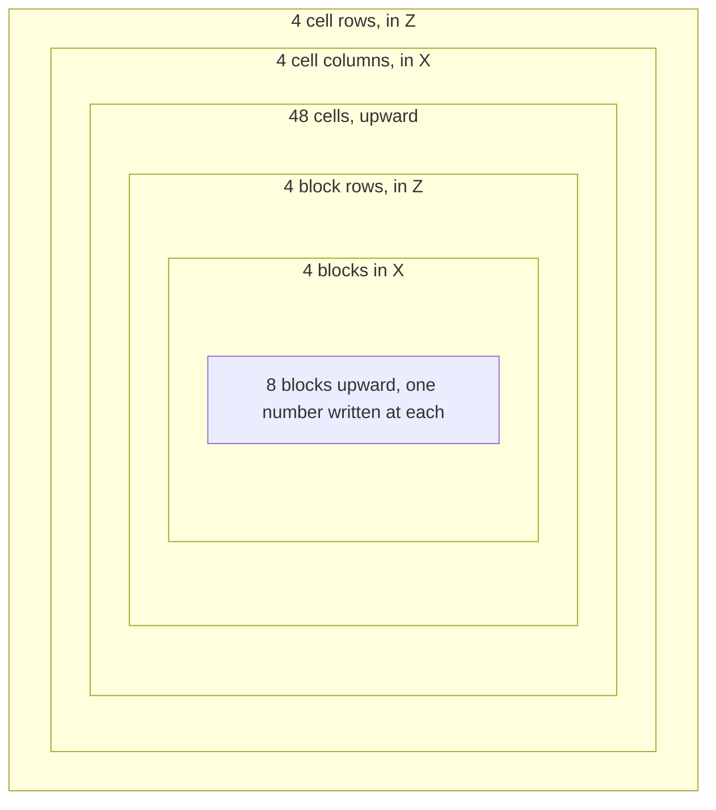

# Terrain

> Verified against **Minecraft 26.3** · Part XII · One chunk's rock: seven hundred and sixty-eight cells filled from their corners, a water table decided before the caves are cut, and the cave that fills with water because of it.

You dig into a cave and it is flooded. The water is not a fluid that flowed
in and settled; nothing flowed anywhere. Before the cave existed, while the
chunk was still solid stone, something decided that a point at that depth in
that column belongs to water rather than to air — and when the hole the carver marked out came to be filled, the aquifer gave the same answer. **A carver does not choose the block it carves.** It chooses
the *shape*; the `Aquifer` chooses the material, and it chose it for the
stone as well.

This page is one chunk status, `ChunkStatus.TERRAIN`, and the three steps
inside it that turn a scalar field into blocks — the noise fill, the surface
pass and the carvers — which share one workspace for as long as the status's
one task runs.
The conveyor that runs the statuses, the dependency pyramid and the
threading are [the chunk generation
pipeline](../world/chunk-generation-pipeline.md#the-pyramid-drawn) in Part IV;
this is the
cargo. The scalar field itself is [density
functions](density-functions.md#three-forms-of-one-graph), and the labels that
steer the surface pass are [biomes](biomes.md#deciding-a-chunks-biomes-cell-by-cell).

## The cast

| class | what it decides | when |
|---|---|---|
| `ChunkGenerator` | the API the status calls — `ChunkGenerator.buildTerrain`, one call for all three steps. `ChunkGenerators.bootstrap` registers exactly three implementations | worldgen executor |
| `NoiseGeneratorSettings` | the per-dimension recipe: the `NoiseSettings` floor and height, the default block and fluid, the `NoiseRouter`, the material rule, the sea level, and the aquifer's own functions where there is one | data, loaded with the world |
| `NoiseChunk` | the per-chunk workspace — the chunk's `DensityVolume`, the samplers that carry its caches, the `Aquifer` | built when the terrain task starts, closed when it ends; a height query builds a one-column one of its own |
| `InterpolatedFunction` | the cell: its input sampled at the corners, every block between them interpolated | whenever the graph is sampled |
| `Aquifer` | what liquid, if any, belongs at a point — and therefore what a carved hole is filled with | fill *and* carving |
| `OreVeinRule` | copper or iron, from the sign of one function | the surface step: in the overworld's tree, after the bedrock floor and before any surface rule |
| `MaterialSystem` | the column re-skin: grass over dirt over stone, sand, the badlands bands, the ore veins | the surface step and the carvers' re-skin, one instance per level |
| `WorldCarver` | the shape of caves and canyons, and nothing about their contents | the carver step |

Everything here starts on the worldgen executor, and for this generator the
whole status fans out from it: `NoiseBasedChunkGenerator.buildTerrain` hands
the fill, the surface pass and the carvers to the [worker pool](../../reference/threads.md#the-threads-a-lecture-leans-on) as one task
([which steps fork, and why the parallelism is smaller than the thread
names](../world/chunk-generation-pipeline.md#dispatch-and-why-the-parallelism-is-smaller-than-the-thread-names)).
What is worth carrying from that into this page is one object.
`RandomState` — the per-level seed root — is built once in `ChunkMap` and
shared by every generating chunk, and it owns the `MaterialSystem`, which is
therefore per **level**, not per chunk.

## Three steps, and what each hands on

```mermaid
flowchart LR
    BIO["BIOMES"]
    subgraph TER["TERRAIN, one task"]
    FIL["fill"] -- "rock and water" --> SUR["surface"]
    SUR -- "a skin, the veins" --> CAR["carvers"]
    end
    FEA["FEATURES, a later page"]
    BIO -- "biomes, no workspace" --> FIL
    CAR -- "holes, workspace closed" --> FEA
```

*The terrain status is one task: the three steps inside it share one `NoiseChunk`, built when the task starts and closed when it ends, and the last box belongs to a later page.*

The frame is the point. **The three steps are one job.**
`ChunkStatusTasks.buildTerrain` builds a `Blender` for the chunk's
neighbourhood and hands it, with the region, to
`NoiseBasedChunkGenerator.buildTerrain`, which runs the fill, the surface pass
and the carvers back to back as one task. The workspace is born at the start
of that task, when `NoiseBasedChunkGenerator.createNoiseChunk` gives it the
chunk's `DensityVolume`, samplers that carry the chunk's caches, and an
`Aquifer`, and it dies at the end, when `NoiseChunk.close` hands its density
buffers back to `RandomState`. The biome step before it builds none of this:
it samples the climate through a caching sampler of its own
([biomes](biomes.md#deciding-a-chunks-biomes-cell-by-cell)). Two passengers
ride in on the workspace, and both are things this page's terrain is bent by
rather than things it decides.

The **beardifier** is one of them: a *beardifier* node in the final density's
own data, which reads zero unless the sampling context holds a `Beardifier` —
and `NoiseBasedChunkGenerator.createNoiseChunk` puts one there for this chunk,
built by `Beardifier.forStructuresInChunk`
([wrap: once per chunk](density-functions.md#wrap-once-per-chunk)). Because it
is built with the workspace, a structure has bent the density field before the
field is ever sampled — the flat shelf under a village is a number added to a
scalar field, not a block edit made afterwards. What that term's shape is —
`Beardifier.Rigid` boxes, junctions at half weight, and the five
`TerrainAdjustment` modes — belongs to [structure placement](structure-placement.md#the-ground-bends-before-the-ground-exists).
A structure asking how high the ground is gets the answer from *before* it bent
anything: `NoiseBasedChunkGenerator.iterateNoiseColumn`, behind
`ChunkGenerator.getBaseHeight` and `ChunkGenerator.getBaseColumn`, builds a
throwaway `NoiseChunk` one block wide with an empty `Blender` and no
`Beardifier` at all, samples a column, and closes it.

The **blender** is the other, and it is why an empty one appears in that
sentence. `Blender` reads measurements harvested from chunks an older version
generated and enters the density graph as three nodes. The one that reaches the
graph is the one `ChunkStatusTasks.buildTerrain` builds with `Blender.of` for
this task, which `NoiseChunk` puts in the sampling context beside the
beardifier; the one the biome step builds bends only the biome resolver
([blending at the old-chunk border](blending.md#following-one-chunk-through)).
`BelowZeroRetrogen`, the world-deepening path, rides the same hooks: it wraps
the biome resolver, patches bedrock after the terrain step, and gates the spawn step ([blending's other passenger](blending.md#the-other-passenger)).

That one workspace then serves all three steps, so the carving step reuses what the aquifer has already worked out: the water tables it computes on its grid, and the surface levels it caches, are still there when the carved holes are filled — and since each is fixed by the seed, the position and, beside an old chunk, the blender, they would come out the same if they were not. The surface pass
samples the preliminary surface and the ore veins through the same samplers
and their caches ([the one cache, and what a single point may use](density-functions.md#the-one-cache-and-what-a-single-point-may-use)),
and nothing is pinned to a thread: the three steps run back to back inside
one task on one worker, so program order is all that serialises them.

## Filling the noise: six loops, one number at the bottom

The fill asks for the whole chunk in one call.
`NoiseBasedChunkGenerator.doFill` has the workspace's samplers sample the
router's final density over the chunk's `DensityVolume` — sixteen by 384 by
sixteen blocks in the overworld — and gets back one buffer holding a number
for every block. The cells are inside that call. `NoiseSettings` holds only a
floor and a height; the cell size belongs to the *interpolated* node in the
final density, and the overworld's asks for four blocks across and eight up.
So the unit of overworld terrain is a cell **four blocks wide, four deep and
eight tall**, and a chunk is four by four by forty-eight of them.

**768 cells** make one overworld chunk, each holding 128 blocks (`InterpolatedFunction`).

An *interpolated* node samples its input at cell **corners** only. Everything
inside a cell is three linear interpolations away from the eight corners
around it, and the walk that does this is six loops deep:

```mermaid
flowchart TD
    subgraph CZ["4 cell rows, in Z"]
    subgraph CX["4 cell columns, in X"]
    subgraph CY["48 cells, upward"]
    subgraph BZ["4 block rows, in Z"]
    subgraph BX["4 blocks in X"]
    BY["8 blocks upward, one number written at each"]
    end
    end
    end
    end
    end
```

*Six loops, and none of them samples the graph: every corner was sampled in one call before the first, and everything nested inside is interpolation.*

| loop | runs | what it does |
|---|---:|---|
| cell row, in Z | 4 | nothing but advance |
| cell column, in X | 4 | reads the four corners at the column's foot |
| cell, Y upward | 48 | reads the four corners above, which become the next cell's floor |
| block row, in Z | 4 | four interpolations in Z |
| block, in X | 4 | two more in X, and the step from block to block in Y |
| block, Y upward | 8 | one addition, one number written |

Read the nesting as the cost model. Every corner is sampled once, in the one
volume call made before the first loop, and nothing below it evaluates the
graph again: each cell reads four new corners and inherits four, and every
block inside it is arithmetic on eight numbers. The counts go up by one in
each direction when you move from cells to their corners: four by four by
forty-eight cells have five by five by forty-nine corners between them:

**1,225 corner samples** per chunk for each four-by-eight *interpolated* term the fill reads (`InterpolatedFunction`, one volume of five by forty-nine by five).

**Six interpolated terms** sit in the overworld router, resolved through every reference: one round the bulk of the final density, four inside the
noodle-cave graph, and one in *chunk_surface_level*, whose cell is a whole
chunk wide and one block tall. The fill reads the first five; the sixth is the
surface pass's, and the ore veins bring three more of their own. Neither the
veins' gap nor the aquifer's barrier is interpolated: the vein rule and the
`Aquifer` sample each block by block, and only where they need it. Everything
else is sampled at the resolution of the volume it is asked for, less any axis
it does not depend on — a term that ignores *Y* is sampled once per column ([the one cache, and what a single point may use](density-functions.md#the-one-cache-and-what-a-single-point-may-use)).

Then `NoiseBasedChunkGenerator.doFill` walks the finished buffer block by
block — Z, then X, then Y **downward** — and hands each number to the aquifer.
The two worldgen heightmaps are updated as those blocks are written, so walking down, a column's height for each map is settled by the first block that counts for it.

The write at the bottom of that walk skips air entirely — a chunk starts empty,
so only non-air is ever written — and updates
`Heightmap.Types.OCEAN_FLOOR_WG` and `Heightmap.Types.WORLD_SURFACE_WG` by
hand rather than through the chunk's ordinary write path. It can, because it
holds every section across its noise range for the whole fill
([what placing a block actually does](../world/chunk-anatomy.md#what-placing-a-block-actually-does)).

Those two stop being maintained once this status completes, and not because
anything stops writing them: which maps are live is a property of the
**status**, not of the step — the two *_WG* maps up to `ChunkStatus.BIOMES`,
the status the chunk still holds while all three steps run, and the four final
ones from `ChunkStatus.TERRAIN` on, primed by `Heightmap.primeHeightmaps` as
the terrain task ends
([the six heightmaps](../world/chunk-anatomy.md#the-six-heightmaps)). A chunk
saved mid-generation really does persist the pair the fill was keeping.

## The aquifer: what the number becomes

`NoiseBasedChunkGenerator.doFill` does not read the density and compare it
to zero. It hands the number to `Aquifer.computeSubstance` and writes what
comes back, and the aquifer is the only thing the number meets.

**The aquifer.** `Aquifer.computeSubstance` receives the final density and
decides, from four noises of its own — a barrier it samples block by block,
and floodedness, spread and lava, which it samples on coarse grids — whether
this point is stone, air, or a fluid. None of them is read from the router:
the noise settings carry an `Aquifer.Config` of six functions, those four, an *exclusion* that forbids a local water table in any aquifer cell where it is positive, and *surface_level* — which the overworld points at its *preliminary_surface_level* function — which it samples once per four-by-four column to
know roughly where the ground is before any ground exists.
`Aquifer.FluidPicker` is the global fallback underneath its local water tables — the sea, and the lava — and `Aquifer.FluidStatus` is the record of any one table, local or global. `Aquifer.NoiseBasedAquifer` is the real
implementation; a dimension with aquifers switched off gets a trivial one.

**The ore veins** are not decided here at all. `OreVeinRule` is a material
rule, and the overworld's rule tree tries its two veins, copper then iron, after its bedrock floor and ahead of every surface rule, so the surface pass writes them into the stone
the fill left. That is why copper and iron veins are *terrain rather than
decoration*: they exist before the carvers, and no feature places them. Every
other ore in the game is an `AbstractOreFeature` placed at
`ChunkStatus.FEATURES`
([features and placement](features-and-placement.md#what-a-feature-may-write-and-where-it-may-read)).
Which of the two veins you get is the **sign** of one function,
*ore_vein/toggle* — copper's density reads it as it is and iron's reads it
negated — and there is no separate "which ore" noise.

If the aquifer returns nothing, the block becomes the settings' default
block.

## The surface pass, and the two places it breaks its own rule

`MaterialSystem.buildSurface` compiles the **dimension's**
`NoiseGeneratorSettings.materialRule` tree once for the whole chunk — one rule
tree per dimension, which then branches on biome inside itself, then walks each of the 256 columns downward
from the worldgen surface heightmap, tracking depth below stone and water
height in a `MaterialRuleContext` that carries its own caches. Every block
that is neither air nor fluid is offered to the tree, and the first rule that
answers is written: fluid is measured, never offered, and the overworld's tree tries the ore veins, after its bedrock floor, before any surface rule, which is what makes aquifer water
and ore veins immune to being turned into grass.

That rule tree is itself two registries of data-driven types, with files of
their own that the noise settings name by id — `MaterialRule` for what to
write and `MaterialCondition` for when, each dispatched on a type id like any
other ([the data-driven type
pattern](../foundations/data-driven-types.md#the-idea-stated-once)) — so a pack composes a surface out of the shipped condition types and cannot write a new kind of condition. The biome the tree branches on is the *jittered* read,
`BiomeManager.getBiome`, not the palette's exact one
([the two borders](biomes.md#the-two-borders)), which is why a surface rule
can change block for block along the same ragged line the grass colour does.

Almost none of this runs in a superflat world. `FlatLevelSource` lays its
layers at the terrain status and `DebugLevelSource` writes nothing there —
neither has a surface pass or carvers, both make spawning a no-op, and
`DebugLevelSource` writes its state grid at the decoration step instead —
so of the three `ChunkGenerators.bootstrap` registers, two skip
most of this page. Debug flags can switch off much more: `SharedConstants` carries flags, set from JVM system properties in any build, that disable the surface pass, the carvers,
the ore veins and every aquifer's water and lava outright.

Two things sit outside the rule tree entirely, and neither asks it.
`MaterialSystem.erodedBadlandsExtension` runs *before* the column walk
and fills air with the default block to raise the terracotta pillars.
`MaterialSystem.frozenOceanExtension` runs *after* it and writes snow and
packed ice over air **and over water**. Both are selected by biome
rather than by rule, and `MaterialSystem` holds the noises they need along with the one that offsets the badlands bands and the two behind the surface depth the conditions read; a noise-threshold condition asks `RandomState` for its own.

## Carving, and who chooses the block

`NoiseBasedChunkGenerator.generateCarvers` does not carve the chunk it was
given from the chunk it was given. It loops over a **17×17 neighbourhood of
source chunks**, asks each carver of that source chunk's biome whether a cave
or a canyon *starts* there, and has whatever does mark its shape into the
centre chunk. That reach costs the dependency pyramid nothing: the neighbours
are read only as memo holders for `ChunkAccess.carverBiome`, and the biome
itself is recomputed from the biome source. The reach is already paid for,
because every generation step from `ChunkStatus.STRUCTURE_REFERENCES` to
`ChunkStatus.FEATURES` asks for structure starts eight chunks out anyway
([the pyramid, drawn](../world/chunk-generation-pipeline.md#the-pyramid-drawn)).

Two carver types are **registered** by `WorldCarverTypes.bootstrap` — *cave*
and *canyon*, which are `CaveWorldCarver` and `CanyonWorldCarver` — and four
carvers **ship**, because the cave type is configured three times: once for
the surface caves, once for a deeper set, and once for the Nether. Each is a
record carrying its own parameters, and its codec is the data-pack half: no
configuration class stands between carver and file. None of them touches a
block. A carver is handed a `WorldGenerationContext` for its heights and a
`CarverOutput` to mark, and what it marks lands in a `CarvingMask`, a bit set
that lives for one terrain task and is never saved.

And then the hook. When every source chunk has had its say,
`NoiseBasedChunkGenerator.applyCarvingMask` walks the mask's carved runs, each top down, and asks `Aquifer.computeSubstance` with a density of
**zero** what belongs at each marked block. `Aquifer.FluidStatus.at`
answers plain air above the local water table and the fluid below it — never
null; the null is `Aquifer.computeSubstance`'s own, and it means *do not carve
here at all*. So the water in a flooded cave
was decided by the same object that decided the water in the stone around
it, and a dry cave is air written one block at a time because the aquifer
said so. What kind of block a cave may not eat through is decided by one tag, *uncarvable*
(`BlockTags.UNCARVABLE`), which ships holding bedrock alone, so a cave cuts
through the ore veins and the surface skin alike. If a grass or mycelium
block was passed on the way down, the dirt below is re-skinned through
`MaterialSystem.topMaterial`.

The Nether follows the same rule. Its *nether_cave* is the cave type with
other numbers, and its holes are filled by the same question, put to the
trivial aquifer a dimension with aquifers switched off gets — which answers
from the global fluid picker alone: lava, the Nether's default fluid, below
its sea level of 32, and air above.

The seeding is one thing a data pack cannot reach here.
`NoiseBasedChunkGenerator.generateCarvers` hardcodes a `LegacyRandomSource`
whatever the settings say, so switching a dimension to the modern random family
does not move a single cave. That setting,
`NoiseGeneratorSettings.useLegacyRandomSource`, does reach past the level's root
random in one other way: it re-seeds `BlendedNoise`.

## Questions players ask

**Why is there always lava at the same depth, in every world?** Because the
two levels are anchored to different things. The sea level is a field of the
noise settings and moves with them; the lava floor is not in the settings at all.
`NoiseBasedChunkGenerator.createFluidPicker` builds the global fluid picker
every aquifer falls back to, and it answers lava below Y −54 — or below the
sea, where the sea is lower still — and the sea above. So the lava floor under
every overworld cave, carved or not, is one fixed height rather than a depth
below the sea, and a data pack moves it only through the sea: by sinking the sea beneath it, or by making the settings' default fluid lava.

**Why is the water in a cave already settled when I break into it?** Because it was decided before the cave was, and placed as still water. `Aquifer` flags only the fluid it places near the border between two aquifer cells, and there only where it could flow — where the cells' tables differ, in height or fluid or because one is dry, or where water sits directly on the lava floor — and the fill and the carving step record those positions for post-processing, so those few flow for real when the chunk starts ticking ([what the chunk goes on holding](../world/chunk-anatomy.md#what-step-11-leaves-behind-and-what-the-chunk-goes-on-holding)).
"Nothing flowed in" is a true statement about worldgen and not about the
chunk's first tick as part of a live world.

> **For a 1.21-era reader.** *NOISE*, *SURFACE* and *CARVERS* are one status,
> `ChunkStatus.TERRAIN`, and the cell loop `NoiseChunk` ran is
> `InterpolatedFunction`'s. *SurfaceSystem* is `MaterialSystem`, and
> *SurfaceRules* are `MaterialRule` and `MaterialCondition`, with the ore
> veins among them as `OreVeinRule`; *OreVeinifier* is gone.
> *ConfiguredWorldCarver* and the carver configurations are gone — a carver is
> a record that carries its parameters — and *NetherWorldCarver* is gone, the
> Nether's caves being the cave carver with other numbers.

## Where to look

`NoiseBasedChunkGenerator` is the page in one class:
`NoiseBasedChunkGenerator.buildTerrain` is the status, and
`NoiseBasedChunkGenerator.doFill`, `NoiseBasedChunkGenerator.buildSurface`
and `NoiseBasedChunkGenerator.generateCarvers` are its three steps; reading
them in that order is the trace. Under the first, `NoiseChunk` is the
workspace and `InterpolatedFunction` the six loops, and
`Aquifer.computeSubstance` is the decision at the bottom of the write walk and
repays being read twice, because the carving step calls it too.
`MaterialSystem.buildSurface` is the column walk, and `MaterialRule` beside
`MaterialCondition` is the data-pack half of it, with `OreVeinRule` for the
veins. Then `NoiseBasedChunkGenerator.applyCarvingMask`, which is the sentence
this page is built around, with `CaveWorldCarver` for the shape.
`NoiseGeneratorSettings` is worth opening once to see how much of all this is
data. Two doors the page does not open: `MaterialRuleContext`, for what a rule
may read, and `OreVeinRule.compile`, for a vein in full.

---

*Rules: names, never code · how the system works, not how the code reads ·
newest version only · every backticked name passes `tools/verify_names.py`.*
