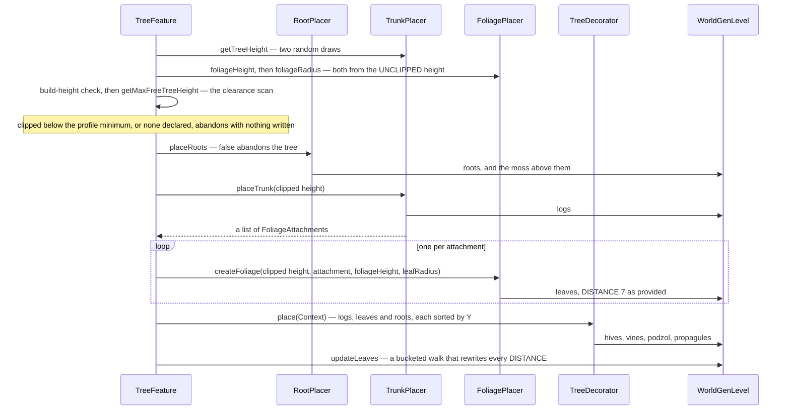

# Trees

> Verified against **Minecraft 26.2** · Part XII · One sapling grows: five pluggable parts over one algorithm, a ceiling that shortens the trunk and not the crown, and the dark-oak sapling that will never grow on its own.

Plant a single dark-oak sapling, feed it bone meal until you run out, and
nothing happens. Nothing is wrong with the sapling; there is simply no tree
for it to become. `TreeGrower` holds up to six configured features per
species — a normal tree and a mega tree, each with a secondary variant, plus
two flowering variants — and `TreeGrower.DARK_OAK` fills in exactly one of
them, the mega tree. The single-sapling slot is left empty, and
`TreeGrower.growTree` finds nothing to place. **The best-known growth rule in
the game is implemented as an absence.**

Which is a good introduction to this page, because the whole tree kit works
like that: sixty-odd trees are one algorithm, `TreeFeature`, with five slots
in it, and almost everything you can say about how a cherry differs from a
mangrove is a statement about what is in the slots.
[Features and placement](features-and-placement.md) is how a tree gets a
position and whether it is attempted at all; this is what happens after
`Feature.place` is entered.

## The cast

| class | its slot | what varies |
|---|---|---|
| `TreeFeature` | the algorithm — *final*, one implementation, no subclasses | nothing |
| `TreeConfiguration` | nine fields: five of them are the parts below, three are `BlockStateProvider`s (trunk, foliage, and the dirt column laid under the trunk) and one is the *ignore vines* flag | everything |
| `TrunkPlacer` | writes the logs, returns where crowns hang | 9 registered types |
| `FoliagePlacer` | writes the leaves around one attachment | 11 registered types |
| `RootPlacer` | writes roots, and may lift the trunk off the ground | **1** registered type |
| `FeatureSize` | the clearance profile — a horizontal radius per height | 2 registered types |
| `TreeDecorator` | runs afterwards over what was placed | 10 registered types |
| `FoliagePlacer.FoliageAttachment` | the only channel from trunk to crown: a position, a signed radius nudge, and *is the trunk under me two-by-two* | — |

Every one of those five is a codec-dispatched type in a built-in registry, so
a data pack composes trees freely and cannot add a new *kind* of placer
([the data-driven type pattern](../foundations/data-driven-types.md)).

## One algorithm, five slots

Four things in that diagram are the page's real content.

**The crown is sized before the ceiling is measured.** `TreeFeature` samples
the trunk placer's proposed height, derives the foliage height and the leaf
radius from *that* number, and only then runs the clearance scan. The scan's
answer, the *clipped* height, is what `TrunkPlacer.placeTrunk` and
`FoliagePlacer.createFoliage` both receive — and every one of the eleven
foliage placers ignores that argument. So a fancy oak that proposed fourteen
blocks and is clipped to six grows a six-block trunk with a
fourteen-block-tree's crown on it. The top-heavy trees under overhangs are
this asymmetry.

**Clipping usually kills the tree instead.** `FeatureSize.minClippedHeight`
is the only thing that permits a clipped tree at all, and in vanilla exactly
one tree declares it: the fancy oak, at four. Every other species abandons
itself the moment the scan comes back short. The scan returns *two below* the
first blocked layer, so an obstruction at head height yields a negative
number and nothing survives it.

**The scan asks the trunk placer what "free" means, not the feature size.**
`FeatureSize` supplies only the radius to test.
`TrunkPlacer.isFree` is air, anything in the replaceable-by-trees tag, **or
an existing log** — which is how a new tree grows up through an old one — and
it delegates to a *virtual* `TrunkPlacer.validTreePos`, so
`UpwardsBranchingTrunkPlacer` quietly widens the definition with its own
*can grow through* block set. A vine anywhere in the scanned column also
fails, unless the configuration sets `TreeConfiguration.ignoreVines`.

**Nothing rolls back.** There are three places a tree can abandon itself —
the build-height check, the clipped-height check, and `RootPlacer.placeRoots`
returning false — and all three happen before a single block is written.
After `TrunkPlacer.placeTrunk` begins there is no undo, and `TreeFeature`
reports success even for a tree that was truncated to a stump.

## The nine trunk placers

The base contract is three numbers — `TrunkPlacer.getTreeHeight` is a base
height plus two independent random draws — and one method that writes logs
and returns attachments.

| type | how it differs |
|---|---|
| `StraightTrunkPlacer` | one column, one attachment one block *above* the top log |
| `ForkingTrunkPlacer` | leans near the top, then grows a side branch in a second random direction — and if that direction happens to equal the first, the branch is skipped and the draw is spent anyway. The main fork's attachment carries a radius nudge of +1 |
| `GiantTrunkPlacer` | a 2×2 column, four dirt blocks beneath it, and only the (0,0) column placed on the very top layer. Its attachment is the one that sets *double trunk* |
| `MegaJungleTrunkPlacer` | the giant trunk, plus side branches laid along a random angle every few levels, each attachment nudged **−2** |
| `DarkOakTrunkPlacer` | a leaning 2×2 trunk whose lean is two minus a draw from three and is therefore usually nothing at all, plus a ring of downward log stubs on a one-in-three roll per position — placed relative to the *original* trunk, not the leaned one. Its main attachment sits on the top log rather than above it |
| `FancyTrunkPlacer` | see below |
| `BendingTrunkPlacer` | rises, nudges once, then walks *horizontally* for a sampled bend length — and emits an attachment at every position along the whole arc, including ones where the log was not placed |
| `UpwardsBranchingTrunkPlacer` | a straight column that rolls a probability after each log and, on success, runs a diagonal staircase branch outward, attaching foliage at every branch log. The one placer that widens what counts as free |
| `CherryTrunkPlacer` | one to three branches that random-walk toward a computed endpoint, choosing vertical or horizontal per step by the remaining ratio, with the log axis rotated sideways for the horizontal runs. It derives a **fourth branch-height provider in its constructor that no codec ever sees**, which is why the codec insists the declared range spans at least two blocks |

`FancyTrunkPlacer` is the one worth watching, because it is the only placer
that plans before it writes. It works out a crown position per level from a
circle equation, then walks the line from trunk to crown *twice*: once with
placement switched off, purely to ask whether every block on the way is free,
and again for real only if it was. A branch whose base has slid below the
trunk top is clamped, which is the whole "branches slope down as they go out"
look. And it carries one computation that cannot do anything:

**One** — crown candidates a fancy oak tries per level, always, because the
count is a minimum against one, over an expression that is never below one
(`FancyTrunkPlacer`). The named density constant it multiplies has no effect
on any tree of any height.

## The eleven foliage placers

A foliage placer gets one attachment and three numbers — a height, a radius,
and an offset it samples itself — and its two real degrees of freedom are how
the radius changes with height and which positions inside a row it *skips*.

| type | how it differs |
|---|---|
| `BlobFoliagePlacer` | the plain oak blob: radius tapers by half the row index, corners clipped on a coin flip and always clipped on the widest row |
| `FancyFoliagePlacer` | the blob's subclass, but the skip test is a genuine circle rather than a corner roll |
| `BushFoliagePlacer` | the blob with a much steeper taper — the full row index, not half of it |
| `SpruceFoliagePlacer` | the saw-tooth: a radius that grows a block per row and resets to nothing whenever it reaches a ceiling that is itself climbing. The only placer whose row loop is bounded by the foliage height alone rather than the offset |
| `PineFoliagePlacer` | one cone, and the only placer that overrides `FoliagePlacer.foliageRadius` — it adds a draw scaled by the trunk height on top of the configured radius |
| `AcaciaFoliagePlacer` | not a loop at all: three explicit rows, with a cross cut through the flat plate. Its declared foliage height is a constant zero |
| `DarkOakFoliagePlacer` | three or four explicit rows, wider when the trunk is 2×2, and **the only placer that overrides the signed skip test** — it removes the four true corners of the widest row before the signed-to-absolute fold can hide them |
| `MegaJungleFoliagePlacer` | registered as *jungle_foliage_placer*, not *mega_jungle*. A circle plus a hard Manhattan cap that skips anything seven or more blocks out |
| `MegaPineFoliagePlacer` | the only one that iterates absolute world Y, so it can make its taper jagged by widening every other row |
| `RandomSpreadFoliagePlacer` | **never places a row.** It fires a configured number of shots at a box, each coordinate the difference of two draws, so the leaves cluster toward the attachment and thin out. Its skip test is unreachable dead code, and it ignores the offset the base class sampled for it |
| `CherryFoliagePlacer` | two narrowing cap rows, a stack of full-radius rows, then the only two uses of the hanging-leaves row helper. It punches probabilistic holes: an edge hole on the bottom row, and on wide rows an unconditional corner removal plus a probabilistic diagonal band |

Two of the contract's parameters are dead in all eleven implementations:
`FoliagePlacer.createFoliage`'s tree height, and the `TreeConfiguration` that
`FoliagePlacer.foliageHeight` receives. Nobody reads either.

## Roots, and the tree that plants itself by failing

`RootPlacerType` registers one type. `MangroveRootPlacer` is the only root
placer in the game, and the base class exists for it: `RootPlacer.trunkOffsetY`
is what lifts a mangrove's trunk one to three blocks clear of the mud, and
`AboveRootPlacement` is the moss carpet that lands on top of a root.

It simulates the whole root system before writing anything. Starting from the
trunk position it recurses outward in each of the four horizontal directions;
each step's candidates are *straight down*, *sideways*, or both, depending on
how far out the walk already is and a skew roll. The termination rule reads
backwards: the recursion returns **true only when it has run out of
placeable candidates**, and reaching the maximum root length returns false —
which propagates all the way out and abandons the tree. A mangrove is
therefore planted only where its roots find solid ground before they run out
of length.

One asymmetry inside it: a root that lands in mud is written from the muddy
provider instead, and that branch skips the base implementation entirely — so
**muddy mangrove roots never get their moss carpet.**

## The decorators, and the pass that undoes half of them

`TreeFeature` accumulates four sets as it writes — roots, logs, leaves and
decorations — and hands the first three to each `TreeDecorator` as a
`TreeDecorator.Context`, which sorts all three **ascending by Y**. That sort
is the reason four different decorators can say "the lowest log" and mean it.
A decorator returns nothing, so one that finds no valid spot is
indistinguishable from one that succeeded.

Ten types, in four groups. The ones that hang things off the tree are
`TrunkVineDecorator` and `LeaveVineDecorator` (vine curtains),
`PaleMossDecorator`, `CocoaDecorator` and `AttachedToLeavesDecorator` — that
last one blacklists an exclusion box around each placement so the propagules
cannot crowd each other. The ones that *change* a block already placed are
`CreakingHeartDecorator`, which converts the first log completely surrounded
by other logs, and `BeehiveDecorator`, which places a nest and populates its
block entity with two or three bees on the spot
([block entities](../blocks/block-entities.md)). The ones that write on the
ground around the tree are `AlterGroundDecorator` (the podzol discs under a
mega spruce, which reach several blocks beyond the trunk) and
`PlaceOnGroundDecorator` (leaf litter, over an inflated box). And
`AttachedToLogsDecorator` is used by `FallenTreeFeature` rather than by trees.

Then the last step, and it is the one that reaches furthest.
`TreeFeature.updateLeaves` runs a bucketed breadth-first walk out from the
**log** set and rewrites `BlockStateProperties.DISTANCE` on every block in
the tree's bounding box that has that property. Three consequences follow,
and all three are visible in game. A neighbouring tree's leaves caught inside
the box get rewritten too. Blocks in the prevents-nearby-decay tag report
distance zero and act as extra roots for the walk. And the decoration and
root sets are marked as *occupied* before the walk starts, so a
decorator-placed block or a mangrove root **blocks leaf-distance propagation
through itself**. Anything the walk cannot reach within six steps keeps the
`BlockStateProperties.DISTANCE` of 7 the foliage provider gave it — already decaying — and falls
apart on its first random tick.

## Five species, side by side

| | trunk | foliage | roots | clearance | decorators |
|---|---|---|---|---|---|
| oak | straight, 4 + two draws | blob, radius 2 | — | two layers | — |
| fancy oak | fancy, base 3 | fancy, radius 2, offset **4** | — | two layers, min clipped **4** | — |
| dark oak | dark oak, 6 + draws | dark oak, radius **0** — all the width is hardcoded in the placer | — | three layers | — (pale oak adds moss, and a creaking heart) |
| cherry | cherry, 7, one to three branches | cherry, radius 4, four hole probabilities | — | two layers | — (a 5% bee-nest variant exists) |
| mangrove | upwards branching, per-log branch probability | random spread, 70 shots | mangrove, trunk lifted 1–3 | two layers | vines, propagules, a 1% bee nest |

The columns nobody expects to matter are where the personality lives: dark
oak's configured leaf radius is *zero*, and mangrove's foliage placer is the
one that does not place rows.

## Questions players ask

**Why does a bone-mealed oak sometimes come out enormous?** Because
`TreeGrower` picks between two configured features on a probability — a plain
oak most of the time, a fancy oak one time in ten — and separately checks for
a flower within a 5×3×5 box, which swaps in the bee-nest variants. The same
mechanism is why a spruce sapling grown as a 2×2 is a mega pine half the time
rather than a mega spruce.

**Why does a player-grown pale oak have no creaking heart?**
`TreeGrower.PALE_OAK`'s mega tree is the *bone-meal* variant of the
configured feature, which is the one with no decorators on it at all. The
moss and the heart only arrive on a worldgen pale oak.

**Why does a mangrove propagule grow underwater?** Sapling growth is the
other entry into this machine and it hand-manages the sapling block: for the
single-sapling path it replaces the sapling with whatever the fluid there
would be, so a waterlogged propagule grows into water. The 2×2 path is
stranger — it clears all four saplings with no-update writes and puts them
back if the feature fails.

**Do leaves know which tree they came from?** No. Nothing in the placed tree
records its species; the only per-block state is `BlockStateProperties.DISTANCE` and
`BlockStateProperties.WATERLOGGED`, and both are set from what was already in the world at that
position. `FoliagePlacer.tryPlaceLeaf` also refuses to overwrite a leaf a
player placed, by testing the persistent flag.

**Is any of this shared with the rest of decoration?** The clearance idea,
no — it is `TreeFeature`'s alone. But the four *setter* consumers,
the sets they fill and the final shape update are the same machinery
`StructureTemplate` uses to fix block shapes at the edge of a placed
structure, and every block a tree writes goes in with the same flags: update
neighbours, update clients, and *known shape*
([blocks and states](../blocks/blocks-and-states.md)).

## Where to look

`TreeFeature.place` · `TreeConfiguration` ·
`TreeConfiguration.TreeConfigurationBuilder` · `TrunkPlacer.placeTrunk` ·
`TrunkPlacer.getTreeHeight` · `TrunkPlacer.isFree` ·
`FancyTrunkPlacer` · `CherryTrunkPlacer` ·
`UpwardsBranchingTrunkPlacer` · `FoliagePlacer.createFoliage` ·
`FoliagePlacer.shouldSkipLocation` · `FoliagePlacer.FoliageAttachment` ·
`FoliagePlacer.tryPlaceLeaf` · `RandomSpreadFoliagePlacer` ·
`DarkOakFoliagePlacer` · `MangroveRootPlacer.placeRoots` ·
`MangroveRootPlacement` · `FeatureSize.getSizeAtHeight` ·
`TwoLayersFeatureSize` · `ThreeLayersFeatureSize` ·
`TreeDecorator.Context` · `BeehiveDecorator` · `AlterGroundDecorator` ·
`TreeFeatures` · `TreeGrower.growTree` · `SaplingBlock.advanceTree`

---

*Rules: names, never code · how the system works, not how the code reads ·
newest version only · every backticked name passes `tools/verify_names.py`.*
