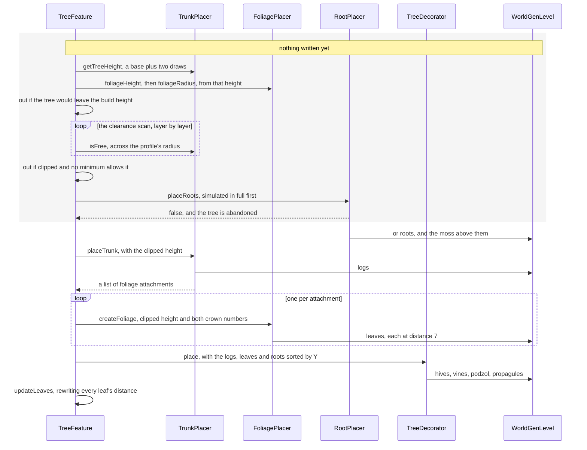

# Trees

> Verified against **Minecraft 26.3** · Part XII · One sapling grows: five pluggable parts over one algorithm, a ceiling the crown's size was decided before, and the dark-oak sapling that will never grow on its own.

Plant a single dark-oak sapling, try to feed it bone meal, and nothing
happens: the bone meal is not even spent, and left alone the sapling never
grows. Nothing is wrong with the sapling; there is simply no tree for it to
become. `TreeGrower` holds three weighted lists of features per species — the
trees a single sapling can become, the mega trees a 2×2 of them can become,
and a list that stands in for the first when a flower is near — and
`TreeGrower.DARK_OAK` fills in exactly one of them, the mega trees. The
single-sapling list is left empty, so `TreeGrower.growTree` finds nothing to
place, and `TreeGrower.canGrow`, which bone meal asks first, reads the same
empty list as a refusal unless the sapling is part of a 2×2. **The best-known
growth rule in the game is implemented as an absence.**

Which is a good introduction to this page, because the whole tree kit works
like that: the forty-five shipped features that are a `TreeFeature` are one
algorithm with five slots
in it, and almost everything you can say about how a cherry differs from a
mangrove is a statement about what is in the slots. (`TreeFeatures` declares
fifty-seven keys, because it also holds the fallen trees, the huge mushrooms
and the huge fungi, none of which is a `TreeFeature`.)
[Features and placement](features-and-placement.md#one-chunks-decoration-from-the-corner-outward)
is how a tree gets a
position and whether it is attempted at all; this is what happens after
`Feature.place` is entered.

## The cast

| class | its slot | what varies |
|---|---|---|
| `TreeFeature` | the algorithm — a record, so *final*, one implementation, no subclasses — and the nine fields it runs on: five of them are the parts below, three hold `BlockStateProvider`s ([features and placement](features-and-placement.md#what-a-feature-may-write-and-where-it-may-read)) for the trunk, the foliage and the dirt column laid under the trunk, and one is the *ignore vines* flag | the fields, never the algorithm |
| `TrunkPlacer` | writes the logs, returns where crowns hang | 10 registered types |
| `FoliagePlacer` | writes the leaves around one attachment | 12 registered types |
| `RootPlacer` | writes roots, and may lift the trunk off the ground | **1** registered type |
| `FeatureSize` | the clearance profile — a horizontal radius per height | 2 registered types, `TwoLayersFeatureSize` and `ThreeLayersFeatureSize` |
| `TreeDecorator` | runs afterwards over what was placed | 11 registered types |
| `FoliagePlacer.FoliageAttachment` | the only channel from trunk to crown: a position, a signed radius nudge, a height nudge no shipped trunk placer sets, and the trunk's width on each axis, from which *is the trunk under me two-by-two* is read | — |

Five of those rows are the slots — trunk, foliage, roots, size and
decorators — and every one of the five is a codec-dispatched type in a built-in
registry: `TrunkPlacerType`, `FoliagePlacerType`, `RootPlacerType`,
`FeatureSizeType` and `TreeDecoratorType`. So
a data pack composes trees freely and cannot add a new *kind* of placer
([the data-driven type pattern](../foundations/data-driven-types.md#the-idea-stated-once)).

## One algorithm, five slots

```mermaid
sequenceDiagram
    participant TF as TreeFeature
    participant TP as TrunkPlacer
    participant FolP as FoliagePlacer
    participant RootP as RootPlacer
    participant TDec as TreeDecorator
    participant WGL as WorldGenLevel

    rect rgba(0, 0, 0, 0.04)
    Note over TF,WGL: nothing written yet
    TF->>TP: getTreeHeight, a base plus two draws
    TF->>FolP: foliageHeight, then foliageRadius, from that height
    TF->>TF: out if the tree would leave the build height
    loop the clearance scan, layer by layer
        TF->>TP: isFree, across the profile's radius
    end
    TF->>TF: out if clipped and no minimum allows it
    TF->>RootP: placeRoots, simulated in full first
    RootP-->>TF: false, and the tree is abandoned
    end
    RootP->>WGL: or roots, and the moss above them
    TF->>TP: placeTrunk, with the clipped height
    TP->>WGL: logs
    TP-->>TF: a list of foliage attachments
    loop one per attachment
        TF->>FolP: createFoliage, clipped height and both crown numbers
        FolP->>WGL: leaves, each at distance 7
    end
    TF->>TDec: place, with the logs, leaves and roots sorted by Y
    TDec->>WGL: hives, vines, podzol, propagules
    TF->>TF: updateLeaves, rewriting every leaf's distance
```

*Everything in the shaded band happens before a block is written, which is where all three ways out are; below it nothing is undone, and the crown was sized before the scan measured the room.*

The two crown numbers are `FoliagePlacer.foliageHeight` and
`FoliagePlacer.foliageRadius`, and the second is what `TreeFeature` hands to
every `FoliagePlacer.createFoliage` call; every block any slot writes goes to
the `WorldGenLevel` the feature was handed. Four things in that diagram are the
page's real content.

**The crown is sized before the ceiling is measured.** `TreeFeature` samples
the trunk placer's proposed height, derives `FoliagePlacer.foliageHeight` and
`FoliagePlacer.foliageRadius` from *that* number, and only then runs the
clearance scan. The scan's answer, the *clipped* height, is passed on to
`TrunkPlacer.placeTrunk` and `FoliagePlacer.createFoliage` — but the two crown
numbers travel beside it, already decided. It is a real asymmetry that no
shipped tree can express: the only species vanilla lets survive a clipping is
the fancy oak, and `FancyTrunkPlacer` derives its cluster count from the
clipped height, so a clipped fancy oak gets a *smaller* crown, not a bigger
one. The one placer whose foliage height reads the tree height at all is
`SpruceFoliagePlacer`, and no spruce declares a minimum clipped height, so a
spruce under an overhang abandons itself instead.

**Clipping usually kills the tree instead.** `FeatureSize.minClippedHeight`
is the only thing that permits a clipped tree at all, and in vanilla exactly
one tree declares it: the fancy oak, at four. Every other species abandons
itself the moment the scan comes back short. The scan returns *two below* the
first blocked layer, so an obstruction at head height yields a negative
number and nothing survives it.

**The scan asks the trunk placer what "free" means, not the feature size.**
`FeatureSize` supplies only the radius to test.
`TrunkPlacer.isFree` is air, anything in the replaceable-by-trees tag, **or
an existing log** — which is how a new tree grows up through an old one — and
it delegates to a *virtual* `TrunkPlacer.validTreePos`
([tags](../foundations/tags.md#the-check-is-a-field-read) is where that
tag test comes from), so
`UpwardsBranchingTrunkPlacer` quietly widens the definition with its own
*can grow through* block set. A vine anywhere in the scanned column also
fails, unless the feature sets `TreeFeature.ignoreVines`.

**Nothing rolls back.** There are three places a tree can abandon itself —
the build-height check, the clipped-height check, and `RootPlacer.placeRoots`
returning false — and all three happen before a single block is written.
After `TrunkPlacer.placeTrunk` begins there is no undo, and `TreeFeature`
reports success even for a tree that was truncated to a stump.

## The trunk placers

The base contract is three numbers — `TrunkPlacer.getTreeHeight` is a base
height plus two independent random draws — and one method that writes logs
and returns attachments.

| type | how it differs |
|---|---|
| `StraightTrunkPlacer` | one column, one attachment one block *above* the top log |
| `ForkingTrunkPlacer` | leans near the top, then grows a side branch in a second random direction — and if that direction happens to equal the first, the branch is skipped and the draw is spent anyway. The main fork's attachment carries a radius nudge of +1 |
| `GiantTrunkPlacer` | a 2×2 column, four dirt blocks beneath it, and only the (0,0) column placed on the very top layer. Its attachment sets *double trunk*, as `DarkOakTrunkPlacer`'s does |
| `MegaJungleTrunkPlacer` | the giant trunk, plus side branches laid along a random angle every few levels, each attachment nudged **−2** |
| `DarkOakTrunkPlacer` | a leaning 2×2 trunk whose lean is two minus a draw from three, so two steps, one or none with equal chance, plus a ring of downward log stubs on a one-in-three roll per position — placed relative to the *original* trunk, not the leaned one. Its main attachment sits on the top log rather than above it |
| `FancyTrunkPlacer` | see below |
| `BendingTrunkPlacer` | rises, nudges once, then walks *horizontally* for a sampled bend length — and emits an attachment at every position along the whole arc, including ones where the log was not placed |
| `UpwardsBranchingTrunkPlacer` | a straight column that rolls a probability after each log and, on success, runs a diagonal staircase branch outward, attaching foliage at every branch log. The one placer that widens what counts as free |
| `CherryTrunkPlacer` | one to three branches that random-walk toward a computed endpoint, choosing vertical or horizontal per step by the remaining ratio, with the log axis rotated sideways for the horizontal runs. It derives a **fourth branch-height provider in its constructor that no codec ever sees**, which is why the codec insists the declared range spans at least two blocks |
| `PoplarTrunkPlacer` | a straight column with one to four single sideways logs stuck out at one level, a sampled number of logs below the top, and its one attachment a block above those stubs — in a shipped poplar, down inside the trunk, which the crown then wraps. It draws a fresh shuffle of the four directions for every level and uses one |

`FancyTrunkPlacer` is the one worth watching, because it is the only placer
that plans before it writes. It works out a crown position per level from a
circle equation, then walks the line from trunk to crown *twice*: once with
placement switched off, purely to ask whether every block on the way is free,
and again for real only if it was. A branch whose base has slid below the
trunk top is clamped, which is the whole "branches slope down as they go out"
look. And it carries one computation that cannot do anything: the number of
crown candidates it tries per level is a minimum taken against one, over an
expression that is never below one, so the answer is always **one** — and the
named density constant that expression multiplies therefore has no effect on
any tree of any height.

## The foliage placers

A foliage placer gets one attachment and three numbers: a height, a radius, and
an **offset** it samples itself from a configured `IntProvider` — how far above
the attachment its rows start. Its two real degrees of freedom are how the radius
changes with height and which positions inside a row it *skips*, and the skip
test is asked in **signed** coordinates, running from minus the radius to plus
it, then folded to absolute values before the block is placed — so a placer that
wants to treat one corner differently from its mirror image has to override the
signed form, which one placer does, or write rows of its own that never reach
it, which one other does.

| type | how it differs |
|---|---|
| `BlobFoliagePlacer` | the plain oak blob: radius tapers by half the row index, corners clipped on a coin flip and always clipped on the row at *y* = 0 |
| `FancyFoliagePlacer` | the blob's subclass, but the skip test is a genuine circle rather than a corner roll |
| `BushFoliagePlacer` | the blob with a much steeper taper — the full row index, not half of it |
| `SpruceFoliagePlacer` | the saw-tooth: a radius that grows a block per row and resets to nothing whenever it reaches a ceiling that is itself climbing. The only placer whose row loop is bounded by the foliage height alone rather than the offset |
| `PineFoliagePlacer` | one cone, and the only placer that overrides `FoliagePlacer.foliageRadius` — it adds a draw scaled by the trunk height on top of the configured radius |
| `AcaciaFoliagePlacer` | not a loop at all: three explicit rows, with a cross cut through the flat plate. Its declared foliage height is a constant zero |
| `DarkOakFoliagePlacer` | two explicit rows, or three or four when the trunk is 2×2, wider with it, and **the only placer that overrides the signed skip test with a working one** — it removes the four true corners of the widest row before the signed-to-absolute fold can hide them |
| `MegaJungleFoliagePlacer` | registered as *jungle_foliage_placer*, not *mega_jungle*. A circle plus a hard Manhattan cap that skips anything seven or more blocks out |
| `MegaPineFoliagePlacer` | the only one that iterates absolute world Y, so it can make its taper jagged by widening every other row |
| `RandomSpreadFoliagePlacer` | **never places a row.** It fires a configured number of shots at a box, each coordinate the difference of two draws, so the leaves cluster toward the attachment and thin out. Its skip test is unreachable dead code, and it ignores the offset the base class sampled for it |
| `CherryFoliagePlacer` | two narrowing cap rows, a stack of full-radius rows, then the only two uses of the hanging-leaves row helper. It punches probabilistic holes: an edge hole on the bottom row, and on wide rows an unconditional corner removal plus a probabilistic diagonal band |
| `PoplarFoliagePlacer` | a diamond rather than a square: each row keeps what lies within a Manhattan distance of the centre, two diagonally opposite quadrants reaching a block further than the other two, a coin flip per crown choosing the pair, and a configured chance of a hole at each rim position. It runs rows of its own and overrides both inherited skip tests to throw, and it is the only placer that writes logs — a cross of sideways logs laid through one row of a wide enough crown, over leaves it has just placed |

Two of the contract's parameters are dead in all twelve implementations:
`FoliagePlacer.createFoliage`'s tree height, and the `TreeFeature` that
`FoliagePlacer.foliageHeight` receives. Nobody reads either.

## Roots, and the tree that plants itself by failing

`RootPlacerType` registers one type. `MangroveRootPlacer` is the only root
placer in the game, and the base class exists for it: `RootPlacer.trunkOffsetY`
is what lifts a mangrove's trunk one to three blocks clear of the mud, and
`RootPlacer.aboveRootPlacement` carries the one optional decoration a root
gets — `AboveRootPlacement`, the moss carpet that lands on top of one — while
the mangrove's own parameters sit in `MangroveRootPlacement`.

It simulates the whole root system before writing anything. Starting from the
trunk position it recurses outward in each of the four horizontal directions;
each step's candidates are *straight down*, *sideways*, or both, depending on
how far out the walk already is and a skew roll. The termination rule reads
backwards: the recursion returns **true only when it has run out of
placeable candidates**, and reaching the maximum root length returns false —
which propagates all the way out and abandons the tree. A mangrove is
therefore planted only where its roots find solid ground before they run out
of length.

One asymmetry inside it: a root that lands in mud is written from the muddy
provider instead, and that branch skips the base implementation entirely — so
**muddy mangrove roots never get their moss carpet.**

## The decorators, and the pass that runs around them

`TreeFeature` accumulates four sets as it writes — roots, logs, leaves and
decorations, each filled through a consumer the feature hands down to whichever
placer is writing — and passes the first three to each `TreeDecorator` as a
`TreeDecorator.Context`, which sorts all three **ascending by Y**. That sort
is the reason five different decorators can say "the lowest log" and mean it.
A decorator returns nothing, so one that finds no valid spot is
indistinguishable from one that succeeded.

Eleven types, in four groups. **Seven hang something off the tree**, six of
them in a space that was empty: `TrunkVineDecorator` and `LeaveVineDecorator`
(vine curtains), `PaleMossDecorator`, `CocoaDecorator`, `AttachedToLeavesDecorator`
— which blacklists an exclusion box around each placement so the propagules
cannot crowd each other — and `BeehiveDecorator`, which puts its nest in an air
block beside a log and populates the block entity with two or three bees on the
spot ([block entities](../blocks/block-entities.md#create-keep-replace-remove));
the seventh, `ShelfMushroomDecorator`, wants a replaceable spot rather than an
empty one, with no water in or beside it, and works a fallen log as well as a
standing trunk. **One changes a block the tree has already placed**:
`CreakingHeartDecorator` shuffles the tree's logs and converts one that is
completely surrounded by other logs — a random such log, not the first. **Two
write on the ground around the tree**: `AlterGroundDecorator` (the podzol discs
under a mega spruce, which reach several blocks beyond the trunk) and
`PlaceOnGroundDecorator` (leaf litter, over an inflated box). And **one is not
a tree's at all**: `AttachedToLogsDecorator` belongs to `FallenTreeFeature`.

Then the last step, and it is the one that reaches furthest.
`TreeFeature.updateLeaves` runs a bucketed breadth-first walk out from the
**log** set and rewrites `BlockStateProperties.DISTANCE` on every block in
the tree's bounding box that has that property. Three consequences follow,
and all three are visible in game. A neighbouring tree's leaves caught inside
the box get rewritten too. Blocks in the prevents-nearby-decay tag report
distance zero and act as extra roots for the walk. And the decoration and
root sets are marked as *occupied* before the walk starts, so a
decorator-placed block or a mangrove root **blocks leaf-distance propagation
through itself**. Anything the walk cannot reach within six steps keeps the
`BlockStateProperties.DISTANCE` of 7 the foliage provider gave it — already decaying — and falls
apart on its first random tick
([random ticks](../world/scheduled-ticks.md#the-other-kind-of-turn-random-ticks)).

None of that clearance machinery is shared with the rest of decoration — the
scan is `TreeFeature`'s alone — but those four consumers, the sets they fill and
the final shape update are exactly the machinery `StructureTemplate` uses to fix
block shapes at the edge of a placed structure, and every block the consumers
write goes in with the same flags: update neighbours, update clients, and *known
shape* ([the flag word](../blocks/blocks-and-states.md#the-flag-word)).

## Five species, side by side

| | trunk | foliage | roots | clearance | decorators |
|---|---|---|---|---|---|
| oak | straight, 4 + two draws | blob, radius 2 | — | two layers | — |
| fancy oak | fancy, base 3 | fancy, radius 2, offset **4** | — | two layers, min clipped **4** | — |
| dark oak | dark oak, 6 + draws | dark oak, radius **0** — all the width is hardcoded in the placer | — | three layers | — (pale oak adds moss, and a creaking heart) |
| cherry | cherry, 7, one to three branches | cherry, radius 4, four hole probabilities | — | two layers | — (a 5% bee-nest variant exists) |
| mangrove | upwards branching, per-log branch probability | random spread, 70 shots | mangrove, trunk lifted 1–3 | two layers | vines, propagules, a 1% bee nest |

The columns nobody expects to matter are where the personality lives: dark
oak's configured leaf radius is *zero*, and mangrove's foliage placer is the
one that does not place rows.

## Questions players ask

**Why does a bone-mealed oak sometimes come out enormous?** Because
`TreeGrower` draws the tree from a weighted list — a plain oak most of the
time, a fancy oak one time in ten — and separately checks for a flower within
a 5×3×5 box, which swaps in the list of bee-nest variants. The same
mechanism is why a spruce sapling grown as a 2×2 is a mega pine half the time
rather than a mega spruce.

**Why does a player-grown pale oak have no creaking heart?**
`TreeGrower.PALE_OAK`'s mega tree is the *bone-meal* variant of the
feature, which is the one with no decorators on it at all. The
moss and the heart only arrive on a worldgen pale oak.

**Why does a mangrove propagule grow underwater?** Sapling growth is the
other entry into this machine: `SaplingBlock` hands off to
`TreeGrower.growTree`, which hand-manages the saplings on the way in. Whether
it grows one sapling or a 2×2 of them, it replaces each with whatever the fluid
there would be, so a waterlogged propagule grows into water, and it puts them
all back if the feature fails.

**Do leaves know which tree they came from?** No. Nothing in the placed tree
records its species; a leaf's only per-block state is
`BlockStateProperties.DISTANCE` and `BlockStateProperties.WATERLOGGED`, the
first written by the feature's own breadth-first pass and the second taken
from what was already in the world. A log carries a `BlockStateProperties.AXIS` the placer
that wrote it chooses, and that is the whole of it. `FoliagePlacer.tryPlaceLeaf` also refuses to overwrite a leaf a
player placed, by testing the persistent flag.

> **For a 1.21-era reader.** *TreeConfiguration* is gone: `TreeFeature` is a
> record that holds the nine fields itself, and each shipped tree is one
> `TreeFeature` in `Registries.FEATURE`, with no configured feature around it.
> `TreeGrower`'s secondary chance and its six optional slots are gone too;
> three weighted lists do their work.

## Where to look

`TreeFeature.place` is short and is the whole algorithm: the two crown numbers
taken before the scan, the scan, the three abandonment points, and the four
sets. Read `TreeFeature.CODEC` beside it for the nine fields, and
`FeatureSize.getSizeAtHeight` with `TwoLayersFeatureSize` for the clearance
profile the scan tests against. Then one placer per slot, and the most
instructive are not the simplest: `TrunkPlacer.isFree` for what *free* means
and who gets to widen it, `FancyTrunkPlacer` for the only placer that plans
before it writes, `FoliagePlacer.createFoliage` with
`FoliagePlacer.shouldSkipLocation` for the row-and-skip contract and
`DarkOakFoliagePlacer` for the one working override of it, and
`MangroveRootPlacer.placeRoots` for a recursion whose success condition reads
backwards. Finish at `TreeFeature.updateLeaves`, which reaches further than
anything else on the page, and at `TreeGrower.growTree` for the other door in.
One door the page does not open: `TreeFeatures`, where all fifty-seven shipped
keys are declared in one file.

---

*Rules: names, never code · how the system works, not how the code reads ·
newest version only · every backticked name passes `tools/verify_names.py`.*
